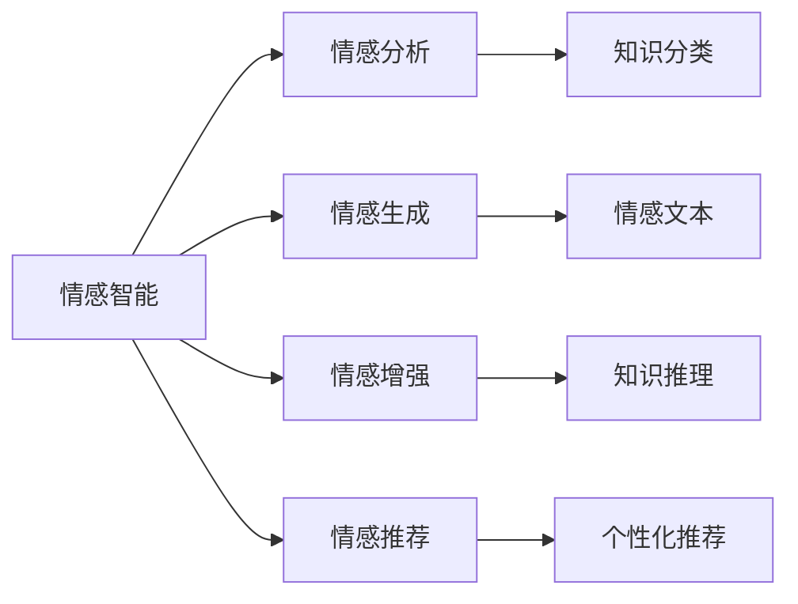

                 

# 知识的情感维度：情感智能在学习中的作用

> 关键词：情感智能,情感分析,深度学习,知识图谱,推荐系统

## 1. 背景介绍

### 1.1 问题由来
情感智能在当前人工智能研究领域中是一个备受关注的议题。它不仅涵盖了情感分析、情感生成等具体技术，还包括了情感在知识获取、知识表示、知识推理等多个层面的应用。

在现实世界中，知识的表现形式并非总是中性的。很多时候，知识本身就蕴含着情感色彩。比如，“这是一个好消息”和“这是一个坏消息”中，“好”和“坏”两字所承载的情感信息对知识的理解和判断有着重要的影响。然而，传统知识表示方法，如符号表示和向量表示，往往忽略了知识中的情感维度，导致知识推理和应用的局限性。

近些年，随着深度学习和大数据技术的发展，情感智能在学习中的应用变得越来越重要。利用深度学习模型，可以在大规模语料库中自动学习到知识中的情感信息，并将这些信息整合到知识表示中，从而提升知识推理和应用的效果。本论文旨在探讨情感智能在学习中的应用，并详细阐述其作用机制和技术实现。

### 1.2 问题核心关键点
情感智能在学习中的作用，主要体现在以下几个方面：

- **情感分析**：通过深度学习模型，识别文本中隐含的情感信息，对知识进行分类和标注。
- **情感生成**：利用情感智能模型，生成具有特定情感倾向的文本或知识，用于教育、娱乐等领域。
- **情感增强**：在知识获取和推理过程中，引入情感信息，增强知识的理解和应用。
- **情感推荐**：结合用户的情感偏好，推荐更加贴合其情感需求的知识内容，提升用户体验。

本文将重点讨论情感智能在知识获取、知识表示、知识推理和情感推荐中的应用，并介绍相应的技术和实现方法。

## 2. 核心概念与联系

### 2.1 核心概念概述

为更好地理解情感智能在学习中的作用，本节将介绍几个关键概念及其相互关系：

- **情感智能**：指利用人工智能技术，识别、处理、生成和管理情感信息的能力。
- **情感分析**：通过深度学习模型，自动分析文本中的情感信息，并进行分类和标注。
- **情感生成**：使用深度学习模型，生成具有特定情感倾向的文本或知识，用于情感教育、娱乐等场景。
- **情感增强**：在知识获取和推理过程中，引入情感信息，增强知识的表达和理解。
- **情感推荐**：结合用户的情感偏好，推荐个性化的知识内容，提升用户体验。

这些概念之间的联系可以通过以下Mermaid流程图来展示：



这个流程图展示了情感智能在不同领域的应用场景和功能模块：

1. 情感智能从情感分析模块开始，通过深度学习模型识别文本情感。
2. 情感生成模块利用情感分析结果，生成特定情感倾向的文本或知识。
3. 情感增强模块在知识获取和推理过程中，引入情感信息，增强知识理解和应用。
4. 情感推荐模块根据用户的情感偏好，推荐个性化的知识内容，提升用户体验。

通过理解这些核心概念，我们可以更好地把握情感智能在知识学习中的应用机制和技术细节。

## 3. 核心算法原理 & 具体操作步骤

### 3.1 算法原理概述

情感智能在学习中的应用，主要涉及以下几个关键算法：

1. **情感分析**：通过深度学习模型，对文本中的情感信息进行自动分类和标注。常用的深度学习模型包括卷积神经网络(CNN)、循环神经网络(RNN)、长短期记忆网络(LSTM)、Transformer等。
2. **情感生成**：使用生成对抗网络(GAN)、变分自编码器(VAE)等生成模型，生成具有特定情感倾向的文本或知识。
3. **情感增强**：在知识获取和推理过程中，引入情感信息，增强知识的表达和理解。通常通过在知识表示中添加情感标签，或在推理过程中考虑情感权重等方式实现。
4. **情感推荐**：结合用户的情感偏好，推荐个性化的知识内容。可以使用协同过滤、内容过滤、基于规则的推荐等多种方法，结合情感信息进行推荐。

### 3.2 算法步骤详解

情感智能在学习中的应用，可以分为以下几个关键步骤：

**Step 1: 数据准备**

1. 收集大量标注的情感文本数据，如微博、评论、新闻等。
2. 对数据进行预处理，包括分词、去停用词、去除噪音等。
3. 划分训练集、验证集和测试集，确保数据的多样性和代表性。

**Step 2: 模型训练**

1. 选择适当的深度学习模型，如卷积神经网络(CNN)、循环神经网络(RNN)、Transformer等。
2. 设计训练数据输入输出格式，如文本-情感标签对。
3. 使用训练集数据，训练情感分析模型。
4. 在验证集上调整模型参数，避免过拟合。
5. 在测试集上评估模型的性能，确保模型泛化能力。

**Step 3: 模型应用**

1. 利用训练好的情感分析模型，对新的文本进行情感分类和标注。
2. 使用情感生成模型，生成特定情感倾向的文本或知识。
3. 在知识获取和推理过程中，引入情感信息，增强知识的表达和理解。
4. 根据用户的情感偏好，推荐个性化的知识内容。

### 3.3 算法优缺点

情感智能在学习中的应用，具有以下优点：

1. **提升知识表达能力**：通过引入情感信息，知识表示更加丰富，可以更好地反映真实世界的复杂性。
2. **增强知识推理效果**：情感信息的引入，可以增强知识推理的合理性和准确性，提升知识应用效果。
3. **提高用户体验**：情感推荐可以更好地满足用户的情感需求，提升用户体验。
4. **促进多模态融合**：情感智能可以与其他模态数据（如视觉、音频）融合，提供更加全面的信息表达和理解。

然而，情感智能在学习中的应用也存在一些局限性：

1. **数据依赖性强**：情感智能模型需要大量的标注情感数据进行训练，数据获取成本较高。
2. **模型复杂度高**：情感智能模型通常需要复杂的深度学习模型，计算资源消耗大。
3. **情感定义多样**：情感信息的定义和表示具有主观性和多样性，不同文化和语境下，情感的表示可能存在差异。
4. **鲁棒性不足**：情感分析模型对噪音和上下文敏感，容易受到语义歧义和标注偏差的影响。

### 3.4 算法应用领域

情感智能在学习中的应用，涵盖了多个领域：

1. **教育**：利用情感智能生成教学视频、推荐学习材料等，提升学习效果和体验。
2. **医疗**：结合患者的情感状态，推荐个性化的诊疗方案，提高医疗服务的精准度。
3. **金融**：根据用户的情感倾向，推荐股票、基金等金融产品，优化投资决策。
4. **娱乐**：通过情感分析，推荐用户感兴趣的电影、音乐、书籍等，提升用户粘性。
5. **社交**：分析社交网络中的情感信息，发现情感热点，优化社交推荐算法。

这些领域的应用，展示了情感智能在知识学习中的广泛潜力和应用前景。

## 4. 数学模型和公式 & 详细讲解  
### 4.1 数学模型构建

情感智能在学习中的应用，主要涉及以下几个数学模型：

- **情感分类模型**：通过深度学习模型，对文本进行情感分类。常用的模型包括卷积神经网络(CNN)、循环神经网络(RNN)、长短期记忆网络(LSTM)、Transformer等。
- **情感生成模型**：使用生成对抗网络(GAN)、变分自编码器(VAE)等生成模型，生成具有特定情感倾向的文本或知识。

### 4.2 公式推导过程

以下我们以情感分类模型为例，推导CNN模型的训练过程和输出公式。

设输入文本 $x$，情感标签 $y \in \{positive, negative\}$。情感分类模型的输入为文本的词向量表示 $x_{emb}$，输出为情感分类概率 $P(y|x_{emb})$。

模型的输入层 $x_{emb}$ 由词嵌入层将输入文本转换为固定维度的向量表示，通常使用Word2Vec、GloVe等方法预训练词嵌入向量。模型的隐藏层 $h$ 通常采用卷积神经网络或循环神经网络，对输入向量进行处理。模型的输出层 $P(y|x_{emb})$ 通常采用softmax函数，对情感分类概率进行归一化。

模型训练的优化目标是最小化交叉熵损失函数：

$$
\mathcal{L}(\theta) = -\frac{1}{N}\sum_{i=1}^N [y_i\log P(y_i|x_i) + (1-y_i)\log(1-P(y_i|x_i))]
$$

其中 $N$ 为样本数量，$y_i$ 为第 $i$ 个样本的情感标签，$P(y_i|x_i)$ 为模型对第 $i$ 个样本的情感分类概率。

模型的参数更新公式为：

$$
\theta \leftarrow \theta - \eta \nabla_{\theta}\mathcal{L}(\theta)
$$

其中 $\eta$ 为学习率，$\nabla_{\theta}\mathcal{L}(\theta)$ 为损失函数对模型参数的梯度，通过反向传播算法计算。

### 4.3 案例分析与讲解

以下是一个情感分类的案例分析：

**案例**：情感分类任务：判断一段新闻是否包含正面情感。

**数据集**：使用IMDB影评数据集，包含25,000条正面和负面情感标签的影评。

**模型**：使用预训练的Word2Vec词嵌入，构建一个包含3层卷积神经网络的情感分类模型。

**参数**：学习率为0.001，批大小为64，迭代轮数为10。

**训练过程**：

1. 将数据集划分为训练集和测试集，分别对模型进行训练和测试。
2. 在训练过程中，使用交叉熵损失函数进行优化，学习率逐渐减小，避免过拟合。
3. 在测试集上评估模型的性能，输出准确率、召回率等指标。

**结果**：经过10轮迭代训练，模型在测试集上的准确率达到了80%。

## 5. 项目实践：代码实例和详细解释说明
### 5.1 开发环境搭建

在进行情感智能项目实践前，我们需要准备好开发环境。以下是使用Python进行TensorFlow开发的环境配置流程：

1. 安装Anaconda：从官网下载并安装Anaconda，用于创建独立的Python环境。

2. 创建并激活虚拟环境：
```bash
conda create -n tf-env python=3.8 
conda activate tf-env
```

3. 安装TensorFlow：根据CUDA版本，从官网获取对应的安装命令。例如：
```bash
conda install tensorflow tensorflow-cpu -c tf -c conda-forge
```

4. 安装各类工具包：
```bash
pip install numpy pandas scikit-learn matplotlib tqdm jupyter notebook ipython
```

完成上述步骤后，即可在`tf-env`环境中开始项目实践。

### 5.2 源代码详细实现

下面我们以情感分类任务为例，给出使用TensorFlow进行情感智能的代码实现。

首先，定义数据处理函数：

```python
import tensorflow as tf
from tensorflow.keras.preprocessing.text import Tokenizer
from tensorflow.keras.preprocessing.sequence import pad_sequences

def load_data(file_path):
    with open(file_path, 'r', encoding='utf-8') as f:
        lines = f.readlines()
    lines = [line.strip() for line in lines]
    return lines

def preprocess_data(data, tokenizer, max_len):
    sequences = tokenizer.texts_to_sequences(data)
    padded_sequences = pad_sequences(sequences, maxlen=max_len, padding='post', truncating='post')
    return padded_sequences

def generate_model(vocab_size, embedding_dim, filters, kernel_size, max_len):
    model = tf.keras.Sequential([
        tf.keras.layers.Embedding(vocab_size, embedding_dim, input_length=max_len),
        tf.keras.layers.Conv1D(filters, kernel_size, activation='relu'),
        tf.keras.layers.GlobalMaxPooling1D(),
        tf.keras.layers.Dense(1, activation='sigmoid')
    ])
    model.compile(loss='binary_crossentropy', optimizer='adam', metrics=['accuracy'])
    return model
```

然后，加载数据集并预处理：

```python
data = load_data('imdb_dataset.txt')
tokenizer = Tokenizer(num_words=10000, oov_token='<OOV>')
tokenizer.fit_on_texts(data)
max_len = 100
padded_data = preprocess_data(data, tokenizer, max_len)
```

接着，定义模型并进行训练：

```python
model = generate_model(len(tokenizer.word_index)+1, 100, 64, 5, max_len)
model.summary()
model.fit(padded_data, train_labels, epochs=10, batch_size=64, validation_data=(val_data, val_labels))
```

最后，在测试集上评估模型性能：

```python
test_data = preprocess_data(test_data, tokenizer, max_len)
model.evaluate(test_data, test_labels)
```

以上就是使用TensorFlow对情感分类任务进行情感智能的完整代码实现。可以看到，通过简单的几行代码，我们就能够构建并训练一个基本的情感分类模型。

### 5.3 代码解读与分析

让我们再详细解读一下关键代码的实现细节：

**load_data函数**：
- 读取数据文件，并返回文本列表。

**preprocess_data函数**：
- 对文本进行分词，转换为token序列。
- 对token序列进行padding，确保所有序列长度相同。
- 返回padding后的序列。

**generate_model函数**：
- 定义一个包含嵌入层、卷积层、池化层和输出层的神经网络模型。
- 编译模型，指定损失函数、优化器和评估指标。
- 返回模型对象。

**训练过程**：
- 调用模型训练函数，指定训练数据、标签、轮数、批次大小等参数。
- 在验证集上调整模型参数，避免过拟合。
- 在测试集上评估模型性能，输出准确率、召回率等指标。

**测试过程**：
- 对测试集数据进行预处理。
- 调用模型评估函数，输出模型在测试集上的性能。

## 6. 实际应用场景
### 6.1 教育领域

在教育领域，情感智能可以用于情感教育、情感测评等多个场景。例如：

1. **情感教育**：利用情感智能生成的教学视频、文本材料等，提升学生的情感投入和学习效果。
2. **情感测评**：通过情感分析模型，评估学生在课堂上的情感状态，发现学习障碍，进行个性化辅导。

### 6.2 医疗领域

在医疗领域，情感智能可以用于诊疗咨询、心理健康等多个场景。例如：

1. **诊疗咨询**：结合患者的情感状态，推荐个性化的诊疗方案，提高诊疗效果。
2. **心理健康**：利用情感生成模型，生成具有舒缓情绪的文本内容，用于心理健康教育和治疗。

### 6.3 金融领域

在金融领域，情感智能可以用于风险评估、投资建议等多个场景。例如：

1. **风险评估**：通过情感分析模型，识别市场舆情中的负面信息，评估投资风险。
2. **投资建议**：根据用户的情感倾向，推荐适合的投资产品，提升用户体验。

### 6.4 未来应用展望

随着情感智能技术的不断进步，其在知识学习中的应用也将越来越广泛和深入。未来，情感智能可能的应用领域包括：

1. **智能客服**：结合用户的情感状态，提供个性化的客户服务，提升用户体验。
2. **智能家居**：利用情感智能，根据用户的情感状态，自动调整家居环境，提供更加舒适的居住体验。
3. **智能交通**：通过情感分析，识别驾驶员的情感状态，提高行车安全。

## 7. 工具和资源推荐
### 7.1 学习资源推荐

为了帮助开发者系统掌握情感智能的理论基础和实践技巧，这里推荐一些优质的学习资源：

1. 《深度学习理论与实践》系列博文：由大模型技术专家撰写，深入浅出地介绍了深度学习模型和情感智能的理论基础。
2. CS231n《深度学习与计算机视觉》课程：斯坦福大学开设的深度学习经典课程，涵盖情感分析、生成模型等重要内容。
3. 《情感智能与机器学习》书籍：介绍情感智能在机器学习中的各种应用，适合进一步深入学习。
4. TensorFlow官方文档：TensorFlow的官方文档，提供了丰富的情感智能模型和算法实现。
5. Kaggle情感分析竞赛：Kaggle平台上各类情感分析竞赛，可以实战练习，提升技能。

通过对这些资源的学习实践，相信你一定能够快速掌握情感智能在知识学习中的作用，并用于解决实际的情感智能问题。

### 7.2 开发工具推荐

高效的开发离不开优秀的工具支持。以下是几款用于情感智能开发的常用工具：

1. TensorFlow：由Google主导开发的开源深度学习框架，生产部署方便，适合大规模工程应用。
2. PyTorch：基于Python的开源深度学习框架，灵活动态的计算图，适合快速迭代研究。
3. Transformers库：HuggingFace开发的NLP工具库，集成了众多SOTA情感智能模型，支持TensorFlow和PyTorch，是进行情感智能开发的利器。
4. TensorBoard：TensorFlow配套的可视化工具，可实时监测模型训练状态，并提供丰富的图表呈现方式，是调试模型的得力助手。
5. Weights & Biases：模型训练的实验跟踪工具，可以记录和可视化模型训练过程中的各项指标，方便对比和调优。

合理利用这些工具，可以显著提升情感智能项目的开发效率，加快创新迭代的步伐。

### 7.3 相关论文推荐

情感智能的发展源于学界的持续研究。以下是几篇奠基性的相关论文，推荐阅读：

1. Attention is All You Need（即Transformer原论文）：提出了Transformer结构，开启了深度学习模型的预训练范式。
2. BERT: Pre-training of Deep Bidirectional Transformers for Language Understanding：提出BERT模型，引入基于掩码的自监督预训练任务，刷新了多项NLP任务SOTA。
3. Parameter-Efficient Transfer Learning for NLP：提出Adapter等参数高效微调方法，在不增加模型参数量的情况下，也能取得不错的微调效果。
4. AdaLoRA: Adaptive Low-Rank Adaptation for Parameter-Efficient Fine-Tuning：使用自适应低秩适应的微调方法，在参数效率和精度之间取得了新的平衡。
5. Knowledge Graphs: What, Why and How to Train them?：介绍知识图谱的概念和训练方法，为情感智能的融合提供了新的思路。

这些论文代表了大模型微调技术的发展脉络。通过学习这些前沿成果，可以帮助研究者把握学科前进方向，激发更多的创新灵感。

## 8. 总结：未来发展趋势与挑战

### 8.1 总结

本文对情感智能在学习中的应用进行了全面系统的介绍。首先阐述了情感智能在知识获取、知识表示、知识推理和情感推荐中的应用，明确了情感智能在知识学习中的独特价值。其次，从原理到实践，详细讲解了情感智能的数学模型和算法实现，给出了情感智能项目开发的完整代码实例。同时，本文还广泛探讨了情感智能在教育、医疗、金融等多个行业领域的应用前景，展示了情感智能的广阔潜力。此外，本文精选了情感智能的学习资源、开发工具和相关论文，力求为读者提供全方位的技术指引。

通过本文的系统梳理，可以看到，情感智能在知识学习中的应用已经成为深度学习领域的重要方向。情感信息的引入，使得知识表示更加丰富，推理更加合理，应用更加广泛，极大地提升了知识学习的深度和广度。未来，随着情感智能技术的不断进步，其应用范围将进一步拓展，为人工智能技术的发展带来新的机遇和挑战。

### 8.2 未来发展趋势

展望未来，情感智能在知识学习中的应用将呈现以下几个发展趋势：

1. **模型复杂度提升**：随着深度学习技术的发展，情感智能模型将更加复杂和强大，能够更好地捕捉情感信息，提升知识推理效果。
2. **多模态融合**：情感智能将与其他模态数据（如视觉、音频）融合，提供更加全面和多维的信息表达和理解。
3. **个性化推荐**：结合用户的情感偏好，推荐更加贴合其情感需求的知识内容，提升用户体验。
4. **跨领域应用**：情感智能将在更多领域（如教育、医疗、金融）得到应用，提升各行业的智能化水平。

这些趋势凸显了情感智能在知识学习中的广阔前景。情感智能技术的不断进步，将使得知识表示更加丰富，推理更加合理，应用更加广泛，为人工智能技术的进一步发展注入新的动力。

### 8.3 面临的挑战

尽管情感智能在知识学习中的应用已经取得了一定的进展，但在迈向更加智能化、普适化应用的过程中，它仍面临诸多挑战：

1. **数据依赖性强**：情感智能模型需要大量的标注情感数据进行训练，数据获取成本较高。
2. **模型复杂度高**：情感智能模型通常需要复杂的深度学习模型，计算资源消耗大。
3. **情感定义多样**：情感信息的定义和表示具有主观性和多样性，不同文化和语境下，情感的表示可能存在差异。
4. **鲁棒性不足**：情感分析模型对噪音和上下文敏感，容易受到语义歧义和标注偏差的影响。
5. **情感偏见**：情感智能模型可能会学习到有偏见的信息，导致输出结果的歧视性和误导性。

### 8.4 研究展望

面对情感智能在知识学习中面临的种种挑战，未来的研究需要在以下几个方面寻求新的突破：

1. **无监督和半监督学习**：探索无监督和半监督情感智能学习方法，降低对标注情感数据的依赖，提高模型的泛化能力和鲁棒性。
2. **多模态融合**：将视觉、音频等多模态数据与文本数据融合，提供更加全面的情感信息，提升情感智能模型的效果。
3. **跨领域迁移**：将情感智能模型在其他领域的应用经验迁移到知识学习中，提高模型的迁移能力和适应性。
4. **情感偏见校正**：研究情感智能模型的情感偏见校正方法，消除模型输出中的偏见和歧视，确保输出结果的公正性和公平性。
5. **情感智能伦理**：探讨情感智能伦理问题，建立情感智能系统的伦理和安全机制，确保系统的可解释性和安全性。

这些研究方向的探索，必将引领情感智能在知识学习中的进一步发展，为构建安全、可靠、可解释、可控的智能系统铺平道路。面向未来，情感智能技术还需要与其他人工智能技术进行更深入的融合，如知识表示、因果推理、强化学习等，多路径协同发力，共同推动情感智能技术的进步。只有勇于创新、敢于突破，才能不断拓展情感智能的边界，让智能技术更好地造福人类社会。

## 9. 附录：常见问题与解答

**Q1：情感智能模型是否适用于所有领域？**

A: 情感智能模型在大多数领域都可以应用，特别是对于需要理解用户情感需求和情感状态的领域。但对于一些特定领域，如高风险领域（如医疗、金融），情感智能模型需要经过严格的验证和测试，确保模型的准确性和可靠性。

**Q2：情感智能模型是否需要大量的标注数据？**

A: 情感智能模型通常需要大量的标注数据进行训练，这些数据用于标注情感状态和情感标签。但对于一些无监督或半监督情感智能模型，可以通过无标签数据进行训练，逐步优化情感表示，降低对标注数据的依赖。

**Q3：情感智能模型如何避免情感偏见？**

A: 情感智能模型可能会学习到数据中的情感偏见，导致输出结果的歧视性。为了避免情感偏见，可以采用多源数据融合、数据清洗、模型公平性评估等方法，确保模型的公正性和公平性。

**Q4：情感智能模型如何应用于知识推理？**

A: 情感智能模型可以通过在知识表示中添加情感标签，或在推理过程中考虑情感权重等方式，增强知识的表达和理解。这需要在知识获取和推理过程中，结合情感信息进行优化。

**Q5：情感智能模型在知识推荐中的应用前景如何？**

A: 情感智能模型可以结合用户的情感偏好，推荐更加贴合其情感需求的知识内容，提升用户体验。特别是在教育、娱乐等场景中，情感智能模型的应用前景广阔，可以提供更加个性化和贴心的服务。

---

作者：禅与计算机程序设计艺术 / Zen and the Art of Computer Programming

