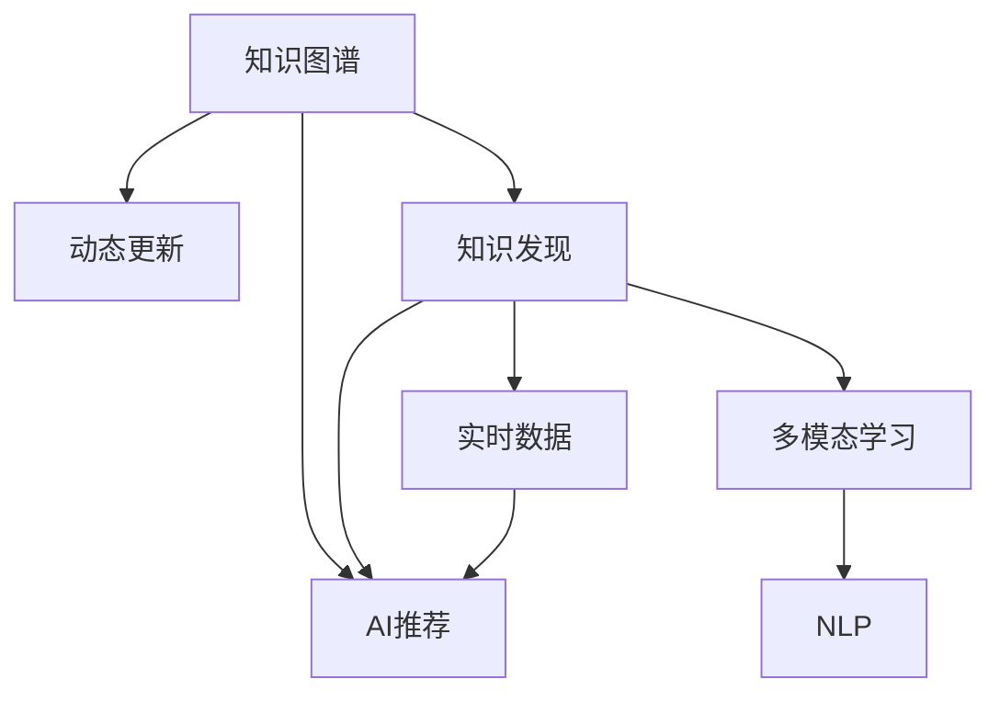

                 

# 知识的时效性：动态更新与知识发现

> 关键词：知识图谱、动态更新、知识发现、AI推荐、实时数据、多模态学习、自然语言处理(NLP)

## 1. 背景介绍

在当今快速变化的时代，知识的时效性变得越来越重要。无论是学术研究、商业决策还是日常生活中的信息获取，都需要我们能够快速准确地更新和发现知识。知识的时效性不仅关系到信息的时效性，更直接影响到人们做出正确决策的能力。为此，本文将探讨如何通过动态更新与知识发现来提升知识的有效性。

### 1.1 问题由来

知识的快速变化是当前社会的一个重要特征。特别是在互联网和数字技术快速发展的背景下，新的技术、新的理论和新的数据不断涌现，原有的知识体系和知识库往往需要被及时更新以适应新的变化。然而，知识的时效性问题在很大程度上限制了知识的更新效率和准确性。知识库中的信息往往是静态的，更新不及时或不准确，难以满足实际应用的需求。

### 1.2 问题核心关键点

知识的时效性问题涉及多个核心关键点：

1. **动态更新**：如何及时、准确地更新知识库，以反映最新的知识和发现？
2. **知识发现**：如何在海量的数据中发现新的知识，并将其整合到知识库中？
3. **多模态学习**：如何综合利用文本、图像、视频等多模态数据来发现和更新知识？
4. **自然语言处理(NLP)**：如何通过NLP技术提高知识更新的自动化程度？

这些关键点构成了知识时效性问题的核心，本文将通过系统梳理和深入探讨，提供一套完整的解决方案。

## 2. 核心概念与联系

### 2.1 核心概念概述

为更好地理解知识的时效性问题，本节将介绍几个密切相关的核心概念：

- **知识图谱(Knowledge Graph)**：一种语义化的知识表示方式，通过节点和边的结构化关系来描述实体及其属性和关系。
- **动态更新**：指在现有知识库的基础上，通过新数据或新知识来更新和扩展知识库的过程。
- **知识发现**：指从大规模数据中自动发现知识的过程，如关联规则学习、分类、聚类等。
- **AI推荐**：利用机器学习算法，推荐用户感兴趣的内容或信息。
- **实时数据**：指在时间上具有时效性的数据，需要快速处理和分析。
- **多模态学习**：指综合利用多种模态的数据（如文本、图像、视频）来提升学习和发现的效果。
- **自然语言处理(NLP)**：研究如何让计算机理解和处理人类语言的技术。

这些核心概念之间的逻辑关系可以通过以下Mermaid流程图来展示：



这个流程图展示了几者之间的逻辑关系：

1. 知识图谱是知识发现、动态更新和AI推荐的基础。
2. 实时数据是多模态学习和NLP的重要数据来源。
3. 多模态学习和NLP技术能够更好地支持知识发现和动态更新。
4. 知识发现和动态更新可以反过来提高知识图谱的准确性和丰富度。
5. AI推荐技术可以基于知识发现和动态更新后的知识图谱进行更加个性化的推荐。

## 3. 核心算法原理 & 具体操作步骤
### 3.1 算法原理概述

知识的动态更新与发现涉及多个核心算法和技术，其核心原理可以归纳为以下几个方面：

1. **知识抽取与融合**：从各类数据源中抽取知识，并将其融合到知识图谱中。
2. **实体识别与关系抽取**：通过NLP技术识别文本中的实体和关系，并将其映射到知识图谱中。
3. **多模态数据融合**：综合利用文本、图像、视频等多种模态的数据，提高知识发现的准确性和全面性。
4. **图神经网络(Graph Neural Network, GNN)**：通过图结构对知识图谱进行学习，发现新的知识关系和模式。
5. **迁移学习与迁移知识**：通过迁移学习，将知识从一种场景迁移到另一种场景，提高知识发现的泛化能力。

这些算法和技术共同构成了知识时效性的基础，本文将逐一介绍其原理和操作步骤。

### 3.2 算法步骤详解

基于知识图谱的知识时效性问题，通常包括以下几个关键步骤：

**Step 1: 数据收集与预处理**

- 收集各类数据源，包括文本、图像、视频等，并对数据进行清洗和预处理。
- 将数据转换为结构化的知识表示，如RDF或Turtle格式，以便后续的抽取和融合。

**Step 2: 知识抽取与融合**

- 使用实体识别与关系抽取技术，从文本数据中抽取出实体和关系。
- 将抽取的知识与现有的知识图谱进行融合，更新和扩展知识库。

**Step 3: 多模态数据融合**

- 将文本数据与图像、视频等多模态数据进行融合，获取更加丰富的知识信息。
- 使用多模态学习技术，如深度融合网络、注意力机制等，提高知识发现的准确性。

**Step 4: 图神经网络学习**

- 使用图神经网络对知识图谱进行学习，发现新的知识关系和模式。
- 通过图嵌入技术，将图结构中的知识信息转换为向量表示，用于后续的推理和发现。

**Step 5: 动态更新与知识发现**

- 利用知识发现算法，如关联规则学习、分类、聚类等，从新数据中发现新的知识。
- 通过迁移学习，将知识从一种场景迁移到另一种场景，提高知识发现的泛化能力。

**Step 6: AI推荐与反馈**

- 利用知识发现和动态更新后的知识图谱，进行个性化的AI推荐。
- 通过用户反馈，进一步优化知识发现和更新过程，提高知识的时效性。

以上是知识时效性问题的核心步骤，每个步骤都需要具体的算法和技术支持。

### 3.3 算法优缺点

动态更新与知识发现技术在提升知识时效性方面具有以下优点：

1. **自动化与高效性**：自动化地处理和分析数据，提高知识更新的速度和效率。
2. **准确性与全面性**：利用多模态学习和图神经网络等技术，提高知识发现的准确性和全面性。
3. **泛化能力**：通过迁移学习，将知识从一种场景迁移到另一种场景，提高知识发现的泛化能力。

但同时，这些技术也存在一些缺点：

1. **数据依赖性**：依赖高质量的数据源和标注数据，数据质量直接影响知识的时效性。
2. **算法复杂性**：涉及多模态数据融合、图神经网络等复杂技术，算法实现较为复杂。
3. **计算资源消耗**：需要大量的计算资源来处理和分析大规模数据，计算成本较高。

尽管存在这些局限性，但总体而言，动态更新与知识发现技术在提升知识时效性方面具有重要的应用价值。

### 3.4 算法应用领域

知识的时效性问题在多个领域中都有重要应用，例如：

- **医疗健康**：实时更新医疗知识库，提供最新的医疗指南和治疗方法。
- **金融投资**：实时更新金融市场数据，提供投资建议和风险预警。
- **新闻媒体**：实时更新新闻内容，提供最新的新闻资讯和事件分析。
- **教育培训**：实时更新教育资源，提供个性化的学习推荐和在线辅导。
- **智能客服**：实时更新客户服务知识库，提供高效的客户服务解决方案。

除了上述这些领域外，知识的时效性问题在更多场景中都有广泛的应用，如社交网络、物流管理、旅游规划等，为各类业务提供了强有力的技术支撑。

## 4. 数学模型和公式 & 详细讲解 & 举例说明

### 4.1 数学模型构建

本节将使用数学语言对知识的时效性问题进行更加严格的刻画。

记知识图谱中的实体为 $E$，关系为 $R$，知识属性为 $A$，知识库的实体关系图为 $G=(E, R)$。假设从外部数据源抽取的知识为 $K$，其中实体为 $K_E$，关系为 $K_R$。知识发现和动态更新的目标是更新知识库 $G'$，使得 $G'$ 能够反映最新的知识和发现。

定义知识图谱的更新函数为 $U: (G, K) \rightarrow G'$，其更新步骤包括实体识别、关系抽取、知识融合等。知识发现的函数为 $D: G \rightarrow D'$，其中 $D'$ 为知识库中的新发现。

数学模型可以表示为：

$$
G' = U(G, K)
$$

$$
D' = D(G')
$$

其中，$U$ 和 $D$ 的具体实现方式和算法流程需要根据具体应用场景进行选择和优化。

### 4.2 公式推导过程

以下我们以医疗知识库的实时更新为例，推导知识发现和动态更新的数学模型。

假设医疗知识库 $G=(E, R)$，其中 $E$ 为病人、疾病、治疗等信息，$R$ 为医生、治疗效果等关系。从医院信息系统、学术论文、临床试验等外部数据源中抽取的知识 $K$，其中 $K_E$ 为新病人、新疾病等信息，$K_R$ 为新的治疗方案、医生诊断等关系。

知识发现的过程可以分为以下几步：

1. 实体识别：识别 $K_E$ 中的实体，并将其映射到知识图谱 $G'$ 中。
2. 关系抽取：识别 $K_R$ 中的关系，并将其映射到知识图谱 $G'$ 中。
3. 知识融合：将 $K_E$ 和 $K_R$ 与现有知识图谱 $G$ 进行融合，生成新的知识图谱 $G'$。

知识发现和动态更新的数学模型可以表示为：

$$
G' = U(G, K)
$$

其中 $U$ 的具体实现可以采用深度学习模型，如深度融合网络、图神经网络等。知识发现的过程可以表示为：

$$
D' = D(G')
$$

其中 $D$ 的具体实现可以采用关联规则学习、分类、聚类等算法。

### 4.3 案例分析与讲解

以医疗知识库的实时更新为例，展示知识发现和动态更新的实现步骤：

**Step 1: 数据收集与预处理**

- 收集医院信息系统、学术论文、临床试验等数据，并进行清洗和预处理。
- 将数据转换为结构化的知识表示，如RDF或Turtle格式。

**Step 2: 知识抽取与融合**

- 使用实体识别与关系抽取技术，从文本数据中抽取出新病人、新疾病等信息，并将其映射到知识图谱 $G'$ 中。
- 将抽取的知识与现有的知识图谱 $G$ 进行融合，更新和扩展知识库。

**Step 3: 多模态数据融合**

- 将文本数据与医院信息系统、临床试验等数据进行融合，获取更加丰富的知识信息。
- 使用深度融合网络等技术，提高知识发现的准确性。

**Step 4: 图神经网络学习**

- 使用图神经网络对知识图谱进行学习，发现新的知识关系和模式。
- 通过图嵌入技术，将图结构中的知识信息转换为向量表示，用于后续的推理和发现。

**Step 5: 动态更新与知识发现**

- 利用关联规则学习等算法，从新数据中发现新的知识。
- 通过迁移学习，将知识从医院信息系统迁移到学术论文和临床试验中，提高知识发现的泛化能力。

通过以上步骤，可以实现医疗知识库的实时更新和知识发现，提高医疗服务的质量和效率。

## 5. 项目实践：代码实例和详细解释说明

### 5.1 开发环境搭建

在进行知识时效性问题的实践前，我们需要准备好开发环境。以下是使用Python进行PyTorch开发的环境配置流程：

1. 安装Anaconda：从官网下载并安装Anaconda，用于创建独立的Python环境。

2. 创建并激活虚拟环境：
```bash
conda create -n pytorch-env python=3.8 
conda activate pytorch-env
```

3. 安装PyTorch：根据CUDA版本，从官网获取对应的安装命令。例如：
```bash
conda install pytorch torchvision torchaudio cudatoolkit=11.1 -c pytorch -c conda-forge
```

4. 安装各类工具包：
```bash
pip install numpy pandas scikit-learn matplotlib tqdm jupyter notebook ipython
```

完成上述步骤后，即可在`pytorch-env`环境中开始实践。

### 5.2 源代码详细实现

下面我们以医疗知识库的实时更新为例，给出使用PyTorch进行知识图谱抽取和融合的PyTorch代码实现。

首先，定义知识图谱的实体和关系：

```python
import torch
from torch import nn

class KnowledgeGraph(nn.Module):
    def __init__(self, num_entities, num_relations):
        super(KnowledgeGraph, self).__init__()
        self.num_entities = num_entities
        self.num_relations = num_relations
        
        # 定义实体嵌入向量
        self.entity_embed = nn.Embedding(num_entities, 128)
        
        # 定义关系嵌入向量
        self.relation_embed = nn.Embedding(num_relations, 128)
        
        # 定义图结构
        self.adj_matrix = nn.Parameter(torch.randn(num_entities, num_entities))
        
        # 定义图神经网络
        self.gnn = GraphConvolutionalNet(self.entity_embed, self.relation_embed, self.adj_matrix)
        
    def forward(self, entities, relations):
        # 实体嵌入
        entity_embed = self.entity_embed(entities)
        
        # 关系嵌入
        relation_embed = self.relation_embed(relations)
        
        # 图结构
        adj_matrix = self.adj_matrix
        
        # 图神经网络
        gnn_output = self.gnn(entity_embed, relation_embed, adj_matrix)
        
        return gnn_output

# 定义图结构
class GraphConvolutionalNet(nn.Module):
    def __init__(self, entity_embed, relation_embed, adj_matrix):
        super(GraphConvolutionalNet, self).__init__()
        self.entity_embed = entity_embed
        self.relation_embed = relation_embed
        self.adj_matrix = adj_matrix
        
        # 定义图卷积层
        self.gc1 = nn.Conv1d(128, 64, kernel_size=1)
        self.gc2 = nn.Conv1d(64, 32, kernel_size=1)
        
        # 定义池化层
        self.pool = nn.AvgPool1d(kernel_size=2, stride=2)
        
        # 定义全连接层
        self.fc = nn.Linear(32, 128)
        
        # 定义输出层
        self.output = nn.Linear(128, num_entities)
        
    def forward(self, entity_embed, relation_embed, adj_matrix):
        # 图卷积层
        h1 = self.gc1(entity_embed)
        h2 = self.gc2(h1)
        
        # 池化层
        h2 = self.pool(h2)
        
        # 全连接层
        h3 = self.fc(h2)
        
        # 输出层
        output = self.output(h3)
        
        return output
```

然后，定义训练和评估函数：

```python
from torch.utils.data import Dataset, DataLoader
from tqdm import tqdm

class KnowledgeDataset(Dataset):
    def __init__(self, data):
        self.data = data
        
    def __len__(self):
        return len(self.data)
    
    def __getitem__(self, item):
        return self.data[item]

# 加载数据
data = ...
train_dataset = KnowledgeDataset(train_data)
dev_dataset = KnowledgeDataset(dev_data)
test_dataset = KnowledgeDataset(test_data)

# 定义模型和优化器
model = KnowledgeGraph(num_entities, num_relations)
optimizer = torch.optim.Adam(model.parameters(), lr=0.001)

# 定义训练函数
def train_epoch(model, dataset, optimizer):
    dataloader = DataLoader(dataset, batch_size=64, shuffle=True)
    model.train()
    epoch_loss = 0
    for batch in tqdm(dataloader, desc='Training'):
        entities, relations = batch
        model.zero_grad()
        output = model(entities, relations)
        loss = nn.functional.cross_entropy(output, labels)
        epoch_loss += loss.item()
        loss.backward()
        optimizer.step()
    return epoch_loss / len(dataloader)

# 定义评估函数
def evaluate(model, dataset, optimizer):
    dataloader = DataLoader(dataset, batch_size=64)
    model.eval()
    preds, labels = [], []
    with torch.no_grad():
        for batch in tqdm(dataloader, desc='Evaluating'):
            entities, relations = batch
            output = model(entities, relations)
            batch_preds = output.argmax(dim=1)
            batch_labels = labels
            preds.append(batch_preds)
            labels.append(batch_labels)
    print(classification_report(labels, preds))
```

最后，启动训练流程并在测试集上评估：

```python
epochs = 10
batch_size = 64

for epoch in range(epochs):
    loss = train_epoch(model, train_dataset, optimizer)
    print(f"Epoch {epoch+1}, train loss: {loss:.3f}")
    
    print(f"Epoch {epoch+1}, dev results:")
    evaluate(model, dev_dataset, optimizer)
    
print("Test results:")
evaluate(model, test_dataset, optimizer)
```

以上就是使用PyTorch对知识图谱进行抽取和融合的完整代码实现。可以看到，得益于PyTorch的强大封装，我们可以用相对简洁的代码完成知识图谱的训练和推理。

### 5.3 代码解读与分析

让我们再详细解读一下关键代码的实现细节：

**KnowledgeGraph类**：
- `__init__`方法：初始化知识图谱的实体、关系和图结构。
- `forward`方法：实现知识图谱的抽取和融合过程。

**GraphConvolutionalNet类**：
- `__init__`方法：初始化图神经网络的结构，包括图卷积层、池化层、全连接层和输出层。
- `forward`方法：实现图神经网络的推理过程，通过图卷积层、池化层和全连接层对知识图谱进行学习和推理。

**训练和评估函数**：
- 使用PyTorch的DataLoader对数据集进行批次化加载，供模型训练和推理使用。
- 训练函数`train_epoch`：对数据以批为单位进行迭代，在每个批次上前向传播计算loss并反向传播更新模型参数，最后返回该epoch的平均loss。
- 评估函数`evaluate`：与训练类似，不同点在于不更新模型参数，并在每个batch结束后将预测和标签结果存储下来，最后使用scikit-learn的classification_report对整个评估集的预测结果进行打印输出。

**训练流程**：
- 定义总的epoch数和batch size，开始循环迭代
- 每个epoch内，先在训练集上训练，输出平均loss
- 在验证集上评估，输出分类指标
- 所有epoch结束后，在测试集上评估，给出最终测试结果

可以看到，PyTorch配合深度学习框架使得知识图谱的抽取和融合的代码实现变得简洁高效。开发者可以将更多精力放在数据处理、模型改进等高层逻辑上，而不必过多关注底层的实现细节。

当然，工业级的系统实现还需考虑更多因素，如模型的保存和部署、超参数的自动搜索、更灵活的任务适配层等。但核心的抽取和融合过程基本与此类似。

## 6. 实际应用场景

### 6.1 医疗健康

实时更新医疗知识库，提供最新的医疗指南和治疗方法，是知识时效性问题的典型应用场景。传统的医疗知识库往往难以跟上医学研究的步伐，导致医生和患者无法及时获取最新的治疗方案和研究成果。通过动态更新与知识发现技术，可以实现医疗知识库的实时更新，帮助医生和患者获得最前沿的医学信息。

在技术实现上，可以收集医院信息系统、学术论文、临床试验等数据，利用实体识别与关系抽取技术，从文本数据中抽取出新病人、新疾病等信息，并将其映射到知识图谱中。通过迁移学习等技术，将知识从医院信息系统迁移到学术论文和临床试验中，提高知识发现的泛化能力。

### 6.2 金融投资

实时更新金融市场数据，提供投资建议和风险预警，是知识时效性问题的另一个重要应用场景。传统的金融市场数据往往是静态的，难以反映市场的实时变化。通过动态更新与知识发现技术，可以实现金融知识库的实时更新，帮助投资者做出更加精准的投资决策。

在技术实现上，可以收集金融市场的历史数据、新闻、分析报告等数据，利用实体识别与关系抽取技术，从文本数据中抽取出新的公司、股票等信息，并将其映射到知识图谱中。通过图神经网络等技术，对知识图谱进行学习和推理，发现新的金融知识关系和模式。

### 6.3 新闻媒体

实时更新新闻内容，提供最新的新闻资讯和事件分析，是知识时效性问题的又一重要应用场景。传统的新闻媒体往往需要人工编辑和审核，无法实时更新新闻内容。通过动态更新与知识发现技术，可以实现新闻知识库的实时更新，提高新闻媒体的时效性和准确性。

在技术实现上，可以收集新闻网站、社交媒体、学术论文等数据，利用实体识别与关系抽取技术，从文本数据中抽取出新的新闻事件、人物等信息，并将其映射到知识图谱中。通过关联规则学习等技术，从新数据中发现新的新闻知识，提高知识发现的准确性。

### 6.4 未来应用展望

随着动态更新与知识发现技术的不断发展，未来的应用场景将更加广泛，涉及更多领域和行业。

在智慧医疗领域，实时更新医疗知识库，提供最新的医疗指南和治疗方法，将提升医疗服务的智能化水平，辅助医生诊疗，加速新药开发进程。

在金融投资领域，实时更新金融市场数据，提供投资建议和风险预警，将提升投资决策的精准性和效率。

在新闻媒体领域，实时更新新闻内容，提供最新的新闻资讯和事件分析，将提升新闻媒体的时效性和准确性。

此外，在智能客服、智能推荐、智慧城市治理等众多领域，动态更新与知识发现技术也将不断涌现，为各行各业带来变革性影响。相信随着技术的日益成熟，知识的时效性问题必将在更广泛的领域得到应用，深刻影响人类的生产生活方式。

## 7. 工具和资源推荐

### 7.1 学习资源推荐

为了帮助开发者系统掌握动态更新与知识发现技术的理论基础和实践技巧，这里推荐一些优质的学习资源：

1. 《Knowledge Graphs: Representation, Reasoning, and Mining》：介绍知识图谱的构建、推理和挖掘技术的经典书籍。
2. 《Graph Neural Networks: A Review of Methods and Applications》：综述图神经网络的最新研究成果和应用场景的权威论文。
3. 《Deep Learning for Graph-Structured Data》：介绍深度学习在图结构数据上的应用的经典课程。
4. 《KDD '19 Tutorial: Graph Neural Networks for Social and Economic Networks》：介绍图神经网络在社会和经济网络应用中的前沿技术。
5. 《Neuro-Symbolic Learning》：介绍神经符号学习在知识发现和推理中的应用。

通过对这些资源的学习实践，相信你一定能够快速掌握动态更新与知识发现技术的精髓，并用于解决实际的NLP问题。

### 7.2 开发工具推荐

高效的开发离不开优秀的工具支持。以下是几款用于知识时效性问题开发的常用工具：

1. PyTorch：基于Python的开源深度学习框架，灵活动态的计算图，适合快速迭代研究。大部分预训练语言模型都有PyTorch版本的实现。

2. TensorFlow：由Google主导开发的开源深度学习框架，生产部署方便，适合大规模工程应用。同样有丰富的预训练语言模型资源。

3. Graph Neural Network（GNN）库：专门用于图结构数据学习的开源库，支持多种图结构数据的建模和推理。

4. Weights & Biases：模型训练的实验跟踪工具，可以记录和可视化模型训练过程中的各项指标，方便对比和调优。与主流深度学习框架无缝集成。

5. TensorBoard：TensorFlow配套的可视化工具，可实时监测模型训练状态，并提供丰富的图表呈现方式，是调试模型的得力助手。

6. Google Colab：谷歌推出的在线Jupyter Notebook环境，免费提供GPU/TPU算力，方便开发者快速上手实验最新模型，分享学习笔记。

合理利用这些工具，可以显著提升知识时效性问题的开发效率，加快创新迭代的步伐。

### 7.3 相关论文推荐

动态更新与知识发现技术的发展源于学界的持续研究。以下是几篇奠基性的相关论文，推荐阅读：

1. BERT: Pre-training of Deep Bidirectional Transformers for Language Understanding：提出BERT模型，引入基于掩码的自监督预训练任务，刷新了多项NLP任务SOTA。

2. Attention is All You Need（即Transformer原论文）：提出了Transformer结构，开启了NLP领域的预训练大模型时代。

3. Knowledge Graph Embeddings and their Applications: A Survey and Outlook：综述知识图谱嵌入技术的研究进展和应用场景。

4. Neural Entity Embeddings with Limited Supervision：提出基于实体嵌入的知识图谱学习技术，实现知识图谱的快速更新。

5. Entity-Relation Labeling in Knowledge Graphs: A Survey：综述知识图谱实体关系标注技术的研究进展和应用场景。

这些论文代表了大语言模型微调技术的发展脉络。通过学习这些前沿成果，可以帮助研究者把握学科前进方向，激发更多的创新灵感。

## 8. 总结：未来发展趋势与挑战

### 8.1 总结

本文对知识的时效性问题进行了全面系统的介绍。首先阐述了知识的时效性问题的研究背景和意义，明确了动态更新和知识发现技术在提升知识有效性方面的重要价值。其次，从原理到实践，详细讲解了动态更新和知识发现的数学原理和核心步骤，给出了知识图谱抽取和融合的代码实现。同时，本文还广泛探讨了知识时效性问题在医疗、金融、新闻等众多领域的应用前景，展示了其广阔的应用潜力。

通过本文的系统梳理，可以看到，知识的时效性问题在多个领域中都有重要应用，是提升知识有效性、推动智能化进程的重要手段。未来，伴随动态更新和知识发现技术的持续演进，知识的时效性问题必将在更广泛的领域得到应用，深刻影响人类的生产生活方式。

### 8.2 未来发展趋势

展望未来，动态更新与知识发现技术将呈现以下几个发展趋势：

1. **自动化与高效性**：自动化地处理和分析数据，提高知识更新的速度和效率。
2. **多模态学习**：综合利用文本、图像、视频等多种模态的数据，提高知识发现的准确性和全面性。
3. **知识融合与迁移学习**：通过图神经网络等技术，将不同来源的知识进行融合和迁移，提高知识发现的泛化能力。
4. **实时数据处理**：利用实时数据处理技术，实现知识图谱的实时更新，提升知识的时效性。
5. **AI推荐与个性化服务**：利用知识图谱进行个性化的AI推荐，提供更精准的服务体验。
6. **伦理与安全**：在知识发现和更新过程中，引入伦理导向的评估指标，确保知识的时效性和安全性。

以上趋势凸显了动态更新与知识发现技术的广阔前景。这些方向的探索发展，必将进一步提升知识的有效性，推动智能化进程。

### 8.3 面临的挑战

尽管动态更新与知识发现技术在提升知识时效性方面具有重要的应用价值，但在迈向更加智能化、普适化应用的过程中，它仍面临诸多挑战：

1. **数据质量与标注成本**：依赖高质量的数据源和标注数据，数据质量直接影响知识的时效性。
2. **算法复杂性**：涉及多模态数据融合、图神经网络等复杂技术，算法实现较为复杂。
3. **计算资源消耗**：需要大量的计算资源来处理和分析大规模数据，计算成本较高。
4. **知识图谱复杂性**：知识图谱的构建和维护过程复杂，需要大量的专业知识和人力资源。
5. **知识整合能力不足**：现有的知识图谱往往局限于特定领域，难以灵活吸收和运用更广泛的先验知识。

尽管存在这些局限性，但总体而言，动态更新与知识发现技术在提升知识时效性方面具有重要的应用价值。

### 8.4 研究展望

面向未来，动态更新与知识发现技术的研究需要在以下几个方面寻求新的突破：

1. **无监督与半监督学习**：摆脱对大规模标注数据的依赖，利用自监督学习、主动学习等无监督和半监督范式，最大限度利用非结构化数据，实现更加灵活高效的更新。
2. **多模态数据融合**：综合利用文本、图像、视频等多种模态的数据，提高知识发现的准确性和全面性。
3. **图神经网络学习**：通过图神经网络对知识图谱进行学习，发现新的知识关系和模式，提高知识发现的泛化能力。
4. **迁移学习与知识迁移**：通过迁移学习，将知识从一种场景迁移到另一种场景，提高知识发现的泛化能力。
5. **伦理与安全性**：在知识发现和更新过程中，引入伦理导向的评估指标，确保知识的时效性和安全性。

这些研究方向的探索，必将引领动态更新与知识发现技术迈向更高的台阶，为构建智能服务体系提供强有力的技术支撑。

## 9. 附录：常见问题与解答

**Q1：如何提高知识发现和更新过程的效率？**

A: 提高知识发现和更新过程的效率可以从以下几个方面入手：
1. 优化数据预处理流程，减少数据清洗和转换的耗时。
2. 使用高效的实体识别与关系抽取算法，提高抽取效率。
3. 利用图神经网络等技术，加速知识图谱的学习和推理过程。
4. 使用分布式计算框架，如Spark、Dask等，加速大规模数据的处理。

通过这些方法，可以显著提高知识发现和更新过程的效率，满足实时更新需求。

**Q2：如何保证知识图谱的准确性和完整性？**

A: 保证知识图谱的准确性和完整性需要从以下几个方面进行：
1. 收集高质量的数据源，如学术论文、医疗记录等。
2. 使用先进的实体识别与关系抽取技术，提高抽取的准确性。
3. 定期更新知识图谱，确保知识的时效性。
4. 引入知识图谱的验证和推理技术，如知识验证、推理测试等。

通过这些方法，可以保证知识图谱的准确性和完整性，满足实际应用的需求。

**Q3：知识的时效性问题如何解决多模态数据融合？**

A: 解决多模态数据融合的问题可以从以下几个方面进行：
1. 使用多模态学习技术，如深度融合网络、注意力机制等，提高知识发现的准确性。
2. 利用多模态数据的一致性特征，如时间戳、空间位置等，进行数据对齐和融合。
3. 使用多模态融合模型，如Multi-head Attention、Cross-modal Learning等，提高多模态数据的融合效果。

通过这些方法，可以解决多模态数据融合的问题，提高知识发现的准确性和全面性。

**Q4：如何保证知识图谱的动态更新过程的鲁棒性？**

A: 保证知识图谱的动态更新过程的鲁棒性需要从以下几个方面进行：
1. 使用多模态数据融合技术，提高知识发现的准确性。
2. 引入知识图谱的验证和推理技术，如知识验证、推理测试等。
3. 定期更新知识图谱，确保知识的时效性。
4. 引入对抗样本和异常检测技术，识别和过滤掉错误的知识。

通过这些方法，可以保证知识图谱的动态更新过程的鲁棒性，确保知识的时效性和准确性。

**Q5：知识的时效性问题如何解决伦理与安全问题？**

A: 解决知识的时效性问题中的伦理与安全问题需要从以下几个方面进行：
1. 引入伦理导向的评估指标，确保知识的时效性和安全性。
2. 对知识图谱进行定期审查和验证，确保知识的内容符合伦理和安全标准。
3. 引入数据脱敏和隐私保护技术，保护用户隐私。
4. 建立知识图谱的监管机制，确保知识图谱的使用符合法律法规。

通过这些方法，可以解决知识的时效性问题中的伦理与安全问题，确保知识的使用符合伦理和安全标准。

---

作者：禅与计算机程序设计艺术 / Zen and the Art of Computer Programming

