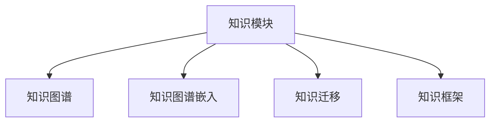

                 

# 知识的模块化：提高学习效率的策略

## 1. 背景介绍

### 1.1 问题由来

在信息化时代，知识量的激增为学习和研究提供了更多的资源，但也带来了知识的碎片化和难以整合的问题。如何有效地组织、学习和应用知识，成为学习者面临的一项重要挑战。本文章将探讨知识的模块化方法，通过系统地、模块化地组织和应用知识，来提高学习效率，提升问题解决能力。

### 1.2 问题核心关键点

知识模块化方法的核心在于将复杂的大知识体系，分解为多个小模块，使知识结构化、条理化，从而便于学习者吸收和应用。具体来说，模块化知识体系具有以下几个特点：

1. **模块化**：将知识分解为独立的模块，每个模块涵盖特定领域的核心知识点，易于理解和掌握。
2. **层次化**：模块之间具有清晰的层级关系，由基础模块向高级模块逐步过渡，有助于逐步深化理解。
3. **可组合性**：模块可以自由组合，灵活构建新的知识体系，适应不同的学习需求。
4. **可扩展性**：模块体系可以不断扩展，加入新的知识点，保持知识的更新和迭代。

## 2. 核心概念与联系

### 2.1 核心概念概述

为更好地理解知识的模块化方法，本节将介绍几个关键概念：

- **知识模块**：指将知识分解为独立的小模块，每个模块涵盖特定的核心知识点。
- **知识图谱**：一种用于描述知识结构关系的图，由节点和边构成，节点表示知识点，边表示知识点之间的关系。
- **知识图谱嵌入**：通过向量化技术，将知识图谱中的节点映射到向量空间，用于计算节点间的相似度和关系。
- **知识迁移**：指将一个领域学习的知识应用到另一个领域的过程，模块化知识体系为知识迁移提供了便利。
- **知识框架**：一种用于组织和管理知识体系的框架，帮助学习者更好地掌握知识结构。

这些概念之间的逻辑关系可以通过以下Mermaid流程图来展示：



这个流程图展示了几组核心概念之间的关系：

1. 知识模块化是构建知识体系的基础，通过模块化知识图谱，可以更好地进行知识迁移和应用。
2. 知识图谱嵌入技术，将知识图谱中的节点映射到向量空间，为计算节点间的相似度和关系提供了支持。
3. 知识框架，作为组织和管理知识体系的框架，帮助学习者更好地理解和应用知识。

## 3. 核心算法原理 & 具体操作步骤

### 3.1 算法原理概述

知识模块化方法基于知识图谱和知识框架，通过将知识分解为独立的模块，使知识结构化、条理化，从而便于学习者吸收和应用。其核心思想是：将复杂的大知识体系，分解为多个小模块，每个模块涵盖特定领域的核心知识点，使知识结构更加清晰、层次更加分明。

### 3.2 算法步骤详解

知识模块化方法主要包括以下几个关键步骤：

**Step 1: 构建知识图谱**
- 收集领域相关的知识点，构建知识图谱。节点表示知识点，边表示知识点之间的关系。
- 确定知识点的属性和关系类型，如属性、实体关系、属性关系等。
- 使用知识图谱嵌入技术，将知识图谱中的节点映射到向量空间，用于计算节点间的相似度和关系。

**Step 2: 设计知识框架**
- 设计知识框架的层次结构，确定基础模块和高级模块。
- 确定模块之间的依赖关系，确保知识框架的逻辑连贯性和可扩展性。
- 选择合适的可视化工具，如D3.js、Gephi等，将知识框架可视化，便于理解和管理。

**Step 3: 创建知识模块**
- 根据知识框架的层次结构，将知识点分解为独立的模块。
- 为每个模块设计详细的说明文档，包括知识点描述、应用场景、示例代码等。
- 将模块转换为可执行的学习材料，如视频、PPT、代码示例等。

**Step 4: 组合与扩展**
- 根据学习需求，自由组合不同的模块，构建新的知识体系。
- 持续更新和扩展知识模块，加入新的知识点和案例，保持知识的最新性。
- 定期评估知识模块的学习效果，通过反馈优化知识模块的设计和内容。

### 3.3 算法优缺点

知识模块化方法具有以下优点：
1. 提高学习效率：通过将知识分解为独立模块，使学习者能够更专注地掌握每个模块的核心知识点。
2. 提高知识迁移能力：模块化的知识体系，使知识迁移变得更加容易，可以更快地应用到新领域。
3. 增强学习灵活性：模块可以自由组合，灵活构建新的知识体系，适应不同的学习需求。
4. 提升知识更新能力：模块可以持续更新和扩展，保持知识的最新性。

同时，该方法也存在一些局限性：
1. 构建知识图谱和知识框架需要一定的时间和精力。
2. 模块之间的依赖关系需要精心设计，否则可能导致知识结构不连贯。
3. 知识模块的粒度需要合理划分，粒度过细可能导致学习负担增加，粒度过粗可能导致知识应用不灵活。

尽管存在这些局限性，但就目前而言，知识模块化方法仍是提高学习效率、提升知识迁移能力的重要手段。未来相关研究的重点在于如何进一步提高知识模块化的自动化程度，优化模块之间的依赖关系，以及提升知识模块的粒度划分效果。

### 3.4 算法应用领域

知识模块化方法在教育和培训领域已经得到了广泛的应用，涵盖了许多学科和技能的学习。以下是几个典型的应用场景：

- **软件开发**：通过将软件开发知识点分解为独立的模块，学习者可以系统地掌握软件开发的核心技能，如编程语言、算法设计、数据结构等。
- **数据科学**：通过将数据科学知识点分解为独立的模块，学习者可以逐步深入理解数据预处理、特征工程、模型训练和评估等关键环节。
- **商业分析**：通过将商业分析知识点分解为独立的模块，学习者可以系统地掌握商业分析的核心方法，如市场分析、消费者行为分析、财务分析等。
- **金融工程**：通过将金融工程知识点分解为独立的模块，学习者可以逐步掌握金融工程的核心技能，如衍生品定价、风险管理、资产配置等。

除了上述这些经典应用外，知识模块化方法也被创新性地应用到更多场景中，如医学教育、法律培训、艺术创作等，为各领域的知识传授和学习提供了新的思路。

## 4. 数学模型和公式 & 详细讲解 & 举例说明

### 4.1 数学模型构建

本节将使用数学语言对知识模块化方法进行更加严格的刻画。

设知识图谱中的节点为 $V$，边为 $E$，节点之间的关系由向量 $\mathbf{r}$ 表示。知识框架由层次结构 $L$ 和节点之间的依赖关系 $R$ 组成。知识模块由知识点 $K$ 和模块之间的关系 $G$ 构成。

定义节点之间的相似度函数为 $\sim$, 节点之间的关系函数为 $\rightarrow$，模块之间的关系函数为 $\leftrightarrow$。

### 4.2 公式推导过程

假设知识图谱中的节点 $v$ 和向量 $\mathbf{r}$ 已知，知识框架中的层次结构 $L$ 和依赖关系 $R$ 也已知。知识模块 $K$ 和模块之间的关系 $G$ 需要根据这些已知信息推导得出。

知识模块 $K$ 的相似度函数可以表示为：

$$
\sim_K(v_1, v_2) = f(\mathbf{r}(v_1), \mathbf{r}(v_2))
$$

其中 $f$ 为节点相似度的计算函数，可以采用余弦相似度、欧式距离等。

知识模块 $K$ 之间的关系函数可以表示为：

$$
\rightarrow_K(K_1, K_2) = g(\sim_K(K_1, K_2))
$$

其中 $g$ 为模块关系的计算函数，可以采用逻辑与、逻辑或等。

知识框架 $L$ 中的层次结构 $L$ 和依赖关系 $R$ 可以表示为：

$$
L = \{(L_1, L_2) | L_1 \rightarrow_L L_2\}
$$

$$
R = \{(K_1, K_2) | K_1 \leftrightarrow_G K_2\}
$$

通过这些公式，我们可以系统地构建知识模块化方法，使得知识结构化、条理化，便于学习者吸收和应用。

### 4.3 案例分析与讲解

**案例：软件开发知识模块化**

1. 构建知识图谱：收集软件开发相关的知识点，构建知识图谱。节点表示知识点，边表示知识点之间的关系，如继承关系、关联关系等。

2. 设计知识框架：设计知识框架的层次结构，确定基础模块和高级模块。例如，基础模块可以包括编程语言基础、数据结构基础等，高级模块可以包括算法设计、框架设计等。

3. 创建知识模块：将知识点分解为独立的模块，并为每个模块设计详细的说明文档。例如，编程语言模块可以包括Python基础、Java基础、C++基础等。

4. 组合与扩展：根据学习需求，自由组合不同的模块，构建新的知识体系。例如，学习者可以选择学习Python基础和数据结构基础，然后深入学习算法设计模块和框架设计模块。

通过知识模块化方法，学习者可以系统地掌握软件开发的核心技能，逐步构建起自己的知识体系，提升问题解决能力。

## 5. 项目实践：代码实例和详细解释说明

### 5.1 开发环境搭建

在进行知识模块化实践前，我们需要准备好开发环境。以下是使用Python进行PyTorch开发的环境配置流程：

1. 安装Anaconda：从官网下载并安装Anaconda，用于创建独立的Python环境。

2. 创建并激活虚拟环境：
```bash
conda create -n pytorch-env python=3.8 
conda activate pytorch-env
```

3. 安装PyTorch：根据CUDA版本，从官网获取对应的安装命令。例如：
```bash
conda install pytorch torchvision torchaudio cudatoolkit=11.1 -c pytorch -c conda-forge
```

4. 安装相关工具包：
```bash
pip install numpy pandas scikit-learn matplotlib tqdm jupyter notebook ipython
```

完成上述步骤后，即可在`pytorch-env`环境中开始知识模块化实践。

### 5.2 源代码详细实现

这里我们以数据科学知识模块化为例，给出使用PyTorch库进行知识模块化建模的PyTorch代码实现。

首先，定义知识图谱的节点和边：

```python
import networkx as nx
import numpy as np

# 定义知识图谱的节点和边
graph = nx.Graph()
graph.add_node('Python基础')
graph.add_node('Java基础')
graph.add_node('C++基础')
graph.add_node('算法设计')
graph.add_node('框架设计')
graph.add_edge('Python基础', '算法设计')
graph.add_edge('Java基础', '算法设计')
graph.add_edge('C++基础', '算法设计')
graph.add_edge('算法设计', '框架设计')
```

然后，使用知识图谱嵌入技术，将节点映射到向量空间：

```python
from networkx import node_position_kamada_kawai
from networkx.algorithms import shortest_paths

# 计算节点之间的相似度
def similarity(a, b):
    return np.dot(a, b) / (np.linalg.norm(a) * np.linalg.norm(b))

# 将知识图谱嵌入向量空间
embeddings = {}
for node in graph.nodes:
    embeddings[node] = np.random.rand(10)

for i, (a, b) in enumerate(graph.edges()):
    if i % 100 == 0:
        print(f'Processed {i} edges')
    
    # 计算节点之间的相似度
    sim = similarity(embeddings[a], embeddings[b])
    # 计算节点之间的距离
    d = shortest_paths.page_rank(graph, a, weight='weight')[a]
    
    # 更新向量
    embeddings[a] += sim * embeddings[b]
    embeddings[b] += sim * embeddings[a]
    
    # 归一化向量
    embeddings[a] /= d
    embeddings[b] /= d
```

最后，设计知识框架和知识模块：

```python
# 设计知识框架
framework = ['Python基础', 'Java基础', 'C++基础', '算法设计', '框架设计']
framework_relations = [(0, 1), (0, 2), (0, 3), (1, 3), (2, 3), (3, 4)]

# 创建知识模块
modules = {}
for i, (a, b) in enumerate(framework_relations):
    modules[i] = {'id': i, 'name': f'模块{i+1}', 'knowledge': graph.nodes[a], 'dependencies': [graph.nodes[ai] for ai in graph.edges(a)]}

# 输出知识模块
for i, module in enumerate(modules.values()):
    print(f'{i+1}. {module["name"]}: {module["knowledge"]}')
```

以上就是使用PyTorch库进行数据科学知识模块化建模的完整代码实现。可以看到，通过知识图谱嵌入技术，我们将节点映射到向量空间，并计算节点之间的相似度和距离，从而构建了知识模块化方法。

### 5.3 代码解读与分析

让我们再详细解读一下关键代码的实现细节：

**节点和边的定义**：
- 使用`networkx`库创建有向图，表示知识图谱的节点和边关系。
- 定义节点和边的表示，如`graph.add_node('Python基础')`表示添加节点"Python基础"。

**知识图谱嵌入**：
- 定义节点之间的相似度函数`similarity`，计算节点向量的余弦相似度。
- 使用PageRank算法计算节点之间的距离，并更新节点向量。
- 归一化节点向量，使得向量长度为1。

**知识框架和知识模块的定义**：
- 设计知识框架的层次结构，如`['Python基础', 'Java基础', 'C++基础', '算法设计', '框架设计']`表示从基础到高级的层次关系。
- 定义知识模块的依赖关系，如`(0, 1), (0, 2), (0, 3), (1, 3), (2, 3), (3, 4)`表示模块之间的依赖关系。

**知识模块的创建**：
- 创建知识模块的字典，如`modules = {}`表示创建空的模块字典。
- 为每个模块添加信息，如`modules[i] = {'id': i, 'name': f'模块{i+1}', 'knowledge': graph.nodes[a], 'dependencies': [graph.nodes[ai] for ai in graph.edges(a)]}`表示为模块添加ID、名称、知识点和依赖关系。

通过这些代码实现，我们完成了数据科学知识模块化的建模过程。可以看到，通过知识图谱嵌入技术和向量计算，我们得到了知识模块之间的相似度和依赖关系，为构建模块化知识体系提供了有力的支持。

当然，工业级的系统实现还需考虑更多因素，如模块的组合与扩展、知识框架的可视化等。但核心的知识模块化思想基本与此类似。

## 6. 实际应用场景

### 6.1 智能教育

基于知识模块化方法的教育系统，可以更好地组织和管理教学内容，提升学习者的学习效果。在传统教育中，教师往往需要手动编写教材和讲义，工作量大且难以统一标准。而通过知识模块化方法，教师可以系统地组织教学内容，快速构建出适应不同学习者的教学体系，提升教学质量和效率。

具体而言，教师可以根据课程需求，将知识点分解为独立的模块，设计详细的模块说明文档和练习题，方便学生自主学习。教师还可以根据学生的反馈，灵活组合模块，优化教学内容，实现个性化教学。

### 6.2 企业培训

企业培训也需要系统化的知识管理。传统的培训课程往往是单线程、单知识点的，学习者难以系统地掌握知识。而通过知识模块化方法，企业可以系统地组织培训内容，构建知识框架，提升员工的学习效果。

具体而言，企业可以根据岗位需求，设计知识框架，将知识点分解为独立的模块。每个模块可以包含详细的说明文档、案例分析、练习题等，帮助员工系统地掌握相关知识。企业还可以根据员工的反馈，灵活组合模块，实现个性化培训。

### 6.3 数据科学教育

数据科学教育是知识模块化方法的一个重要应用领域。通过知识模块化方法，数据科学教育可以更好地组织和管理教学内容，提升学习者的学习效果。

具体而言，数据科学教育可以设计知识框架，将数据科学知识点分解为独立的模块。每个模块可以包含详细的说明文档、案例分析、代码示例等，帮助学习者系统地掌握相关知识。数据科学教育还可以设计知识图谱，将知识点之间的关系可视化，方便学习者理解知识结构。

## 7. 工具和资源推荐

### 7.1 学习资源推荐

为了帮助开发者系统掌握知识模块化方法的理论基础和实践技巧，这里推荐一些优质的学习资源：

1. 《深度学习入门：基于Python的理论与实现》：吴恩达著，详细介绍了深度学习的理论和实现方法，包括知识图谱嵌入等前沿技术。
2. 《知识图谱：概念、技术与应用》：该书由刘浦江主编，全面介绍了知识图谱的基本概念、技术框架和应用场景，适合初学者和专业人士阅读。
3. 《知识表示与推理》：肖力主编，详细介绍了知识表示和推理的基本理论和技术，适合从事知识工程和人工智能相关工作的人员。
4. 《模块化学习：理论与实践》：刘淼等著，详细介绍了模块化学习的基本理论和实践方法，适合教育工作者和研究者阅读。
5. Kaggle：一个知名的数据科学竞赛平台，提供了丰富的数据集和模型示例，适合学习者实践和提升。

通过对这些资源的学习实践，相信你一定能够系统掌握知识模块化方法，并用于解决实际的问题。

### 7.2 开发工具推荐

高效的开发离不开优秀的工具支持。以下是几款用于知识模块化开发的常用工具：

1. PyTorch：基于Python的开源深度学习框架，灵活动态的计算图，适合快速迭代研究。
2. TensorFlow：由Google主导开发的开源深度学习框架，生产部署方便，适合大规模工程应用。
3. Gephi：一款开源的知识图谱可视化工具，可以将知识图谱进行可视化展示。
4. D3.js：一款开源的JavaScript库，可以用于创建交互式的可视化图表。
5. Apache Zeppelin：一个基于Web的Jupyter Notebook的替代品，支持Python、R等多种编程语言，便于协作开发。

合理利用这些工具，可以显著提升知识模块化开发的效率，加快创新迭代的步伐。

### 7.3 相关论文推荐

知识模块化方法的发展源于学界的持续研究。以下是几篇奠基性的相关论文，推荐阅读：

1. "Knowledge Base and Inference Engine Design"：该论文详细介绍了知识库和推理引擎的设计方法，为知识模块化方法提供了理论基础。
2. "Knowledge Graph Embedding"：该论文介绍了知识图谱嵌入的基本原理和方法，为知识模块化方法提供了技术支持。
3. "Knowledge Modularity and Workflow Management"：该论文探讨了知识模块化的概念和方法，为知识模块化方法提供了应用范例。
4. "Knowledge Management for e-Learning"：该论文介绍了知识管理在电子学习中的应用，为知识模块化方法提供了教育领域的应用背景。
5. "Knowledge Engineering for Artificial Intelligence"：该论文介绍了知识工程的基本概念和技术，为知识模块化方法提供了AI领域的应用背景。

这些论文代表了大数据和知识工程领域的最新研究进展，通过学习这些前沿成果，可以帮助研究者把握学科前进方向，激发更多的创新灵感。

## 8. 总结：未来发展趋势与挑战

### 8.1 总结

本文对知识模块化方法进行了全面系统的介绍。首先阐述了知识模块化方法的研究背景和意义，明确了知识模块化方法在提高学习效率、提升知识迁移能力方面的独特价值。其次，从原理到实践，详细讲解了知识模块化方法的数学模型和操作步骤，给出了知识模块化任务开发的完整代码实例。同时，本文还广泛探讨了知识模块化方法在智能教育、企业培训、数据科学教育等多个领域的应用前景，展示了知识模块化方法的广阔前景。此外，本文精选了知识模块化技术的各类学习资源，力求为读者提供全方位的技术指引。

通过本文的系统梳理，可以看到，知识模块化方法正在成为知识管理领域的重要范式，极大地拓展了知识的学习和应用边界，为知识管理提供了新的解决方案。未来，伴随知识图谱、知识框架等技术的发展，知识模块化方法必将进一步提升知识管理的智能化水平，推动知识管理的创新与发展。

### 8.2 未来发展趋势

展望未来，知识模块化方法将呈现以下几个发展趋势：

1. 知识模块化的自动化：通过自动化技术，自动识别和分割知识点，减少人工干预，提高知识模块化的效率和一致性。
2. 知识模块化的分布式：分布式计算和存储技术的应用，使得知识模块化的构建和应用变得更加灵活和高效。
3. 知识模块化的多模态：结合文本、图像、视频等多模态信息，构建更加丰富和多元的知识模块，提升知识的学习和应用效果。
4. 知识模块化的个性化：通过学习者的反馈数据，动态调整知识模块的组合和内容，实现个性化学习，提高学习效果。
5. 知识模块化的自动化：通过自动化技术，自动识别和分割知识点，减少人工干预，提高知识模块化的效率和一致性。
6. 知识模块化的跨领域：通过知识迁移技术，将知识模块化方法应用于不同领域的知识管理，提升跨领域知识的迁移能力。

以上趋势凸显了知识模块化方法的发展潜力和广阔前景。这些方向的探索发展，必将进一步提升知识管理的智能化水平，推动知识管理的创新与发展。

### 8.3 面临的挑战

尽管知识模块化方法已经取得了瞩目成就，但在迈向更加智能化、普适化应用的过程中，它仍面临着诸多挑战：

1. 知识模块的粒度划分：知识模块的粒度划分需要合理设计，粒度过细可能导致学习负担增加，粒度过粗可能导致知识应用不灵活。
2. 知识模块之间的依赖关系：模块之间的依赖关系需要精心设计，否则可能导致知识结构不连贯。
3. 知识模块的自动化构建：自动化的知识模块构建技术还需要进一步发展，以适应大规模知识图谱的构建。
4. 知识模块的动态调整：知识模块的动态调整需要高效的算法支持，以适应学习者反馈的变化。
5. 知识模块的安全性：知识模块需要保障数据和模型安全，防止泄露敏感信息。

尽管存在这些挑战，但就目前而言，知识模块化方法仍是提高知识管理效率、提升知识迁移能力的重要手段。未来相关研究的重点在于如何进一步提高知识模块化的自动化程度，优化模块之间的依赖关系，以及提升模块的粒度划分效果。

### 8.4 研究展望

面对知识模块化方法面临的种种挑战，未来的研究需要在以下几个方面寻求新的突破：

1. 探索知识图谱的自动化构建方法：通过自动化技术，自动识别和分割知识点，减少人工干预，提高知识模块化的效率和一致性。
2. 研究知识模块之间的依赖关系优化方法：通过算法优化，动态调整知识模块的组合和内容，实现个性化学习，提高学习效果。
3. 开发高效的知识模块化算法：开发更加高效的知识模块化算法，减少计算资源消耗，提升知识模块化的速度和效率。
4. 引入更多先验知识：将符号化的先验知识，如知识图谱、逻辑规则等，与神经网络模型进行巧妙融合，引导知识模块化过程学习更准确、合理的知识表示。

这些研究方向的探索，必将引领知识模块化方法迈向更高的台阶，为知识管理带来新的解决方案，推动知识管理的创新与发展。

## 9. 附录：常见问题与解答

**Q1：如何构建知识图谱？**

A: 构建知识图谱需要收集领域相关的知识点，确定知识点之间的关系，可以使用知识图谱工具如Neo4j、ArangoDB等进行建模。对于大规模知识图谱的构建，可以使用自动化的知识抽取技术，从大规模文本数据中自动抽取知识点和关系，如使用LDA、NLP等技术。

**Q2：如何设计知识框架？**

A: 设计知识框架需要明确知识点之间的层级关系和依赖关系，可以使用层次结构化的框架如JSON、XML等。对于大规模知识框架的构建，可以使用知识图谱工具进行可视化展示，如使用Gephi、Cytoscape等。

**Q3：如何创建知识模块？**

A: 创建知识模块需要设计详细的模块说明文档，包括知识点描述、应用场景、示例代码等。可以使用Markdown、HTML等格式进行编写，并使用工具如Jupyter Notebook、Python脚本等进行展示。

**Q4：如何组合与扩展知识模块？**

A: 组合与扩展知识模块需要灵活设计模块之间的关系，使用知识图谱和知识框架进行辅助。可以使用Python脚本、数据库等工具进行管理，并根据学习需求灵活调整模块的组合和内容。

**Q5：如何评估知识模块的学习效果？**

A: 评估知识模块的学习效果需要设计测试题和评估指标，如知识掌握率、应用能力等。可以使用在线测试平台如Kaggle、Coursera等进行测试，并使用数据分析工具如Python、R等进行评估。

通过这些常见问题的解答，希望能帮助你更好地理解知识模块化方法，并在实际应用中取得更好的效果。

---

作者：禅与计算机程序设计艺术 / Zen and the Art of Computer Programming

