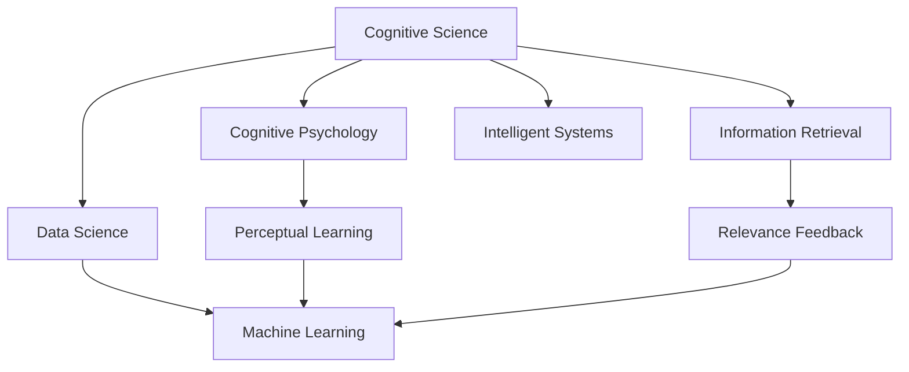

                 

# 知识的深度与广度：影响洞察力的关键因素

> 关键词：知识深度, 知识广度, 认知科学, 认知心理学, 信息检索, 数据科学, 洞察力, 元认知

## 1. 背景介绍

知识的深度与广度是评估认知能力、洞察力和信息检索能力的关键指标。深度指在特定领域内的专业知识程度，广度则指知识面的多样性和覆盖范围。在知识密集型的领域，如人工智能、认知科学、数据科学等，对知识的深度与广度的追求成为技术发展的重要驱动力。

### 1.1 问题由来

在当前科技发展日新月异、信息爆炸的时代，知识的深度与广度对个体的决策能力、创新力和学习效率产生了深远影响。

- 深度方面，专业知识越深，个体在特定领域的判断力和解决问题的能力就越强。
- 广度方面，知识面越广，个体在跨领域协作、创新思维和信息整合能力上就越高。

近年来，随着人工智能技术的兴起，数据驱动的研究方式逐渐取代了以往的经验依赖，使得知识的深度与广度成为技术应用的重要考量。例如，在机器学习和自然语言处理(NLP)领域，对知识图谱的构建、语义理解和跨领域知识整合的研究，都是追求知识深度与广度的体现。

### 1.2 问题核心关键点

知识的深度与广度不仅影响认知能力和洞察力，还与个体在复杂多变环境中的适应力和决策效率密切相关。因此，本文聚焦于深入探讨影响知识深度与广度的关键因素，以及这些因素对认知科学、认知心理学、信息检索、数据科学等领域的影响。

## 2. 核心概念与联系

### 2.1 核心概念概述

理解知识的深度与广度需要从认知科学和认知心理学的角度出发。以下是核心概念的概述：

- **认知科学**：研究人如何获取、处理和应用知识，揭示知识深度与广度的本质及其对认知能力的影响。
- **认知心理学**：研究认知过程和心理机制，通过实验探究知识深度与广度对洞察力和学习效率的实际影响。
- **信息检索**：研究如何高效获取、存储和检索信息，通过算法优化提升知识广度的应用。
- **数据科学**：通过数据驱动的方法，发现知识深度与广度在复杂系统中的作用机制，揭示其对洞察力的影响。

这些概念相互关联，共同构建了对知识深度与广度的综合理解。

### 2.2 核心概念原理和架构的 Mermaid 流程图



这个流程图展示了各核心概念之间的联系：

- 认知科学、认知心理学和数据科学是知识深度与广度理论的基础。
- 信息检索和机器学习是知识广度的应用领域。
- 感知学习和智能系统是认知心理学和数据科学的实践应用。

## 3. 核心算法原理 & 具体操作步骤

### 3.1 算法原理概述

知识深度与广度的评估涉及多个学科，算法原理可以从认知心理学和信息检索的角度进行概述。

- **认知心理学**：通过实验和心理测量方法，评估个体的知识深度和广度。例如，知识深度可以通过专业知识测试、问题解决能力等指标进行评估，而知识广度可以通过跨学科知识测试、问题情境的适应性等指标进行评估。
- **信息检索**：使用算法优化信息检索过程，提升知识广度的获取效率。例如，通过倒排索引、词向量模型等方法，提升信息检索的准确性和相关性。

### 3.2 算法步骤详解

#### 3.2.1 认知心理学算法步骤

1. **任务定义**：明确知识深度与广度的评估任务，例如专业测试、跨学科问题解决等。
2. **数据采集**：采集参与者的专业知识背景、问题解决历史等数据。
3. **实验设计**：设计实验情景，确保实验的客观性和可重复性。
4. **数据处理**：对采集的数据进行预处理，例如数据清洗、归一化等。
5. **模型训练**：使用统计模型、机器学习算法等对数据进行建模。
6. **结果分析**：分析模型的输出结果，评估知识深度与广度的分布和相关性。

#### 3.2.2 信息检索算法步骤

1. **数据收集**：收集需要检索的信息集合，例如文献、网页等。
2. **预处理**：对文本数据进行分词、去停用词、词性标注等预处理操作。
3. **索引构建**：建立倒排索引，为每个词汇构建指向文档的指针。
4. **查询构建**：将查询转化为词向量或TF-IDF等形式，进行文档匹配。
5. **结果排序**：使用相关性排序算法，例如BM25、PageRank等，优化搜索结果。
6. **评价指标**：使用评价指标如平均精度、F1分数等评估检索效果。

### 3.3 算法优缺点

#### 3.3.1 认知心理学算法的优缺点

**优点**：
- **客观性**：实验设计和数据采集可以提供客观的评估依据。
- **可重复性**：标准化实验设计确保实验结果的可靠性。
- **深入性**：通过复杂实验设计，可以揭示知识深度与广度的内在机制。

**缺点**：
- **耗时耗力**：实验设计、数据采集和分析过程复杂，成本较高。
- **依赖实验条件**：实验设计受限于实际实验条件，可能存在局限性。

#### 3.3.2 信息检索算法的优缺点

**优点**：
- **高效性**：算法优化使得信息检索速度和准确性显著提高。
- **普适性**：可应用于各类信息检索场景，如学术文献检索、网页检索等。
- **自动化**：算法驱动的信息检索过程自动化程度高，节省人力成本。

**缺点**：
- **依赖数据质量**：检索结果依赖于数据质量，低质量数据可能导致偏差。
- **语义理解不足**：传统算法未能充分考虑语义信息，对复杂语境的适应性有限。
- **算法复杂度**：某些算法复杂度高，对硬件资源要求较高。

### 3.4 算法应用领域

知识的深度与广度在多个领域有广泛的应用：

- **医学**：医学知识的深度与广度对临床决策和治疗方案的制定至关重要。
- **教育**：教师的知识深度与广度直接影响教学质量和学生学习效果。
- **工程**：工程师的知识深度与广度影响工程项目的效率和质量。
- **金融**：金融分析师的知识深度与广度对风险评估和投资决策有直接影响。
- **科学研究**：研究人员的知识深度与广度决定其发现新知识的能力和质量。

## 4. 数学模型和公式 & 详细讲解 & 举例说明

### 4.1 数学模型构建

在数学模型中，知识深度与广度的表示通常通过向量空间或图结构来实现。

假设有一组知识向量 $K=\{k_1, k_2, ..., k_n\}$，每个知识向量 $k_i$ 表示一个具体的知识点，向量空间 $V$ 中的每个向量 $v$ 表示个体对知识向量 $k$ 的理解程度。向量空间中的距离表示个体知识深度与广度的大小。

### 4.2 公式推导过程

在向量空间中，知识深度与广度的度量可以通过以下公式推导：

1. **知识深度**：
   - **向量内积**：知识向量 $k$ 与个体向量 $v$ 的内积表示个体对知识向量 $k$ 的理解程度。
   - **知识深度**：$depth(v, k) = \frac{\langle v, k \rangle}{\|v\|\|k\|}$
   
2. **知识广度**：
   - **向量模长**：个体向量 $v$ 的模长表示其知识广度。
   - **知识广度**：$breadth(v) = \|v\|$

### 4.3 案例分析与讲解

以谷歌 Scholar 的论文检索为例，通过构建向量空间模型，可以评估用户的知识广度。

1. **向量构建**：将每篇论文的关键词、摘要等信息转化为向量。
2. **用户检索**：用户输入检索词，通过词向量模型匹配相似论文。
3. **相关性排序**：计算每篇论文与用户检索词的相似度，排序后展示结果。
4. **用户反馈**：用户点击搜索结果，提供反馈信息，进一步优化检索算法。

## 5. 项目实践：代码实例和详细解释说明

### 5.1 开发环境搭建

为了进行项目实践，需要搭建相关的开发环境。

1. **Python 安装**：
   ```bash
   pip install python
   ```
2. **Numpy 和 Pandas 安装**：
   ```bash
   pip install numpy pandas
   ```
3. **TensorFlow 安装**：
   ```bash
   pip install tensorflow
   ```
4. **Scikit-learn 安装**：
   ```bash
   pip install scikit-learn
   ```
5. **Jupyter Notebook 安装**：
   ```bash
   pip install jupyter notebook
   ```

### 5.2 源代码详细实现

以下是一个简单的知识广度评估项目，使用向量空间模型进行信息检索。

```python
import numpy as np
from sklearn.feature_extraction.text import TfidfVectorizer
from sklearn.metrics.pairwise import cosine_similarity

# 假设有一组论文文本
papers = [
    "深度学习基础",
    "机器学习算法",
    "自然语言处理",
    "计算机视觉",
    "人工智能发展史"
]

# 假设用户输入的检索词
query = "机器学习"

# 构建向量空间
vectorizer = TfidfVectorizer()
papers_vector = vectorizer.fit_transform(papers)
query_vector = vectorizer.transform([query])

# 计算相似度
similarity_matrix = cosine_similarity(query_vector, papers_vector)

# 展示检索结果
top_results = np.argsort(-similarity_matrix[0])[1:5]
for i in top_results:
    print(papers[i])
```

### 5.3 代码解读与分析

1. **向量空间构建**：使用TF-IDF模型将论文和查询词转换为向量，实现向量化表示。
2. **相似度计算**：使用余弦相似度计算每篇论文与查询词的相似度，排序后展示结果。
3. **结果展示**：展示与查询词最相似的前五篇论文。

## 6. 实际应用场景

### 6.1 医学领域

在医学领域，知识深度与广度对临床决策和治疗方案的制定至关重要。通过构建医学知识图谱，医生可以获得更丰富的专业知识，并结合患者的详细病历数据，制定更为精确的诊疗方案。

**应用示例**：
- **疾病诊断**：利用知识图谱和电子病历，快速定位患者的病因和病情。
- **治疗方案**：根据患者的病情和历史记录，推荐最优治疗方案。
- **文献检索**：帮助医生查找最新的研究进展和临床实践，提升医疗水平。

### 6.2 教育领域

教育领域中，教师的知识深度与广度直接影响教学质量和学生学习效果。通过智能化的教学系统，教师可以获得更全面的教学资源，提升教学质量。

**应用示例**：
- **个性化推荐**：根据教师的知识背景和教学风格，推荐个性化的教学资源。
- **学习评估**：通过学生的数据分析，评估其知识深度与广度，指导个性化学习。
- **智能辅导**：利用知识图谱和智能推荐算法，提供智能化的学习辅导和问题解答。

### 6.3 金融领域

金融分析师的知识深度与广度对风险评估和投资决策有直接影响。通过大数据分析，金融分析师可以获得更全面的市场信息，制定更科学的投资策略。

**应用示例**：
- **风险评估**：利用历史数据和金融知识图谱，评估股票、债券等金融产品的风险。
- **投资决策**：根据市场动态和专业知识，提供最优的投资建议。
- **财务分析**：通过财务报表和市场信息，提供全面的财务分析报告。

### 6.4 科学研究

研究人员的知识深度与广度决定其发现新知识的能力和质量。通过智能化的知识管理系统，研究人员可以获得更丰富的数据和知识，加速科研成果的产出。

**应用示例**：
- **数据整合**：利用知识图谱和元数据，整合海量数据资源。
- **知识共享**：通过开放获取和协作研究，加速知识传播和共享。
- **研究引导**：根据历史数据和前沿研究，引导研究方向和选题。

## 7. 工具和资源推荐

### 7.1 学习资源推荐

1. **《认知心理学》书籍**：深入理解认知过程和心理机制，掌握认知深度与广度的理论基础。
2. **《信息检索基础》课程**：学习信息检索算法和应用，掌握知识广度的获取方法。
3. **Google Scholar**：利用学术数据库和论文检索功能，探索知识广度的应用场景。
4. **Kaggle 竞赛**：参加数据科学和机器学习竞赛，锻炼知识深度与广度的应用能力。

### 7.2 开发工具推荐

1. **PyTorch**：深度学习框架，支持向量化和神经网络模型训练。
2. **TensorFlow**：深度学习框架，提供多种算法优化方法。
3. **Scikit-learn**：机器学习库，提供多种分类、回归和聚类算法。
4. **Jupyter Notebook**：数据科学和机器学习开发环境，支持互动式代码编写和数据可视化。

### 7.3 相关论文推荐

1. **《知识图谱构建与深度学习》**：介绍知识图谱的构建方法和深度学习在知识图谱中的应用。
2. **《信息检索中的向量空间模型》**：探讨向量空间模型在信息检索中的应用。
3. **《认知深度与广度的心理测量》**：研究认知深度与广度的心理测量方法及其在认知科学中的应用。
4. **《智能推荐系统》**：介绍基于知识图谱和机器学习的智能推荐系统，提升知识广度的应用效果。

## 8. 总结：未来发展趋势与挑战

### 8.1 研究成果总结

知识的深度与广度是评估认知能力、洞察力和信息检索能力的关键指标。通过认知心理学和信息检索的算法优化，可以更有效地评估和管理知识深度与广度，提升其在各个领域的应用效果。

### 8.2 未来发展趋势

1. **跨领域知识整合**：利用知识图谱和元数据，实现不同领域知识的整合和共享。
2. **深度学习与知识图谱结合**：利用深度学习模型，优化知识图谱的构建和查询效果。
3. **认知科学的突破**：利用脑科学和认知神经科学的研究，揭示知识深度与广度的神经机制。
4. **知识图谱的自动化构建**：利用自然语言处理技术，自动化构建知识图谱，提升知识广度的获取效率。
5. **元认知的研究**：利用元认知理论，提升个体的知识深度与广度管理能力。

### 8.3 面临的挑战

1. **数据隐私和安全**：知识图谱和数据共享过程中，需要保护用户隐私和数据安全。
2. **知识图谱的扩展性**：大规模知识图谱的构建和维护，需要高效的算法和硬件支持。
3. **知识表示的多样性**：如何有效地表示和处理不同领域、不同类型的知识，仍是技术难题。
4. **深度学习的复杂性**：深度学习模型的复杂性和训练成本，仍需进一步优化和降低。
5. **认知科学的实践应用**：如何将认知科学的理论研究转化为实际应用，仍有待深入探索。

### 8.4 研究展望

未来的研究需要在多个方向进行深入探索：

1. **深度学习与认知科学的融合**：将认知科学的理论研究与深度学习技术相结合，提升模型的认知能力和洞察力。
2. **跨领域知识表示**：开发统一的知识表示方法，实现不同领域知识的有效整合和共享。
3. **元认知技术的普及**：利用元认知技术，提升个体和组织的知识管理能力，实现知识深度与广度的最佳匹配。
4. **数据隐私与知识图谱的协同**：保护用户隐私，同时提升知识图谱的共享和应用价值。
5. **知识图谱的自动化构建与维护**：利用自然语言处理和机器学习技术，自动化构建和维护大规模知识图谱。

## 9. 附录：常见问题与解答

**Q1：什么是知识的深度与广度？**

A: 知识的深度指在特定领域内的专业知识程度，知识广度则指知识面的多样性和覆盖范围。

**Q2：如何评估知识深度与广度？**

A: 可以通过认知心理学实验和信息检索算法评估知识深度与广度。认知心理学实验通过标准化测试和任务设计，评估个体的知识深度和广度。信息检索算法通过检索相关文献和资源，评估知识广度的获取效率。

**Q3：知识深度与广度在各个领域的应用场景有哪些？**

A: 在医学、教育、金融、科学研究等领域，知识深度与广度的评估和应用都有广泛的应用。例如，在医学领域，知识深度与广度对临床决策和治疗方案的制定至关重要。

**Q4：未来知识深度与广度研究的主要方向是什么？**

A: 未来知识深度与广度研究的主要方向包括跨领域知识整合、深度学习与知识图谱结合、认知科学的突破、知识图谱的自动化构建和元认知的研究。

**Q5：如何平衡知识深度与广度的发展？**

A: 平衡知识深度与广度的发展需要多学科的协同合作。在科学研究中，可以通过跨领域知识整合和知识图谱的应用，提升知识广度。在应用实践中，可以通过深度学习模型的优化和认知科学的理论研究，提升知识深度。

---

作者：禅与计算机程序设计艺术 / Zen and the Art of Computer Programming

