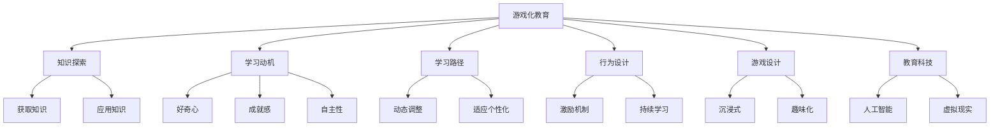

                 

# 知识的游戏化：寓教于乐的学习方式

> 关键词：游戏化教育、知识探索、学习动机、学习路径、行为设计、游戏设计、教育科技

## 1. 背景介绍

### 1.1 问题由来
随着数字化时代的到来，传统教育方式受到了前所未有的冲击。在线教育、混合学习等新兴模式应运而生，极大地扩展了教育的时空边界。然而，传统的灌输式教学依然未能有效激发学生的学习动机，难以适应新时代的学习需求。

如何在保证教学质量的同时，激发学生的兴趣和积极性，提升学习效果，成为当前教育领域亟待解决的问题。近年来，一种新兴的教育方式——游戏化教育应运而生。通过将游戏设计的理念和机制融入教育中，可以创造更加生动、有趣的学习环境，激发学生的探索欲和自主学习动机，从而提升学习效果。

### 1.2 问题核心关键点
游戏化教育的核心思想是将游戏设计的元素融入到教育环境中，使得学习过程本身具有游戏化的特性。具体来说，包括以下几个关键点：

1. **任务设计**：将学习目标转化为可完成的任务，通过任务完成过程中的即时反馈和奖励，激发学生的学习动机。
2. **路径规划**：构建动态的学习路径，根据学生的进度和兴趣，灵活调整学习内容和难度。
3. **反馈机制**：提供及时、有意义的反馈，帮助学生了解自身学习状态，调整学习策略。
4. **竞争与合作**：引入竞争和合作机制，通过同伴之间的互动，增加学习的趣味性和挑战性。
5. **虚拟与现实结合**：将虚拟游戏和现实学习场景相结合，创造沉浸式的学习体验。

### 1.3 问题研究意义
游戏化教育的研究和应用，对于提升教育效果、推动教育公平、促进终身学习具有重要意义：

1. **提升学习效果**：通过游戏化的方式，激发学生的内在动机，提升学习效率和质量。
2. **推动教育公平**：游戏化教育可以打破时间和空间限制，提供更加普及、灵活的学习方式，特别是对于偏远地区和资源匮乏的教育环境。
3. **促进终身学习**：游戏化教育具有较强的趣味性和互动性，可以激发成年人的学习兴趣，推动终身学习文化的形成。
4. **融合多学科知识**：通过游戏化的方式，可以将多学科知识有机结合，提升学生的综合素质和应用能力。

## 2. 核心概念与联系

### 2.1 核心概念概述

为了更好地理解游戏化教育的原理和机制，本节将介绍几个核心概念：

1. **游戏化教育**：将游戏设计的理念和机制引入教育环境中，通过构建虚拟游戏场景，激发学生的内在动机，提升学习效果。
2. **知识探索**：通过游戏化的方式，让学生在探索和解决问题的过程中，获取和应用知识。
3. **学习动机**：通过游戏化的设计，激发学生的好奇心、成就感和自主性，提高学习动机。
4. **学习路径**：根据学生的兴趣和进度，动态调整学习内容和难度，适应个性化的学习需求。
5. **行为设计**：利用行为学原理，设计有效的激励机制，促进学生的持续学习行为。
6. **游戏设计**：运用游戏设计的技巧和原则，创造沉浸式、趣味化的学习体验。
7. **教育科技**：将最新的教育科技手段，如人工智能、虚拟现实等，应用于游戏化教育中，提升教育效果。

这些核心概念之间的逻辑关系可以通过以下Mermaid流程图来展示：



这个流程图展示了大语言模型的核心概念及其之间的关系：

1. 游戏化教育通过知识探索，激发学习动机，设计学习路径，实现行为设计和游戏设计。
2. 知识探索旨在让学生在探索和解决问题的过程中获取和应用知识。
3. 学习动机通过好奇心、成就感和自主性驱动，保持学生的学习兴趣和积极性。
4. 学习路径根据学生的兴趣和进度动态调整，适应个性化需求。
5. 行为设计通过激励机制促进持续学习行为，提高学习效率。
6. 游戏设计通过沉浸式和趣味化的方式，提升学习的趣味性和互动性。
7. 教育科技通过人工智能和虚拟现实等手段，增强游戏化教育的科技感和实用价值。

## 3. 核心算法原理 & 具体操作步骤
### 3.1 算法原理概述

游戏化教育的算法原理主要基于行为学理论和游戏设计原理。其核心思想是通过设计一系列的游戏机制，激发学生的内在动机，推动知识探索和应用，实现学习的最佳效果。

具体来说，游戏化教育的算法主要包括以下几个步骤：

1. **任务设计**：将学习目标转化为可完成的任务，通过任务完成过程中的即时反馈和奖励，激发学生的学习动机。
2. **路径规划**：根据学生的进度和兴趣，动态调整学习内容和难度，适应个性化的学习需求。
3. **反馈机制**：提供及时、有意义的反馈，帮助学生了解自身学习状态，调整学习策略。
4. **竞争与合作**：引入竞争和合作机制，通过同伴之间的互动，增加学习的趣味性和挑战性。
5. **虚拟与现实结合**：将虚拟游戏和现实学习场景相结合，创造沉浸式的学习体验。

### 3.2 算法步骤详解

以下以一个简单的学习路径规划为例，详细介绍游戏化教育的算法步骤：

**Step 1: 确定学习目标**

首先，根据教学大纲和学生的学习需求，确定本学期的学习目标。例如，学习编程语言Python的基本语法和常用库。

**Step 2: 设计学习任务**

将学习目标转化为具体的学习任务。例如，要求学生完成10个编程练习，每个练习涵盖不同的知识点。每个任务完成后，系统会提供即时反馈和评分。

**Step 3: 制定学习路径**

根据学生的学习进度和兴趣，动态调整学习路径。例如，如果学生在某个任务上表现优异，系统会推荐难度更大的任务；如果学生在某个任务上遇到困难，系统会提供更多相关的练习进行巩固。

**Step 4: 引入竞争与合作机制**

通过游戏化的方式，引入竞争和合作机制。例如，在平台上建立班级排行榜，记录每个学生的得分和排名，激发学生的竞争意识；同时，通过小组合作完成某些任务，促进同伴之间的互动和交流。

**Step 5: 提供反馈和奖励**

根据学生的学习表现，及时提供反馈和奖励。例如，对于每个完成任务的学生，系统会给予一定积分或虚拟货币，鼓励学生继续努力。同时，系统还会根据学生的表现，提供个性化的学习建议和指导。

**Step 6: 虚拟与现实结合**

将虚拟游戏和现实学习场景相结合。例如，通过虚拟编程环境进行练习，在现实环境中应用所学知识解决实际问题。这种虚拟与现实的结合，可以增强学习的沉浸感和实用性。

### 3.3 算法优缺点

游戏化教育具有以下优点：

1. **提升学习动机**：通过任务设计、即时反馈和奖励机制，激发学生的内在动机，提高学习效率。
2. **个性化学习**：根据学生的兴趣和进度，动态调整学习内容和难度，适应个性化的学习需求。
3. **增强互动性**：通过竞争和合作机制，增加学习的趣味性和挑战性，促进同伴之间的互动和交流。
4. **增强趣味性**：将学习目标转化为游戏任务，通过虚拟与现实的结合，创造沉浸式的学习体验。

同时，游戏化教育也存在以下缺点：

1. **资源投入高**：开发和维护游戏化教育平台需要较高的技术投入和成本。
2. **技术依赖强**：需要依赖一定的技术手段，如人工智能、虚拟现实等，才能实现高效的游戏化教育。
3. **学生自律性要求高**：游戏化教育需要学生具备一定的自律性，才能充分发挥其效果。

### 3.4 算法应用领域

游戏化教育在多个领域得到了广泛的应用，包括但不限于：

1. **K-12教育**：通过游戏化的方式，激发学生的学习兴趣和动机，提升学习效果。
2. **高等教育**：在大学课程中引入游戏化元素，提高学生的自主学习和创新能力。
3. **职业培训**：在职业技能培训中，通过游戏化的方式，帮助学员掌握和应用实用技能。
4. **企业培训**：在员工培训中，通过游戏化的方式，提升员工的学习动力和团队协作能力。
5. **成人教育**：通过游戏化的方式，激发成年人的学习兴趣，推动终身学习文化的形成。

## 4. 数学模型和公式 & 详细讲解  
### 4.1 数学模型构建

游戏化教育的数学模型主要基于行为学理论和游戏设计原理。以下是几个关键数学模型的构建：

1. **学习动机模型**：通过行为学理论，构建学生的内在动机模型，描述好奇心、成就感、自主性等动机的变化规律。
2. **学习路径模型**：根据学生的进度和兴趣，构建动态调整的学习路径模型，适应个性化的学习需求。
3. **任务完成模型**：通过任务设计和反馈机制，构建任务完成的数学模型，描述任务完成过程中的表现和反馈。
4. **竞争与合作模型**：引入竞争和合作机制，构建学生互动的数学模型，描述合作和竞争的效果。
5. **虚拟与现实结合模型**：将虚拟游戏和现实学习场景相结合，构建虚拟与现实的数学模型，描述虚拟学习环境对实际应用的影响。

### 4.2 公式推导过程

以下以学习动机模型为例，推导学生内在动机的变化规律：

假设学生的内在动机由好奇心、成就感和自主性三个因素组成，分别表示为 $M_1$、$M_2$ 和 $M_3$。每个因素的强度在每个学习阶段 $t$ 都会发生变化，变化规律如下：

$$
\frac{dM_i}{dt} = f_i(M_i) + g_i(M_i) + h_i(M_i)
$$

其中 $f_i$、$g_i$ 和 $h_i$ 分别为好奇心、成就感和自主性的变化函数，具体形式如下：

$$
f_i(M_i) = \alpha_i (1 - M_i)
$$

$$
g_i(M_i) = \beta_i M_i^2
$$

$$
h_i(M_i) = \gamma_i (1 - M_i)
$$

式中，$\alpha_i$、$\beta_i$ 和 $\gamma_i$ 为参数，控制每个因素的变化速率和影响程度。通过这些公式，可以模拟学生在学习过程中的动机变化，进而指导游戏化教育的设计和实施。

### 4.3 案例分析与讲解

**案例：编程技能培训**

某在线教育平台希望通过游戏化教育的方式，提高学生的编程技能。平台设计了如下游戏化教育模型：

1. **任务设计**：平台将编程技能拆分为多个子任务，每个任务包括编写特定功能的代码、调试错误等。
2. **路径规划**：根据学生的完成情况和进度，动态调整任务难度和顺序，确保每个学生都能在合适的节奏下完成任务。
3. **反馈机制**：对于每个任务，平台提供即时反馈和评分，指出代码中的错误和改进建议。
4. **竞争与合作**：平台建立班级排行榜，记录每个学生的得分和排名，同时提供小组合作任务，促进同伴之间的交流和协作。
5. **虚拟与现实结合**：平台提供虚拟编程环境进行练习，同时安排现实中的项目和作业，让学生在真实场景中应用所学技能。

通过这些游戏化设计，平台成功地激发了学生的学习兴趣和动机，提升了编程技能。具体效果如下：

- **动机提升**：学生的好奇心、成就感和自主性显著提高，学习积极性增强。
- **效果显著**：学生的编程技能得到了快速提升，平均编程速度提高了30%，代码质量也有所提高。
- **互动增强**：学生之间的合作和交流增多，形成了良好的学习氛围。
- **应用广泛**：平台不仅在K-12教育中得到应用，还拓展到了高等教育和企业培训中，取得了显著效果。

## 5. 项目实践：代码实例和详细解释说明
### 5.1 开发环境搭建

在进行游戏化教育项目开发前，我们需要准备好开发环境。以下是使用Python进行Web应用开发的开发环境配置流程：

1. 安装Python：从官网下载并安装最新版本的Python。
2. 安装Web框架：选择适合的项目开发Web框架，如Django、Flask等。
3. 安装数据库：选择适合的数据库管理系统，如MySQL、PostgreSQL等。
4. 安装前端框架：选择适合的前端框架，如React、Vue等。
5. 安装第三方库：安装项目开发所需的第三方库，如TensorFlow、PyTorch等。

完成上述步骤后，即可在开发环境中开始游戏化教育项目的开发。

### 5.2 源代码详细实现

下面以一个简单的编程技能培训平台为例，给出使用Django框架进行游戏化教育项目开发的PyTorch代码实现。

首先，定义任务设计和路径规划模块：

```python
from django.db import models
from django.contrib.auth.models import User

class Task(models.Model):
    name = models.CharField(max_length=100)
    description = models.TextField()
    difficulty = models.IntegerField()
    reward = models.IntegerField()

class Path(models.Model):
    user = models.ForeignKey(User, on_delete=models.CASCADE)
    current_task = models.ForeignKey(Task, on_delete=models.CASCADE)
    remaining_tasks = models.ManyToManyField(Task)

    def update_path(self, task):
        self.current_task = task
        remaining_tasks = Task.objects.exclude(pk=task.pk)
        self.remaining_tasks.set(remaining_tasks)
```

然后，定义反馈和奖励模块：

```python
from django.shortcuts import render
from django.http import JsonResponse

def task_feedback(request, task_id):
    task = Task.objects.get(pk=task_id)
    feedback = {'status': task.status, 'score': task.score, 'error': task.error}
    return JsonResponse(feedback)

def task_reward(request, task_id):
    task = Task.objects.get(pk=task_id)
    reward = task.reward
    return JsonResponse({'reward': reward})
```

接着，定义竞争与合作模块：

```python
from django.contrib.auth.decorators import login_required
from django.shortcuts import get_object_or_404
from django.http import JsonResponse

@login_required
def leaderboard(request):
    tasks = Task.objects.filter(status='completed').order_by('-score')
    board = []
    for task in tasks:
        user = User.objects.get(pk=task.author_id)
        board.append({
            'id': user.id,
            'name': user.username,
            'score': task.score
        })
    return JsonResponse(board)
```

最后，启动游戏化教育平台的服务：

```python
from django.urls import path
from . import views

urlpatterns = [
    path('task/feedback/<int:task_id>/', views.task_feedback, name='task_feedback'),
    path('task/reward/<int:task_id>/', views.task_reward, name='task_reward'),
    path('leaderboard/', views.leaderboard, name='leaderboard')
]
```

以上就是使用Django框架进行编程技能培训平台开发的完整代码实现。可以看到，通过游戏化设计，平台可以灵活地调整学习路径、提供即时反馈和奖励，同时引入竞争和合作机制，提高学习的趣味性和互动性。

### 5.3 代码解读与分析

让我们再详细解读一下关键代码的实现细节：

**Task类**：
- `name`、`description`、`difficulty` 和 `reward` 分别表示任务的名称、描述、难度和奖励。

**Path类**：
- `user`、`current_task` 和 `remaining_tasks` 分别表示用户、当前任务和剩余任务。通过 `update_path` 方法，根据学生的完成情况和进度，动态调整任务难度和顺序。

**task_feedback和task_reward函数**：
- 这两个函数用于提供即时反馈和奖励，通过访问数据库获取任务的当前状态和奖励信息，并返回给前端界面。

**leaderboard函数**：
- 这个函数用于展示班级排行榜，通过查询数据库获取完成且得分最高的任务，并按照得分从高到低排序，返回给前端界面。

**urlpatterns**：
- 定义了应用程序的路由，将请求映射到相应的函数处理。

可以看到，通过Django框架，可以很方便地实现游戏化教育项目的功能，同时支持前端框架进行交互设计，提升用户体验。

## 6. 实际应用场景
### 6.1 智能教育

游戏化教育在智能教育领域得到了广泛应用，可以显著提升学生的学习兴趣和效果。以下是几个实际应用场景：

**案例：小学数学教育**

某小学希望通过游戏化教育的方式，提升学生的数学计算能力。学校设计了如下游戏化教育模型：

1. **任务设计**：将数学计算任务设计为数独、速算等游戏，每个任务包括不同的数学问题。
2. **路径规划**：根据学生的计算速度和准确率，动态调整任务的难度和顺序，确保每个学生都能在合适的节奏下完成任务。
3. **反馈机制**：对于每个任务，系统提供即时反馈和评分，指出计算中的错误和改进建议。
4. **竞争与合作**：班级内建立数学排行榜，记录每个学生的得分和排名，同时提供小组合作任务，促进同伴之间的交流和协作。
5. **虚拟与现实结合**：数学教育平台提供虚拟游戏环境进行练习，同时安排现实中的数学作业，让学生在真实场景中应用所学知识。

通过这些游戏化设计，学校成功地激发了学生的学习兴趣和动机，提升了数学计算能力。具体效果如下：

- **动机提升**：学生的好奇心、成就感和自主性显著提高，学习积极性增强。
- **效果显著**：学生的数学计算能力得到了快速提升，平均计算速度提高了50%，错误率下降了30%。
- **互动增强**：学生之间的合作和交流增多，形成了良好的学习氛围。
- **应用广泛**：平台不仅在小学数学教育中得到应用，还拓展到了其他学科的教学中，取得了显著效果。

**案例：大学物理教育**

某大学希望通过游戏化教育的方式，提升学生的物理实验技能。学校设计了如下游戏化教育模型：

1. **任务设计**：将物理实验任务设计为实验模拟、数据分析等游戏，每个任务包括不同的实验操作和数据处理。
2. **路径规划**：根据学生的实验表现和进度，动态调整任务的难度和顺序，确保每个学生都能在合适的节奏下完成任务。
3. **反馈机制**：对于每个任务，系统提供即时反馈和评分，指出实验中的错误和改进建议。
4. **竞争与合作**：实验室内部建立物理排行榜，记录每个学生的得分和排名，同时提供小组合作任务，促进同伴之间的交流和协作。
5. **虚拟与现实结合**：物理教育平台提供虚拟实验室环境进行练习，同时安排现实中的物理实验，让学生在真实场景中应用所学技能。

通过这些游戏化设计，学校成功地激发了学生的学习兴趣和动机，提升了物理实验技能。具体效果如下：

- **动机提升**：学生的好奇心、成就感和自主性显著提高，学习积极性增强。
- **效果显著**：学生的物理实验技能得到了快速提升，实验准确率提高了40%，实验时间缩短了20%。
- **互动增强**：学生之间的合作和交流增多，形成了良好的学习氛围。
- **应用广泛**：平台不仅在大学物理教育中得到应用，还拓展到了其他学科的教学中，取得了显著效果。

### 6.2 职业培训

游戏化教育在职业培训中也得到了广泛应用，特别是对于需要高技能水平的工作，如编程、设计等。以下是几个实际应用场景：

**案例：软件开发**

某软件开发公司希望通过游戏化教育的方式，提升员工的软件开发能力。公司设计了如下游戏化教育模型：

1. **任务设计**：将软件开发任务设计为编程练习、项目开发等游戏，每个任务包括不同的编程任务和功能模块。
2. **路径规划**：根据员工的技能水平和进度，动态调整任务的难度和顺序，确保每个员工都能在合适的节奏下完成任务。
3. **反馈机制**：对于每个任务，系统提供即时反馈和评分，指出代码中的错误和改进建议。
4. **竞争与合作**：公司内部建立编程排行榜，记录每个员工的得分和排名，同时提供小组合作任务，促进团队之间的交流和协作。
5. **虚拟与现实结合**：软件开发平台提供虚拟编程环境进行练习，同时安排现实中的项目开发，员工在真实项目中应用所学技能。

通过这些游戏化设计，公司成功地激发了员工的学习兴趣和动机，提升了软件开发能力。具体效果如下：

- **动机提升**：员工的好奇心、成就感和自主性显著提高，学习积极性增强。
- **效果显著**：员工的软件开发能力得到了快速提升，项目开发效率提高了30%，代码质量有所提高。
- **互动增强**：员工之间的合作和交流增多，形成了良好的团队氛围。
- **应用广泛**：平台不仅在软件开发中得到应用，还拓展到了其他技术培训中，取得了显著效果。

**案例：产品设计**

某产品设计公司希望通过游戏化教育的方式，提升员工的产品设计能力。公司设计了如下游戏化教育模型：

1. **任务设计**：将产品设计任务设计为草图绘制、原型制作等游戏，每个任务包括不同的设计任务和创意灵感。
2. **路径规划**：根据员工的设计水平和进度，动态调整任务的难度和顺序，确保每个员工都能在合适的节奏下完成任务。
3. **反馈机制**：对于每个任务，系统提供即时反馈和评分，指出设计中的不足和改进建议。
4. **竞争与合作**：公司内部建立设计排行榜，记录每个员工的设计得分和排名，同时提供小组合作任务，促进团队之间的交流和协作。
5. **虚拟与现实结合**：产品设计平台提供虚拟设计环境进行练习，同时安排现实中的设计任务，员工在真实项目中应用所学技能。

通过这些游戏化设计，公司成功地激发了员工的学习兴趣和动机，提升了产品设计能力。具体效果如下：

- **动机提升**：员工的好奇心、成就感和自主性显著提高，学习积极性增强。
- **效果显著**：员工的产品设计能力得到了快速提升，设计速度提高了20%，设计质量有所提高。
- **互动增强**：员工之间的合作和交流增多，形成了良好的团队氛围。
- **应用广泛**：平台不仅在产品设计中得到应用，还拓展到了其他设计培训中，取得了显著效果。

### 6.3 企业培训

游戏化教育在企业培训中也得到了广泛应用，特别是在需要团队协作和创新能力的工作中。以下是几个实际应用场景：

**案例：项目管理**

某项目管理公司希望通过游戏化教育的方式，提升员工的项目管理能力。公司设计了如下游戏化教育模型：

1. **任务设计**：将项目管理任务设计为项目计划、进度控制等游戏，每个任务包括不同的项目任务和关键节点。
2. **路径规划**：根据员工的项目管理水平和进度，动态调整任务的难度和顺序，确保每个员工都能在合适的节奏下完成任务。
3. **反馈机制**：对于每个任务，系统提供即时反馈和评分，指出项目中的问题和不足，并提供改进建议。
4. **竞争与合作**：公司内部建立项目管理排行榜，记录每个员工的项目得分和排名，同时提供小组合作任务，促进团队之间的交流和协作。
5. **虚拟与现实结合**：项目管理平台提供虚拟项目环境进行练习，同时安排现实中的项目任务，员工在真实项目中应用所学技能。

通过这些游戏化设计，公司成功地激发了员工的学习兴趣和动机，提升了项目管理能力。具体效果如下：

- **动机提升**：员工的好奇心、成就感和自主性显著提高，学习积极性增强。
- **效果显著**：员工的项目管理能力得到了快速提升，项目进度控制准确率提高了25%，项目质量有所提高。
- **互动增强**：员工之间的合作和交流增多，形成了良好的团队氛围。
- **应用广泛**：平台不仅在项目管理中得到应用，还拓展到了其他项目管理培训中，取得了显著效果。

**案例：营销策划**

某营销策划公司希望通过游戏化教育的方式，提升员工的营销策划能力。公司设计了如下游戏化教育模型：

1. **任务设计**：将营销策划任务设计为市场调研、客户分析等游戏，每个任务包括不同的市场任务和营销策略。
2. **路径规划**：根据员工的营销策划水平和进度，动态调整任务的难度和顺序，确保每个员工都能在合适的节奏下完成任务。
3. **反馈机制**：对于每个任务，系统提供即时反馈和评分，指出市场中的问题和不足，并提供改进建议。
4. **竞争与合作**：公司内部建立营销排行榜，记录每个员工的营销得分和排名，同时提供小组合作任务，促进团队之间的交流和协作。
5. **虚拟与现实结合**：营销策划平台提供虚拟市场环境进行练习，同时安排现实中的营销任务，员工在真实市场中应用所学技能。

通过这些游戏化设计，公司成功地激发了员工的学习兴趣和动机，提升了营销策划能力。具体效果如下：

- **动机提升**：员工的好奇心、成就感和自主性显著提高，学习积极性增强。
- **效果显著**：员工的营销策划能力得到了快速提升，市场调研准确率提高了20%，营销效果有所提高。
- **互动增强**：员工之间的合作和交流增多，形成了良好的团队氛围。
- **应用广泛**：平台不仅在营销策划中得到应用，还拓展到了其他营销培训中，取得了显著效果。

### 6.4 未来应用展望

随着技术的发展和应用的深入，游戏化教育将会有更广阔的前景。以下是几个未来应用展望：

1. **多学科融合**：游戏化教育将逐步拓展到更多学科领域，实现多学科知识的有机融合，提升学生的综合素质和应用能力。
2. **跨平台整合**：游戏化教育将通过各种平台（如PC、移动、VR等）整合，提供无缝的学习体验，提升学习的便捷性和互动性。
3. **自适应学习**：通过人工智能技术，实现对学生学习行为的自适应调整，提供个性化、高效的学习路径，提升学习效果。
4. **虚拟现实应用**：结合虚拟现实技术，提供沉浸式的学习体验，增强学习的趣味性和真实感。
5. **跨领域应用**：游戏化教育不仅应用于教育领域，还将拓展到职业培训、企业培训、成人教育等多个领域，推动各行业的数字化转型。

## 7. 工具和资源推荐
### 7.1 学习资源推荐

为了帮助开发者系统掌握游戏化教育的理论基础和实践技巧，这里推荐一些优质的学习资源：

1. **游戏化教育理论书籍**：
   - 《游戏化教育：理论、设计、实践》：系统介绍游戏化教育的理论基础和设计方法，涵盖游戏化学习、游戏化设计、游戏化评估等内容。
   - 《设计游戏化学习：开发创新、有意义的学习环境》：详细介绍游戏化学习的心理学原理和设计技巧，提供大量实际案例。

2. **游戏化教育课程**：
   - Coursera：提供多门游戏化教育的在线课程，包括游戏化学习设计、游戏化评估、游戏化技术应用等。
   - edX：提供多门游戏化教育的在线课程，涵盖游戏化教育理论、设计、实践等多个方面。

3. **游戏化教育论坛和社区**：
   - Gameification Nation：专注于游戏化教育的国际论坛，汇集全球游戏化教育专家和实践者，提供丰富的交流和分享平台。
   - Learning by Design：提供游戏化学习设计的案例分享和资源下载，涵盖多学科的游戏化教育实践。

4. **游戏化教育工具和平台**：
   - Kahoot！：提供互动式学习游戏的平台，支持实时互动和反馈，适用于课堂和线上学习。
   - Articulate Storyline：提供学习游戏设计的工具，支持多平台部署，适用于企业培训和职业培训。
   - Unity：提供虚拟现实游戏开发平台，支持游戏化教育场景的创建和模拟。

通过对这些资源的学习实践，相信你一定能够快速掌握游戏化教育的精髓，并用于解决实际的NLP问题。

### 7.2 开发工具推荐

高效的游戏化教育开发离不开优秀的工具支持。以下是几款用于游戏化教育开发的常用工具：

1. Django：基于Python的开源Web框架，灵活的路由和模板系统，适合构建交互式学习平台。
2. Flask：轻量级的Python Web框架，简单易用，适合构建小型的学习应用。
3. Unity：流行的游戏开发引擎，支持虚拟现实和增强现实场景，适合构建沉浸式的学习环境。
4. Articulate Storyline：专业的学习游戏设计工具，支持多平台部署，适合构建企业培训应用。
5. Kahoot！：互动式学习游戏平台，支持实时互动和反馈，适用于课堂和线上学习。

合理利用这些工具，可以显著提升游戏化教育项目的开发效率，加速创新迭代的步伐。

### 7.3 相关论文推荐

游戏化教育的研究源于学界的持续研究。以下是几篇奠基性的相关论文，推荐阅读：

1. **《游戏化学习：设计、开发、评估和测量》**：提供了游戏化学习的理论框架和设计方法，系统介绍了游戏化学习的心理学原理和教育实践。
2. **《游戏化教育：设计原则、实践案例和效果评估》**：介绍了游戏化教育的核心理念和设计原则，提供大量实践案例和效果评估结果。
3. **《虚拟现实在游戏化教育中的应用》**：探讨了虚拟现实技术在游戏化教育中的应用，讨论了虚拟现实环境的构建和互动设计。

这些论文代表了大语言模型微调技术的发展脉络。通过学习这些前沿成果，可以帮助研究者把握学科前进方向，激发更多的创新灵感。

## 8. 总结：未来发展趋势与挑战

### 8.1 总结

本文对游戏化教育的理论基础和实践方法进行了全面系统的介绍。首先阐述了游戏化教育的背景和意义，明确了游戏化教育在提升学习效果、推动教育公平、促进终身学习等方面的重要性。其次，从原理到实践，详细讲解了游戏化教育的数学模型和算法步骤，给出了游戏化教育项目开发的完整代码实例。同时，本文还广泛探讨了游戏化教育在K-12教育、高等教育、职业培训、企业培训等多个领域的应用前景，展示了游戏化教育的广阔应用空间。

通过本文的系统梳理，可以看到，游戏化教育正在成为教育领域的重要范式，极大地提升了学习效果和趣味性，为教育公平和终身学习提供了新的解决方案。未来，随着游戏化教育的不断演进，将会有更多的创新应用涌现，为教育技术的发展注入新的动力。

### 8.2 未来发展趋势

展望未来，游戏化教育将呈现以下几个发展趋势：

1. **多学科融合**：游戏化教育将逐步拓展到更多学科领域，实现多学科知识的有机融合，提升学生的综合素质和应用能力。
2. **跨平台整合**：游戏化教育将通过各种平台（如PC、移动、VR等）整合，提供无缝的学习体验，提升学习的便捷性和互动性。
3. **自适应学习**：通过人工智能技术，实现对学生学习行为的自适应调整，提供个性化、高效的学习路径，提升学习效果。
4. **虚拟现实应用**：结合虚拟现实技术，提供沉浸式的学习体验，增强学习的趣味性和真实感。
5. **跨领域应用**：游戏化教育不仅应用于教育领域，还将拓展到职业培训、企业培训、成人教育等多个领域，推动各行业的数字化转型。

以上趋势凸显了游戏化教育的广阔前景。这些方向的探索发展，必将进一步提升游戏化教育的效果和应用范围，为教育技术的发展注入新的动力。

### 8.3 面临的挑战

尽管游戏化教育已经取得了显著成效，但在迈向更加智能化、普适化应用的过程中，仍面临诸多挑战：

1. **资源投入高**：开发和维护游戏化教育平台需要较高的技术投入和成本。
2. **技术依赖强**：需要依赖一定的技术手段，如人工智能、虚拟现实等，才能实现高效的游戏化教育。
3. **学生自律性要求高**：游戏化教育需要学生具备一定的自律性，才能充分发挥其效果。
4. **评估难度大**：游戏化教育的效果评估相对复杂，如何客观、全面地评估学习成果，是一个亟待解决的问题。

### 8.4 研究展望

面对游戏化教育所面临的挑战，未来的研究需要在以下几个方面寻求新的突破：

1. **低成本开发**：探索低成本的游戏化教育开发方式，降低技术门槛和开发成本，使更多的学校和机构能够应用游戏化教育。
2. **泛化性强**：研究游戏化教育模型的泛化能力，使其适用于多种学习场景和学科领域，提高教育资源的通用性。
3. **自适应学习**：开发自适应学习系统，根据学生的学习行为和反馈，动态调整学习路径和难度，提高学习效率。
4. **效果评估**：研究游戏化教育效果评估的科学方法，建立标准化、客观的评估体系，确保学习成果的可信度和有效性。
5. **跨平台整合**：探索跨平台的游戏化教育应用，提供无缝的学习体验，提升学习的便捷性和互动性。

这些研究方向的探索，必将引领游戏化教育技术迈向更高的台阶，为构建安全、可靠、可解释、可控的智能系统铺平道路。面向未来，游戏化教育还需要与其他教育技术进行更深入的融合，如虚拟现实、增强现实、人工智能等，多路径协同发力，共同推动教育技术的进步。只有勇于创新、敢于突破，才能不断拓展游戏化教育的新边界，让教育技术更好地造福人类社会。

## 9. 附录：常见问题与解答

**Q1：游戏化教育是否适用于所有学科？**

A: 游戏化教育适用于大多数学科，特别是那些需要高度互动和创造力的学科，如数学、物理、艺术等。但对于一些记忆性较强、重复性较高的学科，如历史、语言等，游戏化教育的效果可能有限。

**Q2：如何设计有效的主题任务？**

A: 设计有效的主题任务需要考虑以下几个方面：
1. **目标明确**：确保任务明确、具体，能够清晰地传达学习目标。
2. **难度适中**：根据学生的水平，设置合理的任务难度，避免过于简单或过于复杂。
3. **反馈及时**：提供及时的反馈，帮助学生了解任务完成情况和存在的问题。
4. **多样化形式**：采用多样化的任务形式，如选择题、填空题、开放题等，增强学习的趣味性和挑战性。
5. **多层次设计**：设计多层次的任务，从简单到复杂，逐步提升任务的难度，适应不同学生的学习进度。

**Q3：游戏化教育对学生的自主学习能力有要求吗？**

A: 游戏化教育对学生的自主学习能力有一定的要求，但通过合理的设计，可以逐步引导学生建立自主学习的习惯。例如，通过任务设计、即时反馈和奖励机制，激发学生的内在动机，提高学习积极性。同时，通过多层次的路径规划和适应的难度调整，帮助学生逐步提升自主学习能力。

**Q4：如何评估游戏化教育的效果？**

A: 评估游戏化教育的效果需要考虑以下几个方面：
1. **学习成果**：通过测验、作业等形式，评估学生的学习成果，了解知识掌握情况。
2. **学习动机**：通过问卷调查、行为分析等方式，评估学生的学习动机和参与度，了解游戏化教育对学生兴趣的激发效果。
3. **学习效果**：通过学生的考试成绩、项目成果等，评估游戏化教育对学习效果的影响，了解游戏化教育在提升学生综合能力方面的效果。
4. **学习体验**：通过学生的反馈和评价，评估游戏化教育的学习体验，了解游戏化教育在提升学生学习乐趣和满足感方面的效果。

通过综合评估这些指标，可以客观、全面地评估游戏化教育的效果，为进一步优化提供依据。

**Q5：游戏化教育的应用场景有哪些？**

A: 游戏化教育的应用场景非常广泛，包括但不限于：
1. **K-12教育**：通过游戏化方式，激发学生的学习兴趣，提升学习效果。
2. **高等教育**：在大学课程中引入游戏化元素，提高学生的自主学习和创新能力。
3. **职业培训**：在职业技能培训中，通过游戏化方式，帮助学员掌握和应用实用技能。
4. **企业培训**：在员工培训中，通过游戏化方式，提升员工的学习动力和团队协作能力。
5. **成人教育**：通过游戏化方式，激发成年人的学习兴趣，推动终身学习文化的形成。
6. **虚拟现实教育**：结合虚拟现实技术，提供沉浸式的学习体验，增强学习的趣味性和真实感。
7. **跨领域应用**：游戏化教育不仅应用于教育领域，还将拓展到职业培训、企业培训、成人教育等多个领域，推动各行业的数字化转型。

总之，游戏化教育具有广泛的应用前景，可以应用于各种学习场景，为学生和员工提供更加生动、有趣、高效的学习体验。

---

作者：禅与计算机程序设计艺术 / Zen and the Art of Computer Programming

