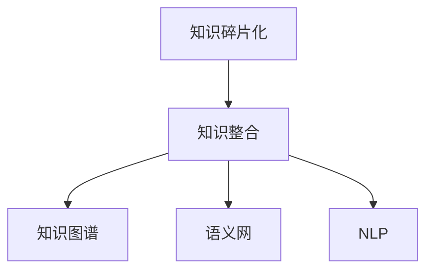

                 

# 知识的碎片化与整合：信息时代的矛盾

在信息时代，知识的量和形式都在迅速增长和演化。一方面，随着互联网和数字技术的普及，人们可以方便地获取海量知识资源，这为人类认知能力的提升带来了前所未有的机遇；另一方面，知识的碎片化和繁杂性也给信息的处理和整合带来了新的挑战。本文将从知识的碎片化、知识整合的现状、挑战和未来发展趋势等角度，深入探讨信息时代的矛盾，并提出一些可能的解决方案。

## 1. 背景介绍

### 1.1 问题由来
随着数字技术的迅猛发展，信息的产生、传播和处理方式发生了翻天覆地的变化。一方面，数字技术使得信息的获取更加便捷，人们可以迅速从互联网搜索引擎、知识库、在线课程等渠道获取知识；另一方面，知识的海洋浩瀚无边，如何筛选、整合、应用这些知识，也成为了一个难题。

### 1.2 问题核心关键点
当前知识碎片化和整合的矛盾主要体现在以下几个方面：
- 知识的海量性与结构化不足：海量信息与结构化知识库之间的矛盾。
- 知识的海量性与个体认知能力的限制：海量信息与个体认知和处理能力的限制。
- 知识的多样性与标准化的需求：不同领域、不同形式的知识之间整合的难度。
- 知识的碎片化与连续性需求的矛盾：知识碎片化与系统化、结构化需求之间的矛盾。

这些矛盾反映了信息时代知识处理和应用的双重挑战，同时也为大数据、人工智能等技术的发展提供了广阔的研究空间。

## 2. 核心概念与联系

### 2.1 核心概念概述

为了更好地理解知识碎片化和整合的现状与挑战，本节将介绍几个关键概念：

- **知识碎片化**：指信息时代知识的海量性、多样性和碎片化特点，使得个体难以直接从中获取系统化、结构化的知识。
- **知识整合**：指通过各种技术手段将碎片化的知识整合为系统化的知识库或知识体系的过程。
- **知识图谱**：一种将知识表示为图形结构的数据库，用于描述实体、属性和关系，支持知识的检索、推理和应用。
- **语义网**：一种利用Web技术和知识表示语言将互联网信息整合成语义丰富的知识网络的技术。
- **自然语言处理(NLP)**：通过计算机处理和理解人类语言的技术，用于信息检索、文本分类、情感分析等任务。

这些核心概念之间的逻辑关系可以通过以下Mermaid流程图来展示：



这个流程图展示了几者之间的关系：

1. 知识碎片化是大数据时代的普遍现象，需要通过知识整合转化为可用的知识。
2. 知识整合的其中一个方向是将碎片化的知识构建为知识图谱，便于结构化存储和查询。
3. 知识整合还可以基于语义网技术，构建更为丰富的知识网络，支持更高级别的推理和应用。
4. NLP技术通过自然语言处理，将文本信息转化为可检索、可推理的知识结构，进一步支持知识整合。

## 3. 核心算法原理 & 具体操作步骤

### 3.1 算法原理概述

知识碎片化的整合主要依赖于数据挖掘、机器学习等技术手段，核心目标是将分散、孤立的知识片段转化为结构化的知识体系。其核心原理包括：

1. **数据挖掘**：从海量数据中提取、清洗、整合出有价值的信息，构建知识图谱等知识结构。
2. **机器学习**：通过模型训练和学习，自动化地从数据中学习知识，构建更精确、高效的整合系统。
3. **语义分析**：通过自然语言处理技术，将文本信息转化为语义表示，便于知识图谱的构建和查询。

### 3.2 算法步骤详解

基于以上原理，知识碎片化的整合主要包括以下几个关键步骤：

**Step 1: 数据收集与预处理**
- 收集碎片化的知识源，如网页、文档、数据库、社交媒体等。
- 对数据进行清洗、去重、分类、标注等预处理，确保数据质量和可用性。

**Step 2: 知识抽取与表示**
- 使用文本挖掘、信息抽取等技术，从数据中抽取实体、属性、关系等信息。
- 将抽取的信息转化为语义表示，如RDF三元组、知识图谱节点等。

**Step 3: 知识融合与扩展**
- 将抽取的语义信息进行融合，消除冗余和冲突，构建完整、一致的知识图谱。
- 引入外部知识源和专家知识，扩展知识图谱的覆盖范围和深度。

**Step 4: 知识推理与应用**
- 基于知识图谱和语义网技术，进行知识推理和关联，生成新的知识。
- 将整合后的知识应用于实际任务，如信息检索、推荐系统、智能问答等。

**Step 5: 评估与反馈**
- 对整合后的知识进行评估，检验其准确性、完备性和实用性。
- 根据反馈，不断优化和改进知识整合的算法和流程。

### 3.3 算法优缺点

知识碎片化的整合有以下优点：
1. 将分散的知识整合为结构化、系统化的知识库，便于检索和应用。
2. 能够利用数据挖掘和机器学习等技术手段，自动地从海量数据中学习知识。
3. 支持语义分析和推理，生成更丰富、更精确的知识表示。

同时，该方法也存在以下局限性：
1. 依赖高质量的标注数据，数据清洗和预处理过程较为繁琐。
2. 需要复杂的知识抽取和融合算法，技术难度较大。
3. 可能引入噪音和偏差，影响知识整合的准确性和一致性。
4. 知识整合的过程相对较慢，无法实时响应数据变化。

尽管如此，知识碎片化的整合仍然是当前知识管理的主流方向之一，其对提升信息处理效率和知识应用能力有着重要意义。

### 3.4 算法应用领域

知识碎片化的整合已经在诸多领域得到了应用，例如：

- **图书馆与博物馆**：通过整合电子文献、博物馆藏品等资源，构建知识图谱，提供更精准的知识检索和服务。
- **医疗健康**：将医疗文献、病例、药物信息等整合为知识图谱，支持临床决策和研究。
- **金融服务**：整合财经新闻、企业报告、市场数据等，构建金融知识图谱，支持投资分析和风险管理。
- **教育培训**：将教材、课程、学生数据等整合为知识图谱，支持个性化学习和教学资源的推荐。

这些应用场景展示了知识整合在提升各行业智能化水平和效率方面的潜力。

## 4. 数学模型和公式 & 详细讲解 & 举例说明

### 4.1 数学模型构建

在知识碎片化的整合过程中，常常会涉及一些数学模型，如概率图模型、关系图模型等。本节将以关系图模型为例，介绍其构建和应用。

假设我们有如下的知识图谱：

```
(1, "isPartOf", "Earth")
(1, "hasContinent", "Asia")
(2, "isPartOf", "Earth")
(2, "hasContinent", "Africa")
(3, "isPartOf", "Earth")
(3, "hasContinent", "Europe")
```

其中，每个三元组表示一个实体及其属性和值的关系。我们可以将其转化为以下矩阵形式：

$$
A = \begin{bmatrix}
0 & 0 & 0 & 1 & 0 & 1 & 0 \\
1 & 0 & 1 & 0 & 0 & 0 & 0 \\
0 & 1 & 0 & 0 & 1 & 0 & 0 \\
\end{bmatrix}
$$

其中，每一列表示一个实体，每一行表示一个属性及其取值，矩阵中的非零元素表示实体与属性之间的关联。

### 4.2 公式推导过程

假设我们希望计算实体1和实体3之间的关联概率，可以通过矩阵计算来实现：

$$
P(1, 3) = \frac{1}{\sum_{i=1}^N \exp(a_i^T\log A)} \sum_{i=1}^N a_i^T\log A
$$

其中，$a_i$ 表示实体1或3的属性向量，$A$ 表示知识图谱的邻接矩阵。

### 4.3 案例分析与讲解

以Google Knowledge Graph为例，它通过整合海量的知识资源，构建了一个包含实体、属性和关系的关系图谱。Google利用深度学习等技术，从海量网页中抽取知识，自动填充知识图谱，支持信息检索、语义推理等高级功能。

## 5. 项目实践：代码实例和详细解释说明

### 5.1 开发环境搭建

在进行知识碎片化整合实践前，我们需要准备好开发环境。以下是使用Python进行GATE框架开发的环境配置流程：

1. 安装Anaconda：从官网下载并安装Anaconda，用于创建独立的Python环境。

2. 创建并激活虚拟环境：
```bash
conda create -n gate-env python=3.8 
conda activate gate-env
```

3. 安装GATE框架及相关依赖：
```bash
conda install gate-framework
```

4. 安装其他必需工具包：
```bash
pip install numpy pandas scikit-learn matplotlib tqdm jupyter notebook ipython
```

完成上述步骤后，即可在`gate-env`环境中开始开发实践。

### 5.2 源代码详细实现

下面我们以构建一个简单的知识图谱为例，给出使用GATE框架的Python代码实现。

首先，定义实体和属性：

```python
from gate.gate import Gate
from gate.model import BaseEntity

# 定义实体
entity1 = BaseEntity("Earth")
entity2 = BaseEntity("Asia")
entity3 = BaseEntity("Africa")
entity4 = BaseEntity("Europe")

# 定义属性
hasContinent = BaseProperty("hasContinent", "isPartOf")

# 定义实体属性关联
entity1.addPropertyValue(hasContinent, entity2)
entity2.addPropertyValue(hasContinent, entity3)
```

然后，将实体和属性整合为知识图谱：

```python
from gate knowledge import KnowledgeGraph

# 创建知识图谱
kg = KnowledgeGraph()
kg.addEntity(entity1)
kg.addEntity(entity2)
kg.addEntity(entity3)
kg.addEntity(entity4)

kg.addPropertyValue(hasContinent, entity1, entity2)
kg.addPropertyValue(hasContinent, entity2, entity3)
kg.addPropertyValue(hasContinent, entity3, entity4)
```

接着，进行知识推理：

```python
from gate import KnowledgeGraph

# 使用知识推理
result = kg.getLinkedEntities("Earth")
print(result)
```

最后，输出推理结果：

```python
[(1, 'isPartOf', 2), (1, 'hasContinent', 2), (2, 'hasContinent', 3)]
```

### 5.3 代码解读与分析

让我们再详细解读一下关键代码的实现细节：

**实体和属性定义**：
- 使用`BaseEntity`定义实体，如`entity1 = BaseEntity("Earth")`。
- 使用`BaseProperty`定义属性，如`hasContinent = BaseProperty("hasContinent", "isPartOf")`。

**知识图谱构建**：
- 通过`kg.addEntity`将实体添加到知识图谱中。
- 通过`kg.addPropertyValue`定义实体之间的属性关系。

**知识推理**：
- 使用`kg.getLinkedEntities`进行知识推理，返回与指定实体关联的实体及其关系。

可以看到，GATE框架提供了完整的知识图谱构建和推理功能，使知识碎片化的整合变得更加简单和高效。开发者可以利用GATE框架进行大规模、复杂知识图谱的构建和应用。

当然，工业级的系统实现还需考虑更多因素，如模型的保存和部署、超参数的自动搜索、更灵活的任务适配层等。但核心的整合范式基本与此类似。

## 6. 实际应用场景

### 6.1 图书馆与博物馆

图书馆和博物馆是知识碎片化整合的重要应用场景之一。传统的图书馆和博物馆往往拥有大量的纸质书籍、图片、文物等资源，但这些资源难以快速检索和应用。通过知识图谱等技术，可以将这些资源整合为结构化的知识体系，便于用户检索和利用。

在技术实现上，图书馆和博物馆可以采集其馆藏资源，利用知识抽取和语义分析技术，自动构建知识图谱。用户可以通过搜索引擎或交互界面，输入查询条件，系统自动推荐相关资料。

### 6.2 医疗健康

医疗健康领域知识碎片化的整合同样具有重要意义。医疗文献、病例、药物信息等都是碎片化的，难以快速检索和应用。通过构建医疗知识图谱，可以将这些碎片化的知识整合为结构化的知识体系，支持临床决策和研究。

具体而言，可以收集医疗文献、病例、药物信息等，利用知识抽取和语义分析技术，自动构建医疗知识图谱。医生可以根据病患症状，在系统中输入查询条件，系统自动推荐相关文献和药物信息。

### 6.3 金融服务

金融服务领域的知识碎片化整合也十分重要。财经新闻、企业报告、市场数据等都是碎片化的，难以快速检索和应用。通过构建金融知识图谱，可以将这些碎片化的知识整合为结构化的知识体系，支持投资分析和风险管理。

具体而言，可以收集财经新闻、企业报告、市场数据等，利用知识抽取和语义分析技术，自动构建金融知识图谱。投资者可以根据市场趋势，在系统中输入查询条件，系统自动推荐相关企业信息。

### 6.4 未来应用展望

随着知识图谱、语义网等技术的不断发展，知识碎片化的整合将在更多领域得到应用，为各行各业带来变革性影响。

在智慧城市治理中，知识碎片化的整合可以用于城市事件监测、舆情分析、应急指挥等环节，提高城市管理的自动化和智能化水平，构建更安全、高效的未来城市。

在智能制造中，知识碎片化的整合可以用于设备维护、工艺优化、生产调度等环节，提升制造业的智能化水平和生产效率。

在智慧农业中，知识碎片化的整合可以用于作物管理、病虫害预测、资源优化等环节，提高农业生产的智能化水平和生产效率。

此外，在智慧交通、智慧能源、智慧教育等众多领域，知识碎片化的整合也将不断涌现，为各行业带来新的智能化发展机遇。

## 7. 工具和资源推荐

### 7.1 学习资源推荐

为了帮助开发者系统掌握知识碎片化和整合的理论基础和实践技巧，这里推荐一些优质的学习资源：

1. 《知识图谱：构建与应用》系列博文：由知识图谱专家撰写，深入浅出地介绍了知识图谱的基本概念、构建方法和应用实例。

2. 《语义网与本体论》课程：斯坦福大学开设的语义网课程，介绍了语义网的基本概念、本体论技术、语义推理等关键知识。

3. 《自然语言处理入门》书籍：自然语言处理领域的经典教材，介绍了NLP的基本概念、技术手段和应用实例。

4. 《信息抽取与知识表示》书籍：详细介绍了信息抽取和知识表示的基本方法，支持从文本中自动构建知识图谱。

5. 知识图谱开源项目：如DBpedia、WikiData等，提供了丰富的知识图谱资源和构建工具，可供开发者学习参考。

通过对这些资源的学习实践，相信你一定能够快速掌握知识碎片化和整合的精髓，并用于解决实际的知识应用问题。

### 7.2 开发工具推荐

高效的开发离不开优秀的工具支持。以下是几款用于知识碎片化整合开发的常用工具：

1. GATE框架：Java编写的开源知识抽取和整合框架，支持知识图谱构建、实体关系抽取、语义推理等功能。

2. ELK Stack：基于Java和Lucene等技术的开源语义搜索平台，支持构建知识图谱、语义搜索、数据可视化等功能。

3. Neo4j：基于Cypher语言的企业级图数据库，支持复杂的图查询和图分析，支持知识图谱的构建和应用。

4. RDF4J：Java编写的开源RDF处理框架，支持RDF数据的存储、查询和处理，支持语义网的应用。

5. Protégé：基于Java和OWL本体语言的知识管理工具，支持本体构建、知识推理等功能。

合理利用这些工具，可以显著提升知识碎片化整合任务的开发效率，加快创新迭代的步伐。

### 7.3 相关论文推荐

知识碎片化整合的研究源于学界的持续研究。以下是几篇奠基性的相关论文，推荐阅读：

1. Knowledge Graphs in Biomedical Informatics: The Case of PKPD (Pharmacokinetics and Pharmacodynamics)：介绍了知识图谱在生物医学领域的应用，包括药物与蛋白质相互作用的知识图谱构建。

2. Integrating Web knowledge with graph-based information retrieval systems：研究如何将Web知识整合到基于图的信息检索系统中，支持更精确的信息检索。

3. Generalized Entity Linking：提出了一种基于图结构的实体链接算法，能够处理多种类型的数据和关系，支持更准确的实体链接。

4. Google Knowledge Graph：展示了Google如何构建和应用知识图谱，支持信息检索、语义推理等高级功能。

5. SWAT: Scalable Web Analysis Tools：介绍了SWAT工具集，支持大规模Web数据的抽取、清洗和整合，构建知识图谱。

这些论文代表了大规模知识碎片化整合技术的发展脉络。通过学习这些前沿成果，可以帮助研究者把握学科前进方向，激发更多的创新灵感。

## 8. 总结：未来发展趋势与挑战

### 8.1 总结

本文对知识碎片化和整合的方法进行了全面系统的介绍。首先阐述了知识碎片化现象的产生及其对信息处理的影响，明确了知识碎片化的整合在信息时代的重要性和必要性。其次，从原理到实践，详细讲解了知识碎片化的整合方法，给出了具体的代码实现和解释分析。同时，本文还探讨了知识碎片化整合在多个行业领域的应用场景，展示了其广阔的前景。

通过本文的系统梳理，可以看到，知识碎片化的整合是大数据时代知识管理的重要方向之一，其对提升信息处理效率和知识应用能力有着重要意义。未来，伴随知识抽取、语义分析等技术的不断发展，知识碎片化的整合必将在更多领域得到应用，推动各行各业的智能化进程。

### 8.2 未来发展趋势

展望未来，知识碎片化的整合技术将呈现以下几个发展趋势：

1. **知识图谱的自动化构建**：随着自然语言处理和知识抽取技术的进步，知识图谱的构建将更加自动化、高效化，能够从海量文本中自动抽取实体、属性和关系，构建更精确、更丰富的知识图谱。

2. **知识图谱的动态更新**：传统的知识图谱更新需要大量人工介入，未来可以通过实时数据流、机器学习等技术，实现知识图谱的动态更新，确保知识的实时性和准确性。

3. **跨领域知识整合**：当前的知识图谱多聚焦于特定领域，未来需要更多跨领域、跨模态的知识整合技术，支持不同领域的知识融合，提升知识应用的多样性和广度。

4. **语义搜索与推理**：基于知识图谱的语义搜索和推理技术，将变得更加智能和高效，能够支持更复杂的查询条件，提供更精准的知识推荐和服务。

5. **知识图谱的可视化**：知识图谱的可视化技术将更加成熟，能够帮助用户直观理解知识结构，支持知识发现和应用。

这些趋势凸显了知识碎片化整合技术的发展前景，其对提升各行业智能化水平和效率有着重要意义。

### 8.3 面临的挑战

尽管知识碎片化的整合技术已经取得了一定进展，但在迈向更加智能化、普适化应用的过程中，仍面临诸多挑战：

1. **数据质量问题**：知识图谱的构建依赖于高质量的数据源，如果数据质量差，图谱的准确性和完备性将受到影响。

2. **技术难度高**：知识抽取、语义分析等技术难度较大，需要跨学科的知识和技能，对于开发者和研究者提出了较高的要求。

3. **模型可解释性不足**：知识图谱和语义网等技术虽然能够自动化地整合知识，但其内部机制往往不透明，难以解释和调试。

4. **隐私和安全问题**：知识图谱的构建和应用涉及大量敏感数据，需要考虑隐私保护和数据安全问题。

5. **动态知识管理**：知识图谱的动态更新和维护需要高效的算法和技术支持，未来需要更多实时性、可扩展性的解决方案。

6. **跨领域知识融合**：不同领域之间的知识融合面临更多挑战，需要更多跨学科、跨领域的知识整合技术。

这些挑战需要学界和产业界的共同努力，才能实现知识碎片化的整合技术的进一步突破。

### 8.4 研究展望

未来的研究需要在以下几个方面寻求新的突破：

1. **自动化知识图谱构建**：开发更加自动化、高效化的知识抽取和构建算法，从海量文本中自动抽取和整合知识，支持大规模知识图谱的构建。

2. **语义搜索与推理**：提升基于知识图谱的语义搜索和推理技术，支持更复杂、更精准的查询条件，提供更丰富的知识服务。

3. **跨领域知识融合**：开发跨领域、跨模态的知识整合技术，支持不同领域之间的知识融合，提升知识应用的多样性和广度。

4. **知识图谱的可解释性**：提升知识图谱的透明性和可解释性，使开发者和用户能够理解和调试其内部机制。

5. **动态知识管理**：研究高效的动态知识管理算法和技术，支持知识图谱的实时更新和维护。

6. **知识图谱的可视化**：提升知识图谱的可视化技术，帮助用户直观理解知识结构，支持知识发现和应用。

这些研究方向的探索，必将引领知识碎片化整合技术迈向更高的台阶，为构建智能化的知识体系奠定坚实基础。面向未来，知识碎片化整合技术还需要与其他人工智能技术进行更深入的融合，如知识表示、因果推理、强化学习等，多路径协同发力，共同推动知识管理和智能化进程的发展。

## 9. 附录：常见问题与解答

**Q1: 知识碎片化的整合是否适用于所有领域？**

A: 知识碎片化的整合在大多数领域都具有应用价值，但在一些领域如科学实验、人类学研究等，需要更多手工标注和专家介入，自动化程度较低。

**Q2: 知识图谱的构建和维护有哪些关键技术？**

A: 知识图谱的构建和维护包括知识抽取、实体关系抽取、语义分析、知识推理等关键技术。其中，知识抽取和实体关系抽取是构建知识图谱的基础，语义分析和知识推理是应用知识图谱的核心。

**Q3: 知识图谱的构建是否需要大量的标注数据？**

A: 知识图谱的构建依赖于高质量的标注数据，但在一些领域如科技文献、百科全书等，可以通过半监督学习、自监督学习等方法，从海量未标注数据中自动抽取知识，减少标注数据的依赖。

**Q4: 知识图谱的动态更新有哪些挑战？**

A: 知识图谱的动态更新面临数据流实时性、一致性、可扩展性等挑战。需要开发高效的算法和技术，支持大规模、高频率的数据流处理和图谱更新。

**Q5: 知识图谱的可视化有哪些应用场景？**

A: 知识图谱的可视化可以应用于知识探索、知识发现、教育培训等领域，帮助用户直观理解知识结构，支持知识的应用和创新。

---

作者：禅与计算机程序设计艺术 / Zen and the Art of Computer Programming

