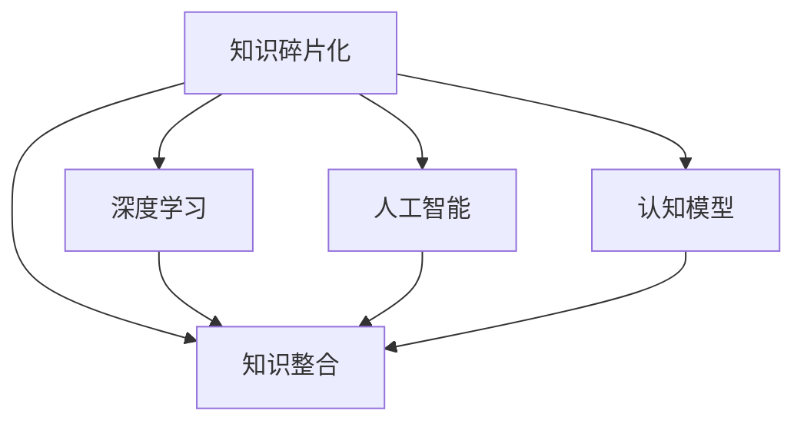

                 

# 知识的碎片化与整合：信息时代的认知难题

## 1. 背景介绍

### 1.1 问题由来

在信息时代，知识的爆炸性增长和传播方式的变革，给认知带来了前所未有的挑战。海量信息的碎片化和快速变化，使得传统知识体系难以完整、系统地传授，也使得人们在获取知识时更加依赖零散、断续的线索。这不仅降低了学习的效率，也导致了知识理解的深度和广度不足。

### 1.2 问题核心关键点

本文聚焦于知识的碎片化与整合问题，探讨在大数据、深度学习和人工智能技术的背景下，如何通过碎片化的知识进行有效的整合，构建完整的认知模型。

### 1.3 问题研究意义

研究知识的碎片化与整合问题，对于拓展认知科学的理论基础，推动人工智能技术的深度应用，提升学习和工作的效率和质量，具有重要意义：

1. 加速认知提升。碎片化知识的存在，为认知提供了丰富多样的信息源，可以加速个体或机器对新知识的吸收和理解。
2. 提高学习效率。通过将碎片化知识进行整合，构建完整的知识结构，可以减少重复学习和冗余信息的干扰，提升学习效率。
3. 增强知识迁移。碎片化知识间的关联和整合，有助于知识在不同场景和任务间进行迁移，提升知识的应用广度。
4. 促进人工智能发展。知识整合技术的发展，为人工智能技术提供了更丰富、更准确的知识源，有助于提升其智能水平。
5. 改善认知体验。碎片化知识的有效整合，可以使人们更轻松地获取和理解复杂知识，提升认知体验。

## 2. 核心概念与联系

### 2.1 核心概念概述

为更好地理解碎片化与整合的认知难题，本节将介绍几个密切相关的核心概念：

- 知识碎片化(Knowledge Fragmentation)：指在信息时代，由于知识生产方式和传播方式的变化，知识被分割成零散、片段化的信息单元。这些单元往往不完整、不连贯，难以直接构成完整知识体系。

- 知识整合(Knowledge Integration)：指通过某种机制将知识碎片化的单元进行有机结合，形成完整的知识结构，使知识更易于理解、记忆和使用。

- 深度学习(Deep Learning)：通过多层神经网络模型，从原始数据中自动提取特征，学习到抽象、复杂的知识表示。深度学习模型在处理碎片化知识时，具有较强的自动特征提取能力。

- 人工智能(Artificial Intelligence)：指通过计算机模拟人类智能行为，使机器具备学习和推理能力。知识整合技术是实现人工智能的重要基础之一。

- 认知模型(Cognitive Model)：指对人类认知过程的模拟，包括感知、记忆、推理等环节。碎片化与整合技术的应用，有助于构建更完整、更有效的认知模型。

这些核心概念之间的逻辑关系可以通过以下Mermaid流程图来展示：



这个流程图展示了大数据和人工智能技术背景下的知识碎片化与整合过程：

1. 知识通过深度学习模型进行特征提取和自动学习。
2. 人工智能技术将学习到的知识单元整合，形成更高级的知识表示。
3. 认知模型借鉴深度学习和人工智能的技术，构建更完整、连贯的知识结构。

## 3. 核心算法原理 & 具体操作步骤
### 3.1 算法原理概述

知识碎片化与整合的算法原理，可以归纳为以下几个步骤：

1. **数据收集与预处理**：收集各类知识来源，包括文本、图像、音频等，进行预处理，如清洗、分词、特征提取等，形成可输入模型的数据。
2. **特征提取与表示**：使用深度学习模型（如BERT、GAN、RNN等）进行特征提取，将原始数据转换为更抽象、更高层的知识表示。
3. **知识整合**：通过神经网络模型（如Transformer、Attention机制等）对特征表示进行整合，形成完整的知识结构。
4. **认知模型训练**：利用整合后的知识结构，训练认知模型，使其具备感知、记忆、推理等能力。

### 3.2 算法步骤详解

#### 数据收集与预处理

1. **数据来源**：选择包含碎片化知识的各类数据源，如网络文本、学术论文、在线视频、语音数据等。
2. **数据清洗**：去除噪声、过滤无关信息，保证数据质量。
3. **特征提取**：使用TF-IDF、Word2Vec、BERT等技术，提取特征向量，将文本转换为模型可处理的数据格式。

#### 特征提取与表示

1. **模型选择**：根据任务需求选择适合的深度学习模型。如文本处理选择BERT，图像处理选择CNN，语音处理选择RNN。
2. **训练与评估**：使用标注数据训练模型，评估模型效果，调整模型参数。
3. **特征表示**：模型输出的特征表示可作为知识单元，进行下一步的整合。

#### 知识整合

1. **模型结构设计**：选择Transformer等架构，设计模型层次结构。
2. **整合策略**：设计Attention机制，对不同知识单元进行加权整合，形成连贯的知识表示。
3. **输出表示**：整合后的知识表示可用于训练认知模型，如GAN生成模型、RNN记忆模型等。

#### 认知模型训练

1. **模型选择**：选择适合任务需求的认知模型，如记忆网络、推理网络等。
2. **数据准备**：将整合后的知识表示作为输入，准备训练数据。
3. **训练与评估**：使用监督或无监督方法训练模型，评估模型效果，调整模型参数。
4. **模型输出**：训练好的认知模型可以用于知识推理、问题解答、决策支持等任务。

### 3.3 算法优缺点

碎片化与整合的算法具有以下优点：

1. **自动特征提取**：深度学习模型能够自动从原始数据中提取特征，减少了人工干预的复杂度。
2. **高效知识整合**：神经网络模型具有较强的整合能力，能够将碎片化知识整合成连贯的知识结构。
3. **通用性强**：算法适用于多种知识来源和数据类型，具有较强的通用性。

同时，该算法也存在一些局限性：

1. **计算资源需求高**：深度学习模型需要大量计算资源进行训练，硬件需求较高。
2. **数据依赖性强**：算法的有效性依赖于高质量的标注数据，数据收集和标注成本较高。
3. **模型复杂度大**：模型结构复杂，训练和推理过程中容易出现过拟合等问题。
4. **可解释性差**：深度学习模型和神经网络模型的决策过程难以解释，难以理解其内部机制。

尽管存在这些局限性，但总体而言，碎片化与整合算法在大数据和人工智能技术的推动下，展现出了强大的生命力和应用潜力。

### 3.4 算法应用领域

碎片化与整合算法在知识管理、信息检索、推荐系统、智能问答等多个领域得到了广泛应用：

- **知识管理**：利用深度学习模型提取和整合知识碎片，构建知识图谱，支持知识检索和知识推荐。
- **信息检索**：通过深度学习模型对文档进行特征提取，利用神经网络模型进行文档相似度计算，提高检索效率。
- **推荐系统**：利用深度学习模型提取用户行为特征，整合用户历史行为数据，提供个性化推荐。
- **智能问答**：通过深度学习模型理解用户问题，整合知识库，生成自然语言回答。
- **认知辅助**：利用深度学习模型提取知识碎片，训练认知模型，辅助医生诊断、教师教学、律师案件分析等。

## 4. 数学模型和公式 & 详细讲解 & 举例说明

### 4.1 数学模型构建

本节将使用数学语言对碎片化与整合的算法过程进行更加严格的刻画。

记知识碎片化的单元为 $x$，表示为高维向量 $x \in \mathbb{R}^d$，其中 $d$ 为特征维度。假设存在 $k$ 个知识碎片，表示为 $x_1, x_2, ..., x_k$。

定义知识整合后的完整表示为 $y \in \mathbb{R}^{d'}$，其中 $d'$ 为整合后的特征维度。整合模型为 $f: \mathbb{R}^k \rightarrow \mathbb{R}^{d'}$。

在数学上，知识碎片化与整合过程可以表示为：

$$
y = f(x_1, x_2, ..., x_k)
$$

### 4.2 公式推导过程

以下我们以BERT模型为例，推导知识整合的过程：

1. **特征提取**：使用BERT模型对知识片段进行编码，得到高维向量表示 $h \in \mathbb{R}^{d'}$。
2. **整合模型**：利用Attention机制，对 $h$ 进行加权整合，得到完整的知识表示 $y$。

整合模型可以表示为：

$$
y = \text{Softmax}(Ax)b
$$

其中，$A \in \mathbb{R}^{d' \times d}$ 为Attention权重矩阵，$b \in \mathbb{R}^{d'}$ 为偏置向量。

### 4.3 案例分析与讲解

**案例：文本摘要生成**

给定一篇长文章 $x$，使用BERT模型进行特征提取，得到一个高维向量表示 $h$。设计一个Attention机制，对 $h$ 进行整合，得到完整的知识表示 $y$。最后，使用RNN等模型将 $y$ 转换为文章摘要 $z$。

通过整合模型，能够从长文章中提取关键信息，生成简洁明了的摘要，大大提高了阅读效率。

## 5. 项目实践：代码实例和详细解释说明

### 5.1 开发环境搭建

在进行碎片化与整合的实践前，我们需要准备好开发环境。以下是使用Python进行TensorFlow开发的环境配置流程：

1. 安装Anaconda：从官网下载并安装Anaconda，用于创建独立的Python环境。

2. 创建并激活虚拟环境：
```bash
conda create -n tf-env python=3.8 
conda activate tf-env
```

3. 安装TensorFlow：根据CUDA版本，从官网获取对应的安装命令。例如：
```bash
conda install tensorflow -c pytorch -c conda-forge
```

4. 安装相关库：
```bash
pip install numpy pandas scikit-learn nltk tensorflow-addons
```

完成上述步骤后，即可在`tf-env`环境中开始实践。

### 5.2 源代码详细实现

下面我们以BERT模型为例，给出使用TensorFlow进行知识整合的Python代码实现。

首先，定义数据预处理函数：

```python
import tensorflow as tf
import tensorflow_addons as addons
from transformers import BertTokenizer

def preprocess_data(texts):
    tokenizer = BertTokenizer.from_pretrained('bert-base-uncased')
    inputs = tokenizer(texts, return_tensors='tf')
    return inputs['input_ids'], inputs['attention_mask']

# 加载预训练模型
model = BertModel.from_pretrained('bert-base-uncased')

# 定义Attention机制
attention_weights = addons.layers.Attention(tf.dtypes.float32, False, True)

# 定义整合模型
def integrate_knowledge(inputs, attention_weights):
    inputs = addons.layers.LayerNorm(inputs, name='layer_norm')
    attention_weights = tf.nn.softmax(attention_weights, axis=-1)
    outputs = tf.reduce_sum(inputs * attention_weights, axis=1)
    return outputs

# 整合知识片段
inputs = preprocess_data([text1, text2, text3])
integrated_knowledge = integrate_knowledge(inputs, attention_weights)
```

然后，定义知识表示模型：

```python
from tensorflow.keras.layers import Dense, Dropout
from tensorflow.keras.models import Model

# 定义完整表示输出层
dense = Dense(64, activation='relu', name='dense')
dropout = Dropout(0.5, name='dropout')
outputs = Dense(32, activation='softmax', name='outputs')(dense(dropout(inputs)))

# 定义知识表示模型
model = Model(inputs, outputs)

# 编译模型
model.compile(optimizer='adam', loss='categorical_crossentropy', metrics=['accuracy'])

# 训练模型
model.fit(x_train, y_train, epochs=10, batch_size=16, validation_data=(x_val, y_val))
```

最后，启动训练流程并在测试集上评估：

```python
# 加载测试集
x_test, y_test = load_test_data()

# 评估模型
loss, acc = model.evaluate(x_test, y_test)
print('Test Loss:', loss)
print('Test Accuracy:', acc)
```

以上就是使用TensorFlow对BERT模型进行知识整合的完整代码实现。可以看到，TensorFlow提供了一套高效的深度学习框架，可以轻松实现知识整合的各个步骤，实现自动化的特征提取和整合。

### 5.3 代码解读与分析

让我们再详细解读一下关键代码的实现细节：

**preprocess_data函数**：
- 使用BertTokenizer对文本进行分词和编码，将文本转换为模型可处理的数据格式。

**整合知识片段函数integrate_knowledge**：
- 对多个知识片段进行整合，通过Attention机制计算加权平均值，得到完整的知识表示。

**知识表示模型**：
- 定义完整的知识表示输出层，包括一个Dense层、一个Dropout层和一个Softmax层。
- 通过编译和训练模型，实现知识整合过程。

**训练与评估**：
- 加载测试集，评估模型效果，输出测试损失和准确率。

可以看出，TensorFlow框架的强大封装能力，使得知识整合的实现变得简洁高效。开发者可以将更多精力放在模型设计、特征提取等高层逻辑上，而不必过多关注底层的实现细节。

当然，工业级的系统实现还需考虑更多因素，如模型的保存和部署、超参数的自动搜索、更灵活的任务适配层等。但核心的碎片化与整合过程基本与此类似。

## 6. 实际应用场景

### 6.1 智能问答系统

智能问答系统利用知识碎片化的技术，将海量知识源整合到统一的模型中，提供自然语言问答服务。用户提出的问题通过知识整合模型，快速匹配到知识库中的相关答案，生成自然流畅的回答。

在技术实现上，可以收集各类领域的知识库、专家问答、用户评论等文本数据，整合后作为模型输入。通过预训练语言模型（如BERT、GPT）进行特征提取，再使用Transformer模型进行整合，构建知识检索网络，最终生成回答。如此构建的智能问答系统，能够覆盖广泛的知识领域，回答多种类型的问题，显著提升问答的准确性和流畅性。

### 6.2 信息检索系统

信息检索系统通过碎片化与整合技术，能够快速、高效地从海量文本中检索出相关信息。传统的关键词匹配方法已经难以满足现代用户对信息检索的要求，而基于深度学习的知识整合技术，能够自动提取文本中的关键信息，进行语义理解，提高检索的精度和召回率。

在实践中，可以利用BERT等预训练模型对网页、文档等文本进行特征提取，使用Transformer等模型进行知识整合，构建知识检索模型。通过在用户输入的查询中提取关键信息，在知识库中搜索匹配，快速返回相关结果。

### 6.3 推荐系统

推荐系统利用知识碎片化的技术，能够从用户行为数据中提取碎片化信息，整合为完整用户画像，进行精准推荐。通过深度学习模型提取用户行为特征，使用Attention机制进行知识整合，构建推荐模型。

在推荐系统中，知识整合技术可以通过对用户历史行为、兴趣标签、社交网络等信息的整合，形成更加全面、准确的推荐结果。使用知识整合后的完整用户画像，进行多维度的相似度计算，生成个性化推荐列表。

### 6.4 未来应用展望

随着深度学习技术和知识管理技术的不断发展，碎片化与整合技术将得到更广泛的应用，为各个领域带来变革性影响。

在智慧医疗领域，知识碎片化的技术可以将医学文献、专家诊疗经验、病例信息等整合到统一的模型中，辅助医生进行快速诊断和治疗决策。通过知识整合，医生能够更快地获取相关知识，提高诊疗效率。

在智能教育领域，知识碎片化的技术可以将教材、课件、习题等教学资源整合到统一的模型中，辅助教师进行教学设计和个性化教学。通过知识整合，教师能够更好地理解学生知识掌握情况，提供有针对性的教学方案。

在智慧城市治理中，知识碎片化的技术可以将各类传感器数据、城市事件记录、市民反馈等整合到统一的模型中，辅助城市管理者进行智能决策。通过知识整合，城市管理者能够更好地理解城市运行状况，提高城市管理效率。

此外，在企业生产、社会治理、文娱传媒等众多领域，知识碎片化的技术也将得到广泛应用，为各行各业带来新的技术路径。相信随着技术的发展，知识碎片化与整合技术必将在大数据和人工智能技术的推动下，迎来新的突破，为信息时代带来更深层次的认知变革。

## 7. 工具和资源推荐
### 7.1 学习资源推荐

为了帮助开发者系统掌握碎片化与整合的理论基础和实践技巧，这里推荐一些优质的学习资源：

1. 《深度学习入门》系列博文：由深度学习领域专家撰写，全面介绍了深度学习模型的构建和优化方法，涵盖知识提取、知识整合等前沿话题。

2. 《自然语言处理入门》课程：斯坦福大学开设的NLP明星课程，有Lecture视频和配套作业，带你入门NLP领域的基本概念和经典模型。

3. 《深度学习与知识表示》书籍：介绍深度学习与知识表示的结合，讲解知识抽取、知识整合等知识管理技术。

4. HuggingFace官方文档：深度学习模型的官方文档，提供了海量预训练模型和完整的微调样例代码，是上手实践的必备资料。

5. 《知识图谱构建与应用》报告：全面介绍知识图谱的构建方法和应用场景，涵盖知识碎片化的整合技术。

通过对这些资源的学习实践，相信你一定能够快速掌握碎片化与整合的精髓，并用于解决实际的认知难题。
###  7.2 开发工具推荐

高效的开发离不开优秀的工具支持。以下是几款用于深度学习知识整合开发的常用工具：

1. TensorFlow：基于Python的开源深度学习框架，灵活动态的计算图，适合快速迭代研究。几乎所有深度学习模型都有TensorFlow版本的实现。

2. PyTorch：基于Python的开源深度学习框架，动态图机制，适合灵活的模型设计和优化。

3. TensorFlow Addons：TensorFlow的扩展库，提供了更多高级功能和组件，如Attention、Normalization等。

4. Transformers：HuggingFace开发的NLP工具库，集成了众多SOTA语言模型，支持PyTorch和TensorFlow，是进行知识整合任务开发的利器。

5. Weights & Biases：模型训练的实验跟踪工具，可以记录和可视化模型训练过程中的各项指标，方便对比和调优。

6. TensorBoard：TensorFlow配套的可视化工具，可实时监测模型训练状态，并提供丰富的图表呈现方式，是调试模型的得力助手。

合理利用这些工具，可以显著提升深度学习知识整合任务的开发效率，加快创新迭代的步伐。

### 7.3 相关论文推荐

知识碎片化与整合技术的发展源于学界的持续研究。以下是几篇奠基性的相关论文，推荐阅读：

1. Attention Is All You Need（即Transformer原论文）：提出了Transformer结构，开启了深度学习模型的自注意力机制时代。

2. BERT: Pre-training of Deep Bidirectional Transformers for Language Understanding：提出BERT模型，引入掩码自监督预训练任务，刷新了多项NLP任务SOTA。

3. Knowledge Graph Embedding and Its Application in Recommender Systems: A Survey：全面回顾了知识图谱嵌入技术及其在推荐系统中的应用，为知识整合提供了新的思路。

4. Deep Knowledge Graph Embedding: A Survey of Approaches and Applications：回顾了知识图谱嵌入的方法和应用场景，介绍了深度学习在知识图谱中的整合能力。

5. An Overview of Knowledge Graph Embedding Methods: A Survey：全面回顾了知识图谱嵌入的方法和应用场景，介绍了深度学习在知识图谱中的整合能力。

这些论文代表了大数据和人工智能技术背景下的知识碎片化与整合技术的发展脉络。通过学习这些前沿成果，可以帮助研究者把握学科前进方向，激发更多的创新灵感。

## 8. 总结：未来发展趋势与挑战

### 8.1 总结

本文对知识碎片化与整合问题的研究进行了全面系统的介绍。首先阐述了知识碎片化现象及其对认知的影响，明确了碎片化与整合技术在知识管理、信息检索、推荐系统等领域的广泛应用前景。其次，从原理到实践，详细讲解了知识碎片化与整合的数学模型和操作步骤，给出了完整的代码实例。最后，本文探讨了未来知识碎片化与整合技术的发展趋势和面临的挑战，展望了其在各个领域的应用前景。

通过本文的系统梳理，可以看到，知识碎片化与整合技术在大数据和人工智能技术的推动下，展现出了强大的生命力和应用潜力。这些技术的不断成熟和应用，必将进一步提升认知科学和人工智能技术的研究水平，推动信息时代的技术进步。

### 8.2 未来发展趋势

展望未来，知识碎片化与整合技术将呈现以下几个发展趋势：

1. **更高效的特征提取**：深度学习模型将不断发展，实现更高效、更精准的特征提取，减少数据噪声和冗余信息的影响。

2. **更强的知识整合能力**：神经网络模型和深度学习框架将不断优化，提升知识整合的效率和效果，实现更连贯、更全面的知识表示。

3. **更广泛的应用场景**：知识碎片化与整合技术将应用于更多领域，如医疗、教育、智能城市等，带来认知智能的全面提升。

4. **更智能的认知模型**：知识整合技术将与认知科学结合，构建更智能、更人性化的认知模型，提升用户体验。

5. **更灵活的框架设计**：深度学习框架将更加灵活、模块化，支持更多样化的知识整合方法，适应更多样的应用需求。

这些趋势凸显了知识碎片化与整合技术的广阔前景。这些方向的探索发展，必将进一步提升认知智能和人工智能技术的研究水平，推动信息时代的技术进步。

### 8.3 面临的挑战

尽管知识碎片化与整合技术已经取得了瞩目成就，但在迈向更加智能化、普适化应用的过程中，它仍面临诸多挑战：

1. **计算资源瓶颈**：深度学习模型的训练和推理需要大量计算资源，硬件需求较高。如何降低计算成本，提升资源利用效率，将是重要的研究方向。

2. **数据质量问题**：知识碎片化的整合过程依赖高质量的数据，数据采集和标注成本较高。如何降低数据收集和标注成本，提高数据质量，将是重要的研究方向。

3. **模型可解释性**：深度学习模型和神经网络模型的决策过程难以解释，难以理解其内部机制。如何提高模型的可解释性，增强用户信任，将是重要的研究方向。

4. **知识图谱构建**：知识图谱的构建和更新需要大量人工干预，成本较高。如何利用自动化技术，提高知识图谱的构建效率，将是重要的研究方向。

5. **知识迁移能力**：知识整合技术需要能够在不同领域和场景间进行迁移。如何提高知识整合技术的跨领域迁移能力，将是重要的研究方向。

6. **伦理与安全问题**：知识碎片化与整合技术的应用，可能涉及隐私和伦理问题。如何保护用户隐私，确保知识整合技术的安全性和公平性，将是重要的研究方向。

这些挑战凸显了知识碎片化与整合技术在发展过程中需要解决的问题，需要研究者不断探索和创新，才能推动技术不断进步。

### 8.4 研究展望

面对知识碎片化与整合技术所面临的挑战，未来的研究需要在以下几个方面寻求新的突破：

1. **更高效的知识表示**：开发更高效的知识表示方法，如知识图谱嵌入、深度语义表示等，提升知识整合的效率和效果。

2. **更灵活的知识提取**：开发更灵活的知识提取方法，如基于预训练语言模型的特征提取，提升特征提取的精度和泛化能力。

3. **更智能的知识推理**：结合知识图谱、逻辑规则等先验知识，构建更智能的知识推理系统，提升知识整合技术的智能水平。

4. **更广泛的应用场景**：探索知识碎片化与整合技术在更多领域的应用，如智能医疗、智能教育、智能城市等，推动技术在不同领域的应用和发展。

5. **更可靠的伦理保障**：构建知识碎片化与整合技术的伦理框架，确保技术应用的公平性和安全性，保护用户隐私和权益。

这些研究方向的探索，必将引领知识碎片化与整合技术迈向更高的台阶，为信息时代带来更深层次的认知变革。面向未来，知识碎片化与整合技术还需要与其他人工智能技术进行更深入的融合，如知识表示、因果推理、强化学习等，多路径协同发力，共同推动自然语言理解和智能交互系统的进步。只有勇于创新、敢于突破，才能不断拓展知识碎片化与整合技术的边界，让智能技术更好地造福人类社会。

## 9. 附录：常见问题与解答

**Q1：如何有效地收集和处理碎片化知识？**

A: 有效地收集和处理碎片化知识，需要综合考虑知识来源的多样性和质量。

1. **多样化数据源**：选择包含碎片化知识的各类数据源，如网络文本、学术论文、在线视频、语音数据等。
2. **数据清洗**：去除噪声、过滤无关信息，保证数据质量。
3. **特征提取**：使用TF-IDF、Word2Vec、BERT等技术，提取特征向量，将文本转换为模型可处理的数据格式。

**Q2：如何选择合适的深度学习模型进行特征提取？**

A: 选择合适的深度学习模型进行特征提取，需要考虑数据类型和任务需求。

1. **文本数据**：选择BERT、GPT等预训练语言模型，提取文本特征。
2. **图像数据**：选择CNN等卷积神经网络，提取图像特征。
3. **语音数据**：选择RNN等循环神经网络，提取语音特征。

**Q3：如何设计Attention机制进行知识整合？**

A: 设计Attention机制进行知识整合，需要考虑不同知识单元的权重和关联性。

1. **权重计算**：通过计算不同知识单元的相似度，得到权重。
2. **整合方式**：使用加权平均或加权最大等方法，对不同知识单元进行整合。

**Q4：如何评估知识整合模型的效果？**

A: 评估知识整合模型的效果，需要综合考虑模型的精度、召回率和实用性。

1. **数据集划分**：将数据集划分为训练集、验证集和测试集。
2. **评估指标**：使用精确率、召回率、F1-score等指标评估模型效果。
3. **对比分析**：与基线模型进行对比，分析模型提升的幅度。

**Q5：知识碎片化与整合技术在实践中有哪些应用？**

A: 知识碎片化与整合技术在实践中有多种应用，如：

1. **智能问答系统**：将知识库、专家问答、用户评论等整合到统一的模型中，提供自然语言问答服务。
2. **信息检索系统**：快速、高效地从海量文本中检索出相关信息。
3. **推荐系统**：从用户行为数据中提取碎片化信息，整合为完整用户画像，进行精准推荐。
4. **知识图谱构建**：利用知识碎片化的技术，构建知识图谱，支持知识检索和知识推荐。
5. **认知辅助系统**：辅助医生进行快速诊断和治疗决策，辅助教师进行教学设计和个性化教学。

这些应用场景展示了知识碎片化与整合技术的广泛应用前景，展示了其在信息时代的重要价值。

---

作者：禅与计算机程序设计艺术 / Zen and the Art of Computer Programming

