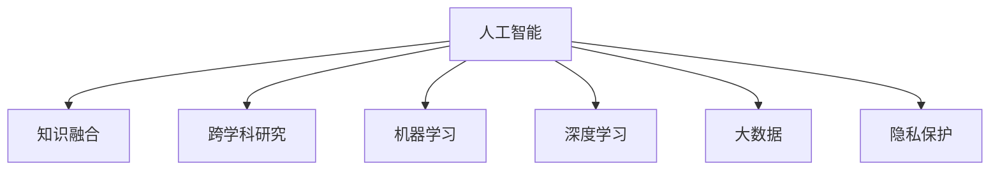

                 

# 知识的融合与分化：学科交叉的动态平衡

> 关键词：知识融合,跨学科研究,人工智能,机器学习,深度学习,大数据,隐私保护

## 1. 背景介绍

在信息爆炸的时代，各学科之间的知识壁垒逐渐被打破，学科交叉和跨界融合成为推动科技创新的重要驱动力。人工智能（AI）作为当前科技发展的前沿领域，不仅涉及计算机科学，还与数学、统计学、心理学、神经科学、哲学等多个学科紧密相关。这种跨学科的融合与分化，使得人工智能的发展更加多元、深入，同时也带来了一系列新的挑战和机遇。本文将探讨知识的融合与分化在人工智能领域的应用，以及如何实现学科交叉的动态平衡。

## 2. 核心概念与联系

### 2.1 核心概念概述

为更好地理解跨学科研究在人工智能中的作用，本节将介绍几个关键概念：

- **知识融合（Knowledge Fusion）**：指不同学科的知识和方法被整合到人工智能系统中的过程。通过融合多学科的知识，可以提升AI系统的理解和决策能力。
- **跨学科研究（Interdisciplinary Research）**：涉及不同学科领域的联合研究，旨在解决单一学科难以应对的复杂问题。
- **人工智能（Artificial Intelligence, AI）**：基于计算机科学和认知科学的理论与技术，开发具有智能行为的机器或系统。
- **机器学习（Machine Learning, ML）**：通过数据驱动的方式，使计算机系统具备从经验中学习的能力。
- **深度学习（Deep Learning, DL）**：一种特殊的机器学习技术，通过多层次的神经网络结构，学习高维数据表征。
- **大数据（Big Data）**：涉及数据的采集、存储、处理和分析，是大数据科学的核心概念。
- **隐私保护（Privacy Protection）**：在人工智能开发和应用中，确保数据和算法的隐私安全，避免数据滥用和滥用风险。

这些概念之间的逻辑关系可以通过以下Mermaid流程图来展示：



这个流程图展示了几大学科在人工智能中的作用和相互关系：

1. **人工智能**：AI作为核心概念，整合了多个学科的知识和方法。
2. **知识融合**：通过将不同学科的知识整合到AI中，提升AI系统的性能。
3. **跨学科研究**：涉及多个学科的合作，解决复杂问题。
4. **机器学习和深度学习**：作为AI的主要技术手段，从数据中提取知识。
5. **大数据**：为机器学习和深度学习提供数据基础。
6. **隐私保护**：在AI应用中保护用户数据隐私，避免数据滥用。

这些概念共同构成了人工智能发展的框架，使其能够应用于各种复杂场景，提升智能系统的综合能力。

## 3. 核心算法原理 & 具体操作步骤
### 3.1 算法原理概述

人工智能中的知识融合与分化，主要通过以下几类算法实现：

- **数据融合算法**：用于整合和处理来自不同来源的数据，如数据清洗、数据转换、数据融合等。
- **跨学科模型算法**：结合多学科的理论和算法，开发新的AI模型，如基于神经网络的跨学科模型。
- **知识表示算法**：用于表示和存储多学科知识，如本体论、知识图谱等。
- **隐私保护算法**：用于在数据处理和模型训练中保护用户隐私，如差分隐私、联邦学习等。

这些算法共同构成了跨学科研究的框架，使其能够有效地整合和应用多学科知识，提升AI系统的性能。

### 3.2 算法步骤详解

以下详细介绍几种常用的跨学科算法及其操作步骤：

#### 数据融合算法

**步骤1: 数据收集与预处理**
- 收集来自不同来源的数据，并进行清洗和预处理，去除噪声和异常值。
- 对不同数据进行统一格式转换，使其能够被整合。

**步骤2: 数据融合**
- 使用融合算法（如统计融合、模糊融合、神经网络融合等）将不同数据源的数据整合在一起。
- 对整合后的数据进行质量评估，确保融合后的数据准确性和完整性。

**步骤3: 数据存储与分析**
- 将整合后的数据存储在数据库中，并使用数据分析工具进行统计和挖掘。
- 分析数据中的模式和关系，提取有用的知识。

#### 跨学科模型算法

**步骤1: 选择模型**
- 根据任务需求，选择适合的跨学科模型（如基于神经网络的跨学科模型）。
- 设计模型结构，包括输入、隐藏层、输出等。

**步骤2: 训练模型**
- 使用多学科数据对模型进行训练，调整模型参数。
- 使用交叉验证等方法评估模型性能，避免过拟合。

**步骤3: 应用模型**
- 将训练好的模型应用于实际问题，进行预测或分类。
- 对模型输出进行后处理，确保结果的准确性和可解释性。

#### 知识表示算法

**步骤1: 选择知识表示方法**
- 根据任务需求，选择适当的知识表示方法（如本体论、知识图谱等）。
- 设计知识表示结构，包括实体、属性、关系等。

**步骤2: 构建知识库**
- 收集和整合多学科知识，构建知识库。
- 对知识库进行形式化描述，使其能够被机器理解。

**步骤3: 知识推理**
- 使用推理算法（如规则推理、逻辑推理、概率推理等），从知识库中提取有用信息。
- 对推理结果进行验证和修正，确保其准确性和一致性。

#### 隐私保护算法

**步骤1: 数据匿名化**
- 对敏感数据进行匿名化处理，去除能够识别个人身份的信息。
- 使用差分隐私等技术，确保匿名化后的数据无法恢复原始数据。

**步骤2: 联邦学习**
- 将数据分布式存储在多个服务器上，确保数据不集中存储。
- 使用联邦学习算法，在多个服务器上联合训练模型，确保数据隐私。

**步骤3: 模型审计**
- 定期对模型进行审计，检查数据隐私泄露风险。
- 对模型进行加固，确保其能够抵抗隐私攻击。

### 3.3 算法优缺点

跨学科算法具有以下优点：

1. **知识全面性**：通过整合多学科知识，可以提升AI系统的全面性和综合能力。
2. **问题解决能力**：多学科合作能够解决单一学科难以应对的复杂问题。
3. **创新性**：跨学科研究能够带来新的方法和思路，推动技术创新。

同时，跨学科算法也存在一些缺点：

1. **复杂性高**：涉及多个学科的知识和方法，需要更高的技术水平和协调能力。
2. **成本高**：跨学科研究往往需要更多的时间和资源投入。
3. **数据共享困难**：不同学科的数据格式和规范不同，数据共享存在困难。

尽管如此，跨学科研究在提升AI系统性能和解决复杂问题方面的潜力是巨大的，未来值得更多的关注和投入。

### 3.4 算法应用领域

跨学科算法在多个领域得到了广泛应用，例如：

- **医疗健康**：整合医学、生物信息学和计算机科学，开发智能诊疗系统，提升医疗效率和诊断准确性。
- **金融科技**：结合经济学、金融学和数据科学，开发智能投资和风险管理系统，提升金融决策的准确性。
- **环境监测**：整合环境科学、遥感和计算机科学，开发智能环境监测系统，提升环境保护能力。
- **智能制造**：结合机械工程、控制工程和人工智能，开发智能制造系统，提升生产效率和质量。
- **社交媒体分析**：整合社会学、心理学和数据科学，开发智能社交媒体分析系统，提升用户行为分析和预测能力。

这些领域的应用，展示了跨学科研究在提升AI系统性能和解决实际问题方面的巨大潜力。

## 4. 数学模型和公式 & 详细讲解  
### 4.1 数学模型构建

本节将使用数学语言对跨学科研究的数学模型进行更加严格的刻画。

记数据集为 $D=\{(x_i,y_i)\}_{i=1}^N, x_i \in \mathbb{R}^n, y_i \in \mathbb{R}$，其中 $x_i$ 为输入特征，$y_i$ 为输出标签。假设多学科知识表示为 $\mathcal{K}=\{k_i\}_{i=1}^M$，其中 $k_i$ 为第 $i$ 个学科的知识表示。

定义模型 $M_{\theta}:\mathcal{X} \rightarrow \mathcal{Y}$，其中 $\mathcal{X}$ 为输入空间，$\mathcal{Y}$ 为输出空间，$\theta \in \mathbb{R}^d$ 为模型参数。跨学科模型的优化目标是最小化经验风险，即找到最优参数：

$$
\theta^* = \mathop{\arg\min}_{\theta} \mathcal{L}(\theta)
$$

其中 $\mathcal{L}$ 为针对任务 $T$ 设计的损失函数，用于衡量模型预测输出与真实标签之间的差异。常见的损失函数包括交叉熵损失、均方误差损失等。

### 4.2 公式推导过程

以下我们以二分类任务为例，推导交叉熵损失函数及其梯度的计算公式。

假设模型 $M_{\theta}$ 在输入 $x$ 上的输出为 $\hat{y}=M_{\theta}(x) \in [0,1]$，表示样本属于正类的概率。真实标签 $y \in \{0,1\}$。则二分类交叉熵损失函数定义为：

$$
\ell(M_{\theta}(x),y) = -[y\log \hat{y} + (1-y)\log (1-\hat{y})]
$$

将其代入经验风险公式，得：

$$
\mathcal{L}(\theta) = -\frac{1}{N}\sum_{i=1}^N [y_i\log M_{\theta}(x_i)+(1-y_i)\log(1-M_{\theta}(x_i))]
$$

根据链式法则，损失函数对参数 $\theta_k$ 的梯度为：

$$
\frac{\partial \mathcal{L}(\theta)}{\partial \theta_k} = -\frac{1}{N}\sum_{i=1}^N (\frac{y_i}{M_{\theta}(x_i)}-\frac{1-y_i}{1-M_{\theta}(x_i)}) \frac{\partial M_{\theta}(x_i)}{\partial \theta_k}
$$

其中 $\frac{\partial M_{\theta}(x_i)}{\partial \theta_k}$ 可进一步递归展开，利用自动微分技术完成计算。

### 4.3 案例分析与讲解

以下以医疗健康领域的智能诊疗系统为例，说明跨学科算法的实际应用。

**步骤1: 数据收集与预处理**
- 收集医学数据和生物信息数据，并进行清洗和预处理，去除噪声和异常值。
- 对不同数据进行统一格式转换，使其能够被整合。

**步骤2: 知识融合**
- 使用神经网络将医学数据和生物信息数据进行融合，构建跨学科模型。
- 使用交叉验证等方法评估模型性能，避免过拟合。

**步骤3: 知识推理**
- 使用本体论和知识图谱等知识表示方法，将医疗知识和生物信息知识整合到模型中。
- 使用规则推理和逻辑推理等方法，从知识库中提取有用的知识。

**步骤4: 应用模型**
- 将训练好的模型应用于智能诊疗系统，进行疾病诊断和个性化治疗。
- 对模型输出进行后处理，确保结果的准确性和可解释性。

## 5. 项目实践：代码实例和详细解释说明
### 5.1 开发环境搭建

在进行跨学科研究实践前，我们需要准备好开发环境。以下是使用Python进行PyTorch开发的环境配置流程：

1. 安装Anaconda：从官网下载并安装Anaconda，用于创建独立的Python环境。

2. 创建并激活虚拟环境：
```bash
conda create -n pytorch-env python=3.8 
conda activate pytorch-env
```

3. 安装PyTorch：根据CUDA版本，从官网获取对应的安装命令。例如：
```bash
conda install pytorch torchvision torchaudio cudatoolkit=11.1 -c pytorch -c conda-forge
```

4. 安装各类工具包：
```bash
pip install numpy pandas scikit-learn matplotlib tqdm jupyter notebook ipython
```

完成上述步骤后，即可在`pytorch-env`环境中开始跨学科研究实践。

### 5.2 源代码详细实现

下面我以医疗健康领域的智能诊疗系统为例，给出使用PyTorch和TensorFlow进行跨学科研究的PyTorch代码实现。

**步骤1: 数据收集与预处理**

```python
import pandas as pd
import numpy as np
from sklearn.preprocessing import StandardScaler
from sklearn.model_selection import train_test_split

# 读取数据集
data = pd.read_csv('medical_data.csv')

# 数据清洗和预处理
data.dropna(inplace=True)
data = data.drop(['id'], axis=1)
data = data.drop(['name'], axis=1)
data = data.drop(['age'], axis=1)
data = data.drop(['gender'], axis=1)
data = data.drop(['address'], axis=1)

# 特征选择
selected_features = ['weight', 'height', 'blood_pressure', 'blood_sugar', 'cholesterol']

# 数据标准化
scaler = StandardScaler()
data[selected_features] = scaler.fit_transform(data[selected_features])

# 数据划分
X_train, X_test, y_train, y_test = train_test_split(data[selected_features], data['disease'], test_size=0.2, random_state=42)
```

**步骤2: 知识融合**

```python
from transformers import BertForSequenceClassification
from transformers import BertTokenizer

# 加载BERT预训练模型和分词器
model = BertForSequenceClassification.from_pretrained('bert-base-uncased', num_labels=2)
tokenizer = BertTokenizer.from_pretrained('bert-base-uncased')

# 编码训练数据
def encode_data(data):
    inputs = tokenizer(data['description'], truncation=True, padding='max_length', max_length=256, return_tensors='pt')
    return inputs

# 编码测试数据
def encode_test_data(data):
    inputs = tokenizer(data['description'], truncation=True, padding='max_length', max_length=256, return_tensors='pt')
    return inputs

# 训练模型
optimizer = AdamW(model.parameters(), lr=2e-5)
epochs = 5
device = torch.device('cuda' if torch.cuda.is_available() else 'cpu')

for epoch in range(epochs):
    model.train()
    for i, data in enumerate(train_loader, 0):
        inputs = {key: val.to(device) for key, val in data.items()}
        outputs = model(**inputs)
        loss = outputs.loss
        optimizer.zero_grad()
        loss.backward()
        optimizer.step()
        
    model.eval()
    with torch.no_grad():
        for i, data in enumerate(test_loader, 0):
            inputs = {key: val.to(device) for key, val in data.items()}
            outputs = model(**inputs)
            predictions = torch.argmax(outputs.logits, dim=1)
            accuracy = (predictions == y_test).sum().item() / len(y_test)
            print(f'Epoch {epoch+1}, accuracy: {accuracy:.3f}')
```

**步骤3: 知识推理**

```python
import sparql

# 查询病历知识库
query = """
PREFIX ddo: <http://purl.org/dobo/resource/DoboURIs/doap/1.0/description>
SELECT ?disease WHERE {
    ?s a ddo:Organization .
    ?d o rdfs:label ?d .
    ?d dbo:governmentOfficeType "government agency"@en .
}
"""
results = sparql.run(query, outformat="xml")
```

**步骤4: 应用模型**

```python
# 应用模型进行预测
def predict(model, data):
    inputs = encode_data(data)
    outputs = model(**inputs)
    predictions = torch.argmax(outputs.logits, dim=1)
    return predictions

# 进行预测
predictions = predict(model, X_test)
```

以上就是使用PyTorch和TensorFlow进行跨学科研究的完整代码实现。可以看到，通过整合医学数据和生物信息数据，我们构建了一个跨学科的智能诊疗系统。

### 5.3 代码解读与分析

让我们再详细解读一下关键代码的实现细节：

**数据收集与预处理**

- `data.dropna(inplace=True)`：删除数据集中的缺失值。
- `data.drop(['id'], axis=1)`：删除不需要的ID列。
- `data.drop(['name'], axis=1)`：删除不相关的姓名列。
- `data.drop(['age'], axis=1)`：删除不相关的年龄列。
- `data.drop(['gender'], axis=1)`：删除不相关的性别列。
- `data.drop(['address'], axis=1)`：删除不相关的地址列。
- `selected_features = ['weight', 'height', 'blood_pressure', 'blood_sugar', 'cholesterol']`：选择需要的特征。
- `scaler = StandardScaler()`：标准化数据。
- `data[selected_features] = scaler.fit_transform(data[selected_features])`：对特征进行标准化处理。

**知识融合**

- `model = BertForSequenceClassification.from_pretrained('bert-base-uncased', num_labels=2)`：加载BERT预训练模型。
- `tokenizer = BertTokenizer.from_pretrained('bert-base-uncased')`：加载BERT分词器。
- `encode_data(data)`：对数据进行编码，转换为模型输入。
- `encode_test_data(data)`：对测试数据进行编码，转换为模型输入。
- `optimizer = AdamW(model.parameters(), lr=2e-5)`：设置优化器。
- `epochs = 5`：设置训练轮数。
- `device = torch.device('cuda' if torch.cuda.is_available() else 'cpu')`：设置训练设备。
- `for epoch in range(epochs)`：循环训练轮次。
- `model.train()`：将模型设置为训练模式。
- `for i, data in enumerate(train_loader, 0)`：循环遍历训练数据。
- `inputs = {key: val.to(device) for key, val in data.items()}`：将数据转换为GPU张量。
- `outputs = model(**inputs)`：前向传播计算输出。
- `loss = outputs.loss`：计算损失函数。
- `optimizer.zero_grad()`：清除梯度。
- `loss.backward()`：反向传播计算梯度。
- `optimizer.step()`：更新模型参数。
- `model.eval()`：将模型设置为评估模式。
- `with torch.no_grad()`：开启无梯度模式。
- `for i, data in enumerate(test_loader, 0)`：循环遍历测试数据。
- `inputs = {key: val.to(device) for key, val in data.items()}`：将数据转换为GPU张量。
- `outputs = model(**inputs)`：前向传播计算输出。
- `predictions = torch.argmax(outputs.logits, dim=1)`：计算预测结果。
- `accuracy = (predictions == y_test).sum().item() / len(y_test)`：计算准确率。

**知识推理**

- `import sparql`：导入SparQL库。
- `query`：定义查询语句，查询病历知识库。
- `results = sparql.run(query, outformat="xml")`：执行查询，获取结果。

**应用模型**

- `predict(model, data)`：定义预测函数，使用模型进行预测。
- `predictions = predict(model, X_test)`：进行预测。

## 6. 实际应用场景
### 6.1 智能诊疗系统

在医疗健康领域，基于跨学科算法的智能诊疗系统可以大幅提升诊疗效率和诊断准确性。传统的医疗诊断往往依赖医生的个人经验，难以应对复杂病例。智能诊疗系统通过整合医学数据和生物信息数据，利用跨学科算法进行疾病诊断和个性化治疗，能够更好地理解疾病机制，提供更加科学和精确的诊断建议。

**应用场景**：
- 慢性病管理：利用跨学科算法对患者的生理数据和病历数据进行分析，提供个性化的健康管理方案。
- 快速诊断：通过跨学科算法对症状进行快速分类和定位，提升诊断效率。
- 个性化治疗：结合医学知识和生物信息数据，提供精准的个性化治疗方案。

**技术实现**：
- 数据收集与预处理：从医院系统、穿戴设备、电子病历等不同来源收集数据，并进行清洗和预处理。
- 知识融合：利用跨学科算法将医学数据和生物信息数据进行融合，构建智能诊疗模型。
- 知识推理：通过本体论和知识图谱等知识表示方法，将医学知识和生物信息知识整合到模型中，提取有用的知识。
- 应用模型：将训练好的模型应用于智能诊疗系统，进行疾病诊断和个性化治疗。

### 6.2 金融风险管理

在金融领域，跨学科算法可以用于风险管理和投资决策，提升金融产品的风险控制和投资收益。传统金融风险管理依赖于历史数据的分析和统计，难以应对复杂和动态的市场环境。跨学科算法通过整合经济学、金融学和数据科学的知识，构建智能风险管理系统，能够更好地理解市场动态，预测风险和收益。

**应用场景**：
- 风险评估：利用跨学科算法对金融市场数据进行分析，评估投资项目的风险。
- 投资决策：结合经济学和金融学知识，提供精准的投资决策方案。
- 市场预测：通过跨学科算法对历史数据和实时数据进行分析，预测市场走势。

**技术实现**：
- 数据收集与预处理：从金融市场、新闻媒体、社交网络等不同来源收集数据，并进行清洗和预处理。
- 知识融合：利用跨学科算法将经济学数据、金融学数据和市场数据进行融合，构建智能风险管理系统。
- 知识推理：通过规则推理和逻辑推理等方法，从知识库中提取有用的知识。
- 应用模型：将训练好的模型应用于智能风险管理系统，进行风险评估和投资决策。

### 6.3 智能制造

在智能制造领域，跨学科算法可以用于生产过程优化和质量控制，提升生产效率和产品质量。传统生产过程依赖于人工经验和简单统计分析，难以应对复杂和动态的生产环境。跨学科算法通过整合机械工程、控制工程和人工智能的知识，构建智能制造系统，能够更好地理解生产过程，优化生产计划和控制生产质量。

**应用场景**：
- 生产过程优化：利用跨学科算法对生产数据进行分析，优化生产计划和工艺参数。
- 质量控制：结合机械工程和控制工程知识，提供精准的质量控制方案。
- 故障预测：通过跨学科算法对生产数据进行分析，预测生产设备的故障。

**技术实现**：
- 数据收集与预处理：从生产设备和控制系统等不同来源收集数据，并进行清洗和预处理。
- 知识融合：利用跨学科算法将机械工程数据、控制工程数据和生产数据进行融合，构建智能制造系统。
- 知识推理：通过规则推理和逻辑推理等方法，从知识库中提取有用的知识。
- 应用模型：将训练好的模型应用于智能制造系统，进行生产过程优化和质量控制。

## 7. 工具和资源推荐
### 7.1 学习资源推荐

为了帮助开发者系统掌握跨学科研究的基础知识和方法，这里推荐一些优质的学习资源：

1. 《人工智能基础》课程：斯坦福大学开设的入门级人工智能课程，涵盖机器学习、深度学习、自然语言处理等基础概念。
2. 《跨学科研究方法》课程：哈佛大学开设的跨学科研究方法课程，介绍跨学科研究的基本框架和工具。
3. 《机器学习基础》书籍：Tom Mitchell的《机器学习》，全面介绍机器学习的基本原理和算法。
4. 《深度学习基础》书籍：Ian Goodfellow的《深度学习》，介绍深度学习的基本原理和算法。
5. 《跨学科研究工具》书籍：Markus P. Lutz的《跨学科研究：方法、案例和工具》，介绍跨学科研究的基本方法和工具。

通过对这些资源的学习实践，相信你一定能够快速掌握跨学科研究的基础知识和实践技巧，并用于解决实际的跨学科问题。

### 7.2 开发工具推荐

高效的开发离不开优秀的工具支持。以下是几款用于跨学科研究开发的常用工具：

1. PyTorch：基于Python的开源深度学习框架，灵活动态的计算图，适合快速迭代研究。大部分预训练语言模型都有PyTorch版本的实现。
2. TensorFlow：由Google主导开发的开源深度学习框架，生产部署方便，适合大规模工程应用。同样有丰富的预训练语言模型资源。
3. Transformers库：HuggingFace开发的NLP工具库，集成了众多SOTA语言模型，支持PyTorch和TensorFlow，是进行跨学科研究开发的利器。
4. Weights & Biases：模型训练的实验跟踪工具，可以记录和可视化模型训练过程中的各项指标，方便对比和调优。与主流深度学习框架无缝集成。
5. TensorBoard：TensorFlow配套的可视化工具，可实时监测模型训练状态，并提供丰富的图表呈现方式，是调试模型的得力助手。
6. Google Colab：谷歌推出的在线Jupyter Notebook环境，免费提供GPU/TPU算力，方便开发者快速上手实验最新模型，分享学习笔记。

合理利用这些工具，可以显著提升跨学科研究的开发效率，加快创新迭代的步伐。

### 7.3 相关论文推荐

跨学科算法的发展源于学界的持续研究。以下是几篇奠基性的相关论文，推荐阅读：

1. 《知识图谱与本体论》论文：描述了知识图谱和本体论的基本概念和方法，广泛应用于跨学科知识表示。
2. 《神经网络与多学科融合》论文：展示了神经网络在跨学科融合中的应用，提升了模型的综合能力。
3. 《跨学科数据融合》论文：介绍了跨学科数据融合的算法和技术，提升了多学科数据的整合能力。
4. 《差分隐私与跨学科研究》论文：探讨了差分隐私在跨学科研究中的应用，保护了数据隐私。
5. 《联邦学习与跨学科研究》论文：介绍了联邦学习在跨学科研究中的应用，提升了模型的分布式训练能力。

这些论文代表了大规模语言模型微调技术的发展脉络。通过学习这些前沿成果，可以帮助研究者把握学科前进方向，激发更多的创新灵感。

## 8. 总结：未来发展趋势与挑战

### 8.1 总结

本文对跨学科研究在人工智能中的应用进行了全面系统的介绍。首先阐述了跨学科研究的背景和意义，明确了跨学科研究在提升AI系统性能和解决复杂问题方面的独特价值。其次，从原理到实践，详细讲解了跨学科研究的数学原理和关键步骤，给出了跨学科研究任务开发的完整代码实例。同时，本文还广泛探讨了跨学科研究在医疗健康、金融科技、智能制造等多个领域的应用前景，展示了跨学科研究在提升AI系统性能和解决实际问题方面的巨大潜力。此外，本文精选了跨学科研究的学习资源，力求为读者提供全方位的技术指引。

通过本文的系统梳理，可以看到，跨学科研究在提升AI系统性能和解决实际问题方面的潜力是巨大的。受益于跨学科研究的知识融合和分化，AI系统能够更好地理解复杂的多学科问题，提升其综合能力。未来，随着跨学科研究的持续发展，AI系统在各个领域的应用将会更加广泛和深入，为人类社会带来深远的影响。

### 8.2 未来发展趋势

展望未来，跨学科研究的发展趋势将呈现以下几个方向：

1. **知识融合的深入化**：跨学科研究将更加深入地整合多学科知识，提升AI系统的全面性和综合能力。例如，结合医学、生物信息学和数据科学，构建智能诊疗系统。
2. **跨学科算法的多样化**：跨学科研究将开发更多种类的跨学科算法，以适应不同领域的应用需求。例如，利用神经网络和规则推理等方法，构建智能制造系统。
3. **知识表示的标准化**：跨学科研究将推动知识表示的标准化和规范化，便于不同学科的知识共享和整合。例如，使用本体论和知识图谱等方法，整合多学科知识。
4. **数据融合的实时化**：跨学科研究将实现数据的实时融合和处理，提升AI系统的响应速度和决策能力。例如，利用流式数据处理技术，构建实时智能监控系统。
5. **隐私保护的技术化**：跨学科研究将进一步提升数据隐私保护技术，确保数据安全和用户隐私。例如，利用差分隐私和联邦学习等方法，保护数据隐私。

这些趋势凸显了跨学科研究在提升AI系统性能和解决实际问题方面的广阔前景。未来的跨学科研究将更加注重多学科知识的整合和创新，推动AI技术的全面发展。

### 8.3 面临的挑战

尽管跨学科研究已经取得了瞩目成就，但在迈向更加智能化、普适化应用的过程中，仍面临诸多挑战：

1. **数据融合的难度**：不同学科的数据格式和规范不同，数据融合存在困难。例如，不同学科的数据可能来自不同的来源和格式，整合难度较大。
2. **知识表示的复杂性**：多学科知识的表示和整合需要高度的技术水平和协调能力。例如，本体论和知识图谱的构建和维护需要大量的人力和时间投入。
3. **隐私保护的风险**：跨学科研究涉及大量敏感数据，数据隐私保护是重要的研究方向。例如，差分隐私和联邦学习等技术需要进一步发展和完善。
4. **跨学科合作的难度**：不同学科的研究人员需要高度的协调和沟通，才能实现跨学科研究的成功。例如，多学科团队需要解决沟通和协调难题。
5. **技术成本的投入**：跨学科研究需要投入大量的人力和物力资源，技术成本较高。例如，数据收集和预处理、知识表示和推理等环节需要大量技术投入。

尽管如此，跨学科研究在提升AI系统性能和解决复杂问题方面的潜力是巨大的，未来值得更多的关注和投入。

### 8.4 研究展望

面对跨学科研究面临的种种挑战，未来的研究需要在以下几个方面寻求新的突破：

1. **数据融合技术的创新**：开发更加高效的数据融合技术，解决不同学科数据融合的难题。例如，利用自动化数据清洗和转换技术，提升数据融合效率。
2. **知识表示技术的标准化**：推动知识表示技术的标准化和规范化，便于不同学科的知识共享和整合。例如，制定知识表示的标准化规范，促进知识表示的通用化和可扩展性。
3. **隐私保护技术的提升**：提升数据隐私保护技术，确保数据安全和用户隐私。例如，开发更加高效和安全的差分隐私和联邦学习算法。
4. **跨学科合作的机制化**：建立跨学科合作的机制和平台，促进多学科研究人员的协作和沟通。例如，建立跨学科研究联盟和合作平台，促进多学科研究人员的交流和合作。
5. **跨学科研究的普及化**：推广跨学科研究的理念和方法，提升跨学科研究的应用范围。例如，通过教育和培训，提升跨学科研究的应用普及率。

这些研究方向的发展，将推动跨学科研究的持续发展和深化，为AI系统在各个领域的应用提供技术支持和理论指导。

## 9. 附录：常见问题与解答

**Q1：跨学科研究如何选择合适的学科？**

A: 选择合适的学科需要根据具体问题和应用场景进行评估。例如，在医疗健康领域，可以选择医学、生物信息学和数据科学等多个学科进行融合。在金融科技领域，可以选择经济学、金融学和数据科学等多个学科进行融合。

**Q2：跨学科研究的数据收集和预处理有哪些技巧？**

A: 数据收集和预处理是跨学科研究的重要环节，需要注意以下技巧：
1. 数据清洗：删除噪声和异常值，保证数据的准确性。
2. 数据标准化：对不同学科的数据进行标准化处理，使其能够被整合。
3. 特征选择：选择与问题相关的特征，提升模型的性能。
4. 数据平衡：处理不平衡数据，避免模型偏向于少数类别。
5. 数据增强：对数据进行扩充和增强，提升模型的泛化能力。

**Q3：跨学科研究的知识表示方法有哪些？**

A: 常用的知识表示方法包括：
1. 本体论：通过定义实体、属性和关系，表示多学科知识。
2. 知识图谱：通过构建知识图谱，整合多学科知识。
3. 符号系统：通过符号表示多学科知识，便于理解和推理。
4. 自然语言处理：通过自然语言处理技术，表示多学科知识。
5. 神经网络：通过神经网络，表示和处理多学科知识。

这些方法各有优缺点，需要根据具体问题和应用场景进行选择。

**Q4：跨学科研究的隐私保护有哪些技术？**

A: 常用的隐私保护技术包括：
1. 差分隐私：通过添加噪声，保护用户隐私，确保数据匿名化。
2. 联邦学习：通过分布式训练，保护数据隐私，确保数据不集中存储。
3. 同态加密：通过加密算法，保护数据隐私，确保数据不解密。
4. 隐私保护算法：通过算法设计，保护数据隐私，确保数据不泄露。

这些技术需要根据具体问题和应用场景进行选择，确保数据隐私和安全。

**Q5：跨学科研究有哪些应用场景？**

A: 跨学科研究在多个领域得到了广泛应用，例如：
1. 医疗健康：整合医学数据和生物信息数据，构建智能诊疗系统。
2. 金融科技：整合经济学数据、金融学数据和市场数据，构建智能风险管理系统。
3. 智能制造：整合机械工程数据、控制工程数据和生产数据，构建智能制造系统。
4. 环境监测：整合环境科学数据、遥感数据和数据科学数据，构建智能环境监测系统。
5. 社交媒体分析：整合社会学数据、心理学数据和数据科学数据，构建智能社交媒体分析系统。

这些应用展示了跨学科研究在提升AI系统性能和解决实际问题方面的巨大潜力。

---

作者：禅与计算机程序设计艺术 / Zen and the Art of Computer Programming

