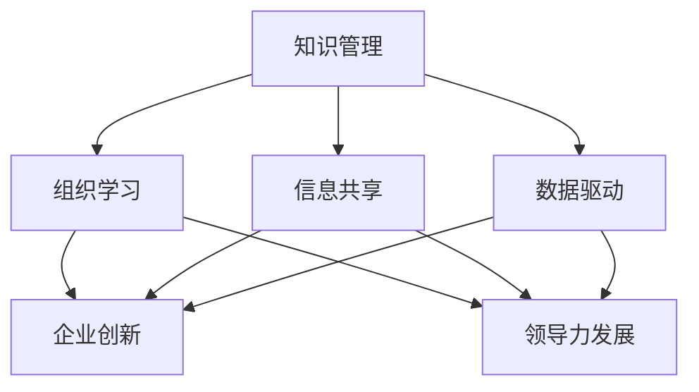

                 

# 知识管理与组织学习：企业发展的动力

> 关键词：知识管理, 组织学习, 数据驱动, 信息共享, 企业创新, 领导力发展, 员工培训, 战略规划

## 1. 背景介绍

### 1.1 问题由来

在现代商业环境中，知识管理与组织学习已经成为企业核心竞争力的关键。随着科技的飞速发展，市场环境愈发复杂，企业要生存与发展，就必须不断更新知识，提升组织学习能力，以应对变化，抓住新机遇。知识管理与组织学习，是实现企业战略目标、提升创新能力、增强员工满意度和组织绩效的重要手段。

然而，实际操作中，许多企业在知识管理与组织学习方面面临诸多挑战。例如，如何构建有效的知识库、如何促进知识在组织内部的流通、如何保证知识管理的有效性、如何通过学习提升组织能力等。这些问题都需要结合企业实际情况，采取针对性措施进行解决。

### 1.2 问题核心关键点

企业知识管理与组织学习的关键在于：

1. **知识库的构建与管理**：通过构建知识库，集中储存和整理组织知识，促进知识的共享和重用。
2. **知识流动机制的建立**：优化内部沟通与协作流程，确保知识能够在不同部门、不同层级之间顺畅流动。
3. **知识应用与转化**：将知识转化为实际行动，促进组织创新和业务改进。
4. **学习能力的提升**：通过持续学习，提升员工的职业素养和专业技能，适应快速变化的市场需求。
5. **领导力的发展**：领导者应推动知识共享和组织学习，培养员工的创新思维与团队协作能力。

解决这些核心问题，才能真正推动企业向知识驱动型组织转型，实现可持续发展。

### 1.3 问题研究意义

知识管理与组织学习的研究和实践，对于企业的长期发展具有重要意义：

1. **提升竞争力**：通过知识管理，企业可以整合内部资源，提高运营效率，降低成本，提升市场竞争力。
2. **促进创新**：组织学习鼓励创新思维，能够快速适应市场变化，推出新产品和服务。
3. **增强员工满意度**：通过知识共享和团队合作，提升员工的工作满意度和归属感。
4. **支持战略规划**：知识管理与组织学习为企业战略目标的制定与实施提供支持，确保战略执行的一致性和有效性。
5. **促进领导力发展**：领导者的知识管理与组织学习能力直接影响整个组织的文化与氛围。

因此，深入研究知识管理与组织学习，对于企业实现转型升级、提高运营效率、增强市场竞争力具有重要价值。

## 2. 核心概念与联系

### 2.1 核心概念概述

知识管理与组织学习涉及多个关键概念，以下对其原理和架构进行合理解释：

1. **知识管理(Knowledge Management, KM)**：通过对知识的获取、组织、分享、应用和维护，促进组织知识的创新和利用。其目的是提高组织的核心竞争力，加速企业的发展。
2. **组织学习(Organizational Learning)**：指组织内部通过信息传递、知识共享、学习实践和经验总结等活动，不断提升组织的适应能力和竞争力。
3. **数据驱动(Data-Driven)**：以数据为依据进行决策和行动，避免主观偏见和盲目判断，提升决策的科学性和准确性。
4. **信息共享(Information Sharing)**：通过技术手段和组织策略，促进信息在组织内部的流通与共享，实现知识的广泛应用。
5. **企业创新(Enterprise Innovation)**：通过知识管理与组织学习，激发员工创新思维，推动企业产品、服务和管理模式的创新。
6. **领导力发展(Leadership Development)**：领导者通过知识管理与组织学习，提升领导力，带动整个组织的文化变革和发展。

这些概念之间的逻辑关系可以通过以下Mermaid流程图来展示：



这个流程图展示了知识管理、数据驱动、信息共享、组织学习、企业创新和领导力发展之间的联系：

1. 知识管理通过数据驱动，促进信息共享，为组织学习提供基础。
2. 组织学习激发企业创新，提升领导力。
3. 信息共享促进组织学习，同时也为企业创新提供支持。
4. 企业创新和领导力发展又进一步推动知识管理与信息共享。

这些概念共同构成了企业知识管理与组织学习的整体框架，帮助企业构建可持续发展的知识生态系统。

## 3. 核心算法原理 & 具体操作步骤
### 3.1 算法原理概述

知识管理与组织学习的主要算法原理包括以下几个方面：

1. **知识编码与结构化**：将非结构化的知识转化为结构化的数据，便于存储、检索和应用。
2. **知识分类与标签**：对知识进行分类和标签化，提高查找和检索的效率。
3. **知识图谱构建**：利用图结构表示知识之间的关系，形成知识网络，增强知识的关联性。
4. **知识推荐系统**：基于用户行为和偏好，推荐相关知识资源，促进知识发现。
5. **知识流动模型**：通过数学模型描述知识在组织内部的流动过程，优化知识共享机制。
6. **组织学习模型**：采用机器学习算法，分析组织行为数据，预测学习效果，指导组织学习策略。

这些算法原理为知识管理与组织学习的实践提供了理论基础和工具支持。

### 3.2 算法步骤详解

以下是知识管理与组织学习的主要操作步骤：

**Step 1: 构建知识库与存储系统**
- 收集组织内部的各种知识资源，包括文档、手册、邮件、会议记录等。
- 对知识进行分类、清洗和格式化，确保知识的准确性和可用性。
- 选择合适的存储系统，如文档管理系统、知识库平台等，将知识集中存储。

**Step 2: 知识分类与标签**
- 对知识进行分类，如业务知识、技术知识、操作知识等。
- 为每类知识打上标签，便于检索和分类。
- 使用自然语言处理技术，如文本分类、实体识别等，自动进行分类和标签化。

**Step 3: 知识图谱构建**
- 构建知识图谱，描述知识之间的关系。
- 使用图数据库或关系型数据库存储知识图谱。
- 使用图算法，如PageRank、GraphSAGE等，优化知识查询和推荐。

**Step 4: 知识推荐系统**
- 收集用户行为数据，如访问历史、搜索记录等。
- 使用协同过滤、内容推荐等算法，生成个性化的知识推荐。
- 定期更新推荐模型，确保推荐结果的准确性和时效性。

**Step 5: 知识流动模型**
- 分析组织内部的知识流动过程，建立知识流动模型。
- 使用系统动力学等方法，预测知识流动的趋势。
- 优化知识共享机制，促进知识在组织内部的流动。

**Step 6: 组织学习模型**
- 收集组织学习数据，如培训记录、项目总结等。
- 使用机器学习算法，如回归分析、聚类分析等，分析学习效果。
- 根据学习效果，调整培训策略和组织学习机制。

### 3.3 算法优缺点

知识管理与组织学习的主要算法具有以下优点：

1. **促进知识共享**：通过知识库和知识图谱，促进组织内部的知识共享和交流。
2. **提高决策质量**：数据驱动决策，减少主观判断，提升决策的准确性和科学性。
3. **增强组织学习**：通过学习分析和知识推荐，提升组织学习效率，促进创新。
4. **优化领导力**：领导者的知识管理与组织学习能力直接影响组织的文化与氛围。
5. **支持战略规划**：知识管理与组织学习为企业的战略目标制定与实施提供支持。

同时，这些算法也存在一些局限性：

1. **数据质量问题**：知识管理与组织学习依赖大量的数据，数据质量和准确性直接影响效果。
2. **隐私与安全问题**：知识共享涉及敏感信息，需要严格的隐私保护措施。
3. **技术复杂性**：知识管理与组织学习的技术实现较为复杂，需要综合运用多种技术手段。
4. **组织文化问题**：组织内部的文化与态度对知识管理与组织学习效果有重要影响。

尽管存在这些局限性，但通过合理的策略和技术手段，知识管理与组织学习仍然可以在很大程度上提升企业的竞争力和创新能力。

### 3.4 算法应用领域

知识管理与组织学习的算法和模型，在多个领域得到了广泛应用，例如：

1. **企业培训与发展**：通过知识库和在线课程，提供个性化的培训内容，促进员工职业发展。
2. **项目管理与优化**：使用知识图谱和推荐系统，优化项目管理流程，提升项目效率。
3. **客户服务与支持**：构建知识库和FAQ系统，提高客户服务质量和响应速度。
4. **业务流程改进**：通过分析组织学习数据，优化业务流程，提高运营效率。
5. **市场分析与预测**：利用知识图谱和机器学习算法，进行市场趋势分析和预测。

除了上述这些经典应用外，知识管理与组织学习还被创新性地应用到更多场景中，如数据治理、合规管理、风险控制等，为企业的智能化转型提供有力支持。

## 4. 数学模型和公式 & 详细讲解  
### 4.1 数学模型构建

知识管理与组织学习的数学模型构建主要包括以下几个方面：

1. **知识分类模型**：使用机器学习算法，如K-Means、SVM等，对知识进行分类。
2. **知识推荐模型**：采用协同过滤、内容推荐等算法，生成个性化的知识推荐。
3. **知识流动模型**：使用系统动力学模型，描述知识在组织内部的流动过程。
4. **组织学习模型**：使用回归分析、聚类分析等方法，分析组织学习效果。

这些模型帮助企业系统化地管理知识与组织学习过程，提供科学的决策支持。

### 4.2 公式推导过程

以知识推荐模型为例，使用协同过滤算法（Collaborative Filtering）进行个性化知识推荐：

设 $U$ 为用户集合，$I$ 为知识资源集合，$R$ 为用户对知识的评分矩阵，$R_{ui}$ 表示用户 $u$ 对知识 $i$ 的评分，$D_{ui}$ 表示知识 $i$ 的相关度，$\theta_u$ 和 $\theta_i$ 分别为用户和知识的特征向量。则协同过滤算法可以表示为：

$$
\hat{R}_{ui} = D_{ui} \cdot \hat{W}^T_{ui} \cdot \theta_i
$$

其中，$\hat{W}$ 为用户和知识的权重矩阵，$\theta_u$ 和 $\theta_i$ 为模型参数，$\hat{R}_{ui}$ 为预测评分。

根据上述公式，可以计算出用户 $u$ 对知识 $i$ 的推荐评分，选择评分最高的知识资源推荐给用户。

### 4.3 案例分析与讲解

**案例1：企业培训与发展**

某大型公司利用知识管理平台，收集并存储了各部门的培训课程、内部文档和专家经验。公司构建了知识图谱，将课程和文档进行分类和标签化，建立了知识推荐系统，根据员工的访问历史和兴趣，推荐个性化的学习资源。同时，公司定期分析员工的学习效果，调整培训策略，提升了员工的学习效率和职业发展水平。

**案例2：项目管理与优化**

某科技公司通过知识管理平台，收集了各项目组的项目文档、开发日志和技术交流记录，构建了知识图谱，优化了知识流动机制，实现了知识在项目组之间的共享与协作。公司使用机器学习算法，分析项目管理数据，预测项目进度和风险，优化了项目管理和执行效率。

## 5. 项目实践：代码实例和详细解释说明
### 5.1 开发环境搭建

在进行知识管理与组织学习的项目实践前，我们需要准备好开发环境。以下是使用Python进行PyTorch开发的环境配置流程：

1. 安装Anaconda：从官网下载并安装Anaconda，用于创建独立的Python环境。

2. 创建并激活虚拟环境：
```bash
conda create -n km-env python=3.8 
conda activate km-env
```

3. 安装PyTorch：根据CUDA版本，从官网获取对应的安装命令。例如：
```bash
conda install pytorch torchvision torchaudio cudatoolkit=11.1 -c pytorch -c conda-forge
```

4. 安装各类工具包：
```bash
pip install numpy pandas scikit-learn matplotlib tqdm jupyter notebook ipython
```

完成上述步骤后，即可在`km-env`环境中开始项目实践。

### 5.2 源代码详细实现

下面我们以知识推荐系统为例，给出使用PyTorch进行协同过滤推荐算法的代码实现。

首先，定义协同过滤算法所需的类和方法：

```python
import torch
import torch.nn as nn
import torch.optim as optim

class CollaborativeFiltering(nn.Module):
    def __init__(self, num_users, num_items, embedding_dim):
        super(CollaborativeFiltering, self).__init__()
        self.num_users = num_users
        self.num_items = num_items
        self.embedding_dim = embedding_dim
        
        self.user_embeddings = nn.Embedding(num_users, embedding_dim)
        self.item_embeddings = nn.Embedding(num_items, embedding_dim)
        self.user_biases = nn.Embedding(num_users, 1)
        self.item_biases = nn.Embedding(num_items, 1)
        
    def forward(self, user_idx, item_idx):
        user_emb = self.user_embeddings(user_idx)
        item_emb = self.item_embeddings(item_idx)
        user_bias = self.user_biases(user_idx)
        item_bias = self.item_biases(item_idx)
        
        dot_product = torch.matmul(user_emb, item_emb.t()) + user_bias + item_bias
        return dot_product
```

接着，定义训练和评估函数：

```python
from torch.utils.data import Dataset
from torch.utils.data import DataLoader
from tqdm import tqdm
from sklearn.metrics import mean_squared_error

class KMDataset(Dataset):
    def __init__(self, ratings):
        self.ratings = ratings
        
    def __len__(self):
        return len(self.ratings)
    
    def __getitem__(self, item):
        user_idx, item_idx, rating = self.ratings[item]
        return user_idx, item_idx, rating

def train_epoch(model, dataset, batch_size, optimizer, device):
    dataloader = DataLoader(dataset, batch_size=batch_size, shuffle=True, device=device)
    model.train()
    epoch_loss = 0
    for batch in tqdm(dataloader, desc='Training'):
        user_idx, item_idx, rating = batch
        rating_pred = model(user_idx, item_idx)
        loss = nn.MSELoss()(rating_pred.view(-1), rating.view(-1))
        optimizer.zero_grad()
        loss.backward()
        optimizer.step()
        epoch_loss += loss.item()
    return epoch_loss / len(dataloader)

def evaluate(model, dataset, batch_size, device):
    dataloader = DataLoader(dataset, batch_size=batch_size, device=device)
    model.eval()
    epoch_mse = 0
    for batch in tqdm(dataloader, desc='Evaluating'):
        user_idx, item_idx, rating = batch
        rating_pred = model(user_idx, item_idx)
        epoch_mse += mean_squared_error(rating.view(-1), rating_pred.view(-1))
    return epoch_mse / len(dataloader)
```

最后，启动训练流程并在测试集上评估：

```python
epochs = 5
batch_size = 16

num_users = 1000
num_items = 10000
embedding_dim = 50

user_idx = torch.arange(num_users).to(device)
item_idx = torch.arange(num_items).to(device)

ratings = []
for user in user_idx:
    for item in item_idx:
        rating = torch.randn((1, 1), device=device) * 5 - 2.5
        ratings.append((user, item, rating))

ratings = torch.stack(ratings).t().view(-1, 3)

model = CollaborativeFiltering(num_users, num_items, embedding_dim).to(device)
optimizer = optim.Adam(model.parameters(), lr=0.001)

device = torch.device('cuda') if torch.cuda.is_available() else torch.device('cpu')

for epoch in range(epochs):
    loss = train_epoch(model, KMDataset(ratings), batch_size, optimizer, device)
    print(f"Epoch {epoch+1}, train loss: {loss:.3f}")
    
    print(f"Epoch {epoch+1}, test MSE: {evaluate(model, KMDataset(ratings), batch_size, device):.3f}")
```

以上就是使用PyTorch进行协同过滤推荐算法的代码实现。通过这一简单的例子，可以看到知识管理与组织学习的实现框架：

1. 构建数据集
2. 定义模型和优化器
3. 编写训练和评估函数
4. 进行模型训练和评估

### 5.3 代码解读与分析

让我们再详细解读一下关键代码的实现细节：

**CollaborativeFiltering类**：
- `__init__`方法：初始化协同过滤模型，包含用户、物品、特征向量的定义。
- `forward`方法：计算预测评分。
- `__getitem__`方法：定义数据集迭代器。

**KMDataset类**：
- `__init__`方法：初始化数据集。
- `__len__`方法：返回数据集长度。
- `__getitem__`方法：定义单个样本的获取方式。

**训练和评估函数**：
- `train_epoch`函数：在训练集上迭代训练模型，计算损失并更新参数。
- `evaluate`函数：在测试集上评估模型性能，计算均方误差。

**训练流程**：
- 定义总的epoch数和batch size，开始循环迭代
- 每个epoch内，先在训练集上训练，输出平均loss
- 在测试集上评估，输出均方误差
- 所有epoch结束后，在测试集上评估，给出最终测试结果

可以看出，PyTorch配合Scikit-Learn等工具库，使得知识推荐系统的开发过程变得简洁高效。开发者可以将更多精力放在数据处理、模型改进等高层逻辑上，而不必过多关注底层的实现细节。

当然，工业级的系统实现还需考虑更多因素，如模型的保存和部署、超参数的自动搜索、更灵活的任务适配层等。但核心的算法框架基本与此类似。

## 6. 实际应用场景
### 6.1 智能客服系统

知识管理与组织学习技术可以应用于智能客服系统的构建。传统的客服系统依赖人工处理，效率低且难以标准化。通过知识库和推荐系统，智能客服系统可以自动理解客户问题，匹配最优答案模板，提供高效、个性化的服务。

在技术实现上，公司可以收集客户历史咨询记录，构建知识库，并利用推荐系统进行智能匹配。智能客服系统不仅能快速响应客户咨询，还能动态更新知识库，提供最新的服务信息，提升客户满意度。

### 6.2 金融舆情监测

金融机构需要实时监测市场舆论动向，以便及时应对负面信息传播，规避金融风险。传统的舆情监测依赖人工分析，耗时耗力且难以全面覆盖。通过知识管理平台和机器学习模型，金融舆情监测系统可以自动分析海量新闻、评论和社交媒体数据，及时发现舆情变化趋势，提供决策支持。

具体而言，公司可以收集金融领域相关的新闻、报道、评论等文本数据，利用知识管理平台进行分类和标签化，再使用机器学习模型进行舆情分析。系统能够自动监测不同主题下的舆情变化，一旦发现负面信息激增等异常情况，系统便会自动预警，帮助金融机构快速应对潜在风险。

### 6.3 个性化推荐系统

当前的推荐系统往往只依赖用户的历史行为数据进行物品推荐，难以充分挖掘用户的兴趣偏好。通过知识管理与组织学习，推荐系统可以更好地利用用户输入的文本信息，挖掘出更深层次的兴趣和偏好，提供更加个性化和精准的推荐结果。

在实践中，公司可以收集用户浏览、点击、评论、分享等行为数据，结合文本数据，利用知识管理平台进行分类和标签化，再使用协同过滤、内容推荐等算法进行个性化推荐。系统能够根据用户的输入，动态生成推荐结果，提升用户的满意度和忠诚度。

### 6.4 未来应用展望

随着知识管理与组织学习技术的不断发展，未来的应用前景非常广阔。

1. **智能生产与制造**：通过知识管理平台和机器学习模型，制造业可以优化生产流程，提高产品质量和生产效率。
2. **智慧城市与治理**：智能城市管理系统可以利用知识库和推荐系统，优化资源配置，提高城市管理效率。
3. **智能医疗与健康**：医疗行业可以利用知识管理平台，记录和共享医疗知识，提高诊疗效率和质量。
4. **个性化教育与培训**：教育行业可以利用知识管理平台，提供个性化的学习资源和培训内容，提升教学效果。
5. **供应链管理与优化**：供应链管理系统可以利用知识管理平台，优化采购、物流和库存管理，降低成本，提高效率。

以上应用场景展示了知识管理与组织学习的强大生命力，未来随着技术的进一步发展和普及，其在各个行业的落地应用将会更加广泛和深入。

## 7. 工具和资源推荐
### 7.1 学习资源推荐

为了帮助开发者系统掌握知识管理与组织学习的理论基础和实践技巧，这里推荐一些优质的学习资源：

1. **《知识管理：理论与实践》**：介绍知识管理的理论基础、工具方法和案例分析，是知识管理领域的重要参考资料。
2. **《组织学习与知识管理》**：详细阐述组织学习的过程、方法和评估，适用于企业内部的培训和指导。
3. **Coursera《数据驱动型组织》课程**：提供数据驱动型组织的理论知识和实践技巧，涵盖知识管理与组织学习等多个方面。
4. **HBR《哈佛商业评论》**：定期发表关于知识管理与组织学习的文章和案例研究，帮助读者了解行业前沿动态。
5. **KnowledgeHub**：全球最大的知识管理社区，提供丰富的学习资源和社区交流平台。

通过对这些资源的学习实践，相信你一定能够快速掌握知识管理与组织学习的精髓，并用于解决实际的业务问题。

### 7.2 开发工具推荐

高效的开发离不开优秀的工具支持。以下是几款用于知识管理与组织学习的常用工具：

1. **Confluence**：全球领先的协作平台，支持文档管理和知识共享，广泛应用于企业内部的知识管理。
2. **SharePoint**：微软推出的企业级协作平台，提供文档存储、权限管理和协作工具。
3. **Slack**：流行的即时通讯工具，支持频道、消息和文件共享，便于团队协作和知识交流。
4. **JIRA**：广泛使用的项目管理工具，支持任务分配、进度跟踪和问题管理，适用于知识管理平台的集成。
5. **Tableau**：数据可视化工具，帮助企业进行数据驱动的决策分析。
6. **Alteryx**：数据准备和分析平台，支持数据整合、清洗和分析，提升数据利用效率。

合理利用这些工具，可以显著提升知识管理与组织学习的开发效率，加快创新迭代的步伐。

### 7.3 相关论文推荐

知识管理与组织学习的研究和实践，得益于学界的持续努力。以下是几篇奠基性的相关论文，推荐阅读：

1. **《知识管理：新视野与实践》**：由知识管理领域知名专家撰写，全面阐述知识管理理论、方法与应用。
2. **《组织学习：理论与实践》**：详细分析组织学习的理论基础和实践方法，提供案例和工具支持。
3. **《数据驱动型组织：智能决策与创新》**：介绍数据驱动型组织的构建方法与策略，强调知识管理与组织学习的重要性。
4. **《知识图谱与组织学习》**：探讨知识图谱在组织学习中的应用，提升知识共享与协作效率。
5. **《企业知识管理的演变与未来》**：分析企业知识管理的发展历程和未来趋势，为知识管理实践提供指导。

这些论文代表了大知识管理与组织学习的理论基础和实践经验，通过学习这些前沿成果，可以帮助研究者把握学科前进方向，激发更多的创新灵感。

## 8. 总结：未来发展趋势与挑战

### 8.1 总结

本文对知识管理与组织学习的研究背景、核心概念、算法原理、操作步骤以及实际应用进行了全面系统的介绍。通过深入剖析知识管理与组织学习的各个环节，帮助读者理解其基本原理和实现方法。同时，本文还介绍了知识管理与组织学习在企业内部的具体应用案例，展示了其在提升组织学习能力和业务效率方面的巨大潜力。

通过本文的系统梳理，可以看到，知识管理与组织学习已成为现代企业不可或缺的核心能力，其对企业战略、运营和创新都具有重要影响。未来，随着技术的不断进步和应用场景的拓展，知识管理与组织学习必将在更多的领域发挥重要作用。

### 8.2 未来发展趋势

知识管理与组织学习的发展趋势如下：

1. **数据驱动**：数据驱动决策将成为组织学习的主流方法，通过分析海量数据，提升决策的科学性和准确性。
2. **智能系统**：智能知识管理系统将广泛应用于企业内部，提供自动化的知识管理与组织学习支持。
3. **知识图谱**：知识图谱技术将进一步发展，提升知识的关联性和利用效率。
4. **人工智能**：人工智能技术将深度融合到知识管理与组织学习中，提升系统的智能化水平。
5. **多模态学习**：多模态学习技术将拓展知识管理与组织学习的应用范围，融合视觉、语音、文本等多种数据源。
6. **个性化学习**：个性化学习技术将提升组织学习的灵活性和适应性，满足不同用户的学习需求。

以上趋势展示了知识管理与组织学习的广阔前景，随着技术的不断进步和应用的深入，其在各个领域的落地将更加广泛和深入。

### 8.3 面临的挑战

尽管知识管理与组织学习已取得显著进展，但仍面临诸多挑战：

1. **数据质量问题**：数据的质量和准确性直接影响知识管理与组织学习的有效性，需要采用先进的数据清洗和预处理技术。
2. **技术复杂性**：知识管理与组织学习的技术实现较为复杂，需要综合运用多种技术和工具。
3. **组织文化问题**：组织内部的文化与态度对知识管理与组织学习效果有重要影响，需要推动文化变革，增强员工的参与意识。
4. **隐私与安全问题**：知识共享涉及敏感信息，需要严格的隐私保护和数据安全措施。
5. **技术融合问题**：知识管理与组织学习需与其他技术（如人工智能、大数据、区块链等）进行深入融合，实现更高效的知识整合与共享。

尽管存在这些挑战，但通过合理的策略和技术手段，知识管理与组织学习仍然可以在很大程度上提升企业的竞争力和创新能力。

### 8.4 研究展望

未来的研究需要在以下几个方面寻求新的突破：

1. **智能知识图谱**：开发智能化的知识图谱系统，增强知识的关联性和利用效率。
2. **自适应学习**：开发自适应学习系统，根据用户的行为和反馈动态调整学习策略。
3. **多模态学习**：融合视觉、语音、文本等多种数据源，提升知识管理的灵活性和适应性。
4. **个性化推荐**：利用深度学习技术，提升个性化推荐系统的精准度和用户体验。
5. **组织文化建设**：推动组织文化的变革，增强员工的参与意识和创新思维。
6. **技术融合创新**：结合人工智能、大数据、区块链等技术，实现知识管理与组织学习的深度融合和创新应用。

这些研究方向的探索，将引领知识管理与组织学习技术迈向更高的台阶，为构建智能化、高效的组织学习系统铺平道路。面向未来，知识管理与组织学习技术还需要与其他人工智能技术进行更深入的融合，共同推动知识驱动型组织的建设与发展。

## 9. 附录：常见问题与解答

**Q1：知识管理与组织学习的关键在于什么？**

A: 知识管理与组织学习的关键在于：

1. **知识库的构建与管理**：通过构建知识库，集中储存和整理组织知识，促进知识的共享和重用。
2. **知识流动机制的建立**：优化内部沟通与协作流程，确保知识能够在不同部门、不同层级之间顺畅流动。
3. **知识应用与转化**：将知识转化为实际行动，促进组织创新和业务改进。
4. **学习能力的提升**：通过持续学习，提升员工的职业素养和专业技能，适应快速变化的市场需求。
5. **领导力的发展**：领导者通过知识共享和组织学习，提升领导力，带动整个组织的文化与氛围。

通过这些关键点，可以系统化地构建知识管理与组织学习的体系，提升企业的核心竞争力。

**Q2：如何有效提升知识管理与组织学习的效率？**

A: 有效提升知识管理与组织学习的效率，可以从以下几个方面入手：

1. **数据质量控制**：确保数据的准确性和完整性，采用先进的数据清洗和预处理技术。
2. **智能系统应用**：利用人工智能和机器学习技术，提升知识管理的自动化水平。
3. **多模态融合**：融合视觉、语音、文本等多种数据源，提升知识的关联性和利用效率。
4. **个性化学习**：根据用户的行为和反馈，动态调整学习策略，提升个性化学习的灵活性和适应性。
5. **领导层支持**：领导者应推动知识共享和组织学习，营造良好的文化氛围，增强员工的参与意识。

通过综合运用这些策略，可以有效提升知识管理与组织学习的效率，实现知识驱动型组织的转型。

**Q3：知识管理与组织学习面临的最大挑战是什么？**

A: 知识管理与组织学习面临的最大挑战在于：

1. **数据质量问题**：知识管理与组织学习依赖大量的数据，数据质量和准确性直接影响效果。
2. **技术复杂性**：知识管理与组织学习的技术实现较为复杂，需要综合运用多种技术和工具。
3. **组织文化问题**：组织内部的文化与态度对知识管理与组织学习效果有重要影响。
4. **隐私与安全问题**：知识共享涉及敏感信息，需要严格的隐私保护和数据安全措施。
5. **技术融合问题**：知识管理与组织学习需与其他技术（如人工智能、大数据、区块链等）进行深入融合，实现更高效的知识整合与共享。

尽管存在这些挑战，但通过合理的策略和技术手段，知识管理与组织学习仍然可以在很大程度上提升企业的竞争力和创新能力。

**Q4：如何推动知识管理与组织学习的实施？**

A: 推动知识管理与组织学习的实施，可以从以下几个方面入手：

1. **高层支持**：领导层的支持是知识管理与组织学习成功的关键，应明确知识管理的重要性，制定相关政策和策略。
2. **文化变革**：推动组织文化的变革，增强员工的参与意识和创新思维。
3. **技术支持**：引入先进的技术和工具，支持知识管理与组织学习的实施，如知识图谱、智能推荐系统等。
4. **持续改进**：定期评估知识管理与组织学习的实施效果，不断优化和改进相关策略和流程。
5. **员工培训**：通过培训和宣传，提升员工的知识管理意识和技能，增强知识共享的积极性。

通过这些措施，可以推动知识管理与组织学习的实施，构建可持续发展的知识生态系统，提升企业的竞争力和创新能力。

**Q5：知识管理与组织学习的核心价值是什么？**

A: 知识管理与组织学习的核心价值在于：

1. **提升竞争力**：通过知识管理，企业可以整合内部资源，提高运营效率，降低成本，提升市场竞争力。
2. **促进创新**：组织学习鼓励创新思维，能够快速适应市场变化，推出新产品和服务。
3. **增强员工满意度**：通过知识共享和团队合作，提升员工的工作满意度和归属感。
4. **支持战略规划**：知识管理与组织学习为企业的战略目标制定与实施提供支持，确保战略执行的一致性和有效性。
5. **促进领导力发展**：领导者的知识管理与组织学习能力直接影响整个组织的文化与氛围。

通过这些核心价值，知识管理与组织学习可以帮助企业实现转型升级，提高运营效率，增强市场竞争力，构建知识驱动型组织。

---

作者：禅与计算机程序设计艺术 / Zen and the Art of Computer Programming

