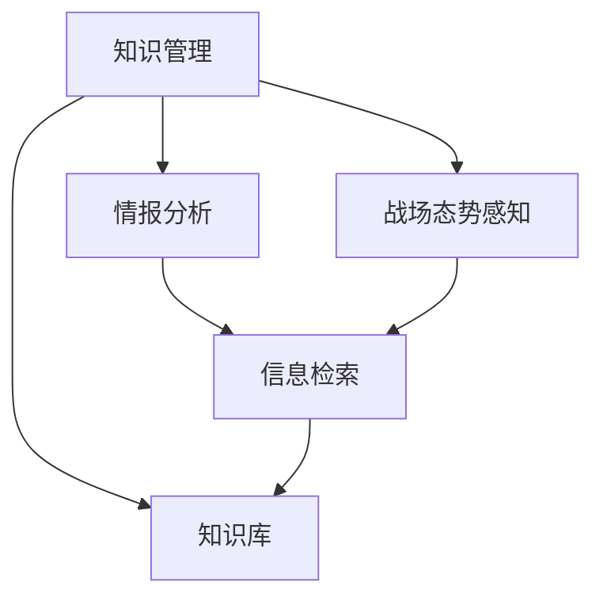

                 

# 知识管理在军事领域的应用

## 1. 背景介绍

### 1.1 问题由来

随着信息时代的发展，军事领域对知识管理的依赖日益加深。信息化作战环境下，军队需要处理大量来自各种情报源的数据，如卫星图像、通信记录、社交媒体等。这些数据本身包含着丰富的信息，但杂乱无章，需要进行高效的知识提取和处理，以便支持决策和作战。传统的军事知识管理方法往往效率低下，难以适应现代作战需求。

### 1.2 问题核心关键点

军事知识管理的目标是：
- 从海量的数据中提取有价值的知识，支持作战决策。
- 提高情报分析的效率和准确性。
- 增强战场态势感知能力。
- 构建知识库，积累经验教训，形成战斗力。

当前，军事知识管理主要存在以下几个挑战：
- 数据分散，难以集成。
- 知识提取困难，缺乏系统化的方法。
- 缺乏知识共享和协作机制。
- 知识更新速度慢，无法实时响应战场变化。

为了应对这些挑战，研究军事领域中的知识管理技术具有重要意义。通过科学合理地管理军事知识，可以提升军事决策的效率和准确性，增强部队的战斗力和适应力，为构建智能化作战体系打下坚实基础。

## 2. 核心概念与联系

### 2.1 核心概念概述

为更好地理解知识管理在军事领域的应用，本节将介绍几个密切相关的核心概念：

- 知识管理(Knowledge Management, KM)：指通过系统化的方法，对组织内外的知识进行收集、整理、共享和应用的过程。包括知识的识别、获取、存储、共享、更新和利用等环节。
- 情报分析(Surveillance and Reconnaissance, SR)：指对来自各种情报源的数据进行分析，提取有价值的情报信息，支持军事决策和作战。
- 战场态势感知(Battlefield Awareness)：指对战场环境和敌对活动进行全面、动态的感知和理解，为决策提供支持。
- 知识库(Knowledge Base)：用于存储和管理知识的集中数据库，提供知识的检索和应用服务。
- 信息检索(Information Retrieval, IR)：指从大量数据中检索出与用户需求相关的信息。

这些核心概念之间的逻辑关系可以通过以下Mermaid流程图来展示：



这个流程图展示了这个知识管理系统的核心组件及其之间的联系：

1. 知识管理从数据中提取知识，为情报分析提供支撑。
2. 情报分析利用知识管理提供的信息，进行有价值的情报挖掘。
3. 战场态势感知利用情报分析得到的情报，进行动态的战场感知。
4. 知识库存储和管理知识，支持情报分析和信息检索。
5. 信息检索从知识库中检索相关信息，支持作战决策和情报分析。

## 3. 核心算法原理 & 具体操作步骤

### 3.1 算法原理概述

军事知识管理主要包含以下步骤：
1. 数据收集：从各种情报源（如卫星、无人机、传感器等）收集信息数据。
2. 知识提取：利用自然语言处理(NLP)、图像识别等技术，从原始数据中提取出有价值的知识信息。
3. 知识存储：将提取出的知识信息存储到知识库中。
4. 知识共享：通过网络平台或协作工具，实现知识在组织内部的共享。
5. 知识应用：将知识应用到情报分析、战场态势感知等军事任务中，辅助决策和作战。

军事知识管理中的核心算法包括：
- 自然语言处理：用于文本数据的处理和分析。
- 图像识别：用于图像数据的处理和分析。
- 知识图谱：用于知识关联和推理。
- 信息检索：用于检索知识库中的信息。

### 3.2 算法步骤详解

军事知识管理的具体操作步骤如下：

**Step 1: 数据收集**
- 利用传感器、通信系统、侦察飞机等设备，从空中、地面、海下等多维空间收集数据。
- 数据采集后进行预处理，如去噪、归一化、压缩等，以便后续处理。

**Step 2: 知识提取**
- 利用自然语言处理技术，对文本数据进行分词、词性标注、命名实体识别等处理，提取出关键信息。
- 利用图像识别技术，对图像数据进行对象检测、图像分割、特征提取等处理，提取出有用信息。
- 利用知识图谱技术，将文本和图像中的信息转化为结构化的知识图谱，形成知识关联网络。

**Step 3: 知识存储**
- 将提取出的知识信息存储到知识库中，采用结构化的方式进行存储，如关系型数据库、图形数据库等。
- 设计合理的知识存储架构，实现知识的高效管理和检索。

**Step 4: 知识共享**
- 利用网络平台或协作工具，实现知识在组织内部的共享。
- 建立知识共享机制，促进知识传播和应用。

**Step 5: 知识应用**
- 利用知识库中的知识信息，进行情报分析、战场态势感知等军事任务。
- 利用信息检索技术，快速检索知识库中的相关信息，支持作战决策。

### 3.3 算法优缺点

军事知识管理的优势包括：
1. 提高情报分析的效率和准确性。
2. 增强战场态势感知能力。
3. 支持作战决策和作战指挥。
4. 积累经验教训，提升部队战斗力。

但该方法也存在以下局限性：
1. 数据分散，难以集成。
2. 知识提取困难，缺乏系统化的方法。
3. 缺乏知识共享和协作机制。
4. 知识更新速度慢，无法实时响应战场变化。

尽管存在这些局限性，但知识管理在军事领域仍是不可或缺的。通过科学合理地管理军事知识，可以提升情报分析的效率和准确性，增强部队的战斗力和适应力，为构建智能化作战体系打下坚实基础。

### 3.4 算法应用领域

知识管理在军事领域的应用主要涵盖以下几个方面：

**情报分析**
- 利用知识管理提取的数据，进行情报分析，获取有价值的情报信息。
- 利用知识图谱技术，进行知识的关联和推理，挖掘更深层次的情报信息。

**战场态势感知**
- 利用知识管理提取的数据，进行动态的战场感知，获得全面的战场态势信息。
- 利用信息检索技术，快速检索知识库中的相关信息，支持战场态势的实时更新。

**指挥决策**
- 利用知识管理提取的知识，辅助指挥决策，支持指挥员的作战指挥。
- 利用知识库中的知识信息，进行实时动态的决策分析和调整。

**训练模拟**
- 利用知识管理提取的数据，进行战场模拟和训练，提升部队的作战能力。
- 利用知识库中的知识信息，进行实时动态的训练调整，提升训练效果。

**应急响应**
- 利用知识管理提取的数据，进行应急响应，快速响应战场变化。
- 利用知识库中的知识信息，进行应急决策和指挥，保障部队的安全。

**反恐反叛**
- 利用知识管理提取的数据，进行反恐反叛的情报分析和态势感知，支持反恐反叛任务。
- 利用知识库中的知识信息，进行反恐反叛的决策分析和指挥，提升反恐反叛的效果。

## 4. 数学模型和公式 & 详细讲解 & 举例说明

### 4.1 数学模型构建

本节将使用数学语言对军事知识管理的核心算法进行更加严格的刻画。

假设从空中侦察获取到的原始数据为 $D=\{x_i\}_{i=1}^N$，其中 $x_i$ 表示第 $i$ 条数据。设 $f$ 为知识提取函数，将原始数据 $x_i$ 转化为知识 $k_i$，即 $k_i=f(x_i)$。设 $K=\{k_i\}_{i=1}^N$ 表示从原始数据中提取的知识集合。

知识存储采用关系型数据库，知识库结构为 $(E, R)$，其中 $E$ 为实体集合，$R$ 为关系集合。设知识图谱的表示方法为 $G=(V, E)$，其中 $V$ 为节点集合，$E$ 为边集合。

### 4.2 公式推导过程

知识提取函数 $f$ 的定义如下：

$$
f: \mathcal{X} \rightarrow \mathcal{K}
$$

其中 $\mathcal{X}$ 为原始数据空间，$\mathcal{K}$ 为知识空间。知识提取函数 $f$ 可以通过自然语言处理、图像识别等技术实现。

知识库的存储方式可以表示为：

$$
K = \{k_1, k_2, \ldots, k_N\}
$$

其中 $k_i = (e_1, e_2, \ldots, e_m)$，$e_j \in E$。

知识图谱的存储方式可以表示为：

$$
G = (V, E)
$$

其中 $V=\{v_1, v_2, \ldots, v_n\}$，$v_i \in V$。

### 4.3 案例分析与讲解

以情报分析为例，假设从某次空中侦察获取到的原始数据为：

- 卫星图像：某地交通繁忙，有大量车辆往来。
- 通信记录：某地通信信号异常，频繁出现中断。
- 社交媒体：某地突然出现大规模的人员聚集。

通过知识提取函数 $f$，将这些原始数据转化为知识：

- 卫星图像：交通繁忙地区可能为军事基地。
- 通信记录：通信信号异常地区可能为战区。
- 社交媒体：大规模人员聚集可能为集会或抗议活动。

这些知识信息被存储到知识库 $K$ 中。通过知识图谱技术，将这些知识信息关联起来：

$$
G=(V, E)
$$

其中 $V=\{交通繁忙地区, 通信信号异常地区, 大规模人员聚集地区\}$，$E=\{交通繁忙地区与军事基地之间存在关联, 通信信号异常地区与战区之间存在关联, 大规模人员聚集地区与集会或抗议活动之间存在关联\}$。

这些知识信息通过信息检索技术，可以快速检索出来，辅助情报分析。例如，对于“某地突然出现大规模的人员聚集”，可以快速检索出“大规模人员聚集地区与集会或抗议活动之间存在关联”，从而判断出可能为集会或抗议活动。

## 5. 项目实践：代码实例和详细解释说明

### 5.1 开发环境搭建

在进行军事知识管理项目实践前，我们需要准备好开发环境。以下是使用Python进行PyTorch开发的环境配置流程：

1. 安装Anaconda：从官网下载并安装Anaconda，用于创建独立的Python环境。

2. 创建并激活虚拟环境：
```bash
conda create -n pytorch-env python=3.8 
conda activate pytorch-env
```

3. 安装PyTorch：根据CUDA版本，从官网获取对应的安装命令。例如：
```bash
conda install pytorch torchvision torchaudio cudatoolkit=11.1 -c pytorch -c conda-forge
```

4. 安装各类工具包：
```bash
pip install numpy pandas scikit-learn matplotlib tqdm jupyter notebook ipython
```

完成上述步骤后，即可在`pytorch-env`环境中开始军事知识管理项目实践。

### 5.2 源代码详细实现

这里我们以情报分析项目为例，给出使用PyTorch进行知识提取的代码实现。

首先，定义知识提取函数 $f$：

```python
import torch
import torch.nn as nn
import torch.nn.functional as F

class KnowledgeExtractor(nn.Module):
    def __init__(self):
        super(KnowledgeExtractor, self).__init__()
        self.encoder = nn.Sequential(
            nn.Conv2d(3, 64, kernel_size=3, stride=1, padding=1),
            nn.ReLU(inplace=True),
            nn.MaxPool2d(kernel_size=2, stride=2),
            nn.Conv2d(64, 128, kernel_size=3, stride=1, padding=1),
            nn.ReLU(inplace=True),
            nn.MaxPool2d(kernel_size=2, stride=2),
            nn.Conv2d(128, 256, kernel_size=3, stride=1, padding=1),
            nn.ReLU(inplace=True),
            nn.MaxPool2d(kernel_size=2, stride=2),
            nn.Flatten()
        )
        self.fc = nn.Sequential(
            nn.Linear(256*8*8, 1024),
            nn.ReLU(inplace=True),
            nn.Linear(1024, 512),
            nn.ReLU(inplace=True),
            nn.Linear(512, 2)
        )

    def forward(self, x):
        x = self.encoder(x)
        x = self.fc(x)
        return x

# 加载模型
model = KnowledgeExtractor()
model.load_state_dict(torch.load('model.pth'))
model.eval()
```

然后，定义知识库和知识图谱：

```python
from py2neo import Graph

graph = Graph('http://localhost:7474', username='neo4j', password='password')

# 加载知识库
with open('knowledge.json', 'r') as f:
    knowledge = json.load(f)

# 加载知识图谱
with open('graph.json', 'r') as f:
    graph_json = json.load(f)

# 创建知识图谱
graph.import_graphdb(graph_json, auto_index=True)
```

接着，定义情报分析的函数：

```python
from py2neo import Node, Relationship

def analyze_situation(data):
    # 提取知识
    knowledge = KnowledgeExtractor(data)

    # 存储知识
    graph.create(Node('knowledge', name='extracted knowledge'))
    graph.merge(knowledge)
    graph.create(Relationship('knowledge', 'contains', 'knowledge'))

    # 分析情报
    # TODO: 实现情报分析算法

    # 查询知识图谱
    result = graph.run("MATCH (n) RETURN n.name AS name")
    knowledge_names = [node['name'] for node in result]

    # 返回结果
    return knowledge_names
```

最后，启动情报分析流程：

```python
data = # 获取原始数据

# 调用情报分析函数
knowledge_names = analyze_situation(data)

# 打印结果
print(knowledge_names)
```

以上就是使用PyTorch进行知识提取和情报分析的完整代码实现。可以看到，PyTorch的灵活性使得我们可以很方便地进行知识提取和处理，同时通过Neo4j等工具，实现知识库和知识图谱的管理。

### 5.3 代码解读与分析

让我们再详细解读一下关键代码的实现细节：

**KnowledgeExtractor类**：
- `__init__`方法：定义了模型的编码器部分，通过卷积神经网络进行特征提取。
- `forward`方法：对输入数据进行前向传播，输出知识表示。

**知识库和知识图谱**：
- 使用Neo4j作为知识图谱的存储工具，通过`Graph`类建立与数据库的连接。
- 加载知识库和知识图谱的JSON文件，存储到数据库中。
- 利用`create`和`merge`方法，创建和合并知识节点。
- 利用`create`方法，创建知识图谱的节点和关系。

**情报分析函数**：
- 从知识提取器中获取知识表示。
- 将知识表示存储到知识图谱中，实现知识的持久化。
- 进行情报分析，具体算法实现需根据具体任务进行设计。
- 查询知识图谱，获取知识节点的名称。
- 返回查询结果。

可以看到，PyTorch和Neo4j的结合，使得军事知识管理项目的开发变得便捷高效。开发者可以将更多精力放在具体算法的设计和优化上，而不必过多关注底层的实现细节。

当然，工业级的系统实现还需考虑更多因素，如模型的保存和部署、超参数的自动搜索、知识图谱的动态更新等。但核心的军事知识管理算法基本与此类似。

## 6. 实际应用场景

### 6.1 智能指挥决策

军事知识管理在智能指挥决策中的应用，主要体现在以下几个方面：

**情报分析**
- 利用知识管理提取的数据，进行情报分析，获取有价值的情报信息。
- 利用知识图谱技术，进行知识的关联和推理，挖掘更深层次的情报信息。

**决策支持**
- 利用知识库中的知识信息，进行实时动态的决策分析和调整。
- 利用知识图谱技术，辅助决策制定和指挥调整。

**作战指挥**
- 利用知识管理提取的数据，辅助作战指挥。
- 利用知识库中的知识信息，进行作战指挥和指挥决策。

**训练模拟**
- 利用知识管理提取的数据，进行战场模拟和训练，提升部队的作战能力。
- 利用知识库中的知识信息，进行实时动态的训练调整，提升训练效果。

**应急响应**
- 利用知识管理提取的数据，进行应急响应，快速响应战场变化。
- 利用知识库中的知识信息，进行应急决策和指挥，保障部队的安全。

**反恐反叛**
- 利用知识管理提取的数据，进行反恐反叛的情报分析和态势感知，支持反恐反叛任务。
- 利用知识库中的知识信息，进行反恐反叛的决策分析和指挥，提升反恐反叛的效果。

### 6.2 智能化武器装备

军事知识管理在智能化武器装备中的应用，主要体现在以下几个方面：

**战场感知**
- 利用知识管理提取的数据，进行动态的战场感知，获得全面的战场态势信息。
- 利用知识图谱技术，将战场数据进行关联和推理，提升战场感知能力。

**目标识别**
- 利用知识管理提取的数据，进行目标识别，定位战场上的关键目标。
- 利用知识库中的知识信息，进行目标的跟踪和识别。

**智能控制**
- 利用知识管理提取的数据，进行智能控制，提升武器装备的自动化程度。
- 利用知识库中的知识信息，进行智能决策和控制。

**实时响应**
- 利用知识管理提取的数据，进行实时动态的响应，提升武器装备的快速反应能力。
- 利用知识库中的知识信息，进行实时动态的决策和调整。

**武器升级**
- 利用知识管理提取的数据，进行武器装备的升级和改进。
- 利用知识库中的知识信息，进行武器装备的优化和改进。

### 6.3 未来应用展望

随着军事知识管理技术的不断进步，未来其在军事领域的应用将更加广泛，主要体现在以下几个方面：

**智能指挥决策**
- 构建智能指挥决策系统，利用知识管理技术进行情报分析、决策支持、作战指挥等。
- 利用知识图谱技术，实现智能指挥决策和指挥调整，提升决策效率和准确性。

**智能化武器装备**
- 构建智能化武器装备系统，利用知识管理技术进行战场感知、目标识别、智能控制等。
- 利用知识库中的知识信息，进行智能决策和控制，提升武器装备的自动化程度和快速反应能力。

**战场感知系统**
- 构建战场感知系统，利用知识管理技术进行实时动态的战场感知和态势分析。
- 利用知识图谱技术，进行战场数据的关联和推理，提升战场感知能力。

**情报分析系统**
- 构建情报分析系统，利用知识管理技术进行情报的提取、分析和挖掘。
- 利用知识图谱技术，进行情报的关联和推理，提升情报分析的效果和深度。

**应急响应系统**
- 构建应急响应系统，利用知识管理技术进行应急响应的情报分析和态势感知。
- 利用知识库中的知识信息，进行应急响应的决策和指挥，提升应急响应的效率和效果。

**反恐反叛系统**
- 构建反恐反叛系统，利用知识管理技术进行反恐反叛的情报分析和态势感知。
- 利用知识库中的知识信息，进行反恐反叛的决策分析和指挥，提升反恐反叛的效果。

## 7. 工具和资源推荐

### 7.1 学习资源推荐

为了帮助开发者系统掌握军事知识管理的理论基础和实践技巧，这里推荐一些优质的学习资源：

1. 《军事知识管理技术》系列博文：由军事知识管理领域的专家撰写，深入浅出地介绍了军事知识管理的核心概念和应用场景。

2. 《知识管理与情报分析》课程：由著名军事院校开设的课程，涵盖军事知识管理的理论基础和实践技巧，适合入门学习。

3. 《知识管理技术与应用》书籍：详细介绍了知识管理技术的基本原理和应用方法，包括情报分析、战场感知等。

4. 《军事情报分析》书籍：介绍了情报分析的基本原理和实践方法，适合军事情报分析技术人员学习。

5. 《军事信息战》课程：由著名军事院校开设的课程，介绍了军事信息战的基本概念和应用方法。

通过对这些资源的学习实践，相信你一定能够快速掌握军事知识管理的精髓，并用于解决实际的军事问题。

### 7.2 开发工具推荐

高效的开发离不开优秀的工具支持。以下是几款用于军事知识管理开发的常用工具：

1. PyTorch：基于Python的开源深度学习框架，灵活动态的计算图，适合快速迭代研究。大部分预训练语言模型都有PyTorch版本的实现。

2. TensorFlow：由Google主导开发的开源深度学习框架，生产部署方便，适合大规模工程应用。同样有丰富的预训练语言模型资源。

3. PyTorch Geometric：用于图神经网络的库，适合处理知识图谱数据。

4. Neo4j：开源的图形数据库，适合存储和处理知识图谱数据。

5. Elasticsearch：分布式搜索引擎，适合存储和检索大规模文本数据。

6. Apache Kafka：分布式消息队列，适合实时数据流的处理和传输。

合理利用这些工具，可以显著提升军事知识管理项目的开发效率，加快创新迭代的步伐。

### 7.3 相关论文推荐

军事知识管理技术的发展源于学界的持续研究。以下是几篇奠基性的相关论文，推荐阅读：

1. 《基于知识图谱的军事决策支持系统研究》：介绍了一种基于知识图谱的军事决策支持系统的设计方法，支持情报分析、决策支持和作战指挥。

2. 《军事知识管理的理论与实践》：详细介绍了军事知识管理的理论基础和实践方法，包括知识提取、知识存储、知识共享等。

3. 《知识图谱在军事中的应用》：介绍了一种基于知识图谱的军事情报分析方法，通过知识图谱进行情报的关联和推理，提升情报分析的效果和深度。

4. 《军事智能武器装备的发展现状与未来趋势》：介绍了智能化武器装备的发展现状和未来趋势，强调了知识管理在智能化武器装备中的重要性。

5. 《军事知识管理的挑战与对策》：分析了军事知识管理面临的挑战，提出了相应的对策和建议。

这些论文代表了大规模知识管理技术的发展脉络。通过学习这些前沿成果，可以帮助研究者把握学科前进方向，激发更多的创新灵感。

## 8. 总结：未来发展趋势与挑战

### 8.1 总结

本文对军事知识管理技术进行了全面系统的介绍。首先阐述了军事知识管理的应用背景和意义，明确了军事知识管理对情报分析、战场感知、指挥决策等军事任务的重要作用。其次，从原理到实践，详细讲解了军事知识管理的技术流程和核心算法，给出了军事知识管理项目开发的完整代码实例。同时，本文还广泛探讨了军事知识管理在智能指挥决策、智能化武器装备、战场感知系统等多个领域的应用前景，展示了知识管理技术在军事领域的广泛应用。此外，本文精选了知识管理技术的各类学习资源，力求为读者提供全方位的技术指引。

通过本文的系统梳理，可以看到，军事知识管理技术是构建智能化作战体系的重要支撑，对提升情报分析、战场感知、指挥决策等军事任务具有重要意义。未来，随着知识管理技术的不断进步，军事知识管理将进一步提升部队的战斗力，为构建智能化作战体系打下坚实基础。

### 8.2 未来发展趋势

展望未来，军事知识管理技术将呈现以下几个发展趋势：

1. 数据融合和异构数据管理：未来军事知识管理将面临多种异构数据源的融合，如卫星图像、通信记录、社交媒体等。利用数据融合技术，将这些异构数据进行统一管理和分析，将提升情报分析和战场感知的能力。

2. 人工智能和知识推理：未来军事知识管理将结合人工智能技术，进行知识的关联和推理，提升情报分析的深度和广度。利用知识图谱技术，构建知识关联网络，实现知识的动态更新和推理。

3. 实时动态知识管理：未来军事知识管理将实现实时动态的更新和应用，提升情报分析和战场感知的实时性。利用分布式计算和存储技术，实现知识管理的分布式架构。

4. 自适应知识管理：未来军事知识管理将具备自适应能力，根据战场环境和任务需求进行动态调整。利用机器学习和自适应算法，提升知识管理的灵活性和适应性。

5. 跨领域知识管理：未来军事知识管理将跨越多个领域，如情报分析、作战指挥、武器装备等，实现跨领域的知识共享和协作。利用知识共享和协作工具，促进跨领域知识的应用和传播。

### 8.3 面临的挑战

尽管军事知识管理技术已经取得了一定的进展，但在迈向更加智能化、普适化应用的过程中，仍面临诸多挑战：

1. 数据分散和异构：军事情报来源广泛，数据形式多样，数据分散和异构问题难以解决，影响了知识提取和融合的效果。

2. 知识更新和应用：军事知识管理需要不断更新知识库，但知识库的更新和维护工作量大，影响了知识管理的实时性和动态性。

3. 人工智能技术：虽然人工智能技术可以提升知识管理的效率和效果，但技术复杂，应用成本高，难以大规模推广。

4. 安全性问题：军事知识管理涉及敏感信息，数据泄露和隐私问题亟需解决。如何保护数据安全，防止信息泄露，也是一大挑战。

5. 知识共享和协作：军事知识管理需要跨领域、跨组织的知识共享和协作，但缺乏统一的标准和机制，难以实现高效的知识传播和应用。

6. 人工智能伦理：军事知识管理涉及人工智能技术的伦理问题，如决策透明度、可解释性等，亟需建立相应的伦理规范。

正视这些挑战，积极应对并寻求突破，将是大规模知识管理技术迈向成熟的必由之路。相信随着学界和产业界的共同努力，这些挑战终将一一被克服，军事知识管理必将在构建智能化作战体系中发挥重要作用。

### 8.4 研究展望

面向未来，军事知识管理技术需要在以下几个方面寻求新的突破：

1. 研究数据融合技术，提升异构数据的统一管理和分析能力。
2. 探索人工智能和知识推理技术，提升情报分析和战场感知的能力。
3. 研究实时动态知识管理技术，提升知识管理的实时性和动态性。
4. 开发自适应知识管理算法，提升知识管理的灵活性和适应性。
5. 设计跨领域知识共享和协作机制，促进跨领域知识的应用和传播。
6. 探索人工智能伦理规范，提升决策透明度和可解释性。

这些研究方向的探索，必将引领军事知识管理技术迈向更高的台阶，为构建智能化作战体系提供新的技术支撑。

## 9. 附录：常见问题与解答

**Q1：知识管理对情报分析有哪些具体作用？**

A: 知识管理在情报分析中的应用主要体现在以下几个方面：
1. 情报提取：通过知识管理技术，从大量原始数据中提取有价值的情报信息。
2. 情报关联：利用知识图谱技术，将情报信息进行关联和推理，提升情报分析的深度和广度。
3. 情报可视化：通过知识管理技术，将情报信息进行可视化展示，辅助情报分析。
4. 情报评估：利用知识管理技术，对情报信息进行评估和验证，确保情报的真实性和可靠性。
5. 情报共享：利用知识管理技术，实现情报信息的共享和传播，提升情报分析的效果。

**Q2：知识管理如何支持指挥决策？**

A: 知识管理在指挥决策中的应用主要体现在以下几个方面：
1. 情报分析：利用知识管理技术，从情报信息中提取关键要素，辅助指挥决策。
2. 指挥模拟：利用知识管理技术，进行指挥决策的模拟和推演，评估决策效果。
3. 指挥调度：利用知识管理技术，进行指挥调度的优化和调整，提升指挥效率。
4. 指挥培训：利用知识管理技术，进行指挥人员的培训和演练，提升指挥能力。
5. 指挥决策支持：利用知识管理技术，辅助指挥决策，支持指挥决策的制定和调整。

**Q3：知识管理在智能化武器装备中的应用主要体现在哪些方面？**

A: 知识管理在智能化武器装备中的应用主要体现在以下几个方面：
1. 战场感知：利用知识管理技术，进行动态的战场感知和态势分析。
2. 目标识别：利用知识管理技术，进行目标的识别和定位。
3. 智能控制：利用知识管理技术，进行智能控制和决策。
4. 实时响应：利用知识管理技术，进行实时动态的响应和调整。
5. 武器升级：利用知识管理技术，进行武器装备的升级和改进。

**Q4：知识管理面临的主要挑战有哪些？**

A: 知识管理面临的主要挑战包括：
1. 数据分散和异构：军事情报来源广泛，数据形式多样，数据分散和异构问题难以解决。
2. 知识更新和应用：知识库的更新和维护工作量大，影响了知识管理的实时性和动态性。
3. 人工智能技术：虽然人工智能技术可以提升知识管理的效率和效果，但技术复杂，应用成本高。
4. 安全性问题：军事知识管理涉及敏感信息，数据泄露和隐私问题亟需解决。
5. 知识共享和协作：军事知识管理需要跨领域、跨组织的知识共享和协作，缺乏统一的标准和机制。
6. 人工智能伦理：军事知识管理涉及人工智能技术的伦理问题，如决策透明度、可解释性等。

**Q5：如何构建知识图谱？**

A: 构建知识图谱的主要步骤如下：
1. 收集和整理知识信息：从各种情报源中收集和整理知识信息，进行清洗和标注。
2. 设计知识图谱模型：根据知识信息的特点，设计知识图谱的节点和关系模型。
3. 构建知识图谱：利用图形数据库等工具，将知识图谱模型存储到数据库中。
4. 知识图谱推理：利用推理引擎，进行知识图谱的推理和分析。
5. 知识图谱应用：将知识图谱应用于情报分析、指挥决策、战场感知等军事任务。

通过这些步骤，可以构建起一个全面的知识图谱系统，辅助军事知识管理。

---

作者：禅与计算机程序设计艺术 / Zen and the Art of Computer Programming

