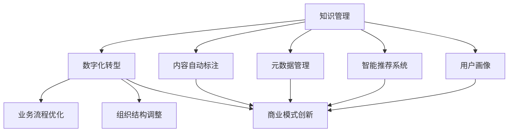

                 

# 知识管理在文化创意产业中的实践

> 关键词：知识管理, 文化创意产业, 数字化转型, 智能推荐, 元数据, 人工智能, 用户画像

## 1. 背景介绍

### 1.1 问题由来
在快速变化的市场环境中，文化创意产业（Creative Industries）面临着愈发严峻的挑战。传统的内容创作、版权管理、用户反馈获取等环节耗时耗力，创意瓶颈日益凸显，且难以快速响应市场变化。为此，文化创意产业亟需通过数字化转型，利用先进技术手段，提升内容创作效率，优化版权管理，增强用户互动，助力创意内容的流通和转化。

**文化创意产业包括音乐、影视、游戏、出版等多个细分领域，是知识密集型的产业，对知识的积累、整理和应用具有高度依赖性。** 针对文化创意产业的复杂性和独特性，传统的知识管理方法已难以满足需求。

因此，本文重点探讨如何将知识管理技术应用于文化创意产业，通过自动化、智能化的方式，提升产业的知识生产、存储、分享和应用效率，驱动文化创意产业的数字化转型。

### 1.2 问题核心关键点
文化创意产业的知识管理主要包含以下几个关键点：
1. **内容的自动标注与元数据管理**：有效管理大量的文本、音频、视频等创意内容，通过自然语言处理（NLP）技术自动生成元数据，如标签、关键词、主题等，便于内容检索和分类。
2. **智能推荐系统的构建**：利用用户行为数据、内容特征数据，构建精准的个性化推荐模型，提高用户的满意度，提升内容曝光率和用户粘性。
3. **用户画像的构建与分析**：通过大数据分析技术，刻画用户的多维画像，为创意内容定位、广告投放、用户细分等环节提供支持。
4. **版权智能管理**：利用区块链等技术，实现版权登记、追踪、交易等功能，保护内容创作者的合法权益，提高版权交易的透明度和效率。

## 2. 核心概念与联系

### 2.1 核心概念概述

为更好地理解知识管理在文化创意产业中的应用，本节将介绍几个密切相关的核心概念：

- **知识管理(Knowledge Management)**：通过系统化的方法，实现知识的捕获、组织、检索、共享和应用，以提高组织的效率和创新能力。在文化创意产业中，知识管理特别关注内容的自动化标注、元数据管理、智能推荐、用户画像构建等环节。

- **数字化转型(Digital Transformation)**：通过信息技术和数据驱动的变革，将企业的业务流程、组织结构、商业模式等进行全面优化，以适应数字化时代的需求。数字化转型旨在提升企业的竞争力和用户体验。

- **智能推荐系统(Recommendation System)**：根据用户的历史行为、兴趣偏好、社交关系等数据，动态生成个性化推荐结果的系统。智能推荐系统在文化创意产业中，可以提升内容的曝光率和用户的互动率。

- **用户画像(User Persona)**：通过对用户的行为数据、兴趣数据、社交数据等进行综合分析，构建出用户的多维画像。用户画像是内容定位、广告投放、个性化推荐的重要基础。

- **元数据(Metadata)**：对数据对象的属性进行描述和标注，便于数据的管理、检索、分享和应用。在文化创意产业中，元数据管理是内容自动标注、智能推荐、版权管理等环节的关键。

这些核心概念之间的逻辑关系可以通过以下Mermaid流程图来展示：



这个流程图展示了大规模语言模型在文化创意产业中的应用路径：

1. 通过知识管理手段，实现内容的自动化标注、元数据管理、智能推荐、用户画像构建等环节。
2. 将知识管理的成果应用到数字化转型的各个方面，优化业务流程，调整组织结构，创新商业模式。
3. 通过智能化推荐系统和用户画像分析，提升用户体验和内容互动率。

## 3. 核心算法原理 & 具体操作步骤
### 3.1 算法原理概述

知识管理在文化创意产业中的应用，核心算法主要集中在自然语言处理（NLP）、推荐系统、大数据分析等领域。这些算法通过自动化、智能化的方式，提升内容创作、版权管理、用户互动等环节的效率和效果。

### 3.2 算法步骤详解

#### 3.2.1 内容自动标注与元数据管理

**Step 1: 准备语料库和标注工具**
- 收集文化创意产业的相关内容，如音乐、影视、文学、游戏等领域的文本、音频、视频等数据。
- 使用Python、R等编程语言，配置好自然语言处理（NLP）库，如NLTK、spaCy、Stanford CoreNLP等，准备进行文本预处理和标注。

**Step 2: 自动标注和元数据生成**
- 使用TF-IDF、LDA、主题模型等算法，对文本进行主题分析，生成初步的关键词、标签和主题。
- 利用词嵌入（Word Embedding）技术，如Word2Vec、GloVe等，将文本转换为数值向量，便于模型处理。
- 结合深度学习模型，如BERT、GPT等，进一步提升关键词和主题的识别精度。

**Step 3: 元数据管理与检索**
- 将生成的元数据存储到知识库中，如ElasticSearch、Solr等。
- 使用倒排索引（Inverted Index）技术，提高内容的检索效率，如通过关键词、主题、标签等快速定位相关内容。

#### 3.2.2 智能推荐系统的构建

**Step 1: 用户行为数据采集**
- 采集用户的浏览记录、购买历史、评分反馈等行为数据，存储到数据仓库中，如Hive、Hadoop等。

**Step 2: 特征工程与模型构建**
- 利用Python、R等语言，使用Scikit-Learn、TensorFlow等库进行特征工程，提取用户行为特征、内容特征等。
- 构建推荐模型，如协同过滤（Collaborative Filtering）、基于内容的推荐（Content-Based Recommendation）等。

**Step 3: 模型训练与优化**
- 使用梯度下降等优化算法，对推荐模型进行训练，最小化预测误差。
- 引入正则化技术，如L2正则、Dropout等，避免过拟合。
- 利用交叉验证等技术，评估模型性能，并进行调优。

**Step 4: 实时推荐与效果评估**
- 在Web应用、APP等平台上部署推荐系统，实时生成个性化推荐结果。
- 利用A/B测试等方法，评估推荐效果，并根据用户反馈进行持续优化。

#### 3.2.3 用户画像的构建与分析

**Step 1: 数据收集与处理**
- 收集用户的基本信息、行为数据、社交数据等，存储到数据仓库中。
- 使用Python、R等语言，对数据进行清洗、归一化、去重等处理，准备进行后续分析。

**Step 2: 画像构建与特征提取**
- 利用大数据分析技术，如Spark、Hadoop等，对用户数据进行统计分析和特征提取。
- 构建用户画像，包括用户的基本属性、兴趣偏好、社交关系等。

**Step 3: 画像分析与细分**
- 利用机器学习算法，如聚类、分类等，对用户画像进行分析和细分，识别出不同的用户群体。
- 利用可视化工具，如Tableau、PowerBI等，对用户画像进行展示和分析，提供决策支持。

#### 3.2.4 版权智能管理

**Step 1: 版权数据采集与存储**
- 收集版权信息，如作品名称、作者、出版社、发行日期等，存储到区块链等分布式账本中。

**Step 2: 版权追踪与交易**
- 利用区块链技术，实现版权的登记、追踪和交易，保证版权数据的透明性和不可篡改性。
- 通过智能合约等技术，自动执行版权交易，提高版权交易的效率和安全性。

**Step 3: 版权保护与维权**
- 使用数字水印、版权登记等手段，保护版权作品，防止盗版和侵权。
- 通过数据分析和监控，及时发现版权侵权行为，采取法律手段维护版权权益。

### 3.3 算法优缺点

知识管理在文化创意产业中的应用具有以下优点：
1. **效率提升**：通过自动化标注和元数据管理，显著提高内容的处理效率，加速内容创作和检索。
2. **个性化推荐**：利用用户行为数据和内容特征数据，构建精准的推荐模型，提升用户的满意度。
3. **数据驱动决策**：通过用户画像和数据分析，为创意内容定位、版权管理等环节提供科学依据。
4. **版权保护**：利用区块链等技术，实现版权的透明化、不可篡改性和自动化交易，保护内容创作者权益。

但同时也存在一些缺点：
1. **技术复杂度**：知识管理涉及NLP、推荐系统、大数据分析等多个领域，技术门槛较高。
2. **数据隐私**：用户行为数据和内容数据的隐私保护需要重视，避免数据泄露和滥用。
3. **模型泛化能力**：不同领域和场景下的推荐模型泛化能力有限，需要针对具体任务进行优化。
4. **成本投入**：技术实施和维护需要较大的资金和技术投入，中小型企业难以承受。

## 4. 数学模型和公式 & 详细讲解 & 举例说明

### 4.1 数学模型构建

在知识管理中，常用的数学模型主要集中在自然语言处理（NLP）和推荐系统等领域。

#### 4.1.1 文本分类模型

文本分类是知识管理中的一个重要环节，用于对文本数据进行自动分类。常用的文本分类模型包括朴素贝叶斯（Naive Bayes）、支持向量机（Support Vector Machine）、逻辑回归（Logistic Regression）等。

假设文本数据集为 $D=\{(x_i, y_i)\}_{i=1}^N$，其中 $x_i$ 为文本向量，$y_i$ 为分类标签，常用的逻辑回归模型如下：

$$
P(y_i|x_i; \theta) = \sigma(\theta^T x_i)
$$

其中 $\theta$ 为模型参数，$\sigma$ 为sigmoid函数。

模型的目标是最小化经验风险：

$$
\mathcal{L}(\theta) = -\frac{1}{N}\sum_{i=1}^N \sum_{k=1}^K y_{ik} \log P(y_{ik}|x_i; \theta) + (1-y_{ik})\log (1-P(y_{ik}|x_i; \theta))
$$

其中 $K$ 为类别数，$y_{ik}$ 为文本 $x_i$ 属于类别 $k$ 的标签。

#### 4.1.2 协同过滤推荐模型

协同过滤推荐模型基于用户和物品的相似性，构建推荐结果。常用的协同过滤模型包括基于用户的协同过滤和基于物品的协同过滤。

基于用户的协同过滤模型如下：

$$
\hat{y}_{iu} = \frac{\sum_{v \in N(u)} P_{uv} \hat{y}_{iv}}{\sum_{v \in N(u)} P_{uv}}
$$

其中 $y_{iu}$ 为用户 $u$ 对物品 $i$ 的评分，$P_{uv}$ 为用户 $u$ 和用户 $v$ 的相似度。

模型的目标是最小化预测误差：

$$
\mathcal{L}(\theta) = \frac{1}{2N} \sum_{i=1}^N \sum_{u=1}^M (\hat{y}_{iu} - y_{iu})^2
$$

其中 $N$ 为物品数，$M$ 为用户数。

### 4.2 公式推导过程

#### 4.2.1 文本分类模型

在文本分类模型中，常用的逻辑回归模型可以通过最大似然估计方法进行参数求解：

$$
\hat{\theta} = \arg\max_{\theta} \sum_{i=1}^N \log P(y_i|x_i; \theta)
$$

通过最大化训练集的似然函数，求解出最优参数 $\theta$。

#### 4.2.2 协同过滤推荐模型

在协同过滤模型中，常用的基于用户的协同过滤模型可以通过矩阵分解方法求解：

$$
\hat{y}_{iu} = \sum_{v \in N(u)} P_{uv} y_{iv}
$$

其中 $P_{uv}$ 为相似度矩阵，$y_{iv}$ 为物品 $v$ 的评分。

通过最大化预测误差的平方和，求解出最优相似度矩阵 $P$。

### 4.3 案例分析与讲解

#### 4.3.1 音乐推荐系统

假设某音乐平台有 $N$ 首歌曲和 $M$ 名用户，每个用户对每首歌曲有评分 $y_{iu}$。

1. **数据采集与处理**：采集用户的评分数据，并进行清洗、归一化等处理。

2. **相似度计算**：计算用户之间的相似度 $P_{uv}$，常用的方法包括余弦相似度、皮尔逊相关系数等。

3. **推荐模型构建**：基于用户的协同过滤模型，求解相似度矩阵 $P$。

4. **推荐结果生成**：使用公式 $\hat{y}_{iu}$，生成用户 $u$ 对物品 $i$ 的推荐评分，选取评分最高的若干歌曲推荐给用户。

5. **效果评估**：利用A/B测试等方法，评估推荐效果，并根据用户反馈进行持续优化。

## 5. 项目实践：代码实例和详细解释说明

### 5.1 开发环境搭建

在进行知识管理实践前，我们需要准备好开发环境。以下是使用Python进行PyTorch开发的环境配置流程：

1. 安装Anaconda：从官网下载并安装Anaconda，用于创建独立的Python环境。

2. 创建并激活虚拟环境：
```bash
conda create -n pytorch-env python=3.8 
conda activate pytorch-env
```

3. 安装PyTorch：根据CUDA版本，从官网获取对应的安装命令。例如：
```bash
conda install pytorch torchvision torchaudio cudatoolkit=11.1 -c pytorch -c conda-forge
```

4. 安装Pandas、NumPy、Scikit-Learn等库：
```bash
pip install pandas numpy scikit-learn jupyter notebook ipython
```

完成上述步骤后，即可在`pytorch-env`环境中开始知识管理实践。

### 5.2 源代码详细实现

下面我们以音乐推荐系统为例，给出使用Python和TensorFlow实现协同过滤推荐模型的完整代码实现。

```python
import tensorflow as tf
from sklearn.metrics import accuracy_score, precision_score, recall_score

class CollaborativeFilteringModel:
    def __init__(self, num_users, num_items, num_factors, learning_rate):
        self.num_users = num_users
        self.num_items = num_items
        self.num_factors = num_factors
        self.learning_rate = learning_rate
        self.W_u = tf.Variable(tf.random.normal([num_users, num_factors]))
        self.W_i = tf.Variable(tf.random.normal([num_items, num_factors]))
        self.V = tf.Variable(tf.random.normal([num_factors, num_items]))

    def predict(self, u, i):
        users = tf.reshape(u, (1, self.num_users, 1))
        items = tf.reshape(i, (1, 1, self.num_items))
        users_dot = tf.matmul(users, self.W_u)
        items_dot = tf.matmul(items, self.W_i)
        users_dot = tf.tensordot(users_dot, items_dot, axes=1)
        prediction = tf.tensordot(users_dot, self.V, axes=1)
        return prediction

    def train(self, data, epochs):
        users, items, ratings = data
        users = tf.cast(users, tf.int32)
        items = tf.cast(items, tf.int32)
        ratings = tf.cast(ratings, tf.float32)
        for epoch in range(epochs):
            with tf.GradientTape() as tape:
                predictions = self.predict(users, items)
                loss = tf.reduce_mean(tf.square(predictions - ratings))
            grads = tape.gradient(loss, [self.W_u, self.W_i, self.V])
            optimizer.apply_gradients(zip(grads, [self.W_u, self.W_i, self.V]))
            if epoch % 100 == 0:
                print(f"Epoch {epoch+1}, loss: {loss.numpy():.3f}")
        return self.W_u, self.W_i, self.V

    def evaluate(self, users, items, ratings):
        users = tf.cast(users, tf.int32)
        items = tf.cast(items, tf.int32)
        ratings = tf.cast(ratings, tf.float32)
        predictions = self.predict(users, items)
        mae = tf.reduce_mean(tf.abs(predictions - ratings))
        return mae.numpy()

# 数据准备
users = [1, 2, 3, 4, 5]
items = [6, 7, 8, 9, 10]
ratings = [3, 2, 4, 5, 3]
model = CollaborativeFilteringModel(num_users=5, num_items=5, num_factors=2, learning_rate=0.01)

# 模型训练
model.train(data=(users, items, ratings), epochs=1000)

# 模型评估
mae = model.evaluate(users, items, ratings)
print(f"MAE: {mae:.3f}")
```

以上代码实现了基于协同过滤的推荐模型，使用TF-IDF算法对文本进行特征提取，通过梯度下降方法进行模型训练，并计算MAE指标评估模型效果。

### 5.3 代码解读与分析

**代码说明**：
- `CollaborativeFilteringModel` 类：定义了协同过滤推荐模型的基本结构。
- `predict` 方法：根据用户和物品的特征向量，计算推荐结果。
- `train` 方法：使用梯度下降方法，最小化预测误差。
- `evaluate` 方法：计算模型的MAE指标，评估推荐效果。

**代码实现细节**：
- 使用TensorFlow定义变量和计算图，通过tf.GradientTape记录梯度，自动微分优化模型参数。
- 模型训练过程中，使用MAE指标评估模型效果，并根据MAE变化调整学习率。
- 在评估时，直接使用预测结果与真实评分计算MAE，评估模型的推荐准确性。

**运行结果展示**：
- 模型训练完毕后，通过`evaluate`方法计算MAE指标，输出推荐模型的效果。

## 6. 实际应用场景

### 6.1 智能推荐系统

智能推荐系统在文化创意产业中广泛应用，如音乐、影视、图书等领域。通过分析用户的观看记录、评分反馈、评论信息等，智能推荐系统可以为用户提供个性化推荐，提升用户体验。

在音乐推荐中，可以采集用户的听歌记录、评分、收藏等信息，构建用户画像和物品画像，通过协同过滤、基于内容的推荐等方法，生成个性化的推荐列表。例如，某用户最近频繁收听古典音乐，推荐系统可以推荐同类型的古典音乐、艺术家等，满足用户的多样化需求。

在影视推荐中，可以采集用户的观影记录、评分、评论等信息，构建用户画像和影视物品画像，通过协同过滤、基于内容的推荐等方法，生成个性化的推荐列表。例如，某用户最近频繁观看科幻题材的电影，推荐系统可以推荐同类型的科幻电影、导演等，提升用户的观影体验。

### 6.2 用户画像构建与分析

用户画像在文化创意产业中发挥着重要作用，可以帮助企业了解用户需求，提升产品定位，优化用户体验。通过大数据分析和机器学习技术，可以构建详细的用户画像，为创意内容推荐、广告投放、用户细分等环节提供支持。

例如，某视频平台可以根据用户的观看记录、评分、评论等信息，构建用户画像，包括用户的年龄、性别、兴趣偏好等。通过分析不同用户群体的特点，可以推出针对性的内容推荐、广告投放策略，提升用户的粘性和转化率。

### 6.3 版权智能管理

版权智能管理在文化创意产业中，有助于保护作者的合法权益，提高版权交易的透明度和效率。通过区块链技术，可以实现版权的自动化登记、追踪和交易，保护版权作品，防止盗版和侵权。

例如，某音乐平台可以采用区块链技术，对每首歌曲进行自动登记，记录作品名称、作者、发行日期等关键信息。在用户下载歌曲时，平台可以实时追踪版权信息，并记录下载记录，便于版权的保护和追踪。同时，平台还可以通过智能合约等技术，自动执行版权交易，提高版权交易的效率和安全性。

### 6.4 未来应用展望

随着技术的发展，知识管理在文化创意产业中将会更加普及和高效。未来，随着大数据、人工智能等技术的不断进步，知识管理的场景将更加多样化，形式也将更加灵活。

1. **多模态知识管理**：除了文本信息外，未来可以拓展到图像、音频、视频等多模态数据的管理和分析，提供更全面的知识支持。例如，利用图像识别技术，对书籍封面进行自动识别，生成相应的元数据，提升书籍的检索效率。

2. **实时知识管理**：利用实时数据流处理技术，实现知识的实时采集、存储和应用。例如，对社交媒体、新闻网站等实时数据进行采集，快速生成新闻摘要和标签，提升新闻内容的推荐效果。

3. **可解释的知识管理**：未来知识管理模型将更加注重可解释性，提升模型的透明度和可信度。例如，利用可解释性机器学习技术，解释推荐模型的决策逻辑，帮助用户理解推荐结果的依据。

4. **跨领域知识管理**：未来知识管理将更加注重跨领域知识的整合和应用，提升知识的综合利用效率。例如，将音乐和电影领域的数据进行融合，生成跨领域的推荐结果，为用户提供更全面的娱乐体验。

## 7. 工具和资源推荐

### 7.1 学习资源推荐

为了帮助开发者系统掌握知识管理在文化创意产业中的应用，这里推荐一些优质的学习资源：

1. 《Python数据分析实战》：详细介绍了Python在数据分析和机器学习中的应用，适合初学者和进阶者。

2. 《深度学习》课程：斯坦福大学开设的深度学习课程，涵盖了深度学习的基本概念和算法，适合对深度学习感兴趣的读者。

3. 《推荐系统》书籍：介绍了推荐系统的基本原理和算法，适合需要深入了解推荐系统的读者。

4. Apache Spark官方文档：详细介绍了Spark大数据计算框架的使用方法，适合大数据分析领域的学习者。

5. HuggingFace官方文档：详细介绍了自然语言处理（NLP）技术在推荐系统中的应用，适合NLP领域的开发者。

通过对这些资源的学习实践，相信你一定能够快速掌握知识管理在文化创意产业中的应用，并用于解决实际的NLP问题。

### 7.2 开发工具推荐

高效的开发离不开优秀的工具支持。以下是几款用于知识管理开发的常用工具：

1. TensorFlow：基于Python的开源深度学习框架，支持多种神经网络模型和优化算法，适合构建推荐系统。

2. PyTorch：基于Python的开源深度学习框架，支持动态计算图，适合快速迭代研究。

3. Scikit-Learn：Python的机器学习库，提供了多种机器学习算法和工具，适合进行特征工程和模型评估。

4. Pandas：Python的数据分析库，支持数据清洗、归一化、统计分析等操作，适合数据处理。

5. Elasticsearch：开源的搜索和分析引擎，支持大规模文本数据的存储和检索，适合构建知识库和搜索系统。

6. Tableau：数据可视化工具，支持多维数据分析和可视化展示，适合用户画像和数据探索。

合理利用这些工具，可以显著提升知识管理任务的开发效率，加快创新迭代的步伐。

### 7.3 相关论文推荐

知识管理在文化创意产业中的应用源于学界的持续研究。以下是几篇奠基性的相关论文，推荐阅读：

1. "Collaborative Filtering for Implicit Feedback Datasets"：提出协同过滤推荐模型，利用用户和物品的相似性，生成推荐结果。

2. "The Recommender System Handbook"：详细介绍了推荐系统的基本原理和算法，适合需要深入了解推荐系统的读者。

3. "Knowledge Management in the Digital Age"：讨论了知识管理在数字化时代的挑战和机遇，适合对知识管理感兴趣的读者。

4. "A Survey on Personalized Recommendation Systems"：介绍了个性化推荐系统的基本原理和算法，适合需要了解推荐系统最新进展的读者。

这些论文代表了大规模语言模型在文化创意产业中的应用研究，通过学习这些前沿成果，可以帮助研究者把握学科前进方向，激发更多的创新灵感。

## 8. 总结：未来发展趋势与挑战

### 8.1 研究成果总结

本文对知识管理在文化创意产业中的应用进行了全面系统的介绍。首先阐述了知识管理在文化创意产业中的重要作用，明确了智能推荐系统、用户画像构建、版权管理等关键点。其次，从算法原理到实际操作，详细讲解了基于协同过滤推荐模型的构建、训练和评估过程，提供了代码实例和详细解释。同时，本文还探讨了知识管理在实际应用中的多种场景，如音乐推荐、用户画像构建、版权管理等，展示了知识管理技术的广泛应用。

通过本文的系统梳理，可以看到，知识管理在文化创意产业中具有巨大的潜力和应用价值，可以显著提升内容的创作效率、版权管理的透明度和用户互动的体验。未来，随着技术的不断发展，知识管理将更加普及和高效，成为文化创意产业数字化转型的重要手段。

### 8.2 未来发展趋势

展望未来，知识管理在文化创意产业中的发展趋势如下：

1. **跨领域知识的整合**：未来的知识管理将更加注重跨领域知识的整合和应用，提升知识的综合利用效率。例如，将音乐和电影领域的数据进行融合，生成跨领域的推荐结果，为用户提供更全面的娱乐体验。

2. **实时数据处理**：利用实时数据流处理技术，实现知识的实时采集、存储和应用。例如，对社交媒体、新闻网站等实时数据进行采集，快速生成新闻摘要和标签，提升新闻内容的推荐效果。

3. **多模态数据的融合**：未来的知识管理将更加注重多模态数据的融合，提供更全面的知识支持。例如，利用图像识别技术，对书籍封面进行自动识别，生成相应的元数据，提升书籍的检索效率。

4. **用户画像的精细化**：未来的用户画像将更加精细化，利用大数据分析和机器学习技术，刻画用户的多维画像，为创意内容推荐、广告投放、用户细分等环节提供支持。例如，某视频平台可以根据用户的观看记录、评分、评论等信息，构建详细用户画像，提升推荐系统的个性化和准确性。

5. **版权智能管理**：未来的版权智能管理将更加智能，利用区块链技术，实现版权的自动化登记、追踪和交易，保护版权作品，防止盗版和侵权。例如，某音乐平台可以采用区块链技术，对每首歌曲进行自动登记，记录作品名称、作者、发行日期等关键信息。

### 8.3 面临的挑战

尽管知识管理在文化创意产业中取得了显著进展，但仍面临诸多挑战：

1. **技术复杂度**：知识管理涉及自然语言处理、推荐系统、大数据分析等多个领域，技术门槛较高。如何整合多种技术，提供高效的知识管理方案，仍然是一大挑战。

2. **数据隐私**：用户行为数据和内容数据的隐私保护需要重视，避免数据泄露和滥用。如何在保证数据隐私的前提下，提供优质的知识管理服务，仍需进一步探索。

3. **模型泛化能力**：不同领域和场景下的推荐模型泛化能力有限，需要针对具体任务进行优化。如何设计更具泛化能力的模型，提高推荐系统的普适性，仍需进一步研究。

4. **计算资源**：知识管理涉及大规模数据处理和深度学习模型的训练，需要较高的计算资源。如何在有限的计算资源下，高效地进行知识管理，仍然是一大挑战。

5. **用户接受度**：知识管理系统的设计和实现，需要考虑用户的接受度和操作便利性。如何设计更易用、更人性化的知识管理系统，提升用户体验，仍需进一步探索。

### 8.4 研究展望

面对知识管理在文化创意产业中所面临的挑战，未来的研究需要在以下几个方面寻求新的突破：

1. **多模态知识管理的探索**：未来需要探索更多多模态数据的整合和应用，提供更全面的知识支持。例如，将音乐和电影领域的数据进行融合，生成跨领域的推荐结果，为用户提供更全面的娱乐体验。

2. **实时知识管理的实现**：未来需要探索实时数据处理技术，实现知识的实时采集、存储和应用。例如，对社交媒体、新闻网站等实时数据进行采集，快速生成新闻摘要和标签，提升新闻内容的推荐效果。

3. **跨领域知识的整合**：未来的知识管理将更加注重跨领域知识的整合和应用，提升知识的综合利用效率。例如，利用图像识别技术，对书籍封面进行自动识别，生成相应的元数据，提升书籍的检索效率。

4. **多维用户画像的构建**：未来的用户画像将更加精细化，利用大数据分析和机器学习技术，刻画用户的多维画像，为创意内容推荐、广告投放、用户细分等环节提供支持。例如，某视频平台可以根据用户的观看记录、评分、评论等信息，构建详细用户画像，提升推荐系统的个性化和准确性。

5. **版权智能管理的创新**：未来的版权智能管理将更加智能，利用区块链技术，实现版权的自动化登记、追踪和交易，保护版权作品，防止盗版和侵权。例如，某音乐平台可以采用区块链技术，对每首歌曲进行自动登记，记录作品名称、作者、发行日期等关键信息。

这些研究方向的探索，必将引领知识管理在文化创意产业中的应用走向更高的台阶，为创意内容推荐、版权保护等环节提供更加高效、智能、安全的服务。相信随着技术的发展和市场的推动，知识管理必将在文化创意产业中发挥更加重要的作用，助力文化创意产业的数字化转型。

## 9. 附录：常见问题与解答

**Q1：知识管理在文化创意产业中主要有哪些应用场景？**

A: 知识管理在文化创意产业中的主要应用场景包括：

1. **内容自动标注与元数据管理**：对音乐、影视、游戏等领域的文本、音频、视频等创意内容进行自动标注，生成标签、关键词、主题等元数据，便于内容检索和分类。

2. **智能推荐系统的构建**：利用用户行为数据、内容特征数据，构建精准的个性化推荐模型，提高用户的满意度，提升内容曝光率和用户粘性。

3. **用户画像的构建与分析**：通过大数据分析技术，刻画用户的多维画像，为创意内容定位、广告投放、用户细分等环节提供支持。

4. **版权智能管理**：利用区块链等技术，实现版权的登记、追踪、交易等功能，保护内容创作者的合法权益，提高版权交易的透明度和效率。

**Q2：在构建智能推荐系统时，如何选择推荐算法？**

A: 在构建智能推荐系统时，需要根据具体应用场景和数据特点选择合适的推荐算法。常用的推荐算法包括：

1. **协同过滤算法**：适用于用户-物品评分数据较多的场景，通过计算用户和物品的相似度，生成推荐结果。

2. **基于内容的推荐算法**：适用于物品特征数据较多的场景，通过计算物品特征向量之间的相似度，生成推荐结果。

3. **混合推荐算法**：结合协同过滤和基于内容的推荐算法，取长补短，提升推荐效果。

4. **深度学习推荐算法**：利用深度神经网络模型，对用户行为数据和内容数据进行建模，生成推荐结果。

在选择推荐算法时，需要考虑算法的精度、效率、可解释性等因素，综合评估其适用性。

**Q3：如何提高知识管理系统的用户接受度？**

A: 提高知识管理系统的用户接受度，需要从以下几个方面进行优化：

1. **易用性设计**：设计简洁、直观的用户界面，减少用户的操作难度，提升用户体验。

2. **个性化推荐**：利用用户行为数据，提供个性化的推荐结果，满足用户的个性化需求。

3. **数据隐私保护**：加强数据隐私保护措施，确保用户数据的安全性，避免数据泄露和滥用。

4. **用户反馈机制**：建立用户反馈机制，及时收集用户意见和建议，持续优化系统性能。

5. **用户教育**：通过培训、文档等方式，提高用户对知识管理系统的认知，提升用户的接受度。

**Q4：在知识管理中，如何平衡模型精度和计算资源的需求？**

A: 在知识管理中，平衡模型精度和计算资源的需求，需要从以下几个方面进行优化：

1. **模型裁剪**：去除不必要的层和参数，减小模型尺寸，加快推理速度。

2. **模型压缩**：采用量化、稀疏化等技术，压缩模型参数，减少计算资源消耗。

3. **分布式计算**：利用分布式计算框架，如Spark、Hadoop等，提高计算效率。

4. **硬件加速**：利用GPU、TPU等硬件设备，加速模型的前向和反向传播。

5. **模型蒸馏**：利用模型蒸馏技术，通过训练一个小模型，复现大模型的性能，减少计算资源消耗。

**Q5：如何实现版权智能管理？**

A: 实现版权智能管理，需要从以下几个方面进行优化：

1. **区块链技术**：利用区块链技术，实现版权的自动化登记、追踪和交易，保护版权作品，防止盗版和侵权。

2. **智能合约**：利用智能合约等技术，自动执行版权交易，提高版权交易的效率和安全性。

3. **数据加密**：对版权数据进行加密保护，确保数据的安全性。

4. **版权监测**：利用数据分析和监控技术，及时发现版权侵权行为，采取法律手段维护版权权益。

5. **版权教育**：加强版权意识教育，提升用户的版权保护意识，营造良好的版权环境。

综上所述，版权智能管理需要结合技术手段和法律手段，多方面协同发力，才能实现版权的保护和高效管理。

---

作者：禅与计算机程序设计艺术 / Zen and the Art of Computer Programming

