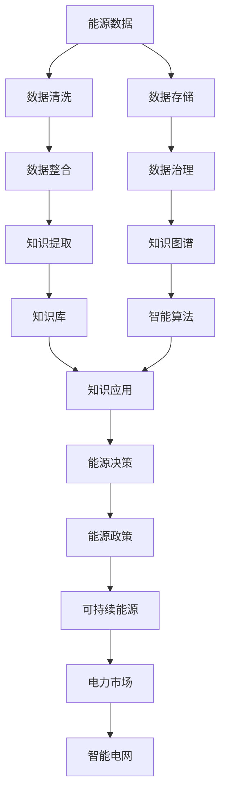

                 

# 知识管理在能源行业的实践

> 关键词：能源行业,知识管理,人工智能,大数据,智能电网,电力市场,能源政策,可持续能源

## 1. 背景介绍

### 1.1 问题由来
在能源行业，知识的有效管理和利用对于提升运营效率、降低成本、优化资源配置、促进可持续发展至关重要。然而，由于能源系统本身的复杂性，以及数据分散、格式不一致、更新频繁等问题，传统的信息管理系统难以满足需求。近年来，随着大数据、云计算、人工智能等技术的快速发展，能源行业开始探索新型知识管理解决方案。

### 1.2 问题核心关键点
- **数据规模与多样性**：能源系统产生的数据量巨大，涉及电网、气象、设备等多个方面，且数据格式多样、更新频繁。
- **知识提取与整合**：从海量数据中提取有效知识，并将其整合到统一的知识库中，形成可用的信息资产。
- **知识共享与协同**：实现不同部门、单位之间的知识共享和协作，提升整体决策水平和响应速度。
- **智能化决策支持**：利用人工智能技术，对知识进行深入分析，辅助决策者进行更精准的能源管理。
- **持续改进与优化**：随着环境变化和技术进步，知识库需要不断更新和优化，以保持其时效性和适用性。

### 1.3 问题研究意义
通过有效的知识管理，能源行业能够：
- 优化能源分配，提升电网稳定性和可靠性。
- 促进可再生能源的接入，推动能源结构转型。
- 降低运营成本，提高能源利用效率。
- 增强应对突发事件的能力，提升应急响应水平。
- 促进政策制定与执行，推动行业规范和标准。
- 提升员工技能，加速技术创新和应用。

## 2. 核心概念与联系

### 2.1 核心概念概述

为更好地理解知识管理在能源行业的应用，本节将介绍几个核心概念：

- **知识管理**：通过计划、收集、整合、共享、应用和保护知识资源，提升组织绩效的过程。
- **大数据**：指规模大、类型多、速度快、价值密度低的数据集合，需要通过先进的数据处理技术进行分析和挖掘。
- **人工智能**：通过算法和模型，使计算机能够模拟人类智能行为的技术，广泛应用于自然语言处理、计算机视觉等领域。
- **智能电网**：利用信息通信技术，实现电网自动化、智能化、互动化的现代电网。
- **电力市场**：通过市场机制，优化电力资源的分配和交易，促进电力市场的健康发展。
- **能源政策**：政府为促进能源可持续发展而制定的法律法规和政策措施。
- **可持续能源**：指长期可持续利用的能源，如风能、太阳能、水能等。

这些核心概念之间的逻辑关系可以通过以下Mermaid流程图来展示：



这个流程图展示了大数据、人工智能、智能电网等概念之间的联系，以及它们如何共同作用于能源行业的知识管理。

## 3. 核心算法原理 & 具体操作步骤
### 3.1 算法原理概述

能源行业的知识管理通常包括以下几个关键步骤：

1. **数据收集与清洗**：从各种来源收集能源数据，并进行初步清洗，去除噪声和异常数据。
2. **数据存储与管理**：使用分布式存储和计算平台（如Hadoop、Spark），构建高效的数据管理系统，保证数据的安全性和可访问性。
3. **知识提取与整合**：利用自然语言处理、文本挖掘、机器学习等技术，从数据中提取有价值的信息，并将其整合到统一的知识库中。
4. **知识图谱构建**：使用图数据库（如Neo4j）构建知识图谱，以直观展示知识之间的关系和结构。
5. **知识应用与优化**：将知识应用于智能电网、电力市场等场景，优化能源分配、降低成本、提升决策效率。

### 3.2 算法步骤详解

以下是能源行业知识管理的详细步骤：

**Step 1: 数据收集与清洗**
- 利用传感器、智能表计等设备收集电网运行数据、气象数据、设备状态数据等。
- 使用ETL工具（如Apache NiFi）进行数据清洗和转换，去除噪声和异常值。

**Step 2: 数据存储与管理**
- 使用Hadoop或Spark构建分布式数据仓库，实现数据的存储和管理。
- 设计高效的数据访问接口，供分析和应用使用。
- 实施数据治理策略，确保数据质量和一致性。

**Step 3: 知识提取与整合**
- 利用自然语言处理技术（如BERT、GPT）对文本数据进行语义分析和实体识别。
- 通过文本挖掘技术（如TF-IDF、LDA）从大量文本数据中提取主题和关键词。
- 使用机器学习算法（如分类、聚类、回归）对数据进行建模和预测。
- 将提取的知识整合到知识库中，形成统一的信息资产。

**Step 4: 知识图谱构建**
- 使用图数据库构建知识图谱，以直观展示不同数据之间的关系。
- 利用图算法（如PageRank、K-Means）分析知识图谱中的结构特征。
- 设计知识图谱查询接口，方便用户检索和使用知识。

**Step 5: 知识应用与优化**
- 利用智能算法（如强化学习、优化算法）优化能源分配和调度。
- 将知识应用于智能电网、电力市场等场景，提升系统稳定性和效率。
- 持续监控和评估知识应用效果，进行优化和调整。

### 3.3 算法优缺点

能源行业知识管理的优点包括：
- **提升决策效率**：通过分析海量数据和知识，辅助决策者进行更精准的能源管理。
- **降低运营成本**：优化能源分配和调度，减少能源浪费和损失。
- **促进创新与应用**：通过知识共享和协作，加速技术创新和应用。
- **增强应急响应能力**：实时监控和分析数据，提升应对突发事件的能力。

同时，该方法也存在一些局限性：
- **数据质量和一致性**：数据的准确性和一致性直接影响知识管理的有效性。
- **技术复杂度**：需要结合大数据、人工智能、分布式计算等多项技术，对技术要求较高。
- **成本投入高**：前期数据收集、清洗、存储、治理等成本较高，且技术维护和更新费用不菲。
- **数据隐私和安全**：能源数据涉及隐私和安全问题，需要采取严格的数据保护措施。

尽管存在这些局限性，但整体而言，知识管理在能源行业的应用前景广阔，能够带来显著的效益提升和效率优化。

### 3.4 算法应用领域

能源行业的知识管理应用领域广泛，主要包括：

- **智能电网**：通过实时监测和分析电网数据，优化电网运行，提高供电可靠性。
- **电力市场**：利用大数据和人工智能技术，优化电力交易和分配，提升市场效率。
- **能源政策制定**：通过数据分析和建模，辅助政府制定和执行能源政策，推动可持续发展。
- **可再生能源接入**：利用智能算法，优化可再生能源的接入和分配，促进能源结构转型。
- **设备维护与故障预测**：通过知识图谱和智能算法，预测设备故障，优化维护策略。
- **能源消耗监控与分析**：实时监控和分析能源消耗数据，优化能源使用，降低成本。
- **环境监测与预测**：通过气象数据的分析和预测，优化能源管理和调度，减少环境污染。

## 4. 数学模型和公式 & 详细讲解  
### 4.1 数学模型构建

在能源行业知识管理中，常用的大数据分析和人工智能技术包括数据挖掘、文本分类、聚类分析、推荐系统等。这里以文本分类为例，简要介绍数学模型的构建和应用。

设有一批文本数据 $D = \{(x_1, y_1), (x_2, y_2), ..., (x_m, y_m)\}$，其中 $x_i$ 为文本，$y_i$ 为标签。通过训练一个分类器 $M$，使 $M(x_i) = y_i$，从而实现文本的分类。

### 4.2 公式推导过程

以朴素贝叶斯分类器为例，其数学模型如下：

$$
P(y_i|x_i) = \frac{P(x_i|y_i)P(y_i)}{P(x_i)}
$$

其中，$P(y_i|x_i)$ 表示在给定文本 $x_i$ 的情况下，标签 $y_i$ 的条件概率；$P(x_i|y_i)$ 表示在标签 $y_i$ 的情况下，文本 $x_i$ 的概率；$P(y_i)$ 表示标签 $y_i$ 的先验概率；$P(x_i)$ 表示文本 $x_i$ 的先验概率。

### 4.3 案例分析与讲解

以某智能电网能源监控系统为例，系统收集了大量电网运行数据，通过文本分类技术，可以将这些数据按不同的类型（如故障、告警、维护等）进行分类，从而便于分析和应用。具体流程如下：

1. **数据预处理**：清洗和转换数据，去除噪声和异常值。
2. **特征提取**：从文本数据中提取关键词、词频等特征。
3. **模型训练**：使用朴素贝叶斯、SVM等分类算法，训练分类器。
4. **模型应用**：将训练好的分类器应用到新数据中，进行分类和分析。

通过上述流程，智能电网系统可以实时监控和分析电网运行情况，及时发现和处理故障，提升电网稳定性和可靠性。

## 5. 项目实践：代码实例和详细解释说明
### 5.1 开发环境搭建

在进行知识管理项目开发前，我们需要准备好开发环境。以下是使用Python进行PyTorch和Scikit-learn开发的环境配置流程：

1. 安装Anaconda：从官网下载并安装Anaconda，用于创建独立的Python环境。

2. 创建并激活虚拟环境：
```bash
conda create -n energy-kb python=3.8 
conda activate energy-kb
```

3. 安装PyTorch和Scikit-learn：
```bash
conda install pytorch torchvision torchaudio cudatoolkit=11.1 -c pytorch -c conda-forge
conda install scikit-learn
```

4. 安装相关库：
```bash
pip install pandas numpy matplotlib sklearn
```

完成上述步骤后，即可在`energy-kb`环境中开始知识管理项目开发。

### 5.2 源代码详细实现

这里以文本分类为例，给出使用Scikit-learn对文本进行分类的PyTorch代码实现。

首先，定义数据集和标签：

```python
import pandas as pd
from sklearn.model_selection import train_test_split
from sklearn.feature_extraction.text import TfidfVectorizer
from sklearn.metrics import classification_report
from sklearn.svm import SVC

# 定义数据集和标签
data = pd.read_csv('energy_data.csv')
X = data['text']
y = data['label']

# 数据预处理
vectorizer = TfidfVectorizer(stop_words='english', max_features=1000)
X = vectorizer.fit_transform(X)

# 划分训练集和测试集
X_train, X_test, y_train, y_test = train_test_split(X, y, test_size=0.2, random_state=42)
```

然后，定义模型和优化器：

```python
from sklearn.pipeline import make_pipeline

# 定义分类器
model = SVC(probability=True)

# 定义模型管线
pipeline = make_pipeline(TfidfVectorizer(), model)
pipeline.fit(X_train, y_train)
```

接着，定义训练和评估函数：

```python
def train_model(model, X_train, y_train):
    model.fit(X_train, y_train)
    return model

def evaluate_model(model, X_test, y_test):
    y_pred = model.predict(X_test)
    print(classification_report(y_test, y_pred))
```

最后，启动训练流程并在测试集上评估：

```python
model = train_model(pipeline, X_train, y_train)
evaluate_model(model, X_test, y_test)
```

以上就是使用Scikit-learn对文本进行分类的完整代码实现。可以看到，Scikit-learn提供了便捷的接口和丰富的算法库，使得模型训练和评估变得简单高效。

### 5.3 代码解读与分析

让我们再详细解读一下关键代码的实现细节：

**数据预处理**：
- 使用`TfidfVectorizer`将文本数据转换为TF-IDF特征向量，并进行向量化处理。

**模型训练**：
- 使用`SVC`算法进行文本分类，通过`make_pipeline`构建流水线，自动完成特征提取和模型训练。

**模型评估**：
- 使用`classification_report`打印分类器的性能指标，包括精确率、召回率和F1值等。

**训练流程**：
- 在训练集上训练分类器，并返回训练好的模型。

**评估流程**：
- 在测试集上评估模型性能，并打印分类报告。

可以看到，Scikit-learn的接口设计非常简洁，开发者能够快速上手进行模型开发和评估。

当然，工业级的系统实现还需考虑更多因素，如模型的保存和部署、超参数的自动搜索、更灵活的任务适配层等。但核心的知识管理范式基本与此类似。

## 6. 实际应用场景
### 6.1 智能电网能源监控

智能电网能源监控系统通过实时监测和分析电网运行数据，及时发现和处理故障，提升电网稳定性和可靠性。具体应用场景包括：

- **故障检测与定位**：通过实时监控电网数据，检测故障点和故障类型，生成告警信息，辅助维护人员快速定位和处理故障。
- **告警分析与处理**：分析告警信息，识别出紧急告警，进行分级处理，提高应急响应速度。
- **设备维护与优化**：基于历史数据和实时数据，预测设备故障，优化维护策略，减少设备停机时间。
- **能源消耗监控**：实时监控能源消耗数据，优化能源分配，降低成本，提升效率。

### 6.2 电力市场交易

电力市场交易系统通过分析电力市场数据，优化电力交易和分配，提升市场效率。具体应用场景包括：

- **市场预测与分析**：利用历史数据和实时数据，预测电力需求和供应，优化电力交易策略。
- **价格优化与竞价**：分析市场价格波动，优化电力竞价策略，提升市场竞争力。
- **交易风险管理**：实时监控市场交易数据，评估交易风险，制定风险管理措施。
- **市场监管与合规**：利用大数据技术，监测市场行为，确保市场合规性，打击市场违规行为。

### 6.3 能源政策制定

能源政策制定系统通过数据分析和建模，辅助政府制定和执行能源政策，推动可持续发展。具体应用场景包括：

- **能源需求预测**：利用历史数据和实时数据，预测能源需求，辅助政府制定能源政策。
- **能源供应规划**：分析能源供应数据，制定能源供应规划，确保能源供应的稳定性和可持续性。
- **政策效果评估**：利用大数据技术，评估能源政策的实施效果，调整和优化政策措施。
- **环境影响评估**：分析能源生产和使用对环境的影响，制定环境友好型能源政策。

### 6.4 未来应用展望

随着大数据和人工智能技术的不断发展，能源行业的知识管理将呈现以下几个发展趋势：

1. **数据融合与整合**：将不同类型的能源数据进行融合和整合，构建统一的知识库，提升数据利用效率。
2. **智能算法应用**：利用机器学习、深度学习等智能算法，提升能源管理决策的精准度和智能化水平。
3. **知识图谱扩展**：构建更加丰富的知识图谱，增强知识的管理和应用能力。
4. **云平台集成**：将知识管理系统集成到云平台中，实现数据的分布式存储和处理，提升系统的可扩展性和可靠性。
5. **边缘计算应用**：利用边缘计算技术，将知识管理应用于能源管理的边缘节点，提升数据处理效率和响应速度。
6. **区块链技术应用**：利用区块链技术，实现数据的透明化、不可篡改性，增强数据安全性和信任度。

以上趋势凸显了知识管理在能源行业的应用前景，必将进一步提升能源管理系统的智能化水平，推动能源行业的可持续发展。

## 7. 工具和资源推荐
### 7.1 学习资源推荐

为了帮助开发者系统掌握能源行业知识管理的理论基础和实践技巧，这里推荐一些优质的学习资源：

1. 《能源数据分析与挖掘》课程：由清华大学开设的线上课程，系统讲解了能源数据的特点和分析方法，适合入门学习。
2. 《智能电网技术》书籍：介绍智能电网的核心技术和应用场景，深入浅出地讲解了智能电网的原理和实践。
3. 《能源大数据应用》书籍：探讨了大数据技术在能源行业中的应用，包括能源监测、能源预测、能源管理等。
4. 《能源政策与市场》期刊：涵盖了能源政策、市场动态、技术进展等多方面的内容，是了解能源行业政策和管理的重要资源。
5. 《能源互联网》期刊：聚焦能源互联网的发展和应用，介绍了智能电网、能源物联网、分布式能源等前沿技术。

通过对这些资源的学习实践，相信你一定能够快速掌握能源行业知识管理的精髓，并用于解决实际的能源问题。

### 7.2 开发工具推荐

高效的开发离不开优秀的工具支持。以下是几款用于能源行业知识管理开发的常用工具：

1. Apache NiFi：开源数据集成工具，支持数据清洗、转换、存储等功能，适合能源数据的预处理。
2. Apache Spark：高性能分布式计算框架，支持大规模数据处理和分析，适合能源大数据的应用。
3. Neo4j：图数据库，支持知识图谱的构建和管理，适合能源知识图谱的应用。
4. Jupyter Notebook：交互式编程环境，支持Python、R等多种语言，适合数据分析和模型开发。
5. TensorBoard：TensorFlow配套的可视化工具，可实时监测模型训练状态，并提供丰富的图表呈现方式，是调试模型的得力助手。

合理利用这些工具，可以显著提升能源行业知识管理的开发效率，加快创新迭代的步伐。

### 7.3 相关论文推荐

能源行业知识管理的发展源于学界的持续研究。以下是几篇奠基性的相关论文，推荐阅读：

1. "Big Data Analytics in Energy Systems"（《能源系统的大数据分析》）：探讨了大数据技术在能源系统中的应用，包括数据管理、分析方法等。
2. "Knowledge Management in Smart Grids"（《智能电网中的知识管理》）：介绍了智能电网中的知识管理策略和实践，提出了基于大数据和人工智能的知识管理方法。
3. "Energy Policy Making with Data Mining"（《基于数据挖掘的能源政策制定》）：通过数据分析和建模，辅助政府制定和执行能源政策，推动可持续发展。
4. "Smart Energy Systems: From Data to Knowledge"（《智能能源系统：从数据到知识》）：讨论了智能能源系统中的知识管理方法，包括数据融合、智能算法等。
5. "Knowledge Graphs for Energy Management"（《知识图谱在能源管理中的应用》）：利用知识图谱技术，优化能源管理决策，提升系统效率。

这些论文代表了大数据和人工智能在能源行业知识管理中的前沿研究成果，通过学习这些前沿成果，可以帮助研究者把握学科前进方向，激发更多的创新灵感。

## 8. 总结：未来发展趋势与挑战

### 8.1 总结

本文对能源行业知识管理的理论和实践进行了全面系统的介绍。首先阐述了能源行业知识管理的背景和意义，明确了知识管理在提升能源管理效率、优化资源配置、推动可持续发展等方面的重要价值。其次，从数据预处理、知识提取、知识整合、知识图谱构建、知识应用与优化等步骤，详细讲解了知识管理的核心算法原理和具体操作步骤。同时，本文还广泛探讨了知识管理在智能电网、电力市场、能源政策等场景的应用，展示了知识管理技术的广泛应用前景。此外，本文精选了知识管理的各类学习资源，力求为读者提供全方位的技术指引。

通过本文的系统梳理，可以看到，知识管理技术在能源行业的应用前景广阔，能够显著提升能源管理系统的智能化水平，推动能源行业的可持续发展。未来，伴随大数据、人工智能等技术的进一步发展，能源行业的知识管理将迎来更多创新突破，进一步优化能源管理效果，促进能源行业的进步。

### 8.2 未来发展趋势

展望未来，能源行业知识管理将呈现以下几个发展趋势：

1. **数据融合与整合**：将不同类型的能源数据进行融合和整合，构建统一的知识库，提升数据利用效率。
2. **智能算法应用**：利用机器学习、深度学习等智能算法，提升能源管理决策的精准度和智能化水平。
3. **知识图谱扩展**：构建更加丰富的知识图谱，增强知识的管理和应用能力。
4. **云平台集成**：将知识管理系统集成到云平台中，实现数据的分布式存储和处理，提升系统的可扩展性和可靠性。
5. **边缘计算应用**：利用边缘计算技术，将知识管理应用于能源管理的边缘节点，提升数据处理效率和响应速度。
6. **区块链技术应用**：利用区块链技术，实现数据的透明化、不可篡改性，增强数据安全性和信任度。

以上趋势凸显了能源行业知识管理的应用前景，必将进一步提升能源管理系统的智能化水平，推动能源行业的可持续发展。

### 8.3 面临的挑战

尽管能源行业知识管理技术已经取得了显著进展，但在迈向更加智能化、普适化应用的过程中，仍面临诸多挑战：

1. **数据质量和一致性**：数据的准确性和一致性直接影响知识管理的有效性。
2. **技术复杂度**：需要结合大数据、人工智能、分布式计算等多项技术，对技术要求较高。
3. **成本投入高**：前期数据收集、清洗、存储、治理等成本较高，且技术维护和更新费用不菲。
4. **数据隐私和安全**：能源数据涉及隐私和安全问题，需要采取严格的数据保护措施。
5. **知识更新与优化**：知识库需要不断更新和优化，以保持其时效性和适用性。

尽管存在这些挑战，但整体而言，知识管理在能源行业的应用前景广阔，能够带来显著的效益提升和效率优化。

### 8.4 研究展望

面对知识管理面临的挑战，未来的研究需要在以下几个方面寻求新的突破：

1. **数据预处理技术**：开发高效的数据清洗和转换算法，提高数据质量。
2. **智能算法优化**：开发更加高效和鲁棒的智能算法，提升模型性能和泛化能力。
3. **知识图谱扩展**：构建更加丰富和精细的知识图谱，增强知识的管理和应用能力。
4. **云平台集成**：开发高效的数据分布式处理和存储技术，提升系统的可扩展性和可靠性。
5. **边缘计算应用**：利用边缘计算技术，提升数据处理效率和响应速度。
6. **区块链技术应用**：利用区块链技术，增强数据的安全性和可信度。
7. **知识自动化与协作**：开发知识自动化生成和协作工具，提升知识共享和协作效率。

这些研究方向的探索，必将引领能源行业知识管理技术的进一步发展，为构建智能、高效、安全的能源管理系统奠定坚实基础。面向未来，能源行业知识管理还需要与其他人工智能技术进行更深入的融合，如知识表示、因果推理、强化学习等，多路径协同发力，共同推动能源行业的智能化进程。

## 9. 附录：常见问题与解答

**Q1：能源行业知识管理是否适用于所有能源公司？**

A: 能源行业知识管理在大多数能源公司都有广泛应用，能够显著提升运营效率和决策质量。但对于一些小型能源公司或传统能源公司，可能由于技术资源和资金限制，无法大规模实施知识管理项目。

**Q2：如何选择合适的知识管理工具和平台？**

A: 选择合适的知识管理工具和平台需要考虑多个因素，如公司规模、业务需求、技术水平、数据量等。通常建议从易用性、扩展性、成本和性能等多方面综合评估，选择最适合的工具和平台。

**Q3：知识管理在能源行业中的主要作用是什么？**

A: 知识管理在能源行业中的主要作用包括：
- 优化能源分配和调度，提升电网稳定性和可靠性。
- 促进可再生能源的接入，推动能源结构转型。
- 降低运营成本，提高能源利用效率。
- 增强应对突发事件的能力，提升应急响应水平。
- 促进政策制定与执行，推动行业规范和标准。
- 提升员工技能，加速技术创新和应用。

**Q4：如何应对知识管理中的数据隐私和安全问题？**

A: 数据隐私和安全是知识管理中的重要问题。可以通过以下措施进行应对：
- 数据匿名化处理，去除敏感信息。
- 采用数据加密技术，保护数据传输和存储。
- 实施严格的访问控制，限制数据的访问权限。
- 定期进行数据安全审计，确保系统安全。
- 建立数据安全应急预案，应对潜在的安全威胁。

**Q5：如何持续改进和优化知识管理系统？**

A: 持续改进和优化知识管理系统的关键在于：
- 定期评估系统性能和效果，识别出问题和瓶颈。
- 引入新技术和方法，如机器学习、深度学习、边缘计算等，提升系统能力。
- 优化知识图谱和数据模型，提高知识管理和应用的效率。
- 引入持续学习机制，保持系统的时效性和适应性。
- 建立用户反馈机制，及时收集用户意见和建议。

这些措施将有助于保持知识管理系统的长期稳定运行，并不断提升其应用价值。

---

作者：禅与计算机程序设计艺术 / Zen and the Art of Computer Programming

