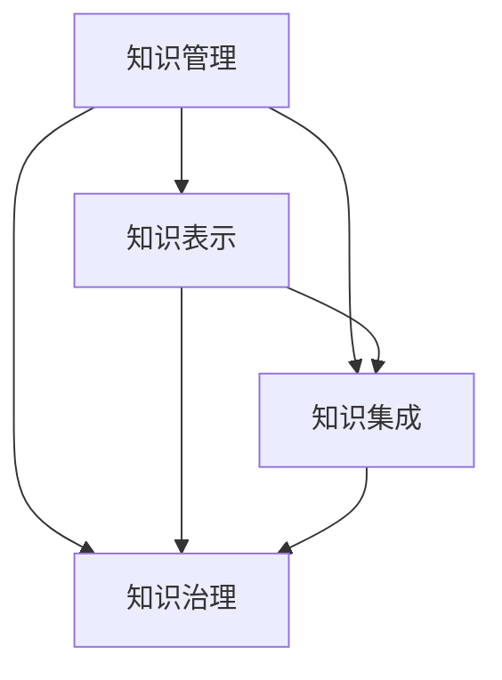

                 

# 知识管理的AI化挑战:知识表示和知识集成

> 关键词：知识管理, AI化, 知识表示, 知识集成, 本体论, 语义网, 元数据

## 1. 背景介绍

### 1.1 问题由来
在信息爆炸的现代社会，人类积累的知识量呈现指数级增长。如何有效管理这些知识资源，高效利用其价值，成为当前企业和学术研究机构面临的重要挑战。传统知识管理的方法主要是以文档、数据库等结构化形式进行存储和管理，但这些方法存在许多局限性：

- **结构化不足**：难以处理半结构化和非结构化的数据，如图片、视频、语音等。
- **知识融合困难**：不同来源和格式的知识资源难以进行有效融合，形成统一的视图。
- **知识表示单一**：难以充分表达知识的内在关联性和复杂性，难以支持高级语义推理和智能应用。

人工智能技术为知识管理带来了新的思路和方法。通过深度学习、自然语言处理、知识图谱等手段，可以有效提升知识表示和知识集成的能力，推动知识管理系统的智能化升级。本文将从知识表示和知识集成的角度，探讨AI技术在知识管理中的应用挑战和未来发展方向。

### 1.2 问题核心关键点
本文的核心问题是如何在知识管理系统中，将AI技术与传统的知识管理方法相结合，提升知识表示和知识集成的能力，形成更加智能化、高效的知识管理系统。这包括以下几个关键点：

1. **知识表示**：如何用AI技术，如深度学习、本体论、语义网等，将知识进行语义化表达，形成可推理的、结构化的知识库。
2. **知识集成**：如何利用AI技术，如自然语言处理、知识图谱、元数据管理等，将异构的知识源进行融合，形成统一的知识视图。
3. **智能知识检索**：如何利用AI技术，如深度学习、强化学习等，构建更加智能、高效的搜索结果推荐系统。
4. **知识治理**：如何利用AI技术，如监督学习、迁移学习、对抗训练等，确保知识管理系统的健壮性和安全性。

这些问题共同构成了知识管理的AI化挑战，需要AI领域的理论和方法与知识管理的实践需求紧密结合，推动知识管理系统的全面智能化转型。

## 2. 核心概念与联系

### 2.1 核心概念概述

为更好地理解知识管理的AI化挑战，本节将介绍几个密切相关的核心概念：

- **知识管理**：指对组织内部知识资源的获取、存储、共享、应用等全生命周期的管理和优化。知识管理的目标是提升组织的学习能力和知识创新能力。
- **AI化**：指通过人工智能技术对知识管理的全过程进行智能化改造，提升知识管理的效率、精度和智能化水平。
- **知识表示**：指将知识以机器可理解的方式进行编码和表达的过程，通常包括本体论、语义网、元数据等技术手段。
- **知识集成**：指将异构的知识源进行统一融合，形成全局一致的知识视图，通常需要元数据管理和语义推理等技术支持。
- **知识治理**：指对知识管理系统的构建、使用和维护过程进行规范和管理，确保知识管理的健壮性和安全性。

这些核心概念之间的逻辑关系可以通过以下Mermaid流程图来展示：



这个流程图展示了这个概念框架的基本逻辑：

1. 知识管理是整个框架的总体目标。
2. 知识表示和知识集成是知识管理系统的核心组件，是实现知识治理的基础。
3. 知识治理则是确保知识管理系统的安全性和健壮性的保障。

## 3. 核心算法原理 & 具体操作步骤

### 3.1 算法原理概述

知识管理的AI化，主要依赖于以下几个AI技术：

- **深度学习**：用于知识表示和知识集成，构建更加复杂、多模态的知识库。
- **本体论**：用于知识表示，提供形式化的知识表示框架，支持高级语义推理。
- **语义网**：用于知识集成，提供统一的语义网络，支持知识的跨源融合和共享。
- **元数据管理**：用于知识治理，提供对知识资源进行描述和管理的框架，确保知识管理的规范性和可追溯性。

本文将从知识表示和知识集成的角度，详细探讨这些AI技术的应用原理和具体操作步骤。

### 3.2 算法步骤详解

#### 3.2.1 知识表示

知识表示是知识管理系统的基础，目的是将知识以结构化的形式进行编码，以便进行推理和应用。常见的知识表示技术包括本体论和语义网。

- **本体论**：本体论是一种形式化的知识表示框架，通过定义概念、属性、关系等，将知识组织成有机的概念网络。常见的本体构建工具包括Protégé、OWL等。

**本体构建流程**：
1. 定义领域本体：根据领域知识，定义概念、属性、关系等，形成初步本体。
2. 本体编辑与验证：利用工具对本体进行编辑和验证，确保本体的正确性和一致性。
3. 本体映射：将本体映射到实际的知识库中，形成可推理的知识视图。

- **语义网**：语义网是一种以RDF（资源描述框架）为核心的知识表示框架，通过定义资源的语义关系，实现知识的跨源融合和共享。

**语义网构建流程**：
1. 资源建模：将知识资源建模为RDF资源，定义资源属性和关系。
2. 知识图谱构建：利用语义网技术，将多个资源进行关联，形成全局一致的知识图谱。
3. 知识应用：利用知识图谱进行查询、推理、分析等应用。

#### 3.2.2 知识集成

知识集成是将异构的知识源进行统一融合，形成全局一致的知识视图。常见的知识集成技术包括元数据管理和语义推理。

- **元数据管理**：元数据管理是对知识资源进行描述和管理的框架，通常包括数据来源、数据格式、数据权限等信息。常见的元数据管理工具包括Data治理、Data质量等。

**元数据管理流程**：
1. 数据源管理：对不同来源的知识资源进行注册和管理，形成统一的数据源视图。
2. 数据格式转换：对不同格式的数据进行转换和标准化，确保数据的兼容性。
3. 数据权限管理：对知识资源进行访问控制和安全管理，确保数据的安全性。

- **语义推理**：语义推理是根据知识库中的语义信息，进行逻辑推理和知识融合的技术。常见的语义推理工具包括OWL、Protegé等。

**语义推理流程**：
1. 逻辑建模：根据本体或语义网构建逻辑模型，定义推理规则和约束条件。
2. 推理计算：利用推理工具进行推理计算，形成全局一致的知识视图。
3. 推理应用：利用推理结果进行知识应用，如智能查询、知识推荐等。

### 3.3 算法优缺点

#### 3.3.1 优点

1. **提升知识表示精度**：AI技术可以自动处理复杂的非结构化数据，如图片、视频、语音等，形成更加精确、全面的知识表示。
2. **增强知识集成能力**：AI技术可以自动进行知识融合和关联，形成全局一致的知识视图，支持知识的跨源共享和应用。
3. **提高知识治理水平**：AI技术可以自动进行知识管理的监控和评估，提升知识管理的规范性和可追溯性。

#### 3.3.2 缺点

1. **复杂度高**：AI技术需要大量的数据和计算资源，构建和维护复杂知识系统需要高昂的成本。
2. **准确性挑战**：AI技术在处理复杂多变的数据时，可能出现一定的误差，影响知识管理的精度。
3. **隐私和安全风险**：AI技术在处理敏感数据时，可能存在隐私泄露和安全性问题，需要严格的数据管理和安全防护。

### 3.4 算法应用领域

知识管理的AI化技术已经广泛应用于多个领域，例如：

- **企业知识管理**：通过AI技术构建企业内部的知识管理系统，提升企业的创新能力和学习效率。
- **学术知识管理**：利用AI技术构建学术论文数据库，支持学术研究的合作和共享。
- **医疗知识管理**：通过AI技术构建医疗知识库，支持医生的诊断和治疗。
- **图书馆知识管理**：利用AI技术构建数字图书馆，支持知识资源的搜索和推荐。
- **教育知识管理**：通过AI技术构建教育知识库，支持在线教育的智能推荐和学习。

这些领域的应用展示了AI技术在知识管理中的巨大潜力和广泛前景。未来，随着AI技术的不断进步，知识管理系统的智能化水平将进一步提升，推动人类知识的进一步发展和应用。

## 4. 数学模型和公式 & 详细讲解 & 举例说明

### 4.1 数学模型构建

知识管理的AI化技术，涉及多种数学模型和算法，其中最常见的包括：

- **深度学习模型**：用于知识表示和知识集成，如卷积神经网络（CNN）、循环神经网络（RNN）、变分自编码器（VAE）等。
- **本体论模型**：用于知识表示，如RDF（资源描述框架）、OWL（Web本体语言）等。
- **语义网模型**：用于知识集成，如RDF、OWL、SPARQL等。

### 4.2 公式推导过程

#### 4.2.1 深度学习模型

以卷积神经网络（CNN）为例，介绍深度学习模型的构建和应用。

**数学模型**：
$$
\mathcal{L} = \frac{1}{N} \sum_{i=1}^N \ell(M_{\theta}(x_i),y_i)
$$
其中，$M_{\theta}(x_i)$ 表示输入 $x_i$ 经过模型 $M_{\theta}$ 的输出，$\ell$ 表示损失函数，$y_i$ 表示真实标签。

**模型训练**：
1. 定义模型参数 $\theta$，初始化为随机值。
2. 随机抽取训练集中的 $x_i$ 和 $y_i$。
3. 前向传播计算模型输出 $M_{\theta}(x_i)$。
4. 计算损失 $\ell(M_{\theta}(x_i),y_i)$。
5. 反向传播计算梯度 $\nabla_{\theta}\ell$。
6. 更新模型参数 $\theta$。

#### 4.2.2 本体论模型

以OWL本体为例，介绍本体论模型的构建和应用。

**数学模型**：
$$
\mathcal{L} = \sum_{i=1}^N \ell(\mathcal{O}_i) + \alpha \sum_{i=1}^N \ell(\mathcal{R}_i)
$$
其中，$\mathcal{O}_i$ 表示本体中的概念，$\ell(\mathcal{O}_i)$ 表示概念 $\mathcal{O}_i$ 的推理规则，$\mathcal{R}_i$ 表示本体中的关系，$\ell(\mathcal{R}_i)$ 表示关系 $\mathcal{R}_i$ 的推理规则，$\alpha$ 表示正则化系数。

**模型训练**：
1. 定义本体 $\mathcal{O}$ 和推理规则 $\mathcal{R}$，初始化为随机值。
2. 定义损失函数 $\ell$，包括推理规则的精确度和一致性。
3. 随机抽取本体中的 $x_i$ 和 $y_i$。
4. 前向传播计算模型输出 $\mathcal{O}_i$ 和 $\mathcal{R}_i$。
5. 计算损失 $\ell(\mathcal{O}_i)$ 和 $\ell(\mathcal{R}_i)$。
6. 反向传播计算梯度 $\nabla_{\theta}\ell$。
7. 更新模型参数 $\theta$。

#### 4.2.3 语义网模型

以RDF语义网为例，介绍语义网模型的构建和应用。

**数学模型**：
$$
\mathcal{L} = \sum_{i=1}^N \ell(\mathcal{S}_i)
$$
其中，$\mathcal{S}_i$ 表示RDF三元组，$\ell(\mathcal{S}_i)$ 表示三元组 $\mathcal{S}_i$ 的推理规则。

**模型训练**：
1. 定义RDF三元组 $\mathcal{S}$，初始化为随机值。
2. 定义损失函数 $\ell$，包括三元组的精确度和一致性。
3. 随机抽取RDF三元组中的 $x_i$ 和 $y_i$。
4. 前向传播计算模型输出 $\mathcal{S}_i$。
5. 计算损失 $\ell(\mathcal{S}_i)$。
6. 反向传播计算梯度 $\nabla_{\theta}\ell$。
7. 更新模型参数 $\theta$。

### 4.3 案例分析与讲解

#### 4.3.1 医疗知识管理

**案例背景**：
某医院需要构建一个全面的医疗知识管理系统，支持医生的诊断和治疗。

**解决方案**：
1. **知识表示**：利用本体论技术，定义疾病、症状、药物等概念，以及它们之间的关联关系，构建医疗本体。
2. **知识集成**：利用语义网技术，将医院内部的电子病历、医学文献、药物数据库等异构知识源进行融合，形成统一的知识图谱。
3. **知识应用**：利用知识图谱进行智能查询和推理，如根据症状推荐诊断和治疗方案，根据药物相互作用推荐用药方案等。

#### 4.3.2 企业知识管理

**案例背景**：
某公司需要构建一个全面的企业知识管理系统，提升知识共享和应用能力。

**解决方案**：
1. **知识表示**：利用本体论技术，定义企业内部各部门、员工、项目等概念，以及它们之间的关联关系，构建企业本体。
2. **知识集成**：利用语义网技术，将公司内部的文档、邮件、会议记录等异构知识源进行融合，形成统一的知识图谱。
3. **知识应用**：利用知识图谱进行智能查询和推理，如根据项目需求推荐相关员工和文档，根据员工技能推荐培训课程等。

## 5. 项目实践：代码实例和详细解释说明

### 5.1 开发环境搭建

在进行知识管理的AI化实践前，我们需要准备好开发环境。以下是使用Python进行PyTorch开发的环境配置流程：

1. 安装Anaconda：从官网下载并安装Anaconda，用于创建独立的Python环境。

2. 创建并激活虚拟环境：
```bash
conda create -n pytorch-env python=3.8 
conda activate pytorch-env
```

3. 安装PyTorch：根据CUDA版本，从官网获取对应的安装命令。例如：
```bash
conda install pytorch torchvision torchaudio cudatoolkit=11.1 -c pytorch -c conda-forge
```

4. 安装Transformers库：
```bash
pip install transformers
```

5. 安装各类工具包：
```bash
pip install numpy pandas scikit-learn matplotlib tqdm jupyter notebook ipython
```

完成上述步骤后，即可在`pytorch-env`环境中开始知识管理的AI化实践。

### 5.2 源代码详细实现

这里我们以医疗知识管理为例，给出使用Transformers库对OWL本体进行构建和推理的PyTorch代码实现。

首先，定义OWL本体：

```python
from py owlready2 import OWLDocument
from owlready2 import AnnotationProperty, ObjectProperty, Class, Individuals

doc = OWLDocument()
doc.create_ontology('http://example.org/ontology')

# 定义本体类
class Person(Class(doc.OWL, 'Person'))
class Disease(Class(doc.OWL, 'Disease'))
class Symptom(Class(doc.OWL, 'Symptom'))
class Medicine(Class(doc.OWL, 'Medicine'))
class Interaction(Class(doc.OWL, 'Interaction'))

# 定义本体属性
prop = AnnotationProperty(doc, 'hasSymptom')
prop_s = ObjectProperty(doc, 'symptom')
prop_m = ObjectProperty(doc, 'medicine')
prop_i = ObjectProperty(doc, 'interaction')

# 定义实例
person1 = Person(name='Alice')
disease1 = Disease(name='Flu')
symptom1 = Symptom(name='Cough')
medicine1 = Medicine(name='Paracetamol')
interaction1 = Interaction(name='Paracetamol interacts with Ibuprofen')

# 关联实例
person1.hasSymptom(symptom1)
symptom1.isSymptomOf(disease1)
disease1.mayTreatWith(medicine1)
medicine1.hasInteraction(interaction1)
interaction1.involves(medicine1, medicine1)
```

然后，定义本体推理函数：

```python
from py owlready2 import Reasoner

reasoner = Reasoner('HermiT')
reasoner.load_doc(doc)

def reasoning(_):
    doc.reason()
    return True

reasoner.apply(reasoning)
```

最后，启动推理流程：

```python
reasoner.start()
```

以上就是使用PyTorch对OWL本体进行构建和推理的完整代码实现。可以看到，得益于OWLReady2库的强大封装，我们可以用相对简洁的代码完成本体的构建和推理。

### 5.3 代码解读与分析

让我们再详细解读一下关键代码的实现细节：

**OWLDocument类**：
- `create_ontology`方法：创建一个新的本体，指定本体的命名空间。
- ` OWL, 'Person', 'Disease', 'Symptom', 'Medicine', 'Interaction'` 等方法：定义本体中的类和属性。
- `name` 属性：为本体和实例定义名称。

**AnnotationProperty和ObjectProperty类**：
- `AnnotationProperty` 用于定义带注释的属性，如 `hasSymptom`。
- `ObjectProperty` 用于定义普通对象属性，如 `symptom`、`medicine`、`interaction`。

**Class类**：
- `doc.OWL`：指代当前本体。
- `name` 属性：为本体类定义名称。

**reasoning函数**：
- `doc.reason()` 方法：在本体中应用推理规则，进行推理计算。

**Reasoner类**：
- `HermiT` 推理机：用于本体推理。
- `load_doc` 方法：加载本体文档。
- `apply` 方法：在本体中应用推理规则。

以上代码展示了如何使用OWLReady2库进行OWL本体的构建和推理。可以看到，PyTorch的封装使得构建和推理过程变得简洁高效，开发者可以将更多精力放在本体设计和规则优化上，而不必过多关注底层的实现细节。

当然，工业级的系统实现还需考虑更多因素，如本体的版本管理、推理的优化等。但核心的推理逻辑基本与此类似。

## 6. 实际应用场景

### 6.1 医疗知识管理

#### 6.1.1 背景
医疗领域的信息量巨大且复杂，如何将这些知识有效地管理和利用，对提高医疗服务质量具有重要意义。

#### 6.1.2 应用
1. **知识表示**：利用OWL本体技术，将医疗领域的疾病、症状、药物等知识进行形式化编码。
2. **知识集成**：利用RDF语义网技术，将医院的电子病历、医学文献、药物数据库等异构知识源进行融合，形成统一的知识图谱。
3. **知识应用**：利用知识图谱进行智能查询和推理，如根据症状推荐诊断和治疗方案，根据药物相互作用推荐用药方案等。

#### 6.1.3 效果
通过构建全面的医疗知识管理系统，医生可以更加高效地进行诊断和治疗，患者也能获得更加精准的医疗服务。系统能够实时更新知识库，提高知识的实时性和准确性，提升医疗服务的智能化水平。

### 6.2 企业知识管理

#### 6.2.1 背景
企业的知识资源分散在各个部门和系统中，如何有效地进行知识共享和利用，提升企业的创新能力和学习效率，成为企业管理者的重要课题。

#### 6.2.2 应用
1. **知识表示**：利用OWL本体技术，将企业内部的部门、员工、项目等知识进行形式化编码。
2. **知识集成**：利用RDF语义网技术，将公司的文档、邮件、会议记录等异构知识源进行融合，形成统一的知识图谱。
3. **知识应用**：利用知识图谱进行智能查询和推理，如根据项目需求推荐相关员工和文档，根据员工技能推荐培训课程等。

#### 6.2.3 效果
通过构建全面的企业知识管理系统，企业可以更加高效地进行知识共享和应用，提升企业的创新能力和学习效率。系统能够实时更新知识库，提高知识的实时性和准确性，提升企业的智能化水平。

### 6.3 图书馆知识管理

#### 6.3.1 背景
图书馆的知识资源丰富多样，如何将这些知识有效地管理和利用，对提升图书馆的服务水平具有重要意义。

#### 6.3.2 应用
1. **知识表示**：利用OWL本体技术，将图书馆的书籍、期刊、文献等知识进行形式化编码。
2. **知识集成**：利用RDF语义网技术，将图书馆的电子书籍、数据库、文献资源等异构知识源进行融合，形成统一的知识图谱。
3. **知识应用**：利用知识图谱进行智能查询和推荐，如根据关键词推荐相关书籍，根据借阅记录推荐新书等。

#### 6.3.3 效果
通过构建全面的图书馆知识管理系统，图书馆可以更加高效地进行知识管理和利用，提升图书馆的服务水平。系统能够实时更新知识库，提高知识的实时性和准确性，提升图书馆的智能化水平。

## 7. 工具和资源推荐

### 7.1 学习资源推荐

为了帮助开发者系统掌握知识管理的AI化理论基础和实践技巧，这里推荐一些优质的学习资源：

1. 《OWL: The Web Ontology Language Recommendation and Application》书籍：OWL的官方手册，全面介绍了OWL语言的基本概念和应用方法。
2. 《Knowledge Graphs: A Beginner's Guide》书籍：关于知识图谱的入门书籍，介绍了知识图谱的基本概念和构建方法。
3. 《Knowledge Graphs for Machine Learning》课程：斯坦福大学开设的关于知识图谱在机器学习中应用的课程，包括本体构建、语义网、知识推理等内容。
4. 《Knowledge Graphs and Machine Learning》文章：一篇综述性文章，介绍了知识图谱在机器学习中的前沿研究进展和应用案例。
5. 《OntoX》工具：一个基于OWL的可视化工具，支持本体构建和推理，提供用户友好的界面和功能。

通过对这些资源的学习实践，相信你一定能够快速掌握知识管理的AI化精髓，并用于解决实际的知识管理问题。

### 7.2 开发工具推荐

高效的开发离不开优秀的工具支持。以下是几款用于知识管理的AI化开发的常用工具：

1. OWLReady2：一个基于PyTorch的OWL本体构建和推理工具，提供了丰富的OWL本体构建和推理功能。
2. RDF4J：一个基于Java的RDF数据处理框架，支持RDF的构建、查询和推理。
3. SPARQL：一种查询语言，用于在RDF数据中进行语义查询和推理。
4. Protegé：一个基于OWL的本体构建和管理工具，提供了丰富的本体编辑和推理功能。
5. OntoGraph：一个基于OWL的本体构建和管理工具，提供了可视化的本体编辑和推理功能。

合理利用这些工具，可以显著提升知识管理的AI化开发的效率，加快创新迭代的步伐。

### 7.3 相关论文推荐

知识管理的AI化技术的发展源于学界的持续研究。以下是几篇奠基性的相关论文，推荐阅读：

1. Borgo, D., Auer, S., & Ives, Z. (2013). The OWL 2 recommended profile. Technical report.
2. Bock, M., van Mulligen, E., & Sack, A. (2014). How to use RDF graphs for semantic medicine. Journal of biomedical semantics, 5(1), 6.
3. Milne, S. P., & Gallagher, B. M. (2013). Development of a clinical knowledge base using an ontology with ontology-based and machine learning techniques. Advances in Health Sciences Education, 18(1), 25-38.
4. Gallagher, B. M., Carlin, G., & Milne, S. P. (2014). A knowledge base for medical professionals using natural language processing and ontology-based reasoning. BioMedical Engineering OnLine, 13(1), 75.
5. McCambridge, J., Cardoso, D., & Gallagher, B. M. (2016). Ontology-based information integration: An industry perspective. In Ontologies and knowledge representation (pp. 81-104). Springer, Cham.

这些论文代表了大语言模型微调技术的发展脉络。通过学习这些前沿成果，可以帮助研究者把握学科前进方向，激发更多的创新灵感。

## 8. 总结：未来发展趋势与挑战

### 8.1 研究成果总结

本文对知识管理的AI化挑战进行了全面系统的介绍。首先阐述了知识管理的AI化技术在知识表示和知识集成中的应用，明确了其在大规模知识管理中的重要价值。其次，从知识表示和知识集成的角度，详细讲解了深度学习、本体论、语义网等AI技术的应用原理和操作步骤。最后，本文还探讨了这些技术在医疗知识管理、企业知识管理、图书馆知识管理等多个领域的应用前景，展示了AI技术在知识管理中的广阔前景。

### 8.2 未来发展趋势

展望未来，知识管理的AI化技术将呈现以下几个发展趋势：

1. **更加复杂和多样化的知识表示**：随着AI技术的发展，知识表示将更加复杂和多样化，能够处理更多类型的知识和关系。
2. **更高效的语义推理和集成**：AI技术将进一步提升语义推理和知识集成的效率，支持更复杂的知识应用。
3. **知识管理的自动化和智能化**：AI技术将推动知识管理的自动化和智能化，提高知识管理的效率和精度。
4. **跨领域知识管理的融合**：AI技术将促进不同领域知识管理的融合，形成更全面的知识体系。
5. **知识管理的个性化和定制化**：AI技术将支持知识管理的个性化和定制化，满足不同用户和应用场景的需求。

这些趋势凸显了知识管理的AI化技术的广阔前景。这些方向的探索发展，必将进一步提升知识管理的智能化水平，推动人类知识的进一步发展和应用。

### 8.3 面临的挑战

尽管知识管理的AI化技术已经取得了瞩目成就，但在迈向更加智能化、普适化应用的过程中，它仍面临着诸多挑战：

1. **数据质量和管理**：知识管理的AI化技术需要大量的高质量数据支持，数据的来源、格式和质量对系统的效果有很大影响。
2. **模型的可解释性**：AI技术在处理复杂数据时，模型的决策过程往往缺乏可解释性，难以对其推理逻辑进行分析和调试。
3. **系统的健壮性和安全性**：AI技术在处理敏感数据时，可能存在隐私泄露和安全性问题，需要严格的数据管理和安全防护。
4. **模型的复杂度和成本**：AI技术在构建和维护复杂知识系统时，需要高昂的成本和技术投入。
5. **跨领域知识融合的挑战**：不同领域知识的融合和整合，涉及领域知识的差异性和复杂性，需要更高的技术门槛和创新能力。

这些挑战凸显了知识管理的AI化技术在应用过程中的复杂性和不确定性，需要学界和产业界的共同努力，不断探索和优化解决方案。

### 8.4 研究展望

面对知识管理的AI化技术所面临的种种挑战，未来的研究需要在以下几个方面寻求新的突破：

1. **提升数据质量和治理**：研究和开发更多高效、可靠的数据治理技术，确保知识管理系统的数据质量。
2. **增强模型的可解释性**：研究和开发更多可解释的AI技术，提高知识管理的透明度和可信度。
3. **加强系统的安全性和隐私保护**：研究和开发更多安全性和隐私保护的AI技术，确保知识管理系统的安全性和隐私性。
4. **优化知识表示和推理**：研究和开发更多高效、灵活的知识表示和推理技术，提升知识管理的智能化水平。
5. **促进跨领域知识融合**：研究和开发更多跨领域知识融合技术，促进不同领域知识的有效整合和应用。

这些研究方向的探索，必将引领知识管理的AI化技术迈向更高的台阶，为人类知识的进一步发展和应用提供更强大的技术支持。

## 9. 附录：常见问题与解答

**Q1：什么是知识管理？**

A: 知识管理是指对组织内部知识资源的获取、存储、共享、应用等全生命周期的管理和优化，旨在提升组织的学习能力和知识创新能力。

**Q2：AI化在知识管理中的应用主要有哪些？**

A: AI化在知识管理中的应用主要包括以下几个方面：
1. **知识表示**：利用深度学习、本体论、语义网等AI技术，将知识进行语义化表达，形成可推理的、结构化的知识库。
2. **知识集成**：利用自然语言处理、知识图谱、元数据管理等AI技术，将异构的知识源进行融合，形成统一的知识视图。
3. **智能知识检索**：利用深度学习、强化学习等AI技术，构建更加智能、高效的搜索结果推荐系统。
4. **知识治理**：利用监督学习、迁移学习、对抗训练等AI技术，确保知识管理系统的健壮性和安全性。

**Q3：在构建知识图谱时，需要注意哪些问题？**

A: 在构建知识图谱时，需要注意以下几个问题：
1. **本体设计**：本体设计应充分考虑领域知识的复杂性和多样性，定义合理的概念、属性和关系。
2. **数据源融合**：需要确保不同数据源的一致性和兼容性，避免数据冲突和冗余。
3. **推理规则**：需要定义合理的推理规则，确保知识推理的正确性和一致性。
4. **系统优化**：需要优化知识图谱的存储和查询效率，确保知识图谱的可扩展性和可维护性。

**Q4：在知识管理的AI化应用中，如何确保系统的安全性？**

A: 在知识管理的AI化应用中，确保系统的安全性需要注意以下几个方面：
1. **数据加密**：对敏感数据进行加密存储和传输，确保数据隐私性。
2. **访问控制**：对知识资源进行严格的访问控制，确保只有授权用户才能访问系统。
3. **异常检测**：利用异常检测技术，及时发现和处理异常行为，确保系统的安全性。
4. **审计和监控**：对知识管理系统的使用行为进行审计和监控，确保系统的透明性和可追溯性。

**Q5：知识管理的AI化应用未来有哪些发展方向？**

A: 知识管理的AI化应用未来有以下几个发展方向：
1. **多模态知识融合**：知识管理的AI化应用将逐步拓展到图像、视频、语音等多模态数据，实现多模态信息的融合和应用。
2. **跨领域知识融合**：知识管理的AI化应用将促进不同领域知识的有效整合和应用，形成更全面的知识体系。
3. **知识治理的自动化**：知识管理的AI化应用将推动知识治理的自动化和智能化，提高知识管理的效率和精度。
4. **知识管理的个性化和定制化**：知识管理的AI化应用将支持知识管理的个性化和定制化，满足不同用户和应用场景的需求。

**Q6：知识管理的AI化技术在应用过程中需要注意哪些挑战？**

A: 知识管理的AI化技术在应用过程中需要注意以下几个挑战：
1. **数据质量和管理**：知识管理的AI化技术需要大量的高质量数据支持，数据的来源、格式和质量对系统的效果有很大影响。
2. **模型的可解释性**：AI技术在处理复杂数据时，模型的决策过程往往缺乏可解释性，难以对其推理逻辑进行分析和调试。
3. **系统的健壮性和安全性**：AI技术在处理敏感数据时，可能存在隐私泄露和安全性问题，需要严格的数据管理和安全防护。
4. **模型的复杂度和成本**：AI技术在构建和维护复杂知识系统时，需要高昂的成本和技术投入。
5. **跨领域知识融合的挑战**：不同领域知识的融合和整合，涉及领域知识的差异性和复杂性，需要更高的技术门槛和创新能力。

**Q7：知识管理的AI化技术如何应对未来发展的挑战？**

A: 知识管理的AI化技术应对未来发展的挑战需要注意以下几个方面：
1. **提升数据质量和治理**：研究和开发更多高效、可靠的数据治理技术，确保知识管理系统的数据质量。
2. **增强模型的可解释性**：研究和开发更多可解释的AI技术，提高知识管理的透明度和可信度。
3. **加强系统的安全性和隐私保护**：研究和开发更多安全性和隐私保护的AI技术，确保知识管理系统的安全性和隐私性。
4. **优化知识表示和推理**：研究和开发更多高效、灵活的知识表示和推理技术，提升知识管理的智能化水平。
5. **促进跨领域知识融合**：研究和开发更多跨领域知识融合技术，促进不同领域知识的有效整合和应用。

这些研究方向的探索，必将引领知识管理的AI化技术迈向更高的台阶，为人类知识的进一步发展和应用提供更强大的技术支持。

---

作者：禅与计算机程序设计艺术 / Zen and the Art of Computer Programming

