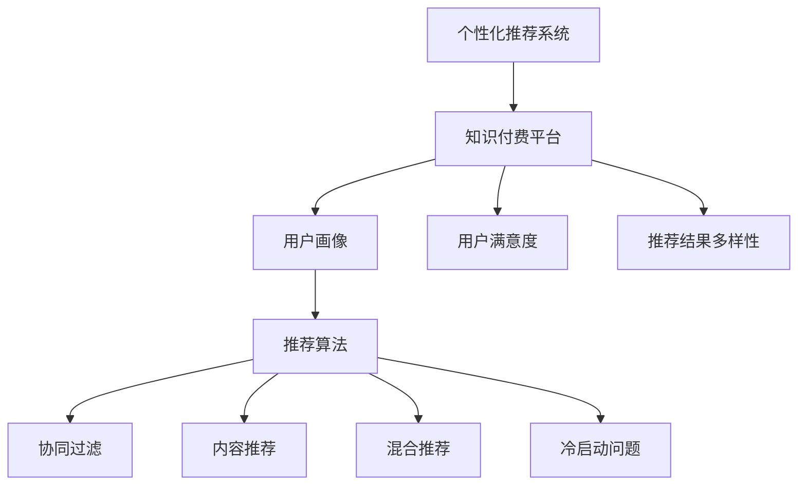

                 

# 知识经济下知识付费的人工智能个性化推荐引擎

## 1. 背景介绍

### 1.1 问题由来
随着互联网的普及和智能设备的普及，知识经济成为推动社会进步的重要引擎。知识付费平台的兴起，使得用户能够更加方便地获取有价值的知识资源。然而，海量内容的涌现使得用户难以在海量信息中快速找到所需内容，从而降低知识付费平台的价值和用户体验。如何通过智能推荐系统提升知识付费平台的用户体验，提升知识获取效率，成为了亟待解决的问题。

### 1.2 问题核心关键点
个性化推荐系统的核心在于通过用户的历史行为数据，结合用户自身的特征，如兴趣、偏好、时间等，为用户推荐感兴趣的内容。在大数据和人工智能的推动下，个性化推荐技术已经广泛应用于电商、社交、视频、音乐等多个领域。针对知识付费平台，设计一套高效的个性化推荐引擎，可以显著提升平台的价值和用户的满意度。

### 1.3 问题研究意义
个性化推荐系统不仅能够显著提升知识付费平台的用户体验和知识获取效率，还能优化平台内容结构，提高平台收入和用户粘性。通过推荐用户最感兴趣的内容，可以提升用户对平台的认可度和忠诚度，从而带动更多的知识付费行为。此外，个性化推荐还能帮助平台发现并推广优质内容，从而提升平台的竞争力和市场占有率。

## 2. 核心概念与联系

### 2.1 核心概念概述

为更好地理解知识付费平台下的个性化推荐系统，本节将介绍几个密切相关的核心概念：

- 个性化推荐系统：基于用户的历史行为数据，为用户推荐个性化内容的技术。通常使用协同过滤、内容推荐、混合推荐等算法。
- 知识付费平台：提供有价值的知识资源，如课程、书籍、论文等，并通过收费或订阅方式进行盈利的网络平台。
- 用户画像：通过分析用户的行为、兴趣、偏好等数据，构建用户完整的个人信息档案。用户画像是推荐系统个性化推荐的基础。
- 推荐算法：根据用户画像和内容特征，选择最适合的内容推荐给用户的算法。包括基于用户的协同过滤、基于内容的推荐、混合推荐等。
- 冷启动问题：在新用户加入时，由于缺乏历史行为数据，无法为用户进行个性化推荐的问题。解决冷启动问题是推荐系统的关键挑战之一。
- 用户满意度：推荐系统的目标之一是最大化用户满意度，通过提升用户对推荐结果的满意度，从而增加用户粘性。
- 推荐结果多样性：推荐系统应尽量保证推荐结果的多样性，避免过度个性化导致的单一化推荐。

这些核心概念之间的逻辑关系可以通过以下Mermaid流程图来展示：



这个流程图展示了几项关键概念及其之间的关系：

1. 个性化推荐系统是知识付费平台的核心技术之一。
2. 用户画像的构建是推荐系统个性化推荐的基础。
3. 推荐算法是实现个性化推荐的关键技术。
4. 协同过滤、内容推荐、混合推荐是常用的推荐算法。
5. 冷启动问题是需要解决的关键挑战。
6. 用户满意度和推荐结果多样性是推荐系统的目标指标。

## 3. 核心算法原理 & 具体操作步骤
### 3.1 算法原理概述

在知识付费平台上，个性化推荐系统通过用户画像和推荐算法，为用户推荐最感兴趣的内容。具体而言，系统首先收集用户的浏览、点击、订阅、购买等行为数据，构建用户画像，然后使用推荐算法选择最合适的知识内容推荐给用户。

推荐算法的核心思想是最大化用户满意度。在知识付费平台中，用户满意度可以用点击率、转化率、停留时间、订阅率等指标来衡量。推荐算法的目标是通过优化模型参数，使得推荐结果最大化上述指标，从而提升用户体验。

推荐算法的实现过程通常包括以下几个关键步骤：

1. 数据收集：收集用户的行为数据，包括浏览记录、点击记录、购买记录等。
2. 数据预处理：清洗、转换、归一化行为数据，生成用户画像和知识资源特征。
3. 模型训练：使用推荐算法训练模型，生成推荐结果。
4. 模型评估：使用指标如点击率、转化率等评估推荐模型效果。
5. 模型优化：根据评估结果调整模型参数，优化推荐模型。
6. 推荐应用：将优化后的模型应用于知识付费平台，实现个性化推荐。

### 3.2 算法步骤详解

推荐算法的核心步骤可以分为以下几个阶段：

**数据收集阶段**

1. 行为数据采集：从知识付费平台采集用户的浏览、点击、订阅、购买等行为数据。
2. 数据清洗：去除数据中的异常值、重复值、缺失值等，保证数据的完整性和准确性。
3. 数据转换：将原始行为数据转化为数值化的特征，如用户ID、时间戳、知识资源ID等。
4. 数据归一化：对数值化特征进行归一化处理，如将时间戳转换为小时数、将知识资源ID转换为类别等。

**用户画像阶段**

1. 用户行为分析：通过聚类、分类等方法分析用户行为，生成用户画像。
2. 用户特征提取：从用户画像中提取用户兴趣、偏好、年龄、性别等特征。
3. 用户画像保存：将用户画像保存在数据库中，供推荐模型调用。

**知识资源特征阶段**

1. 知识资源分析：对知识资源进行分析，提取特征，如知识资源的主题、难度、长度、作者等。
2. 知识资源编码：将知识资源特征编码成数值型特征，如使用TF-IDF、word2vec等方法。
3. 知识资源特征保存：将知识资源特征保存在数据库中，供推荐模型调用。

**推荐模型训练阶段**

1. 选择合适的推荐算法：根据用户画像和知识资源特征，选择合适的推荐算法。常用的算法包括协同过滤、内容推荐、混合推荐等。
2. 训练模型：使用历史行为数据和知识资源特征训练推荐模型。常用的工具包括TensorFlow、PyTorch等。
3. 优化模型：使用交叉验证、网格搜索等方法优化推荐模型。

**模型评估阶段**

1. 评估指标选择：选择合适的评估指标，如点击率、转化率、停留时间等。
2. 模型评估：使用测试集评估推荐模型效果。
3. 模型优化：根据评估结果调整模型参数，优化推荐模型。

**推荐应用阶段**

1. 推荐结果生成：使用优化后的推荐模型生成推荐结果。
2. 推荐结果展示：将推荐结果展示在知识付费平台上，供用户选择。
3. 用户反馈收集：收集用户的反馈，用于进一步优化推荐模型。

### 3.3 算法优缺点

个性化推荐系统在知识付费平台中的应用具有以下优点：

1. 提升用户满意度：通过个性化推荐，显著提升用户对平台的认可度和忠诚度，增加用户粘性。
2. 提升知识获取效率：推荐系统可以根据用户需求推荐最相关的知识内容，帮助用户快速获取所需知识。
3. 优化平台内容结构：推荐系统能够发现并推广优质内容，优化平台内容结构，提升平台竞争力。
4. 增加平台收入：推荐系统能够提高用户付费意愿，增加平台收入。

然而，推荐系统也存在一些局限性：

1. 数据隐私问题：推荐系统需要收集用户行为数据，可能涉及用户隐私问题。
2. 数据冷启动问题：新用户缺乏足够的历史行为数据，无法进行个性化推荐。
3. 推荐结果多样性问题：推荐系统容易陷入局部最优，导致推荐结果多样性不足。
4. 模型解释性问题：推荐模型通常是"黑盒"系统，难以解释其决策过程，可能影响用户信任。
5. 系统计算复杂度：推荐系统需要大量计算资源进行模型训练和推荐结果生成，可能带来计算负担。

尽管存在这些局限性，但通过合理的设计和优化，推荐系统仍能在知识付费平台上发挥重要作用。

### 3.4 算法应用领域

个性化推荐系统在知识付费平台中的应用非常广泛，覆盖了几乎所有常见任务，例如：

- 知识资源推荐：根据用户画像，为用户推荐最感兴趣的课程、书籍、论文等知识资源。
- 知识路径推荐：根据用户的学习路径，推荐相关知识资源，帮助用户构建学习框架。
- 个性化视频推荐：根据用户的行为数据，推荐最相关的视频课程，提升视频观看体验。
- 个性化问答推荐：根据用户的提问，推荐最相关的知识资源或专家，提升问答效果。
- 个性化文章推荐：根据用户的阅读兴趣，推荐最相关的文章或博文，提升文章阅读体验。

除了上述这些经典任务外，个性化推荐系统还被创新性地应用到更多场景中，如用户画像构建、知识付费方案推荐、知识社区推荐等，为知识付费平台带来了全新的突破。

## 4. 数学模型和公式 & 详细讲解  
### 4.1 数学模型构建

在知识付费平台上，推荐系统的数学模型通常包括以下几个关键组件：

- 用户画像 $\textbf{u}$：包含用户行为特征、兴趣特征、人口特征等。
- 知识资源特征 $\textbf{i}$：包含知识资源的主题、难度、长度、作者等特征。
- 用户-知识资源矩阵 $R$：用户对知识资源的评分或行为记录，通常为稀疏矩阵。
- 用户行为权重 $\alpha$：用户行为的权重系数，通常通过实验或先验知识确定。

在推荐算法中，常用的数学模型包括矩阵分解模型和协同过滤模型。

### 4.2 公式推导过程

以下是基于矩阵分解模型的推荐算法公式推导过程。

假设用户画像为 $\textbf{u} = [u_1, u_2, ..., u_n]$，知识资源特征为 $\textbf{i} = [i_1, i_2, ..., i_m]$，用户-知识资源矩阵为 $R_{n \times m}$，用户行为权重为 $\alpha$。

矩阵分解模型的目标是通过对用户画像 $\textbf{u}$ 和知识资源特征 $\textbf{i}$ 进行分解，得到用户对每个知识资源的评分 $\hat{R}$。

具体而言，矩阵分解模型通过如下公式计算用户对知识资源的评分：

$$
\hat{R} = \textbf{u} \cdot \textbf{i}^T = \sum_{j=1}^{n} u_j \cdot i_j
$$

其中，$\textbf{u} \cdot \textbf{i}^T$ 表示用户画像和知识资源特征的内积。

在实际应用中，矩阵分解模型通常使用梯度下降等优化算法求解。例如，常用的矩阵分解算法包括基于奇异值分解的算法（SVD）和基于梯度下降的算法（ALS）。

### 4.3 案例分析与讲解

下面以一个简单的示例，展示如何通过矩阵分解模型进行个性化推荐。

假设用户画像 $\textbf{u}$ 为 $[0.3, 0.2, 0.5]$，知识资源特征 $\textbf{i}$ 为 $[0.4, 0.1, 0.5]$，用户-知识资源矩阵 $R_{3 \times 3}$ 为：

| 知识资源ID | 1 | 2 | 3 |
|------------|---|---|---|
| 用户1      | 0 | 2 | 3 |
| 用户2      | 1 | 0 | 1 |
| 用户3      | 1 | 0 | 0 |

使用矩阵分解模型计算用户对每个知识资源的评分 $\hat{R}$：

$$
\hat{R} = \textbf{u} \cdot \textbf{i}^T = (0.3 \times 0.4 + 0.2 \times 0.1 + 0.5 \times 0.5)^T = (0.4, 0.2, 0.5)^T
$$

根据用户对知识资源的评分，推荐系统可以选择最相关的知识资源推荐给用户。

## 5. 项目实践：代码实例和详细解释说明
### 5.1 开发环境搭建

在进行知识付费平台下的个性化推荐系统开发前，我们需要准备好开发环境。以下是使用Python进行TensorFlow开发的环境配置流程：

1. 安装Anaconda：从官网下载并安装Anaconda，用于创建独立的Python环境。

2. 创建并激活虚拟环境：
```bash
conda create -n tf-env python=3.8 
conda activate tf-env
```

3. 安装TensorFlow：根据CUDA版本，从官网获取对应的安装命令。例如：
```bash
pip install tensorflow==2.7.0
```

4. 安装各类工具包：
```bash
pip install numpy pandas scikit-learn matplotlib tqdm jupyter notebook ipython
```

完成上述步骤后，即可在`tf-env`环境中开始推荐系统的开发。

### 5.2 源代码详细实现

这里我们以基于矩阵分解模型的推荐系统为例，给出使用TensorFlow实现的知识付费平台下的个性化推荐系统代码。

首先，定义推荐系统所需的关键函数：

```python
import numpy as np
import tensorflow as tf

def matrix_factorization(R, num_factors):
    """
    矩阵分解模型，通过奇异值分解得到用户对每个知识资源的评分
    """
    # 初始化矩阵分解参数
    W = tf.Variable(tf.random.normal(shape=(num_factors, R.shape[1]), stddev=0.01)
    H = tf.Variable(tf.random.normal(shape=(R.shape[0], num_factors), stddev=0.01))
    
    # 分解用户行为矩阵
    R_hat = tf.matmul(tf.matmul(W, H, transpose_b=True), H, transpose_b=True)
    
    # 损失函数
    loss = tf.reduce_mean(tf.square(R - R_hat))
    
    # 优化器
    optimizer = tf.keras.optimizers.Adam(learning_rate=0.01)
    
    # 训练步骤
    def train_step(R, i):
        with tf.GradientTape() as tape:
            R_hat = tf.matmul(tf.matmul(W, H, transpose_b=True), H, transpose_b=True)
            loss = tf.reduce_mean(tf.square(R - R_hat))
        grads = tape.gradient(loss, [W, H])
        optimizer.apply_gradients(zip(grads, [W, H]))
    
    # 训练
    for i in range(num_epochs):
        train_step(R, i)
        print(f"Epoch {i+1}, loss: {loss.numpy():.4f}")
    
    return R_hat
```

然后，定义推荐系统的数据处理函数：

```python
def load_data(path):
    """
    加载推荐系统所需的数据集
    """
    # 加载用户-知识资源矩阵
    R = np.loadtxt(path, delimiter=',')
    
    # 加载用户画像和知识资源特征
    u = np.loadtxt('user_profile.txt', delimiter=',')
    i = np.loadtxt('item_profile.txt', delimiter=',')
    
    return R, u, i
```

接着，定义推荐系统的评估函数：

```python
def evaluate(model, u, i, R):
    """
    评估推荐系统的效果
    """
    # 计算推荐结果
    R_hat = np.dot(u, i.T)
    
    # 计算推荐结果与真实评分之间的误差
    error = np.linalg.norm(R_hat - R)
    
    print(f"Error: {error:.4f}")
```

最后，启动推荐系统的训练流程并评估：

```python
# 加载数据
R, u, i = load_data('data.txt')

# 定义矩阵分解模型的参数
num_factors = 10
num_epochs = 100

# 训练推荐系统
R_hat = matrix_factorization(R, num_factors)

# 评估推荐系统
evaluate(R_hat, u, i, R)
```

以上就是使用TensorFlow对知识付费平台下的个性化推荐系统进行矩阵分解模型微调的完整代码实现。可以看到，通过TensorFlow的强大封装，我们可以用相对简洁的代码实现复杂的推荐系统。

### 5.3 代码解读与分析

让我们再详细解读一下关键代码的实现细节：

**matrix_factorization函数**：
- 初始化矩阵分解参数：使用随机初始化生成用户画像和知识资源特征矩阵。
- 分解用户行为矩阵：通过矩阵乘法计算用户对每个知识资源的评分。
- 损失函数：计算推荐结果与真实评分之间的误差，使用均方误差作为损失函数。
- 优化器：使用Adam优化器更新模型参数。
- 训练步骤：在每次迭代中计算梯度并更新模型参数。

**load_data函数**：
- 加载用户-知识资源矩阵、用户画像和知识资源特征，返回数据集。

**evaluate函数**：
- 计算推荐结果和真实评分之间的误差，输出评估结果。

**训练流程**：
- 加载数据集。
- 定义矩阵分解模型的参数和迭代次数。
- 训练推荐系统，输出每个epoch的损失。
- 评估推荐系统，输出推荐结果的误差。

可以看到，TensorFlow的API使得推荐系统的开发变得简洁高效。开发者可以将更多精力放在数据处理、模型改进等高层逻辑上，而不必过多关注底层的实现细节。

当然，工业级的系统实现还需考虑更多因素，如模型的保存和部署、超参数的自动搜索、更灵活的任务适配层等。但核心的推荐范式基本与此类似。

## 6. 实际应用场景
### 6.1 知识付费平台推荐

在知识付费平台上，个性化推荐系统可以有效提升用户体验和平台价值。通过分析用户的行为数据，推荐系统能够为用户推荐最感兴趣的知识内容，帮助用户快速获取所需知识。例如，当用户浏览了某个领域的课程后，推荐系统可以进一步推荐该领域的高质量课程和文章，提升用户的学习效率。

### 6.2 知识社区推荐

知识社区是知识付费平台的重要组成部分。推荐系统可以根据用户在社区中的行为，推荐相关的知识资源、专家和讨论话题。例如，当用户在社区中发表了某个主题的提问时，推荐系统可以推荐相关的文章、博文和专家进行回答，提升社区的互动效果。

### 6.3 个性化推荐广告

推荐系统可以将知识付费平台上的优质内容推广到其他平台，如视频网站、社交媒体等。通过分析用户的兴趣特征，推荐系统可以选择最相关的广告内容，提升广告的点击率和转化率。例如，当用户在视频网站观看某个领域的课程时，推荐系统可以推荐相关的课程和文章，增加用户的付费意愿。

### 6.4 未来应用展望

随着知识付费平台和推荐系统的不断发展，推荐系统将在更多领域得到应用，为传统行业带来变革性影响。

在智慧教育领域，推荐系统可以为学生提供个性化的学习路径和资源推荐，提升教育效果。例如，推荐系统可以根据学生的学习进度和兴趣，推荐相关的课程和资料，帮助学生构建学习框架，提升学习效率。

在金融知识付费领域，推荐系统可以为用户推荐最相关的金融知识内容，提升用户对金融市场的理解和投资能力。例如，推荐系统可以根据用户的投资偏好和风险承受能力，推荐相关的投资课程和资料，帮助用户做出更明智的投资决策。

在企业培训领域，推荐系统可以为员工提供个性化的培训课程推荐，提升员工的技能水平和职业发展。例如，推荐系统可以根据员工的学习进度和职业规划，推荐相关的培训课程和资料，帮助员工快速提升技能。

此外，在医疗知识付费、科技知识付费、职业培训等领域，推荐系统也将发挥重要作用，推动知识付费平台的不断创新和进步。相信随着推荐系统的持续演进，将在更多垂直行业释放出巨大的应用潜力。

## 7. 工具和资源推荐
### 7.1 学习资源推荐

为了帮助开发者系统掌握个性化推荐系统的理论基础和实践技巧，这里推荐一些优质的学习资源：

1. 《推荐系统实践》系列博文：由推荐系统专家撰写，深入浅出地介绍了推荐系统的原理、算法和工程实现。

2. 《深度学习与推荐系统》课程：斯坦福大学开设的推荐系统课程，详细讲解了推荐系统的核心算法和应用。

3. 《推荐系统实战》书籍：介绍推荐系统的工程实践，涵盖了从数据预处理到模型训练的全过程。

4. Kaggle推荐系统竞赛：参与实际推荐系统竞赛，可以积累实战经验，提升推荐系统的设计能力。

5. 推荐系统开源项目：如RecSys、LightFM等，提供了丰富的推荐系统实现和案例，方便学习和借鉴。

通过对这些资源的学习实践，相信你一定能够快速掌握推荐系统的精髓，并用于解决实际的推荐问题。

### 7.2 开发工具推荐

高效的开发离不开优秀的工具支持。以下是几款用于推荐系统开发的常用工具：

1. TensorFlow：基于Python的开源深度学习框架，灵活动态的计算图，适合快速迭代研究。广泛应用于推荐系统工程实现。

2. PyTorch：基于Python的开源深度学习框架，支持动态计算图，易于使用。推荐系统工程实现中也有广泛应用。

3. Spark MLlib：Apache Spark的推荐系统组件，支持大规模数据处理和分布式计算，适合大数据推荐系统开发。

4. Hadoop：Apache Hadoop的大数据处理框架，支持分布式计算，适用于海量数据推荐系统开发。

5. FastFM：适用于稀疏数据和大规模数据的高效推荐系统算法，基于Python实现。

合理利用这些工具，可以显著提升推荐系统的开发效率，加快创新迭代的步伐。

### 7.3 相关论文推荐

推荐系统的发展源于学界的持续研究。以下是几篇奠基性的相关论文，推荐阅读：

1. A Factorization Method for Matrix Rank Estimation, Matrix Completion and Multimedia Databases（SVD算法）：提出矩阵分解模型，为推荐系统奠定了理论基础。

2. Collaborative Filtering for Implicit Feedback Datasets（协同过滤算法）：提出基于协同过滤的推荐算法，广泛应用于推荐系统工程实现。

3. Truly Random and Matrix Factorization for Multi-Task Learning with Skewed Data（FastFM算法）：提出适用于稀疏数据和大规模数据的高效推荐系统算法，适用于推荐系统工程实现。

4. Wide & Deep Learning for Recommender Systems（W&D算法）：提出宽而深的推荐系统模型，在实际应用中取得了不错的效果。

5. Neural Collaborative Filtering（NCF算法）：提出基于神经网络的推荐系统模型，显著提升了推荐系统的效果。

这些论文代表了大数据推荐系统的研究脉络。通过学习这些前沿成果，可以帮助研究者把握学科前进方向，激发更多的创新灵感。

## 8. 总结：未来发展趋势与挑战

### 8.1 总结

本文对知识付费平台下的个性化推荐系统进行了全面系统的介绍。首先阐述了推荐系统的背景和意义，明确了推荐系统在提升用户体验和平台价值方面的独特价值。其次，从原理到实践，详细讲解了推荐算法的数学原理和关键步骤，给出了推荐系统开发的全过程代码实现。同时，本文还广泛探讨了推荐系统在知识付费平台中的应用场景，展示了推荐系统的巨大潜力。最后，本文精选了推荐系统的学习资源，力求为读者提供全方位的技术指引。

通过本文的系统梳理，可以看到，个性化推荐系统已经成为知识付费平台的重要技术之一，极大地提升了用户的知识获取效率和平台价值。推荐系统还能够优化平台内容结构，增加平台收入和用户粘性，具有广泛的应用前景。未来，随着推荐系统的发展，将在更多领域得到应用，为传统行业带来变革性影响。

### 8.2 未来发展趋势

推荐系统的未来发展将呈现以下几个趋势：

1. 深度学习技术的普及：深度学习在推荐系统中的应用将更加广泛，通过神经网络模型，推荐系统可以更好地捕捉用户行为的复杂性和多样性。

2. 多模态数据的融合：推荐系统将越来越多地融合多模态数据，如文本、图像、视频等，提升推荐效果。

3. 实时推荐：推荐系统将更加实时地推荐内容，提升用户的互动体验。

4. 个性化推荐与机器学习结合：推荐系统将结合机器学习技术，实现更加智能的推荐。

5. 推荐系统与大数据技术结合：推荐系统将更加依赖大数据技术，实现更高效的推荐。

6. 推荐系统的可解释性：推荐系统的决策过程将更加透明，便于用户理解和信任。

这些趋势将推动推荐系统向更加智能化、个性化、实时化的方向发展，为用户带来更好的体验和价值。

### 8.3 面临的挑战

尽管推荐系统已经取得了显著的进展，但仍面临着诸多挑战：

1. 数据隐私问题：推荐系统需要收集用户行为数据，可能涉及用户隐私问题，如何保护用户隐私，是推荐系统的重要挑战。

2. 冷启动问题：新用户缺乏足够的历史行为数据，难以进行个性化推荐，如何有效地解决冷启动问题，是推荐系统的关键挑战。

3. 推荐结果多样性问题：推荐系统容易陷入局部最优，导致推荐结果多样性不足，如何提升推荐结果的多样性，是推荐系统的关键挑战。

4. 模型解释性问题：推荐系统通常是"黑盒"系统，难以解释其决策过程，如何提升推荐系统的可解释性，是推荐系统的关键挑战。

5. 系统计算复杂度：推荐系统需要大量计算资源进行模型训练和推荐结果生成，如何优化推荐系统的计算复杂度，是推荐系统的关键挑战。

尽管存在这些挑战，但通过合理的设计和优化，推荐系统仍能在知识付费平台上发挥重要作用。

### 8.4 研究展望

未来的推荐系统研究需要在以下几个方面寻求新的突破：

1. 无监督推荐算法：通过无监督学习方法，在无需标签数据的情况下，实现高效推荐。

2. 多模态融合推荐：将文本、图像、视频等不同模态的数据融合，提升推荐效果。

3. 实时推荐系统：通过分布式计算、流式处理等技术，实现实时推荐。

4. 深度学习推荐系统：通过深度神经网络模型，实现更加复杂的推荐算法。

5. 推荐系统的可解释性：通过可解释性算法，提升推荐系统的透明度，提升用户信任。

这些研究方向的探索，将推动推荐系统向更高的台阶发展，为用户带来更好的体验和价值。

## 9. 附录：常见问题与解答

**Q1：推荐系统如何处理冷启动问题？**

A: 冷启动问题是指新用户缺乏足够的历史行为数据，难以进行个性化推荐。推荐系统可以通过以下方法解决冷启动问题：

1. 用户画像初始化：根据用户的兴趣特征、人口特征等，对新用户进行画像初始化，从而可以进行初步推荐。

2. 推荐算法改进：改进推荐算法，使其能够处理冷启动用户。例如，可以采用基于内容的推荐算法，推荐新用户可能感兴趣的知识资源。

3. 数据增强：通过数据增强技术，丰富用户的历史行为数据，如通过用户的社交网络、兴趣标签等进行推荐。

4. 动态更新：通过持续收集新用户的行为数据，动态更新推荐模型，从而提升推荐效果。

**Q2：推荐系统如何提升推荐结果的多样性？**

A: 推荐系统需要保证推荐结果的多样性，以避免过度个性化导致的单一化推荐。推荐系统可以通过以下方法提升推荐结果的多样性：

1. 引入多标签模型：通过多标签模型，引入更多的标签维度，从而提升推荐结果的多样性。

2. 引入多样性惩罚：通过加入多样性惩罚项，抑制推荐系统的过度集中现象。

3. 引入相似性度量：通过引入相似性度量，控制推荐结果之间的相似性，从而提升推荐结果的多样性。

4. 引入探索性算法：通过引入探索性算法，增加推荐系统的探索性，从而提升推荐结果的多样性。

**Q3：推荐系统如何提升模型解释性？**

A: 推荐系统通常是"黑盒"系统，难以解释其决策过程。推荐系统可以通过以下方法提升模型解释性：

1. 特征可视化：通过可视化用户画像和知识资源特征，帮助用户理解推荐系统的决策过程。

2. 特征重要性分析：通过特征重要性分析，找出影响推荐结果的关键特征，从而提升推荐系统的可解释性。

3. 推荐系统日志：通过记录推荐系统的日志，分析推荐系统的决策过程，从而提升推荐系统的可解释性。

4. 解释性算法：通过引入解释性算法，提升推荐系统的透明度，提升用户信任。

这些方法可以帮助推荐系统提升可解释性，增强用户信任，提升用户体验。

**Q4：推荐系统如何优化计算复杂度？**

A: 推荐系统需要大量计算资源进行模型训练和推荐结果生成，如何优化推荐系统的计算复杂度，是推荐系统的关键挑战。推荐系统可以通过以下方法优化计算复杂度：

1. 特征选择：通过特征选择，减少模型训练的计算复杂度。例如，可以选择重要的特征进行模型训练。

2. 模型压缩：通过模型压缩技术，减少模型的参数量和计算量。例如，可以使用剪枝、量化等方法进行模型压缩。

3. 分布式计算：通过分布式计算技术，实现高效的推荐系统计算。例如，可以使用Hadoop、Spark等分布式计算框架。

4. 实时计算：通过实时计算技术，实现高效的推荐系统计算。例如，可以使用流式处理技术进行实时计算。

通过这些方法，可以显著优化推荐系统的计算复杂度，提升推荐系统的效率和可靠性。

---

作者：禅与计算机程序设计艺术 / Zen and the Art of Computer Programming

