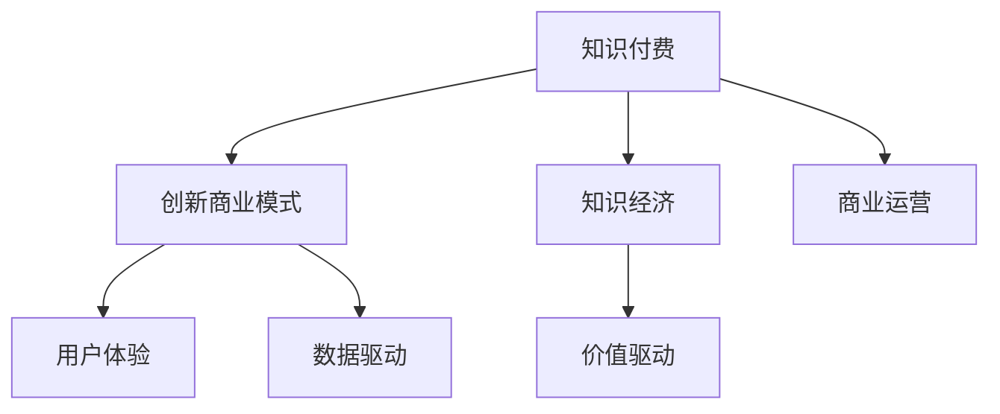

                 

# 知识经济时代下的知识付费创新商业模式运营

> 关键词：知识付费, 创新商业模式, 知识经济, 商业运营

## 1. 背景介绍

### 1.1 问题由来

随着信息技术的飞速发展，知识和信息在经济活动中的地位日益凸显，逐步成为驱动经济增长的核心动力之一。知识经济时代的到来，要求企业、组织和个人必须拥有不断学习和创新的能力，以适应快速变化的市场环境。知识付费作为新兴的商业模式，旨在将知识产品化、市场化，为知识提供者和消费者之间搭建起桥梁，推动知识价值的有效转化。

知识付费的兴起，不仅仅是基于对知识价值的认知，更是对知识经济时代知识需求不断扩大的回应。然而，知识付费市场的发展同样面临着诸多挑战，如内容质量参差不齐、商业模式同质化、消费者支付意愿不高等问题。

### 1.2 问题核心关键点

知识付费的核心在于如何将知识资源有效地转化为商业价值，通过创新的商业模式运营，激发知识市场的活力，满足消费者对高质量知识内容的需求。

具体来说，知识付费运营的关键点包括：

1. **内容质量**：确保知识内容的专业性和实用性，吸引和留住付费用户。
2. **用户体验**：提供便捷、无缝的用户体验，增加用户粘性。
3. **商业模式**：设计合理的收费机制，实现知识生产者和消费者的共赢。
4. **市场定位**：明确目标用户群体，精准营销。
5. **数据驱动**：利用大数据分析，优化内容生产和用户运营策略。

## 2. 核心概念与联系

### 2.1 核心概念概述

为更好地理解知识付费运营的核心概念，本节将介绍几个密切相关的核心概念：

- **知识付费**：通过收费机制向消费者提供知识产品和服务，以满足其对高质量知识内容的需求。知识付费包括在线课程、电子书、专家咨询等多种形式。
- **创新商业模式**：在知识付费领域，通过引入新理念、新方法和新模式，打破传统商业逻辑，创造新的价值链和利润模式。
- **知识经济**：以知识和信息为核心资源的经济形态，强调知识在推动经济发展和社会进步中的重要作用。
- **商业运营**：指企业为实现商业目标，对产品、市场、渠道等进行全面规划和管理的过程。

这些核心概念之间的逻辑关系可以通过以下Mermaid流程图来展示：



这个流程图展示的知识付费的核心概念及其之间的关系：

1. 知识付费是商业运营的子集，涉及知识产品和服务的市场化过程。
2. 知识付费基于知识经济时代，以知识资源的开发和利用为核心驱动力。
3. 创新商业模式是知识付费的重要保障，通过新颖的运营策略和盈利模式，确保商业活动的持续健康发展。
4. 数据驱动是知识付费运营的重要支撑，通过数据分析优化内容和运营策略，提升用户满意度和商业效率。

这些概念共同构成了知识付费运营的理论基础和实践框架，为知识付费模式的创新提供了方向和依据。

## 3. 核心算法原理 & 具体操作步骤
### 3.1 算法原理概述

知识付费运营的核心在于如何通过创新的商业模式，将知识产品和服务有效转化为商业价值。其核心算法原理包括以下几个方面：

1. **需求分析**：通过市场调研和数据分析，识别消费者的知识需求和支付意愿，为内容生产和商业策略制定提供依据。
2. **内容匹配**：利用推荐算法和大数据技术，实现知识内容与消费者需求的高效匹配，提升用户体验。
3. **定价策略**：根据内容价值和市场反馈，动态调整定价策略，实现知识产品和服务的市场价值最大化。
4. **运营优化**：通过用户反馈和数据分析，不断优化内容和运营策略，提升商业效率和用户满意度。

### 3.2 算法步骤详解

知识付费运营的算法步骤主要包括：

1. **需求挖掘**：通过问卷调查、数据分析等方式，获取用户对知识内容的需求信息，识别潜在的用户群体和消费偏好。
2. **内容生产**：根据需求分析结果，组织专家团队或内容创作者，生产高质量的知识内容，涵盖不同领域和主题。
3. **用户匹配**：利用推荐算法和用户画像技术，将内容与用户需求进行匹配，提供个性化的推荐服务。
4. **支付模型设计**：设计合理的支付模型，如按需付费、订阅制等，满足不同用户群体的支付习惯和需求。
5. **运营优化**：通过用户行为数据和反馈，不断优化内容和运营策略，提升用户满意度和商业效率。

### 3.3 算法优缺点

知识付费运营的算法具有以下优点：

1. **精准匹配**：通过推荐算法和大数据分析，实现内容与用户的精准匹配，提升用户体验。
2. **用户粘性**：个性化推荐和服务，增加用户粘性，提升用户转化率和留存率。
3. **高效运营**：基于数据分析的运营优化，提升商业效率和运营效果。

同时，该算法也存在一定的局限性：

1. **内容质量**：高质量内容的生产和获取成本较高，难以满足大规模用户的需求。
2. **算法复杂性**：推荐算法和大数据分析需要复杂的计算资源和技术支持，对技术门槛要求较高。
3. **用户多样性**：不同用户群体的需求和支付意愿差异较大，单一算法难以满足所有用户。
4. **市场变化**：市场需求和技术环境变化较快，算法需要不断迭代和优化。

### 3.4 算法应用领域

知识付费运营的算法在多个领域得到了广泛应用，例如：

1. **在线教育**：通过知识付费平台，提供各类在线课程和资源，满足不同学习者的需求。
2. **职业培训**：提供行业专业知识和技能培训，帮助用户提升职业技能和竞争力。
3. **咨询和辅导**：通过专家咨询服务，提供个性化问题和困难的解决方案。
4. **科技产品**：通过知识付费形式，分享最新科技动态和应用案例。
5. **文化娱乐**：提供各类文化产品，如小说、音乐、影视等，满足用户精神文化需求。

这些应用领域展示了知识付费运营算法的广泛适用性和巨大潜力，为知识经济时代的知识传播和商业转化提供了有力支持。

## 4. 数学模型和公式 & 详细讲解 & 举例说明（备注：数学公式请使用latex格式，latex嵌入文中独立段落使用 $$，段落内使用 $)
### 4.1 数学模型构建

知识付费运营的数学模型主要围绕用户需求、内容价值和市场反馈进行构建。以下以在线课程订阅为例，构建一个简单的数学模型：

设用户对课程 $i$ 的需求为 $d_i$，课程价值为 $v_i$，订阅价格为 $p_i$。根据市场需求和供给，用户订阅行为可以用以下公式表示：

$$
\text{订阅用户数} = \sum_{i} \min(d_i, \frac{p_i}{v_i} \times \text{总需求})
$$

其中，$\text{总需求}$ 表示所有用户对课程的总体需求，$\frac{p_i}{v_i}$ 表示课程的边际价值。

### 4.2 公式推导过程

在线课程订阅模型的推导如下：

1. **需求函数**：设用户对课程的需求为 $d_i$，可以表示为：

$$
d_i = f(x_i) = k_1 \times \text{内容质量} + k_2 \times \text{用户画像}
$$

其中，$x_i$ 为影响需求的因素，如课程主题、讲师声誉等。

2. **价值函数**：课程的价值 $v_i$ 可以表示为：

$$
v_i = g(y_i) = k_3 \times \text{内容深度} + k_4 \times \text{内容时效性}
$$

其中，$y_i$ 为影响价值的其他因素，如讲师背景、课程反馈等。

3. **价格函数**：订阅价格 $p_i$ 可以表示为：

$$
p_i = h(z_i) = k_5 \times \text{市场定位} + k_6 \times \text{营销策略}
$$

其中，$z_i$ 为影响价格的因素，如市场竞争、用户心理等。

将上述函数代入订阅用户数公式，得到：

$$
\text{订阅用户数} = \sum_{i} \min(d_i, \frac{p_i}{v_i} \times \text{总需求})
$$

### 4.3 案例分析与讲解

假设某在线教育平台有三种热门课程，分别为编程、金融和心理学，其需求函数、价值函数和价格函数如下：

1. 编程课程：

   - 需求函数：$d_{\text{编程}} = 0.1 \times \text{内容质量} + 0.2 \times \text{用户画像}$
   - 价值函数：$v_{\text{编程}} = 0.5 \times \text{内容深度} + 0.3 \times \text{内容时效性}$
   - 价格函数：$p_{\text{编程}} = 0.3 \times \text{市场定位} + 0.2 \times \text{营销策略}$

2. 金融课程：

   - 需求函数：$d_{\text{金融}} = 0.2 \times \text{内容质量} + 0.4 \times \text{用户画像}$
   - 价值函数：$v_{\text{金融}} = 0.4 \times \text{内容深度} + 0.2 \times \text{内容时效性}$
   - 价格函数：$p_{\text{金融}} = 0.4 \times \text{市场定位} + 0.3 \times \text{营销策略}$

3. 心理学课程：

   - 需求函数：$d_{\text{心理学}} = 0.15 \times \text{内容质量} + 0.25 \times \text{用户画像}$
   - 价值函数：$v_{\text{心理学}} = 0.3 \times \text{内容深度} + 0.4 \times \text{内容时效性}$
   - 价格函数：$p_{\text{心理学}} = 0.5 \times \text{市场定位} + 0.3 \times \text{营销策略}$

通过上述函数计算，可以得出不同课程的订阅用户数，并通过优化价格和营销策略，最大化平台收益。

## 5. 项目实践：代码实例和详细解释说明
### 5.1 开发环境搭建

在进行知识付费运营的开发实践前，我们需要准备好开发环境。以下是使用Python进行Flask开发的环境配置流程：

1. 安装Python和Flask：从官网下载并安装Python和Flask，确保版本兼容性。

2. 创建项目文件夹，并在其中创建`app.py`和`templates`文件夹，分别用于编写Flask应用和HTML模板。

3. 安装依赖库：使用pip安装Flask、Jinja2、SQLAlchemy等依赖库。

完成上述步骤后，即可在本地搭建Flask应用。

### 5.2 源代码详细实现

下面以在线课程订阅平台为例，给出使用Flask和SQLAlchemy进行知识付费运营的Python代码实现。

首先，定义SQLAlchemy模型：

```python
from sqlalchemy import Column, Integer, Float, String, Boolean, ForeignKey
from sqlalchemy.orm import relationship
from sqlalchemy.ext.declarative import declarative_base

Base = declarative_base()

class User(Base):
    __tablename__ = 'users'
    id = Column(Integer, primary_key=True)
    name = Column(String)
    email = Column(String, unique=True)
    courses = relationship('Course', back_populates='users')

class Course(Base):
    __tablename__ = 'courses'
    id = Column(Integer, primary_key=True)
    name = Column(String)
    description = Column(String)
    price = Column(Float)
    user_id = Column(Integer, ForeignKey('users.id'))
    user = relationship('User', back_populates='courses')

Base.metadata.create_all('sqlite:///database.db', checkfirst=True)
```

然后，定义Flask应用和视图：

```python
from flask import Flask, render_template, request
from flask_sqlalchemy import SQLAlchemy
from models import User, Course

app = Flask(__name__)
app.config['SQLALCHEMY_DATABASE_URI'] = 'sqlite:///database.db'
db = SQLAlchemy(app)

@app.route('/')
def index():
    courses = Course.query.all()
    return render_template('index.html', courses=courses)

@app.route('/signup', methods=['GET', 'POST'])
def signup():
    if request.method == 'POST':
        user = User(name=request.form['name'], email=request.form['email'])
        db.session.add(user)
        db.session.commit()
        return 'Signup successful!'
    return render_template('signup.html')

@app.route('/subscribe', methods=['GET', 'POST'])
def subscribe():
    if request.method == 'POST':
        user_id = User.query.filter_by(email=request.form['email']).first().id
        course_id = Course.query.filter_by(name=request.form['course']).first().id
        user.course.append(course)
        db.session.commit()
        return 'Subscription successful!'
    courses = Course.query.all()
    return render_template('subscribe.html', courses=courses)

@app.route('/logout')
def logout():
    user_id = User.query.filter_by(email=request.form['email']).first().id
    user = User.query.get(user_id)
    user.courses.clear()
    db.session.commit()
    return 'Logout successful!'
```

最后，定义HTML模板和静态资源：

```html
<!-- index.html -->
<html>
    <head>
        <title>Course Subscription</title>
    </head>
    <body>
        <h1>Available Courses</h1>
        <ul>
            
                <li>{{ course.name }} - ${{ course.price }} - {{ course.description }}<br><a href="/subscribe?course={{ course.name }}">Subscribe</a></li>
            
        </ul>
    </body>
</html>

<!-- signup.html -->
<html>
    <head>
        <title>Sign Up</title>
    </head>
    <body>
        <h1>Sign Up</h1>
        <form method="post">
            Name: <input type="text" name="name"><br>
            Email: <input type="email" name="email"><br>
            <input type="submit" value="Sign Up">
        </form>
    </body>
</html>

<!-- subscribe.html -->
<html>
    <head>
        <title>Subscribe</title>
    </head>
    <body>
        <h1>Subscribe</h1>
        <form method="post">
            Course: <input type="text" name="course"><br>
            <input type="submit" value="Subscribe">
        </form>
    </body>
</html>
```

### 5.3 代码解读与分析

让我们再详细解读一下关键代码的实现细节：

**SQLAlchemy模型**：
- 定义了`User`和`Course`两个实体类，分别表示用户和课程。通过`relationship`方法，实现了用户和课程之间的一对多关系。
- 使用`Base.metadata.create_all()`方法创建数据库表结构。

**Flask应用和视图**：
- `app.route()`装饰器用于定义路由。
- 在`index()`视图中，通过`Course.query.all()`获取所有课程信息，并传递给HTML模板。
- 在`signup()`视图中，通过`User.query.filter_by()`和`db.session.add()`添加新用户，并提交到数据库。
- 在`subscribe()`视图中，通过`Course.query.filter_by()`获取指定课程，并通过`user.course.append()`将课程关联到用户，并提交到数据库。
- 在`logout()`视图中，通过`user.courses.clear()`移除用户的课程关联，并提交到数据库。

**HTML模板**：
- `index.html`模板用于显示所有课程信息，并在每门课程后添加订阅按钮。
- `signup.html`模板用于用户注册页面。
- `subscribe.html`模板用于课程订阅页面。

通过上述代码实现，我们构建了一个简单的知识付费订阅平台，实现了用户注册、课程订阅和注销等功能。这只是一个基础示例，实际应用中还需考虑更多的功能和安全性问题。

## 6. 实际应用场景
### 6.1 在线教育

在线教育平台是知识付费的重要应用场景之一。通过知识付费运营，平台可以为专家和讲师提供稳定的收入来源，同时满足用户对高质量教育资源的需求。平台可以根据用户的学习行为和反馈，动态调整课程内容和价格，提升用户体验和学习效果。

### 6.2 职业培训

职业培训类平台，如在线编程课、营销课程等，通过知识付费运营，帮助用户掌握新技能，提升职业竞争力。平台可以根据行业需求和用户反馈，设计和推出适合不同职业人群的课程，实现个性化教育和职业发展。

### 6.3 企业培训

企业内部培训通过知识付费运营，能够实现内部知识和经验的传承与共享，提升员工整体素质和工作效率。平台可以提供定制化的培训课程，根据员工需求和反馈进行内容优化和价格调整，实现资源的有效利用和价值的最大化。

### 6.4 咨询服务

知识付费在咨询服务领域也有广泛应用。专家和顾问可以通过知识付费提供个性化的咨询服务，帮助企业和个人解决实际问题。平台可以根据咨询效果和用户反馈，动态调整咨询内容和价格，提升服务质量和用户满意度。

### 6.5 文化娱乐

知识付费在文化娱乐领域也有广阔前景。平台可以提供各类文化产品，如电子书、音乐、影视等，满足用户对文化和娱乐的需求。平台可以通过知识付费运营，吸引更多的文化创作者和内容生产者，丰富文化市场，提升用户体验。

## 7. 工具和资源推荐
### 7.1 学习资源推荐

为了帮助开发者系统掌握知识付费运营的理论基础和实践技巧，这里推荐一些优质的学习资源：

1. **《知识付费：从0到1》**：这本书系统介绍了知识付费的商业模式、运营策略和技术实现，适合初学者和从业者阅读。
2. **Udemy《知识付费平台开发》课程**：通过实际项目案例，讲解知识付费平台的开发和运营，涵盖课程设计、内容管理、用户运营等多个方面。
3. **Coursera《知识付费与用户行为》课程**：通过数据分析和用户行为研究，帮助平台优化内容和运营策略，提升用户满意度和转化率。
4. **Mindbloom《知识付费运营手册》**：提供全面的知识付费运营指南，涵盖需求分析、内容生产、用户匹配、定价策略等多个环节。
5. **Kaggle《知识付费市场分析》竞赛**：通过实际数据分析项目，帮助参与者掌握知识付费市场的数据驱动运营策略。

通过对这些资源的学习实践，相信你一定能够快速掌握知识付费运营的精髓，并用于解决实际的运营问题。

### 7.2 开发工具推荐

高效的开发离不开优秀的工具支持。以下是几款用于知识付费运营开发的常用工具：

1. **Flask**：轻量级的Web框架，适合快速开发小型应用，支持RESTful API和模板渲染。
2. **SQLAlchemy**：强大的SQL工具包，支持对象关系映射(ORM)，方便数据管理和查询操作。
3. **Jinja2**：灵活的模板引擎，支持动态数据渲染，提升页面显示效果。
4. **Bootstrap**：流行的前端框架，提供丰富的UI组件和样式，加速Web应用开发。
5. **Docker**：容器化技术，方便应用部署和管理，提升开发效率和可移植性。

合理利用这些工具，可以显著提升知识付费运营的开发效率，加快创新迭代的步伐。

### 7.3 相关论文推荐

知识付费运营的研究源于学界的持续探索。以下是几篇奠基性的相关论文，推荐阅读：

1. **《知识付费市场分析与趋势预测》**：通过数据分析和预测模型，研究知识付费市场的现状和未来趋势。
2. **《知识付费商业模式创新》**：提出多种知识付费商业模式，包括课程订阅、咨询定制等，探讨其可行性和应用场景。
3. **《知识付费平台用户行为研究》**：利用数据分析方法，分析用户行为和支付意愿，为平台运营提供指导。
4. **《知识付费平台内容推荐系统》**：研究推荐算法和大数据技术，实现高质量内容与用户的精准匹配。
5. **《知识付费平台支付模型设计》**：探讨多种支付模型，如单次支付、订阅制等，优化定价策略，提升平台收益。

这些论文代表了大规模知识付费运营的研究进展，为知识付费模式的优化和创新提供了科学依据。

## 8. 总结：未来发展趋势与挑战
### 8.1 总结

本文对知识付费运营的创新商业模式进行了全面系统的介绍。首先阐述了知识付费的兴起背景和运营核心，明确了创新商业模式的必要性和重要性。其次，从原理到实践，详细讲解了知识付费运营的算法原理和具体操作步骤，给出了实际项目开发的完整代码实例。同时，本文还广泛探讨了知识付费运营在多个领域的应用场景，展示了其广阔的前景。最后，本文精选了知识付费运营的学习资源、开发工具和相关论文，力求为读者提供全方位的技术指引。

通过本文的系统梳理，可以看到，知识付费运营的创新商业模式正在成为知识经济时代的重要驱动力，极大地推动了知识产品和服务的市场化。知识付费为知识资源的价值转化提供了新的路径，为各行各业带来了新的发展机遇。未来，伴随技术的不断进步和市场的成熟，知识付费运营必将在更广泛的领域得到应用，带来更多的社会价值和经济效益。

### 8.2 未来发展趋势

展望未来，知识付费运营的发展趋势包括：

1. **个性化推荐**：通过大数据和推荐算法，实现知识内容的个性化匹配，提升用户体验和转化率。
2. **内容智能化**：引入AI技术，实现内容自动生成和智能推荐，提升内容的生产效率和质量。
3. **社交化互动**：建立用户社区和互动平台，增强用户粘性和社区活力，提升平台参与度。
4. **多平台整合**：将知识付费平台与社交媒体、视频平台等多渠道整合，实现内容的跨平台传播和互动。
5. **全球化扩展**：通过本地化和国际化策略，将知识付费平台扩展到全球市场，提升平台的全球竞争力。
6. **技术创新**：引入前沿技术，如区块链、大数据分析、AI等，提升平台的智能化和自动化水平。

这些趋势将进一步推动知识付费运营的发展，为知识经济时代的知识传播和商业转化带来新的机遇和挑战。

### 8.3 面临的挑战

尽管知识付费运营取得了显著的成果，但在迈向更加智能化、普适化应用的过程中，它仍面临着诸多挑战：

1. **内容质量和一致性**：如何保证高质量内容的持续生产和更新，满足用户对高质量知识内容的需求。
2. **市场竞争和价格战**：知识付费市场竞争激烈，价格战频发，平台如何保持盈利能力和用户粘性。
3. **用户教育和支付意愿**：如何提升用户对知识付费的认知和接受度，增加用户的支付意愿和转化率。
4. **技术复杂性和运营成本**：知识付费运营需要高水平的技术支持和运营资源，如何平衡成本和收益。
5. **法律和伦理问题**：如何规范知识付费市场的运营，保护用户权益，防止侵权和欺诈行为。

这些挑战需要知识付费平台从多个维度进行优化和创新，才能在激烈的竞争中脱颖而出，实现可持续发展。

### 8.4 研究展望

面对知识付费运营面临的挑战，未来的研究需要在以下几个方面寻求新的突破：

1. **内容生产自动化**：引入AI技术，自动化生成高质量知识内容，降低内容生产的成本和时间。
2. **推荐算法优化**：通过深入研究用户行为和内容特性，提升推荐算法的精准度和用户体验。
3. **个性化定价策略**：结合用户需求和内容价值，设计动态定价策略，实现收益最大化。
4. **用户粘性提升**：通过社交互动和社区建设，增强用户粘性，提升平台参与度和用户满意度。
5. **多渠道整合**：将知识付费平台与社交媒体、视频平台等多渠道整合，实现内容的跨平台传播和互动。
6. **国际化运营**：通过本地化和国际化策略，将知识付费平台扩展到全球市场，提升平台的全球竞争力。

这些研究方向将引领知识付费运营的创新发展，推动知识经济时代的知识传播和商业转化迈向新的高度。相信在学界和产业界的共同努力下，知识付费运营必将迎来更加辉煌的未来，为知识经济时代的知识传播和商业转化提供新的动力。

## 9. 附录：常见问题与解答

**Q1：知识付费的商业模式有哪些？**

A: 知识付费的商业模式多种多样，主要包括以下几种：

1. **按需付费**：用户每次使用或阅读知识内容时都需要支付费用，适用于高质量单次使用的内容。
2. **订阅制**：用户通过定期支付费用，获取平台上的所有或部分知识内容，适用于长期使用或需求稳定的情况。
3. **会员制**：用户通过成为平台的会员，获取优先访问权限、专属内容和优惠价格，适用于高粘性用户群体。
4. **免费试用**：用户可以先免费试用平台的部分内容，评估满意后再选择付费，适用于新用户引入和市场验证。
5. **混合模式**：结合多种付费模式，如按需付费和订阅制，满足不同用户的需求。

**Q2：如何设计合理的知识付费内容？**

A: 设计合理的知识付费内容需要考虑以下因素：

1. **用户需求**：通过市场调研和数据分析，识别用户对知识内容的需求和痛点，设计符合用户需求的内容。
2. **内容质量**：保证内容的专业性、实用性和新颖性，提升内容的吸引力和价值。
3. **内容结构**：设计合理的内容结构，如课程大纲、章节划分等，方便用户学习和使用。
4. **内容形式**：采用多样化的内容形式，如文字、视频、音频等，提升内容的传播效果和用户体验。
5. **内容更新**：定期更新和维护内容，保持内容的及时性和时效性。

**Q3：知识付费运营中如何提高用户粘性？**

A: 提高用户粘性是知识付费运营的重要目标，可以通过以下方法实现：

1. **优质内容**：提供高质量的知识内容，满足用户的学习需求和兴趣。
2. **互动社区**：建立用户社区和互动平台，增强用户之间的交流和互动，提升平台参与度。
3. **个性化推荐**：利用大数据和推荐算法，实现内容与用户的精准匹配，提升用户体验。
4. **专属服务**：提供专属咨询和一对一服务，增强用户满意度和忠诚度。
5. **用户激励**：通过积分、勋章、排行榜等激励机制，提升用户的活跃度和参与度。

**Q4：知识付费平台如何平衡成本和收益？**

A: 知识付费平台需要在成本和收益之间寻找平衡点，可以通过以下方法实现：

1. **高效运营**：优化平台的运营流程和技术架构，降低运营成本，提升运营效率。
2. **精准定价**：结合用户需求和内容价值，设计合理的定价策略，实现收益最大化。
3. **多渠道变现**：通过内容变现、广告、会员等多种渠道，拓宽平台的收入来源。
4. **用户留存**：通过优质内容和个性化服务，提升用户粘性和留存率，降低用户流失率。
5. **技术创新**：引入前沿技术，如AI和大数据，提升平台智能化和自动化水平，降低运营成本。

通过这些措施，平台可以在保证高质量内容输出的同时，实现成本控制和收益优化。

**Q5：知识付费平台如何应对市场竞争？**

A: 知识付费平台应对市场竞争需要采取以下策略：

1. **差异化定位**：明确平台的定位和目标用户群体，提供特色化的知识内容和增值服务。
2. **内容创新**：不断创新内容形式和内容来源，提升平台的竞争力和市场吸引力。
3. **技术领先**：引入前沿技术和创新模式，保持平台的技术领先性和创新性。
4. **品牌建设**：通过品牌建设和市场宣传，提升平台的知名度和用户信任度。
5. **生态合作**：与其他平台和机构进行合作，拓展平台的资源和市场。

这些策略可以帮助知识付费平台在激烈的市场竞争中脱颖而出，实现可持续发展。

---

作者：禅与计算机程序设计艺术 / Zen and the Art of Computer Programming

