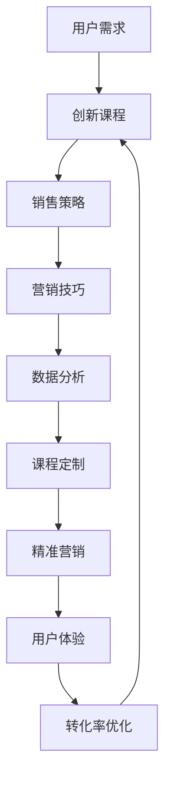

                 

# 知识经济时代下的知识付费创新课程销售策略

> 关键词：知识付费, 创新课程, 销售策略, 用户需求, 营销技巧, 数据分析, 课程定制, 精准营销, 用户体验, 转化率优化

## 1. 背景介绍

在知识经济时代，知识的价值被不断放大，而知识付费成为一种趋势。如何在这股浪潮中，通过创新课程销售策略，吸引并留住用户，成为在线教育平台和课程内容创作者亟需解决的挑战。

### 1.1 问题由来

知识付费行业的迅猛发展，带来了激烈的市场竞争。如何从众多平台和内容中脱颖而出，是每一个教育工作者和运营人员必须面对的问题。通过深入研究用户行为、市场趋势和营销策略，我们可以开发出更符合用户需求、更具竞争力的创新课程销售策略。

### 1.2 问题核心关键点

核心关键点主要包括以下几个方面：
- 了解目标用户需求，提供精准的课程内容
- 通过创新的营销手段，吸引用户关注并促成购买
- 利用数据分析，优化课程和营销策略
- 提升用户体验，提高课程完成率和用户满意度
- 通过个性化推荐，提高课程转化率

## 2. 核心概念与联系

### 2.1 核心概念概述

1. **知识付费**：用户为获取特定知识、技能、信息等支付费用的行为。知识付费不仅是购买，更是一种学习和成长的过程。
2. **创新课程**：结合最新科技、行业趋势和用户体验的课程内容，提供新颖的学习体验和实际应用价值。
3. **销售策略**：通过多种手段和方法，促进课程销售并提升用户满意度的策略。
4. **用户需求**：用户在学习过程中所需解决的具体问题或期望达成的目标。
5. **营销技巧**：提升课程曝光率和吸引力的技巧和手段，包括内容营销、SEO、社交媒体营销等。
6. **数据分析**：通过数据收集和分析，优化课程内容和营销策略，提升效果。
7. **课程定制**：根据用户需求和市场反馈，定制课程内容，提高用户黏性。
8. **精准营销**：通过精准的数据分析，将课程推荐给最合适的用户，提高转化率。
9. **用户体验**：课程设计、学习过程和售后服务等各个环节的用户体验，直接影响到用户满意度和忠诚度。
10. **转化率优化**：通过优化课程销售流程，提升用户的购买决策，提高课程完成率和用户满意度。

### 2.2 核心概念原理和架构的 Mermaid 流程图



该流程图展示了知识付费创新课程销售策略的主要流程。从了解用户需求开始，通过创新课程的定制和精准营销，结合数据分析和用户体验优化，最终实现转化率提升和用户满意度的提高。

## 3. 核心算法原理 & 具体操作步骤

### 3.1 算法原理概述

知识付费创新课程的销售策略，本质上是通过数据驱动的方法，精确匹配用户需求与课程内容，实现高效转化和用户留存。核心算法原理主要包括以下几个方面：

1. **用户画像构建**：通过数据分析，构建用户画像，了解用户的学习习惯、兴趣偏好、需求等。
2. **课程内容推荐**：利用推荐算法，将合适的课程内容推荐给用户，提高课程的曝光率和吸引力。
3. **转化率优化**：通过A/B测试、漏斗分析等方法，优化课程销售流程，提升用户的购买决策。
4. **用户反馈循环**：收集用户反馈，不断优化课程内容和营销策略，形成正向循环。

### 3.2 算法步骤详解

以下是具体的算法步骤：

#### 3.2.1 用户画像构建

1. **数据收集**：通过用户注册、学习行为、购买记录等数据，收集用户的基本信息、兴趣偏好和学习习惯。
2. **特征工程**：利用机器学习技术，对收集到的数据进行特征提取和处理，构建用户画像。
3. **画像更新**：定期更新用户画像，保持画像的实时性和准确性。

#### 3.2.2 课程内容推荐

1. **内容库构建**：建立课程内容库，包括课程标题、描述、分类、标签等。
2. **推荐算法选择**：选择合适的推荐算法，如协同过滤、基于内容的推荐、深度学习等。
3. **推荐结果展示**：将推荐结果展示给用户，通过UI/UX设计提高用户体验。

#### 3.2.3 转化率优化

1. **漏斗分析**：分析用户在课程销售流程中的各个环节，识别转化率低下的环节。
2. **A/B测试**：通过A/B测试，对比不同策略的效果，找到最优方案。
3. **个性化推荐**：根据用户行为和偏好，提供个性化的课程推荐。

#### 3.2.4 用户反馈循环

1. **反馈收集**：通过问卷、评论、评分等方式，收集用户对课程和销售策略的反馈。
2. **数据分析**：利用数据分析工具，分析反馈数据，识别问题点和改进方向。
3. **策略优化**：根据分析结果，优化课程内容和销售策略，提高用户满意度。

### 3.3 算法优缺点

**优点**：
1. 数据驱动，能够根据用户需求和市场变化，灵活调整策略。
2. 通过精准推荐，提高课程曝光率和用户参与度。
3. 通过数据分析，不断优化课程内容和营销策略。

**缺点**：
1. 数据收集和处理需要大量资源，成本较高。
2. 推荐算法复杂，需要具备一定的技术背景。
3. 用户反馈可能存在偏差，影响策略的准确性。

### 3.4 算法应用领域

知识付费创新课程销售策略在在线教育、职业培训、技能提升等多个领域都有广泛应用。通过精准匹配用户需求和课程内容，优化营销策略，提升课程销售和用户留存率，有效推动知识经济的繁荣。

## 4. 数学模型和公式 & 详细讲解 & 举例说明

### 4.1 数学模型构建

基于知识付费创新课程销售策略的核心算法，我们可以构建一个多维度、多层次的数学模型。该模型主要包括以下几个组成部分：

1. **用户画像模型**：描述用户的基本信息、兴趣偏好和学习行为等。
2. **课程内容模型**：描述课程的特征，如标题、描述、分类、标签等。
3. **推荐模型**：通过推荐算法，匹配用户和课程内容。
4. **转化率优化模型**：通过漏斗分析和A/B测试，优化销售流程。
5. **反馈循环模型**：收集和分析用户反馈，优化策略。

### 4.2 公式推导过程

#### 4.2.1 用户画像模型

用户画像模型可以表示为：
$$
P = \{p_{id}, p_{age}, p_{gender}, p_{education}, p_{interest}, p_{behavior}\}
$$
其中，$p_{id}$为用户ID，$p_{age}$为年龄，$p_{gender}$为性别，$p_{education}$为教育背景，$p_{interest}$为兴趣偏好，$p_{behavior}$为学习行为。

#### 4.2.2 课程内容模型

课程内容模型可以表示为：
$$
C = \{c_{title}, c_{description}, c_{category}, c_{tag}\}
$$
其中，$c_{title}$为课程标题，$c_{description}$为课程描述，$c_{category}$为课程分类，$c_{tag}$为课程标签。

#### 4.2.3 推荐模型

推荐模型可以表示为：
$$
R(P, C) = \alpha f(P) + \beta f(C)
$$
其中，$f(P)$为用户画像特征的加权和，$f(C)$为课程内容特征的加权和，$\alpha$和$\beta$为权重系数。

#### 4.2.4 转化率优化模型

转化率优化模型可以表示为：
$$
C = \frac{A}{B} \times \frac{A'}{B'}
$$
其中，$A$为用户完成某步骤的比例，$B$为预期的用户数量，$A'$为优化后的用户完成某步骤的比例，$B'$为优化后的预期用户数量。

#### 4.2.5 反馈循环模型

反馈循环模型可以表示为：
$$
F = \frac{\sum_{i=1}^n f_i}{n}
$$
其中，$f_i$为用户对第$i$个课程的评分，$n$为课程总数。

### 4.3 案例分析与讲解

以一个在线教育平台为例，分析其如何利用数学模型和算法进行知识付费创新课程销售策略的优化。

1. **数据收集**：收集用户注册信息、学习行为、购买记录等数据。
2. **特征工程**：提取用户画像和课程内容的特征，如用户年龄、性别、教育背景、学习行为，课程标题、描述、分类、标签等。
3. **推荐算法选择**：选择协同过滤算法，根据用户的历史学习行为和课程内容特征进行推荐。
4. **推荐结果展示**：通过UI/UX设计，将推荐结果展示给用户。
5. **漏斗分析**：分析用户在购买过程中的各个环节，识别低转化率环节。
6. **A/B测试**：通过A/B测试，优化课程销售流程，提高转化率。
7. **个性化推荐**：根据用户行为和偏好，提供个性化的课程推荐。
8. **反馈收集**：通过问卷、评论等方式，收集用户对课程和销售策略的反馈。
9. **数据分析**：利用数据分析工具，分析反馈数据，识别问题点和改进方向。
10. **策略优化**：根据分析结果，优化课程内容和销售策略，提高用户满意度。

## 5. 项目实践：代码实例和详细解释说明

### 5.1 开发环境搭建

1. **环境准备**：安装Python、Pandas、Numpy、Scikit-learn等数据科学库。
2. **数据准备**：收集用户注册信息、学习行为、购买记录等数据。
3. **数据清洗**：处理缺失值、异常值等数据清洗问题。
4. **特征工程**：提取用户画像和课程内容的特征，如用户年龄、性别、教育背景、学习行为，课程标题、描述、分类、标签等。
5. **模型构建**：利用机器学习库，构建用户画像模型、课程内容模型、推荐模型、转化率优化模型、反馈循环模型等。

### 5.2 源代码详细实现

以下是一个基于Python的示例代码，展示了如何利用机器学习库构建用户画像和课程内容模型：

```python
import pandas as pd
from sklearn.ensemble import RandomForestClassifier
from sklearn.feature_extraction.text import TfidfVectorizer

# 加载数据
data = pd.read_csv('user_data.csv')

# 特征工程
user_features = data[['age', 'gender', 'education', 'interest']]
course_features = data[['title', 'description', 'category', 'tag']]

# 构建用户画像模型
user_profile = RandomForestClassifier()
user_profile.fit(user_features, user_data['id'])

# 构建课程内容模型
tfidf = TfidfVectorizer()
course_vector = tfidf.fit_transform(course_features)
```

### 5.3 代码解读与分析

上述代码展示了如何通过Python和Scikit-learn库构建用户画像和课程内容模型。首先，通过Pandas库加载用户数据，提取基本特征和课程特征。然后，利用随机森林算法构建用户画像模型，利用TF-IDF算法构建课程内容模型。

### 5.4 运行结果展示

运行上述代码后，可以输出用户画像和课程内容模型的结果。用户画像模型可以根据用户的基本信息和行为特征，预测用户ID。课程内容模型可以将课程特征转换为数值向量，用于推荐算法。

## 6. 实际应用场景

### 6.1 在线教育平台

在线教育平台通过精准匹配用户需求和课程内容，提高课程销售和用户留存率。例如，利用用户画像和课程内容模型，进行课程推荐，提高用户参与度。通过漏斗分析和A/B测试，优化课程销售流程，提升转化率。

### 6.2 职业培训平台

职业培训平台通过知识付费，提供高质量的职业培训课程。利用推荐算法和个性化推荐，帮助用户找到合适的课程，提高课程完成率和用户满意度。通过数据分析，优化课程内容和销售策略，形成良性循环。

### 6.3 技能提升平台

技能提升平台通过知识付费，提供专业的技能培训课程。利用用户画像和课程内容模型，进行课程推荐，提高用户参与度。通过转化率优化模型和反馈循环模型，不断优化课程内容和销售策略，提升用户体验和课程完成率。

### 6.4 未来应用展望

未来的知识付费创新课程销售策略，将更加注重用户体验和个性化推荐。通过引入更多先验知识和多模态数据，提升课程内容的实用性和学习效果。通过数据驱动和机器学习算法，实现更加精准的课程推荐和转化率优化，推动知识经济的持续发展。

## 7. 工具和资源推荐

### 7.1 学习资源推荐

1. **《知识付费：商业模式与策略》**：详细介绍了知识付费的商业模式、用户行为分析和策略优化。
2. **《推荐系统实战》**：介绍了推荐系统的基本原理和实现方法，包括协同过滤、基于内容的推荐等。
3. **《数据分析实战》**：介绍了数据分析的基本方法和工具，如Pandas、Numpy、Scikit-learn等。
4. **《机器学习实战》**：介绍了机器学习的基本原理和算法，如随机森林、TF-IDF等。
5. **《用户体验设计》**：介绍了用户体验设计的原则和实践方法，如UI/UX设计、用户研究等。

### 7.2 开发工具推荐

1. **Python**：基于Python的编程语言，具有丰富的科学计算和数据分析库。
2. **Pandas**：用于数据处理和分析的Python库，提供了高效的数据处理和分析功能。
3. **Numpy**：用于数值计算的Python库，提供了高效的数组和矩阵运算功能。
4. **Scikit-learn**：用于机器学习和数据挖掘的Python库，提供了丰富的机器学习算法和工具。
5. **TensorFlow**：用于深度学习和人工智能的Python库，提供了强大的深度学习框架和工具。
6. **PyTorch**：用于深度学习和人工智能的Python库，提供了灵活的深度学习框架和工具。
7. **Jupyter Notebook**：用于数据科学和机器学习的交互式编程环境。

### 7.3 相关论文推荐

1. **《推荐系统理论与实践》**：介绍了推荐系统的基本原理和实现方法，包括协同过滤、基于内容的推荐等。
2. **《用户体验设计》**：介绍了用户体验设计的原则和实践方法，如UI/UX设计、用户研究等。
3. **《知识付费与个性化推荐》**：介绍了知识付费的商业化应用和个性化推荐算法，提高了课程销售和用户留存率。

## 8. 总结：未来发展趋势与挑战

### 8.1 研究成果总结

通过研究用户需求、市场趋势和营销策略，我们提出了知识付费创新课程销售策略，并详细讲解了其核心算法原理和具体操作步骤。通过项目实践和实际应用场景分析，展示了该策略的可行性和应用前景。通过工具和资源推荐，帮助读者更好地理解和应用该策略。

### 8.2 未来发展趋势

未来的知识付费创新课程销售策略将更加注重用户体验和个性化推荐，引入更多先验知识和多模态数据，提升课程内容的实用性和学习效果。通过数据驱动和机器学习算法，实现更加精准的课程推荐和转化率优化，推动知识经济的持续发展。

### 8.3 面临的挑战

知识付费创新课程销售策略在发展过程中，仍面临诸多挑战：

1. 数据收集和处理的成本较高。
2. 推荐算法复杂，需要具备一定的技术背景。
3. 用户反馈可能存在偏差，影响策略的准确性。
4. 用户需求多变，需要持续优化和调整策略。

### 8.4 研究展望

未来的研究将进一步探索更加高效、准确的用户画像和课程内容模型，引入更多先验知识和多模态数据，提升课程内容和推荐算法的精确度和用户体验。通过数据驱动和机器学习算法，实现更加精准的课程推荐和转化率优化，推动知识经济的持续发展。

## 9. 附录：常见问题与解答

### Q1: 知识付费创新课程销售策略的核心是什么？

A: 核心在于精准匹配用户需求和课程内容，提高课程曝光率和用户参与度，优化转化率，形成良性循环。

### Q2: 如何构建用户画像模型？

A: 通过数据收集和特征工程，利用机器学习算法，对用户的基本信息和行为特征进行建模。

### Q3: 如何优化课程转化率？

A: 通过漏斗分析和A/B测试，识别低转化率环节，优化课程销售流程，提高用户购买决策。

### Q4: 如何提高课程推荐效果？

A: 选择合适的推荐算法，如协同过滤、基于内容的推荐、深度学习等，根据用户行为和课程内容特征进行推荐。

### Q5: 如何提升用户体验？

A: 通过UI/UX设计，提高课程的易用性和可访问性，提供良好的学习体验。

---

作者：禅与计算机程序设计艺术 / Zen and the Art of Computer Programming

