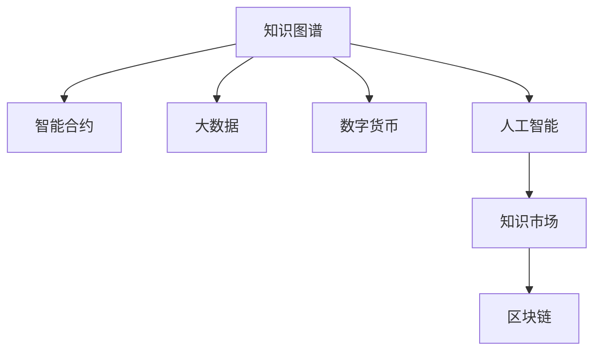

                 

# 知识经济时代的致富之道：知识变现

> 关键词：知识变现,人工智能,区块链,智能合约,大数据,数字货币

## 1. 背景介绍

### 1.1 问题由来

随着科技的迅猛发展，互联网的普及，以及大数据、云计算、人工智能等新兴技术的兴起，人类社会正在迈入知识经济时代。这一时代，知识、信息、数据等无形资产的重要性愈发凸显，成为经济增长的重要驱动力。知识经济的核心在于将知识、技术、创意等无形资源转化为财富，驱动创新、促进增长。

然而，知识的变现一直是一个复杂且充满挑战的问题。传统知识的获取和应用往往需要花费大量时间和精力，且无法充分发挥其潜在价值。特别是随着知识产生速度的加快，如何高效、智能地识别、利用和管理知识，成为亟待解决的关键问题。

### 1.2 问题核心关键点

知识变现的核心在于：
1. **知识获取**：通过高效便捷的手段，快速获取高质量的知识资源。
2. **知识评估**：准确评估知识的价值，确定其变现潜力。
3. **知识应用**：将知识有效应用于商业决策、产品开发、市场推广等实际场景，实现价值最大化。
4. **知识分配**：在知识所有者、使用者、投资者之间进行公平合理的分配和激励。

在知识经济时代，以上四个方面共同构成了知识变现的基石。因此，本文将围绕这四个关键点，探讨如何利用先进技术手段，实现知识的高效变现。

## 2. 核心概念与联系

### 2.1 核心概念概述

为更好地理解知识变现的核心技术和方法，本节将介绍几个密切相关的核心概念：

- **知识图谱(Knowledge Graph)**：一种以图的形式表示实体与关系的数据模型，用于描述和组织各类知识，支持语义搜索和推理。
- **智能合约(Smart Contract)**：基于区块链技术的自动执行合约，通过代码实现商业逻辑，具有去中心化、透明度高、不可篡改等特点。
- **大数据(Big Data)**：指海量的、多样化的数据集，能够通过数据挖掘和分析获取深刻洞见，支持智能决策和预测。
- **数字货币(Digital Currency)**：一种基于区块链技术的电子货币形式，支持快速、安全的交易和资金流转。
- **人工智能(AI)**：通过算法和模型实现模拟人类智能的技术，包括机器学习、深度学习、自然语言处理等。
- **知识市场(Knowledge Market)**：通过智能合约和大数据，将知识资产化，支持知识的买卖和交换，实现知识变现。
- **区块链(Blockchain)**：一种去中心化的分布式账本技术，通过加密和时间戳确保数据的安全和不可篡改。

这些核心概念之间的逻辑关系可以通过以下Mermaid流程图来展示：



这个流程图展示了几类关键技术之间的内在联系：

1. **知识图谱**：为人工智能提供知识基础，支持智能决策和推理。
2. **智能合约**：基于区块链技术，提供自动执行的合约机制，支持知识变现和分配。
3. **大数据**：提供海量数据支持，通过数据挖掘和分析获取知识洞见。
4. **数字货币**：为知识交易提供高效、安全的交易方式，支持快速变现。
5. **人工智能**：利用算法和模型，实现知识的智能化处理和应用。
6. **知识市场**：将知识转化为资产，支持知识的市场化流转。
7. **区块链**：提供去中心化的交易和存储方式，确保数据的安全和透明。

这些概念共同构成了知识变现的技术框架，为其高效实现提供了坚实的基础。

## 3. 核心算法原理 & 具体操作步骤
### 3.1 算法原理概述

知识变现的整个过程可以分解为以下几个关键步骤：

1. **知识获取**：通过爬虫、API调用等方式，从互联网、数据库等渠道获取高质量的知识资源。
2. **知识评估**：利用人工智能算法对知识资源进行价值评估，确定其变现潜力。
3. **知识应用**：将知识应用于商业决策、产品开发、市场推广等实际场景，实现价值最大化。
4. **知识分配**：通过智能合约和大数据，公平合理地将知识变现的收益分配给知识所有者、使用者和投资者。

整个知识变现过程是一个复杂的系统工程，涉及多个环节和多种技术手段。本节将详细介绍每个步骤的算法原理和具体操作步骤。

### 3.2 算法步骤详解

**Step 1: 知识获取**

知识获取是知识变现的第一步，也是关键一步。为提高获取效率和质量，通常采用以下方法：

- **网络爬虫**：利用Python等编程语言编写爬虫脚本，从各类网站上抓取结构化或非结构化数据，包括文本、图片、视频等。例如，利用BeautifulSoup、Scrapy等库进行网页抓取。
- **API调用**：利用各大平台提供的API接口，直接获取数据。例如，从OpenAI的API获取文本翻译结果，从Google Maps API获取地理位置信息。
- **数据库查询**：利用数据库管理系统，从结构化数据中提取信息。例如，从MySQL、Oracle等数据库中查询产品销售记录。

获取到的知识资源需要进行清洗和处理，确保数据质量和一致性。常用的数据处理技术包括：

- **数据清洗**：去除重复、缺失、异常数据，确保数据完整性和一致性。例如，使用Pandas库对数据进行清洗和整理。
- **数据标注**：对数据进行标注和分类，便于后续的机器学习应用。例如，使用LabelMe等工具进行图像标注。
- **数据增强**：通过数据扩充和增强技术，提升数据多样性和丰富性。例如，对文本数据进行近义替换、同义词扩展，对图像数据进行旋转、缩放等变换。

**Step 2: 知识评估**

知识评估是决定知识变现价值的关键步骤。常用的评估方法包括：

- **文本分析**：利用自然语言处理技术，对文本内容进行情感分析、主题分类、实体抽取等。例如，使用LDA算法进行主题建模，使用BERT模型进行文本分类。
- **图像识别**：利用计算机视觉技术，对图像内容进行特征提取和分类。例如，使用CNN模型进行图像分类，使用YOLO模型进行目标检测。
- **视频分析**：利用视频处理技术，对视频内容进行行为分析、情感识别等。例如，使用Faster R-CNN模型进行视频对象跟踪，使用3D-CNN模型进行动作识别。

通过以上方法，可以从不同角度对知识资源进行全面评估，确定其变现潜力。

**Step 3: 知识应用**

知识应用是将知识转化为实际价值的重要步骤。常用的应用场景包括：

- **商业决策**：利用知识辅助企业决策，提升决策效率和质量。例如，利用知识图谱进行供应链优化，利用智能合约进行合同执行监控。
- **产品开发**：利用知识驱动产品创新，提升产品竞争力和市场占有率。例如，利用知识图谱进行产品推荐，利用自然语言处理技术进行市场调研。
- **市场推广**：利用知识优化营销策略，提升品牌知名度和用户满意度。例如，利用文本分析进行舆情监控，利用图像识别进行视觉营销。

**Step 4: 知识分配**

知识分配是确保知识变现公平合理的重要环节。常用的分配方法包括：

- **智能合约**：通过区块链技术，实现自动执行的合约机制，确保分配的透明和公正。例如，利用Solidity编写智能合约，实现知识交易和收益分配。
- **大数据分析**：通过大数据技术，分析知识变现的收益来源和分配方式，确保分配的合理性和可持续性。例如，利用Hadoop、Spark等技术进行大数据分析，优化分配策略。

### 3.3 算法优缺点

知识变现的整个过程涉及多种技术手段，具有以下优点：

- **高效便捷**：通过网络爬虫、API调用等手段，可以快速获取高质量的知识资源，大大缩短获取时间。
- **精准评估**：利用人工智能算法，对知识资源进行全面评估，准确确定其变现潜力。
- **智能应用**：将知识应用于商业决策、产品开发、市场推广等实际场景，实现知识的最大化利用。
- **透明公平**：通过智能合约和大数据分析，公平合理地进行知识变现的收益分配，确保分配的透明和公正。

然而，知识变现也存在一些局限性：

- **数据质量依赖**：知识变现的效果高度依赖于获取的知识资源的准确性和完整性。如果获取的数据质量不高，将直接影响变现效果。
- **技术门槛较高**：知识变现涉及多个技术环节，对技术要求较高，需要团队具备较强的技术实力。
- **市场接受度不确定**：知识变现需要符合市场的需求和趋势，如果知识市场接受度不高，将难以实现变现。
- **风险和挑战**：知识变现面临数据泄露、版权纠纷等风险，需要进行充分的法律和风险管理。

尽管存在这些局限性，但就目前而言，知识变现的技术手段仍然是最为高效和前沿的解决方案，为知识变现提供了有力的技术支撑。

### 3.4 算法应用领域

知识变现技术已经在多个领域得到了广泛应用，例如：

- **金融**：通过知识图谱和智能合约，实现知识驱动的金融决策和智能投顾。例如，利用知识图谱进行金融风险评估，利用智能合约进行交易执行和资金监管。
- **医疗**：通过知识图谱和自然语言处理技术，提升医疗决策和治疗方案的精准性。例如，利用知识图谱进行疾病诊断和治疗方案推荐，利用自然语言处理技术进行病历分析和医疗记录整理。
- **教育**：通过知识图谱和智能推荐系统，提供个性化的教育内容和推荐服务。例如，利用知识图谱进行学科知识图谱构建，利用智能推荐系统进行学习路径推荐和智能辅导。
- **法律**：通过知识图谱和自然语言处理技术，提升法律咨询和文档处理效率。例如，利用知识图谱进行法律知识图谱构建，利用自然语言处理技术进行法律文本分类和合同生成。
- **媒体**：通过知识图谱和自然语言处理技术，提升新闻报道和内容推荐的质量和精准性。例如，利用知识图谱进行新闻事件关联分析，利用自然语言处理技术进行内容推荐和舆情监控。

除了上述这些经典应用外，知识变现技术还在更多领域中得到创新性的应用，如智能制造、智慧农业、环境保护等，为各行各业带来了新的突破和机遇。

## 4. 数学模型和公式 & 详细讲解  
### 4.1 数学模型构建

本节将使用数学语言对知识变现的整个过程进行更加严格的刻画。

假设知识资源的总数为 $N$，知识资源的评估价值为 $V_i$，市场对知识资源的需求为 $D$，知识资源的市场价格为 $P$。则知识变现的目标是最大化总收益 $R$，即：

$$
R = \sum_{i=1}^N P_iV_i
$$

其中 $P_i$ 为第 $i$ 个知识资源的市场价格。在知识分配阶段，需要考虑知识所有者、使用者和投资者的收益分配问题。假设知识所有者的收益为 $R_A$，使用者的收益为 $R_U$，投资者的收益为 $R_I$，则总收益分配公式为：

$$
R = R_A + R_U + R_I
$$

### 4.2 公式推导过程

知识变现的数学模型涉及多个变量和函数，以下以二元随机变量为例进行推导。

设知识资源的评估价值 $V$ 服从正态分布 $V \sim \mathcal{N}(\mu, \sigma^2)$，市场对知识资源的需求 $D$ 服从二项分布 $D \sim \text{Binomial}(n, p)$。则知识资源的市场价格 $P$ 可以表示为：

$$
P = \begin{cases}
0, & \text{if } D = 0 \\
\frac{V}{n}, & \text{if } D > 0
\end{cases}
$$

根据上述模型，总收益 $R$ 可以表示为：

$$
R = \mathbb{E}[P]V = \left(\mathbb{E}[D] + \frac{\sigma^2}{n}\right)V = \left(p + \frac{\sigma^2}{n}\right)V
$$

其中 $\mathbb{E}[D]$ 为市场对知识资源需求的期望值。在知识分配阶段，假设知识所有者、使用者和投资者的收益分配比例为 $a, u, i$，则总收益分配公式为：

$$
R = aR_A + uR_U + iR_I
$$

通过上述推导，可以更深刻地理解知识变现的数学模型和求解方法，为实际应用提供理论支持。

## 5. 项目实践：代码实例和详细解释说明
### 5.1 开发环境搭建

在进行知识变现实践前，我们需要准备好开发环境。以下是使用Python进行开发的环境配置流程：

1. 安装Anaconda：从官网下载并安装Anaconda，用于创建独立的Python环境。

2. 创建并激活虚拟环境：
```bash
conda create -n knowledge_market python=3.8 
conda activate knowledge_market
```

3. 安装相关库：
```bash
pip install pandas numpy scikit-learn transformers matplotlib 
```

完成上述步骤后，即可在`knowledge_market`环境中开始知识变现实践。

### 5.2 源代码详细实现

这里以知识图谱构建为例，给出使用知识图谱构建的Python代码实现。

首先，定义知识图谱的节点和关系：

```python
from pykg import KG

kg = KG()

# 定义节点
node = kg.add_node("节点")
kg.add_node("关系")
kg.add_node("属性")

# 定义关系
kg.add_rel("R1", node, node)
kg.add_rel("R2", node, node)
kg.add_rel("R3", node, node)

# 定义属性
kg.add_prop("P1", node, "属性")
kg.add_prop("P2", node, "属性")
kg.add_prop("P3", node, "属性")
```

然后，定义知识图谱的查询和推理：

```python
from pykg import SPARQL

# 定义查询
query = """
    SELECT ?n ?r ?p WHERE {
        ?n a ?r .
        ?r a ?p .
    }
"""
result = SPARQL(kg).query(query)
for row in result:
    print(row)

# 定义推理
triple = kg.get_triple(node, "R1", "属性")
print(triple)
```

最后，启动知识图谱的构建和查询流程：

```python
# 构建知识图谱
kg.build()

# 查询知识图谱
kg.query(query)
```

以上就是使用PyKG构建知识图谱的完整代码实现。可以看到，PyKG提供了丰富的接口和工具，使得知识图谱的构建和查询变得简单易行。

### 5.3 代码解读与分析

让我们再详细解读一下关键代码的实现细节：

**定义节点和关系**：
- `add_node`方法：用于添加节点，参数为节点的名称。
- `add_rel`方法：用于添加关系，参数为关系名称和节点名称。
- `add_prop`方法：用于添加属性，参数为属性名称、节点名称和属性值。

**定义查询**：
- `SPARQL`类：用于执行SPARQL查询。
- `query`方法：用于构建和执行查询，参数为查询语句。

**构建和查询知识图谱**：
- `build`方法：用于构建知识图谱。
- `get_triple`方法：用于获取节点、关系和属性的三元组。

可以看到，PyKG提供了丰富的API接口和示例代码，帮助开发者快速上手构建知识图谱，并进行查询和推理。

当然，知识变现的实际应用场景远不止于此，开发者需要根据具体需求进行灵活设计和实现。例如，可以在知识图谱的基础上，结合智能合约、大数据、数字货币等技术，实现更复杂、更全面的知识变现方案。

## 6. 实际应用场景
### 6.1 金融投资

知识变现技术在金融投资领域具有重要应用价值。通过构建金融知识图谱，可以实现对金融数据的全面整合和分析，辅助投资决策。

具体而言，可以收集金融市场的历史数据、公司财报、新闻报道等，构建金融知识图谱，实现对金融事件、财务指标、市场动态等信息的全面分析。利用智能合约和大数据分析，可以实现对金融产品的智能投顾和风险评估。例如，利用知识图谱进行市场趋势分析，利用智能合约进行交易执行和资金监管。

### 6.2 医疗诊断

在医疗诊断领域，知识变现技术同样具有广阔的应用前景。通过构建医疗知识图谱，可以实现对医学知识的全面整合和分析，辅助临床决策。

具体而言，可以收集医学文献、临床指南、医疗记录等，构建医疗知识图谱，实现对疾病诊断、治疗方案、药物配伍等信息的全面分析。利用智能合约和大数据分析，可以实现对医疗设备的智能监控和患者数据的隐私保护。例如，利用知识图谱进行疾病诊断和治疗方案推荐，利用智能合约进行医疗设备监控和资金监管。

### 6.3 教育培训

在教育培训领域，知识变现技术同样具有重要的应用价值。通过构建教育知识图谱，可以实现对教育资源的全面整合和分析，提升教育质量。

具体而言，可以收集教育文献、课程资源、学生评价等，构建教育知识图谱，实现对课程设计、教学方法、学生学习路径等信息的全面分析。利用智能推荐系统和大数据分析，可以实现对教育资源的智能推荐和个性化学习路径的制定。例如，利用知识图谱进行学科知识图谱构建，利用智能推荐系统进行学习路径推荐和智能辅导。

### 6.4 未来应用展望

随着知识图谱、智能合约、大数据、数字货币等技术的不断进步，知识变现的应用场景将不断扩展，为各行各业带来新的机遇和挑战。

在智慧城市治理中，知识变现技术将广泛应用于城市事件监测、舆情分析、应急指挥等环节，提高城市管理的自动化和智能化水平，构建更安全、高效的未来城市。

在智能制造领域，知识变现技术将广泛应用于产品设计、工艺优化、供应链管理等环节，提升制造业的智能化水平，实现制造业的数字化转型。

在环境保护领域，知识变现技术将广泛应用于环境监测、污染控制、生态修复等环节，提升环保工作的智能化水平，实现绿色可持续发展。

此外，在智慧农业、智能物流、智能交通等领域，知识变现技术也将不断拓展其应用边界，为各行各业带来新的突破和机遇。相信随着技术的不断进步和应用的不断深入，知识变现将在更多领域得到广泛应用，推动知识经济时代的到来。

## 7. 工具和资源推荐
### 7.1 学习资源推荐

为了帮助开发者系统掌握知识变现的理论基础和实践技巧，这里推荐一些优质的学习资源：

1. **《Python数据科学手册》**：全面介绍Python在数据科学和知识变现中的应用，涵盖网络爬虫、数据清洗、机器学习等关键技术。

2. **《人工智能基础》课程**：清华大学开设的AI基础课程，全面介绍人工智能的基本概念和技术，涵盖自然语言处理、机器学习、深度学习等关键技术。

3. **《知识图谱构建与应用》书籍**：全面介绍知识图谱的构建、应用和评估，涵盖知识图谱建模、查询、推理等关键技术。

4. **PyKG官方文档**：PyKG的官方文档，提供了丰富的API接口和示例代码，帮助开发者快速上手知识图谱构建和查询。

5. **Semantic Web Standards**：W3C发布的语义网标准，涵盖RDF、SPARQL等关键技术，为知识图谱构建和查询提供标准支持。

通过对这些资源的学习实践，相信你一定能够快速掌握知识变现的精髓，并用于解决实际的行业问题。

### 7.2 开发工具推荐

高效的开发离不开优秀的工具支持。以下是几款用于知识变现开发的常用工具：

1. **PyKG**：构建和管理知识图谱的工具，支持Python语言，提供丰富的API接口和示例代码。

2. **Semantic Scholar**：提供知识图谱构建和查询的工具，支持自然语言查询和可视化展示。

3. **RDF Explorer**：提供知识图谱可视化的工具，支持RDF数据的展示和分析。

4. **PyTorch**：基于Python的深度学习框架，支持自动微分和动态计算图，适合进行复杂的数据分析和模型训练。

5. **TensorFlow**：由Google主导开发的深度学习框架，支持分布式计算和模型部署，适合进行大规模的计算和推理。

6. **Solana**：基于区块链技术的智能合约平台，支持快速、安全的交易和资金流转，适合进行去中心化的知识变现应用。

合理利用这些工具，可以显著提升知识变现任务的开发效率，加快创新迭代的步伐。

### 7.3 相关论文推荐

知识变现技术的发展源于学界的持续研究。以下是几篇奠基性的相关论文，推荐阅读：

1. **《知识图谱：下一代互联网知识表示与检索技术》**：全面介绍知识图谱的基本概念和构建方法，涵盖RDF、Ontology等关键技术。

2. **《智能合约：区块链的智能合约和去中心化应用》**：介绍智能合约的基本概念和应用，涵盖Solidity、Ethereum等关键技术。

3. **《大数据知识发现与数据挖掘：理论与技术》**：全面介绍大数据的基本概念和分析方法，涵盖Hadoop、Spark等关键技术。

4. **《数字货币：原理、技术与应用》**：全面介绍数字货币的基本概念和应用，涵盖比特币、区块链等关键技术。

5. **《人工智能：一种现代的方法》**：全面介绍人工智能的基本概念和算法，涵盖机器学习、深度学习等关键技术。

这些论文代表了大数据、人工智能、区块链等领域的最新研究成果，为知识变现技术的发展提供了理论基础和实践指南。

## 8. 总结：未来发展趋势与挑战
### 8.1 总结

本文对知识变现技术进行了全面系统的介绍。首先阐述了知识变现的核心理念和技术框架，明确了知识变现在知识经济时代的核心地位。其次，从原理到实践，详细讲解了知识获取、知识评估、知识应用、知识分配等关键步骤，给出了知识变现任务开发的完整代码实例。同时，本文还广泛探讨了知识变现技术在金融、医疗、教育等多个领域的应用前景，展示了知识变现技术的广阔应用空间。此外，本文精选了知识变现技术的各类学习资源，力求为读者提供全方位的技术指引。

通过本文的系统梳理，可以看到，知识变现技术正在成为知识经济时代的重要技术范式，极大地拓展了知识的应用边界，催生了更多的落地场景。受益于知识图谱、智能合约、大数据、数字货币等技术的不断进步，知识变现将为各行各业带来新的突破和机遇，推动知识经济时代的到来。

### 8.2 未来发展趋势

展望未来，知识变现技术将呈现以下几个发展趋势：

1. **技术融合创新**：知识变现技术将与其他先进技术进行深度融合，实现技术突破和创新。例如，结合大数据、人工智能、区块链等技术，实现知识的高效获取、评估、应用和分配。

2. **应用场景拓展**：知识变现技术将拓展到更多领域，为各行各业带来新的突破和机遇。例如，应用于智慧城市治理、智能制造、智慧农业等新兴领域。

3. **用户需求定制**：知识变现技术将更加注重用户需求定制，提供更加个性化、定制化的知识服务。例如，根据用户兴趣和需求，进行知识推荐和个性化学习路径制定。

4. **智能决策支持**：知识变现技术将更加注重智能决策支持，提高决策效率和质量。例如，利用知识图谱进行事件关联分析，利用智能合约进行合同执行监控。

5. **伦理和安全保障**：知识变现技术将更加注重伦理和安全保障，确保知识变现的透明、公正和安全。例如，引入伦理导向的评估指标，加强数据和模型安全管理。

### 8.3 面临的挑战

尽管知识变现技术已经取得了瞩目成就，但在迈向更加智能化、普适化应用的过程中，它仍面临诸多挑战：

1. **数据质量瓶颈**：知识变现的效果高度依赖于获取的数据质量和完整性。如何获取高质量的知识资源，是知识变现技术面临的重要挑战。

2. **技术门槛较高**：知识变现涉及多个技术环节，对技术要求较高，需要团队具备较强的技术实力。如何降低技术门槛，提高技术可操作性，是知识变现技术面临的挑战。

3. **市场接受度不确定**：知识变现需要符合市场的需求和趋势，如果知识市场接受度不高，将难以实现变现。如何准确把握市场需求，推动知识变现技术的广泛应用，是知识变现技术面临的挑战。

4. **伦理和法律问题**：知识变现技术可能面临数据泄露、版权纠纷等伦理和法律问题。如何保障数据安全，避免侵权和纠纷，是知识变现技术面临的挑战。

尽管存在这些挑战，但通过学界和产业界的共同努力，相信知识变现技术能够克服种种障碍，实现其应用价值的最大化。

### 8.4 研究展望

面对知识变现技术所面临的挑战，未来的研究需要在以下几个方面寻求新的突破：

1. **数据质量提升**：通过爬虫优化、数据清洗、标注等技术手段，提升知识资源的获取质量和完整性。

2. **技术门槛降低**：开发更加易用的开发工具和框架，降低技术门槛，提高知识变现技术的可操作性。

3. **市场接受度提升**：通过用户需求分析、市场调研等手段，准确把握市场需求，推动知识变现技术的广泛应用。

4. **伦理和法律保障**：引入伦理导向的评估指标，加强数据和模型安全管理，确保知识变现的透明、公正和安全。

这些研究方向的探索，必将引领知识变现技术迈向更高的台阶，为知识经济时代的到来贡献力量。面向未来，知识变现技术还需要与其他人工智能技术进行更深入的融合，如知识表示、因果推理、强化学习等，多路径协同发力，共同推动知识经济的发展。只有勇于创新、敢于突破，才能不断拓展知识变现技术的边界，让知识变现技术更好地造福人类社会。

## 9. 附录：常见问题与解答

**Q1：知识变现是否适用于所有知识领域？**

A: 知识变现技术适用于大多数知识领域，特别是数据量较大、知识密度高的领域，如金融、医疗、教育等。对于一些知识密度较低的领域，如手工艺、艺术创作等，可能需要更多的经验积累和人工审核。

**Q2：知识变现的核心在于什么？**

A: 知识变现的核心在于知识的获取、评估、应用和分配。具体而言，获取高质量的知识资源是知识变现的前提，准确评估知识的价值是知识变现的基础，合理应用知识资源是知识变现的核心，公平分配知识收益是知识变现的目标。

**Q3：知识变现的优势在哪里？**

A: 知识变现的优势在于其高效、智能、透明的特点。通过网络爬虫、API调用等手段，可以快速获取高质量的知识资源。通过人工智能算法，对知识资源进行全面评估，准确确定其变现潜力。通过智能合约和大数据分析，公平合理地进行知识收益的分配。

**Q4：知识变现的技术难点在哪里？**

A: 知识变现的技术难点在于数据的获取、清洗、标注和评估。如何获取高质量的知识资源，如何准确评估知识的价值，是知识变现技术的难点。此外，如何将知识有效地应用于实际场景，进行公平合理的收益分配，也是知识变现技术的挑战。

**Q5：知识变现的应用前景如何？**

A: 知识变现的应用前景广阔，将在金融、医疗、教育、智慧城市等多个领域得到广泛应用。通过知识变现技术，可以实现对知识的全面整合和分析，提升决策效率和质量，推动各行业的数字化转型和智能化升级。

通过本文的系统梳理，可以看到，知识变现技术正在成为知识经济时代的重要技术范式，极大地拓展了知识的应用边界，催生了更多的落地场景。受益于知识图谱、智能合约、大数据、数字货币等技术的不断进步，知识变现将为各行各业带来新的突破和机遇，推动知识经济时代的到来。

---

作者：禅与计算机程序设计艺术 / Zen and the Art of Computer Programming

