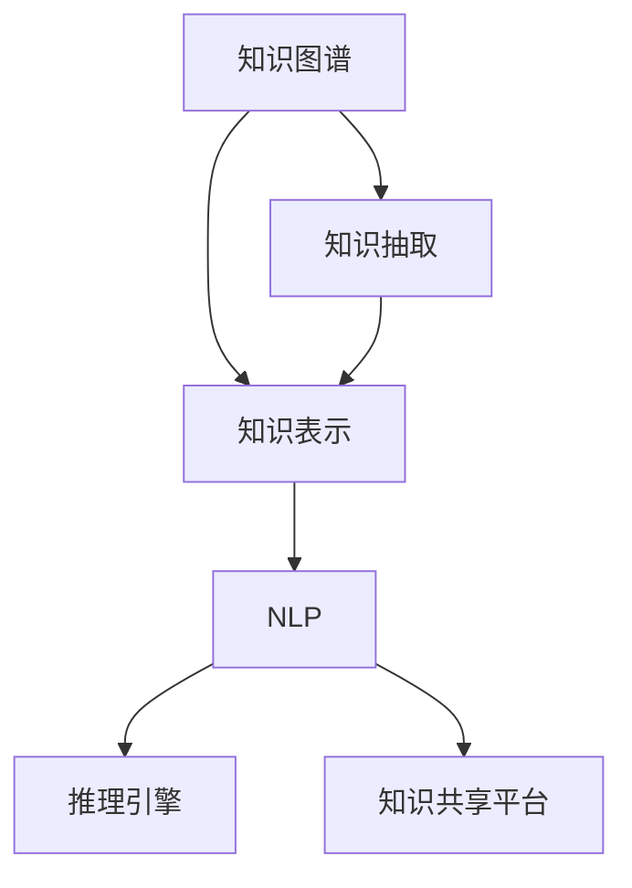

                 

# 知识资产要发掘和培育长期价值

## 1. 背景介绍

### 1.1 问题由来

在当今信息爆炸的时代，知识的积累和利用成为了企业竞争的关键。企业知识资产不仅包括专利、论文、技术文档等显性知识，还涵盖了员工的日常工作经验和隐性技能等隐性知识。如何将这些知识资产有效地挖掘、整理和利用，使其成为企业持续创新和竞争力的源泉，成为每个企业都必须面对的挑战。

### 1.2 问题核心关键点

知识资产的挖掘和培育是一个涉及多学科交叉的复杂问题，其核心关键点包括：

- 如何高效识别和分类知识资产？
- 如何自动化构建知识图谱，提炼知识之间的关联关系？
- 如何在知识图谱上构建推理和发现路径，支持高效的知识查询和利用？
- 如何将知识资产与业务流程紧密结合，提升企业的整体运营效率？
- 如何构建知识共享和协作平台，促进知识的传播和利用？

这些关键点涉及到自然语言处理、知识图谱构建、推理引擎等多个技术领域，需要通过跨学科的合作和创新才能得以解决。

### 1.3 问题研究意义

知识资产的挖掘和培育对于企业的发展具有深远的意义：

1. **提升创新能力**：通过整合企业内部的知识资产，可以快速发现新的技术趋势和应用场景，推动产品创新和市场拓展。
2. **优化运营效率**：知识资产的有效利用可以大幅提升业务流程的自动化程度，减少人为错误，提高决策效率。
3. **增强竞争力**：知识资产的积累和应用可以提升企业的品牌影响力和市场竞争力，促进可持续发展。
4. **促进人才发展**：知识共享和协作平台可以激发员工的创造力，提升个人能力和职业发展。

## 2. 核心概念与联系

### 2.1 核心概念概述

为更好地理解知识资产的挖掘和培育，本节将介绍几个密切相关的核心概念：

- **知识图谱(Knowledge Graph)**：通过语义化的方式表示实体和实体之间的关系，用于知识检索、推理、可视化等应用。
- **知识抽取(Knowledge Extraction)**：从文本、数据等来源中自动抽取结构化的知识，包括实体、属性和关系。
- **知识表示(Knowledge Representation)**：将知识以结构化的形式进行编码，便于计算机处理和推理。
- **自然语言处理(Natural Language Processing, NLP)**：通过自动化处理自然语言，支持知识抽取和语义理解。
- **推理引擎(Rule-based Inference Engine)**：利用知识图谱和规则库进行逻辑推理和决策支持。
- **知识共享平台(Knowledge Sharing Platform)**：构建知识管理工具，支持知识的存储、检索、共享和协作。

这些核心概念之间的逻辑关系可以通过以下Mermaid流程图来展示：



这个流程图展示的知识资产挖掘和培育的核心概念及其之间的关系：

1. 知识图谱通过抽取和表示知识，形成结构化的知识库。
2. NLP技术用于知识抽取，支持从非结构化文本中挖掘出结构化知识。
3. 知识表示将抽取出的知识编码成结构化的形式，便于计算机处理。
4. 推理引擎基于知识图谱和规则库，进行逻辑推理和决策支持。
5. 知识共享平台用于知识的存储、检索、共享和协作，促进知识的高效利用。

这些概念共同构成了知识资产挖掘和培育的框架，为其在企业中的应用提供了技术支撑。

## 3. 核心算法原理 & 具体操作步骤
### 3.1 算法原理概述

知识资产的挖掘和培育过程涉及多个技术领域的融合。其核心思想是通过自然语言处理技术，从非结构化的文本和数据中抽取结构化的知识，构建知识图谱，并利用推理引擎进行高效的知识推理和应用。

具体而言，知识图谱的构建通常包括以下步骤：

1. **实体抽取**：识别文本中的命名实体，如人名、地名、组织机构等。
2. **关系抽取**：提取实体之间的关系，如父子关系、所属关系等。
3. **属性抽取**：抽取实体的属性信息，如地理位置、创建时间等。
4. **融合上下文**：结合上下文信息，对抽取的知识进行修正和补充。
5. **存储与索引**：将抽取的知识以结构化的方式存储，构建知识索引。

知识图谱构建完成后，利用推理引擎，可以根据用户查询和业务规则，进行逻辑推理和决策支持，如推荐系统、智能客服、业务流程自动化等。

### 3.2 算法步骤详解

知识资产的挖掘和培育涉及多个步骤，以下将详细介绍主要步骤：

**Step 1: 数据收集与预处理**
- 收集企业内部和外部的各种数据源，包括文档、邮件、网页、数据库等。
- 清洗和预处理数据，去除噪声和重复信息，确保数据质量。

**Step 2: 知识抽取**
- 使用自然语言处理技术，识别和抽取文本中的实体、关系和属性。
- 根据不同数据源的特点，选择适合的抽取算法，如规则抽取、深度学习抽取等。

**Step 3: 知识表示**
- 将抽取的知识转化为结构化的形式，如实体-关系-属性三元组。
- 选择合适的知识表示模型，如RDF、OWL等，构建知识图谱。

**Step 4: 知识图谱构建**
- 使用知识图谱构建工具，如Neo4j、RDF4J等，存储和索引知识图谱。
- 设计合理的知识图谱结构，支持高效的知识推理和应用。

**Step 5: 推理引擎构建**
- 选择合适的推理引擎，如RDBMS、Datalog等，支持基于知识图谱的推理。
- 设计推理规则和逻辑，实现基于业务需求的知识推理和决策支持。

**Step 6: 知识共享与协作平台**
- 构建知识共享平台，如Confluence、SharePoint等，支持知识的存储、检索和共享。
- 集成协作工具，如JIRA、Slack等，支持知识的协作和利用。

**Step 7: 评估与优化**
- 通过指标评估知识图谱和推理引擎的性能，如召回率、准确率等。
- 根据评估结果，不断优化知识抽取、知识表示和推理引擎的参数和策略。

### 3.3 算法优缺点

知识资产的挖掘和培育方法具有以下优点：

- **高效性**：自动化抽取和处理知识，减少人工干预，提高效率。
- **全面性**：覆盖各种数据源，包括文本、数据库、API等，形成全面的知识图谱。
- **灵活性**：支持多种知识表示模型和推理引擎，适应不同业务需求。

同时，该方法也存在一定的局限性：

- **数据质量依赖**：知识抽取和表示的质量高度依赖于数据的质量，如噪声、歧义等问题。
- **技术复杂性**：需要跨学科的技术合作，涉及自然语言处理、知识图谱构建、推理引擎等多个领域。
- **应用门槛高**：构建和维护知识图谱和推理引擎需要专业的技术人员，门槛较高。

尽管存在这些局限性，但就目前而言，知识图谱和推理引擎在企业中的应用已经显现出显著的效果，成为知识资产挖掘和培育的重要手段。未来相关研究的重点在于如何进一步降低技术门槛，提高知识抽取和表示的精度，优化推理引擎的性能，同时兼顾可解释性和伦理安全性等因素。

### 3.4 算法应用领域

知识资产的挖掘和培育方法已经在多个领域得到了应用，例如：

- **医疗健康**：构建医疗知识图谱，支持医生诊断和治疗方案推荐。
- **金融服务**：构建金融知识图谱，支持信贷评估和风险管理。
- **教育培训**：构建教育知识图谱，支持个性化学习和教学资源推荐。
- **市场营销**：构建市场知识图谱，支持客户细分和市场分析。
- **政府治理**：构建政府知识图谱，支持政策制定和公共服务管理。

除了上述这些经典应用外，知识图谱和推理引擎也被创新性地应用到更多场景中，如智能客服、供应链管理、人力资源管理等，为企业提供了更加智能化的决策支持和管理工具。

## 4. 数学模型和公式 & 详细讲解 & 举例说明（备注：数学公式请使用latex格式，latex嵌入文中独立段落使用 $$，段落内使用 $)
### 4.1 数学模型构建

本节将使用数学语言对知识图谱构建和推理的过程进行更加严格的刻画。

记知识图谱为 $G=(V,E)$，其中 $V$ 为实体集合，$E$ 为关系集合。假设从文本中抽取的知识为 $\mathcal{K}$，其表示为 $\mathcal{K}=\{(R_i, O_i)\}_{i=1}^N$，其中 $R_i$ 为抽取的关系，$O_i$ 为关系所属的实体。

定义知识图谱的实体表示为 $\mathcal{V}=\{v_i\}_{i=1}^{|V|}$，关系表示为 $\mathcal{E}=\{e_i\}_{i=1}^{|E|}$。则知识图谱构建的目标是将知识 $\mathcal{K}$ 映射到实体集合 $\mathcal{V}$ 和关系集合 $\mathcal{E}$，即：

$$
G=(\mathcal{V},\mathcal{E})
$$

其中 $\mathcal{V}$ 和 $\mathcal{E}$ 的构建依赖于知识抽取和知识表示的结果。

### 4.2 公式推导过程

以下我们以医疗知识图谱为例，推导知识抽取和知识表示的数学模型。

假设医疗知识图谱包含疾病、药物、症状等实体，以及它们之间的相关关系。从电子病历中抽取的知识 $\mathcal{K}$ 包括疾病-症状、疾病-药物等关系。

**实体抽取**：

假设从文本中抽取的疾病实体为 $D$，则实体抽取模型为：

$$
D = \{d_1, d_2, ..., d_n\}
$$

其中 $d_i$ 为从文本中抽取的疾病实体，如 "高血压"、"糖尿病" 等。

**关系抽取**：

假设从文本中抽取的疾病-症状关系为 $S$，则关系抽取模型为：

$$
S = \{(s_i, d_i)\}_{i=1}^M
$$

其中 $s_i$ 为抽取的症状，$d_i$ 为与之相关的疾病实体，如 "高血压"、"糖尿病" 等。

**知识表示**：

将抽取的关系和实体转换为知识图谱的形式，定义为三元组 $(R_i, O_i, O_j)$，其中 $R_i$ 为抽取的关系，$O_i$ 为关系所属的实体，$O_j$ 为关系所涉及的另一个实体。以疾病-症状关系为例，三元组表示为：

$$
(R_s, d_i, s_i)
$$

其中 $R_s$ 为疾病-症状关系，$d_i$ 为疾病实体，$s_i$ 为症状实体。

### 4.3 案例分析与讲解

以构建医疗知识图谱为例，分析知识抽取和知识表示的具体实现：

1. **实体抽取**：使用命名实体识别技术，从电子病历文本中识别出疾病实体，如 "高血压"、"糖尿病" 等。
2. **关系抽取**：使用关系抽取模型，识别出疾病与症状之间的关联关系，如 "高血压" 与 "头痛"、"心悸" 等。
3. **知识表示**：将抽取的疾病-症状关系转换为三元组形式，构建知识图谱。

通过知识图谱，可以支持医生的诊断和治疗决策。例如，给定一个病人的症状 "头痛"，系统可以自动查询相关疾病，如 "高血压"、"偏头痛" 等，并推荐相应的治疗方案。

## 5. 项目实践：代码实例和详细解释说明
### 5.1 开发环境搭建

在进行知识资产挖掘和培育的实践前，我们需要准备好开发环境。以下是使用Python进行SpaCy、Neo4j等工具开发的环境配置流程：

1. 安装Anaconda：从官网下载并安装Anaconda，用于创建独立的Python环境。

2. 创建并激活虚拟环境：
```bash
conda create -n knowledge-env python=3.8 
conda activate knowledge-env
```

3. 安装SpaCy、Neo4j、py2neo等工具：
```bash
conda install spacy
conda install neo4j py2neo
```

4. 安装各类库：
```bash
pip install nltk transformers tqdm
```

完成上述步骤后，即可在`knowledge-env`环境中开始实践。

### 5.2 源代码详细实现

下面我们以医疗知识图谱为例，给出使用SpaCy和Neo4j构建知识图谱的Python代码实现。

首先，定义实体和关系抽取的函数：

```python
import spacy
from spacy.matcher import Matcher
from spacy.gold import GoldParse

nlp = spacy.load('en_core_web_sm')

def extract_entities(text):
    doc = nlp(text)
    entities = []
    for ent in doc.ents:
        entities.append(ent.text)
    return entities

def extract_relations(text):
    doc = nlp(text)
    relations = []
    matcher = Matcher(nlp.vocab)
    pattern = [{'TEXT': 'disease'}, {'TEXT': 'symptom'}, {'TEXT': '->'}]
    matches = matcher(doc)
    for match_id, start, end in matches:
        relation = doc[start:end].text
        entities = extract_entities(doc[start:end].text)
        relations.append((relation, entities[0], entities[1]))
    return relations
```

然后，使用Py2neo将抽取的关系和实体存储到Neo4j知识图谱中：

```python
from py2neo import Graph, Node, Relationship

graph = Graph('http://localhost:7474', username='neo4j', password='password')

def add_node(entity, label):
    node = Node(label, name=entity)
    graph.create(node)
    return node

def add_relation(rel, n1, n2):
    n1 = graph.nodes.get(n1)
    n2 = graph.nodes.get(n2)
    if not n1 or not n2:
        return
    relation = Relationship(n1, rel, n2)
    graph.create(relation)

text = 'A patient with hypertension may experience headache and dizziness.'
entities = extract_entities(text)
relations = extract_relations(text)
for entity in entities:
    add_node(entity, 'Disease')
for rel in relations:
    add_node(rel[0], 'Relation')
    add_node(rel[1], 'Symptom')
    add_node(rel[2], 'Symptom')
    add_relation(rel[0], rel[1], rel[2])
```

最后，启动推理引擎，查询相关疾病：

```python
from py2neo import Graph, Node, Relationship

graph = Graph('http://localhost:7474', username='neo4j', password='password')

query = """
MATCH (d:Disease)-[:Relation]-(o:Symptom) WHERE o.name = 'headache' RETURN d.name
"""
result = graph.run(query)
for row in result:
    print(row['d.name'])
```

以上就是使用SpaCy和Neo4j构建医疗知识图谱的完整代码实现。可以看到，通过SpaCy进行实体和关系抽取，再利用Py2neo和Neo4j构建知识图谱，并进行推理查询，我们能够方便地从文本数据中挖掘出有用的知识，为医疗决策提供支持。

### 5.3 代码解读与分析

让我们再详细解读一下关键代码的实现细节：

**extract_entities函数**：
- 使用SpaCy的命名实体识别功能，从文本中抽取实体。

**extract_relations函数**：
- 使用SpaCy的匹配器，识别出文本中的关系模式。
- 将抽取的关系和实体转换为三元组形式。

**add_node函数**：
- 使用Py2neo的Graph对象，创建Neo4j中的节点，并为其添加标签。

**add_relation函数**：
- 使用Py2neo的Graph对象，创建Neo4j中的关系，连接节点。

**代码实例的运行结果**：
- 通过SpaCy抽取的实体包括 "hypertension"、"headache"、"dizziness" 等。
- 通过SpaCy抽取的关系包括 "hypertension -> headache"、"hypertension -> dizziness"。
- 构建的知识图谱中包含疾病实体、关系实体和症状实体，并建立了相关的关系。
- 通过Neo4j的查询，可以得到与 "headache" 相关的疾病实体，如 "hypertension"。

## 6. 实际应用场景
### 6.1 医疗健康

构建医疗知识图谱可以支持医生的诊断和治疗决策，提升医疗服务的智能化水平。例如，通过知识图谱，医生可以自动查询相关症状和疾病，推荐相应的治疗方案，减少误诊和漏诊，提高诊疗效率。

### 6.2 金融服务

构建金融知识图谱可以支持信贷评估和风险管理，通过分析客户的财务状况、信用记录等信息，预测其信用风险，降低贷款坏账率。同时，知识图谱还可以支持智能投顾系统，提供个性化的投资建议。

### 6.3 教育培训

构建教育知识图谱可以支持个性化学习和教学资源推荐。通过分析学生的学习行为和兴趣，自动推荐适合的课程和学习资料，提升学习效果。同时，知识图谱还可以支持在线课程的智能设计，自动生成课程大纲和教学内容。

### 6.4 市场营销

构建市场知识图谱可以支持客户细分和市场分析，通过分析客户的行为数据和社交网络信息，挖掘出不同客户群体的特征，制定针对性的市场策略。同时，知识图谱还可以支持智能客服系统，提供个性化的客户服务，提升客户满意度。

### 6.5 政府治理

构建政府知识图谱可以支持政策制定和公共服务管理，通过分析历史政策、法规、舆情等信息，预测政策效果，优化政策设计。同时，知识图谱还可以支持公共服务管理，如智慧城市、应急响应等，提高政府管理效率和服务水平。

## 7. 工具和资源推荐
### 7.1 学习资源推荐

为了帮助开发者系统掌握知识图谱构建和推理的理论基础和实践技巧，这里推荐一些优质的学习资源：

1. 《自然语言处理入门》系列博文：由知识图谱专家撰写，深入浅出地介绍了知识图谱的原理、构建和应用。

2. 《知识图谱构建与查询》课程：斯坦福大学开设的在线课程，涵盖知识图谱的构建、查询和评估方法。

3. 《Knowledge Graphs: Concepts, Representation, and Application》书籍：全面的介绍了知识图谱的概念、构建方法和应用场景。

4. 《Linked Data with RDF》书籍：介绍了如何使用RDF构建和查询知识图谱，适合RDF技术的入门和实践。

5. 《Python for Data Science Handbook》书籍：详细的介绍了使用Python进行数据处理、分析和可视化的方法，适合数据科学爱好者。

通过对这些资源的学习实践，相信你一定能够快速掌握知识图谱构建和推理的精髓，并用于解决实际的业务问题。

### 7.2 开发工具推荐

高效的开发离不开优秀的工具支持。以下是几款用于知识图谱构建和推理开发的常用工具：

1. SpaCy：基于Python的自然语言处理库，支持命名实体识别、依存句法分析等任务，方便知识抽取。

2. Neo4j：功能强大的图形数据库，支持高效的知识图谱存储和查询，适合大规模知识图谱的应用。

3. Py2neo：Python的Neo4j接口，方便Python代码与Neo4j的交互，支持知识图谱的构建和查询。

4. Jupyter Notebook：免费的交互式计算环境，支持代码的实时运行和可视化展示，方便实验和交流。

5. Visual Studio Code：轻量级的IDE，支持多种编程语言和扩展，适合知识图谱构建和推理的开发。

合理利用这些工具，可以显著提升知识图谱构建和推理的开发效率，加快创新迭代的步伐。

### 7.3 相关论文推荐

知识图谱和推理技术的发展源于学界的持续研究。以下是几篇奠基性的相关论文，推荐阅读：

1. RDF: Resource Description Framework（资源描述框架）：知识图谱的标准表示语言，定义了知识图谱的基本结构。

2. Ontology and its Application in Knowledge Discovery：介绍知识图谱的概念、建模方法和应用场景。

3. Knowledge Discovery from Unstructured Text: A Tutorial：综述自然语言处理技术在知识图谱构建中的应用。

4. Fact-based Retrieval from Wikipedia: A Case Study of Wikipedia Infoboxes：基于知识图谱的文本检索方法，适合知识图谱的应用。

5. Knowledge Graph Embeddings：综述知识图谱的向量表示方法，适合知识推理的应用。

这些论文代表了大语言模型微调技术的发展脉络。通过学习这些前沿成果，可以帮助研究者把握学科前进方向，激发更多的创新灵感。

## 8. 总结：未来发展趋势与挑战

### 8.1 总结

本文对知识图谱构建和推理的方法进行了全面系统的介绍。首先阐述了知识资产的挖掘和培育在企业发展中的重要性，明确了知识图谱构建和推理在其中的关键作用。其次，从原理到实践，详细讲解了知识图谱构建和推理的数学原理和关键步骤，给出了知识图谱构建的完整代码实例。同时，本文还广泛探讨了知识图谱在医疗、金融、教育等各个领域的应用前景，展示了知识图谱范式的巨大潜力。此外，本文精选了知识图谱构建和推理的各类学习资源，力求为读者提供全方位的技术指引。

通过本文的系统梳理，可以看到，知识图谱和推理技术正在成为企业知识资产挖掘和利用的重要手段，极大地提升了企业数据的价值和运营效率。未来，伴随知识图谱技术和推理引擎的不断发展，相信知识图谱将会在更多领域得到应用，为各行各业的知识共享和协作提供新的解决方案。

### 8.2 未来发展趋势

展望未来，知识图谱和推理技术将呈现以下几个发展趋势：

1. **技术自动化**：随着自动抽取和推理技术的发展，知识图谱的构建将更加自动化，减少人工干预，提高效率。
2. **跨模态融合**：将知识图谱与图像、视频、语音等多模态数据结合，实现多模态信息的高效融合和应用。
3. **知识增强**：通过引入外部知识库和规则库，丰富知识图谱的语义信息，提升推理的精度和泛化能力。
4. **分布式计算**：在大规模知识图谱的应用中，分布式计算和存储技术将得到广泛应用，提高知识图谱的扩展性和可靠性。
5. **实时推理**：通过构建实时推理系统，支持动态的知识更新和查询，提高知识图谱的实时性和适应性。

以上趋势凸显了知识图谱和推理技术的前景。这些方向的探索发展，必将进一步提升知识图谱的性能和应用范围，为知识资产的挖掘和利用提供新的突破。

### 8.3 面临的挑战

尽管知识图谱和推理技术已经取得了一定的成果，但在迈向更加智能化、普适化应用的过程中，它仍面临着诸多挑战：

1. **数据质量瓶颈**：知识抽取和表示的质量高度依赖于数据的质量，如噪声、歧义等问题。如何提高数据质量，减少人工干预，是知识图谱构建的关键。
2. **技术复杂性**：知识图谱和推理技术的实现涉及多个技术领域的融合，需要跨学科的技术合作，技术门槛较高。
3. **应用门槛高**：构建和维护知识图谱需要专业的技术人员，应用门槛较高，需要提供易于使用的工具和接口。
4. **实时性问题**：大规模知识图谱的实时推理和更新需要高效的技术支撑，目前仍存在一定的延迟和复杂性。
5. **隐私和伦理问题**：知识图谱的应用涉及大量的个人隐私数据，需要严格的隐私保护措施，并避免伦理问题。

正视知识图谱和推理面临的这些挑战，积极应对并寻求突破，将是大规模知识图谱构建和推理技术走向成熟的必由之路。相信随着学界和产业界的共同努力，这些挑战终将一一被克服，知识图谱技术必将为知识资产的挖掘和利用提供更加高效、智能的解决方案。

### 8.4 未来突破

面对知识图谱和推理所面临的挑战，未来的研究需要在以下几个方面寻求新的突破：

1. **提高数据质量**：通过自动抽取和清洗技术，提高数据的质量和准确性，减少人工干预。
2. **优化抽取和表示模型**：开发更加高效、准确的抽取和表示模型，提高知识图谱的构建精度。
3. **改进推理引擎**：开发更加高效、灵活的推理引擎，支持多模态、实时推理和分布式计算。
4. **引入外部知识**：将外部知识库和规则库与知识图谱结合，丰富知识图谱的语义信息，提高推理的泛化能力。
5. **保护隐私和伦理**：建立知识图谱应用的隐私保护和伦理规范，确保数据安全和合法应用。

这些研究方向的探索，必将引领知识图谱技术迈向更高的台阶，为知识资产的挖掘和利用提供更加全面、智能的解决方案。面向未来，知识图谱技术还需要与其他人工智能技术进行更深入的融合，如自然语言处理、计算机视觉、强化学习等，多路径协同发力，共同推动知识图谱的进步。只有勇于创新、敢于突破，才能不断拓展知识图谱的边界，让知识图谱技术更好地造福人类社会。

## 9. 附录：常见问题与解答

**Q1：知识图谱如何应用于自然语言处理(NLP)?**

A: 知识图谱在自然语言处理中的应用主要包括以下几个方面：

1. **实体识别**：通过知识图谱中的实体信息，辅助自然语言处理中的命名实体识别任务，提升识别的准确性和全面性。
2. **关系抽取**：通过知识图谱中的关系信息，辅助自然语言处理中的关系抽取任务，提升关系的识别精度。
3. **语义理解**：通过知识图谱中的语义信息，辅助自然语言处理中的语义理解任务，提升语义表示的准确性。
4. **知识增强**：通过知识图谱中的知识，辅助自然语言处理中的知识增强任务，提升模型的泛化能力和推理能力。

**Q2：如何构建知识图谱，使其高效支持推理?**

A: 构建高效支持推理的知识图谱，需要考虑以下几个关键点：

1. **合理的数据源**：选择具有高质量、高覆盖率的数据源，如百度百科、Wikipedia、LinkedData等，确保知识图谱的完整性和准确性。
2. **合适的表示模型**：选择适合的表示模型，如RDF、OWL等，支持高效的推理和查询。
3. **高效的推理引擎**：选择合适的推理引擎，如RDBMS、Datalog等，支持高效的推理和决策支持。
4. **优化存储结构**：设计合理的存储结构，如三元组存储、节点存储等，提高知识图谱的查询和推理效率。
5. **分布式计算**：在大规模知识图谱的应用中，使用分布式计算和存储技术，提高知识图谱的扩展性和可靠性。

**Q3：知识图谱在应用中如何保护隐私和伦理问题?**

A: 知识图谱的应用涉及到大量的个人隐私数据，需要采取以下措施来保护隐私和伦理：

1. **数据匿名化**：对涉及个人隐私的数据进行匿名化处理，确保数据的安全性。
2. **访问控制**：设置合理的访问控制机制，限制对知识图谱的访问权限，防止数据泄露。
3. **合规性审查**：建立知识图谱应用的合规性审查机制，确保应用符合法律法规和伦理规范。
4. **隐私保护算法**：采用隐私保护算法，如差分隐私、联邦学习等，保护用户隐私。

通过这些措施，可以确保知识图谱应用的安全性和合法性，保护用户隐私和伦理权益。

**Q4：知识图谱在企业中的应用，如何提升运营效率?**

A: 知识图谱在企业中的应用，可以提升运营效率的以下几个方面：

1. **决策支持**：通过知识图谱中的知识，辅助业务决策，提升决策的准确性和效率。
2. **流程自动化**：利用知识图谱中的知识，自动生成业务流程和任务，提升流程的自动化程度。
3. **个性化服务**：通过知识图谱中的知识，提供个性化的服务，提升用户体验。
4. **运营监控**：利用知识图谱中的知识，进行运营监控和预警，提升运营的稳定性和可靠性。

**Q5：知识图谱在企业中的应用，如何提升创新能力?**

A: 知识图谱在企业中的应用，可以提升创新能力的以下几个方面：

1. **信息整合**：通过知识图谱中的知识，整合企业内部的各类信息，发现新的业务机会和技术趋势。
2. **知识共享**：利用知识图谱中的知识，进行知识共享和传播，提升员工的创新能力和协作效率。
3. **跨部门协同**：通过知识图谱中的知识，促进跨部门协同，推动业务创新和流程优化。
4. **技术创新**：利用知识图谱中的知识，进行技术研发和产品创新，提升企业的技术竞争力。

通过这些措施，知识图谱可以在企业中发挥其重要的价值，提升运营效率和创新能力，推动企业的持续发展和竞争力的提升。

---

作者：禅与计算机程序设计艺术 / Zen and the Art of Computer Programming

