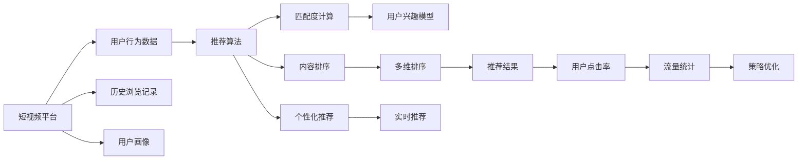

                 

# 短视频平台的算法推荐与注意力争夺

## 1. 背景介绍

在快速发展的数字化时代，短视频平台成为了一种新型且极具潜力的内容消费方式。相比于传统的文字和图像内容，短视频通过视听结合、情境生动、交互性强等特点，吸引了大量用户的注意力，成为社交网络新的增长点。为了更好地满足用户需求，提升用户体验，短视频平台在推荐算法上不断创新突破，通过精准的内容匹配和优化推荐，实现了用户流量的显著增长。

与此同时，短视频平台也面临着严峻的注意力争夺问题。随着平台的不断扩展和内容的日益丰富，用户在海量信息中如何发现最感兴趣的短视频，成为平台面临的一大挑战。短视频平台的算法推荐机制如何设计，如何有效地利用用户数据和平台资源，如何确保用户内容的多样性、相关性和个性化，这些课题在技术上、商业上都有着重大的研究价值。

## 2. 核心概念与联系

### 2.1 核心概念概述

为更好地理解短视频平台的推荐算法，我们需要对其中几个核心概念进行阐释：

- **短视频平台**：一种基于互联网的社交媒体平台，以视频形式进行内容创作和分享。用户可以上传视频、观看视频，并进行互动评论、点赞、分享等。
- **推荐算法**：根据用户行为数据、历史浏览记录、用户画像等，计算视频与用户之间的匹配度，预测用户可能感兴趣的视频，并进行排序推荐。
- **注意力争夺**：短视频平台间的竞争，通过内容质量、分发策略、用户互动等手段，争夺用户的注意力和市场份额。

这些核心概念通过以下Mermaid流程图进行了联系：



这个流程图展示了短视频平台推荐系统的核心流程：平台根据用户行为数据和画像，利用推荐算法计算匹配度，并结合实时反馈进行个性化推荐，最终通过多维排序和实时推荐提升用户体验，优化平台流量和策略。

## 3. 核心算法原理 & 具体操作步骤

### 3.1 算法原理概述

短视频平台的推荐算法通常是基于协同过滤和深度学习模型构建的。协同过滤算法通过用户行为和内容特征，找到用户之间或内容之间的相似性，并进行推荐。而深度学习模型，如神经网络、循环神经网络(RNN)、长短时记忆网络(LSTM)等，通过用户历史行为数据，学习用户的兴趣偏好，并进行精准推荐。

协同过滤算法和深度学习模型相辅相成，前者通过用户与内容之间的历史互动关系，建立起潜在用户与相似用户或相似内容的关联；后者则通过对用户行为模式的深入学习，捕捉到更深层次的用户偏好和内容特征。

### 3.2 算法步骤详解

**Step 1: 数据预处理与特征提取**

1. 数据采集：从短视频平台收集用户历史行为数据，包括观看历史、点赞、评论、分享等。
2. 数据清洗：去除异常值和噪声数据，处理缺失值和重复数据。
3. 特征提取：对用户行为数据和内容特征进行编码，如用户ID、视频ID、发布时间、类别、标签等，使用独热编码、词袋模型、TF-IDF等方法，构建用户特征向量和内容特征向量。

**Step 2: 相似度计算**

1. 用户相似度：利用余弦相似度、皮尔逊相关系数、Jaccard相似系数等方法，计算用户之间的相似度。
2. 内容相似度：通过计算内容向量之间的余弦相似度或欧式距离，得到内容之间的相似度。

**Step 3: 协同过滤推荐**

1. 基于用户的协同过滤：根据用户之间的相似性，进行推荐。具体方法包括基于用户的协同过滤算法（User-Based Collaborative Filtering, UBCF）、基于物品的协同过滤算法（Item-Based Collaborative Filtering, IBCF）等。
2. 混合协同过滤：结合基于用户的协同过滤和基于物品的协同过滤，取两者推荐结果的加权平均或排名融合。

**Step 4: 深度学习推荐**

1. 用户兴趣模型：使用深度神经网络模型（如CNN、RNN、LSTM等），通过用户历史行为数据，训练用户兴趣模型。
2. 内容嵌入模型：使用卷积神经网络（CNN）、循环神经网络（RNN）、变分自编码器（VAE）等，将视频内容特征进行编码，得到内容嵌入向量。
3. 深度推荐系统：结合用户兴趣模型和内容嵌入模型，预测用户对每个视频的评分，选择评分最高的视频进行推荐。

**Step 5: 多维排序与实时推荐**

1. 多维排序：综合考虑视频的评分、相关性、新鲜度、热门度等多个维度，对视频进行综合排序。
2. 实时推荐：根据用户实时行为数据，如当前观看视频、当前互动行为等，进行动态调整，实现实时推荐。

### 3.3 算法优缺点

**优点**：
- 协同过滤算法通过用户历史行为数据，快速找到相似的推荐对象，推荐效率高。
- 深度学习模型能够捕捉用户深层次的兴趣偏好，推荐结果更精准。
- 多维排序和实时推荐，使得推荐系统能够动态响应用户需求，提升用户体验。

**缺点**：
- 协同过滤算法需要大量用户行为数据，在数据稀疏情况下难以找到相似用户或相似内容。
- 深度学习模型训练复杂，需要大量的计算资源和时间，且容易过拟合。
- 多维排序和实时推荐需要持续数据输入和模型更新，增加了系统维护成本。

### 3.4 算法应用领域

基于短视频平台的推荐算法，已经在内容推荐、广告投放、用户增长等多个领域得到广泛应用：

- 内容推荐：如抖音、快手、小红书等平台，通过推荐算法，实现视频的精准推荐，提高用户留存率和粘性。
- 广告投放：如Instagram、TikTok等，通过广告推荐算法，实现个性化广告投放，提高广告转化率。
- 用户增长：如Bilibili等平台，通过推荐算法，吸引新用户，促进用户增长和活跃度的提升。

## 4. 数学模型和公式 & 详细讲解 & 举例说明

### 4.1 数学模型构建

推荐系统的数学模型通常包括用户模型和物品模型，以协同过滤和深度学习为基础。

**用户模型**：
1. 基于用户的协同过滤模型（UBCF）：
   - 用户-物品评分矩阵 $R \in \mathbb{R}^{N \times M}$，其中 $N$ 为用户数，$M$ 为物品数。
   - 用户相似度矩阵 $S \in \mathbb{R}^{N \times N}$，利用余弦相似度计算用户间的相似度。
   - 用户推荐列表：$U_k=\sum_{i=1}^{N}S_{ki}R_{i,j}$，计算用户 $k$ 的推荐列表。

2. 基于物品的协同过滤模型（IBCF）：
   - 物品-物品评分矩阵 $R \in \mathbb{R}^{N \times M}$，其中 $N$ 为用户数，$M$ 为物品数。
   - 物品相似度矩阵 $S \in \mathbb{R}^{M \times M}$，利用余弦相似度计算物品间的相似度。
   - 物品推荐列表：$I_k=\sum_{j=1}^{M}S_{kj}R_{i,j}$，计算物品 $k$ 的推荐列表。

**物品模型**：
1. 基于内容的推荐模型（CFM）：
   - 物品特征向量 $X \in \mathbb{R}^{M \times D}$，其中 $D$ 为物品特征维度。
   - 用户特征向量 $Y \in \mathbb{R}^{N \times D}$，通过独热编码等方式获取。
   - 用户-物品评分矩阵 $R \in \mathbb{R}^{N \times M}$，通过矩阵乘法计算。

2. 深度学习推荐模型：
   - 用户兴趣模型 $U \in \mathbb{R}^{N \times H}$，使用深度神经网络训练用户兴趣向量。
   - 内容嵌入模型 $C \in \mathbb{R}^{M \times H}$，使用卷积神经网络等方法得到内容嵌入向量。
   - 用户-物品评分矩阵 $R \in \mathbb{R}^{N \times M}$，通过矩阵乘法计算用户对物品的评分。

### 4.2 公式推导过程

**UBCF公式推导**：
假设用户 $k$ 对物品 $j$ 的评分 $r_{kj}$ 服从分布 $P(r_{kj}|S_{ki})$，其中 $S_{ki}$ 为用户 $k$ 和用户 $i$ 的相似度。则用户 $k$ 的推荐列表 $U_k$ 可以通过下式计算：

$$
U_k=\sum_{i=1}^{N}S_{ki}r_{ij}
$$

**IBCF公式推导**：
假设物品 $j$ 对用户 $k$ 的评分 $r_{kj}$ 服从分布 $P(r_{kj}|S_{kj})$，其中 $S_{kj}$ 为用户 $k$ 和物品 $j$ 的相似度。则物品 $k$ 的推荐列表 $I_k$ 可以通过下式计算：

$$
I_k=\sum_{j=1}^{M}S_{kj}r_{ij}
$$

**CFM公式推导**：
假设用户 $k$ 对物品 $j$ 的评分 $r_{kj}$ 可以通过内容特征计算：

$$
r_{kj}=\mathbb{E}_{u \sim U_k, c \sim C_j}[u^TC_j]
$$

其中 $U_k$ 为用户兴趣向量，$C_j$ 为物品嵌入向量。

**深度学习推荐模型推导**：
假设用户兴趣模型 $U \in \mathbb{R}^{N \times H}$，内容嵌入模型 $C \in \mathbb{R}^{M \times H}$。则用户 $k$ 对物品 $j$ 的评分 $r_{kj}$ 可以通过下式计算：

$$
r_{kj}=U_kC_j^T
$$

### 4.3 案例分析与讲解

以TikTok为例，展示其推荐算法如何高效地利用用户行为数据和内容特征进行推荐。

TikTok通过分析用户历史行为数据，包括浏览、点赞、评论、分享等，构建用户画像。同时，利用卷积神经网络（CNN）和长短时记忆网络（LSTM），将视频内容特征进行编码，得到内容嵌入向量。通过用户兴趣模型和内容嵌入模型，预测用户对每个视频的评分，结合协同过滤算法和深度学习模型，生成推荐列表，并进行多维排序和实时推荐。

## 5. 项目实践：代码实例和详细解释说明

### 5.1 开发环境搭建

在进行推荐算法实践前，我们需要准备好开发环境。以下是使用Python进行TensorFlow开发的环境配置流程：

1. 安装Anaconda：从官网下载并安装Anaconda，用于创建独立的Python环境。

2. 创建并激活虚拟环境：
```bash
conda create -n tf-env python=3.8 
conda activate tf-env
```

3. 安装TensorFlow：根据CUDA版本，从官网获取对应的安装命令。例如：
```bash
conda install tensorflow -c tf -c conda-forge
```

4. 安装Keras：
```bash
pip install keras
```

5. 安装TensorBoard：
```bash
pip install tensorboard
```

6. 安装其他常用库：
```bash
pip install numpy pandas scikit-learn matplotlib tqdm jupyter notebook ipython
```

完成上述步骤后，即可在`tf-env`环境中开始推荐算法实践。

### 5.2 源代码详细实现

这里我们以基于深度学习模型的推荐系统为例，展示如何使用TensorFlow和Keras进行推荐算法的实现。

首先，定义推荐系统的超参数：

```python
from tensorflow.keras.layers import Input, Embedding, Conv1D, Dense, LSTM
from tensorflow.keras.models import Model

batch_size = 32
epochs = 10
latent_dim = 100
seq_len = 100

input1 = Input(shape=(1,))
input2 = Input(shape=(seq_len,))
user_input = Embedding(input_dim=N, output_dim=latent_dim)(input1)
item_input = Embedding(input_dim=M, output_dim=latent_dim)(input2)

user_seq = LSTM(latent_dim)(user_input)
item_seq = LSTM(latent_dim)(item_input)

user_seq = Dense(128, activation='relu')(user_seq)
item_seq = Dense(128, activation='relu')(item_seq)

user_seq = Dense(1)(user_seq)
item_seq = Dense(1)(item_seq)

user_item = Dense(1, activation='sigmoid')(user_seq + item_seq)

model = Model(inputs=[input1, input2], outputs=user_item)
model.compile(loss='binary_crossentropy', optimizer='adam', metrics=['accuracy'])
```

然后，构建训练集和测试集：

```python
train_data = []
train_labels = []

for user, item in zip(train_user_ids, train_item_ids):
    train_data.append([user, item])
    train_labels.append(1)

test_data = []
test_labels = []

for user, item in zip(test_user_ids, test_item_ids):
    test_data.append([user, item])
    test_labels.append(1)

train_dataset = tf.data.Dataset.from_tensor_slices(train_data)
train_dataset = train_dataset.shuffle(10000).batch(batch_size)

test_dataset = tf.data.Dataset.from_tensor_slices(test_data)
test_dataset = test_dataset.shuffle(10000).batch(batch_size)

```

接着，定义训练函数和测试函数：

```python
def train_epoch(model, dataset, batch_size, optimizer):
    model.fit(dataset, batch_size=batch_size, epochs=epochs, verbose=1)

def evaluate(model, dataset, batch_size):
    loss, accuracy = model.evaluate(dataset, batch_size=batch_size, verbose=1)
    print(f'Test loss: {loss:.4f}')
    print(f'Test accuracy: {accuracy:.4f}')
```

最后，启动训练和测试流程：

```python
train_epoch(model, train_dataset, batch_size, optimizer)
evaluate(model, test_dataset, batch_size)
```

以上就是使用TensorFlow和Keras实现深度学习推荐算法的完整代码实现。可以看到，TensorFlow提供了强大的深度学习框架，Keras则简化了模型构建和训练过程，使得开发者可以更加专注于算法的设计和优化。

### 5.3 代码解读与分析

让我们再详细解读一下关键代码的实现细节：

**超参数设置**：
- `batch_size`：设置训练和测试的批次大小，通常根据硬件资源进行调整。
- `epochs`：设置训练的轮数，通常是10-100轮。
- `latent_dim`：设置隐层维度，一般为100-256。
- `seq_len`：设置输入序列的长度，通常与预训练的词向量维度相关。

**模型构建**：
- `Input`层：定义输入数据的占位符，包括用户ID和物品ID。
- `Embedding`层：将用户ID和物品ID转换为密集向量表示，便于后续的神经网络处理。
- `LSTM`层：使用LSTM网络对用户和物品的序列数据进行处理，得到用户兴趣向量和物品嵌入向量。
- `Dense`层：使用全连接层进行特征提取和处理。
- `Model`层：定义最终的推荐模型，包括用户和物品的兴趣向量，预测用户对物品的评分。

**训练集和测试集构建**：
- `train_data`和`train_labels`：从训练数据中提取用户ID、物品ID和标签，用于训练模型。
- `test_data`和`test_labels`：从测试数据中提取用户ID、物品ID和标签，用于评估模型。
- `tf.data.Dataset`：使用TensorFlow的Data API，构建训练集和测试集的迭代器。

**训练和测试函数**：
- `train_epoch`：定义训练过程，使用`fit`方法训练模型，设置训练轮数和批次大小。
- `evaluate`：定义测试过程，使用`evaluate`方法评估模型在测试集上的表现。

**启动训练和测试**：
- 调用`train_epoch`函数训练模型，使用`fit`方法进行训练。
- 调用`evaluate`函数测试模型，使用`evaluate`方法评估模型表现。

可以看到，TensorFlow和Keras使得模型构建和训练过程非常简便，开发者可以更加专注于算法的设计和优化。

## 6. 实际应用场景

### 6.1 智能推荐系统

智能推荐系统是短视频平台的核心应用场景之一。通过推荐算法，平台能够根据用户历史行为和兴趣，推荐符合用户需求的内容，提升用户满意度和留存率。

以抖音为例，抖音利用深度学习推荐模型，结合用户兴趣模型和内容嵌入模型，预测用户对每个视频的评分，生成推荐列表，并进行多维排序和实时推荐。此外，抖音还利用协同过滤算法，提高推荐的多样性和个性化，避免内容的同质化。

### 6.2 广告投放系统

广告投放系统也是短视频平台的重要应用场景。平台通过推荐算法，能够精准匹配广告主和用户，提高广告的点击率和转化率，实现广告效益的最大化。

以Instagram为例，Instagram利用深度学习推荐模型，结合用户兴趣模型和内容嵌入模型，预测用户对每个广告的评分，生成推荐列表，并进行多维排序和实时推荐。Instagram还利用协同过滤算法，提高广告的相关性和多样性，提升广告主的品牌曝光和用户体验。

### 6.3 用户增长系统

用户增长系统是短视频平台的重要目标之一。平台通过推荐算法，能够吸引新用户，提升用户活跃度和留存率，实现用户数量的快速增长。

以Bilibili为例，Bilibili利用深度学习推荐模型，结合用户兴趣模型和内容嵌入模型，预测用户对每个视频的评分，生成推荐列表，并进行多维排序和实时推荐。Bilibili还利用协同过滤算法，提高推荐的多样性和个性化，吸引新用户加入平台。

## 7. 工具和资源推荐

### 7.1 学习资源推荐

为了帮助开发者系统掌握推荐算法，这里推荐一些优质的学习资源：

1. 《深度学习推荐系统》系列博文：由大模型技术专家撰写，深入浅出地介绍了推荐系统的基本概念和经典模型。

2. CS231n《深度学习与视觉感知》课程：斯坦福大学开设的视觉识别课程，有Lecture视频和配套作业，涵盖深度学习推荐系统等内容。

3. 《深度学习推荐系统》书籍：深度学习推荐系统的经典教材，系统讲解了推荐系统的基本原理和实现方法。

4. Kaggle推荐系统竞赛：Kaggle上的推荐系统竞赛，可以实践推荐算法的优化和调参。

5. TensorFlow官方文档：TensorFlow的官方文档，提供丰富的推荐算法样例代码和实践指南。

通过对这些资源的学习实践，相信你一定能够快速掌握推荐算法的精髓，并用于解决实际的推荐问题。

### 7.2 开发工具推荐

高效的开发离不开优秀的工具支持。以下是几款用于推荐算法开发的常用工具：

1. TensorFlow：由Google主导开发的开源深度学习框架，生产部署方便，适合大规模工程应用。

2. PyTorch：基于Python的开源深度学习框架，灵活动态的计算图，适合快速迭代研究。

3. Keras：高层次的神经网络API，基于TensorFlow或Theano，可以简化模型构建和训练过程。

4. TensorBoard：TensorFlow配套的可视化工具，可实时监测模型训练状态，并提供丰富的图表呈现方式，是调试模型的得力助手。

5. Weights & Biases：模型训练的实验跟踪工具，可以记录和可视化模型训练过程中的各项指标，方便对比和调优。

合理利用这些工具，可以显著提升推荐算法的开发效率，加快创新迭代的步伐。

### 7.3 相关论文推荐

推荐系统的研究源于学界的持续研究。以下是几篇奠基性的相关论文，推荐阅读：

1. Collaborative Filtering for Implicit Feedback Datasets：提出基于隐式反馈数据的协同过滤算法，填补了推荐系统领域的研究空白。

2. Item Response Theory for Recommender Systems：利用项目反应理论（IRT），建立推荐系统的用户兴趣模型，提高了推荐精度。

3. Deep Matrix Factorization for Recommender Systems：提出深度矩阵分解方法，通过矩阵分解和神经网络结合，提升了推荐效果。

4. Attention-based Recommender Systems：引入注意力机制，提高推荐系统的效果和泛化能力。

5. Learning Deep Architectures for Recommender Systems：提出深度神经网络推荐模型，通过多层次特征提取，提升了推荐系统的性能。

这些论文代表了大语言模型微调技术的发展脉络。通过学习这些前沿成果，可以帮助研究者把握学科前进方向，激发更多的创新灵感。

## 8. 总结：未来发展趋势与挑战

### 8.1 总结

本文对短视频平台的推荐算法进行了全面系统的介绍。首先阐述了推荐算法在短视频平台上的应用背景和意义，明确了推荐系统在内容推荐、广告投放、用户增长等方面的重要价值。其次，从原理到实践，详细讲解了推荐算法的数学模型和具体步骤，给出了推荐算法开发的全流程代码实现。同时，本文还广泛探讨了推荐算法在智能推荐系统、广告投放系统、用户增长系统等多个行业领域的应用前景，展示了推荐算法技术的广泛应用价值。

通过本文的系统梳理，可以看到，推荐算法在短视频平台的推荐系统中起着核心作用，极大地提升了用户体验和平台收益。未来，伴随推荐算法的不断演进，短视频平台将能够更加精准、高效地匹配用户需求，为用户带来更丰富的选择和更优质的服务体验。

### 8.2 未来发展趋势

展望未来，推荐算法将呈现以下几个发展趋势：

1. 深度学习模型的普及：深度学习模型将进一步普及，成为推荐算法的核心工具，提升推荐精度和效果。

2. 多模态数据的融合：推荐算法将引入多模态数据，如视频、图像、文本等，实现视觉、听觉和文本信息的协同建模，提升推荐效果。

3. 协同过滤与深度学习的结合：协同过滤和深度学习将更加紧密结合，互相补充，提高推荐的多样性和个性化。

4. 实时推荐系统的构建：推荐系统将构建实时推荐系统，根据用户实时行为数据，进行动态调整，提高推荐的时效性和精准度。

5. 推荐算法的多样化：推荐算法将更加多样化，结合机器学习、强化学习、博弈论等方法，提升推荐系统的性能和可靠性。

以上趋势凸显了推荐算法的广阔前景。这些方向的探索发展，必将进一步提升推荐系统的性能和应用范围，为短视频平台带来更优质的用户体验和更高的商业价值。

### 8.3 面临的挑战

尽管推荐算法已经取得了显著进展，但在迈向更加智能化、普适化应用的过程中，它仍面临着诸多挑战：

1. 数据隐私与安全：推荐算法需要处理大量的用户数据，如何保护用户隐私和数据安全，成为一大挑战。

2. 模型公平性与偏见：推荐算法可能会受到数据偏见的影响，导致某些用户群体被忽视或歧视，如何提高模型公平性，避免偏见，还需要更多研究和实践。

3. 推荐算法透明性与可解释性：推荐算法的复杂性和黑盒特性，使得其决策过程难以解释，如何提高算法透明性和可解释性，还需进一步探索。

4. 推荐系统的鲁棒性与稳定性：推荐算法在面对异常数据和恶意攻击时，容易发生波动和失效，如何提高系统的鲁棒性和稳定性，是未来重要的研究方向。

5. 推荐算法的效率与可扩展性：推荐算法的计算复杂度和资源消耗较大，如何提高算法的效率和可扩展性，是工业化应用的重要课题。

6. 推荐系统的应用边界：推荐算法在不同的应用场景下，如何灵活适配，实现个性化推荐，还需进一步研究和优化。

正视推荐算法面临的这些挑战，积极应对并寻求突破，将使推荐算法技术走向成熟，实现更广泛的应用和落地。相信随着学界和产业界的共同努力，这些挑战终将一一被克服，推荐算法必将在构建智能推荐系统、提升用户体验方面发挥更大的作用。

### 8.4 研究展望

面对推荐算法所面临的种种挑战，未来的研究需要在以下几个方面寻求新的突破：

1. 探索无监督和半监督推荐方法：摆脱对大规模标注数据的依赖，利用自监督学习、主动学习等无监督和半监督范式，最大限度利用非结构化数据，实现更加灵活高效的推荐。

2. 研究参数高效与计算高效的推荐范式：开发更加参数高效的推荐方法，在固定大部分预训练参数的同时，只更新极少量的任务相关参数。同时优化推荐模型的计算图，减少前向传播和反向传播的资源消耗，实现更加轻量级、实时性的部署。

3. 引入因果分析和博弈论工具：将因果分析方法引入推荐模型，识别出模型决策的关键特征，增强输出解释的因果性和逻辑性。借助博弈论工具刻画人机交互过程，主动探索并规避模型的脆弱点，提高系统稳定性。

4. 纳入伦理道德约束：在推荐算法中引入伦理导向的评估指标，过滤和惩罚有偏见、有害的输出倾向。加强人工干预和审核，建立模型行为的监管机制，确保推荐结果符合人类价值观和伦理道德。

这些研究方向的探索，必将引领推荐算法技术迈向更高的台阶，为构建智能推荐系统、提升用户体验带来新的突破。面向未来，推荐算法技术还需要与其他人工智能技术进行更深入的融合，如知识表示、因果推理、强化学习等，多路径协同发力，共同推动推荐系统的进步。只有勇于创新、敢于突破，才能不断拓展推荐算法的边界，让推荐系统更好地服务于人类社会。

## 9. 附录：常见问题与解答

**Q1：推荐算法是否适用于所有短视频平台？**

A: 推荐算法在大多数短视频平台上都适用，特别是那些具有强大数据基础和用户规模的平台。但对于数据质量较差、用户基数较小的平台，推荐算法的推荐效果可能不佳。此时需要在数据预处理和特征工程上投入更多精力，提升数据质量，优化算法模型。

**Q2：推荐算法在微调过程中如何选择合适的学习率？**

A: 推荐算法在微调过程中，通常采用较小的学习率，以免破坏模型权重。一般建议从1e-3开始调参，逐步减小学习率，直至收敛。同时，可以设置warmup策略，在开始阶段使用较小的学习率，再逐渐过渡到预设值。需要注意的是，不同的优化器(如Adam、SGD等)以及不同的学习率调度策略，可能需要设置不同的学习率阈值。

**Q3：推荐算法在落地部署时需要注意哪些问题？**

A: 将推荐算法转化为实际应用，还需要考虑以下因素：
1. 模型裁剪：去除不必要的层和参数，减小模型尺寸，加快推理速度
2. 量化加速：将浮点模型转为定点模型，压缩存储空间，提高计算效率
3. 服务化封装：将模型封装为标准化服务接口，便于集成调用
4. 弹性伸缩：根据请求流量动态调整资源配置，平衡服务质量和成本
5. 监控告警：实时采集系统指标，设置异常告警阈值，确保服务稳定性
6. 安全防护：采用访问鉴权、数据脱敏等措施，保障数据和模型安全

推荐算法需要开发者根据具体任务，不断迭代和优化模型、数据和算法，方能得到理想的效果。

---

作者：禅与计算机程序设计艺术 / Zen and the Art of Computer Programming

