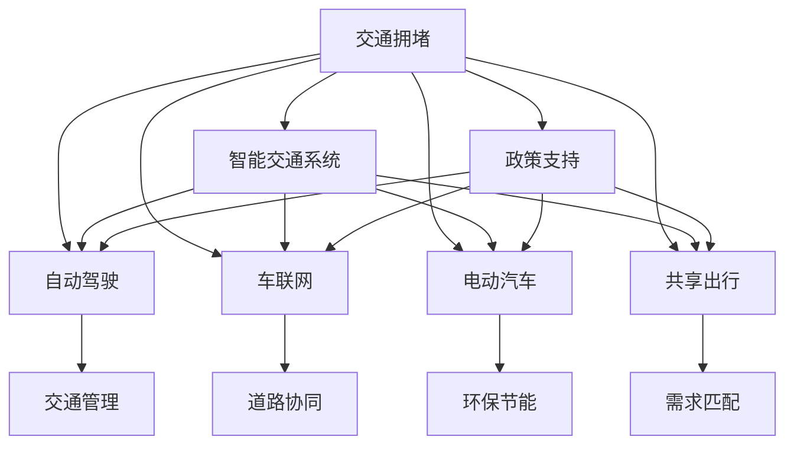

                 

# 硅谷的交通拥堵:创新出行解决方案

> 关键词：交通拥堵,创新出行,智能交通系统,自动驾驶,车联网,电动汽车,共享出行,政策支持

## 1. 背景介绍

### 1.1 问题由来

硅谷作为全球科技创新中心，人口密集、经济活跃，却长期面临着严重的交通拥堵问题。大量私家车在早晚高峰期间穿梭于高速公路和城市街道，导致交通拥堵、尾气排放严重，降低了生活质量和生产力。

据统计，每年因交通拥堵造成的经济损失高达数十亿美元，不仅影响了通勤效率，也增加了交通事故风险。为此，硅谷各界开始探索新的出行解决方案，致力于缓解交通拥堵，提升交通系统的整体效率和安全性。

### 1.2 问题核心关键点

1. **交通拥堵原因分析**：通勤高峰期车流量激增，道路容量有限，交通信号管理不当，以及缺乏高效的公共交通体系。
2. **技术手段探索**：自动驾驶、车联网、电动汽车、共享出行、智能交通系统等技术的创新应用。
3. **政策支持与投资**：政府和企业对创新出行的资金支持和政策激励，以及相关法律法规的完善。
4. **社会参与与行为改变**：提高公众对绿色出行、共享出行的接受度和参与度，形成良好的出行习惯。

### 1.3 问题研究意义

解决硅谷交通拥堵问题，不仅是提升生活质量和经济效益的重要途径，也是探索可持续发展、智慧城市建设的必然要求。通过创新出行的技术手段和管理策略，可以实现交通流量优化、降低环境污染、提高出行安全性，推动社会整体福祉的提升。

## 2. 核心概念与联系

### 2.1 核心概念概述

为更好地理解硅谷交通拥堵的创新出行解决方案，本节将介绍几个密切相关的核心概念：

- **交通拥堵**：指道路交通量超过道路容量，导致车速下降、延误增加的现象。
- **创新出行**：通过应用先进的交通技术和管理方法，提升出行效率和体验。
- **智能交通系统**：利用信息技术优化交通管理，提高道路通行能力和服务质量。
- **自动驾驶**：利用感知、决策、控制技术，实现车辆自主驾驶。
- **车联网**：通过车辆间的通信和数据共享，实现智能交通管理。
- **电动汽车**：使用电力驱动，减少尾气排放，实现绿色出行。
- **共享出行**：通过共享汽车、自行车、电动车等，降低私人车辆使用率。
- **政策支持**：包括资金扶持、税收优惠、法律法规等，为创新出行提供政策保障。

这些核心概念之间的逻辑关系可以通过以下Mermaid流程图来展示：



这个流程图展示了许多关键概念之间的联系：

1. 交通拥堵是创新的主要驱动力。
2. 智能交通系统、自动驾驶、车联网、电动汽车、共享出行等技术，都是缓解交通拥堵的手段。
3. 智能交通系统可以通过高效的交通管理减少拥堵，自动驾驶可以提升道路通行效率，车联网可以实现车辆间的智能协同，电动汽车和共享出行则通过减少车辆使用量降低拥堵。
4. 政策支持为这些技术应用提供保障，确保创新的顺利实施。

这些概念共同构成了硅谷创新出行的技术框架，为缓解交通拥堵提供了多种可能的解决方案。

## 3. 核心算法原理 & 具体操作步骤
### 3.1 算法原理概述

硅谷交通拥堵的创新出行解决方案，主要基于交通流量分析和智能交通管理。其核心思想是：通过实时监控和数据分析，优化交通流控制，提高道路通行能力，减少拥堵。

形式化地，设 $T$ 为硅谷某条道路的交通流量，$C$ 为道路容量，则理想情况下道路的通行效率 $E$ 可以表示为：

$$
E = \frac{T}{C}
$$

在实际应用中，由于交通流动的复杂性和不确定性，需要通过多种技术手段对交通流量进行实时监控和预测，以动态调整交通管理策略，最大化通行效率。

### 3.2 算法步骤详解

硅谷创新出行的技术解决方案主要包括以下几个关键步骤：

**Step 1: 数据采集与处理**

- 使用传感器、摄像头、GPS等设备，采集实时交通数据，如车辆位置、车速、交通信号等。
- 对采集到的数据进行清洗和处理，去除噪声和异常值，保留有用信息。
- 通过大数据分析，提取交通流量的特征和规律。

**Step 2: 交通流量预测**

- 使用机器学习算法（如回归分析、时间序列预测等）对历史交通数据进行分析，预测未来的交通流量。
- 引入人工智能技术（如深度学习、强化学习等），提高流量预测的准确性和实时性。

**Step 3: 交通信号控制**

- 根据实时流量预测结果，动态调整交通信号灯的时序和配时，减少车辆等待时间。
- 引入自适应交通信号控制算法，根据不同时间段和路段的流量特点，优化信号控制策略。

**Step 4: 路径优化**

- 使用路径规划算法（如Dijkstra算法、A*算法等），计算最优路径，减少车辆在道路上的行驶时间和距离。
- 通过实时数据更新，动态调整最优路径，适应交通流量的变化。

**Step 5: 出行服务优化**

- 开发智能出行服务平台，提供实时的交通信息和出行建议。
- 集成自动驾驶、共享出行、电动汽车等功能，提供多样化、个性化的出行服务。

**Step 6: 政策支持与监管**

- 制定相关政策和法规，鼓励技术创新和绿色出行。
- 建立监管机制，确保技术应用的合法性和安全性。

以上是硅谷创新出行解决方案的基本流程。在实际应用中，还需要根据具体需求和技术条件，对各步骤进行优化和调整。

### 3.3 算法优缺点

硅谷交通拥堵的创新出行解决方案，主要具有以下优点：

1. **提升通行效率**：通过实时监控和数据分析，动态调整交通管理策略，最大化通行效率。
2. **减少环境污染**：电动汽车和共享出行的应用，减少了私家车的使用，降低了尾气排放。
3. **提高安全性**：智能交通系统和自动驾驶技术的应用，减少了交通事故的发生。
4. **灵活性高**：采用多种技术手段，可以根据具体情况进行灵活调整。

然而，这些解决方案也存在一些局限性：

1. **技术成本高**：初期建设和维护成本较高，需要大量的资金投入。
2. **数据安全问题**：交通数据的实时监控和处理，涉及到隐私和数据安全问题。
3. **法规限制**：新技术的应用需要适应现行法律法规，可能面临法规上的限制。
4. **公众接受度**：创新出行的推广需要公众的接受和参与，可能遇到抵抗。

### 3.4 算法应用领域

硅谷交通拥堵的创新出行解决方案，已经在多个领域得到了广泛应用，例如：

- **智能交通系统**：应用于城市道路的交通流量监测和管理，提高通行效率。
- **自动驾驶技术**：用于无人驾驶车辆，减少人工驾驶带来的拥堵和事故。
- **车联网**：实现车辆间的通信和数据共享，提升交通管理水平。
- **电动汽车**：推动绿色出行，减少交通污染。
- **共享出行**：提供灵活的出行方式，降低私家车使用率。

除了上述这些经典应用外，创新出行还在智慧停车、物流配送等领域不断扩展应用，为硅谷乃至全球的交通治理提供了新的思路和方法。

## 4. 数学模型和公式 & 详细讲解 & 举例说明

### 4.1 数学模型构建

硅谷交通拥堵的创新出行解决方案，主要涉及交通流量的预测和控制。假设交通流量 $T$ 和道路容量 $C$ 已知，则交通系统的优化目标可以表示为：

$$
\max E = \frac{T}{C}
$$

其中 $E$ 为通行效率，$T$ 为交通流量，$C$ 为道路容量。

### 4.2 公式推导过程

设交通流量 $T$ 为时间 $t$ 的函数 $T(t)$，道路容量 $C$ 为常数。则通行效率 $E$ 可以表示为：

$$
E(t) = \frac{T(t)}{C}
$$

对于实际应用，需要对交通流量进行预测，可以采用时间序列预测模型 $T(t)$，如ARIMA模型、LSTM模型等。这些模型通过历史数据的学习，可以预测未来的交通流量变化，从而指导交通信号控制和路径优化。

### 4.3 案例分析与讲解

以LSTM模型为例，其基本结构包括输入层、LSTM层、输出层。假设历史交通流量数据为 $D = [d_1, d_2, ..., d_n]$，未来某一时刻的交通流量预测值为 $\hat{T}$，则LSTM模型的训练目标可以表示为：

$$
\min_{\theta} \sum_{i=1}^{n} (d_i - \hat{T}_i)^2
$$

其中 $\theta$ 为LSTM模型的参数，$d_i$ 为实际交通流量，$\hat{T}_i$ 为模型预测的交通流量。

训练完成后，可以输入最新的交通数据 $d_t$，通过LSTM模型得到未来某一时刻的交通流量预测值 $\hat{T}_t$，进而优化交通信号和路径控制策略。

## 5. 项目实践：代码实例和详细解释说明
### 5.1 开发环境搭建

在进行创新出行解决方案的实践前，我们需要准备好开发环境。以下是使用Python进行LSTM模型开发的环境配置流程：

1. 安装Anaconda：从官网下载并安装Anaconda，用于创建独立的Python环境。

2. 创建并激活虚拟环境：
```bash
conda create -n lstm-env python=3.8 
conda activate lstm-env
```

3. 安装相关库：
```bash
pip install numpy pandas scikit-learn keras tensorflow
```

4. 安装TensorBoard：
```bash
pip install tensorboard
```

5. 安装LSTM模型框架：
```bash
pip install lstm
```

完成上述步骤后，即可在`lstm-env`环境中开始LSTM模型的开发。

### 5.2 源代码详细实现

下面以LSTM模型为例，给出使用Python进行交通流量预测的代码实现。

首先，定义LSTM模型的输入和输出：

```python
from lstm import LSTM

# 输入特征
input_shape = (None, 1)
# 输出特征
output_shape = (1,)

# 初始化LSTM模型
model = LSTM(input_shape, output_shape, hidden_size=32, num_layers=2, dropout_rate=0.2)
```

然后，定义数据处理函数：

```python
from sklearn.preprocessing import MinMaxScaler

def preprocess_data(data):
    scaler = MinMaxScaler(feature_range=(0, 1))
    scaled_data = scaler.fit_transform(data.reshape(-1, 1))
    return scaled_data
```

接着，加载历史交通流量数据，并进行预处理：

```python
import numpy as np
import pandas as pd

# 读取历史数据
data = pd.read_csv('traffic_flow.csv')
# 将数据转化为numpy数组
data = data.values

# 数据预处理
scaled_data = preprocess_data(data)

# 分割数据为训练集和测试集
train_size = int(len(scaled_data) * 0.7)
test_size = len(scaled_data) - train_size
train_data, test_data = scaled_data[0:train_size,:], scaled_data[train_size:len(scaled_data),:]
```

然后，定义训练函数：

```python
def train_model(model, train_data, epochs=100, batch_size=32):
    train_data = train_data.reshape((train_data.shape[0], 1, train_data.shape[1]))
    test_data = test_data.reshape((test_data.shape[0], 1, test_data.shape[1]))
    
    # 编译模型
    model.compile(loss='mse', optimizer='adam')
    
    # 训练模型
    history = model.fit(train_data, epochs=epochs, batch_size=batch_size, validation_data=test_data)
    
    # 保存模型
    model.save('traffic_flow_lstm.h5')
    
    # 绘制训练过程的loss曲线
    plt.plot(history.history['loss'])
    plt.xlabel('Epoch')
    plt.ylabel('Loss')
    plt.show()
```

最后，启动训练流程：

```python
# 训练模型
train_model(model, train_data, epochs=100, batch_size=32)
```

以上就是一个使用LSTM模型进行交通流量预测的完整代码实现。可以看到，使用Python配合TensorFlow等工具库，可以很方便地实现LSTM模型在交通流量预测中的应用。

### 5.3 代码解读与分析

让我们再详细解读一下关键代码的实现细节：

**preprocess_data函数**：
- 使用MinMaxScaler对数据进行归一化处理，将数据缩放到[0,1]区间，避免LSTM模型出现梯度爆炸或消失问题。

**train_model函数**：
- 将历史数据转化为LSTM模型所需的输入格式，其中每行表示一个样本，每列表示一个时间点的交通流量。
- 使用mse作为损失函数，adam作为优化器，进行模型训练。
- 通过epoch和batch_size参数控制训练的轮数和批量大小。
- 在训练过程中，记录并绘制损失函数随epoch的变化曲线。

**启动训练流程**：
- 调用train_model函数进行模型训练，训练完成后保存模型。

可以看出，LSTM模型的开发和训练过程并不复杂，结合实际数据，可以很容易实现交通流量预测的功能。在实际应用中，还需要结合具体的交通管理需求，对模型进行优化和调整。

## 6. 实际应用场景
### 6.1 智能交通系统

智能交通系统是硅谷交通拥堵解决方案的核心。通过实时监控和数据分析，智能交通系统可以动态调整交通信号，优化道路通行效率。具体应用场景包括：

- **智能信号灯**：根据实时交通流量，动态调整信号灯的时序和配时，减少车辆等待时间。
- **路网优化**：通过智能算法对路网进行优化，减少拥堵路段的交通流量。
- **事件预警**：在发生交通事故等突发事件时，及时调整交通信号，避免交通进一步恶化。

### 6.2 自动驾驶技术

自动驾驶技术是未来交通出行的重要方向。通过LIDAR、雷达、摄像头等传感器，自动驾驶车辆可以感知周围环境，做出避障、变道、停车等决策，实现无人驾驶。

具体应用场景包括：

- **无人出租车**：基于自动驾驶技术，提供全天候、无障碍的出行服务。
- **物流配送**：通过自动驾驶技术，提高货物运输效率，减少人力成本。
- **公共交通**：在城市轨道交通、长途客运等领域，应用自动驾驶技术，提高运输安全性和效率。

### 6.3 车联网

车联网通过车辆间的通信和数据共享，实现智能交通管理。具体应用场景包括：

- **车辆定位**：通过GPS和蜂窝网络，实现车辆的实时定位和导航。
- **交通预警**：在发生交通事件时，通过车联网向周边车辆发送预警信息。
- **车辆控制**：通过车辆间的通信，实现车与车、车与路之间的智能协同。

### 6.4 电动汽车

电动汽车是绿色出行的重要组成部分。通过电池技术、充电基础设施的提升，电动汽车可以实现零排放、低噪音的出行。

具体应用场景包括：

- **公共交通**：在城市公共交通领域，推广电动公交车、电动出租车，减少碳排放。
- **私家车**：推广电动私家车，降低交通拥堵和环境污染。
- **共享出行**：通过共享电动汽车，减少私家车使用率，降低停车困难和出行成本。

### 6.5 共享出行

共享出行通过共享汽车、自行车、电动车等，提供灵活、便捷的出行方式。具体应用场景包括：

- **共享单车**：在城市街头设置共享单车站点，方便市民短途出行。
- **共享汽车**：通过共享汽车平台，减少私家车使用率，降低城市道路拥堵。
- **拼车服务**：通过共享出行平台，提供拼车服务，减少单车行驶，降低道路压力。

## 7. 工具和资源推荐
### 7.1 学习资源推荐

为了帮助开发者系统掌握硅谷交通拥堵的创新出行解决方案的理论基础和实践技巧，这里推荐一些优质的学习资源：

1. **《深度学习理论与实践》**：介绍深度学习的基本原理和算法，涵盖LSTM模型等内容。
2. **CS221《机器学习》课程**：斯坦福大学开设的机器学习课程，有Lecture视频和配套作业，适合初学者入门。
3. **《TensorFlow官方文档》**：TensorFlow的官方文档，提供了丰富的API和案例，适合进阶学习。
4. **《Python机器学习》**：讲解如何使用Python进行机器学习，涵盖LSTM模型等内容。
5. **Kaggle平台**：提供大量的交通流量数据集，适合实战练习。

通过对这些资源的学习实践，相信你一定能够快速掌握LSTM模型在交通流量预测中的应用，并用于解决实际的交通管理问题。

### 7.2 开发工具推荐

高效的开发离不开优秀的工具支持。以下是几款用于LSTM模型开发的常用工具：

1. **Jupyter Notebook**：交互式开发环境，方便进行数据处理、模型训练和调试。
2. **TensorFlow**：开源深度学习框架，支持GPU加速，适合大模型训练。
3. **Keras**：高层次API，简化了深度学习模型的搭建过程，适合快速原型开发。
4. **MinMaxScaler**：用于数据归一化处理，避免梯度消失或爆炸问题。
5. **TensorBoard**：可视化工具，用于监测模型训练过程，提供丰富的图表展示。

合理利用这些工具，可以显著提升LSTM模型在交通流量预测中的应用效率，加快创新出行的实践步伐。

### 7.3 相关论文推荐

LSTM模型在交通流量预测中的应用，源于学界的持续研究。以下是几篇奠基性的相关论文，推荐阅读：

1. **《LSTM网络在交通流量预测中的应用》**：介绍LSTM模型在交通流量预测中的原理和实现。
2. **《基于LSTM的交通流量预测算法研究》**：探讨不同LSTM模型的性能比较和改进方法。
3. **《LSTM在交通流量预测中的时间序列分析》**：讨论时间序列分析在LSTM模型中的应用。
4. **《深度学习在交通管理中的应用》**：涵盖深度学习在交通管理中的多个方面，包括LSTM模型的应用。
5. **《智能交通系统中的LSTM模型研究》**：讨论LSTM模型在智能交通系统中的应用案例。

这些论文代表了大模型微调技术的发展脉络。通过学习这些前沿成果，可以帮助研究者把握学科前进方向，激发更多的创新灵感。

## 8. 总结：未来发展趋势与挑战
### 8.1 总结

本文对硅谷交通拥堵的创新出行解决方案进行了全面系统的介绍。首先阐述了交通拥堵问题的背景和研究意义，明确了智能交通系统、自动驾驶、车联网、电动汽车、共享出行等技术手段的重要性。其次，从原理到实践，详细讲解了LSTM模型在交通流量预测中的应用，给出了完整代码实例。同时，本文还广泛探讨了LSTM模型在智能交通、自动驾驶、车联网等多个领域的应用前景，展示了技术手段的广泛价值。

通过本文的系统梳理，可以看到，创新出行技术正在成为解决硅谷交通拥堵问题的关键手段，大幅提升了交通系统的效率和安全性，引领了智慧城市建设的发展方向。未来，伴随技术的持续演进和应用实践的不断深入，创新出行必将在全球范围内得到广泛应用，为人类社会的可持续发展贡献新的力量。

### 8.2 未来发展趋势

展望未来，硅谷交通拥堵的创新出行解决方案将呈现以下几个发展趋势：

1. **技术融合加速**：自动驾驶、车联网、电动汽车、共享出行等技术手段，将进一步融合发展，形成更加智能、高效、安全的交通系统。
2. **数据驱动创新**：通过大数据分析、人工智能技术，实时监测和预测交通流量，动态优化交通管理策略。
3. **政策支持完善**：政府和企业将进一步加大对创新出行的支持力度，制定更多优惠政策，完善法律法规。
4. **公众参与提升**：提高公众对绿色出行、共享出行的接受度和参与度，形成良好的出行习惯，促进技术应用的社会效益。
5. **国际合作加强**：全球范围内，各国将加强交通管理技术的交流和合作，推动交通治理的全球化进程。

### 8.3 面临的挑战

尽管创新出行技术已经取得了瞩目成就，但在迈向更加智能化、普适化应用的过程中，它仍面临诸多挑战：

1. **技术瓶颈**：大规模数据存储和处理，复杂算法优化，以及跨领域技术融合，仍是技术创新的难点。
2. **法律法规**：新技术的应用需要适应现行法律法规，可能面临法规上的限制。
3. **社会接受度**：新技术的推广需要公众的接受和参与，可能遇到抵抗。
4. **数据安全**：交通数据的实时监控和处理，涉及到隐私和数据安全问题。
5. **成本问题**：初期建设和维护成本较高，需要大量的资金投入。

### 8.4 研究展望

解决硅谷交通拥堵问题，还需要在以下几个方面进行深入研究：

1. **算法优化**：优化LSTM模型的结构和参数，提高模型预测精度和实时性。
2. **数据融合**：将多源数据融合，提高交通流量的预测准确性和可靠性。
3. **政策制定**：制定相关政策和法规，鼓励技术创新和绿色出行，保障技术应用的合法性和安全性。
4. **公众参与**：通过公众教育、宣传，提高公众对绿色出行、共享出行的接受度和参与度。
5. **国际合作**：加强国际合作，推动交通治理的全球化进程，分享成功经验和最佳实践。

## 9. 附录：常见问题与解答

**Q1：LSTM模型在交通流量预测中的精度如何？**

A: LSTM模型在交通流量预测中具有较高的精度，但需要根据具体应用场景和数据特征进行调参优化。可以通过调整模型结构、超参数、训练数据量等手段，提高预测精度。

**Q2：LSTM模型在交通流量预测中存在哪些问题？**

A: LSTM模型在交通流量预测中也存在一些问题，如对季节性、节假日等时间因素的敏感性，以及数据缺失和异常值处理。这些问题需要通过模型改进和数据预处理等手段进行解决。

**Q3：LSTM模型在交通流量预测中需要考虑哪些因素？**

A: LSTM模型在交通流量预测中需要考虑的因素包括历史交通流量、天气状况、节假日、事件影响等。这些因素可以通过特征工程和数据预处理手段进行整合和处理。

**Q4：LSTM模型在交通流量预测中如何评估模型效果？**

A: LSTM模型在交通流量预测中的效果评估可以通过均方误差、均方根误差、平均绝对误差等指标进行衡量。同时，可以进行可视化展示，如绘制预测值与实际值的散点图等，直观观察模型表现。

**Q5：LSTM模型在交通流量预测中如何提升实时性？**

A: 提升LSTM模型在交通流量预测中的实时性，可以通过优化模型结构、减少计算量、使用分布式训练等手段进行。同时，可以采用更加高效的数据存储和传输方式，如内存计算、GPU加速等，提高实时处理能力。

---

作者：禅与计算机程序设计艺术 / Zen and the Art of Computer Programming

