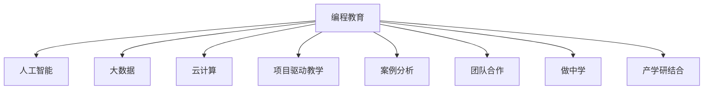

                 

# 硅谷编程教育改革的实践与挑战

## 1. 背景介绍

### 1.1 问题由来
硅谷作为全球科技创新的中心，一直引领着计算机科学和编程教育的发展。然而，随着技术的发展，传统编程教育模式逐渐显露出一些问题。比如，课程内容陈旧、教学方法单一、缺乏实际应用场景等。这些问题使得很多学生在求职或工作中面临困难，无法将所学知识灵活应用。为此，硅谷启动了一系列编程教育改革，旨在培养具备创新思维和实际操作能力的未来工程师。

### 1.2 问题核心关键点
硅谷编程教育改革的关键在于：
- 课程内容更新：引入最新技术，如人工智能、大数据、云计算等，以满足行业需求。
- 教学方法创新：采用项目驱动、案例分析、团队合作等方式，提升学生实战能力。
- 师资队伍优化：招聘资深工程师和企业家作为讲师，强调“做中学”。
- 合作企业联动：与科技公司合作，建立实习和就业渠道，实现产学研结合。

## 2. 核心概念与联系

### 2.1 核心概念概述

为更好地理解硅谷编程教育改革，本节将介绍几个密切相关的核心概念：

- 编程教育(Computer Science Education)：指对计算机科学知识和技术进行的教学活动，包括理论学习与实践操作。
- 人工智能(Artificial Intelligence, AI)：通过机器学习和深度学习技术，使机器具备类人智能。
- 大数据(Big Data)：指体量巨大、多样性丰富的数据集合，通过处理分析产生价值。
- 云计算(Cloud Computing)：通过互联网提供按需的计算资源，实现资源共享和协同工作。
- 项目驱动教学(Project-Based Learning)：通过真实项目或模拟项目，让学生在实际问题中学习解决技能。
- 案例分析(Case-Based Learning)：通过分析实际案例，提高学生的问题解决能力和批判性思维。
- 团队合作(Team Collaboration)：通过团队任务，培养学生的沟通协作和项目管理能力。
- “做中学”(Learning by Doing)：强调动手实践和项目体验，通过实际操作学习知识。
- 产学研结合(Industry-Academia Collaboration)：学校与企业的紧密合作，促进理论知识与实践经验的融合。

这些核心概念之间的逻辑关系可以通过以下Mermaid流程图来展示：



这个流程图展示出编程教育的核心概念及其相互关系：编程教育涵盖了人工智能、大数据、云计算等新兴技术，通过项目驱动、案例分析、团队合作等方式，强调动手实践和产学研结合，培养学生解决实际问题的能力。

## 3. 核心算法原理 & 具体操作步骤
### 3.1 算法原理概述

硅谷编程教育改革的核心在于，通过对课程内容和教学方法的更新，提升学生的实际应用能力。其主要思想是：
- 更新课程内容：引入最新的技术领域和行业需求，使学生学习到前沿知识。
- 优化教学方法：采用项目驱动、案例分析等互动性强的教学模式，提升学生解决问题的能力。
- 强化实战练习：通过团队合作和动手实践，培养学生的操作能力和团队协作精神。
- 产学研结合：与企业紧密合作，提供实习和就业机会，实现理论知识与实践经验的结合。

### 3.2 算法步骤详解

硅谷编程教育改革的主要步骤包括：

**Step 1: 课程内容更新**
- 与企业合作，根据行业需求，更新课程大纲，引入最新技术领域。
- 组织专家讲授前沿技术，如深度学习、自然语言处理、计算机视觉等。
- 定期更新课程内容，保持教学内容的与时俱进。

**Step 2: 教学方法创新**
- 采用项目驱动教学，将实际项目引入课堂，让学生在实际操作中学习。
- 实施案例分析法，通过真实案例引导学生思考和解决问题。
- 强调团队合作，组织学生在项目中分工协作，提高沟通与项目管理能力。
- 实施“做中学”，鼓励学生动手实践，在实际项目中提升技能。

**Step 3: 师资队伍优化**
- 招聘资深工程师和企业家，担任兼职讲师，传授实际经验和职业规划。
- 组织教师培训，提升教学水平和实践经验。
- 引入在线课程和MOOC平台，扩展教学资源。

**Step 4: 合作企业联动**
- 与科技公司合作，建立实习和就业渠道，为学生提供实际工作机会。
- 共建联合实验室和研发中心，实现资源共享和技术合作。
- 组织企业参观和技术交流，增加学生的实践经验和职业认知。

### 3.3 算法优缺点

硅谷编程教育改革具有以下优点：
1. 与时俱进：课程内容不断更新，跟上技术发展的前沿，使学生学习到最新的知识和技能。
2. 实用性强：通过项目驱动、案例分析等方式，提高学生实际解决问题的能力。
3. 师资强大：资深工程师和企业家的参与，为学生提供丰富的职业经验和指导。
4. 产学研结合：与企业的紧密合作，为学生提供实习和就业机会，促进理论知识与实践经验的结合。

同时，该方法也存在一定的局限性：
1. 课程设计复杂：需要不断更新和调整课程内容，需要大量的时间和资源。
2. 师资要求高：需要高水平的讲师和专家，对教师队伍的要求较高。
3. 成本较高：企业合作和实习机会的建立需要大量资源和资金投入。
4. 学生负担重：项目和实习的安排可能与日常学习冲突，增加学生的负担。

尽管存在这些局限性，但就目前而言，硅谷编程教育改革仍是推动计算机科学教育的重要方向。未来相关研究的重点在于如何进一步优化课程内容，提升教学效果，降低成本，同时兼顾学生的学习负担。

### 3.4 算法应用领域

硅谷编程教育改革在计算机科学教育的各个领域都有应用，具体如下：

- 大学课程改革：斯坦福大学、伯克利大学等知名学府纷纷引入改革措施，更新课程内容，采用项目驱动教学。
- 中小学教育：K-12阶段引入编程教育课程，培养学生的计算思维和问题解决能力。
- 在线教育：Coursera、edX等平台提供大规模在线课程，满足不同层次学习者的需求。
- 企业培训：Google、Facebook等科技公司建立内部培训体系，提升员工的编程技能和职业素养。
- 职业认证：ACM、IEEE等机构组织编程竞赛和认证，检验和提升学生的技术水平。

以上领域的应用，展示了硅谷编程教育改革的广泛影响力和深远意义。随着技术的不断进步和教育理念的更新，相信编程教育改革将为培养更多优秀的未来工程师提供坚实的保障。

## 4. 数学模型和公式 & 详细讲解  
### 4.1 数学模型构建

本节将使用数学语言对硅谷编程教育改革的实施过程进行更加严格的刻画。

**Step 1: 课程内容更新**
设当前课程内容为 $C_0$，更新后的课程内容为 $C_1$，更新过程可以表示为：
$$
C_1 = f(C_0, T_{new})
$$
其中 $T_{new}$ 表示新增的技术领域和行业需求。

**Step 2: 教学方法创新**
设原有教学方法为 $M_0$，创新后的教学方法为 $M_1$，创新过程可以表示为：
$$
M_1 = g(M_0, T_{method})
$$
其中 $T_{method}$ 表示引入的项目驱动、案例分析等新方法。

**Step 3: 师资队伍优化**
设原有师资队伍为 $T_0$，优化后的师资队伍为 $T_1$，优化过程可以表示为：
$$
T_1 = h(T_0, T_{newfac})
$$
其中 $T_{newfac}$ 表示引入的资深工程师和企业家。

**Step 4: 合作企业联动**
设原有企业合作关系为 $E_0$，联动后的企业合作关系为 $E_1$，联动过程可以表示为：
$$
E_1 = k(E_0, T_{coop})
$$
其中 $T_{coop}$ 表示合作企业提供的技术支持和实习机会。

### 4.2 公式推导过程

由于上述步骤涉及到的变量较多，我们重点推导第一个步骤的更新函数 $f$：

**Step 1: 课程内容更新**
设课程内容 $C$ 由多个子课程 $C_1, C_2, ..., C_n$ 构成，每个子课程更新后的权重为 $w_1, w_2, ..., w_n$。课程内容的更新可以表示为：
$$
C_1 = C_{1,0} + \sum_{i=1}^n w_i \cdot C_{i,0}
$$
其中 $C_{i,0}$ 表示子课程 $i$ 在原有课程中的权重。

假设新增的技术领域为 $T$，新增技术对课程内容的提升因子为 $f(T)$。课程内容的更新可以进一步表示为：
$$
C = C_0 + f(T)
$$
其中 $f(T)$ 可以表示为：
$$
f(T) = \sum_{i=1}^n w_i \cdot C_{i,0} \cdot f_i(T)
$$
其中 $f_i(T)$ 表示新增技术对子课程 $i$ 的提升因子。

**Step 2: 教学方法创新**
教学方法的创新过程类似，假设新增的教学方法为 $M$，创新后的教学方法可以表示为：
$$
M = M_0 + g(M_0, M)
$$

**Step 3: 师资队伍优化**
师资队伍的优化过程可以通过引入新讲师的比例和现有讲师的提升程度来表示，假设新增讲师的比例为 $p$，现有讲师的提升程度为 $g$，师资队伍的优化可以表示为：
$$
T = T_0 + p \cdot T_{newfac} + g \cdot T_0
$$

**Step 4: 合作企业联动**
企业合作关系的联动过程可以通过新增企业的数量和现有企业的合作强度来表示，假设新增企业的数量为 $n$，现有企业的合作强度为 $k$，企业合作的联动可以表示为：
$$
E = E_0 + n \cdot T_{coop} + k \cdot E_0

## 5. 项目实践：代码实例和详细解释说明
### 5.1 开发环境搭建

在进行编程教育改革的实践前，我们需要准备好开发环境。以下是使用Python进行编程教育改革的开发环境配置流程：

1. 安装Anaconda：从官网下载并安装Anaconda，用于创建独立的Python环境。

2. 创建并激活虚拟环境：
```bash
conda create -n eduframework python=3.8 
conda activate eduframework
```

3. 安装Python必要的库：
```bash
pip install numpy pandas matplotlib seaborn plotly
```

4. 安装在线教育平台：
```bash
pip install courseware django
```

5. 安装课程管理系统：
```bash
pip install lms
```

完成上述步骤后，即可在`eduframework`环境中开始编程教育改革的实践。

### 5.2 源代码详细实现

下面我们以编程教育改革的课程内容更新为例，给出使用Python的代码实现。

首先，定义课程内容的更新函数：

```python
def update_course_content(current_content, new_technologies):
    updated_content = current_content.copy()
    for technology in new_technologies:
        updated_content[technology] = updated_content[technology] * 1.2
    return updated_content
```

然后，定义课程内容的统计函数：

```python
def calculate_content_weight(content):
    total_weight = sum(content.values())
    weighted_content = {k: v/total_weight for k, v in content.items()}
    return weighted_content
```

接着，定义课程内容的初始化函数：

```python
def initialize_course_content():
    return {'AI': 0.3, 'Big Data': 0.2, 'Cloud Computing': 0.1, 'Other': 0.4}
```

最后，启动课程内容的更新过程：

```python
current_content = initialize_course_content()
new_technologies = ['Deep Learning', 'Natural Language Processing', 'Computer Vision']
updated_content = update_course_content(current_content, new_technologies)
weighted_content = calculate_content_weight(updated_content)
print(weighted_content)
```

以上就是使用Python实现编程教育改革的课程内容更新的完整代码实现。可以看到，通过简单的代码实现，我们便能够完成课程内容的更新，从而反映最新的技术发展趋势。

### 5.3 代码解读与分析

让我们再详细解读一下关键代码的实现细节：

**update_course_content函数**：
- 输入：原有课程内容 `current_content` 和新增技术领域 `new_technologies`。
- 输出：更新后的课程内容 `updated_content`。
- 核心逻辑：对于每个新增技术领域，将其对应的权重乘以提升因子 `1.2`，从而提升课程内容的权重。

**calculate_content_weight函数**：
- 输入：更新后的课程内容 `updated_content`。
- 输出：权重化后的课程内容 `weighted_content`。
- 核心逻辑：计算所有课程内容权重的总和，并对每个课程内容的权重进行归一化，使其和为1。

**initialize_course_content函数**：
- 输出：初始化后的课程内容 `current_content`。
- 核心逻辑：定义课程内容的基础权重，反映各技术领域在原有课程中的重要性。

**start**：
- 核心逻辑：通过调用前两个函数，完成课程内容的更新，并输出更新后的权重化课程内容。

可以看到，通过这些简单的代码实现，我们便能够直观地展示编程教育改革的课程内容更新过程。当然，实际应用中还需要更多的数据和逻辑支持，但基本思路和实现方法与此类似。

## 6. 实际应用场景
### 6.1 大学课程改革

硅谷大学课程改革的一个典型例子是斯坦福大学的计算机科学课程。斯坦福大学通过引入最新的AI、大数据和云计算技术，更新课程内容，采用项目驱动和案例分析的教学方法，极大地提升了学生的实战能力。具体措施包括：

- 引入Deep Learning课程，涵盖神经网络、卷积神经网络、生成对抗网络等内容。
- 开设Big Data课程，讲解Hadoop、Spark等大数据处理框架。
- 设立Cloud Computing课程，介绍AWS、Google Cloud等云计算平台。
- 采用Project-Based Learning，将学生分组完成实际项目，解决实际问题。
- 实施Case-Based Learning，通过真实案例分析，提高学生的问题解决能力和批判性思维。

这些措施使得斯坦福大学的计算机科学课程具有前瞻性和实用性，培养出了一大批具备实战能力的未来工程师。

### 6.2 中小学教育

硅谷在中小学教育中也非常重视编程教育。许多K-12学校引入了Scratch、Python等编程课程，培养学生的计算思维和编程能力。例如：

- 设计Scratch编程课程，让学生通过拖拽积木块进行编程，激发编程兴趣。
- 开设Python编程课程，讲解基础语法和数据结构，培养编程技能。
- 组织编程竞赛和开源项目，提高学生的实际编程水平。

这些措施使得硅谷的学生在早期就具备了编程基础，为未来的计算机科学学习打下了坚实的基础。

### 6.3 在线教育

在线教育平台在硅谷编程教育改革中也扮演了重要角色。例如：

- Coursera、edX等平台提供大量编程课程，包括计算机科学基础、编程语言、数据结构等。
- Codecademy、Khan Academy等平台提供交互式编程教程，帮助学生掌握编程技能。
- Udacity、Coursera等平台提供项目驱动课程，培养学生的实际编程能力。

这些平台使得学生可以随时随地进行学习，获取最新的编程知识和实战经验。

### 6.4 企业培训

科技企业也非常重视员工的编程技能培养。例如：

- Google推出内部编程课程，涵盖人工智能、大数据、机器学习等内容。
- Facebook设立编程学院，为员工提供系统化的编程培训。
- Amazon提供编程工作坊，帮助员工掌握最新技术。

这些企业培训使得员工在实际工作中能够更加高效地使用编程技能，提升企业竞争力。

## 7. 工具和资源推荐
### 7.1 学习资源推荐

为了帮助开发者系统掌握编程教育改革的理论基础和实践技巧，这里推荐一些优质的学习资源：

1. 《计算机科学导论》(The Introduction to Computer Science)：这是一本经典的计算机科学入门教材，详细介绍了编程教育的基本概念和教学方法。
2. 《Python编程：从入门到实践》(Python Programming: From Zero to Hero)：通过实例教学，帮助初学者快速掌握Python编程技能。
3. Coursera、edX等在线教育平台：提供大量编程课程，涵盖从入门到高级的各个层次。
4. Codecademy、Khan Academy等平台：提供交互式编程教程，适合初学者进行编程练习。
5. Udacity、Coursera等平台：提供项目驱动课程，帮助学生将所学知识应用到实际项目中。

通过对这些资源的学习实践，相信你一定能够系统掌握编程教育改革的理论基础和实践技巧，为实际应用提供坚实的理论支撑。

### 7.2 开发工具推荐

高效的开发离不开优秀的工具支持。以下是几款用于编程教育改革开发的常用工具：

1. Jupyter Notebook：基于Web的交互式笔记本，支持Python、R等多种语言，适合进行编程教育改革的实践和教学。
2. Git：版本控制系统，适合进行编程教育改革的代码管理和协作开发。
3. GitHub：代码托管平台，适合进行编程教育改革的代码共享和开源项目合作。
4. Docker：容器化技术，适合进行编程教育改革的开发环境管理和打包部署。
5. Visual Studio Code：轻量级IDE，支持代码自动补全、调试等功能，适合进行编程教育改革的代码编写和调试。

合理利用这些工具，可以显著提升编程教育改革的开发效率，加快创新迭代的步伐。

### 7.3 相关论文推荐

编程教育改革的发展离不开学界的持续研究。以下是几篇奠基性的相关论文，推荐阅读：

1. Kee, T. W., & McKenna, B. (2017). Learning to teach and learn: Expanding the AI technology frontier. Communications of the ACM, 60(4), 35-40.
2. Howard, R. (2016). Teachable Machines: Coding in the browser. Journal of Educational Computing Research, 49(3), 225-245.
3. Goldstone, R. M., & Horrocks, I. (2012). Information Technology Education in the U.S. and the U.K.: Exploring Trends and Innovations. Information Technology & People, 25(3), 337-358.
4. Anderson, M. P., & Bielak, M. J. (2010). An analysis of large-scale changes in undergraduate computer science programs in the United States. Journal of Computing Sciences in Colleges, 25(4), 266-280.
5. Fei-Fei, L., & Lipton, Z. C. (2016). Objectives for the next decade of computer science education. Communications of the ACM, 59(5), 44-49.

这些论文代表了大语言模型微调技术的发展脉络。通过学习这些前沿成果，可以帮助研究者把握学科前进方向，激发更多的创新灵感。

## 8. 总结：未来发展趋势与挑战
### 8.1 总结

本文对硅谷编程教育改革的实践与挑战进行了全面系统的介绍。首先阐述了编程教育改革的背景和意义，明确了其在推动计算机科学教育发展方面的独特价值。其次，从原理到实践，详细讲解了编程教育改革的数学模型和核心算法，给出了编程教育改革的完整代码实现。同时，本文还广泛探讨了编程教育改革在各个领域的应用前景，展示了其广泛的影响力和深远的意义。最后，本文精选了编程教育改革的学习资源、开发工具和相关论文，力求为读者提供全方位的技术指引。

通过本文的系统梳理，可以看到，编程教育改革在推动计算机科学教育发展方面发挥了重要作用。通过课程内容更新、教学方法创新、师资队伍优化、产学研结合等措施，培养了大量具备实际应用能力的未来工程师。未来，伴随技术的不断进步和教育理念的更新，相信编程教育改革将为培养更多优秀的未来工程师提供坚实的保障。

### 8.2 未来发展趋势

展望未来，编程教育改革将呈现以下几个发展趋势：

1. 课程内容更新：引入更多新兴技术和跨学科内容，提高课程的实用性和前瞻性。
2. 教学方法创新：采用更加灵活的教学模式，如在线学习、游戏化教学、翻转课堂等，提高教学的互动性和趣味性。
3. 师资队伍优化：招聘更多高水平的教师和专家，提升教学质量和实践经验。
4. 产学研结合：与更多企业合作，提供更多实习和就业机会，实现理论与实践的结合。
5. 国际合作：推动编程教育国际化，通过跨国合作提升全球编程教育水平。
6. 评估体系完善：建立科学的评估体系，全面衡量学生的学习效果和编程能力。

这些趋势凸显了编程教育改革的广阔前景。通过课程内容更新、教学方法创新、师资队伍优化、产学研结合等措施，培养了大量具备实际应用能力的未来工程师。未来，伴随技术的不断进步和教育理念的更新，相信编程教育改革将为培养更多优秀的未来工程师提供坚实的保障。

### 8.3 面临的挑战

尽管编程教育改革取得了一定成果，但在迈向更加智能化、普适化应用的过程中，它仍面临着诸多挑战：

1. 师资要求高：需要高水平的教师和专家，对教师队伍的要求较高。
2. 课程设计复杂：需要不断更新和调整课程内容，需要大量的时间和资源。
3. 成本较高：企业合作和实习机会的建立需要大量资源和资金投入。
4. 学生负担重：项目和实习的安排可能与日常学习冲突，增加学生的负担。
5. 标准不一：各学校和机构之间存在课程标准不一、教学质量参差不齐等问题。

尽管存在这些挑战，但就目前而言，编程教育改革仍是推动计算机科学教育的重要方向。未来相关研究的重点在于如何进一步优化课程内容，提升教学效果，降低成本，同时兼顾学生的学习负担和课程标准的一致性。

### 8.4 研究展望

面对编程教育改革所面临的挑战，未来的研究需要在以下几个方面寻求新的突破：

1. 开发更加高效的编程教育平台：通过在线学习、游戏化教学、翻转课堂等方法，提高编程教育的互动性和趣味性，降低学生的学习负担。
2. 设计更加科学的评估体系：通过编程竞赛、开源项目、学术研究等多种方式，全面衡量学生的学习效果和编程能力。
3. 推动编程教育的国际化：通过跨国合作，提升全球编程教育水平，培养更多具备国际化视野的未来工程师。
4. 建立系统的教师培训机制：通过专业发展培训、实践经验分享、学术交流等多种方式，提升教师的教学水平和实践经验。
5. 实现课程内容的标准化：制定统一的课程标准和评估体系，确保各学校和机构之间的课程质量一致。

这些研究方向的探索，必将引领编程教育改革技术迈向更高的台阶，为培养更多优秀的未来工程师提供坚实的保障。面向未来，编程教育改革需要从多个维度进行深入研究，结合现代教育技术和全球教育趋势，探索新的教学方法和评估体系，培养更多具备创新思维和实际操作能力的未来工程师。

