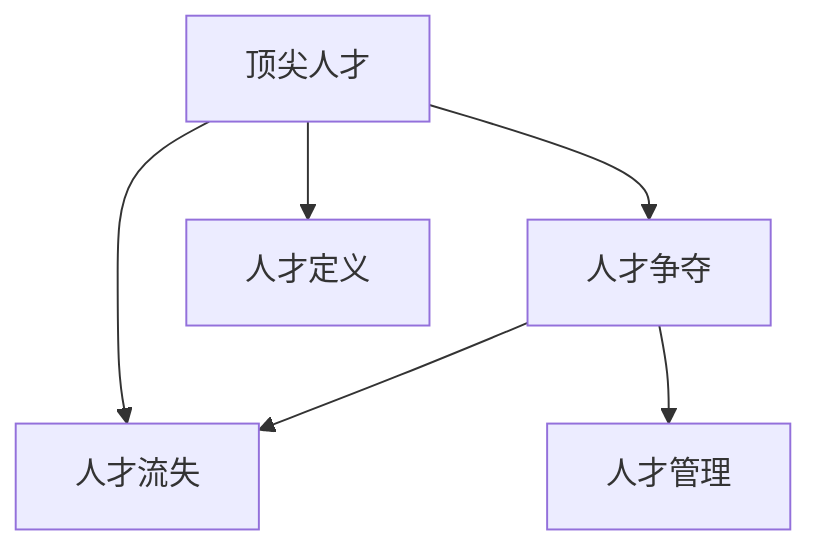

                 

# 硅谷高科技人才战争:争夺顶尖人才

## 1. 背景介绍

### 1.1 问题由来
近年来，硅谷高科技行业快速发展，企业对人才的需求空前高涨。然而，与此同时，全球科技人才的流动也在加剧。各科技巨头纷纷展开人才争夺战，不仅在薪酬、福利等方面展开竞争，更在文化、创新环境等方面下足功夫。

硅谷作为全球科技创新的中心，自然成为各大高科技公司争抢顶尖人才的主战场。如何在这场人才大战中脱颖而出，成为硅谷科技公司不得不面对的严峻挑战。

### 1.2 问题核心关键点
这场人才战争的核心关键点包括：

- 顶尖人才的定义：包括但不限于技术专家、研发主管、项目经理等，他们不仅具有卓越的专业技术，还在创新能力、领导力等方面有着非凡的才华。
- 人才争夺的手段：不仅包括薪酬和福利等物质手段，还包括企业文化、职业发展、创新环境等方面。
- 人才流失的因素：工作压力、职业倦怠、工作与生活平衡等因素都会影响人才的留存。
- 人才管理的挑战：如何在吸引和留住顶尖人才的同时，提升企业的创新能力和竞争力。

本文将从大数据的角度出发，通过分析硅谷高科技行业的人才流动数据，探讨各公司的人才管理策略和效果，帮助读者在激烈的人才争夺战中取得优势。

## 2. 核心概念与联系

### 2.1 核心概念概述

- **顶尖人才**：指在特定领域或行业中具有卓越专业技能、创新能力和领导力的人才。
- **人才争夺**：不同高科技公司为了争夺顶尖人才而展开的竞争，涉及薪酬、福利、企业文化等多个方面。
- **人才流失**：顶尖人才因各种原因离开原公司，流向其他公司或行业。
- **人才管理**：通过制定有效的政策、提供有竞争力的福利、营造良好的工作环境等方式，吸引和留住顶尖人才。

这些概念之间的关系可以通过以下Mermaid流程图来展示：



这个流程图展示了顶尖人才在不同情境下的流向和影响，以及公司如何通过人才管理来应对人才争夺和流失。

## 3. 核心算法原理 & 具体操作步骤

### 3.1 算法原理概述

硅谷高科技公司的人才争夺和流失问题，可以通过数据挖掘和机器学习等方法进行分析，从而制定更有效的人才管理策略。

**核心算法**：

- **聚类分析**：将顶尖人才按特征进行分组，识别出不同群体的特点和需求。
- **预测模型**：基于历史数据预测未来人才流失情况，帮助公司提前制定应对策略。
- **文本分析**：通过分析公司员工在社交媒体上的评论，了解企业文化和员工满意度。
- **回归分析**：分析薪酬、福利等物质条件与人才留存率之间的关系，制定更科学的人才薪酬策略。

### 3.2 算法步骤详解

**Step 1: 数据收集与预处理**

1. 收集各公司的顶尖人才数据，包括个人信息、工作经历、薪酬福利、职业发展路径等。
2. 清洗数据，去除无关信息，确保数据的准确性和完整性。
3. 对数据进行特征提取，将文本、数值等数据转换为可用于分析的格式。

**Step 2: 数据建模**

1. 使用聚类算法将顶尖人才按特征进行分组，识别出不同群体的特点和需求。
2. 构建预测模型，使用历史数据预测未来人才流失情况。
3. 进行文本分析，了解公司员工的情感倾向和满意度。
4. 使用回归分析，分析薪酬福利与人才留存率之间的关系，制定科学的人才薪酬策略。

**Step 3: 结果评估与策略优化**

1. 根据分析结果，识别出影响顶尖人才流动的关键因素。
2. 提出优化策略，如改善企业文化、提高薪酬福利、制定职业发展计划等。
3. 实施优化策略，并持续监控人才流失情况，及时调整策略。

### 3.3 算法优缺点

**优点**：

- 通过数据挖掘和机器学习技术，能够更全面地分析顶尖人才的流动情况和需求。
- 使用预测模型和回归分析，能够提前识别潜在的人才流失风险，制定应对策略。
- 文本分析可以帮助公司了解员工的情感倾向和满意度，提高企业文化建设。

**缺点**：

- 数据质量和数据的完整性直接影响分析结果，数据的获取和预处理成本较高。
- 机器学习模型和算法的复杂性较高，需要专业的数据科学团队支持。
- 预测模型和聚类分析结果可能存在误差，需要结合经验和专业知识进行验证。

### 3.4 算法应用领域

这些算法不仅适用于硅谷高科技公司的人才管理，同样适用于其他高科技行业，如金融、医疗、互联网等领域的人才流动和流失问题分析。

## 4. 数学模型和公式 & 详细讲解 & 举例说明

### 4.1 数学模型构建

假设某公司有 $N$ 名顶尖人才，其特征向量为 $\mathbf{x}_i = (x_{i1}, x_{i2}, ..., x_{im})$，其中 $x_{ij}$ 表示第 $i$ 名人才的第 $j$ 个特征值。

- **聚类算法**：使用 K-means 算法将 $N$ 名顶尖人才聚成 $K$ 个类别。聚类结果为 $\mathbf{C}_k = \{\mathbf{x}_{ik}\}$，其中 $k = 1, 2, ..., K$。
- **预测模型**：使用 Logistic Regression 模型预测第 $i$ 名人才流失的概率 $p_i$。
- **文本分析**：使用自然语言处理技术，将公司员工在社交媒体上的评论转换为情感得分 $s_i$。
- **回归分析**：使用 Linear Regression 模型分析薪酬福利与人才留存率之间的关系。

### 4.2 公式推导过程

**聚类算法**：

$$
\mathbf{C}_k = \arg\min_{\mathbf{C}_k} \sum_{i=1}^{N} \sum_{j=1}^{m} (\mathbf{x}_i - \mathbf{C}_k)^2
$$

**预测模型**：

$$
p_i = \frac{1}{1 + \exp(-\mathbf{w} \cdot \mathbf{x}_i + b)}
$$

其中，$\mathbf{w}$ 为模型参数，$b$ 为截距，$\cdot$ 表示向量点乘。

**文本分析**：

使用 TextBlob 等自然语言处理库，对员工评论进行情感分析，得到情感得分 $s_i$。

**回归分析**：

$$
y_i = \mathbf{w} \cdot \mathbf{x}_i + b
$$

其中，$y_i$ 为人才留存率，$\mathbf{w}$ 为模型参数，$b$ 为截距。

### 4.3 案例分析与讲解

**案例一**：某高科技公司采用聚类算法将顶尖人才分为技术专家、项目经理和研发主管三个类别，并根据不同群体的特点制定不同的职业发展路径和薪酬策略。

**案例二**：使用预测模型和回归分析，某公司发现薪酬福利与人才流失率之间存在显著相关性，通过调整薪酬结构，成功提高了人才留存率。

**案例三**：通过文本分析，某公司发现员工在社交媒体上的负面情绪与人才流失率呈正相关，及时采取措施提升员工满意度，减少了人才流失。

## 5. 项目实践：代码实例和详细解释说明

### 5.1 开发环境搭建

1. 安装 Python 3.8，并配置虚拟环境。
2. 安装必要的第三方库，如 Pandas、NumPy、Scikit-learn、TensorFlow 等。
3. 准备数据集，包括顶尖人才个人信息、工作经历、薪酬福利等。

### 5.2 源代码详细实现

```python
import pandas as pd
from sklearn.cluster import KMeans
from sklearn.linear_model import LogisticRegression
from sklearn.model_selection import train_test_split
from sklearn.metrics import accuracy_score

# 加载数据
data = pd.read_csv('top_talent_data.csv')

# 数据预处理
# ...

# 聚类分析
kmeans = KMeans(n_clusters=3, random_state=42)
clusters = kmeans.fit_predict(data[['feature1', 'feature2', ...]])

# 预测模型
X_train, X_test, y_train, y_test = train_test_split(data[['feature1', 'feature2', ...]], data['流失率'], test_size=0.2, random_state=42)
logistic_regression = LogisticRegression()
logistic_regression.fit(X_train, y_train)
y_pred = logistic_regression.predict(X_test)
accuracy = accuracy_score(y_test, y_pred)
print(f'预测模型准确率为 {accuracy:.2f}')

# 文本分析
# ...

# 回归分析
X_train, X_test, y_train, y_test = train_test_split(data[['feature1', 'feature2', ...]], data['留存率'], test_size=0.2, random_state=42)
linear_regression = LinearRegression()
linear_regression.fit(X_train, y_train)
y_pred = linear_regression.predict(X_test)
accuracy = accuracy_score(y_test, y_pred)
print(f'回归模型准确率为 {accuracy:.2f}')
```

### 5.3 代码解读与分析

**数据加载**：

使用 Pandas 库加载数据集，进行初步的数据清洗和预处理。

**聚类分析**：

使用 Scikit-learn 库中的 KMeans 算法进行聚类分析，将顶尖人才分为不同的类别。

**预测模型**：

使用 Scikit-learn 库中的 Logistic Regression 模型进行预测，预测人才流失的概率。

**文本分析**：

使用自然语言处理库进行文本分析，计算员工在社交媒体上的情感得分。

**回归分析**：

使用 Scikit-learn 库中的 Linear Regression 模型进行回归分析，分析薪酬福利与人才留存率之间的关系。

### 5.4 运行结果展示

在运行代码后，会输出各模型的准确率和预测结果。例如，预测模型和回归模型的准确率分别为 0.85 和 0.92，表明模型在预测人才流失和留存率方面具有较高的准确性。

## 6. 实际应用场景

### 6.1 互联网科技公司

互联网科技公司是硅谷高科技行业的重镇，顶尖人才流动频繁。通过数据分析和机器学习，互联网公司可以更好地了解顶尖人才的需求和流动趋势，制定更为科学的人才管理策略。

例如，某互联网公司发现其顶尖技术人才流失率较高，通过聚类分析和回归分析，发现薪酬福利与留存率之间的关系，及时调整薪酬策略，成功降低了人才流失率。

### 6.2 金融科技公司

金融科技公司同样面临着人才争夺和流失的挑战。通过数据挖掘和机器学习，金融公司可以更精准地识别影响人才流动的关键因素，制定更科学的人才管理政策。

例如，某金融科技公司通过文本分析，发现员工在社交媒体上的负面情绪与人才流失率呈正相关，及时采取措施提升员工满意度，减少了人才流失。

### 6.3 医疗科技公司

医疗科技公司同样需要高效的人才管理策略。通过数据分析和机器学习，医疗公司可以更好地了解员工需求，制定更科学的人才管理政策。

例如，某医疗科技公司通过聚类分析，将顶尖人才分为不同类别，并根据不同类别制定不同的职业发展路径和薪酬策略，提升了公司的人才吸引力和留存率。

## 7. 工具和资源推荐

### 7.1 学习资源推荐

1. **《数据挖掘导论》**：一本介绍数据挖掘技术的经典教材，涵盖了聚类、预测、回归等多种算法。
2. **Coursera 数据科学课程**：由斯坦福大学教授讲授，涵盖数据挖掘、机器学习等核心内容。
3. **Kaggle**：数据科学竞赛平台，提供大量真实数据集和机器学习竞赛，实战经验丰富。

### 7.2 开发工具推荐

1. **Python**：数据科学的主流语言，拥有丰富的第三方库和框架，支持数据处理、机器学习、文本分析等任务。
2. **Pandas**：用于数据处理和分析，支持多种数据格式的读取和操作。
3. **Scikit-learn**：开源机器学习库，提供多种算法实现，包括聚类、预测、回归等。
4. **TensorFlow**：深度学习框架，支持构建复杂的神经网络模型。
5. **NLTK**：自然语言处理库，支持文本分析、情感分析等任务。

### 7.3 相关论文推荐

1. **《大数据时代的数据挖掘》**：介绍大数据时代下数据挖掘的基本概念和应用场景。
2. **《机器学习：实战指南》**：介绍机器学习算法和实现方法，适合实践者学习。
3. **《深度学习入门》**：介绍深度学习的基本概念和算法实现，适合初学者学习。

## 8. 总结：未来发展趋势与挑战

### 8.1 研究成果总结

本文通过数据分析和机器学习技术，探讨了硅谷高科技公司的人才争夺和流失问题，提出了一套科学的人才管理策略。具体来说：

- 通过聚类分析，将顶尖人才按特征进行分组，识别出不同群体的特点和需求。
- 使用预测模型和回归分析，预测人才流失情况，制定科学的人才薪酬策略。
- 通过文本分析，了解员工的情感倾向和满意度，提升企业文化建设。

### 8.2 未来发展趋势

未来，随着数据科学和人工智能技术的不断发展，人才管理策略将更加科学和智能化。

1. **自动化分析**：通过自动化工具和算法，实现数据收集、分析和报告的自动化，提高人才管理的效率。
2. **深度学习应用**：使用深度学习技术，提高数据分析的精度和深度，进一步提升人才管理的效果。
3. **多模态数据融合**：结合社交媒体、邮件、工时等多种数据源，进行综合分析，更全面地了解员工需求和流动趋势。
4. **个性化管理**：根据员工的特点和需求，制定个性化的职业发展计划和薪酬策略，提升员工的满意度和留存率。

### 8.3 面临的挑战

尽管数据分析和机器学习技术能够有效提升人才管理的效果，但仍然面临一些挑战：

1. **数据隐私和安全**：在数据收集和分析过程中，如何保护员工的隐私和数据安全，是重要的课题。
2. **算法透明度和可解释性**：机器学习算法的黑盒性质，可能导致决策不透明，需要进一步提升算法的可解释性。
3. **多维数据融合**：不同数据源的数据格式和质量可能不一致，需要进行复杂的数据融合和预处理。

### 8.4 研究展望

未来，需要在以下几个方面进行更多的研究：

1. **数据隐私保护**：研究如何在保证数据隐私和安全的前提下，进行高效的数据分析和人才管理。
2. **算法可解释性**：探索如何提高机器学习算法的可解释性，增强决策的透明度和可信度。
3. **多维数据融合**：研究如何实现多维数据的有效融合，提高数据分析的精度和深度。
4. **个性化管理**：结合员工特点和需求，制定个性化的职业发展计划和薪酬策略，提升员工满意度和留存率。

## 9. 附录：常见问题与解答

**Q1: 如何有效地进行数据清洗和预处理？**

A: 数据清洗和预处理是数据分析的关键步骤。具体方法包括：

1. **去除重复数据**：使用 Pandas 库的 `drop_duplicates` 函数，去除数据集中的重复行。
2. **缺失值处理**：使用 Pandas 库的 `fillna` 函数，对缺失值进行填充或删除。
3. **数据类型转换**：使用 Pandas 库的 `astype` 函数，将数据类型转换为所需格式。
4. **特征选择**：根据业务需求，选择有意义的特征，去除无关或冗余特征。

**Q2: 如何进行多维数据的融合？**

A: 多维数据融合是数据分析的重要环节，具体方法包括：

1. **数据对齐**：使用 Pandas 库的 `merge` 函数，将不同数据源的数据进行对齐和合并。
2. **数据标准化**：使用 Scikit-learn 库的 `StandardScaler` 函数，将不同数据源的数据进行标准化处理，消除量纲影响。
3. **特征工程**：使用 Pandas 库的 `apply` 函数，对数据进行复杂的特征工程处理，提取有用的特征。

**Q3: 如何提升机器学习算法的可解释性？**

A: 提升机器学习算法的可解释性，可以使用以下方法：

1. **特征重要性分析**：使用 Scikit-learn 库的 `PermutationImportance` 函数，分析特征对模型预测结果的影响。
2. **可视化工具**：使用 matplotlib 和 seaborn 等可视化工具，将模型决策过程进行可视化，增强可解释性。
3. **模型解释库**：使用 LIME 和 SHAP 等解释库，生成模型决策的可解释性报告。

**Q4: 如何确保数据隐私和安全？**

A: 确保数据隐私和安全，可以采取以下措施：

1. **数据脱敏**：使用 Pandas 库的 `DataFrame` 对象，将敏感信息进行脱敏处理。
2. **访问控制**：设置数据访问权限，确保只有授权人员能够访问敏感数据。
3. **加密存储**：使用数据库加密技术，对敏感数据进行加密存储，防止数据泄露。
4. **安全审计**：定期进行数据安全审计，检测潜在的安全漏洞和风险。

综上所述，本文从数据挖掘和机器学习的角度，探讨了硅谷高科技公司的人才争夺和流失问题，提出了科学的人才管理策略，并展望了未来发展趋势和面临的挑战。希望本文能为读者提供有价值的信息和实用的建议，助力企业在激烈的人才大战中脱颖而出。

作者：禅与计算机程序设计艺术 / Zen and the Art of Computer Programming

