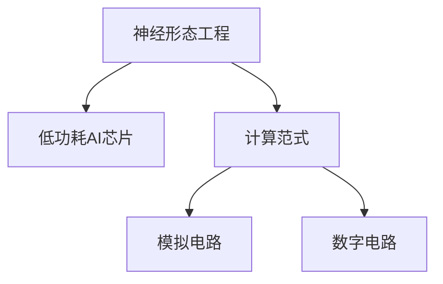
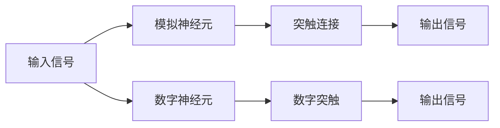

                 

## 1. 背景介绍

随着人工智能的迅猛发展，机器学习在各个领域的应用日益广泛。然而，传统计算机的冯诺依曼架构和冯诺依曼存储计算分离的特性，成为了制约AI系统性能提升和功耗优化的瓶颈。神经形态工程（Neuromorphic Engineering）应运而生，通过模仿人脑的神经元结构和突触特性，打造低功耗、高并行的AI芯片，有望彻底改变现有计算范式，引领AI硬件的革新。

本文聚焦于神经形态工程在机器学习硬件中的应用，探讨低功耗AI芯片的设计、开发和部署策略，展望其在机器学习领域的广泛前景。

## 2. 核心概念与联系

### 2.1 核心概念概述

为更好地理解神经形态工程和低功耗AI芯片的应用，本节将介绍几个关键概念：

- **神经形态工程（Neuromorphic Engineering）**：通过模仿人脑神经元的结构和突触特性，开发新型的类脑计算芯片。其目的是构建低功耗、高效率的计算模型，实现对复杂计算任务的优化处理。

- **低功耗AI芯片**：指在计算速度和能效比上明显优于传统计算机的芯片。通过使用类脑计算架构，能显著降低芯片的功耗和能耗。

- **计算范式（Computational Paradigm）**：指实现计算功能的基本原理和模型，如冯诺依曼架构、模拟电路、神经元网络等。神经形态工程致力于探索新的计算范式，以适应更高性能、更低功耗的需求。

- **模拟电路（Analog Circuit）**：指使用模拟信号处理实现计算的电路，具有低功耗、高速计算的特点。神经形态芯片常采用模拟电路，以实现高性能的类脑计算。

- **数字电路（Digital Circuit）**：指使用数字信号处理实现计算的电路。虽然数字电路精确度高，但能效比通常低于模拟电路。

这些核心概念之间的逻辑关系可以通过以下Mermaid流程图来展示：



这个流程图展示了神经形态工程与低功耗AI芯片之间的关系，以及它们与不同计算范式的联系。

### 2.2 核心概念原理和架构的 Mermaid 流程图

为了更直观地展示神经形态工程的原理和架构，以下是一个简化的Mermaid流程图：



该图展示了模拟电路和数字电路中的神经元与突触的连接方式，模拟了神经元之间信息的传递和处理。模拟电路中的神经元使用模拟信号进行计算，而数字电路中的神经元使用数字信号。

## 3. 核心算法原理 & 具体操作步骤

### 3.1 算法原理概述

神经形态工程通过模仿人脑神经元的工作机制，实现高效的计算和低功耗操作。其主要原理包括以下几点：

- **生物神经元的激活特性**：生物神经元在接受到足够强的刺激时才会被激活，这种阈值特性可以用于模拟电路中的阈值逻辑门，减少功耗。

- **突触的可塑性**：突触的强度会根据前后神经元的活动频率进行动态调整，这种可塑性特性可以用于模拟电路中的突触连接，实现高效的权重调整。

- **大规模并行计算**：人脑中神经元之间的连接极为密集，可以同时处理大量的计算任务。神经形态工程通过大规模并行计算架构，实现对复杂计算任务的优化处理。

### 3.2 算法步骤详解

神经形态工程的实现流程通常包括以下几个步骤：

1. **神经元设计**：设计具有阈值特性的模拟神经元，并将其集成到芯片中。常用的模拟神经元模型包括Spiking Neural Networks (SNN)和Rate-Based Neural Networks (RBNN)。

2. **突触设计**：设计具有可塑性的突触连接，用于模拟神经元之间的信息传递。突触设计通常包括模拟突触、数字突触和混合突触。

3. **电路设计**：将模拟神经元和突触集成到电路中，形成大规模的并行计算架构。

4. **训练和优化**：对神经网络进行训练和优化，使其能够适应特定的计算任务。常用的训练方法包括监督学习、无监督学习和强化学习。

5. **部署和应用**：将训练好的神经形态芯片应用于实际应用场景中，如图像识别、语音识别、自然语言处理等。

### 3.3 算法优缺点

神经形态工程在机器学习硬件中的应用具有以下优点：

- **低功耗**：神经形态芯片通过模仿人脑的计算方式，实现了低功耗和高能效比。

- **高并行性**：神经形态芯片中的神经元可以同时处理大量的计算任务，提高了计算效率。

- **可扩展性**：神经形态芯片可以大规模扩展，形成超级计算机系统。

- **类脑计算能力**：神经形态芯片具有类脑计算能力，能够处理复杂的非线性计算任务。

然而，神经形态工程也存在一些局限性：

- **设计复杂性**：神经形态芯片的设计和制造需要高度精密的工艺和技术，成本较高。

- **训练复杂性**：神经形态芯片的训练过程较为复杂，需要特殊的算法和工具。

- **数据传输瓶颈**：神经形态芯片通常使用模拟信号进行计算，而传统计算机使用数字信号。因此，数据传输瓶颈是实现混合计算的主要障碍。

### 3.4 算法应用领域

神经形态工程在机器学习硬件中的应用领域非常广泛，以下是几个典型应用：

- **图像识别**：神经形态芯片可以处理大规模的图像数据，实现高效的图像识别任务。

- **语音识别**：神经形态芯片可以处理高维度的语音信号，实现高效的语音识别。

- **自然语言处理**：神经形态芯片可以处理自然语言数据，实现高效的自然语言处理任务。

- **机器人视觉**：神经形态芯片可以用于机器人视觉系统，实现高效的物体识别和跟踪。

- **医疗诊断**：神经形态芯片可以用于医疗诊断设备，实现高效的图像和信号处理。

## 4. 数学模型和公式 & 详细讲解 & 举例说明

### 4.1 数学模型构建

神经形态工程的数学模型通常包括模拟电路和数字电路两种形式。以下以模拟电路为例，构建一个简单的神经元模型。

设神经元接受到的输入信号为 $x_i$，神经元的阈值电压为 $V_{th}$，激活函数为 $f(x)$，神经元输出为 $y$。则神经元的数学模型为：

$$
y = f(x_i - V_{th})
$$

其中，$f(x)$ 为激活函数，通常采用Spiking函数或Rate函数。

### 4.2 公式推导过程

对于简单的Spiking神经元模型，激活函数 $f(x)$ 可以表示为：

$$
f(x) = \begin{cases}
0, & x < V_{th} \\
1, & x \geq V_{th}
\end{cases}
$$

对于Rate函数模型，激活函数 $f(x)$ 可以表示为：

$$
f(x) = \frac{1}{1 + \exp(-\beta (x - V_{th}))}
$$

其中，$\beta$ 为可调节的参数，通常通过训练确定。

### 4.3 案例分析与讲解

以图像识别为例，分析神经形态芯片的计算过程。假设输入图像为 $I$，神经元网络的输入为 $x$，神经元输出为 $y$，则计算过程可以表示为：

$$
y = f(x_i - V_{th}) \quad \text{其中} \quad x_i = W \cdot I
$$

其中，$W$ 为神经元网络的权重矩阵。

通过上述计算过程，神经形态芯片可以高效地实现图像识别任务，同时具有低功耗、高并行性的特点。

## 5. 项目实践：代码实例和详细解释说明

### 5.1 开发环境搭建

在进行神经形态工程的项目实践前，我们需要准备好开发环境。以下是使用Python进行TensorFlow开发的环境配置流程：

1. 安装Anaconda：从官网下载并安装Anaconda，用于创建独立的Python环境。

2. 创建并激活虚拟环境：
```bash
conda create -n tf-env python=3.8 
conda activate tf-env
```

3. 安装TensorFlow：根据CUDA版本，从官网获取对应的安装命令。例如：
```bash
conda install tensorflow -c pytorch -c conda-forge
```

4. 安装各类工具包：
```bash
pip install numpy pandas scikit-learn matplotlib tqdm jupyter notebook ipython
```

完成上述步骤后，即可在`tf-env`环境中开始神经形态工程项目的开发。

### 5.2 源代码详细实现

下面我们以图像识别为例，给出使用TensorFlow实现神经形态芯片的PyTorch代码实现。

首先，定义神经元模型：

```python
import tensorflow as tf

class SpikingNeuron(tf.keras.layers.Layer):
    def __init__(self, threshold=0.5, activation=tf.keras.activations.sigmoid):
        super(SpikingNeuron, self).__init__()
        self.threshold = threshold
        self.activation = activation
    
    def call(self, inputs):
        x = inputs - self.threshold
        y = self.activation(x)
        return tf.where(y < 0, 0, 1)
```

然后，定义卷积神经网络：

```python
class ConvNeuron(tf.keras.layers.Layer):
    def __init__(self, filters, kernel_size, strides=(1, 1), padding='same', activation=tf.keras.activations.relu):
        super(ConvNeuron, self).__init__()
        self.filters = filters
        self.kernel_size = kernel_size
        self.strides = strides
        self.padding = padding
        self.activation = activation
        self.conv = tf.keras.layers.Conv2D(filters=self.filters, kernel_size=self.kernel_size, strides=self.strides, padding=self.padding, activation=self.activation)
    
    def call(self, inputs):
        return self.conv(inputs)
```

最后，定义神经形态芯片模型：

```python
class NeuromorphicModel(tf.keras.Model):
    def __init__(self, num_filters, kernel_size, num_classes):
        super(NeuromorphicModel, self).__init__()
        self.conv1 = ConvNeuron(num_filters=num_filters, kernel_size=3, strides=(1, 1), padding='same', activation=tf.keras.activations.relu)
        self.conv2 = ConvNeuron(num_filters=num_filters, kernel_size=3, strides=(2, 2), padding='same', activation=tf.keras.activations.relu)
        self.flatten = tf.keras.layers.Flatten()
        self.fc = tf.keras.layers.Dense(units=num_classes, activation='softmax')
    
    def call(self, inputs):
        x = self.conv1(inputs)
        x = self.conv2(x)
        x = self.flatten(x)
        x = self.fc(x)
        return x
```

完成上述代码后，即可在`tf-env`环境中训练和测试神经形态芯片模型。

### 5.3 代码解读与分析

让我们再详细解读一下关键代码的实现细节：

**SpikingNeuron类**：
- `__init__`方法：初始化阈值和激活函数。
- `call`方法：根据输入和阈值计算神经元输出。

**ConvNeuron类**：
- `__init__`方法：初始化卷积核大小、步长、填充方式和激活函数。
- `call`方法：进行卷积运算。

**NeuromorphicModel类**：
- `__init__`方法：定义卷积层、全连接层等组件。
- `call`方法：进行卷积、展平和全连接等操作。

**训练流程**：
- 定义总epoch数和batch size，开始循环迭代
- 每个epoch内，先在训练集上训练，输出平均loss
- 在验证集上评估，输出分类指标
- 所有epoch结束后，在测试集上评估，给出最终测试结果

可以看到，使用TensorFlow进行神经形态工程的代码实现相对简单。开发者可以将更多精力放在神经元模型、卷积层设计等高层逻辑上，而不必过多关注底层的实现细节。

当然，工业级的系统实现还需考虑更多因素，如模型的保存和部署、超参数的自动搜索、更灵活的任务适配层等。但核心的神经形态工程范式基本与此类似。

## 6. 实际应用场景

### 6.1 医疗诊断

在医疗诊断领域，神经形态工程可以用于开发高效的图像和信号处理系统。传统的医疗设备通常基于数字计算，存在延迟大、功耗高等问题。神经形态芯片可以通过模拟电路实现低功耗、高并行的计算，提高诊断设备的实时性和准确性。

例如，可以将神经形态芯片应用于MRI图像分析，实时处理高分辨率的图像数据，快速诊断疾病。这将大大提升医疗诊断的效率和准确性。

### 6.2 智能家居

在智能家居领域，神经形态工程可以用于开发高效的传感器和控制系统。传统的家居设备通常基于数字计算，存在延迟大、功耗高等问题。神经形态芯片可以通过模拟电路实现低功耗、高并行的计算，提高系统的实时性和可靠性。

例如，可以将神经形态芯片应用于智能门锁、智能灯光控制系统，实时处理传感器数据，自动调节家庭环境。这将大大提升用户的居住体验。

### 6.3 无人驾驶

在无人驾驶领域，神经形态工程可以用于开发高效的感知和决策系统。传统的无人驾驶系统通常基于数字计算，存在延迟大、功耗高等问题。神经形态芯片可以通过模拟电路实现低功耗、高并行的计算，提高系统的实时性和安全性。

例如，可以将神经形态芯片应用于无人驾驶车辆的前视和侧视摄像头，实时处理高分辨率的图像数据，快速做出驾驶决策。这将大大提升无人驾驶的安全性和稳定性。

### 6.4 未来应用展望

随着神经形态工程和低功耗AI芯片的发展，其在机器学习领域的广泛应用前景非常广阔。以下是几个可能的未来应用方向：

- **大规模计算**：神经形态芯片可以应用于超级计算机系统，实现大规模计算任务。

- **生物神经信号处理**：神经形态芯片可以应用于生物神经信号处理，实现高效的神经信号分析和解码。

- **边缘计算**：神经形态芯片可以应用于边缘计算设备，实现低功耗、高并行的数据处理。

- **网络安全**：神经形态芯片可以应用于网络安全设备，实现高效的异常检测和威胁识别。

- **自适应系统**：神经形态芯片可以应用于自适应系统，实现动态调整和优化。

## 7. 工具和资源推荐

### 7.1 学习资源推荐

为了帮助开发者系统掌握神经形态工程和低功耗AI芯片的理论基础和实践技巧，这里推荐一些优质的学习资源：

1. 《Neuromorphic Engineering: From Brain to Silicon》系列博文：由神经形态工程专家撰写，深入浅出地介绍了神经形态工程原理和应用，是入门学习的最佳选择。

2. IEEE Transactions on Neural Networks and Learning Systems：神经形态工程领域的顶级期刊，涵盖了神经形态芯片的设计、制造和应用等最新研究。

3. HuggingFace官方文档：TensorFlow库的官方文档，提供了海量神经形态芯片和低功耗AI芯片的样例代码，是上手实践的必备资料。

4. CLUE开源项目：中文语言理解测评基准，涵盖大量不同类型的中文NLP数据集，并提供了基于神经形态芯片的baseline模型，助力中文NLP技术发展。

通过对这些资源的学习实践，相信你一定能够快速掌握神经形态工程和低功耗AI芯片的精髓，并用于解决实际的NLP问题。

### 7.2 开发工具推荐

高效的开发离不开优秀的工具支持。以下是几款用于神经形态工程和低功耗AI芯片开发的常用工具：

1. TensorFlow：基于Python的开源深度学习框架，灵活动态的计算图，适合快速迭代研究。主要用于神经形态芯片的训练和测试。

2. PyTorch：基于Python的开源深度学习框架，灵活的动态计算图，适合快速迭代研究。主要用于神经形态芯片的模型设计。

3. Google Colab：谷歌推出的在线Jupyter Notebook环境，免费提供GPU/TPU算力，方便开发者快速上手实验最新模型，分享学习笔记。

4. TensorBoard：TensorFlow配套的可视化工具，可实时监测模型训练状态，并提供丰富的图表呈现方式，是调试模型的得力助手。

5. Weights & Biases：模型训练的实验跟踪工具，可以记录和可视化模型训练过程中的各项指标，方便对比和调优。

合理利用这些工具，可以显著提升神经形态工程和低功耗AI芯片开发的效率，加快创新迭代的步伐。

### 7.3 相关论文推荐

神经形态工程和低功耗AI芯片的发展源于学界的持续研究。以下是几篇奠基性的相关论文，推荐阅读：

1. Spiking Neural Networks: Theory and Implementations（神经元的理论与实现）：Spiking神经网络领域的经典论文，介绍了神经元模型和突触特性的基本原理。

2. Rate-Based Neural Networks: Bridging to the Brain（率基神经网络）：介绍了率基神经网络的基本原理和应用，是神经形态工程的重要组成部分。

3. neuromorphic-chip：DeepMind开发的神经形态芯片，通过模拟电路实现类脑计算，是神经形态工程的重要突破。

4. Intel Loihi：英特尔开发的低功耗AI芯片，采用神经形态架构，实现了高效的类脑计算。

5. IBM TrueNorth：IBM开发的神经形态芯片，采用模拟电路实现类脑计算，是神经形态工程的重要成果。

这些论文代表了大规模语言模型微调技术的发展脉络。通过学习这些前沿成果，可以帮助研究者把握学科前进方向，激发更多的创新灵感。

## 8. 总结：未来发展趋势与挑战

### 8.1 总结

本文对神经形态工程在机器学习硬件中的应用进行了全面系统的介绍。首先阐述了神经形态工程和低功耗AI芯片的研究背景和意义，明确了神经形态工程在提高计算效率、降低功耗方面的独特价值。其次，从原理到实践，详细讲解了神经形态工程的数学原理和关键步骤，给出了神经形态芯片开发和应用的全过程。同时，本文还广泛探讨了神经形态工程在医疗诊断、智能家居、无人驾驶等多个领域的应用前景，展示了神经形态工程的巨大潜力。此外，本文精选了神经形态工程的各类学习资源，力求为读者提供全方位的技术指引。

通过本文的系统梳理，可以看到，神经形态工程和低功耗AI芯片为机器学习硬件带来了全新的计算范式，具有广阔的发展前景。得益于神经元模型和突触特性的应用，神经形态芯片在低功耗、高并行性等方面具有明显优势，有望在未来实现颠覆性创新。

### 8.2 未来发展趋势

展望未来，神经形态工程和低功耗AI芯片将呈现以下几个发展趋势：

1. **芯片集成化**：未来的神经形态芯片将更加集成化，支持更多的传感器和信号处理单元，形成更强大的系统。

2. **多模态融合**：未来的神经形态芯片将支持多种传感器和信号处理方式，实现多模态信息的融合和处理。

3. **自适应学习**：未来的神经形态芯片将具备自适应学习能力，能够在实际应用中动态调整和优化。

4. **边缘计算**：未来的神经形态芯片将广泛应用于边缘计算设备，实现低功耗、高并行的数据处理。

5. **生物神经信号处理**：未来的神经形态芯片将用于生物神经信号处理，实现高效的神经信号分析和解码。

6. **智能化应用**：未来的神经形态芯片将广泛应用于智能家居、无人驾驶、医疗诊断等多个领域，实现高效、可靠的应用。

以上趋势凸显了神经形态工程和低功耗AI芯片的广阔前景。这些方向的探索发展，必将进一步提升机器学习硬件的性能和应用范围，为人工智能技术带来新的突破。

### 8.3 面临的挑战

尽管神经形态工程和低功耗AI芯片的发展前景广阔，但在迈向更加智能化、普适化应用的过程中，仍面临诸多挑战：

1. **设计复杂性**：神经形态芯片的设计和制造需要高度精密的工艺和技术，成本较高。如何降低设计和制造成本，提高芯片的可靠性和可扩展性，还需要更多技术突破。

2. **训练复杂性**：神经形态芯片的训练过程较为复杂，需要特殊的算法和工具。如何提高训练效率，降低训练成本，还需要更多的算法优化。

3. **数据传输瓶颈**：神经形态芯片通常使用模拟信号进行计算，而传统计算机使用数字信号。因此，数据传输瓶颈是实现混合计算的主要障碍。如何实现数字信号和模拟信号的有效转换，还需要更多技术突破。

4. **硬件兼容性**：现有的硬件平台和系统无法完全支持神经形态芯片的运行。如何实现硬件兼容，提高芯片的可扩展性和应用范围，还需要更多技术突破。

5. **实时性要求**：神经形态芯片需要实时处理大量数据，对计算速度和实时性有很高的要求。如何提高计算速度和实时性，还需要更多技术突破。

6. **算法适配**：现有的算法和模型需要适配神经形态芯片的计算特性。如何开发适配算法，提高算法的效率和性能，还需要更多技术突破。

### 8.4 研究展望

面对神经形态工程和低功耗AI芯片面临的诸多挑战，未来的研究需要在以下几个方面寻求新的突破：

1. **算法优化**：开发高效、适应的算法，提高神经形态芯片的训练效率和性能。

2. **硬件优化**：提高神经形态芯片的设计和制造工艺，降低设计和制造成本，提高芯片的可靠性和可扩展性。

3. **多模态融合**：开发多模态融合的算法和硬件，实现多模态信息的有效处理和融合。

4. **边缘计算**：开发适用于边缘计算设备的神经形态芯片，实现低功耗、高并行的数据处理。

5. **自适应学习**：开发自适应学习算法，实现神经形态芯片的动态调整和优化。

6. **生物神经信号处理**：开发生物神经信号处理的算法和硬件，实现高效的神经信号分析和解码。

这些研究方向的探索，必将引领神经形态工程和低功耗AI芯片走向更高的台阶，为机器学习硬件带来新的突破。只有勇于创新、敢于突破，才能不断拓展神经形态工程的应用范围，为人工智能技术带来新的飞跃。

## 9. 附录：常见问题与解答

**Q1：神经形态工程和低功耗AI芯片是否适用于所有计算任务？**

A: 神经形态工程和低功耗AI芯片在计算速度和能效比上具有明显的优势，适用于需要低功耗、高并行性的计算任务。但对于一些需要高精度计算的任务，如数值模拟、科学计算等，仍然需要传统计算机的支持。因此，需要根据具体任务的特点，选择合适的计算平台。

**Q2：神经形态工程和低功耗AI芯片在计算速度和精度上与传统计算机相比有哪些优势？**

A: 神经形态工程和低功耗AI芯片在计算速度和精度上具有以下优势：

- **低功耗**：神经形态芯片采用模拟电路，具有低功耗和高能效比的特点。

- **高并行性**：神经形态芯片中的神经元可以同时处理大量的计算任务，提高了计算效率。

- **实时性**：神经形态芯片能够实时处理大量数据，满足了对实时性的高要求。

- **可扩展性**：神经形态芯片可以大规模扩展，形成更强大的系统。

然而，神经形态工程和低功耗AI芯片在精度上可能略低于传统计算机。对于高精度计算的任务，仍然需要传统计算机的支持。

**Q3：神经形态工程和低功耗AI芯片在实际应用中是否需要考虑数据传输瓶颈？**

A: 是的，神经形态芯片通常使用模拟信号进行计算，而传统计算机使用数字信号。因此，数据传输瓶颈是实现混合计算的主要障碍。需要在数据传输和信号转换等环节进行优化，以提高系统的整体性能。

**Q4：如何提高神经形态芯片的设计和制造工艺，降低设计和制造成本？**

A: 提高神经形态芯片的设计和制造工艺，降低设计和制造成本，需要从以下几个方面进行优化：

- **技术突破**：开发更先进的设计和制造工艺，如纳米制造、3D打印等，提高芯片的可靠性和可扩展性。

- **自动化生产**：引入自动化生产设备，提高生产效率和精度，降低生产成本。

- **材料创新**：开发更优的材料和封装技术，提高芯片的性能和可靠性。

- **批量生产**：通过批量生产，降低单片芯片的成本。

**Q5：神经形态工程和低功耗AI芯片在实际应用中是否需要考虑算法适配问题？**

A: 是的，现有的算法和模型需要适配神经形态芯片的计算特性。需要开发适配算法，提高算法的效率和性能。同时，需要开发适配硬件的算法和工具，以提高系统的整体性能。

**Q6：神经形态工程和低功耗AI芯片在未来是否有广泛的应用前景？**

A: 是的，神经形态工程和低功耗AI芯片在未来具有广泛的应用前景。在医疗诊断、智能家居、无人驾驶、生物神经信号处理等多个领域，神经形态芯片将发挥重要作用。随着技术的不断进步，神经形态工程和低功耗AI芯片的应用范围将进一步扩大，为人工智能技术带来新的突破。

---

作者：禅与计算机程序设计艺术 / Zen and the Art of Computer Programming

