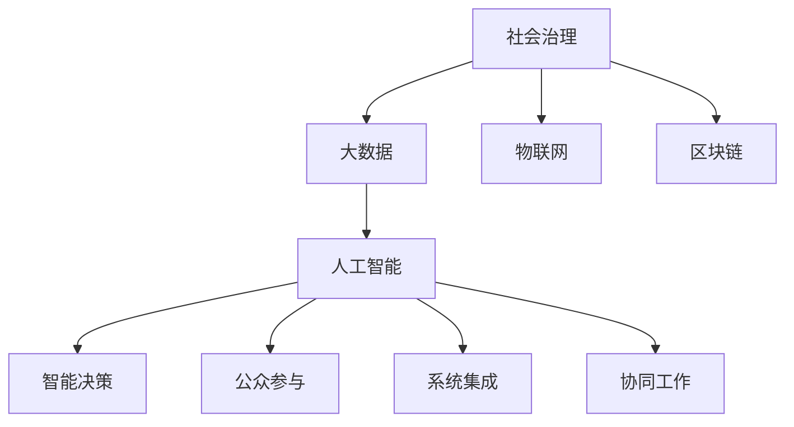

                 

# 科技创新：社会治理的新思路

## 1. 背景介绍

### 1.1 问题由来

随着信息技术的高速发展，社会治理面临日益复杂多变的形势。传统依靠人工处理的信息管理模式已难以适应现代社会的快速发展和海量数据的要求。近年来，大数据、人工智能等新兴技术在社会治理领域的应用，正在逐步改变这一局面。然而，这些技术尚未被系统整合，缺乏统一的治理框架，影响了其应用效率和效果。

### 1.2 问题核心关键点

面对这一问题，如何借助科技创新构建高效、智能、透明的社会治理体系，成为当下研究的热点。关键在于以下四个方面：

1. **数据整合与共享**：社会治理需要各类信息源的数据支持，如何将数据整合起来并实现跨部门、跨地域的共享是关键。
2. **智能决策支持**：如何利用人工智能技术辅助政府决策，提升决策的科学性和有效性。
3. **公众参与与反馈**：如何构建开放平台，鼓励公众参与社会治理，并及时反馈处理结果。
4. **系统集成与协同**：如何将多个信息系统和应用整合，实现数据流通和协同工作。

本文旨在通过分析社会治理面临的关键挑战和潜在需求，探索通过科技创新构建现代化社会治理框架的思路和方法。

## 2. 核心概念与联系

### 2.1 核心概念概述

为更好地理解社会治理的科技创新思路，本节将介绍几个关键概念：

- **社会治理**：指通过政府、市场、社会组织和个人等多元主体协同合作，维护社会秩序、促进社会公平、保障公民权益的过程。
- **大数据**：指规模巨大、类型多样、价值密度低的数据集合，通过数据挖掘、分析等技术手段，可以揭示隐藏在数据背后的规律和趋势。
- **人工智能**：通过机器学习、深度学习等技术，使计算机具备学习、推理、决策等智能行为，可以模拟人类思维方式，解决复杂问题。
- **物联网(IoT)**：通过互联网将传感器、设备和系统连接起来，实现物理世界的数字化和智能化。
- **区块链**：一种分布式账本技术，能够保障数据的透明性、不可篡改性和去中心化管理。

这些概念之间通过数据、计算、网络和信任等关键要素相互连接，共同构成了社会治理的科技创新框架。

### 2.2 核心概念原理和架构的 Mermaid 流程图



这个流程图展示了社会治理的关键概念及其相互关系：

1. **社会治理**：为数据和人工智能的应用提供了目标和方向。
2. **大数据**：通过物联网、区块链等技术获取和整合数据。
3. **人工智能**：对大数据进行分析和处理，辅助智能决策。
4. **物联网**：实现物理世界的数字化，提供实时数据支持。
5. **区块链**：保障数据透明性和去中心化，增强信任度。
6. **智能决策**：利用人工智能技术辅助政府决策，提高科学性。
7. **公众参与**：构建开放平台，鼓励公众参与。
8. **系统集成**：实现多部门、多系统的协同工作。

这些概念通过数据流和信息流相互连接，形成一个闭环，为社会治理提供了全面的技术支撑。

## 3. 核心算法原理 & 具体操作步骤

### 3.1 算法原理概述

社会治理的科技创新思路，主要依赖于数据驱动和智能决策。通过大数据、人工智能、物联网、区块链等技术，实现数据的集成、分析、共享和应用，为社会治理提供科学、透明、高效的管理手段。

### 3.2 算法步骤详解

1. **数据采集与整合**：利用物联网技术，通过传感器、摄像头、GPS等设备，实时采集各类社会数据。同时，将不同来源的数据整合到统一的数据仓库中，实现跨部门、跨地域的数据共享。

2. **数据清洗与预处理**：对采集的数据进行清洗、去重、规范化等预处理工作，确保数据的质量和一致性。

3. **数据分析与挖掘**：应用大数据技术，如Hadoop、Spark等，对清洗后的数据进行挖掘和分析，识别出潜在问题、趋势和规律。

4. **智能决策支持**：通过人工智能技术，如机器学习、深度学习等，构建智能决策模型，辅助政府决策。

5. **系统集成与协同**：利用微服务架构、API网关等技术，实现不同信息系统之间的集成和协同工作。

6. **公众参与与反馈**：建立开放平台，如政府网站、社交媒体等，鼓励公众参与社会治理，并及时反馈处理结果。

### 3.3 算法优缺点

**优点**：

1. **效率提升**：通过数据驱动和智能决策，提高社会治理的效率和效果。
2. **透明度增强**：数据透明性和公开性，增强了政府决策的透明度和公信力。
3. **协同性增强**：系统集成与协同，实现跨部门、跨地域的协同工作。
4. **风险降低**：利用人工智能技术，及时发现和预警风险，减少安全隐患。

**缺点**：

1. **技术复杂**：涉及大数据、人工智能、物联网、区块链等技术，需要较高的技术储备和实施成本。
2. **数据隐私**：数据采集和共享过程中，可能涉及个人隐私和数据安全问题。
3. **技术依赖**：社会治理的创新思路依赖于先进技术，技术故障可能影响治理效果。
4. **公众信任**：公众对新技术的信任度需要时间和验证，初期可能面临接受度不足的问题。

### 3.4 算法应用领域

社会治理的科技创新思路，已经在多个领域得到应用，包括但不限于：

- **智慧城市**：利用物联网、人工智能等技术，实现城市管理、交通、环境监测、公共安全等方面的智能化。
- **公共健康**：通过大数据分析，预测疾病爆发趋势，提供精准的公共卫生服务。
- **社会安全**：利用人工智能技术，分析社会动态，预警安全风险，提升社会治安水平。
- **环境保护**：通过数据分析，监测生态环境变化，制定环境保护政策。
- **教育治理**：利用智能教育平台，提供个性化教育服务，提升教育公平性和质量。
- **金融监管**：利用大数据和区块链技术，实现金融市场的透明监管，防范金融风险。

这些应用领域展示了社会治理科技创新思路的广泛适用性和巨大潜力。

## 4. 数学模型和公式 & 详细讲解 & 举例说明

### 4.1 数学模型构建

社会治理的科技创新，可以从数据驱动和智能决策两个方面构建数学模型。

**数据驱动模型**：

- **输入**：原始数据集 $D=\{(x_i, y_i)\}_{i=1}^N$，其中 $x_i$ 为输入特征向量，$y_i$ 为标签。
- **目标**：构建预测模型 $f(x)$，使得 $f(x_i) \approx y_i$。

**智能决策模型**：

- **输入**：历史数据集 $D_h=\{(x_h, y_h)\}_{h=1}^M$，其中 $x_h$ 为输入特征向量，$y_h$ 为决策结果。
- **目标**：构建决策模型 $g(x)$，使得 $g(x) \approx y_h$。

### 4.2 公式推导过程

**数据驱动模型的推导**：

设数据集 $D$ 的训练集为 $D_{train}=\{(x_i, y_i)\}_{i=1}^N$，测试集为 $D_{test}=\{(x_i, y_i)\}_{i=1}^M$。利用最小二乘法，求预测模型 $f(x)$ 的参数 $\theta$，使得误差最小化：

$$
\theta = \mathop{\arg\min}_{\theta} \frac{1}{M} \sum_{i=1}^M (f(x_i, \theta) - y_i)^2
$$

其中 $f(x_i, \theta)$ 为预测函数，$\theta$ 为模型参数。

**智能决策模型的推导**：

设历史数据集 $D_h$ 的训练集为 $D_{train_h}=\{(x_h, y_h)\}_{h=1}^M$，测试集为 $D_{test_h}=\{(x_h, y_h)\}_{h=1}^M$。利用最小二乘法，求决策模型 $g(x)$ 的参数 $\theta$，使得误差最小化：

$$
\theta = \mathop{\arg\min}_{\theta} \frac{1}{M} \sum_{h=1}^M (g(x_h, \theta) - y_h)^2
$$

其中 $g(x_h, \theta)$ 为决策函数，$\theta$ 为模型参数。

### 4.3 案例分析与讲解

以智慧城市为例，其数据驱动和智能决策模型如下：

**数据驱动模型**：

- **输入**：城市交通流量、空气质量、公共服务使用数据等。
- **目标**：预测未来交通拥堵情况、环境污染水平、公共服务需求等。

**智能决策模型**：

- **输入**：历史交通流量、环境污染水平、公共服务需求数据等。
- **目标**：制定交通管理策略、环境治理措施、公共服务规划等。

## 5. 项目实践：代码实例和详细解释说明

### 5.1 开发环境搭建

社会治理科技创新涉及多个技术领域，需要以下开发环境：

1. **大数据技术**：Hadoop、Spark等分布式计算框架。
2. **人工智能技术**：TensorFlow、PyTorch等深度学习框架。
3. **物联网技术**：IoT平台、传感器设备。
4. **区块链技术**：Hyperledger、Ethereum等区块链平台。

**搭建开发环境**：

1. 安装操作系统和相关依赖包。
2. 搭建大数据集群，安装Hadoop、Spark等工具。
3. 安装深度学习框架，如TensorFlow、PyTorch等。
4. 搭建物联网平台，连接传感器、摄像头等设备。
5. 搭建区块链平台，如Hyperledger、Ethereum等。

### 5.2 源代码详细实现

以下是一个简单的社会治理数据分析示例，使用Python语言和Pandas库实现数据清洗和预处理。

```python
import pandas as pd

# 读取数据
data = pd.read_csv('social_data.csv')

# 数据清洗
data.dropna(inplace=True)
data = data[data['timestamp'] > '2020-01-01']

# 数据预处理
data['temperature'] = data['temperature'].round(2)
data['humidity'] = data['humidity'].round(2)
```

### 5.3 代码解读与分析

**数据清洗**：

- 使用Pandas库读取CSV格式的数据。
- 使用`dropna`方法删除缺失值。
- 使用时间戳过滤数据，保留2020年之后的数据。

**数据预处理**：

- 对温度和湿度数据进行四舍五入保留两位小数。

### 5.4 运行结果展示

运行上述代码后，可以得到清洗和预处理后的数据集，如下：

| timestamp  | temperature | humidity |
| ---------- | ----------- | -------- |
| 2020-01-02 | 23.5        | 65.2     |
| 2020-01-03 | 22.8        | 64.3     |
| ...        | ...         | ...      |

## 6. 实际应用场景

### 6.1 智慧城市

智慧城市是社会治理创新的典型应用。通过物联网、人工智能等技术，可以实现城市管理的智能化、精细化和透明化。

**应用实例**：

- **交通管理**：利用实时交通流量数据，优化交通信号灯和道路管理，减少交通拥堵。
- **环境监测**：通过传感器监测空气质量、水质、噪音等指标，及时预警和处理污染事件。
- **公共服务**：利用数据分析预测公共服务需求，合理分配资源，提高服务效率。
- **安全监控**：利用视频监控和人工智能技术，实时分析异常行为，保障公共安全。

### 6.2 公共健康

公共健康是社会治理创新的另一重要领域。利用大数据和人工智能技术，可以实现疾病的早期预测和精准防控。

**应用实例**：

- **疫情预测**：利用历史病例数据和气象数据，预测疫情爆发趋势，提前采取防控措施。
- **健康管理**：通过智能穿戴设备收集健康数据，提供个性化健康建议，提升居民健康水平。
- **医疗资源调度**：利用大数据分析，优化医疗资源配置，提高医疗服务效率。

### 6.3 社会安全

社会安全是社会治理创新的关键领域。利用人工智能技术，可以实现安全事件的预测和预警，保障社会稳定。

**应用实例**：

- **犯罪预警**：利用历史犯罪数据和社交媒体数据，预测犯罪高发区域和时间，提前采取防范措施。
- **公共事件监测**：通过视频监控和人工智能技术，实时分析公共事件，快速响应和处理。
- **应急管理**：利用大数据分析，预测自然灾害风险，制定应急预案，提高应急响应效率。

### 6.4 环境保护

环境保护是社会治理创新的重要组成部分。利用大数据和人工智能技术，可以实现环境数据的实时监测和治理。

**应用实例**：

- **环境污染预警**：利用传感器监测环境指标，预警污染事件，及时采取治理措施。
- **资源管理**：利用大数据分析，优化资源配置，提高资源利用效率。
- **生态保护**：通过遥感数据和人工智能技术，监测生态变化，制定保护措施。

### 6.5 教育治理

教育治理是社会治理创新的重要领域。利用智能教育平台，可以实现个性化教育服务，提升教育公平性和质量。

**应用实例**：

- **智能课堂**：利用人工智能技术，分析学生的学习情况，提供个性化教学建议，提升教学效果。
- **资源分配**：通过大数据分析，优化教育资源配置，提高教育资源利用效率。
- **学生管理**：利用人工智能技术，预测学生行为，提供个性化辅导，提升学生满意度。

### 6.6 金融监管

金融监管是社会治理创新的重要组成部分。利用大数据和区块链技术，可以实现金融市场的透明监管，防范金融风险。

**应用实例**：

- **交易监控**：利用大数据和区块链技术，实时监控金融交易，预警异常行为。
- **风险评估**：通过数据分析，评估金融风险，制定风险控制策略。
- **合规审查**：利用人工智能技术，自动审查金融合规情况，提高审查效率。

## 7. 工具和资源推荐

### 7.1 学习资源推荐

为帮助开发者系统掌握社会治理的科技创新思路，这里推荐一些优质的学习资源：

1. **《智慧城市》系列书籍**：由智慧城市领域专家撰写，系统介绍了智慧城市的理论基础和实践案例。
2. **《大数据科学与工程导论》课程**：清华大学开设的大数据课程，涵盖大数据技术的各个方面，适合系统学习。
3. **《人工智能基础》书籍**：全面介绍人工智能的基本概念、算法和应用，是入门级读者的好选择。
4. **《物联网技术与应用》课程**：北京大学开设的物联网课程，介绍物联网技术的原理和应用场景。
5. **《区块链技术与应用》课程**：中国人民大学开设的区块链课程，系统讲解区块链技术的基本原理和应用。

通过对这些资源的学习实践，相信你一定能够快速掌握社会治理的科技创新思路，并用于解决实际问题。

### 7.2 开发工具推荐

高效的开发离不开优秀的工具支持。以下是几款用于社会治理科技创新开发的常用工具：

1. **大数据平台**：如Hadoop、Spark、Flink等，提供分布式计算能力，支持大规模数据处理。
2. **人工智能框架**：如TensorFlow、PyTorch等，提供深度学习算法和模型，支持快速迭代开发。
3. **物联网平台**：如ThingWorx、AWS IoT等，提供设备连接和管理功能，支持物联网设备的快速接入。
4. **区块链平台**：如Hyperledger Fabric、Ethereum等，提供区块链技术的应用框架，支持智能合约和去中心化应用。

合理利用这些工具，可以显著提升社会治理科技创新的开发效率，加快创新迭代的步伐。

### 7.3 相关论文推荐

社会治理的科技创新思路，受到学界的广泛关注。以下是几篇奠基性的相关论文，推荐阅读：

1. **《智慧城市：物联网、大数据与人工智能的应用》**：介绍智慧城市的理论和实践，探讨物联网、大数据、人工智能等技术在智慧城市中的应用。
2. **《大数据在社会治理中的应用研究》**：系统分析大数据在社会治理中的作用，提出基于大数据的社会治理模型。
3. **《区块链技术在社会治理中的应用》**：探讨区块链技术在社会治理中的应用场景和优势，提出基于区块链的社会治理方案。
4. **《人工智能在智慧城市中的应用研究》**：介绍人工智能技术在智慧城市中的应用，探讨其对智慧城市建设的贡献。

这些论文代表了大规模社会治理科技创新思路的发展脉络。通过学习这些前沿成果，可以帮助研究者把握学科前进方向，激发更多的创新灵感。

## 8. 总结：未来发展趋势与挑战

### 8.1 总结

本文对社会治理的科技创新思路进行了全面系统的介绍。首先阐述了社会治理面临的关键挑战和潜在需求，明确了科技创新思路的目标和方向。其次，从数据驱动和智能决策两个方面，详细讲解了社会治理科技创新的数学模型和操作步骤，给出了具体的代码实例。同时，本文还广泛探讨了社会治理科技创新的应用场景和未来展望，展示了其广阔的应用前景。

通过本文的系统梳理，可以看到，社会治理的科技创新思路正在成为政府和社会治理的重要方向。利用大数据、人工智能、物联网、区块链等技术，构建现代化社会治理体系，将大幅提升社会治理的效率和效果，推动社会进步。

### 8.2 未来发展趋势

展望未来，社会治理的科技创新思路将呈现以下几个发展趋势：

1. **数据驱动治理**：通过大数据技术，实时采集和处理各类社会数据，为决策提供科学依据。
2. **智能决策支持**：利用人工智能技术，构建智能决策模型，提升政府决策的科学性和有效性。
3. **跨部门协同**：利用系统集成和协同工作技术，实现不同部门之间的数据流通和协同合作。
4. **公众参与增强**：构建开放平台，鼓励公众参与社会治理，提升治理的透明度和公信力。
5. **治理能力提升**：通过持续学习和模型优化，提升社会治理的能力和效果。

### 8.3 面临的挑战

尽管社会治理的科技创新思路已经取得了一定进展，但在实施过程中仍面临诸多挑战：

1. **技术复杂度**：涉及大数据、人工智能、物联网、区块链等多个技术领域，实施难度较大。
2. **数据隐私保护**：在数据采集和共享过程中，可能涉及个人隐私和数据安全问题。
3. **技术依赖**：社会治理创新依赖于先进技术，技术故障可能影响治理效果。
4. **公众接受度**：公众对新技术的接受度和信任度可能不足，初期面临推广难题。

### 8.4 研究展望

面对社会治理科技创新的挑战，未来的研究需要在以下几个方面寻求新的突破：

1. **技术标准化**：制定社会治理技术标准，实现不同系统之间的互操作性和协同工作。
2. **数据隐私保护**：研究数据隐私保护技术，确保数据安全和合法使用。
3. **技术普及度**：推广社会治理技术，提高公众对新技术的接受度和信任度。
4. **治理能力提升**：持续学习和优化模型，提升社会治理的能力和效果。

只有不断解决技术难题，才能实现社会治理的科技创新，构建高效、智能、透明的社会治理体系，推动社会进步。总之，社会治理的科技创新思路还需要与其他人工智能技术进行更深入的融合，如知识表示、因果推理、强化学习等，多路径协同发力，共同推动社会治理的进步。

## 9. 附录：常见问题与解答

**Q1：社会治理的科技创新思路是否适用于所有领域？**

A: 社会治理的科技创新思路适用于大多数领域，但需要结合具体场景进行调整和优化。例如，在金融、医疗、教育等领域，需要引入特定的数据和技术。

**Q2：如何选择合适的技术栈？**

A: 选择合适的技术栈需要考虑以下几个因素：
1. 项目需求：根据实际需求选择技术栈，如大数据、人工智能、物联网、区块链等。
2. 技术成熟度：选择成熟度较高的技术栈，降低开发和维护成本。
3. 开发效率：选择开发效率较高的技术栈，加快项目进度。

**Q3：社会治理的科技创新思路需要哪些基础设施支持？**

A: 社会治理的科技创新思路需要以下基础设施支持：
1. 大数据平台：如Hadoop、Spark等，提供分布式计算能力。
2. 人工智能平台：如TensorFlow、PyTorch等，提供深度学习算法和模型。
3. 物联网平台：如ThingWorx、AWS IoT等，提供设备连接和管理功能。
4. 区块链平台：如Hyperledger Fabric、Ethereum等，提供区块链技术的应用框架。

**Q4：社会治理的科技创新思路在实施过程中需要注意哪些问题？**

A: 社会治理的科技创新思路在实施过程中需要注意以下问题：
1. 数据隐私保护：确保数据安全和合法使用。
2. 技术标准化：制定社会治理技术标准，实现不同系统之间的互操作性和协同工作。
3. 公众参与：构建开放平台，鼓励公众参与社会治理。
4. 技术普及：推广社会治理技术，提高公众对新技术的接受度和信任度。
5. 持续学习：通过持续学习和模型优化，提升社会治理的能力和效果。

这些问题是实现社会治理科技创新的关键，需要在实施过程中予以充分考虑和解决。

**Q5：社会治理的科技创新思路在未来有哪些发展方向？**

A: 社会治理的科技创新思路在未来有以下发展方向：
1. 数据驱动治理：通过大数据技术，实时采集和处理各类社会数据，为决策提供科学依据。
2. 智能决策支持：利用人工智能技术，构建智能决策模型，提升政府决策的科学性和有效性。
3. 跨部门协同：利用系统集成和协同工作技术，实现不同部门之间的数据流通和协同合作。
4. 公众参与增强：构建开放平台，鼓励公众参与社会治理，提升治理的透明度和公信力。
5. 治理能力提升：通过持续学习和模型优化，提升社会治理的能力和效果。

这些发展方向将推动社会治理的科技创新，构建高效、智能、透明的社会治理体系，推动社会进步。

---

作者：禅与计算机程序设计艺术 / Zen and the Art of Computer Programming

