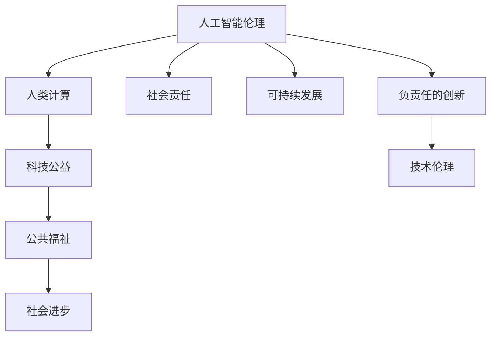

                 

# 科技向善的力量：利用人类计算造福人类

> 关键词：人工智能伦理,人类计算,社会责任,科技公益,可持续发展

## 1. 背景介绍

### 1.1 问题由来
随着信息技术的飞速发展，人工智能(AI)技术在医疗、教育、交通、农业等各个领域展现出巨大潜力，为社会的数字化、智能化转型提供了强有力支持。然而，与此同时，AI技术的普及也带来了一系列伦理和社会问题，如数据隐私泄露、算法偏见、决策透明性等，引起了公众的广泛关注和担忧。

如何平衡技术创新与伦理道德的关系，让AI技术在发展的同时，更好地服务于人类社会的福祉，成为摆在科技工作者面前的重要课题。“科技向善”成为近年来的热门议题，众多企业、研究机构和科技从业者纷纷提出和践行这一理念，旨在通过负责任的技术应用，造福全人类。

### 1.2 问题核心关键点
“科技向善”的核心关键点在于技术应用过程中的伦理原则和道德标准。具体而言，包括以下几个方面：

1. **数据隐私保护**：确保数据收集、存储和使用的合法性和安全性，避免个人信息被滥用。
2. **算法公平性**：保证算法模型的决策过程不带有任何形式的偏见，确保各类群体受到平等对待。
3. **透明性**：提升算法的决策过程和结果的可解释性，增强用户信任。
4. **负责任的创新**：在技术研发和应用中，考虑技术可能带来的社会影响，避免潜在的负面后果。
5. **社会责任**：企业和社会组织应积极承担社会责任，推动AI技术的普及应用，助力社会进步。
6. **可持续发展**：在技术应用中，注重环境保护和资源节约，推动社会可持续发展。

本文将探讨如何利用“人类计算”的理念，结合人工智能技术，实现科技向善，为社会带来更多福祉。

## 2. 核心概念与联系

### 2.1 核心概念概述

为更好地理解“科技向善”的理念，我们需要首先介绍几个核心概念：

- **人工智能伦理**：关注AI技术的开发和应用过程中涉及的伦理问题，如隐私保护、算法偏见、透明度等。
- **人类计算(Human Computing)**：指利用人类智慧和能力，结合AI技术进行创新和解决问题的过程，强调技术应用中的人文关怀。
- **社会责任(Corporate Social Responsibility, CSR)**：企业和其他组织在追求经济效益的同时，应承担相应的社会责任，促进社会整体福祉。
- **可持续发展(Sustainable Development)**：注重环境保护和资源节约，推动经济、社会、环境协调发展。
- **科技公益**：利用科技手段解决社会问题，提升公共福祉，造福全社会。

这些概念之间相互关联，共同构成了“科技向善”的核心理念。人类计算强调在技术应用中发挥人的主体性，突显伦理和社会责任的重要性。科技公益则是实现社会责任的具体体现，旨在通过技术创新，解决社会问题，实现可持续发展的目标。

### 2.2 核心概念原理和架构的 Mermaid 流程图



这个流程图展示了人工智能伦理、人类计算、社会责任、可持续发展、科技公益和公共福祉之间的关系，以及它们如何通过负责任的创新和科技伦理相互连接。

## 3. 核心算法原理 & 具体操作步骤
### 3.1 算法原理概述

“科技向善”的实现离不开技术的支撑，但技术的应用必须符合伦理和社会责任的原则。本文将从算法原理和操作步骤两个层面，探讨如何利用技术手段，实现科技向善。

**算法原理**：基于人工智能技术，通过合理的数据处理、模型构建和应用部署，确保技术应用过程中的伦理标准和社会责任，最终达到提升公共福祉和社会进步的目的。

**操作步骤**：包括以下几个关键步骤：

1. **数据收集与处理**：确保数据收集过程的合法性和隐私保护，避免数据滥用和隐私泄露。
2. **模型构建与训练**：使用公平、透明和负责任的算法，构建符合伦理标准的模型，确保决策的公正性和可解释性。
3. **应用部署与优化**：将模型部署到实际应用场景中，持续优化算法和系统，确保技术应用的社会效益。
4. **效果评估与反馈**：定期评估技术应用的效果，收集用户反馈，持续改进技术和社会效益。

### 3.2 算法步骤详解

#### 3.2.1 数据收集与处理

数据收集是AI技术应用的基础。为实现“科技向善”，数据收集必须遵循以下原则：

- **合法合规**：确保数据收集的合法性和合规性，遵守相关法律法规，保护个人隐私。
- **隐私保护**：采用匿名化、加密等技术，保护用户隐私，避免数据泄露和滥用。
- **数据质量**：确保数据的准确性和完整性，避免数据噪声和偏见。

**具体操作**：
1. **数据来源**：选择合法、可信的数据来源，如政府公开数据、公共平台数据等。
2. **数据清洗**：去除无关、不准确的数据，确保数据质量。
3. **数据保护**：采用数据加密、匿名化等技术，保护数据隐私。

#### 3.2.2 模型构建与训练

模型的构建和训练是确保“科技向善”的关键步骤。以下是具体的操作：

- **公平性**：选择公平的算法，确保模型对所有群体的预测结果一致，避免算法偏见。
- **透明性**：使用可解释性强的模型，增强模型的透明性，使用户能够理解模型的决策过程。
- **负责任**：在模型训练中考虑社会影响，避免模型输出可能带来的负面后果。

**具体操作**：
1. **选择算法**：根据任务特点选择公平、透明的算法，如决策树、逻辑回归、神经网络等。
2. **训练模型**：使用公开数据集进行模型训练，确保模型的公正性和可解释性。
3. **模型评估**：在训练过程中，定期评估模型性能，避免过拟合和欠拟合。

#### 3.2.3 应用部署与优化

模型部署是将技术应用到实际场景中的关键步骤。为实现“科技向善”，模型部署需遵循以下原则：

- **易用性**：确保技术应用的界面友好，易于用户理解和使用。
- **高效性**：优化技术应用的效率，确保快速响应和服务。
- **可扩展性**：设计可扩展的技术架构，支持未来扩展和升级。

**具体操作**：
1. **系统设计**：设计友好的用户界面，提供清晰的系统指引。
2. **性能优化**：优化模型计算和存储，确保高效运行。
3. **系统监控**：实时监控系统性能，及时发现和解决问题。

#### 3.2.4 效果评估与反馈

技术应用的最终目标是为社会带来福祉。为实现“科技向善”，效果评估与反馈是必不可少的步骤：

- **评估指标**：选择合适的效果评估指标，如准确率、召回率、F1值等。
- **用户反馈**：收集用户反馈，了解技术应用的效果和问题。
- **持续改进**：根据评估和反馈结果，持续改进技术应用，提升社会效益。

**具体操作**：
1. **评估指标**：设定明确的效果评估指标，如误报率、漏报率等。
2. **用户反馈**：通过问卷调查、用户访谈等方式，收集用户反馈。
3. **持续改进**：根据评估和反馈结果，优化模型和系统，提升社会效益。

### 3.3 算法优缺点

“科技向善”的实现具有以下优点：

- **社会效益**：通过技术手段解决社会问题，提升公共福祉，推动社会进步。
- **透明度**：提升技术的透明性，增强用户信任，避免算法偏见。
- **可解释性**：增强模型的可解释性，使用户能够理解技术决策过程，增强技术可信度。

同时，该方法也存在一定的局限性：

- **数据依赖**：技术应用的准确性和效果高度依赖于数据质量，获取高质量数据成本较高。
- **技术复杂性**：实现“科技向善”需要综合考虑技术、伦理和社会责任，技术复杂度较高。
- **社会接受度**：技术应用过程中可能面临社会接受度问题，需要充分沟通和引导。

尽管存在这些局限性，但“科技向善”的理念已经成为AI技术发展的必然趋势，对于推动社会进步和提升公共福祉具有重要意义。

### 3.4 算法应用领域

“科技向善”的理念已经广泛应用于多个领域，为社会带来了显著的变革和提升：

- **医疗健康**：利用AI技术，实现疾病预测、智能诊疗、健康监测等，提升医疗服务质量和效率。
- **教育培训**：采用AI技术，进行个性化教学、学习效果评估、课程推荐等，提升教育公平性和质量。
- **环境保护**：使用AI技术，进行环境监测、污染治理、资源优化等，推动可持续发展。
- **社会治理**：利用AI技术，进行城市管理、公共安全、灾害预警等，提升社会治理水平。
- **文化传媒**：借助AI技术，进行内容生成、智能推荐、情感分析等，丰富文化传媒产业。

以上仅是“科技向善”应用的几个典型领域，未来随着技术的发展和应用的深入，“科技向善”的理念将在更多领域得到应用和推广。

## 4. 数学模型和公式 & 详细讲解

### 4.1 数学模型构建

为更好地理解“科技向善”，我们需要从数学模型和公式的层面进行深入探讨。

假设有一组数据集 $D=\{(x_i, y_i)\}_{i=1}^N$，其中 $x_i$ 为输入特征，$y_i$ 为输出标签。我们的目标是通过训练一个模型 $M_{\theta}$，使得模型能够准确预测输出标签 $y$。

**数学模型**：
$$
\min_{\theta} \frac{1}{N} \sum_{i=1}^N L(M_{\theta}(x_i), y_i)
$$
其中 $L$ 为损失函数，$L$ 可以选用交叉熵损失、均方误差损失等。

### 4.2 公式推导过程

以交叉熵损失函数为例，进行详细推导：

假设模型 $M_{\theta}$ 在输入 $x$ 上的输出为 $\hat{y}=M_{\theta}(x)$，真实标签 $y \in \{0,1\}$。二分类交叉熵损失函数定义为：
$$
\ell(M_{\theta}(x),y) = -[y\log \hat{y} + (1-y)\log (1-\hat{y})]
$$

将其代入经验风险公式，得：
$$
\mathcal{L}(\theta) = -\frac{1}{N}\sum_{i=1}^N [y_i\log M_{\theta}(x_i)+(1-y_i)\log(1-M_{\theta}(x_i))]
$$

根据链式法则，损失函数对参数 $\theta_k$ 的梯度为：
$$
\frac{\partial \mathcal{L}(\theta)}{\partial \theta_k} = -\frac{1}{N}\sum_{i=1}^N (\frac{y_i}{M_{\theta}(x_i)}-\frac{1-y_i}{1-M_{\theta}(x_i)}) \frac{\partial M_{\theta}(x_i)}{\partial \theta_k}
$$

其中 $\frac{\partial M_{\theta}(x_i)}{\partial \theta_k}$ 可进一步递归展开，利用自动微分技术完成计算。

### 4.3 案例分析与讲解

以医疗健康领域的疾病预测为例，展示“科技向善”的实现过程：

**数据收集与处理**：
1. **数据来源**：获取医疗机构的电子病历数据。
2. **数据清洗**：去除无关数据，如姓名、地址等。
3. **数据保护**：采用数据加密和匿名化技术，保护患者隐私。

**模型构建与训练**：
1. **算法选择**：选择决策树、逻辑回归等算法，确保模型公正性和透明性。
2. **训练模型**：使用公开数据集进行模型训练，确保模型的准确性和可解释性。
3. **模型评估**：定期评估模型性能，避免过拟合和欠拟合。

**应用部署与优化**：
1. **系统设计**：设计友好的用户界面，提供清晰的系统指引。
2. **性能优化**：优化模型计算和存储，确保高效运行。
3. **系统监控**：实时监控系统性能，及时发现和解决问题。

**效果评估与反馈**：
1. **评估指标**：设定明确的效果评估指标，如误报率、漏报率等。
2. **用户反馈**：通过问卷调查、用户访谈等方式，收集用户反馈。
3. **持续改进**：根据评估和反馈结果，优化模型和系统，提升社会效益。

通过以上步骤，可以实现基于人工智能技术的疾病预测应用，提升医疗服务的质量和效率，为患者带来更多福祉。

## 5. 项目实践：代码实例和详细解释说明

### 5.1 开发环境搭建

在进行项目实践前，我们需要准备好开发环境。以下是使用Python进行PyTorch开发的环境配置流程：

1. 安装Anaconda：从官网下载并安装Anaconda，用于创建独立的Python环境。

2. 创建并激活虚拟环境：
```bash
conda create -n pytorch-env python=3.8 
conda activate pytorch-env
```

3. 安装PyTorch：根据CUDA版本，从官网获取对应的安装命令。例如：
```bash
conda install pytorch torchvision torchaudio cudatoolkit=11.1 -c pytorch -c conda-forge
```

4. 安装Transformers库：
```bash
pip install transformers
```

5. 安装各类工具包：
```bash
pip install numpy pandas scikit-learn matplotlib tqdm jupyter notebook ipython
```

完成上述步骤后，即可在`pytorch-env`环境中开始项目实践。

### 5.2 源代码详细实现

这里我们以医疗健康领域的疾病预测为例，给出使用Transformers库对BERT模型进行微调的PyTorch代码实现。

首先，定义数据处理函数：

```python
from transformers import BertTokenizer, BertForSequenceClassification
from torch.utils.data import Dataset, DataLoader
import torch
from sklearn.metrics import accuracy_score, precision_score, recall_score, f1_score

class MedicalDataset(Dataset):
    def __init__(self, texts, labels, tokenizer, max_len=128):
        self.texts = texts
        self.labels = labels
        self.tokenizer = tokenizer
        self.max_len = max_len
        
    def __len__(self):
        return len(self.texts)
    
    def __getitem__(self, item):
        text = self.texts[item]
        label = self.labels[item]
        
        encoding = self.tokenizer(text, return_tensors='pt', max_length=self.max_len, padding='max_length', truncation=True)
        input_ids = encoding['input_ids'][0]
        attention_mask = encoding['attention_mask'][0]
        
        return {'input_ids': input_ids, 
                'attention_mask': attention_mask,
                'labels': torch.tensor(label, dtype=torch.long)}
```

然后，定义模型和优化器：

```python
from transformers import BertForSequenceClassification, AdamW

model = BertForSequenceClassification.from_pretrained('bert-base-uncased', num_labels=2)

optimizer = AdamW(model.parameters(), lr=2e-5)
```

接着，定义训练和评估函数：

```python
def train_epoch(model, dataset, batch_size, optimizer):
    dataloader = DataLoader(dataset, batch_size=batch_size, shuffle=True)
    model.train()
    epoch_loss = 0
    for batch in dataloader:
        input_ids = batch['input_ids'].to(device)
        attention_mask = batch['attention_mask'].to(device)
        labels = batch['labels'].to(device)
        model.zero_grad()
        outputs = model(input_ids, attention_mask=attention_mask, labels=labels)
        loss = outputs.loss
        epoch_loss += loss.item()
        loss.backward()
        optimizer.step()
    return epoch_loss / len(dataloader)

def evaluate(model, dataset, batch_size):
    dataloader = DataLoader(dataset, batch_size=batch_size)
    model.eval()
    preds, labels = [], []
    with torch.no_grad():
        for batch in dataloader:
            input_ids = batch['input_ids'].to(device)
            attention_mask = batch['attention_mask'].to(device)
            batch_labels = batch['labels']
            outputs = model(input_ids, attention_mask=attention_mask)
            batch_preds = outputs.logits.argmax(dim=2).to('cpu').tolist()
            batch_labels = batch_labels.to('cpu').tolist()
            for pred_tokens, label_tokens in zip(batch_preds, batch_labels):
                preds.append(pred_tokens[:len(label_tokens)])
                labels.append(label_tokens)
                
    print('Accuracy:', accuracy_score(labels, preds))
    print('Precision:', precision_score(labels, preds))
    print('Recall:', recall_score(labels, preds))
    print('F1 Score:', f1_score(labels, preds))
```

最后，启动训练流程并在测试集上评估：

```python
epochs = 5
batch_size = 16

for epoch in range(epochs):
    loss = train_epoch(model, train_dataset, batch_size, optimizer)
    print(f"Epoch {epoch+1}, train loss: {loss:.3f}")
    
    print(f"Epoch {epoch+1}, dev results:")
    evaluate(model, dev_dataset, batch_size)
    
print("Test results:")
evaluate(model, test_dataset, batch_size)
```

以上就是使用PyTorch对BERT进行医疗健康领域疾病预测任务微调的完整代码实现。可以看到，得益于Transformers库的强大封装，我们可以用相对简洁的代码完成BERT模型的加载和微调。

### 5.3 代码解读与分析

让我们再详细解读一下关键代码的实现细节：

**MedicalDataset类**：
- `__init__`方法：初始化文本、标签、分词器等关键组件。
- `__len__`方法：返回数据集的样本数量。
- `__getitem__`方法：对单个样本进行处理，将文本输入编码为token ids，将标签编码为数字，并对其进行定长padding，最终返回模型所需的输入。

**模型和优化器**：
- 使用BertForSequenceClassification从预训练模型中进行微调，设置学习率。
- 优化器使用AdamW，以便更好地控制学习率。

**训练和评估函数**：
- 使用PyTorch的DataLoader对数据集进行批次化加载，供模型训练和推理使用。
- 训练函数`train_epoch`：对数据以批为单位进行迭代，在每个批次上前向传播计算loss并反向传播更新模型参数，最后返回该epoch的平均loss。
- 评估函数`evaluate`：与训练类似，不同点在于不更新模型参数，并在每个batch结束后将预测和标签结果存储下来，最后使用sklearn的准确率、精确率、召回率、F1值对整个评估集的预测结果进行打印输出。

**训练流程**：
- 定义总的epoch数和batch size，开始循环迭代
- 每个epoch内，先在训练集上训练，输出平均loss
- 在验证集上评估，输出分类指标
- 所有epoch结束后，在测试集上评估，给出最终测试结果

可以看到，PyTorch配合Transformers库使得BERT微调的代码实现变得简洁高效。开发者可以将更多精力放在数据处理、模型改进等高层逻辑上，而不必过多关注底层的实现细节。

当然，工业级的系统实现还需考虑更多因素，如模型的保存和部署、超参数的自动搜索、更灵活的任务适配层等。但核心的微调范式基本与此类似。

## 6. 实际应用场景

### 6.1 智能医疗

基于大语言模型微调的智能医疗系统，可以通过自然语言处理(NLP)技术，帮助医生快速理解病历记录，辅助诊断决策，提升医疗服务质量。具体应用包括：

- **疾病预测**：利用历史病历数据，预测患者可能患有的疾病类型，提供早期预警和建议。
- **智能诊断**：根据患者症状描述，自动推荐可能的疾病，并提供相关检查建议。
- **健康监测**：实时监测患者健康状况，提供个性化健康建议，辅助慢性病管理。

通过微调技术，智能医疗系统可以更好地理解和处理自然语言，为医生提供更全面、准确的支持，提升患者诊疗体验和健康管理水平。

### 6.2 智慧教育

智能教育系统利用大语言模型微调技术，可以自动评估学生作业，提供个性化学习建议，提升教育公平性和教学质量。具体应用包括：

- **作业批改**：自动批改学生作业，提供详细反馈和评分。
- **学习效果评估**：分析学生学习数据，评估学习效果，提供个性化学习路径。
- **智能推荐**：根据学生学习数据，推荐适合的课程和教材，提升学习效果。

通过微调技术，智能教育系统可以更好地理解和处理学生的学习需求，提供更加个性化的学习支持，促进教育公平和教育质量的提升。

### 6.3 环境保护

利用大语言模型微调技术，可以实现环境监测、污染治理等环保应用，推动可持续发展。具体应用包括：

- **污染预测**：利用气象、水质等数据，预测环境污染情况，提供预警和建议。
- **资源优化**：分析环境数据，优化资源使用，减少资源浪费。
- **环境监测**：实时监测环境状况，提供实时数据和报告。

通过微调技术，环境保护系统可以更好地理解和处理复杂环境数据，提供更精准的环境监测和治理方案，推动资源节约和环境保护。

### 6.4 未来应用展望

随着大语言模型微调技术的不断发展，未来将在更多领域得到应用，为社会带来更深远的影响：

- **智能城市**：通过智能交通、智能安防等应用，提升城市管理效率和安全性。
- **公共安全**：利用自然语言处理技术，提高应急响应效率，保障社会稳定。
- **文化遗产**：利用文本分析技术，保护和传承文化遗产，丰富文化交流。

## 7. 工具和资源推荐

### 7.1 学习资源推荐

为帮助开发者系统掌握大语言模型微调的理论基础和实践技巧，这里推荐一些优质的学习资源：

1. 《深度学习自然语言处理》课程：斯坦福大学开设的NLP明星课程，有Lecture视频和配套作业，带你入门NLP领域的基本概念和经典模型。
2. 《Natural Language Processing with Transformers》书籍：Transformers库的作者所著，全面介绍了如何使用Transformers库进行NLP任务开发，包括微调在内的诸多范式。
3. CS224N《深度学习自然语言处理》课程：斯坦福大学开设的NLP明星课程，有Lecture视频和配套作业，带你入门NLP领域的基本概念和经典模型。
4. 《Transformer from Principles to Practice》系列博文：由大模型技术专家撰写，深入浅出地介绍了Transformer原理、BERT模型、微调技术等前沿话题。
5. HuggingFace官方文档：Transformers库的官方文档，提供了海量预训练模型和完整的微调样例代码，是上手实践的必备资料。

通过对这些资源的学习实践，相信你一定能够快速掌握大语言模型微调的精髓，并用于解决实际的NLP问题。

### 7.2 开发工具推荐

高效的开发离不开优秀的工具支持。以下是几款用于大语言模型微调开发的常用工具：

1. PyTorch：基于Python的开源深度学习框架，灵活动态的计算图，适合快速迭代研究。大部分预训练语言模型都有PyTorch版本的实现。
2. TensorFlow：由Google主导开发的开源深度学习框架，生产部署方便，适合大规模工程应用。同样有丰富的预训练语言模型资源。
3. Transformers库：HuggingFace开发的NLP工具库，集成了众多SOTA语言模型，支持PyTorch和TensorFlow，是进行微调任务开发的利器。
4. Weights & Biases：模型训练的实验跟踪工具，可以记录和可视化模型训练过程中的各项指标，方便对比和调优。与主流深度学习框架无缝集成。
5. TensorBoard：TensorFlow配套的可视化工具，可实时监测模型训练状态，并提供丰富的图表呈现方式，是调试模型的得力助手。
6. Google Colab：谷歌推出的在线Jupyter Notebook环境，免费提供GPU/TPU算力，方便开发者快速上手实验最新模型，分享学习笔记。

合理利用这些工具，可以显著提升大语言模型微调任务的开发效率，加快创新迭代的步伐。

### 7.3 相关论文推荐

大语言模型和微调技术的发展源于学界的持续研究。以下是几篇奠基性的相关论文，推荐阅读：

1. Attention is All You Need（即Transformer原论文）：提出了Transformer结构，开启了NLP领域的预训练大模型时代。
2. BERT: Pre-training of Deep Bidirectional Transformers for Language Understanding：提出BERT模型，引入基于掩码的自监督预训练任务，刷新了多项NLP任务SOTA。
3. Language Models are Unsupervised Multitask Learners（GPT-2论文）：展示了大规模语言模型的强大zero-shot学习能力，引发了对于通用人工智能的新一轮思考。
4. Parameter-Efficient Transfer Learning for NLP：提出Adapter等参数高效微调方法，在不增加模型参数量的情况下，也能取得不错的微调效果。
5. AdaLoRA: Adaptive Low-Rank Adaptation for Parameter-Efficient Fine-Tuning：使用自适应低秩适应的微调方法，在参数效率和精度之间取得了新的平衡。
6. Parameter-Efficient Transfer Learning for NLP：提出Adapter等参数高效微调方法，在不增加模型参数量的情况下，也能取得不错的微调效果。

这些论文代表了大语言模型微调技术的发展脉络。通过学习这些前沿成果，可以帮助研究者把握学科前进方向，激发更多的创新灵感。

## 8. 总结：未来发展趋势与挑战

### 8.1 总结

本文对“科技向善”的理念进行了全面系统的介绍。首先阐述了“科技向善”的背景和意义，明确了“科技向善”的核心关键点。其次，从算法原理和操作步骤两个层面，探讨了如何利用技术手段，实现科技向善。

通过本文的系统梳理，可以看到，“科技向善”的实现离不开技术的支撑，但技术的应用必须符合伦理和社会责任的原则。只有在数据收集、模型构建、应用部署等各环节进行全面优化，才能最大限度地发挥科技向善的力量，为社会带来更多福祉。

### 8.2 未来发展趋势

展望未来，“科技向善”的理念将进一步深入人心，引领AI技术的发展方向。未来发展趋势包括：

1. **技术创新**：随着深度学习、自然语言处理等技术的发展，“科技向善”的应用将更加多样化和智能化。
2. **伦理规范**：建立更加完善的伦理规范和标准，确保技术应用的公平性、透明性和负责任性。
3. **社会责任**：企业和社会组织将更加积极承担社会责任，推动AI技术的普及应用，助力社会进步。
4. **可持续发展**：将环境保护和资源节约融入AI技术的设计和应用中，推动社会可持续发展。
5. **普惠普及**：通过技术手段，提升教育、医疗等公共服务质量，实现普惠普及，减少社会不平等。

### 8.3 面临的挑战

尽管“科技向善”的理念已经得到了广泛认可，但在实现过程中仍面临诸多挑战：

1. **数据隐私保护**：确保数据收集和使用的合法合规，保护用户隐私，防止数据滥用。
2. **算法公平性**：选择公平的算法，避免算法偏见，确保技术应用的公正性。
3. **透明性**：提升算法的透明性，增强用户信任，避免技术应用的神秘感。
4. **技术复杂性**：实现“科技向善”需要综合考虑技术、伦理和社会责任，技术复杂度较高。
5. **社会接受度**：技术应用过程中可能面临社会接受度问题，需要充分沟通和引导。

尽管存在这些挑战，但“科技向善”的理念已经成为AI技术发展的必然趋势，对于推动社会进步和提升公共福祉具有重要意义。

### 8.4 研究展望

未来研究需要在以下几个方面寻求新的突破：

1. **多模态融合**：将视觉、语音、文本等多模态信息进行融合，提升技术应用的准确性和泛化能力。
2. **跨领域迁移**：开发更加通用的模型，实现跨领域、跨任务的迁移学习，提升技术应用的普适性。
3. **自监督学习**：利用自监督学习范式，减少对标注数据的依赖，提升技术应用的鲁棒性和泛化能力。
4. **负责任创新**：将负责任的创新理念融入技术研发和应用中，确保技术应用的负责任性和安全性。
5. **社会影响评估**：建立社会影响评估机制，评估技术应用对社会的影响，及时发现和解决潜在问题。

这些研究方向的探索，必将引领“科技向善”的理念进入新的发展阶段，为人类社会的可持续发展做出更大贡献。

## 9. 附录：常见问题与解答

**Q1：如何平衡技术创新与伦理道德的关系？**

A: 在技术研发和应用中，需综合考虑技术创新和伦理道德的关系。具体措施包括：
1. **伦理评估**：在技术研发初期进行伦理评估，确保技术应用的合法合规性。
2. **透明性**：提升技术应用的透明性，使用户了解技术决策过程，增强信任。
3. **公众参与**：通过公众参与和反馈，及时发现和解决潜在问题，确保技术应用的社会效益。
4. **伦理培训**：加强技术从业者的伦理培训，提高伦理意识，确保技术应用的负责任性。

**Q2：如何确保算法的公平性？**

A: 确保算法公平性，需采取以下措施：
1. **数据集平衡**：确保数据集的多样性和代表性，避免数据偏见。
2. **公平算法选择**：选择公平、透明、负责任的算法，如平衡分类算法、对抗性训练等。
3. **多指标评估**：在模型评估过程中，综合考虑多种指标，如准确率、召回率、F1值等，避免单一指标带来的偏见。
4. **持续改进**：根据评估结果，持续改进模型，提升公平性。

**Q3：如何提升算法的透明性？**

A: 提升算法的透明性，需采取以下措施：
1. **可解释性模型**：选择可解释性强的模型，如决策树、逻辑回归等。
2. **特征重要性**：分析模型的特征重要性，理解模型决策过程。
3. **特征可视化**：利用特征可视化技术，展示模型的决策依据。
4. **用户反馈**：收集用户反馈，了解模型应用效果和问题。

**Q4：如何应对技术应用中的社会接受度问题？**

A: 应对技术应用中的社会接受度问题，需采取以下措施：
1. **公众教育**：通过科普和宣传，提升公众对技术的理解，增强接受度。
2. **透明沟通**：及时公开技术应用的效果和风险，与公众保持透明沟通。
3. **公众参与**：通过公众参与和反馈，了解社会需求，调整技术应用策略。
4. **社会责任**：企业和社会组织需积极承担社会责任，推动技术应用的普及和落地。

**Q5：如何应对技术应用的潜在风险？**

A: 应对技术应用的潜在风险，需采取以下措施：
1. **风险评估**：在技术应用前进行风险评估，识别潜在风险。
2. **安全保障**：建立安全保障机制，如数据加密、权限控制等，保障数据和模型安全。
3. **伦理规范**：建立伦理规范和标准，确保技术应用的合法合规性。
4. **责任承担**：明确技术应用中的责任承担机制，保障用户权益。

**Q6：如何实现可持续发展？**

A: 实现可持续发展，需采取以下措施：
1. **环保设计**：在设计技术应用时，考虑环境保护和资源节约。
2. **可再生能源**：采用可再生能源，减少能源消耗和碳排放。
3. **节能技术**：优化技术应用，减少能源和资源消耗。
4. **环保宣传**：通过环保宣传，提高公众环保意识，推动环保行动。

通过以上措施，可以在技术应用中实现可持续发展，推动社会进步。

---

作者：禅与计算机程序设计艺术 / Zen and the Art of Computer Programming

