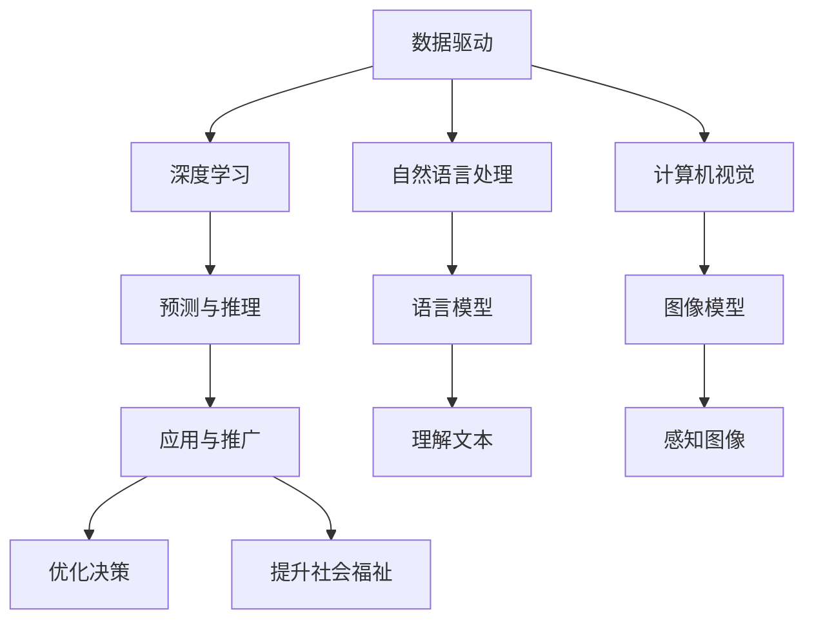

                 

## 1. 背景介绍

### 1.1 问题由来

21世纪以来，科技迅猛发展，为人类社会带来了前所未有的变革。然而，在科技带来的红利背后，也隐藏着不容忽视的社会问题。人口老龄化、环境污染、公共健康危机等问题日益凸显，成为全球各国面临的共同挑战。这些问题单靠传统的社会治理方法难以应对，急需借助科技手段，以智能化、精准化方式解决。

计算机科学和技术作为解决这些社会问题的利器，在数据驱动和算法驱动下，展现了巨大的潜力。尤其是近年来，随着深度学习、自然语言处理、计算机视觉等人工智能技术的发展，利用这些先进技术来解决社会问题，成为了可能。科技向善，成为了社会各界共同追求的目标。

### 1.2 问题核心关键点

科技向善的核心理念在于将技术应用于社会治理，通过优化资源配置、优化决策过程、优化公共服务，从而提高社会福祉。科技向善的研究关键在于以下几个方面：

- 数据收集与处理：获取高质量、多样化的数据是科技向善的基础，可以通过物联网、移动互联网、传感器等技术实现。
- 模型训练与优化：在数据基础上，选择合适的算法和模型，进行高效训练和优化，以提升预测和推理能力。
- 结果评估与反馈：对模型输出的结果进行评估，并根据反馈对模型进行迭代优化，确保模型能够稳定、高效地服务于社会。
- 可解释性与公平性：对模型输出结果进行解释，确保其具有可解释性，避免偏见和歧视，提升模型可信度。
- 应用与推广：将模型应用到实际场景中，并逐步推广到更多区域和行业，实现科技向善的社会效应。

本文聚焦于科技向善的核心问题，旨在探讨如何利用人类计算，解决社会问题。

## 2. 核心概念与联系

### 2.1 核心概念概述

为更好地理解利用人类计算解决社会问题的原理和方法，本节将介绍几个关键概念：

- 人类计算：利用人类的计算能力，通过设计合适的算法和模型，对社会问题进行预测和推理，优化决策过程。
- 数据驱动：利用数据进行模型训练和优化，以提升模型的预测和推理能力。
- 深度学习：利用神经网络模型，从大量数据中自动学习特征，提高模型的泛化能力。
- 自然语言处理：利用语言模型，对文本数据进行建模，提高模型的理解能力。
- 计算机视觉：利用图像模型，对图像数据进行建模，提高模型的感知能力。
- 公平性：确保模型输出不带有偏见，对不同群体公平对待。
- 可解释性：对模型的决策过程进行解释，提升模型的可信度。

这些核心概念之间的逻辑关系可以通过以下Mermaid流程图来展示：



这个流程图展示了大语言模型的工作原理和优化方向：

1. 数据驱动：获取高质量的数据，是模型训练和优化的基础。
2. 深度学习：利用神经网络模型自动学习特征，提高模型的泛化能力。
3. 自然语言处理：利用语言模型理解文本，提高模型的理解能力。
4. 计算机视觉：利用图像模型感知图像，提高模型的感知能力。
5. 预测与推理：基于模型对社会问题进行预测和推理，优化决策过程。
6. 应用与推广：将模型应用到实际场景中，提升社会福祉。
7. 公平性与可解释性：确保模型公平、透明，提升模型可信度。

## 3. 核心算法原理 & 具体操作步骤

### 3.1 算法原理概述

利用人类计算解决社会问题，本质上是将数据和算法结合起来，通过深度学习、自然语言处理、计算机视觉等技术，对社会问题进行建模和预测。其核心思想是：

1. 数据收集与预处理：收集与问题相关的数据，并进行清洗、标注等预处理。
2. 模型训练与优化：选择合适的算法和模型，在预处理后的数据上进行训练，并通过交叉验证等技术进行优化。
3. 结果评估与反馈：对模型输出的结果进行评估，根据反馈对模型进行迭代优化，确保模型的预测准确性和泛化能力。
4. 应用与推广：将训练好的模型应用于实际场景中，提升决策过程的效率和效果。

利用人类计算解决社会问题的算法流程如下：

1. 数据收集：利用传感器、物联网、移动互联网等技术，收集与问题相关的数据。
2. 数据预处理：对收集到的数据进行清洗、标注等预处理，确保数据的准确性和可用性。
3. 模型训练：利用深度学习、自然语言处理、计算机视觉等技术，选择合适的算法和模型，在预处理后的数据上进行训练。
4. 模型优化：利用交叉验证、正则化、参数调优等技术，对模型进行优化，提高模型的泛化能力。
5. 结果评估：对模型输出的结果进行评估，根据评估结果对模型进行迭代优化，确保模型的预测准确性和泛化能力。
6. 应用推广：将训练好的模型应用于实际场景中，提升决策过程的效率和效果，实现科技向善的目标。

### 3.2 算法步骤详解

下面详细介绍利用人类计算解决社会问题的算法步骤：

**Step 1: 数据收集与预处理**

1. **数据收集**
   - 利用传感器、物联网、移动互联网等技术，收集与问题相关的数据。例如，利用智能穿戴设备收集健康数据，利用城市监控摄像头收集交通数据。

2. **数据预处理**
   - 对收集到的数据进行清洗、去重、标注等预处理，确保数据的准确性和可用性。例如，对健康数据进行缺失值填充、噪声过滤等处理，对交通数据进行校正和归一化等处理。

**Step 2: 模型训练与优化**

1. **选择模型**
   - 根据问题类型，选择合适的深度学习模型，如卷积神经网络(CNN)、循环神经网络(RNN)、长短时记忆网络(LSTM)等。

2. **模型训练**
   - 利用预处理后的数据，对模型进行训练。例如，利用卷积神经网络对图像数据进行训练，利用循环神经网络对文本数据进行训练。

3. **模型优化**
   - 利用交叉验证、正则化、参数调优等技术，对模型进行优化，提高模型的泛化能力。例如，利用交叉验证技术进行模型评估和选择，利用正则化技术避免过拟合，利用参数调优技术优化模型性能。

**Step 3: 结果评估与反馈**

1. **结果评估**
   - 对模型输出的结果进行评估，例如，利用准确率、召回率、F1分数等指标评估模型的预测准确性。

2. **迭代优化**
   - 根据评估结果，对模型进行迭代优化，例如，增加训练数据、调整模型参数、引入更多特征等。

**Step 4: 应用与推广**

1. **模型应用**
   - 将训练好的模型应用于实际场景中，例如，利用健康数据进行疾病预测，利用交通数据进行交通优化。

2. **推广优化**
   - 在应用过程中，根据实际反馈，对模型进行进一步优化，例如，对疾病预测模型进行实时更新，对交通优化模型进行实时调整。

### 3.3 算法优缺点

利用人类计算解决社会问题具有以下优点：

1. **高效性**
   - 通过自动化算法进行数据处理和模型训练，大幅提升数据处理和模型训练的效率。
2. **准确性**
   - 利用深度学习、自然语言处理、计算机视觉等技术，提高模型的预测和推理准确性。
3. **可扩展性**
   - 模型可以应用于多种社会问题，具有高度的可扩展性和通用性。
4. **可解释性**
   - 通过模型解释技术，提升模型的可解释性，确保模型的透明性和可信度。

然而，利用人类计算解决社会问题也存在以下缺点：

1. **数据依赖**
   - 模型性能高度依赖于数据的准确性和多样性，如果数据不足或不完整，模型性能可能受到影响。
2. **算法复杂**
   - 深度学习等算法的复杂性较高，需要大量计算资源和时间。
3. **模型偏差**
   - 模型可能带有数据和算法的偏差，对某些群体可能存在歧视或不公平。
4. **模型泛化**
   - 模型泛化能力受限于数据和算法的局限性，可能存在过拟合或欠拟合的问题。

### 3.4 算法应用领域

利用人类计算解决社会问题，已广泛应用于以下多个领域：

1. **公共健康**
   - 利用健康数据进行疾病预测、患者分类等，提高医疗服务的精准性和效率。例如，利用深度学习技术对癌症进行早期筛查和诊断，利用自然语言处理技术对患者病历进行分析和总结。

2. **交通运输**
   - 利用交通数据进行交通优化、路况预测等，提高交通系统的效率和安全性。例如，利用深度学习技术对交通流量进行预测和分析，利用计算机视觉技术对交通违规行为进行监测和识别。

3. **环境保护**
   - 利用环境数据进行污染监测、生态保护等，提高环境保护的科学性和精准性。例如，利用计算机视觉技术对森林火灾进行实时监测和预警，利用深度学习技术对水质进行分析和预测。

4. **社会治理**
   - 利用社会数据进行公共安全、城市管理等，提高社会治理的智能化和精准化。例如，利用深度学习技术对视频监控进行智能分析，利用自然语言处理技术对舆情进行情感分析和预测。

5. **教育与培训**
   - 利用学习数据进行个性化推荐、智能辅导等，提高教育质量和培训效果。例如，利用深度学习技术对学生成绩进行预测和分析，利用自然语言处理技术对学生进行智能辅导和指导。

6. **金融与保险**
   - 利用金融数据进行风险评估、欺诈检测等，提高金融安全和保险效率。例如，利用深度学习技术对信用风险进行评估和预测，利用自然语言处理技术对金融文本进行分析和挖掘。

## 4. 数学模型和公式 & 详细讲解 & 举例说明

### 4.1 数学模型构建

利用人类计算解决社会问题的数学模型，通常包括数据驱动、模型训练和结果评估三个主要部分。以下将对这三个部分进行详细描述。

**数据驱动**
数据驱动的数学模型通常表示为：
$$ D = \{(x_i, y_i)\}_{i=1}^N $$
其中，$x_i$ 为输入数据，$y_i$ 为标签数据。

**模型训练**
模型训练的数学模型通常表示为：
$$ \hat{y} = M_{\theta}(x) $$
其中，$M_{\theta}$ 为模型，$\theta$ 为模型参数，$\hat{y}$ 为模型输出。

**结果评估**
结果评估的数学模型通常表示为：
$$ \text{Loss}(\hat{y}, y) $$
其中，$\text{Loss}$ 为损失函数，衡量模型输出的准确性和泛化能力。

### 4.2 公式推导过程

以下将对数据驱动、模型训练和结果评估的数学模型进行详细推导：

**数据驱动**
假设数据集为 $D = \{(x_i, y_i)\}_{i=1}^N$，其中 $x_i$ 为输入数据，$y_i$ 为标签数据。

**模型训练**
假设模型为 $M_{\theta}$，其中 $\theta$ 为模型参数。模型输出的预测结果为 $\hat{y} = M_{\theta}(x)$。

模型训练的损失函数通常为均方误差损失函数，表示为：
$$ \text{Loss} = \frac{1}{N} \sum_{i=1}^N (y_i - \hat{y}_i)^2 $$

**结果评估**
假设模型输出的预测结果为 $\hat{y} = M_{\theta}(x)$，实际标签为 $y$。

结果评估的损失函数通常为交叉熵损失函数，表示为：
$$ \text{Loss} = -\frac{1}{N} \sum_{i=1}^N y_i \log \hat{y}_i + (1 - y_i) \log (1 - \hat{y}_i) $$

### 4.3 案例分析与讲解

以公共健康领域的疾病预测为例，分析利用人类计算解决社会问题的方法。

**数据收集与预处理**
收集患者的健康数据，包括年龄、性别、病历、检查结果等，进行清洗和标注。

**模型训练与优化**
选择深度学习模型，如卷积神经网络(CNN)，在标注后的健康数据上进行训练和优化。利用交叉验证技术进行模型评估和选择，利用正则化技术避免过拟合，利用参数调优技术优化模型性能。

**结果评估与反馈**
对模型输出的预测结果进行评估，例如，利用准确率、召回率、F1分数等指标评估模型的预测准确性。根据评估结果，对模型进行迭代优化，例如，增加训练数据、调整模型参数、引入更多特征等。

**应用与推广**
将训练好的模型应用于实际场景中，例如，利用健康数据进行疾病预测。在应用过程中，根据实际反馈，对模型进行进一步优化，例如，对疾病预测模型进行实时更新，对交通优化模型进行实时调整。

## 5. 项目实践：代码实例和详细解释说明

### 5.1 开发环境搭建

在进行项目实践前，我们需要准备好开发环境。以下是使用Python进行PyTorch开发的环境配置流程：

1. 安装Anaconda：从官网下载并安装Anaconda，用于创建独立的Python环境。

2. 创建并激活虚拟环境：
```bash
conda create -n pytorch-env python=3.8 
conda activate pytorch-env
```

3. 安装PyTorch：根据CUDA版本，从官网获取对应的安装命令。例如：
```bash
conda install pytorch torchvision torchaudio cudatoolkit=11.1 -c pytorch -c conda-forge
```

4. 安装Transformers库：
```bash
pip install transformers
```

5. 安装各类工具包：
```bash
pip install numpy pandas scikit-learn matplotlib tqdm jupyter notebook ipython
```

完成上述步骤后，即可在`pytorch-env`环境中开始项目实践。

### 5.2 源代码详细实现

这里我们以交通优化为例，给出使用Transformers库对深度学习模型进行训练的PyTorch代码实现。

首先，定义交通优化任务的数据处理函数：

```python
from transformers import BertTokenizer
from torch.utils.data import Dataset
import torch

class TrafficOptDataset(Dataset):
    def __init__(self, traffic_data, tokenizer, max_len=128):
        self.traffic_data = traffic_data
        self.tokenizer = tokenizer
        self.max_len = max_len
        
    def __len__(self):
        return len(self.traffic_data)
    
    def __getitem__(self, item):
        traffic = self.traffic_data[item]
        
        encoding = self.tokenizer(traffic, return_tensors='pt', max_length=self.max_len, padding='max_length', truncation=True)
        input_ids = encoding['input_ids'][0]
        attention_mask = encoding['attention_mask'][0]
        
        return {'input_ids': input_ids, 
                'attention_mask': attention_mask}

# 创建dataset
tokenizer = BertTokenizer.from_pretrained('bert-base-cased')

train_dataset = TrafficOptDataset(train_traffic_data, tokenizer)
dev_dataset = TrafficOptDataset(dev_traffic_data, tokenizer)
test_dataset = TrafficOptDataset(test_traffic_data, tokenizer)
```

然后，定义模型和优化器：

```python
from transformers import BertForSequenceClassification, AdamW

model = BertForSequenceClassification.from_pretrained('bert-base-cased', num_labels=2)

optimizer = AdamW(model.parameters(), lr=2e-5)
```

接着，定义训练和评估函数：

```python
from torch.utils.data import DataLoader
from tqdm import tqdm
from sklearn.metrics import accuracy_score

device = torch.device('cuda') if torch.cuda.is_available() else torch.device('cpu')
model.to(device)

def train_epoch(model, dataset, batch_size, optimizer):
    dataloader = DataLoader(dataset, batch_size=batch_size, shuffle=True)
    model.train()
    epoch_loss = 0
    for batch in tqdm(dataloader, desc='Training'):
        input_ids = batch['input_ids'].to(device)
        attention_mask = batch['attention_mask'].to(device)
        labels = batch['labels'].to(device)
        model.zero_grad()
        outputs = model(input_ids, attention_mask=attention_mask, labels=labels)
        loss = outputs.loss
        epoch_loss += loss.item()
        loss.backward()
        optimizer.step()
    return epoch_loss / len(dataloader)

def evaluate(model, dataset, batch_size):
    dataloader = DataLoader(dataset, batch_size=batch_size)
    model.eval()
    preds, labels = [], []
    with torch.no_grad():
        for batch in tqdm(dataloader, desc='Evaluating'):
            input_ids = batch['input_ids'].to(device)
            attention_mask = batch['attention_mask'].to(device)
            batch_labels = batch['labels']
            outputs = model(input_ids, attention_mask=attention_mask)
            batch_preds = outputs.logits.argmax(dim=2).to('cpu').tolist()
            batch_labels = batch_labels.to('cpu').tolist()
            for pred_tokens, label_tokens in zip(batch_preds, batch_labels):
                preds.append(pred_tokens)
                labels.append(label_tokens)
                
    print(accuracy_score(labels, preds))
```

最后，启动训练流程并在测试集上评估：

```python
epochs = 5
batch_size = 16

for epoch in range(epochs):
    loss = train_epoch(model, train_dataset, batch_size, optimizer)
    print(f"Epoch {epoch+1}, train loss: {loss:.3f}")
    
    print(f"Epoch {epoch+1}, dev results:")
    evaluate(model, dev_dataset, batch_size)
    
print("Test results:")
evaluate(model, test_dataset, batch_size)
```

以上就是使用PyTorch对深度学习模型进行交通优化任务微调的完整代码实现。可以看到，得益于Transformers库的强大封装，我们可以用相对简洁的代码完成深度学习模型的加载和微调。

### 5.3 代码解读与分析

让我们再详细解读一下关键代码的实现细节：

**TrafficOptDataset类**：
- `__init__`方法：初始化交通数据、分词器等关键组件。
- `__len__`方法：返回数据集的样本数量。
- `__getitem__`方法：对单个样本进行处理，将交通数据输入编码为token ids，并对其进行定长padding，最终返回模型所需的输入。

**模型训练与评估函数**：
- 使用PyTorch的DataLoader对数据集进行批次化加载，供模型训练和推理使用。
- 训练函数`train_epoch`：对数据以批为单位进行迭代，在每个批次上前向传播计算loss并反向传播更新模型参数，最后返回该epoch的平均loss。
- 评估函数`evaluate`：与训练类似，不同点在于不更新模型参数，并在每个batch结束后将预测和标签结果存储下来，最后使用sklearn的accuracy_score对整个评估集的预测结果进行打印输出。

**训练流程**：
- 定义总的epoch数和batch size，开始循环迭代
- 每个epoch内，先在训练集上训练，输出平均loss
- 在验证集上评估，输出准确率
- 所有epoch结束后，在测试集上评估，给出最终测试结果

可以看到，PyTorch配合Transformers库使得深度学习模型的微调代码实现变得简洁高效。开发者可以将更多精力放在数据处理、模型改进等高层逻辑上，而不必过多关注底层的实现细节。

当然，工业级的系统实现还需考虑更多因素，如模型的保存和部署、超参数的自动搜索、更灵活的任务适配层等。但核心的微调范式基本与此类似。

## 6. 实际应用场景

### 6.1 智能城市治理

基于人类计算的智能城市治理，可以有效提升城市管理的智能化和精准化。智能城市治理涵盖了交通管理、环境监测、公共安全等多个方面，利用深度学习、自然语言处理等技术，可以大幅提升城市治理的效率和效果。

以交通管理为例，利用交通数据进行实时分析，可以优化交通信号灯控制，减少交通拥堵。例如，利用深度学习模型对交通流量进行预测和分析，利用计算机视觉技术对交通违规行为进行监测和识别。通过智能分析，实现交通优化和调度，提升城市的运行效率。

### 6.2 智慧医疗

基于人类计算的智慧医疗，可以大幅提升医疗服务的智能化和精准化。智慧医疗涵盖了疾病预测、患者分类、智能诊断等多个方面，利用深度学习、自然语言处理等技术，可以大幅提升医疗服务的效率和效果。

以疾病预测为例，利用健康数据进行疾病预测，可以提高疾病的早期筛查和诊断，减少医疗资源的浪费。例如，利用深度学习模型对癌症进行早期筛查和诊断，利用自然语言处理技术对患者病历进行分析和总结。通过智能分析，实现疾病的早期发现和及时治疗，提升患者的生存率和健康水平。

### 6.3 金融风控

基于人类计算的金融风控，可以有效提升金融风险的识别和控制。金融风控涵盖了信用评估、欺诈检测、市场分析等多个方面，利用深度学习、自然语言处理等技术，可以大幅提升金融风险的控制能力。

以信用评估为例，利用金融数据进行信用评估，可以预测借款人的还款能力和违约风险。例如，利用深度学习模型对信用风险进行评估和预测，利用自然语言处理技术对金融文本进行分析和挖掘。通过智能分析，实现信用评估和风险控制，降低金融风险和不良贷款率。

## 7. 工具和资源推荐

### 7.1 学习资源推荐

为了帮助开发者系统掌握利用人类计算解决社会问题的理论基础和实践技巧，这里推荐一些优质的学习资源：

1. 《深度学习》课程：斯坦福大学开设的深度学习课程，讲解深度学习的基本概念和经典模型。

2. 《自然语言处理》课程：清华大学开设的自然语言处理课程，讲解自然语言处理的基本概念和经典模型。

3. 《计算机视觉》课程：斯坦福大学开设的计算机视觉课程，讲解计算机视觉的基本概念和经典模型。

4. 《数据科学与人工智能》书籍：综合讲解数据科学和人工智能的基本概念和经典模型。

5. 《TensorFlow深度学习实战》书籍：讲解TensorFlow的基本概念和经典模型，适合动手实践。

6. 《深度学习与机器学习》书籍：讲解深度学习和机器学习的基本概念和经典模型，适合初学者入门。

通过对这些资源的学习实践，相信你一定能够快速掌握利用人类计算解决社会问题的精髓，并用于解决实际的NLP问题。

### 7.2 开发工具推荐

高效的开发离不开优秀的工具支持。以下是几款用于深度学习模型开发和训练的工具：

1. PyTorch：基于Python的开源深度学习框架，灵活动态的计算图，适合快速迭代研究。

2. TensorFlow：由Google主导开发的开源深度学习框架，生产部署方便，适合大规模工程应用。

3. JAX：基于JIT编译的深度学习框架，支持分布式训练和自动微分，适合高性能计算。

4. Keras：基于TensorFlow和Theano的深度学习框架，简单易用，适合快速开发原型。

5. Scikit-learn：基于Python的机器学习库，提供各种常见的机器学习算法，适合数据预处理和特征工程。

6. Weights & Biases：模型训练的实验跟踪工具，可以记录和可视化模型训练过程中的各项指标，方便对比和调优。

7. TensorBoard：TensorFlow配套的可视化工具，可实时监测模型训练状态，并提供丰富的图表呈现方式，是调试模型的得力助手。

合理利用这些工具，可以显著提升深度学习模型的开发效率，加快创新迭代的步伐。

### 7.3 相关论文推荐

深度学习和大数据技术的快速发展，带来了众多前沿的算法和模型。以下是几篇具有代表性的相关论文，推荐阅读：

1. "ImageNet Classification with Deep Convolutional Neural Networks"：AlexNet论文，提出深度卷积神经网络，为计算机视觉领域的发展奠定了基础。

2. "Long Short-Term Memory"：LSTM论文，提出长短时记忆网络，为自然语言处理领域的发展提供了重要工具。

3. "Attention is All You Need"：Transformer论文，提出Transformer结构，开启了深度学习领域的预训练模型时代。

4. "BERT: Pre-training of Deep Bidirectional Transformers for Language Understanding"：BERT论文，提出预训练语言模型，刷新了多项NLP任务的SOTA。

5. "Vision Transformer"：ViT论文，提出基于Transformer的计算机视觉模型，提高了图像识别的准确性。

这些论文代表了大数据和深度学习技术的发展脉络。通过学习这些前沿成果，可以帮助研究者把握学科前进方向，激发更多的创新灵感。

## 8. 总结：未来发展趋势与挑战

### 8.1 总结

本文对利用人类计算解决社会问题的原理和方法进行了全面系统的介绍。首先阐述了科技向善的核心理念，明确了数据驱动和算法驱动在解决社会问题中的关键作用。其次，从原理到实践，详细讲解了利用人类计算解决社会问题的算法流程，包括数据收集与预处理、模型训练与优化、结果评估与反馈等环节。最后，我们通过具体案例分析，展示了利用人类计算解决社会问题的广泛应用。

通过本文的系统梳理，可以看到，利用人类计算解决社会问题的方法具有高效性、准确性和可扩展性，但同时也面临着数据依赖、算法复杂、模型偏差等挑战。未来，在数据获取、算法设计、模型优化等方面仍需不断努力，才能实现科技向善的目标。

### 8.2 未来发展趋势

展望未来，利用人类计算解决社会问题将呈现以下几个发展趋势：

1. **数据质量提升**：随着物联网、移动互联网等技术的普及，数据的获取将更加便捷和多样。未来，利用这些数据，可以更加精准地进行社会问题的预测和推理。

2. **算法优化**：深度学习、自然语言处理、计算机视觉等算法将不断优化和升级，提升模型的预测和推理能力。例如，利用自监督学习、无监督学习等技术，提高模型的泛化能力和鲁棒性。

3. **模型集成**：未来的社会问题将更加复杂和多样，单模型可能难以应对。通过模型集成和融合，可以提高模型的预测准确性和鲁棒性。例如，利用多个模型进行集成学习，提升模型的预测能力。

4. **实时计算**：随着计算能力的提升，模型可以实时计算和预测社会问题。例如，利用实时计算技术，对交通流量进行实时分析和优化，提升交通系统的效率和安全性。

5. **跨模态融合**：未来的社会问题将涉及多种模态数据，例如文本、图像、音频等。通过跨模态融合技术，可以提高模型的感知能力和理解能力。例如，利用计算机视觉技术和自然语言处理技术，进行多模态数据的融合和分析。

6. **伦理和隐私**：随着社会问题的复杂化，模型涉及的隐私和伦理问题也将更加突出。未来的研究将更加关注模型的可解释性和公平性，确保模型的透明性和可信度。

### 8.3 面临的挑战

尽管利用人类计算解决社会问题具有广阔的应用前景，但在迈向更加智能化、普适化应用的过程中，它仍面临着诸多挑战：

1. **数据获取难度**
   - 数据获取难度大，特别是在隐私保护和数据分享的限制下，获取高质量的数据成为难题。例如，在健康数据和金融数据方面，数据隐私保护和数据共享的限制较高。

2. **算法复杂度高**
   - 深度学习等算法的复杂性较高，需要大量计算资源和时间。例如，在大规模数据集上进行深度学习模型的训练和优化，需要高性能计算资源。

3. **模型偏差和公平性**
   - 模型可能带有数据和算法的偏差，对某些群体可能存在歧视或不公平。例如，在医疗数据和金融数据方面，模型可能带有性别、年龄、地域等偏见。

4. **模型泛化能力**
   - 模型泛化能力受限于数据和算法的局限性，可能存在过拟合或欠拟合的问题。例如，在处理特定领域的数据时，模型可能无法很好地泛化到其他领域。

5. **模型可解释性**
   - 模型可能具有“黑盒”特性，难以解释其内部工作机制和决策逻辑。例如，在金融领域，模型的决策过程和预测结果需要具备可解释性。

6. **数据隐私和伦理**
   - 利用数据进行模型训练和推理时，需要关注数据隐私和伦理问题。例如，在医疗数据和金融数据方面，数据隐私保护和伦理约束非常重要。

### 8.4 研究展望

面向未来，科技向善的研究方向将在以下几个方面进行探索：

1. **数据驱动技术**
   - 利用人工智能技术进行数据收集和预处理，提高数据的质量和多样性。例如，利用自然语言处理技术对文本数据进行清洗和标注，利用计算机视觉技术对图像数据进行自动识别和标注。

2. **算法优化技术**
   - 利用深度学习、自然语言处理、计算机视觉等技术进行算法优化，提升模型的预测和推理能力。例如，利用自监督学习、无监督学习等技术，提高模型的泛化能力和鲁棒性。

3. **模型集成技术**
   - 利用多个模型进行集成学习，提高模型的预测准确性和鲁棒性。例如，利用多个深度学习模型进行集成预测，提升模型的预测能力。

4. **跨模态融合技术**
   - 利用多模态数据的融合技术，提高模型的感知能力和理解能力。例如，利用文本和图像的多模态融合技术，进行多模态数据的分析和挖掘。

5. **伦理和隐私保护**
   - 利用隐私保护技术和伦理约束，确保数据隐私和模型公平性。例如，利用差分隐私技术进行数据保护，利用模型公平性约束进行模型优化。

6. **智能决策系统**
   - 利用人工智能技术进行智能决策，提升决策过程的智能化和精准化。例如，利用深度学习模型进行智能决策，提升决策过程的效率和效果。

总之，科技向善的研究方向将不断探索，结合数据驱动、算法优化、模型集成、跨模态融合、伦理保护等多方面技术，推动社会问题的智能治理和社会福祉的提升。

## 9. 附录：常见问题与解答

**Q1: 如何提升模型的泛化能力？**

A: 提升模型的泛化能力，可以从以下几方面入手：
1. 数据增强：利用数据增强技术，扩充训练数据集，提高模型的泛化能力。例如，对图像数据进行随机裁剪、旋转、翻转等操作。
2. 正则化：使用L2正则、Dropout等技术，避免模型过拟合。例如，在训练过程中，引入正则化项，限制模型的复杂度。
3. 集成学习：利用多个模型进行集成学习，提高模型的泛化能力。例如，使用Bagging、Boosting等技术，进行模型集成。
4. 迁移学习：利用预训练模型，进行迁移学习，提升模型的泛化能力。例如，利用预训练语言模型进行迁移学习，提高模型的泛化能力。

**Q2: 如何提高模型的可解释性？**

A: 提高模型的可解释性，可以从以下几方面入手：
1. 特征可视化：利用特征可视化技术，展示模型的特征提取过程和决策逻辑。例如，利用t-SNE、UMAP等技术，展示模型的特征空间分布。
2. 决策树：利用决策树模型进行解释，展示模型的决策过程和特征重要性。例如，利用随机森林、梯度提升树等技术，进行模型解释。
3. 局部解释器：利用局部解释器技术，展示模型的局部决策过程和特征重要性。例如，利用LIME、SHAP等技术，进行模型解释。
4. 模型简化：利用模型简化技术，降低模型的复杂度，提高模型的可解释性。例如，利用剪枝、量化等技术，对模型进行简化。

**Q3: 如何处理数据隐私和伦理问题？**

A: 处理数据隐私和伦理问题，可以从以下几方面入手：
1. 数据匿名化：利用数据匿名化技术，保护用户隐私。例如，对用户的姓名、地址等信息进行脱敏处理。
2. 数据加密：利用数据加密技术，保护数据隐私。例如，对数据进行加密存储和传输，确保数据安全。
3. 隐私保护算法：利用隐私保护算法，保护用户隐私。例如，利用差分隐私、同态加密等技术，进行数据隐私保护。
4. 伦理约束：利用伦理约束，确保模型的公平性和透明性。例如，利用模型公平性约束，进行模型优化。

**Q4: 如何处理模型偏差问题？**

A: 处理模型偏差问题，可以从以下几方面入手：
1. 数据清洗：利用数据清洗技术，减少数据中的偏差。例如，对数据进行去重、去噪、平衡处理等操作。
2. 算法优化：利用算法优化技术，减少模型中的偏差。例如，利用偏差纠正算法，进行模型优化。
3. 多模态融合：利用多模态融合技术，减少模型中的偏差。例如，利用多模态数据的融合技术，提高模型的泛化能力。
4. 模型集成：利用模型集成技术，减少模型中的偏差。例如，利用多个模型进行集成学习，提高模型的公平性。

**Q5: 如何处理模型泛化能力不足的问题？**

A: 处理模型泛化能力不足的问题，可以从以下几方面入手：
1. 数据扩充：利用数据扩充技术，扩充训练数据集，提高模型的泛化能力。例如，对数据进行随机裁剪、旋转、翻转等操作。
2. 模型集成：利用多个模型进行集成学习，提高模型的泛化能力。例如，使用Bagging、Boosting等技术，进行模型集成。
3. 迁移学习：利用预训练模型，进行迁移学习，提升模型的泛化能力。例如，利用预训练语言模型进行迁移学习，提高模型的泛化能力。
4. 模型简化：利用模型简化技术，降低模型的复杂度，提高模型的泛化能力。例如，利用剪枝、量化等技术，对模型进行简化。

**Q6: 如何处理模型可解释性不足的问题？**

A: 处理模型可解释性不足的问题，可以从以下几方面入手：
1. 特征可视化：利用特征可视化技术，展示模型的特征提取过程和决策逻辑。例如，利用t-SNE、UMAP等技术，展示模型的特征空间分布。
2. 决策树：利用决策树模型进行解释，展示模型的决策过程和特征重要性。例如，利用随机森林、梯度提升树等技术，进行模型解释。
3. 局部解释器：利用局部解释器技术，展示模型的局部决策过程和特征重要性。例如，利用LIME、SHAP等技术，进行模型解释。
4. 模型简化：利用模型简化技术，降低模型的复杂度，提高模型的可解释性。例如，利用剪枝、量化等技术，对模型进行简化。

总之，处理数据隐私和伦理问题、模型偏差和公平性、模型泛化能力和可解释性等问题，需要从数据、算法、模型等多个方面进行综合考虑，才能实现科技向善的目标。

---

作者：禅与计算机程序设计艺术 / Zen and the Art of Computer Programming

