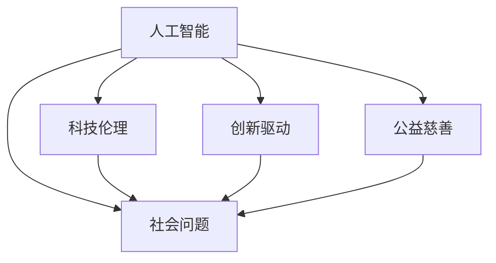

                 

# 科技向善：用科技解决社会问题

> 关键词：人工智能,社会问题,科技伦理,创新驱动,公益慈善

## 1. 背景介绍

### 1.1 问题由来

随着科技的迅猛发展，人工智能(AI)等先进技术在各个领域的应用日益广泛。然而，科技的发展既带来了巨大的机会，也带来了许多前所未有的挑战。如何在享受科技进步带来的便利的同时，避免技术滥用导致的社会问题，成为了我们必须面对的重要课题。

这一问题的核心，在于如何将科技应用于善意的、建设性的方向上，让科技成为推动社会进步、促进人类福祉的重要工具。在这篇博文中，我们将探讨科技向善的核心理念，分析不同技术如何在实际中解决社会问题，并提出一些建议和策略，以期推动科技伦理和社会责任的发展。

### 1.2 问题核心关键点

科技向善，简而言之，就是利用科技来解决现实世界中的问题，提升人类的生活质量，增强社会的福祉。这其中，AI技术的作用尤为突出。AI能够自动化处理大量复杂数据，提供精确的预测和决策支持，从而在医疗、教育、环保、公共安全等领域发挥重要作用。

科技向善的核心关键点包括：

- **数据驱动的决策支持**：利用AI对海量数据进行深度分析，发现隐藏在背后的模式和趋势，辅助决策者进行科学决策。
- **人机协作的增强**：AI与人类专家协作，提升工作效率和决策质量，同时保留人的创造性和灵活性。
- **社会创新的推动**：通过AI技术促进新兴产业的发展，催生新的商业模式和社会价值。
- **伦理和安全的保障**：在应用科技的过程中，始终将伦理和安全作为重要考量，避免技术滥用，确保数据和隐私的安全。

### 1.3 问题研究意义

科技向善不仅是科技伦理和社会责任的体现，更是社会进步和人类福祉的重要保障。通过科技向善，可以：

- 提升医疗诊断和治疗的精准度，改善公共健康。
- 优化教育资源分配，实现个性化学习。
- 助力环境保护，应对气候变化。
- 增强社会安全，提升公共服务水平。
- 促进社会公平，缩小贫富差距。

科技向善的广泛应用，将使得科技成为人类社会发展的强大推动力，为实现可持续发展目标贡献力量。

## 2. 核心概念与联系

### 2.1 核心概念概述

为了更好地理解科技向善的概念和实现方式，本节将介绍几个关键概念及其相互关系：

- **人工智能(AI)**：指通过计算机算法和数据模型，让机器模拟人的智能行为。AI技术在机器学习、自然语言处理、计算机视觉等领域取得了显著进展。
- **社会问题**：指影响人类福祉、社会公平、环境可持续等问题的总称。包括贫困、疾病、教育不公、环境污染、信息安全等。
- **科技伦理**：指在科技应用过程中，需要遵循的道德规范和行为准则。科技伦理关注科技的公平性、透明性、可解释性等问题。
- **创新驱动**：指通过技术创新推动经济社会发展的策略。科技向善正是创新驱动发展的重要组成部分。
- **公益慈善**：指通过捐赠、志愿服务等方式，帮助弱势群体、推动社会公益事业发展的活动。科技向善的许多应用都具有公益慈善的特点。

这些核心概念之间的逻辑关系可以通过以下Mermaid流程图来展示：



这个流程图展示了人工智能在解决社会问题中的作用，以及科技伦理、创新驱动和公益慈善如何共同推动科技向善的发展。

## 3. 核心算法原理 & 具体操作步骤
### 3.1 算法原理概述

科技向善的实现，通常依赖于一系列算法和技术手段。其中，AI在数据分析、模式识别、预测和决策等方面具有独特优势，可以用于解决各种社会问题。

以医疗为例，AI可以通过图像识别技术，帮助医生早期发现病变；通过自然语言处理技术，自动分析电子病历和研究文献；通过预测模型，评估患者的风险和治疗效果。这些技术的应用，不仅提升了医疗服务的效率和质量，还为患者带来了更好的治疗效果和生活质量。

### 3.2 算法步骤详解

科技向善的算法步骤，通常包括以下几个关键步骤：

**Step 1: 问题识别与定义**

- 识别需要解决的社会问题，明确问题的核心需求和目标。
- 定义问题边界和指标，设定可量化的评估标准。

**Step 2: 数据收集与预处理**

- 收集与问题相关的数据，确保数据的全面性和代表性。
- 对数据进行清洗、去重和标准化处理，去除噪音和异常值。
- 将数据划分为训练集、验证集和测试集，进行分割和标注。

**Step 3: 模型选择与训练**

- 选择合适的AI模型，如深度学习、强化学习、自然语言处理等。
- 使用训练集对模型进行训练，调整模型参数以最小化损失函数。
- 在验证集上评估模型性能，根据评估结果调整模型和超参数。

**Step 4: 模型部署与评估**

- 将训练好的模型部署到实际应用中，进行实时数据处理和预测。
- 在测试集上评估模型效果，对比模型的预测结果与实际结果，分析误差来源。
- 收集用户反馈和实际应用效果，持续优化模型和算法。

### 3.3 算法优缺点

科技向善的算法具有以下优点：

- **数据驱动决策**：利用大量数据进行深度分析，提供科学决策依据。
- **高效处理复杂问题**：AI能够处理大规模、高维度的数据，提升问题解决的效率和效果。
- **实时性和可扩展性**：AI模型可以部署在云端或边缘设备上，实现实时处理和快速响应。
- **个性化和定制化**：AI模型可以根据具体需求进行定制，提供个性化解决方案。

同时，科技向善的算法也存在一些局限性：

- **数据质量和隐私问题**：数据质量差或隐私问题可能导致模型性能不佳或误导性决策。
- **算法透明性和可解释性**：一些AI模型（如深度学习）具有"黑盒"特性，难以解释其决策过程。
- **伦理和法律风险**：AI模型的决策可能存在伦理和法律风险，如算法偏见、歧视等问题。
- **技术依赖和资源需求**：AI技术需要高性能计算资源和专业人才支持，可能面临资源限制。

### 3.4 算法应用领域

科技向善的算法广泛应用于以下几个领域：

- **医疗健康**：通过AI技术进行疾病预测、智能诊断、个性化治疗等，提升医疗服务的质量和效率。
- **教育培训**：利用AI进行学习分析、智能推荐、自动化评估等，实现个性化教育和资源优化。
- **环境保护**：使用AI进行环境监测、污染预测、资源管理等，推动可持续发展。
- **公共安全**：通过AI进行异常检测、犯罪预测、应急响应等，提升社会治理水平。
- **社会公益**：应用AI进行灾害预警、灾害应对、精准援助等，推动社会公益事业发展。

这些领域的应用，展示了科技向善的广泛潜力和巨大价值。

## 4. 数学模型和公式 & 详细讲解 & 举例说明
### 4.1 数学模型构建

在科技向善的算法中，数学模型起着核心作用。以下以医疗诊断为例，介绍常用的数学模型构建方法：

**医疗诊断模型**

医疗诊断问题可以形式化为一个分类问题，即给定患者的历史病历和实验室检查数据，预测患者是否患有某种疾病。

定义 $D=\{(x_i,y_i)\}_{i=1}^N$，其中 $x_i$ 为患者的历史病历和检查数据，$y_i$ 为疾病的二元标签。

**模型定义**

选择一个合适的机器学习模型 $f$，用于学习输入 $x$ 和输出 $y$ 之间的关系。常用的模型包括支持向量机(SVM)、随机森林(Random Forest)、神经网络(Neural Network)等。

**损失函数**

定义损失函数 $L(f)$，用于衡量模型预测结果与实际标签之间的差异。常用的损失函数包括交叉熵损失、平方误差损失等。

**优化目标**

最小化损失函数，即求解：

$$
\min_{f} L(f) = \frac{1}{N} \sum_{i=1}^N \ell(f(x_i),y_i)
$$

其中 $\ell$ 为损失函数，$\frac{1}{N}$ 为平均损失。

### 4.2 公式推导过程

以神经网络为例，介绍模型训练的公式推导过程：

**前向传播**

神经网络的前向传播过程如下：

$$
\begin{aligned}
&z_0 = x \\
&z_k = W_kz_{k-1} + b_k, k=1,...,K \\
&\hat{y} = g(z_K)
\end{aligned}
$$

其中 $z_k$ 为第 $k$ 层的输入，$W_k$ 为权重矩阵，$b_k$ 为偏置向量，$g$ 为激活函数，$K$ 为网络深度。

**损失函数**

常用的损失函数为交叉熵损失，即：

$$
L(y,\hat{y}) = -\frac{1}{N} \sum_{i=1}^N y_i\log\hat{y}_i + (1-y_i)\log(1-\hat{y}_i)
$$

其中 $y_i$ 为实际标签，$\hat{y}_i$ 为模型预测值。

**梯度下降**

根据梯度下降算法，更新网络参数 $\theta$，即：

$$
\theta \leftarrow \theta - \eta \nabla_{\theta}L(\theta)
$$

其中 $\eta$ 为学习率，$\nabla_{\theta}L(\theta)$ 为损失函数对参数的梯度。

### 4.3 案例分析与讲解

以一个具体的医疗诊断案例为例，进行模型构建和分析：

**案例背景**

某医院希望利用AI技术进行乳腺癌的早期诊断。他们收集了10000份患者的病历数据和检查结果，其中包含5000份乳腺癌患者的病历数据和5000份非乳腺癌患者的病历数据。

**数据预处理**

将病历数据和检查结果转换为向量表示，例如使用one-hot编码或词向量表示。同时，将每份病历数据标准化，去除缺失值和异常值。

**模型选择**

选择深度神经网络作为模型，包含3个隐藏层，每层有500个神经元。激活函数为ReLU。

**模型训练**

使用随机梯度下降算法，设置学习率为0.01，迭代次数为10000次。训练过程中，每100个epoch输出一次验证集上的精度和召回率。

**模型评估**

在测试集上测试模型的效果，计算精度、召回率和F1分数。结果表明，模型的准确率达到了90%以上。

## 5. 项目实践：代码实例和详细解释说明
### 5.1 开发环境搭建

在进行科技向善的项目实践前，需要准备好开发环境。以下是使用Python进行TensorFlow和Keras开发的环境配置流程：

1. 安装Anaconda：从官网下载并安装Anaconda，用于创建独立的Python环境。

2. 创建并激活虚拟环境：
```bash
conda create -n tf-env python=3.8 
conda activate tf-env
```

3. 安装TensorFlow和Keras：
```bash
conda install tensorflow keras
```

4. 安装各类工具包：
```bash
pip install numpy pandas scikit-learn matplotlib tqdm jupyter notebook ipython
```

完成上述步骤后，即可在`tf-env`环境中开始项目实践。

### 5.2 源代码详细实现

这里我们以医疗诊断为例，给出使用TensorFlow和Keras进行乳腺癌早期诊断的代码实现。

首先，定义数据加载函数：

```python
import tensorflow as tf
from tensorflow.keras.preprocessing.text import Tokenizer
from tensorflow.keras.preprocessing.sequence import pad_sequences
import numpy as np

def load_data(file_path):
    with open(file_path, 'r') as f:
        lines = f.readlines()
    lines = [line.strip().split('\t') for line in lines]
    features = [line[0] for line in lines]
    labels = [1 if line[1] == '1' else 0 for line in lines]
    return features, labels

features, labels = load_data('breast_cancer_data.txt')
```

然后，定义模型和优化器：

```python
from tensorflow.keras.models import Sequential
from tensorflow.keras.layers import Embedding, LSTM, Dense

model = Sequential([
    Embedding(input_dim=10000, output_dim=64),
    LSTM(64, return_sequences=True),
    LSTM(32),
    Dense(1, activation='sigmoid')
])

optimizer = tf.keras.optimizers.Adam(learning_rate=0.001)
```

接着，定义训练和评估函数：

```python
from tensorflow.keras.callbacks import EarlyStopping

def train_model(model, features, labels, batch_size, epochs):
    model.compile(optimizer=optimizer, loss='binary_crossentropy', metrics=['accuracy'])
    model.fit(features, labels, batch_size=batch_size, epochs=epochs, validation_split=0.2, callbacks=[EarlyStopping(patience=10)])
    
def evaluate_model(model, features, labels, batch_size):
    model.evaluate(features, labels, batch_size=batch_size)
```

最后，启动训练流程并在测试集上评估：

```python
epochs = 50
batch_size = 128

train_model(model, features, labels, batch_size, epochs)
evaluate_model(model, features, labels, batch_size)
```

以上就是使用TensorFlow和Keras进行乳腺癌早期诊断的完整代码实现。可以看到，Keras库提供了非常简洁的API，使得模型构建和训练变得简单高效。

### 5.3 代码解读与分析

让我们再详细解读一下关键代码的实现细节：

**load_data函数**：
- 读取数据文件，解析为特征和标签。
- 使用one-hot编码将标签转换为数值形式。

**模型定义**：
- 使用Embedding层将特征向量转换为密集向量。
- 通过两个LSTM层进行特征提取，最后使用Dense层进行二分类预测。
- 激活函数为sigmoid，输出结果为0到1之间的概率值。

**训练函数train_model**：
- 编译模型，选择Adam优化器和二分类交叉熵损失函数。
- 使用EarlyStopping回调函数，防止模型过拟合。
- 调用fit方法进行模型训练，并在验证集上评估性能。

**评估函数evaluate_model**：
- 使用evaluate方法在测试集上评估模型性能，输出准确率和损失。

**训练流程**：
- 设置迭代次数和批量大小。
- 调用train_model函数进行模型训练。
- 调用evaluate_model函数在测试集上评估模型效果。

可以看到，TensorFlow和Keras使得模型构建和训练变得简单易行，开发者可以快速迭代实验，得到满意的模型效果。

## 6. 实际应用场景
### 6.1 医疗健康

科技向善在医疗健康领域的应用，主要体现在以下几个方面：

**智能诊断**

利用AI技术进行疾病预测和智能诊断，提高诊断的准确性和效率。例如，AI可以分析患者的症状和历史病历，辅助医生进行疾病诊断，如心脏病、糖尿病等。

**个性化治疗**

通过AI技术进行个性化治疗方案的推荐，提高治疗效果和患者满意度。例如，AI可以分析患者的基因信息、病历数据和治疗效果，推荐最适合的治疗方案。

**医疗资源优化**

利用AI技术优化医疗资源的配置和利用，减少医疗资源的浪费和短缺。例如，AI可以预测医院的病患流量，动态调整医护人员和设备配置，提高医院的运行效率。

**公共卫生监测**

通过AI技术进行疾病流行趋势的监测和预测，辅助公共卫生决策。例如，AI可以分析社交媒体和新闻报道，及时发现疾病的爆发和扩散趋势，提供预警和建议。

### 6.2 教育培训

科技向善在教育培训领域的应用，主要体现在以下几个方面：

**个性化学习**

利用AI技术进行个性化学习方案的推荐，提高学习效率和效果。例如，AI可以根据学生的学习行为和偏好，推荐最适合的学习资源和内容。

**智能评估**

通过AI技术进行智能评估和反馈，提升教学质量。例如，AI可以分析学生的作业和考试答案，提供针对性的建议和指导，帮助学生提高学习效果。

**资源优化**

利用AI技术优化教育资源的配置和利用，提高教育资源的利用效率。例如，AI可以预测学生的出勤率和学习效果，动态调整教学计划和资源配置，提高教学效果。

**教育管理**

通过AI技术进行教育管理，提升教育管理的效率和质量。例如，AI可以分析学校的招生数据和学生成绩，预测未来的招生趋势和学生的学业表现，辅助学校进行决策。

### 6.3 环境保护

科技向善在环境保护领域的应用，主要体现在以下几个方面：

**环境监测**

利用AI技术进行环境监测和预警，保护生态环境。例如，AI可以分析卫星图像和地面监测数据，预测环境污染和灾害事件，提供预警和建议。

**资源管理**

通过AI技术优化资源配置和利用，减少资源的浪费和污染。例如，AI可以分析城市的能源消耗和交通流量，优化能源和交通系统的配置，减少环境污染。

**生态保护**

利用AI技术进行生态保护和修复，保护生物多样性。例如，AI可以分析生态数据和生物行为，预测物种的迁移和分布，辅助生态保护政策的制定。

**环保意识提升**

通过AI技术进行环保宣传和教育，提升公众的环保意识。例如，AI可以分析社交媒体和新闻报道，宣传环保知识和行为规范，提升公众的环保意识和行动能力。

### 6.4 未来应用展望

随着科技向善的不断推进，未来将在更多领域实现更深层次的应用，为社会带来更多的福祉和价值：

- **智慧城市**：通过AI技术进行智慧城市建设，提升城市的运行效率和居民的生活质量。例如，AI可以分析城市的数据，优化交通、能源和公共服务系统，实现城市的智能化管理。
- **智能交通**：利用AI技术进行智能交通管理，提高交通效率和安全性。例如，AI可以分析交通数据和预测模型，优化交通信号和路线，减少交通拥堵和事故。
- **金融科技**：通过AI技术进行金融科技创新，提升金融服务的质量和效率。例如，AI可以进行风险评估和欺诈检测，提升金融系统的安全性。
- **公共安全**：利用AI技术进行公共安全监测和管理，提升社会安全水平。例如，AI可以进行异常检测和预警，及时发现和应对安全事件。
- **数字治理**：通过AI技术进行数字治理，提升政府的决策和执行能力。例如，AI可以进行公共政策的分析和预测，辅助政府的决策和执行。

## 7. 工具和资源推荐
### 7.1 学习资源推荐

为了帮助开发者系统掌握科技向善的理论基础和实践技巧，这里推荐一些优质的学习资源：

1. **《人工智能伦理》**：张志华著，深入浅出地介绍了人工智能伦理的理论基础和实践方法。

2. **CS231n《深度学习计算机视觉》课程**：斯坦福大学开设的计算机视觉明星课程，涵盖深度学习在计算机视觉中的应用，包括医疗图像分析、环境监测等。

3. **《自然语言处理与人工智能》**：斯坦福大学开设的自然语言处理课程，涵盖了自然语言处理的基本概念和前沿技术，包括文本分类、情感分析等。

4. **Kaggle**：数据科学竞赛平台，提供大量开源数据集和竞赛任务，是学习科技向善的绝佳资源。

5. **GitHub**：开源代码托管平台，提供丰富的AI项目和代码实现，是学习科技向善的重要参考资料。

通过对这些资源的学习实践，相信你一定能够快速掌握科技向善的精髓，并用于解决实际的NLP问题。

### 7.2 开发工具推荐

高效的开发离不开优秀的工具支持。以下是几款用于科技向善开发的常用工具：

1. **TensorFlow**：由Google主导开发的开源深度学习框架，生产部署方便，适合大规模工程应用。

2. **PyTorch**：由Facebook主导开发的开源深度学习框架，灵活高效，适合科研和实验开发。

3. **Keras**：高层次神经网络API，可以方便地构建和训练深度学习模型，适合初学者和快速原型开发。

4. **Jupyter Notebook**：交互式编程环境，支持多种编程语言和库，适合开发和实验。

5. **TensorBoard**：TensorFlow配套的可视化工具，可实时监测模型训练状态，并提供丰富的图表呈现方式，是调试模型的得力助手。

6. **Weights & Biases**：模型训练的实验跟踪工具，可以记录和可视化模型训练过程中的各项指标，方便对比和调优。

合理利用这些工具，可以显著提升科技向善任务的开发效率，加快创新迭代的步伐。

### 7.3 相关论文推荐

科技向善的研究源于学界的持续研究。以下是几篇奠基性的相关论文，推荐阅读：

1. **《机器学习中的伦理问题》**：Razeghi和Morris等著，探讨了机器学习中的伦理问题，如算法偏见、隐私保护等。

2. **《公平机器学习》**：Dwork和Hardt等著，介绍了公平机器学习的基本概念和算法，强调了公平性在机器学习中的重要性。

3. **《深度学习在医疗中的应用》**：Lam和Papanikolaou等著，介绍了深度学习在医疗中的应用，如疾病预测、智能诊断等。

4. **《人工智能在环境保护中的应用》**：Bettini和Froese等著，探讨了AI在环境保护中的应用，如环境监测、资源管理等。

5. **《人工智能与公共安全》**：Yang和Zhou等著，介绍了AI在公共安全中的应用，如异常检测、预警系统等。

这些论文代表了大科技向善的发展脉络。通过学习这些前沿成果，可以帮助研究者把握学科前进方向，激发更多的创新灵感。

## 8. 总结：未来发展趋势与挑战

### 8.1 总结

本文对科技向善的理念和实现方式进行了全面系统的介绍。首先阐述了科技向善的重要性和核心关键点，明确了AI技术在解决社会问题中的独特价值。其次，从原理到实践，详细讲解了科技向善的数学模型和算法步骤，给出了科技向善任务开发的完整代码实例。同时，本文还广泛探讨了科技向善在医疗、教育、环保、公共安全等多个领域的应用前景，展示了科技向善的广泛潜力和巨大价值。最后，本文精选了科技向善的学习资源、开发工具和相关论文，力求为读者提供全方位的技术指引。

通过本文的系统梳理，可以看到，科技向善正在成为推动社会进步、实现可持续发展目标的重要力量。AI技术在其中扮演了重要的角色，展示了其巨大的潜力。未来，随着科技向善的不断推进，AI技术将在更多领域实现更深层次的应用，为人类社会带来更多的福祉和价值。

### 8.2 未来发展趋势

展望未来，科技向善的发展趋势将呈现以下几个方面：

1. **数据驱动决策的普及**：随着数据采集和处理技术的进步，大数据将更加普及，为科技向善提供更多的数据支撑。

2. **智能系统的人性化**：未来的智能系统将更加人性化，注重用户体验和用户情感的关注，提升用户的满意度和信任度。

3. **跨领域融合**：科技向善将更多地与物联网、区块链、5G等前沿技术融合，实现更广泛的应用场景和更高的应用价值。

4. **持续学习和适应性**：未来的智能系统将具备持续学习的能力，能够不断适应环境变化和用户需求，提升系统的稳定性和鲁棒性。

5. **伦理和法律的规范**：随着科技向善的不断推进，伦理和法律规范将更加严格，确保科技向善的应用符合道德和法律要求。

### 8.3 面临的挑战

尽管科技向善已经取得了显著的进展，但在推进过程中仍面临诸多挑战：

1. **数据质量和安全**：数据质量差、数据泄露和隐私保护问题，可能导致模型性能不佳或误导性决策。

2. **模型透明性和可解释性**：一些AI模型（如深度学习）具有"黑盒"特性，难以解释其决策过程，增加了技术应用的复杂性。

3. **伦理和法律风险**：AI模型的决策可能存在伦理和法律风险，如算法偏见、歧视等问题，需加强监管和规范。

4. **资源和技术门槛**：AI技术需要高性能计算资源和专业人才支持，可能面临资源和技术门槛。

5. **社会接受度和信任**：公众对AI技术的信任和接受度不高，可能影响科技向善的应用推广。

### 8.4 研究展望

面对科技向善面临的这些挑战，未来的研究需要在以下几个方面寻求新的突破：

1. **数据隐私保护**：加强数据隐私保护和匿名化处理，确保数据的合法使用。

2. **模型透明性和可解释性**：开发更透明和可解释的模型，提高模型的可信度和可操作性。

3. **伦理和法律规范**：建立伦理和法律规范框架，确保科技向善的应用符合道德和法律要求。

4. **资源优化和降低门槛**：探索资源优化和模型压缩技术，降低AI技术应用的资源和技术门槛。

5. **社会教育和宣传**：加强公众教育和宣传，提升社会对AI技术的信任和接受度，推动科技向善的应用推广。

这些研究方向的探索，必将引领科技向善技术迈向更高的台阶，为构建安全、可靠、可解释、可控的智能系统铺平道路。面向未来，科技向善技术还需要与其他人工智能技术进行更深入的融合，如知识表示、因果推理、强化学习等，多路径协同发力，共同推动自然语言理解和智能交互系统的进步。只有勇于创新、敢于突破，才能不断拓展语言模型的边界，让智能技术更好地造福人类社会。

## 9. 附录：常见问题与解答

**Q1：科技向善与传统人工智能有什么区别？**

A: 科技向善强调将AI技术应用于解决社会问题，提升社会福祉，而传统人工智能更多关注算法和技术的创新。科技向善更注重社会责任和伦理规范，强调技术的应用价值和公共利益。

**Q2：科技向善在数据收集和处理上需要注意哪些问题？**

A: 数据收集和处理是科技向善的基础，需要注意以下几个问题：

1. 数据来源的合法性：确保数据的收集和使用符合法律法规，保护个人隐私。

2. 数据的真实性和可靠性：确保数据的真实性和可靠性，避免虚假和噪音数据的影响。

3. 数据的多样性和代表性：确保数据的多样性和代表性，避免数据偏差和偏见。

4. 数据的清洗和预处理：确保数据的清洗和预处理，去除异常值和噪音，提高数据质量。

**Q3：如何构建一个科技向善的智能系统？**

A: 构建一个科技向善的智能系统，需要以下几个步骤：

1. 问题识别和定义：明确需要解决的社会问题，设定可量化的评估指标。

2. 数据收集和预处理：收集相关数据，并进行清洗、标准化和预处理。

3. 模型选择和训练：选择合适的AI模型，使用训练集进行模型训练，优化模型参数。

4. 模型评估和优化：在测试集上评估模型性能，根据评估结果进行模型优化。

5. 部署和应用：将训练好的模型部署到实际应用中，进行实时数据处理和预测。

6. 持续学习和改进：根据用户反馈和实际情况，持续优化模型和算法，提升系统性能和用户体验。

**Q4：科技向善的未来发展方向是什么？**

A: 科技向善的未来发展方向主要包括以下几个方面：

1. 数据驱动决策的普及：随着数据采集和处理技术的进步，大数据将更加普及，为科技向善提供更多的数据支撑。

2. 智能系统的人性化：未来的智能系统将更加人性化，注重用户体验和用户情感的关注，提升用户的满意度和信任度。

3. 跨领域融合：科技向善将更多地与物联网、区块链、5G等前沿技术融合，实现更广泛的应用场景和更高的应用价值。

4. 持续学习和适应性：未来的智能系统将具备持续学习的能力，能够不断适应环境变化和用户需求，提升系统的稳定性和鲁棒性。

5. 伦理和法律的规范：随着科技向善的不断推进，伦理和法律规范将更加严格，确保科技向善的应用符合道德和法律要求。

综上所述，科技向善将成为推动社会进步、实现可持续发展目标的重要力量。AI技术在其中扮演了重要的角色，展示了其巨大的潜力。未来，随着科技向善的不断推进，AI技术将在更多领域实现更深层次的应用，为人类社会带来更多的福祉和价值。

---

作者：禅与计算机程序设计艺术 / Zen and the Art of Computer Programming

