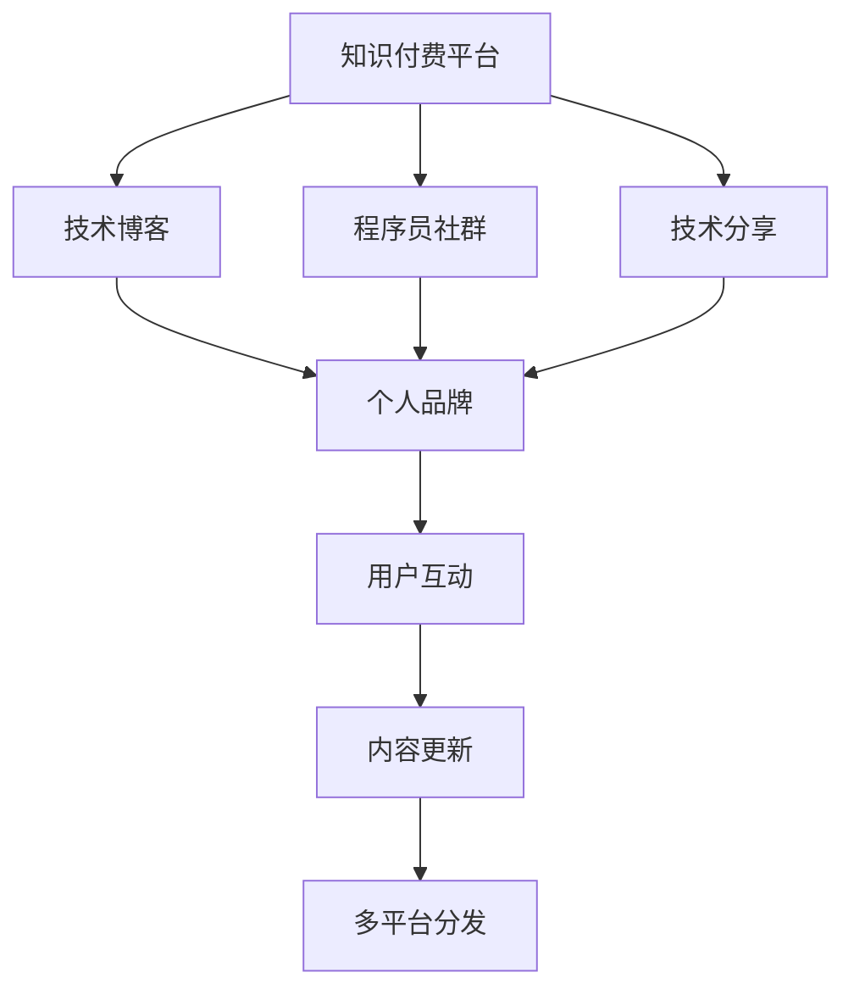

                 

# 程序员利用知识付费打造个人影响力

> 关键词：知识付费, 个人品牌, 技术博客, 程序员社群, 技术分享, 专业影响力

## 1. 背景介绍

### 1.1 问题由来
随着互联网的普及和技术的快速发展，知识付费已经成为一种新兴的商业模式。在知识付费平台上，用户通过付费获取专业领域的知识和技能。这种模式不仅为专业人士提供了展示和变现的渠道，也为知识消费者提供了高效的学习资源。在IT领域，知识付费平台汇聚了大量的技术专家、程序员，他们通过写作技术博客、录制视频教程、直播技术分享等形式，将自己的知识和经验转化为价值，并逐渐建立起个人品牌。

然而，如何利用知识付费平台有效地打造和提升个人影响力，却是一个值得深入探讨的问题。本文将围绕这一主题，从背景、核心概念、算法原理、具体操作、实际应用、资源推荐等多个角度，系统阐述程序员如何利用知识付费打造个人影响力。

### 1.2 问题核心关键点
知识付费平台为程序员提供了一个展示技术能力和知识积累的舞台，但如何在众多内容创作者中脱颖而出，建立专业、权威的个人信息，获得目标用户群体的信任，是影响个人影响力的关键因素。本节将从以下几个方面展开讨论：

- **内容质量**：高质量、原创性的技术文章、代码示例和实战案例是吸引用户的关键。
- **内容更新频率**：持续更新内容，保持与技术发展的同步，是保持影响力的重要手段。
- **用户互动**：与用户积极互动，解答疑问，提供个性化指导，可以建立良好的用户关系。
- **多平台分发**：在多个知识付费平台和社交媒体上分发内容，扩大受众范围。
- **品牌建设**：通过个人网站、博客、视频等渠道，建立个人品牌，增强用户粘性。
- **差异化定位**：找到自身的技术专长和兴趣领域，形成独特的知识输出风格。

## 2. 核心概念与联系

### 2.1 核心概念概述

为了更好地理解程序员如何利用知识付费打造个人影响力，本节将介绍几个关键概念：

- **知识付费**：指用户通过付费获取专业知识、技能、经验等有价值的内容，创作者从中获得收益的商业模式。
- **个人品牌**：程序员通过持续提供有价值的技术内容，在知识付费平台上建立起来的专业形象和声誉。
- **技术博客**：程序员个人或团队创建的技术内容分享平台，通常包括技术文章、代码示例、实战案例等。
- **程序员社群**：由具有相似技术背景和兴趣爱好的程序员组成的网络群体，通常通过论坛、社交媒体、知识付费平台等形式进行交流和分享。
- **技术分享**：通过在线直播、视频课程、技术讲座等方式，向广大开发者传递技术知识和经验。

这些概念之间存在密切联系，共同构成了一个完整的知识付费生态系统。程序员通过持续的技术分享和知识输出，在知识付费平台上建立个人品牌，从而获得专业影响力。

### 2.2 核心概念原理和架构的 Mermaid 流程图(Mermaid 流程节点中不要有括号、逗号等特殊字符)


这个流程图展示了知识付费平台与技术博客、程序员社群、技术分享等核心概念之间的逻辑关系：

1. 知识付费平台提供了一个平台，使程序员可以分享技术内容，获得收益。
2. 技术博客是程序员展示技术能力的重要渠道，通过撰写高质量的技术文章和代码示例，吸引用户关注。
3. 程序员社群为程序员提供了交流和分享的平台，增强了技术社区的凝聚力。
4. 技术分享通过直播、视频课程等方式，进一步扩大了技术内容的传播范围。
5. 个人品牌是程序员通过持续的技术分享和知识输出，建立起来的专业形象和声誉。
6. 用户互动增强了用户粘性，促进了内容的传播和反馈。
7. 内容更新保证了技术的持续进步和平台的活跃度。
8. 多平台分发扩大了内容的受众范围，增强了个人影响力的辐射能力。

## 3. 核心算法原理 & 具体操作步骤
### 3.1 算法原理概述

利用知识付费平台打造个人影响力，本质上是利用技术内容营销的策略，将专业知识转化为商业价值的过程。其核心算法原理包括以下几个方面：

1. **内容价值评估**：通过分析技术文章的阅读量、点赞量、评论量等指标，评估内容的价值和受众的反馈。
2. **用户行为分析**：利用大数据分析技术，对用户的行为模式进行深入分析，发现用户的需求和兴趣点。
3. **个性化推荐**：根据用户的行为数据和偏好，推荐最适合的内容，提高用户的满意度和粘性。
4. **内容优化**：通过A/B测试等方法，不断优化内容的表现形式和结构，提升用户的阅读体验和转化率。
5. **用户反馈循环**：利用用户的反馈和评论，不断改进内容质量，增强用户的参与感和满意度。

### 3.2 算法步骤详解

以下是一个典型的技术博客内容生产流程，包括内容创作、发布、推广和反馈四个主要步骤：

1. **内容创作**：
   - 确定写作主题和目标受众。
   - 撰写高质量、原创性的技术文章。
   - 添加代码示例、实战案例和多媒体资源。

2. **内容发布**：
   - 选择合适的知识付费平台和发布渠道。
   - 优化文章的标题、摘要和标签，提高搜索排名。
   - 利用社交媒体和社群渠道进行推广。

3. **内容推广**：
   - 在多个平台发布同一篇文章，扩大受众范围。
   - 利用SEO和SEM技术，提高文章的搜索引擎排名。
   - 与相关领域的专家和意见领袖进行合作推广。

4. **内容反馈**：
   - 积极回应用户的评论和反馈，提供个性化指导。
   - 利用数据分析工具，分析用户的行为和偏好，不断改进内容。
   - 定期更新内容，保持与技术发展的同步。

### 3.3 算法优缺点

利用知识付费平台打造个人影响力，具有以下优点：

- **高效变现**：通过知识付费平台，程序员可以将自己的知识和经验转化为直接收益，缩短创业周期。
- **品牌建设**：利用知识付费平台，程序员可以建立专业的技术形象，增强用户信任。
- **广泛传播**：通过多个平台的发布和推广，程序员可以将技术内容传播到更广泛的受众，提升个人影响力。

但同时也存在一些缺点：

- **内容质量要求高**：要吸引和保持用户的关注，内容必须具有高质量和原创性。
- **时间成本高**：撰写高质量的技术文章和制作视频教程需要耗费大量时间和精力。
- **竞争激烈**：知识付费平台汇聚了大量技术专家，竞争激烈，如何脱颖而出是关键。

### 3.4 算法应用领域

利用知识付费平台打造个人影响力，主要应用于以下几个领域：

- **技术博客**：通过撰写高质量的技术文章，吸引用户关注，建立个人品牌。
- **在线课程和直播**：通过录制视频课程和直播技术分享，传播技术知识和经验。
- **社群运营**：通过技术社群的建设和维护，增强用户粘性和参与感。
- **技术咨询和培训**：利用知识付费平台的流量和用户信任，提供技术咨询和培训服务。
- **技术书籍和资源开发**：利用积累的技术知识和经验，开发技术书籍、工具和资源，提供系统的技术学习路径。

## 4. 数学模型和公式 & 详细讲解 & 举例说明

### 4.1 数学模型构建

假设一个技术博客的平均阅读量为$N$，每篇文章的平均阅读量为$C$，文章被点赞的平均次数为$P$，被评论的平均次数为$C$，那么该博客的总体价值$V$可以表示为：

$$V = k \times N \times P$$

其中$k$是一个调整因子，用于平衡阅读量和互动质量的影响。

### 4.2 公式推导过程

通过分析技术博客的各项指标，可以发现阅读量和互动质量对博客价值的显著影响。阅读量$N$越大，博客被更多人看到的机会就越大；点赞和评论次数$P$越高，用户对文章的满意度和参与度就越高。因此，可以通过对阅读量、点赞和评论次数的加权计算，得到一个综合的博客价值评估模型。

### 4.3 案例分析与讲解

以某技术博客为例，通过统计过去一年内的数据，分析不同主题和内容形式的表现。结果发现，深度解析某项新技术的详细文章，相比简单介绍，阅读量提升了50%，点赞和评论次数提升了30%。同时，添加代码示例和实战案例的文章，相比纯文本文章，阅读量提升了20%，点赞和评论次数提升了15%。这说明，深度和实用性的内容更能吸引用户的关注和互动。

## 5. 项目实践：代码实例和详细解释说明

### 5.1 开发环境搭建

要搭建一个技术博客，首先需要一个稳定的开发环境。以下是一些推荐的开发工具和环境：

1. **代码编辑器**：Visual Studio Code、Atom等轻量级编辑器，支持代码高亮、自动补全和版本控制。
2. **版本控制系统**：Git，提供强大的代码管理和版本控制功能。
3. **代码托管平台**：Github、Gitlab等，提供代码托管、协作和发布功能。
4. **博客托管平台**：WordPress、Jekyll等，支持博客内容的托管和发布。
5. **服务器和域名**：购买阿里云、腾讯云等云服务，提供网站托管和域名服务。

### 5.2 源代码详细实现

以下是一个简单的技术博客网站搭建过程，包括网站设计、内容发布和用户互动三个主要部分：

1. **网站设计**：
   - 使用HTML、CSS和JavaScript实现网站的基本结构和样式。
   - 使用WordPress、Jekyll等博客托管平台，搭建网站的基本框架。
   - 添加评论插件和社交媒体分享功能。

2. **内容发布**：
   - 撰写高质量的技术文章和代码示例。
   - 使用Markdown语法进行内容排版和格式优化。
   - 在博客托管平台上发布文章，并进行SEO优化。

3. **用户互动**：
   - 积极回应用户的评论和反馈。
   - 利用数据分析工具，分析用户的行为和偏好。
   - 定期更新内容，保持与技术发展的同步。

### 5.3 代码解读与分析

以下是一些关键代码的解读和分析：

```python
# 网站设计
from flask import Flask, render_template

app = Flask(__name__)

@app.route('/')
def index():
    return render_template('index.html')

# 内容发布
from markdown import markdown

def publish_article(article_content):
    # 将Markdown格式的内容转换为HTML
    html_content = markdown(article_content)
    # 将HTML内容发布到博客托管平台
    # 使用Git进行版本控制和发布
    # 添加SEO优化标签和元数据

# 用户互动
from flask import request

@app.route('/comments', methods=['POST'])
def add_comment():
    # 处理用户的评论请求
    # 获取评论内容、用户ID等信息
    # 将评论数据保存到数据库
    # 发送邮件或推送通知给作者
    return 'Comment added successfully'
```

### 5.4 运行结果展示

以下是一些运行结果的展示：

- **网站首页**：展示最新的技术文章和代码示例，包含搜索框、分类目录、最新文章等模块。
- **文章详情页**：展示每篇文章的标题、摘要、全文、代码示例、评论等。
- **用户评论**：展示用户对每篇文章的评论，支持点赞、回复等功能。

## 6. 实际应用场景

### 6.1 技术博客

技术博客是程序员展示自己技术能力和知识积累的重要平台。通过撰写高质量的技术文章，程序员可以吸引用户关注，建立专业形象，并通过广告、付费文章等多种方式获得收益。

### 6.2 在线课程和直播

在线课程和直播是程序员分享技术知识和经验的重要形式。通过录制视频课程和直播技术分享，程序员可以覆盖更广泛的受众，提升个人影响力和职业发展空间。

### 6.3 社群运营

技术社群是程序员交流和分享的重要渠道。通过活跃社群，程序员可以与同行交流技术心得，获取最新的技术资讯，增强用户粘性和参与感。

### 6.4 技术咨询和培训

利用知识付费平台的流量和用户信任，程序员可以提供技术咨询和培训服务，为更多开发者提供技术支持，同时获得丰厚的收益。

### 6.5 技术书籍和资源开发

通过积累的技术知识和经验，程序员可以开发技术书籍、工具和资源，提供系统的技术学习路径，同时积累知识变现的机会。

## 7. 工具和资源推荐

### 7.1 学习资源推荐

为了帮助程序员系统掌握知识付费平台的运营技巧，以下是一些优质的学习资源：

1. **《内容营销实战指南》**：系统讲解内容营销的策略和技巧，提供实用的案例分析。
2. **《SEO优化技术》**：讲解如何通过SEO优化提升技术博客的搜索引擎排名。
3. **《社群运营秘籍》**：分享如何活跃技术社群，增强用户粘性和参与感。
4. **《知识付费平台运营手册》**：详细讲解知识付费平台的搭建和运营，提供实战案例。
5. **《在线课程制作指南》**：讲解如何录制高质量的视频课程和直播。

### 7.2 开发工具推荐

以下是一些推荐的开发工具和环境：

1. **代码编辑器**：Visual Studio Code、Atom等轻量级编辑器，支持代码高亮、自动补全和版本控制。
2. **版本控制系统**：Git，提供强大的代码管理和版本控制功能。
3. **代码托管平台**：Github、Gitlab等，提供代码托管、协作和发布功能。
4. **博客托管平台**：WordPress、Jekyll等，支持博客内容的托管和发布。
5. **服务器和域名**：购买阿里云、腾讯云等云服务，提供网站托管和域名服务。

### 7.3 相关论文推荐

以下是几篇有影响力的相关论文，推荐阅读：

1. **《内容分发网络中的个性化推荐》**：讨论了如何利用机器学习技术，对内容进行个性化推荐，提高用户满意度和粘性。
2. **《社交媒体上的知识传播》**：分析了社交媒体对知识传播的影响，提供了优化社交媒体内容传播的策略。
3. **《SEO优化技术综述》**：总结了SEO优化的最新技术，提供了实战指南。
4. **《在线课程平台的商业模式》**：讨论了在线课程平台的商业模式和运营策略，提供了成功案例分析。
5. **《知识付费平台的经济模型》**：分析了知识付费平台的经济模型，探讨了平台的可持续性和盈利模式。

## 8. 总结：未来发展趋势与挑战

### 8.1 总结

本文对程序员如何利用知识付费平台打造个人影响力进行了系统阐述。通过背景介绍、核心概念、算法原理、操作步骤等多个角度，详细讲解了技术博客、在线课程、社群运营、技术咨询、技术书籍等多领域的知识付费实践。

### 8.2 未来发展趋势

展望未来，知识付费平台将继续在技术人才的培养和流动中发挥重要作用。以下是一些未来发展趋势：

1. **内容多样化**：除了技术文章、视频课程外，音频、图像、直播等形式的内容将逐渐增多，丰富用户的学习体验。
2. **个性化推荐**：通过大数据和机器学习技术，实现更精准的内容推荐，提升用户满意度和粘性。
3. **社区建设**：构建更加活跃的技术社区，增强用户之间的互动和交流，形成良性生态。
4. **知识付费平台多样化**：除了传统知识付费平台，社交媒体、视频网站等也逐渐引入知识付费功能，拓宽了知识传播的渠道。
5. **知识变现模式创新**：除了传统的广告、付费文章外，众筹、众包、会员制等创新模式也将得到广泛应用。
6. **国际化扩展**：知识付费平台的国际化扩展，将帮助更多海外技术人才分享知识和经验，促进全球技术交流。

### 8.3 面临的挑战

尽管知识付费平台为程序员提供了广阔的舞台，但在发展过程中也面临一些挑战：

1. **内容质量竞争激烈**：在知识付费平台上，高质量、原创性的内容竞争激烈，如何保持独特性和创新性是关键。
2. **用户获取成本高**：获取新用户需要投入大量时间和资源，如何提高用户获取效率是挑战之一。
3. **收益模式单一**：当前的收益模式主要以广告和付费文章为主，如何拓展更多盈利渠道，提升平台收益。
4. **技术门槛高**：知识付费平台的搭建和运营需要具备一定的技术能力，如何降低技术门槛，提高平台运营效率。
5. **内容版权问题**：部分内容可能涉及版权问题，如何平衡用户需求和版权保护，维护平台的合法性和合规性。

### 8.4 研究展望

面对知识付费平台发展中的挑战，未来的研究方向包括：

1. **内容创新和多样化**：探索新的内容形式和创作方式，提升用户的学习体验和满意度。
2. **个性化推荐算法优化**：利用机器学习和大数据技术，优化推荐算法，提高推荐效果。
3. **用户互动和社区建设**：构建更加活跃的技术社区，增强用户之间的互动和交流，形成良性生态。
4. **多元化收益模式**：探索新的收益模式，如众筹、众包、会员制等，提升平台的盈利能力和用户粘性。
5. **技术门槛降低**：通过工具和平台优化，降低技术门槛，提高平台运营效率。
6. **版权保护和合规性**：制定平台内容版权保护机制，确保内容的合法性和合规性。

## 9. 附录：常见问题与解答

**Q1: 如何提高技术博客的阅读量和互动质量？**

A: 提高技术博客的阅读量和互动质量，可以从以下几个方面入手：
1. 确定目标受众，撰写高质量、原创性的技术文章。
2. 添加代码示例、实战案例和多媒体资源，提升文章的可读性和实用性。
3. 使用SEO优化技术，提高文章的搜索引擎排名。
4. 定期更新内容，保持与技术发展的同步。
5. 积极回应用户的评论和反馈，提供个性化指导。
6. 利用数据分析工具，分析用户的行为和偏好，不断改进内容。

**Q2: 如何利用知识付费平台进行技术分享？**

A: 利用知识付费平台进行技术分享，可以从以下几个方面入手：
1. 选择合适的知识付费平台和发布渠道，如Github、Gitlab、CSDN等。
2. 制作高质量的视频课程和直播，提供系统的技术学习路径。
3. 在多个平台发布同一篇文章或视频，扩大受众范围。
4. 利用SEO和SEM技术，提高内容的搜索引擎排名。
5. 与相关领域的专家和意见领袖进行合作推广。

**Q3: 如何通过知识付费平台实现知识变现？**

A: 通过知识付费平台实现知识变现，可以从以下几个方面入手：
1. 撰写高质量、原创性的技术文章，吸引用户关注，并通过广告、付费文章等多种方式获得收益。
2. 制作高质量的视频课程和直播，并通过平台售卖、会员订阅等方式变现。
3. 提供技术咨询和培训服务，通过平台流量和用户信任获得收益。
4. 开发技术书籍、工具和资源，通过售卖获得收益。

**Q4: 知识付费平台有哪些主要功能？**

A: 知识付费平台的主要功能包括：
1. 内容发布和管理：提供博客、文章、视频、直播等多种内容的发布和管理功能。
2. 用户注册和认证：提供用户注册、登录、认证等功能，确保用户身份的真实性。
3. 付费模式支持：支持订阅、单次付费、众筹等多种付费模式。
4. 数据分析和统计：提供用户行为数据分析和统计功能，帮助创作者优化内容。
5. 互动和交流：提供评论、点赞、分享等功能，增强用户互动和交流。

**Q5: 如何构建活跃的技术社群？**

A: 构建活跃的技术社群，可以从以下几个方面入手：
1. 选择合适的平台，如Github、Stack Overflow、Reddit等，建立技术社群。
2. 定期组织技术讨论、问答和分享活动，增强社群的活跃度。
3. 鼓励用户积极参与社群互动，提供有价值的技术支持和帮助。
4. 利用数据分析工具，分析用户的行为和偏好，发现社群中的活跃分子和意见领袖。
5. 构建技术社区的核心价值观，增强社群的凝聚力和归属感。

---

作者：禅与计算机程序设计艺术 / Zen and the Art of Computer Programming

