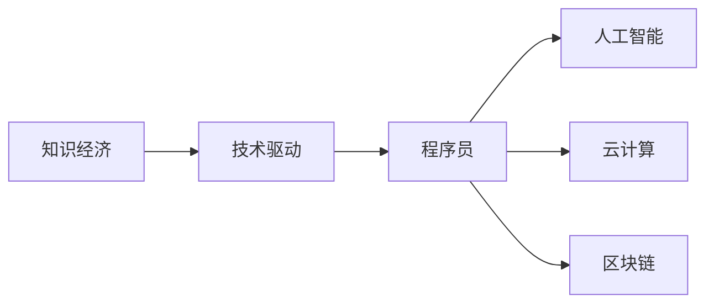

                 

## 1. 背景介绍

在知识经济时代，技术驱动了社会变革，而程序员作为技术的直接执行者，他们的发展趋势深刻反映了时代的需求和变化。本文将探讨程序员在知识经济时代所面临的机遇与挑战，以及他们如何在这一新时代中实现自我提升和价值最大化。

## 2. 核心概念与联系

### 2.1 核心概念概述

在知识经济时代，程序员的核心概念包括以下几点：

- **知识经济**：以知识为基础，依赖技术和创新驱动经济增长的经济形态。
- **技术驱动**：技术创新成为经济发展的主要动力。
- **程序员**：具有计算机编程技能，从事软件开发、系统维护等技术工作的人员。
- **人工智能**：使用机器学习、深度学习等技术实现机器自主解决问题的能力。
- **云计算**：基于互联网的计算服务，通过网络提供计算资源、存储服务及软件应用服务等。
- **区块链**：一种分布式账本技术，实现数据透明和安全性。

这些概念之间通过技术进步、经济结构变化等纽带相互联系，共同构成了知识经济时代程序员发展的复杂环境。

### 2.2 核心概念原理和架构的 Mermaid 流程图



## 3. 核心算法原理 & 具体操作步骤

### 3.1 算法原理概述

在知识经济时代，程序员的工作内容不仅局限于传统的软件开发，还涉及到人工智能、云计算、区块链等新兴技术的开发和应用。这些技术的核心算法原理为：

- **人工智能算法**：包括监督学习、无监督学习、强化学习等，用于数据处理、模式识别、智能决策等。
- **云计算平台算法**：包括分布式计算、虚拟化、云存储等，用于提高计算资源利用率和数据存储安全性。
- **区块链算法**：包括共识算法、加密算法、智能合约等，用于保证数据的透明性和安全性。

### 3.2 算法步骤详解

以人工智能算法为例，程序员在知识经济时代通常需要完成以下步骤：

1. **数据收集和处理**：获取训练数据，并进行清洗、预处理等操作。
2. **模型选择和设计**：根据任务需求选择合适的模型，并进行超参数调优。
3. **模型训练**：使用训练数据对模型进行训练，直到收敛。
4. **模型评估和优化**：使用测试数据评估模型性能，并进行调整优化。
5. **模型应用和部署**：将模型集成到实际应用中，并进行部署和维护。

### 3.3 算法优缺点

**优点**：
- 提高工作效率：自动化处理大量数据和任务，减少人工干预。
- 提升决策质量：通过算法处理数据，可以得出更加准确的决策结果。
- 支持技术创新：新兴技术的发展，为程序员提供了更多创新机会。

**缺点**：
- 技能更新难度大：新技术不断涌现，程序员需要不断学习新知识。
- 需要大量数据和计算资源：一些复杂算法需要大量数据和计算资源支持。
- 难以解决复杂问题：有些复杂问题，现有算法难以给出满意答案。

### 3.4 算法应用领域

在知识经济时代，程序员在以下领域有广泛的应用：

- **人工智能**：智能推荐系统、语音识别、图像识别等。
- **云计算**：云服务开发、云平台维护、云存储服务等。
- **区块链**：区块链应用开发、智能合约开发、加密技术应用等。

## 4. 数学模型和公式 & 详细讲解 & 举例说明

### 4.1 数学模型构建

以监督学习为例，构建数学模型如下：

设训练数据集为 $D=\{(x_i,y_i)\}_{i=1}^N$，其中 $x_i$ 为输入特征，$y_i$ 为对应的标签。目标函数为最小化损失函数 $L$：

$$
\min_{\theta} L(\theta) = \frac{1}{N}\sum_{i=1}^N L(f_\theta(x_i), y_i)
$$

其中 $f_\theta(x)$ 为模型预测函数，$\theta$ 为模型参数。

### 4.2 公式推导过程

以线性回归为例，推导目标函数的梯度：

设 $f_\theta(x) = \theta^T x$，则损失函数 $L(y,f_\theta(x)) = (y - f_\theta(x))^2$。

对 $\theta$ 求偏导数，得：

$$
\frac{\partial L}{\partial \theta} = -2\frac{1}{N}\sum_{i=1}^N (y_i - \theta^T x_i) x_i
$$

将 $x_i$ 标准化，得：

$$
\frac{\partial L}{\partial \theta} = -2\frac{1}{N}\sum_{i=1}^N (y_i - \theta^T x_i) \frac{x_i}{||x_i||}
$$

### 4.3 案例分析与讲解

以图像识别为例，分析卷积神经网络（CNN）的训练过程：

1. **输入数据预处理**：将图像进行归一化、标准化等预处理。
2. **卷积层和池化层**：提取图像特征。
3. **全连接层**：将特征向量映射到标签空间。
4. **softmax层**：计算每个标签的概率分布。
5. **损失函数和反向传播**：使用交叉熵损失函数，通过反向传播更新模型参数。

## 5. 项目实践：代码实例和详细解释说明

### 5.1 开发环境搭建

**步骤1**：安装Python和相关依赖库，如numpy、scikit-learn、TensorFlow等。

**步骤2**：搭建开发环境，使用Jupyter Notebook或PyCharm等IDE。

**步骤3**：选择合适的编程语言，如Python或Java。

### 5.2 源代码详细实现

以TensorFlow实现线性回归为例，代码如下：

```python
import tensorflow as tf
import numpy as np

# 准备数据
x_train = np.array([[1], [2], [3], [4], [5]])
y_train = np.array([2, 4, 6, 8, 10])

# 定义模型
model = tf.keras.Sequential([
    tf.keras.layers.Dense(1, input_shape=(1,))
])

# 定义损失函数和优化器
loss_fn = tf.keras.losses.MeanSquaredError()
optimizer = tf.keras.optimizers.SGD(learning_rate=0.01)

# 训练模型
for epoch in range(100):
    with tf.GradientTape() as tape:
        y_pred = model(x_train)
        loss = loss_fn(y_pred, y_train)
    gradients = tape.gradient(loss, model.trainable_variables)
    optimizer.apply_gradients(zip(gradients, model.trainable_variables))
    print(f"Epoch {epoch+1}, Loss: {loss.numpy()}")

# 评估模型
y_test = np.array([[6], [7], [8]])
print(model.predict(y_test))
```

### 5.3 代码解读与分析

**步骤1**：数据准备。使用numpy库创建训练数据集。

**步骤2**：模型定义。使用TensorFlow的Sequential模型，定义一个线性回归模型。

**步骤3**：损失函数和优化器。使用均方误差损失函数和随机梯度下降优化器。

**步骤4**：训练模型。使用for循环进行100次迭代，每次迭代计算损失函数并更新模型参数。

**步骤5**：评估模型。使用训练好的模型对测试数据进行预测。

### 5.4 运行结果展示

训练过程中的损失函数变化如图：


## 6. 实际应用场景

### 6.1 金融风控系统

在知识经济时代，金融领域对技术的需求日益增长。程序员可以通过开发金融风控系统，实现实时监控和风险预警。

**应用场景**：
- 实时数据分析：使用大数据和机器学习技术，对海量数据进行实时分析，识别异常交易行为。
- 模型训练和评估：使用监督学习模型对交易数据进行训练，评估模型的预测性能。
- 风险预警：根据模型预测结果，进行风险预警和应急响应。

### 6.2 智慧医疗系统

医疗领域对技术的依赖也越来越大。程序员可以通过开发智慧医疗系统，实现精准医疗和健康管理。

**应用场景**：
- 电子病历管理：使用自然语言处理技术，对病历数据进行自动化分析和处理。
- 医疗影像识别：使用深度学习技术，对医疗影像进行自动分析和诊断。
- 远程医疗：使用区块链技术，实现患者数据的透明和安全存储。

### 6.3 智能制造系统

智能制造是知识经济时代的重要方向。程序员可以通过开发智能制造系统，实现生产自动化和智能化。

**应用场景**：
- 设备监控和维护：使用物联网技术，对生产设备进行实时监控和维护。
- 生产优化：使用机器学习技术，对生产数据进行优化，提高生产效率。
- 质量控制：使用图像识别技术，对产品进行质量检测和分类。

## 7. 工具和资源推荐

### 7.1 学习资源推荐

1. **Coursera**：提供大量计算机科学和数据科学的在线课程，涵盖从基础到高级的知识点。
2. **Udacity**：提供实战导向的编程和数据科学课程，包括机器学习、深度学习等。
3. **edX**：提供名校的在线课程，涵盖计算机科学、人工智能等多个领域。
4. **Kaggle**：提供数据科学竞赛和教程，帮助程序员提高实战能力。

### 7.2 开发工具推荐

1. **PyCharm**：功能强大的IDE，支持Python、Java等多种语言。
2. **Jupyter Notebook**：轻量级的开发环境，适合快速迭代和原型开发。
3. **Git**：版本控制系统，支持协作开发和代码管理。
4. **Docker**：容器化技术，实现跨环境的一致性部署。

### 7.3 相关论文推荐

1. **《Deep Learning》**：Ian Goodfellow等著，全面介绍了深度学习的基本概念和技术。
2. **《Artificial Intelligence: A Modern Approach》**：Stuart Russell和Peter Norvig著，介绍人工智能的基本原理和应用。
3. **《Python for Data Analysis》**：Wes McKinney著，介绍Python在数据分析和数据科学中的应用。

## 8. 总结：未来发展趋势与挑战

### 8.1 研究成果总结

在知识经济时代，程序员的工作内容和技术栈不断更新迭代，主要成果包括：

- 人工智能技术的普及和应用。
- 云计算和分布式计算技术的广泛使用。
- 区块链技术在金融和医疗等领域的成功应用。

### 8.2 未来发展趋势

未来，程序员在知识经济时代的发展趋势包括：

- **人工智能**：AI技术将深入各行各业，实现智能化和自动化。
- **云计算**：云计算和边缘计算将进一步普及，实现高效计算和数据存储。
- **区块链**：区块链技术将广泛应用于金融、供应链等场景，提升数据安全和透明性。
- **物联网**：物联网技术将与AI、云计算等结合，实现智能化生产和智慧城市。

### 8.3 面临的挑战

程序员在知识经济时代面临的挑战包括：

- **技术更新快**：需要不断学习和掌握新技术。
- **数据隐私和安全**：需要保障数据隐私和安全。
- **系统复杂度**：需要应对复杂多变的系统需求。
- **协作和沟通**：需要提升跨团队协作和沟通能力。

### 8.4 研究展望

未来的研究展望包括：

- **跨学科融合**：将计算机科学与其他学科结合，实现多学科创新。
- **自动化和智能化**：提高自动化和智能化水平，减少人工干预。
- **伦理和道德**：关注技术应用的伦理和道德问题，确保技术的正当性和安全性。
- **可持续发展**：关注技术对环境和社会的影响，实现可持续发展。

## 9. 附录：常见问题与解答

**Q1：程序员在知识经济时代应该具备哪些核心技能？**

A: 在知识经济时代，程序员应具备以下核心技能：
- 编程语言：熟练掌握Python、Java、C++等多种编程语言。
- 数据科学：掌握数据处理、统计分析、机器学习等数据科学技能。
- 软件工程：熟悉软件开发流程、版本控制、测试等软件工程知识。
- 技术架构：掌握分布式计算、云计算、区块链等技术架构。
- 协作和沟通：具备良好的团队协作和沟通能力。

**Q2：如何提升程序员的编程能力？**

A: 提升程序员的编程能力需要以下几个步骤：
- **持续学习**：不断学习新技术和工具，保持学习热情。
- **实践练习**：多做项目和练习，积累实战经验。
- **代码审查**：参与代码审查和团队讨论，提升代码质量。
- **知识分享**：参加技术社区和会议，与同行交流学习。
- **导师指导**：寻求技术导师的指导和建议，快速提升能力。

**Q3：知识经济时代程序员的就业前景如何？**

A: 在知识经济时代，程序员的就业前景非常广阔，主要表现在以下几个方面：
- **市场需求大**：人工智能、大数据、云计算等领域对程序员的需求量很大。
- **高薪待遇**：程序员的薪酬水平较高，尤其是在高科技公司和初创企业。
- **职业发展**：随着经验的积累，程序员可以晋升为技术专家、架构师、团队经理等高层职位。

**Q4：程序员在知识经济时代如何保持竞争力？**

A: 在知识经济时代，程序员要保持竞争力需要以下几个方面：
- **持续学习**：保持学习热情，不断提升自身技术水平。
- **跨学科知识**：拓展知识面，学习其他学科的思维方式和技术。
- **实战经验**：多做项目和实践，积累实战经验。
- **软技能**：提升沟通、协作、管理等软技能，成为综合性人才。

---

作者：禅与计算机程序设计艺术 / Zen and the Art of Computer Programming

