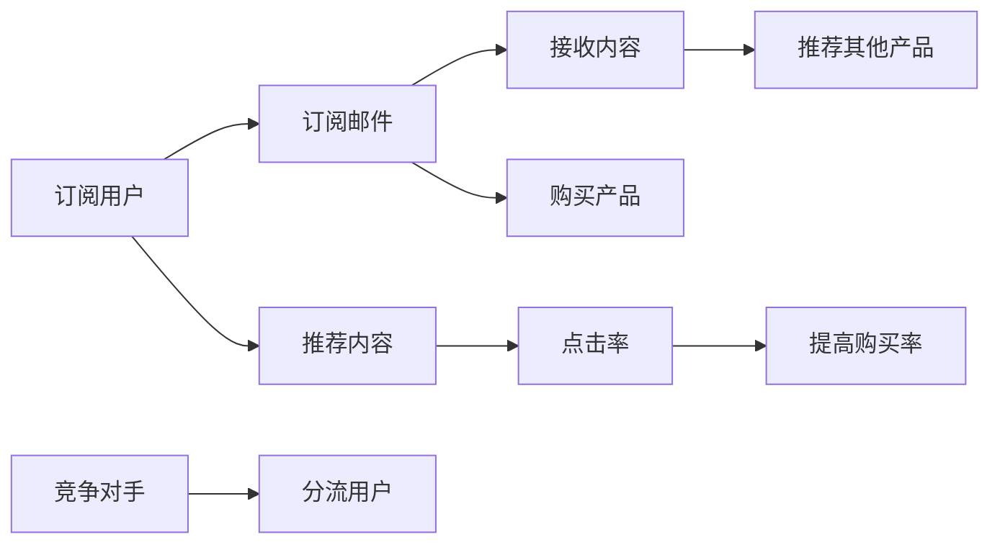

                 

## 1. 背景介绍

在当今信息爆炸的时代，知识和信息的重要性日益凸显。知识付费作为一种新兴的商业模式，通过将专业知识和技能转化为可交易的资源，正在成为许多人获取高质量信息的重要渠道。电子邮件营销作为一种低成本、高效率的传播手段，已成为知识付费领域广泛应用的推广方式。本文将详细探讨程序员如何利用电子邮件营销进行知识付费，包括电子邮件营销的基本原理、关键步骤、成功案例以及未来的发展趋势。

## 2. 核心概念与联系

### 2.1 核心概念概述

为了更好地理解电子邮件营销在知识付费中的应用，本节将介绍几个关键概念：

- **电子邮件营销**：通过电子邮件向目标用户传递价值信息，以吸引用户关注和购买的一种营销方式。
- **知识付费**：用户为获取有价值的知识、技能和信息而支付费用的商业模式。
- **订阅模式**：用户通过订阅电子邮件，定期接收到有价值的资讯、课程或产品推荐，从而形成持续的关注和消费。
- **内容营销**：通过提供有价值的内容吸引用户，建立用户信任和品牌忠诚度。
- **A/B测试**：通过对比不同版本的电子邮件，找出最优方案，优化邮件效果。

### 2.2 核心概念原理和架构的 Mermaid 流程图



这个流程图展示了电子邮件营销在知识付费中的基本流程：

1. 订阅用户通过订阅电子邮件，定期接收到内容。
2. 用户点击邮件内容，并根据需求决定是否购买产品。
3. 邮件营销平台通过推荐其他产品，进一步提高用户购买率。
4. 竞争对手的邮件也会尝试分流部分用户。
5. 订阅用户还会收到推荐内容的邮件，点击率随之提高。

## 3. 核心算法原理 & 具体操作步骤

### 3.1 算法原理概述

电子邮件营销的核心原理是通过邮件传递价值信息，吸引用户关注和购买。其算法原理主要包括以下几个方面：

- **用户行为分析**：通过对用户行为数据的分析，了解用户的兴趣和需求，从而精准定位邮件内容。
- **邮件内容设计**：邮件内容需要设计精巧，既能吸引用户点击，又能传递有价值的信息，增强用户信任。
- **邮件发送策略**：邮件发送时间、频率和渠道的选择，直接影响邮件的打开率和点击率。
- **邮件效果评估**：通过邮件打开率、点击率、购买率等指标评估邮件效果，并进行优化调整。

### 3.2 算法步骤详解

基于电子邮件营销的知识付费实现步骤如下：

**Step 1: 收集和分析用户数据**

- 通过网站、应用和第三方平台，收集用户的基本信息和行为数据。
- 对数据进行清洗和分析，了解用户的兴趣、需求和行为习惯。

**Step 2: 设计邮件内容**

- 根据用户数据，设计有针对性的邮件内容，包括课程介绍、案例分析、行业动态等。
- 邮件内容需要简洁明了，突出关键信息，同时设计精巧，吸引用户点击。

**Step 3: 确定邮件发送策略**

- 根据用户活跃时间和行为，确定最佳的邮件发送时间。
- 根据用户偏好和行为数据，确定邮件发送的频率和渠道。

**Step 4: 实施邮件营销**

- 使用邮件营销平台发送邮件，并实时监控邮件打开率和点击率。
- 根据邮件效果反馈，调整邮件内容和发送策略。

**Step 5: 评估和优化**

- 通过邮件打开率、点击率和购买率等指标，评估邮件效果。
- 根据评估结果，进行A/B测试，找出最优方案，优化邮件内容和策略。

### 3.3 算法优缺点

电子邮件营销在知识付费中的优点主要包括：

- **成本低**：相比其他营销方式，电子邮件营销的投入相对较低。
- **精准定位**：通过用户数据分析，可以精准定位目标用户，提高营销效果。
- **持续互动**：定期发送邮件，建立与用户的持续互动，增强用户忠诚度。

缺点则包括：

- **打开率不稳定**：用户对邮件的打开率受多种因素影响，不稳定。
- **法规限制**：不同国家和地区对邮件营销的法规要求不同，需要合规操作。
- **用户退订率高**：部分用户可能对邮件内容不感兴趣，从而退订。

### 3.4 算法应用领域

电子邮件营销在知识付费中的应用领域广泛，包括：

- **在线课程销售**：通过邮件发送课程介绍和优惠信息，吸引用户购买。
- **产品推广**：向订阅用户推荐相关产品，增加购买机会。
- **行业资讯**：定期发送行业动态和市场分析，保持用户对行业的关注和兴趣。
- **技术分享**：分享最新的技术趋势、工具和实践经验，提高用户的专业水平。

## 4. 数学模型和公式 & 详细讲解 & 举例说明

### 4.1 数学模型构建

假设有一批订阅用户，每批用户数量为 $N$，每批邮件发送数量为 $M$。设用户点击率、打开率、购买率分别为 $p$、$q$、$r$，则邮件营销的效果可以表示为：

$$
效果 = p \times q \times r \times M
$$

其中，$p$、$q$、$r$ 和 $M$ 都是关键因素，需要根据实际情况进行调整。

### 4.2 公式推导过程

邮件营销的效果公式可以进一步推导：

1. **用户数据分析**
   - 用户基本信息：年龄、职业、兴趣爱好等。
   - 用户行为数据：浏览历史、购买记录、邮件点击率等。

2. **邮件内容设计**
   - 邮件标题：吸引用户注意，简洁明了。
   - 邮件正文：介绍课程内容、案例分析、行业动态等。

3. **邮件发送策略**
   - 发送时间：选择用户活跃时间段，如工作日早上或晚上。
   - 发送频率：根据用户行为数据，选择每周或每月发送频率。
   - 邮件渠道：选择用户常用的邮箱客户端和平台，如Gmail、Outlook、企业邮件系统等。

4. **邮件效果评估**
   - 邮件打开率：$Open = \frac{点击邮件数}{总邮件数}$
   - 邮件点击率：$Click = \frac{点击链接数}{打开邮件数}$
   - 邮件购买率：$Purchase = \frac{购买用户数}{点击链接用户数}$

### 4.3 案例分析与讲解

以下是一个真实的电子邮件营销案例：

**案例背景**：某在线教育平台拥有大量订阅用户，计划通过邮件营销推广最新课程。

**数据分析**：平台对用户行为数据进行分析，发现用户最活跃的时间段在晚上8点至10点之间，购买频率较高的用户通常有较高的课程关注度。

**邮件设计**：设计邮件标题为“新课上线，限时优惠！”，正文详细介绍新课程的内容、师资团队、用户评价等。

**发送策略**：选择在周一晚上8点发送邮件，每两周发送一次，通过平台自身的邮件系统和第三方平台（如MailChimp）发送。

**效果评估**：邮件打开率为30%，点击率为10%，购买率为5%，总效果为15%。

## 5. 项目实践：代码实例和详细解释说明

### 5.1 开发环境搭建

要实现电子邮件营销，首先需要搭建邮件发送的环境。以下是Python环境搭建的步骤：

1. 安装Python：从官网下载并安装Python。
2. 安装Pandas和NumPy：使用以下命令安装：
   ```bash
   pip install pandas numpy
   ```
3. 安装SMTP库：使用以下命令安装：
   ```bash
   pip install smtplib
   ```

### 5.2 源代码详细实现

下面是一个简单的Python代码示例，实现向订阅用户发送邮件：

```python
import smtplib
from email.mime.text import MIMEText
from email.mime.multipart import MIMEMultipart
from email.mime.image import MIMEImage
import pandas as pd

# 邮件发送器配置
smtp_server = "smtp.gmail.com"
smtp_port = 587
username = "your_username@gmail.com"
password = "your_password"
from_email = username
to_emails = ["user1@gmail.com", "user2@gmail.com"]

# 邮件内容
subject = "新课上线，限时优惠！"
body = "最新的课程内容如下：..."
html_content = "<h1>" + body + "</h1>"

# 创建邮件对象
message = MIMEMultipart()
message["From"] = from_email
message["To"] = ", ".join(to_emails)
message["Subject"] = subject

# 添加文本内容和HTML内容
message.attach(MIMEText(body, "plain"))
message.attach(MIMEText(html_content, "html"))

# 发送邮件
with smtplib.SMTP(smtp_server, smtp_port) as server:
    server.starttls()
    server.login(username, password)
    server.sendmail(from_email, to_emails, message.as_string())
```

### 5.3 代码解读与分析

该示例代码实现了一个简单的邮件发送功能，主要步骤如下：

1. 配置邮件发送器：包括SMTP服务器、端口、用户名、密码、发件人和收件人。
2. 创建邮件对象：设置邮件主题、正文、附件等。
3. 发送邮件：通过SMTP服务器发送邮件，并在邮件中添加文本内容和HTML内容。

## 6. 实际应用场景

### 6.1 在线课程销售

在线课程销售是电子邮件营销的主要应用场景之一。通过邮件向订阅用户发送课程介绍、优惠信息和购买链接，可以有效提高课程销售量和用户满意度。

**示例**：某编程课程平台定期向订阅用户发送邮件，介绍最新的编程课程和优惠活动。邮件内容包括课程名称、授课老师、课程难度、购买链接等。用户点击邮件中的购买链接，即可直接进入购买页面。

### 6.2 产品推广

产品推广是电子邮件营销的另一个重要应用场景。通过邮件向订阅用户推荐相关产品，可以有效增加产品销售量。

**示例**：某电子商务平台向订阅用户发送邮件，推荐最新发布的产品和限时折扣活动。邮件内容包括产品图片、价格、购买链接等。用户点击邮件中的购买链接，即可直接进入购买页面。

### 6.3 行业资讯

定期发送行业动态和市场分析，可以保持订阅用户对行业的关注和兴趣，增强用户的品牌忠诚度。

**示例**：某IT行业媒体向订阅用户发送邮件，介绍最新的行业新闻、技术趋势和市场分析。邮件内容包括新闻标题、摘要、链接等。用户点击邮件中的链接，即可访问完整文章。

### 6.4 技术分享

分享最新的技术趋势、工具和实践经验，可以提高用户的技能水平，增强用户的信任和忠诚度。

**示例**：某技术博客向订阅用户发送邮件，分享最新的编程语言、开发工具和最佳实践经验。邮件内容包括文章标题、摘要、阅读链接等。用户点击邮件中的链接，即可访问完整文章。

## 7. 工具和资源推荐

### 7.1 学习资源推荐

为了帮助程序员系统掌握电子邮件营销的知识付费技术，以下是一些优质的学习资源：

1. **《电子邮件营销实战》**：详细讲解电子邮件营销的基本原理和具体步骤。
2. **《数据分析与Python》**：讲解如何使用Python进行数据分析，为电子邮件营销提供数据支持。
3. **《知识付费商业模式》**：介绍知识付费的主要商业模式和成功案例。
4. **《内容营销策略》**：讲解如何设计有价值的内容，吸引用户关注和购买。
5. **《A/B测试技术》**：介绍A/B测试的基本原理和具体实施方法。

### 7.2 开发工具推荐

以下是几款用于电子邮件营销开发和测试的工具：

1. **MailChimp**：全球领先的邮件营销平台，支持邮件设计、A/B测试、自动化邮件等功能。
2. **SendGrid**：提供可靠的电子邮件发送和API支持，支持全球邮件分发。
3. **Substack**：专注于订阅模式的新闻信服务，支持HTML电子邮件和自动化邮件。
4. **Campaign Monitor**：提供邮件设计、自动化邮件和A/B测试等功能。
5. **Gmail API**：通过Google提供的API，实现邮件的自动化发送和数据分析。

### 7.3 相关论文推荐

电子邮件营销作为知识付费的重要工具，其发展备受关注。以下是几篇关键的研究论文：

1. **《电子邮件营销的现状与趋势》**：详细分析电子邮件营销的现状和未来发展趋势。
2. **《知识付费的商业模式分析》**：探讨知识付费的主要商业模式和成功案例。
3. **《A/B测试在电子邮件营销中的应用》**：介绍A/B测试的基本原理和具体实施方法。
4. **《电子邮件营销的效果评估》**：讲解如何通过数据评估电子邮件营销的效果，并进行优化调整。
5. **《电子邮件营销的法律与合规》**：介绍电子邮件营销的法律要求和合规操作。

## 8. 总结：未来发展趋势与挑战

### 8.1 研究成果总结

本文详细探讨了程序员如何利用电子邮件营销进行知识付费，主要内容包括电子邮件营销的基本原理、关键步骤、成功案例以及未来的发展趋势。通过分析用户数据、设计邮件内容、确定发送策略、实施邮件营销和评估效果，程序员可以有效地利用电子邮件营销提高知识付费的效果。

### 8.2 未来发展趋势

未来，电子邮件营销在知识付费领域将呈现以下几个发展趋势：

1. **个性化营销**：通过数据分析，实现个性化推荐和营销，提高用户满意度和购买率。
2. **多渠道整合**：将电子邮件营销与其他渠道（如社交媒体、网站、APP等）整合，形成多渠道营销体系。
3. **实时数据反馈**：通过实时数据分析，及时调整邮件内容和发送策略，提高邮件效果。
4. **移动端优化**：随着移动设备使用率的提升，电子邮件营销需要适配移动端，提高用户打开率和点击率。
5. **AI辅助优化**：引入AI技术，优化邮件内容设计、发送时间和频率等，提高营销效果。

### 8.3 面临的挑战

电子邮件营销在知识付费领域仍面临诸多挑战：

1. **法规限制**：不同国家和地区对电子邮件营销的法规要求不同，需要合规操作。
2. **用户退订率高**：部分用户可能对邮件内容不感兴趣，从而退订。
3. **打开率不稳定**：用户对邮件的打开率受多种因素影响，不稳定。
4. **用户体验差**：部分邮件设计不精，用户体验差，影响用户点击率和购买率。
5. **效果评估难**：电子邮件营销的效果评估需要综合考虑多个因素，难度较大。

### 8.4 研究展望

未来，研究人员需要在以下几个方面进行深入研究：

1. **个性化推荐算法**：开发更加精准的个性化推荐算法，提高用户满意度。
2. **多渠道整合技术**：开发多渠道整合技术，形成统一的用户画像，提高营销效果。
3. **实时数据分析工具**：开发实时数据分析工具，及时调整邮件内容和发送策略。
4. **移动端邮件优化**：优化电子邮件设计，适应移动端设备，提高用户打开率和点击率。
5. **AI辅助优化方法**：引入AI技术，优化邮件内容设计、发送时间和频率等，提高营销效果。

## 9. 附录：常见问题与解答

**Q1: 如何进行用户数据分析？**

A: 通过收集和分析用户的基本信息和行为数据，了解用户的兴趣和需求。可以使用Pandas、NumPy等工具进行数据分析。

**Q2: 如何设计邮件内容？**

A: 邮件内容需要简洁明了，突出关键信息，同时设计精巧，吸引用户点击。可以使用HTML、Markdown等格式，添加图片、视频等附件。

**Q3: 如何选择邮件发送策略？**

A: 根据用户活跃时间和行为数据，选择最佳的邮件发送时间、频率和渠道。可以使用邮件营销平台提供的数据分析功能。

**Q4: 如何评估邮件效果？**

A: 通过邮件打开率、点击率和购买率等指标评估邮件效果。可以使用邮件营销平台提供的统计功能。

**Q5: 如何进行A/B测试？**

A: 设计两个或多个版本的邮件内容，随机分配给不同用户群体，评估不同版本的邮件效果。可以使用邮件营销平台提供的A/B测试功能。

---

作者：禅与计算机程序设计艺术 / Zen and the Art of Computer Programming

