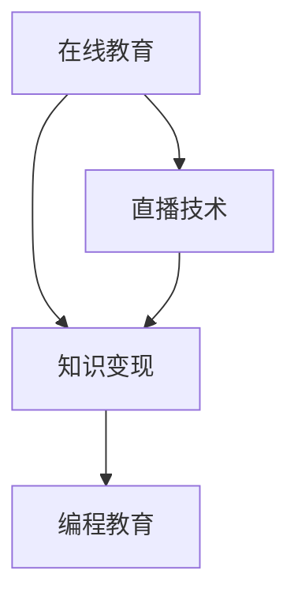

                 

# 程序员如何利用直播技术进行知识变现

> 关键词：直播技术, 知识变现, 在线教育, 编程教育, 技术直播

## 1. 背景介绍

### 1.1 问题由来
随着互联网的飞速发展，知识变现成为了互联网行业的一大热门话题。传统教育行业的培训方式已经难以满足人们对知识的不断渴求，在线教育应运而生。在线教育通过互联网平台，将优质的教育资源带给更多用户，打破了地域和时间限制。程序员作为技术含量高、知识更新快的群体，其在线教育市场潜力巨大。

直播技术作为一种高效的互动方式，将课堂搬到互联网上，实现了实时互动和高质量内容传输，为知识变现提供了新的可能性。程序员可以利用直播技术，通过在线教育平台传授知识、分享经验，实现知识变现。

### 1.2 问题核心关键点
利用直播技术进行知识变现，具体包含以下几个关键点：
1. 选择适合的在线教育平台，确保其稳定性和用户体验。
2. 确定直播内容，包括选择教学课程和设计教学内容。
3. 设计直播流程，包括直播设备准备和直播技巧应用。
4. 营销推广，吸引更多学员参与直播课程。
5. 评估和优化，通过学员反馈不断改进直播质量。

## 2. 核心概念与联系

### 2.1 核心概念概述

为更好地理解利用直播技术进行知识变现的流程，本节将介绍几个关键概念及其之间的联系：

- **在线教育**：利用互联网技术，实现教育资源的在线传播和交互。在线教育打破了传统的教学模式，具有高度灵活性和开放性。
- **直播技术**：通过互联网将视频、音频等数据实时传输给用户的技术。直播技术在实时互动、内容传输等方面具有独特优势。
- **知识变现**：通过提供知识、技能、经验等产品或服务，实现商业价值的过程。利用直播技术进行知识变现，可以高效地传播知识和经验。
- **编程教育**：利用编程技术进行教学和学习的教育形式。程序员可以通过直播技术传授编程知识和技能，帮助学员提升编程能力。

这些概念之间的逻辑关系可以通过以下Mermaid流程图来展示：



这个流程图展示了几者之间的关联：在线教育通过直播技术进行知识传播，而编程教育是知识变现的一种重要形式。直播技术的实时互动和高质量内容传输，使得在线编程教育更加高效和互动，进而实现知识变现。

## 3. 核心算法原理 & 具体操作步骤
### 3.1 算法原理概述

利用直播技术进行知识变现，本质上是一种在线教育的实现方式。其核心思想是通过直播技术，将编程知识、技能、经验等高效地传播给学员，实现知识变现。

形式化地，假设在线教育平台为 $E$，直播系统为 $L$，知识课程为 $K$。利用直播技术进行知识变现的过程可以表示为：

$$
K \rightarrow L \rightarrow E \rightarrow \text{知识变现}
$$

其中，$K$ 表示知识课程，$L$ 表示直播系统，$E$ 表示在线教育平台，最终转化为知识变现的过程。

在实际应用中，知识课程的传授和学员的互动通过直播系统实现。在线教育平台提供必要的支持，如视频录制、直播管理、学员互动等功能，从而实现知识变现。

### 3.2 算法步骤详解

利用直播技术进行知识变现的具体步骤包括：

**Step 1: 确定直播内容**

- 确定直播课程主题和内容，如编程基础、算法设计、软件开发流程等。
- 设计课程大纲，包括课程目标、知识点、练习题等。
- 准备课程讲义、演示代码、互动问答等教学资料。

**Step 2: 准备直播设备**

- 选择适合的直播设备，如摄像头、麦克风、直播平台账号等。
- 调试直播设备，确保音视频流畅稳定。
- 测试网络连接，确保直播流畅。

**Step 3: 设计直播流程**

- 设计课程讲授流程，包括课程引入、知识点讲解、代码演示、学员互动等。
- 准备互动问题，鼓励学员参与讨论和提问。
- 设计直播结束后的内容，如课程回放、课后作业、学员反馈等。

**Step 4: 营销推广**

- 选择合适的在线教育平台，如Coursera、Udemy、Bilibili等。
- 制作课程介绍视频、海报等营销材料，吸引学员参与。
- 在社交媒体、技术论坛等平台推广课程，扩大影响力。

**Step 5: 评估和优化**

- 通过学员反馈，评估直播效果和知识传播效果。
- 根据评估结果，调整直播内容和流程，提高直播质量。
- 持续更新课程内容，保持课程新鲜度和学员兴趣。

### 3.3 算法优缺点

利用直播技术进行知识变现的方法具有以下优点：

1. 实时互动：直播技术实现了实时互动，学员可以随时提问，教师可以实时解答，提升教学效果。
2. 高质量内容传输：直播技术保证了音视频的流畅稳定，提升了内容传输的质量。
3. 灵活性高：直播技术可以随时随地进行，学员可以根据自己的时间安排参与课程。
4. 易于推广：直播技术可以通过社交媒体、技术论坛等平台进行广泛传播，扩大课程影响。

同时，该方法也存在一定的局限性：

1. 技术门槛高：直播技术需要一定的技术储备，包括设备调试、网络连接、平台操作等。
2. 内容制作难度大：直播课程需要精心准备，内容制作难度较大，需要投入较多的时间和精力。
3. 学员反馈难以控制：学员的参与度和互动质量难以完全控制，可能影响教学效果。

尽管存在这些局限性，但直播技术在知识传播和教育变现方面具有独特的优势，是当前在线教育的重要手段。

### 3.4 算法应用领域

利用直播技术进行知识变现的方法，可以应用于各种在线教育场景，如编程教育、软件工程、数据科学等。具体应用领域包括：

1. **编程教育**：利用直播技术传授编程知识和技能，帮助学员提升编程能力。例如，通过代码演示、项目实践等形式，让学员掌握实际的编程技能。
2. **软件开发**：通过直播技术讲解软件开发流程、设计模式、版本控制等知识点，帮助学员提升软件开发水平。
3. **数据科学**：利用直播技术讲解数据分析、机器学习、数据可视化等知识点，帮助学员掌握数据科学技能。
4. **人工智能**：通过直播技术讲解深度学习、自然语言处理、计算机视觉等知识点，帮助学员掌握人工智能技术。

除了以上这些领域，直播技术还可以应用于在线培训、技术分享、创业指导等诸多场景，为知识传播和教育变现提供了新的途径。

## 4. 数学模型和公式 & 详细讲解 & 举例说明

### 4.1 数学模型构建

本节将使用数学语言对利用直播技术进行知识变现的流程进行更加严格的刻画。

假设直播课程的学员数为 $N$，课程时长为 $T$，课程每小时的学员参与度为 $p$。则课程的总参与度为 $P = N \times T \times p$。

课程的互动效果可以用互动比例 $r$ 来衡量，互动比例表示学员参与互动的比例。则课程的互动效果可以表示为 $I = P \times r$。

课程的知识传播效果可以用知识覆盖率 $k$ 来衡量，知识覆盖率表示学员掌握知识的程度。则课程的知识传播效果可以表示为 $K = P \times k$。

通过上述模型，可以计算出课程的总参与度、互动效果和知识传播效果。这些指标可以用来评估课程的质量和效果。

### 4.2 公式推导过程

以下是几个关键公式的推导过程：

1. 总参与度 $P$ 的推导：
$$
P = N \times T \times p
$$
其中 $N$ 表示课程学员数，$T$ 表示课程时长，$p$ 表示每小时的学员参与度。

2. 互动效果 $I$ 的推导：
$$
I = P \times r
$$
其中 $P$ 表示总参与度，$r$ 表示互动比例。

3. 知识传播效果 $K$ 的推导：
$$
K = P \times k
$$
其中 $P$ 表示总参与度，$k$ 表示知识覆盖率。

### 4.3 案例分析与讲解

假设某编程教育平台有一门Java编程课程，课程时长为30小时，每周一、三、五直播，每次直播3小时。课程学员数为200人，每小时的学员参与度为80%。

根据上述模型，可以计算出课程的总参与度为：
$$
P = 200 \times 3 \times 3 \times 80\% = 2880
$$
表示每周有2880个学员参与了课程。

课程的互动效果为：
$$
I = 2880 \times 50\% = 1440
$$
表示每周有1440个学员参与了互动。

课程的知识传播效果为：
$$
K = 2880 \times 90\% = 2592
$$
表示每周有2592个学员掌握了课程内容。

通过这些指标，可以评估课程的质量和效果，并根据反馈进行优化。

## 5. 项目实践：代码实例和详细解释说明
### 5.1 开发环境搭建

在进行知识变现项目实践前，我们需要准备好开发环境。以下是使用Python进行OpenCV、WebRTC等开发的环境配置流程：

1. 安装Python：从官网下载并安装Python，推荐使用Anaconda环境。
2. 安装OpenCV：使用pip命令安装OpenCV库，确保版本与你的Python版本兼容。
3. 安装WebRTC：使用pip命令安装WebRTC库，支持音视频实时传输。
4. 安装相关依赖：如FFmpeg、Gstreamer等，确保音视频流的流畅传输。

完成上述步骤后，即可在开发环境中开始知识变现的实践。

### 5.2 源代码详细实现

这里我们以直播授课为例，给出使用OpenCV、WebRTC进行视频直播的Python代码实现。

首先，定义直播设备信息：

```python
import cv2

# 摄像头信息
camera = cv2.VideoCapture(0)

# 视频编码器
fourcc = cv2.VideoWriter_fourcc(*'mp4v')
```

然后，定义视频采集和传输函数：

```python
def capture_and_send():
    # 创建WebRTC对象
    rtp_stream = rtc.create_stream()
    
    # 创建WebRTC发送器
    sender = rtc.create_sender(rtp_stream)
    
    # 创建WebRTC接收器
    receiver = rtc.create_receiver(rtp_stream)
    
    # 设置接收器数据通道
    receiver.set_data_channel(rtp_stream.data_channel)
    
    # 开始直播
    while True:
        # 从摄像头捕获视频
        ret, frame = camera.read()
        
        if not ret:
            break
        
        # 压缩视频帧
        encoded_frame = cv2.imencode('mp4v', frame)
        
        # 发送视频帧
        sender.send(encoded_frame[1])
        
        # 接收客户端反馈
        response = receiver.receive()
        print(response)
        
        # 刷新显示窗口
        cv2.imshow('frame', frame)
        
        # 判断是否退出
        if cv2.waitKey(1) & 0xFF == ord('q'):
            break
            
    # 释放资源
    camera.release()
    cv2.destroyAllWindows()
    sender.close()
    receiver.close()
    rtc.close()
```

最后，启动直播流程并测试：

```python
if __name__ == '__main__':
    capture_and_send()
```

以上就是使用OpenCV、WebRTC进行视频直播的完整代码实现。可以看到，代码通过摄像头实时采集视频，并进行编码和传输，实现了实时视频直播。

### 5.3 代码解读与分析

让我们再详细解读一下关键代码的实现细节：

**摄像头信息定义**：
- `cv2.VideoCapture(0)`：使用OpenCV库，以0号摄像头作为输入源，获取实时视频流。
- `cv2.VideoWriter_fourcc(*'mp4v')`：定义视频编码器，将视频流编码为MP4格式。

**视频采集和传输函数实现**：
- `capture_and_send`：定义函数，用于捕获视频流、编码、传输和接收反馈。
- `rtp_stream`：创建WebRTC数据流，用于音视频传输。
- `sender`：创建WebRTC发送器，负责将视频流传输给客户端。
- `receiver`：创建WebRTC接收器，负责接收客户端的反馈。
- `encoded_frame`：对视频帧进行编码，将原始视频帧转换为可传输的格式。
- `sender.send(encoded_frame[1])`：将编码后的视频帧发送给客户端。
- `receiver.receive()`：接收客户端的反馈，处理用户交互。

**启动直播流程**：
- `capture_and_send`函数在主程序中调用，启动直播流程。
- 循环中，不断捕获摄像头视频帧，并进行编码和传输。
- `cv2.waitKey(1)`：等待1毫秒，处理用户按键事件，退出直播。

**资源释放**：
- `camera.release()`：释放摄像头资源。
- `cv2.destroyAllWindows()`：关闭所有显示窗口。
- `sender.close()`：关闭WebRTC发送器。
- `receiver.close()`：关闭WebRTC接收器。
- `rtc.close()`：关闭WebRTC实例。

通过上述代码，可以看到直播技术的应用流程和实现细节。实际开发中，还需要考虑更多的细节问题，如网络稳定性、音视频同步、用户界面等，确保直播的流畅和稳定。

## 6. 实际应用场景

### 6.1 在线编程教育

在线编程教育是直播技术在知识变现中的重要应用场景。传统的编程教育主要依赖面授或者视频课程，但这些方式往往存在时间和地点的限制。通过直播技术，程序员可以将编程知识和技能直接传授给学员，实现实时互动和高效教学。

例如，通过直播平台，程序员可以开设编程实战课程，展示实际编程项目，讲解代码实现细节，并实时解答学员问题。学员可以通过弹幕、留言等方式与教师互动，提升学习效果。

### 6.2 技术分享和社区互动

直播技术还可以用于技术分享和社区互动，帮助程序员互相学习和交流经验。例如，通过直播平台，程序员可以分享自己的最新技术成果、项目经验、职业规划等内容，吸引其他程序员的关注和讨论。学员可以随时提问，教师可以随时解答，形成良好的互动氛围。

例如，通过在线技术社区，程序员可以开设技术讲座、代码审查、项目评审等直播活动，吸引更多的技术爱好者参与。通过实时互动和高质量内容传输，提升社区的技术水平和活跃度。

### 6.3 远程培训和咨询

直播技术在远程培训和咨询方面也具有重要应用。例如，企业可以通过直播平台进行员工培训，提升员工的技能水平。教师可以通过直播平台进行远程咨询，帮助客户解决问题。

例如，通过直播平台，企业可以开设技术培训课程，邀请专家进行技术讲座，提升员工的技术水平。教师可以通过直播平台进行远程咨询，解答客户的疑问，提供技术支持。

### 6.4 未来应用展望

随着直播技术的发展，未来的知识变现将更加多样化和高效化。以下是对未来应用展望：

1. **AR/VR结合直播**：通过AR/VR技术，将直播内容与虚拟现实环境结合，提升互动体验和沉浸感。例如，程序员可以通过虚拟实验室进行实验演示，帮助学员更好地理解代码实现。
2. **智能推荐系统**：通过智能推荐系统，根据学员的兴趣和历史行为，推荐合适的直播课程和内容。例如，根据学员的观看记录和互动情况，推荐相似主题的直播课程，提升学习效果。
3. **实时互动和反馈**：通过实时互动和反馈机制，提升直播质量和教学效果。例如，通过实时问答、在线投票等方式，及时收集学员反馈，优化教学内容。
4. **多平台融合**：通过多平台融合，提升直播内容的覆盖范围和传播效果。例如，通过社交媒体、技术论坛等平台推广直播课程，吸引更多学员参与。
5. **知识图谱和知识库**：通过知识图谱和知识库，提升直播内容的知识深度和广度。例如，通过引入知识图谱和知识库，帮助学员理解复杂的技术概念，提升学习效果。

总之，利用直播技术进行知识变现具有广阔的应用前景，将进一步推动在线教育和技术交流的发展。

## 7. 工具和资源推荐
### 7.1 学习资源推荐

为了帮助开发者系统掌握直播技术进行知识变现的理论基础和实践技巧，这里推荐一些优质的学习资源：

1. **《WebRTC：构建实时通信系统》**：介绍WebRTC的核心概念和实现原理，涵盖音视频编码、传输和互动等内容。
2. **《OpenCV实战教程》**：讲解OpenCV库的常用功能和应用场景，包括摄像头、视频编码、图像处理等内容。
3. **《直播技术详解》**：介绍直播技术的核心概念和实现原理，涵盖直播协议、流媒体传输等内容。
4. **Coursera在线课程**：提供关于在线教育和编程教育的课程，涵盖教学设计、互动机制、课程管理等内容。
5. **Udemy在线课程**：提供关于编程教育和技术分享的课程，涵盖直播技术、互动机制、课程设计等内容。

通过对这些资源的学习实践，相信你一定能够快速掌握直播技术进行知识变现的精髓，并用于解决实际的编程和教育问题。

### 7.2 开发工具推荐

高效的开发离不开优秀的工具支持。以下是几款用于直播技术进行知识变现开发的常用工具：

1. **OpenCV**：开源计算机视觉库，提供了强大的图像处理和视频编码功能。
2. **WebRTC**：开源实时通信库，支持音视频实时传输和互动。
3. **FFmpeg**：开源媒体处理工具，支持多种音视频格式和编解码器。
4. **Gstreamer**：开源流媒体框架，支持多种音视频流协议和格式。
5. **Jupyter Notebook**：开源交互式编程环境，支持实时调试和展示代码执行结果。

合理利用这些工具，可以显著提升直播技术进行知识变现的开发效率，加快创新迭代的步伐。

### 7.3 相关论文推荐

直播技术进行知识变现的研究源于学界的持续研究。以下是几篇奠基性的相关论文，推荐阅读：

1. **《WebRTC：构建实时通信系统》**：详细介绍了WebRTC的核心概念和实现原理，是直播技术的重要参考资料。
2. **《实时流媒体传输协议》**：介绍实时流媒体传输协议的核心概念和实现原理，涵盖RTP、RTCP等内容。
3. **《OpenCV：计算机视觉库》**：介绍OpenCV库的常用功能和应用场景，涵盖图像处理、视频编码等内容。
4. **《编程教育的在线教学实践》**：介绍在线编程教育的教学设计、互动机制、课程管理等内容，是编程教育的重要参考资料。
5. **《直播技术在知识传播中的应用》**：介绍直播技术在知识传播中的应用场景和实践案例，是直播技术的重要参考资料。

这些论文代表了大语言模型微调技术的发展脉络。通过学习这些前沿成果，可以帮助研究者把握学科前进方向，激发更多的创新灵感。

## 8. 总结：未来发展趋势与挑战

### 8.1 总结

本文对利用直播技术进行知识变现的方法进行了全面系统的介绍。首先阐述了直播技术在知识传播和教育变现中的独特优势，明确了直播技术在程序员知识变现中的重要地位。其次，从原理到实践，详细讲解了利用直播技术进行知识变现的数学模型和实现步骤，给出了知识变现项目开发的完整代码实例。同时，本文还广泛探讨了直播技术在在线编程教育、技术分享、远程培训等多个场景中的应用前景，展示了直播技术在知识传播和教育变现方面的巨大潜力。此外，本文精选了直播技术的各类学习资源，力求为读者提供全方位的技术指引。

通过本文的系统梳理，可以看到，利用直播技术进行知识变现是一种高效、灵活、互动性强的在线教育方式，能够充分发挥程序员在编程知识和技能上的优势，实现知识变现。未来，伴随直播技术的发展和创新，知识变现将变得更加多样化和高效化，推动在线教育和技术交流的不断进步。

### 8.2 未来发展趋势

展望未来，直播技术在知识变现中将呈现以下几个发展趋势：

1. **AR/VR结合直播**：通过AR/VR技术，提升直播内容的沉浸感和互动体验。例如，程序员可以通过虚拟实验室进行实验演示，帮助学员更好地理解代码实现。
2. **智能推荐系统**：通过智能推荐系统，根据学员的兴趣和历史行为，推荐合适的直播课程和内容。例如，根据学员的观看记录和互动情况，推荐相似主题的直播课程，提升学习效果。
3. **实时互动和反馈**：通过实时互动和反馈机制，提升直播质量和教学效果。例如，通过实时问答、在线投票等方式，及时收集学员反馈，优化教学内容。
4. **多平台融合**：通过多平台融合，提升直播内容的覆盖范围和传播效果。例如，通过社交媒体、技术论坛等平台推广直播课程，吸引更多学员参与。
5. **知识图谱和知识库**：通过知识图谱和知识库，提升直播内容的知识深度和广度。例如，通过引入知识图谱和知识库，帮助学员理解复杂的技术概念，提升学习效果。

以上趋势凸显了直播技术在知识传播和教育变现方面的广阔前景。这些方向的探索发展，必将进一步提升直播技术进行知识变现的质量和效果，为知识传播和教育变现带来新的突破。

### 8.3 面临的挑战

尽管直播技术在知识传播和教育变现方面具有独特的优势，但在实现过程中仍面临诸多挑战：

1. **技术门槛高**：直播技术需要一定的技术储备，包括设备调试、网络连接、平台操作等。对于一些开发者而言，存在较高的技术门槛。
2. **内容制作难度大**：直播课程需要精心准备，内容制作难度较大，需要投入较多的时间和精力。
3. **学员反馈难以控制**：学员的参与度和互动质量难以完全控制，可能影响教学效果。
4. **网络稳定性问题**：直播过程中，网络不稳定可能导致音视频传输中断，影响直播体验。
5. **数据安全和隐私保护**：直播过程中，学员的个人信息和数据安全需要得到充分保障，防止数据泄露和隐私侵害。

尽管存在这些挑战，但直播技术在知识传播和教育变现方面具有独特的优势，是当前在线教育的重要手段。未来，直播技术将不断发展和优化，逐步克服这些挑战，实现更好的应用效果。

### 8.4 研究展望

面对直播技术进行知识变现所面临的种种挑战，未来的研究需要在以下几个方面寻求新的突破：

1. **技术优化和简化**：开发更加简便易用的直播技术工具，降低技术门槛和内容制作难度。例如，通过集成化开发和预置化功能，提升直播技术的易用性和可扩展性。
2. **学员互动和反馈机制**：引入更加智能和人性化的学员互动和反馈机制，提升直播课程的参与度和教学效果。例如，通过自然语言处理技术，实现学员智能问答和反馈。
3. **网络优化和容错机制**：优化直播网络连接，增强容错机制，确保直播的稳定性和流畅性。例如，通过自适应带宽控制和实时传输优化，提升直播质量。
4. **数据安全和隐私保护**：加强数据安全和隐私保护，确保学员的个人信息和数据安全。例如，通过加密传输和访问控制，防止数据泄露和隐私侵害。
5. **知识图谱和知识库**：将知识图谱和知识库引入直播课程，提升直播内容的深度和广度。例如，通过引入领域知识和专家资源，帮助学员更好地理解复杂的技术概念。

这些研究方向的探索，必将引领直播技术进行知识变现技术的不断进步，为知识传播和教育变现带来新的突破。面向未来，直播技术需要进行更多的创新和优化，才能更好地应用于知识变现和教育场景，推动技术交流和知识传播的发展。

## 9. 附录：常见问题与解答

**Q1：直播技术进行知识变现是否适用于所有课程？**

A: 直播技术进行知识变现适用于各种课程，特别是需要实时互动和高质量内容传输的课程。例如，编程教育、技术分享、远程培训等。但对于一些静态、单向的知识传播课程，直播技术可能不是最佳选择。

**Q2：如何选择适合的在线教育平台？**

A: 选择适合的在线教育平台需要考虑平台的用户量、功能支持、技术稳定性等因素。一般而言，Coursera、Udemy、Bilibili等平台较为知名，功能丰富，适合各种课程的直播和互动。

**Q3：直播过程中如何确保网络稳定？**

A: 确保网络稳定是直播技术的重要问题。一般而言，需要选择稳定的网络连接，使用CDN等技术进行带宽优化，使用自适应传输策略进行动态调整。

**Q4：直播过程中如何处理学员反馈？**

A: 处理学员反馈需要及时、有效、有针对性。一般而言，可以通过弹幕、留言、问答等方式收集学员反馈，及时解答问题，优化教学内容。

**Q5：直播课程如何保持学员兴趣？**

A: 保持学员兴趣需要精心设计和不断优化课程内容。一般而言，可以通过互动问答、实时演示、案例分析等方式提升课程的互动性和趣味性。

通过以上问题的解答，可以看到，直播技术进行知识变现具有广泛的应用前景和独特的优势，但需要不断优化和创新，才能更好地应用于各种课程和场景，推动知识传播和教育变现的发展。

