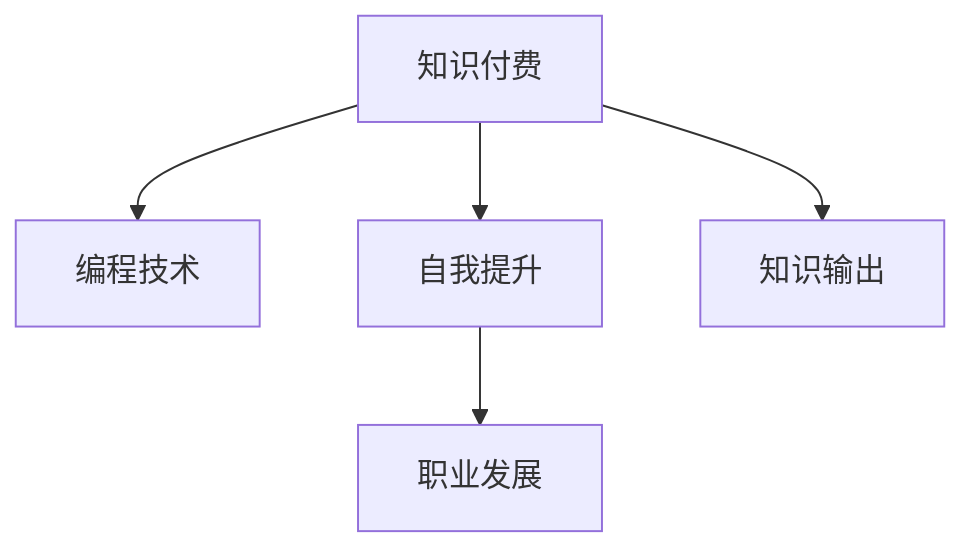

                 

# 程序员如何利用知识付费实现财富倍增

在当今数字化时代，程序员作为信息技术的核心力量，面临着前所未有的机遇与挑战。随着人工智能、大数据、云计算等技术的快速迭代，程序员的岗位需求日益增长，同时也带来了更高的技术门槛和竞争压力。如何在激烈的竞争中脱颖而出，成为技术领域的佼佼者，实现财富的倍增？答案是充分利用知识付费这一新兴趋势。本文将深入探讨程序员如何利用知识付费，不仅提升自己的技术水平，还能实现收入的翻倍甚至几何级增长。

## 1. 背景介绍

### 1.1 问题由来
随着互联网技术的普及和信息爆炸，技术领域的专业知识和技能成为高附加值资源。程序员作为这一领域的核心参与者，不仅需要不断学习新技术、新工具，还需要关注行业动态，了解市场需求。然而，知识的获取和积累需要耗费大量时间和精力，特别是对于经验不足的新手和缺乏资源的专业人士。

为了满足这一需求，知识付费作为一种高效的自我提升方式应运而生。知识付费平台通过提供在线课程、技术讲座、书籍、实战项目等多种形式的知识产品，帮助程序员快速提升技能，拓宽职业路径。本文将深入探讨程序员如何通过知识付费实现技术能力和收入的双重提升。

## 2. 核心概念与联系

### 2.1 核心概念概述

为了更好地理解程序员如何利用知识付费实现财富倍增，本节将介绍几个密切相关的核心概念：

- **知识付费**：指通过付费形式获取高质量知识产品，用于提升个人技能和知识储备。知识付费平台包括Coursera、Udemy、慕课网等。
- **编程技术**：包括编程语言、开发工具、框架、算法等，是程序员的核心竞争力。
- **自我提升**：通过持续学习，提升编程技能、项目管理和团队协作能力。
- **职业发展**：包括求职、晋升、创业等，通过提升自身竞争力，实现职业目标。
- **知识输出**：通过写博客、录视频、开发开源项目等方式，分享知识，实现知识变现。

这些核心概念之间的逻辑关系可以通过以下Mermaid流程图来展示：



这个流程图展示了知识付费与编程技术、自我提升、职业发展、知识输出之间的联系：

1. 知识付费是获取编程技术和自我提升资源的手段。
2. 提升编程技能和自我提升为职业发展奠定基础。
3. 职业发展需要持续的知识输出和分享。
4. 知识输出有助于提升个人品牌，实现知识变现。

## 3. 核心算法原理 & 具体操作步骤

### 3.1 算法原理概述

利用知识付费实现财富倍增的核心在于系统性地规划学习和职业发展路径，通过高效获取知识、提升技能、输出知识等步骤，逐步实现收入的增长。这一过程可以概括为以下几个关键步骤：

1. **目标设定**：明确自身职业发展目标，如成为资深开发者、技术专家或创业。
2. **需求分析**：根据目标，分析所需掌握的编程技术、项目管理和团队协作能力。
3. **资源规划**：选择最适合的知识付费平台和课程，制定学习计划。
4. **学习实践**：通过课程学习、项目实践、社区互动等方式，提升技能。
5. **知识输出**：通过博客、视频、开源项目等形式，分享知识，提升影响力。
6. **收入增长**：通过升职加薪、技术咨询、项目合作等方式，实现收入增长。

### 3.2 算法步骤详解

#### 3.2.1 目标设定

目标设定是实现财富倍增的第一步。需要明确自己的职业定位和发展方向，制定明确的短期和长期目标。例如，成为一名资深开发者需要掌握哪些编程技术？是否计划在3年内达到某个技术水平？是否考虑创业？

**步骤**：
1. 自我评估：评估当前技术水平、职业经验、市场需求。
2. 确定目标：根据自身兴趣和市场需求，确定职业方向，如前端、后端、全栈、AI等。
3. 制定计划：制定详细的学习计划，包括短期目标和长期目标。

**示例**：
假设目标是成为一名前端开发专家，短期目标为掌握React和Vue.js，长期目标为成为全栈开发者。

#### 3.2.2 需求分析

在明确目标后，需要对所需掌握的编程技术和项目管理能力进行详细分析，列出需要学习的内容和技能。

**步骤**：
1. 研究领域：选定特定技术领域，如JavaScript、Python、机器学习等。
2. 确定技能：列出该领域的关键技能，如算法、数据结构、网络编程等。
3. 分析差距：分析自身技能与目标技能之间的差距。

**示例**：
假设目标为掌握JavaScript，需要学习ES6、React、Vue.js、Node.js等。

#### 3.2.3 资源规划

选择适合的知识付费平台和课程，制定详细的学习计划，包括学习时间、进度和评估标准。

**步骤**：
1. 平台选择：选择权威、实用、用户评价高的知识付费平台，如Coursera、Udemy、慕课网等。
2. 课程选择：根据目标技能，选择适合的课程，如《JavaScript高级程序设计》、《全栈开发实战》等。
3. 时间规划：制定详细的时间表，分配每日、每周的学习时间。

**示例**：
假设选择Coursera平台，学习《JavaScript高级程序设计》课程，每天学习2小时。

#### 3.2.4 学习实践

通过课程学习、项目实践、社区互动等方式，不断提升编程技能和项目管理能力。

**步骤**：
1. 完成课程：按照课程进度完成所有课程内容，包括理论学习和编程实践。
2. 实践项目：通过实战项目巩固所学知识，积累项目经验。
3. 参与社区：加入技术社区、论坛，与同行交流经验，解决实际问题。

**示例**：
完成《JavaScript高级程序设计》课程后，通过实战项目《电商网站开发》应用所学知识。

#### 3.2.5 知识输出

通过博客、视频、开源项目等形式，分享知识，提升个人品牌和影响力。

**步骤**：
1. 知识记录：将学习心得、实战项目、技术博客记录下来，形成知识体系。
2. 输出分享：通过博客、视频、开源项目等方式分享知识，吸引关注者。
3. 建立品牌：持续输出有价值的内容，建立技术专家形象，吸引更多关注和合作机会。

**示例**：
在GitHub上分享《电商网站开发》项目代码，同时在博客上发布项目经验和技术心得。

#### 3.2.6 收入增长

通过升职加薪、技术咨询、项目合作等方式，实现收入增长。

**步骤**：
1. 升职加薪：在现有工作中表现出色，申请晋升或加薪机会。
2. 技术咨询：通过技术博客、社区分享等方式，吸引技术咨询需求。
3. 项目合作：参与开源项目或企业项目，通过项目合作实现收入增长。

**示例**：
通过博客和视频分享技术知识，吸引技术咨询需求，通过开源项目或企业项目获得更多的项目合作机会。

## 4. 数学模型和公式 & 详细讲解 & 举例说明

### 4.1 数学模型构建

为了更好地量化知识付费的效果，可以使用数学模型进行建模和分析。以下是一个简单的数学模型，用于描述知识付费对程序员财富增长贡献：

假设程序员的初始收入为 $I_0$，通过知识付费提升技能后，技能提升系数为 $k$，知识输出的边际收益为 $r$，项目合作带来的额外收入为 $s$，则财富增长模型可以表示为：

$$
I = I_0 \times k + k \times r + s
$$

其中：
- $I$ 为财富增长后的总收入。
- $I_0$ 为初始收入。
- $k$ 为技能提升系数。
- $r$ 为知识输出的边际收益。
- $s$ 为项目合作的额外收入。

### 4.2 公式推导过程

**推导过程**：
1. 技能提升系数 $k$：通过知识付费提升技能，增加编程技术、项目管理能力，提升工作效率和问题解决能力。
2. 知识输出的边际收益 $r$：通过知识输出提升个人品牌和影响力，吸引更多的技术咨询需求和项目合作机会。
3. 项目合作的额外收入 $s$：通过参与开源项目或企业项目，获得更多的项目合作机会，提升收入。

### 4.3 案例分析与讲解

**案例分析**：
假设初始收入 $I_0 = 10$ 万元，技能提升系数 $k = 1.1$，知识输出的边际收益 $r = 0.2$，项目合作的额外收入 $s = 0.5$，则财富增长模型计算如下：

$$
I = 10 \times 1.1 + 1.1 \times 0.2 + 0.5 = 12.7
$$

因此，通过知识付费实现技能提升后，财富增长为 $12.7$ 万元。

## 5. 项目实践：代码实例和详细解释说明

### 5.1 开发环境搭建

为了顺利进行知识付费实践，需要搭建适合的开发环境。以下是一个基本的Python开发环境配置步骤：

1. **安装Python**：
   ```bash
   sudo apt-get install python3
   ```

2. **安装Pip**：
   ```bash
   sudo apt-get install python3-pip
   ```

3. **安装必要的Python库**：
   ```bash
   pip install numpy pandas scikit-learn matplotlib
   ```

4. **配置虚拟环境**：
   ```bash
   conda create -n myenv python=3.8
   conda activate myenv
   ```

### 5.2 源代码详细实现

以下是一个简单的Python代码示例，用于分析知识付费的效果：

```python
import numpy as np

# 初始收入
I0 = 100000

# 技能提升系数
k = 1.1

# 知识输出的边际收益
r = 0.2

# 项目合作的额外收入
s = 0.5

# 计算财富增长
I = I0 * k + k * r + s

print("财富增长后的总收入为：", I)
```

### 5.3 代码解读与分析

**代码解读**：
1. 首先定义初始收入 $I0 = 100000$，技能提升系数 $k = 1.1$，知识输出的边际收益 $r = 0.2$，项目合作的额外收入 $s = 0.5$。
2. 使用公式 $I = I0 \times k + k \times r + s$ 计算财富增长后的总收入。
3. 打印输出财富增长后的总收入。

**代码分析**：
- 初始收入 $I0$：程序员的初始年收入。
- 技能提升系数 $k$：通过知识付费提升技能后，收入增加的比例。
- 知识输出的边际收益 $r$：通过知识输出增加的收入比例。
- 项目合作的额外收入 $s$：通过参与项目合作增加的收入比例。
- 财富增长模型：通过这些参数计算财富增长后的总收入。

## 6. 实际应用场景

### 6.1 智能客服系统

智能客服系统利用知识付费提升客户服务质量，提升客户满意度和忠诚度，增加企业收入。

**应用场景**：
- **需求分析**：客户服务系统需要处理大量客户咨询，需要掌握自然语言处理、机器学习等技术。
- **资源规划**：选择适合的课程，如《自然语言处理入门》、《机器学习实战》等。
- **学习实践**：通过课程学习、项目实践、社区互动等方式提升技能。
- **知识输出**：通过技术博客、社区分享等方式提升个人品牌和影响力。
- **收入增长**：通过技术咨询、项目合作等方式提升收入。

### 6.2 金融舆情监测

金融舆情监测利用知识付费提升数据分析和预测能力，帮助企业规避风险，提升投资决策质量。

**应用场景**：
- **需求分析**：金融舆情监测需要掌握数据挖掘、机器学习等技术。
- **资源规划**：选择适合的课程，如《数据挖掘与统计分析》、《机器学习基础》等。
- **学习实践**：通过课程学习、项目实践、社区互动等方式提升技能。
- **知识输出**：通过技术博客、社区分享等方式提升个人品牌和影响力。
- **收入增长**：通过技术咨询、项目合作等方式提升收入。

### 6.3 个性化推荐系统

个性化推荐系统利用知识付费提升算法优化和模型调优能力，提升用户体验，增加企业收入。

**应用场景**：
- **需求分析**：个性化推荐系统需要掌握机器学习、深度学习等技术。
- **资源规划**：选择适合的课程，如《深度学习入门》、《机器学习实战》等。
- **学习实践**：通过课程学习、项目实践、社区互动等方式提升技能。
- **知识输出**：通过技术博客、社区分享等方式提升个人品牌和影响力。
- **收入增长**：通过技术咨询、项目合作等方式提升收入。

### 6.4 未来应用展望

知识付费在未来将更加普及和多样化，将成为程序员提升技能、增加收入的重要手段。以下是对未来应用场景的展望：

1. **在线编程教育**：知识付费平台提供实时编程在线教育服务，通过互动式编程练习，提升编程技能。
2. **开源项目合作**：知识付费平台提供开源项目合作机会，通过参与开源项目提升技术能力，增加项目经验和收入。
3. **虚拟实习项目**：知识付费平台提供虚拟实习项目，通过真实项目锻炼技能，增加实战经验，提升收入。
4. **智能导师系统**：知识付费平台提供智能导师系统，根据个人学习进度和需求，提供个性化的学习建议和资源推荐。

## 7. 工具和资源推荐

### 7.1 学习资源推荐

为了帮助程序员系统掌握知识付费的策略和方法，这里推荐一些优质的学习资源：

1. **《知识付费：程序员的财富倍增之路》书籍**：详细介绍了知识付费对程序员职业发展的意义和作用，提供了具体的学习路径和技巧。
2. **Coursera、Udemy、慕课网等知识付费平台**：提供各种在线课程和项目，覆盖前端、后端、全栈、AI等多个技术领域。
3. **GitHub、Stack Overflow等社区**：通过社区交流，分享实战项目和知识，提升技术水平和影响力。
4. **《知识付费实战指南》技术博客**：提供系统化的知识付费策略和方法，帮助程序员制定详细的学习计划。

### 7.2 开发工具推荐

为了提高知识付费实践的效率，推荐以下开发工具：

1. **Jupyter Notebook**：提供交互式编程环境，支持实时展示计算结果，适合数据分析和算法优化。
2. **GitHub**：提供代码版本控制和协作平台，方便项目管理、代码共享和团队协作。
3. **VS Code**：提供强大的代码编辑和调试功能，支持多种编程语言和工具链集成。
4. **AWS、Google Cloud、Azure等云平台**：提供丰富的计算资源和云服务，支持大规模数据处理和项目部署。

### 7.3 相关论文推荐

知识付费作为新兴技术，仍在不断发展和演进。以下是几篇奠基性的相关论文，推荐阅读：

1. **《知识付费平台的用户行为分析与建模》**：研究知识付费平台的用户行为特征，提出用户行为分析模型，优化平台推荐系统。
2. **《基于知识付费的编程学习路径优化》**：提出基于知识付费的编程学习路径优化方法，提高学习效率和效果。
3. **《知识付费对程序员职业发展的贡献分析》**：分析知识付费对程序员职业发展的影响，提供具体的学习路径和资源推荐。
4. **《知识付费平台的市场分析和用户满意度调查》**：研究知识付费平台的市场竞争格局和用户满意度，提出改进建议。

## 8. 总结：未来发展趋势与挑战

### 8.1 总结

本文深入探讨了程序员如何利用知识付费实现财富倍增，提供了系统化的学习路径和方法。通过目标设定、需求分析、资源规划、学习实践、知识输出、收入增长等步骤，程序员可以有效地提升技能，增加收入。

### 8.2 未来发展趋势

未来，知识付费将进一步普及和深化，成为程序员提升技能、增加收入的重要手段。以下是对未来发展趋势的展望：

1. **知识付费内容的深化**：随着技术的进步和市场的变化，知识付费内容将更加丰富和精细化，涵盖更多的技术领域和应用场景。
2. **个性化学习路径**：知识付费平台将提供个性化的学习路径和推荐系统，根据用户需求和学习进度，推荐最适合的课程和项目。
3. **虚拟实习和开源项目**：知识付费平台将提供虚拟实习和开源项目，帮助程序员提升实战经验和技能，增加项目合作机会。
4. **智能化导师系统**：知识付费平台将引入智能导师系统，根据用户学习进度和需求，提供个性化的学习建议和资源推荐。

### 8.3 面临的挑战

尽管知识付费的前景广阔，但在实践中仍面临诸多挑战：

1. **知识付费平台的信任问题**：知识付费平台的质量和服务质量参差不齐，用户难以选择高质量的课程和资源。
2. **学习效率问题**：知识付费课程的难度和深度较大，学习效果和效率难以保证。
3. **学习时间和成本问题**：知识付费课程的学习时间和经济成本较高，用户难以长期坚持。
4. **知识输出和变现问题**：通过知识输出提升影响力，增加收入，需要具备较强的市场推广和资源整合能力。

### 8.4 研究展望

未来，知识付费的研究将进一步深入，帮助程序员更好地利用这一手段实现技术能力和收入的双重提升。以下是对未来研究方向的展望：

1. **知识付费的个性化推荐算法**：研究知识付费内容的个性化推荐算法，提升用户的学习效率和满意度。
2. **知识付费平台的信任机制**：研究知识付费平台的信任机制和用户评价体系，提高平台的可信度和用户黏性。
3. **知识付费的激励机制**：研究知识付费的激励机制，提高知识输出的质量和效果，增加用户的学习动力和兴趣。
4. **知识付费的生态系统**：研究知识付费的生态系统建设，促进知识共享和合作，构建更丰富的知识付费生态。

## 9. 附录：常见问题与解答

**Q1：知识付费平台的选择有哪些建议？**

A: 选择合适的知识付费平台是知识付费成功的重要基础。以下是几个选择平台的建议：
1. **平台权威性**：选择权威性高、用户评价高的平台，如Coursera、Udemy、慕课网等。
2. **课程质量**：选择高质量、实用、评价高的课程，课程内容包括前沿技术、实战项目、项目案例等。
3. **学习体验**：选择学习体验好的平台，提供互动式学习、即时反馈、实时交互等特性。

**Q2：如何规划学习路径？**

A: 学习路径的规划需要结合自身职业目标和技术需求，以下是一些规划建议：
1. **目标明确**：明确自身职业目标，如成为资深开发者、技术专家或创业者。
2. **需求分析**：分析所需掌握的编程技术、项目管理和团队协作能力。
3. **资源选择**：选择适合的课程，根据需求和兴趣选择学习路径，如先学习基础课程，再学习进阶课程。
4. **时间规划**：制定详细的时间表，分配每日、每周的学习时间，确保学习进度和效果。

**Q3：如何进行知识输出？**

A: 知识输出可以通过多种形式实现，以下是一些具体方法：
1. **技术博客**：在博客上分享学习心得、技术文章、项目案例等，吸引读者关注。
2. **开源项目**：在GitHub上分享开源项目代码，提供详细的文档和教程。
3. **技术讲座**：录制技术讲座视频，分享实战经验和项目案例。
4. **社区互动**：在技术社区、论坛参与讨论，分享知识和经验，解决实际问题。

**Q4：如何提升学习效率？**

A: 提升学习效率需要综合考虑多个因素，以下是一些具体方法：
1. **选择合适的课程**：选择适合自己水平和兴趣的课程，避免过于难度和枯燥。
2. **制定学习计划**：制定详细的时间表和进度，分配每日、每周的学习时间。
3. **实践项目**：通过实战项目巩固所学知识，增加项目经验和技能。
4. **社区互动**：加入技术社区、论坛，与同行交流经验，解决实际问题。
5. **及时反馈**：及时获取反馈，调整学习计划和策略，避免过拟合和偏差。

**Q5：如何进行知识付费变现？**

A: 知识付费变现需要具备较强的市场推广和资源整合能力，以下是一些具体方法：
1. **技术咨询**：通过博客、视频、讲座等方式，吸引技术咨询需求，提供专业指导和解决方案。
2. **项目合作**：通过参与开源项目或企业项目，增加项目经验和收入。
3. **知识变现**：通过知识付费平台，发布付费课程、在线讲座、技术咨询等，获得稳定收入。
4. **技术产品**：开发技术产品，如应用软件、工具库、插件等，获得市场认可和收入。

**Q6：如何应对知识付费平台的信任问题？**

A: 应对知识付费平台的信任问题，需要综合考虑多个因素，以下是一些具体方法：
1. **平台选择**：选择权威性高、用户评价高的平台，如Coursera、Udemy、慕课网等。
2. **课程选择**：选择高质量、实用、评价高的课程，课程内容包括前沿技术、实战项目、项目案例等。
3. **学习体验**：选择学习体验好的平台，提供互动式学习、即时反馈、实时交互等特性。
4. **用户评价**：查看用户评价和反馈，了解课程和平台的实际效果和可信度。

---

作者：禅与计算机程序设计艺术 / Zen and the Art of Computer Programming

