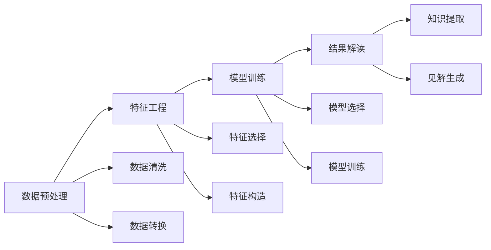

                 

# 程序员如何利用知识发现引擎提高竞争力

## 1. 背景介绍

随着人工智能(AI)和数据科学的迅猛发展，知识发现引擎(Knowledge Discovery Engines, KDEs)在各行各业中的应用日益广泛。对于程序员而言，利用这些强大的技术工具，能够显著提高工作效率，优化代码质量，增强竞争力。本文旨在探讨程序员如何有效利用知识发现引擎，通过智能化、数据驱动的方式，提升其技术水平和工作能力。

## 2. 核心概念与联系

### 2.1 核心概念概述

知识发现引擎是一种数据挖掘工具，旨在从大量的数据中自动发现隐含的知识和规律。它通常结合了数据预处理、特征工程、模型训练和结果解读等步骤，能够帮助分析师和程序员从复杂的数据集中获取有价值的信息。

1. **数据预处理**：包括数据清洗、缺失值处理、数据转换等步骤，确保数据的完整性和准确性。
2. **特征工程**：选择和构造合适的特征，提取和表达数据的内在信息，提高模型的预测能力。
3. **模型训练**：应用机器学习或深度学习算法，在标注数据上训练模型，学习数据的模式和规律。
4. **结果解读**：分析模型的输出结果，提取有用的知识和见解，进行可视化展示，辅助决策。

这些步骤相辅相成，共同构成知识发现引擎的核心功能。通过科学地应用这些技术，程序员能够从海量数据中获取有意义的洞见，优化代码，提高工作效率。

### 2.2 核心概念原理和架构的 Mermaid 流程图



## 3. 核心算法原理 & 具体操作步骤

### 3.1 算法原理概述

知识发现引擎通常采用数据驱动的方法，通过机器学习模型自动识别数据中的模式和规律。其核心思想是通过构建特征空间，将原始数据映射到高维特征空间，然后使用各类机器学习算法（如决策树、随机森林、神经网络等）对数据进行分类、回归、聚类等任务。

### 3.2 算法步骤详解

1. **数据收集与预处理**：收集相关的数据集，并进行清洗、去重、标准化等预处理操作。

2. **特征提取与选择**：使用统计方法或机器学习算法（如卡方检验、信息增益、特征重要性等）选择合适的特征。

3. **模型训练**：应用选择合适的机器学习模型，如线性回归、逻辑回归、支持向量机、决策树、随机森林、深度学习等，对数据进行训练，获得模型参数。

4. **模型评估与优化**：使用交叉验证、ROC曲线、AUC值、精确率、召回率等指标评估模型性能，并通过超参数调优进一步提升模型效果。

5. **知识提取与解读**：将模型输出结果进行可视化展示，提取有用的知识和见解，辅助程序员进行决策。

### 3.3 算法优缺点

**优点**：
1. **自动化和智能化**：能够自动处理大量数据，提取隐含的知识和规律，减少人工干预。
2. **高效性**：通过并行计算和分布式训练，可以显著提高分析效率。
3. **可解释性**：通过可视化工具和模型解读，能够提供详细的解释和洞见，帮助程序员理解数据背后的逻辑。

**缺点**：
1. **数据依赖性**：对数据质量、完整性和标注要求较高。
2. **模型复杂性**：复杂的模型可能需要较高的计算资源和时间成本。
3. **结果依赖性**：模型的性能和结果受训练数据、超参数设置等因素影响较大。

### 3.4 算法应用领域

知识发现引擎广泛应用于金融、医疗、零售、制造业、物流等各行各业，通过数据驱动的方式帮助企业提升决策效率，优化业务流程，降低运营成本。

## 4. 数学模型和公式 & 详细讲解 & 举例说明

### 4.1 数学模型构建

知识发现引擎的数学模型通常包括输入特征集 $X$、输出标签集 $Y$ 和模型参数 $\theta$。以线性回归模型为例，目标函数为：

$$
\min_{\theta} \frac{1}{2n} \sum_{i=1}^n (y_i - \theta \cdot x_i)^2
$$

其中 $y_i$ 为样本 $i$ 的真实标签，$x_i$ 为样本 $i$ 的特征向量。

### 4.2 公式推导过程

线性回归模型的最小二乘估计公式为：

$$
\theta = (X^T X)^{-1} X^T Y
$$

其中 $X^T$ 为特征矩阵的转置，$(X^T X)^{-1}$ 为矩阵 $X^T X$ 的逆矩阵。

以二分类问题为例，逻辑回归模型的目标函数为：

$$
\min_{\theta} -\frac{1}{n} \sum_{i=1}^n [y_i \log \sigma(\theta^T x_i) + (1-y_i) \log (1-\sigma(\theta^T x_i))]
$$

其中 $\sigma$ 为 sigmoid 函数，$\theta^T x_i$ 为特征向量 $x_i$ 与模型参数 $\theta$ 的点积。

### 4.3 案例分析与讲解

以电商网站的用户行为数据分析为例，目标是从用户的历史浏览、购买记录中发现购买意向，辅助网站推荐系统进行个性化推荐。

1. **数据预处理**：收集用户的历史浏览、购买数据，进行缺失值处理、数据清洗、特征转换等操作。

2. **特征工程**：选择用户浏览时长、浏览商品类别、购买金额、点击率等特征，构建用户画像。

3. **模型训练**：使用随机森林、XGBoost等算法，对用户数据进行训练，学习用户的购买意向模式。

4. **模型评估与优化**：使用准确率、召回率、AUC值等指标评估模型性能，通过交叉验证和超参数调优进一步提升模型效果。

5. **结果解读**：将模型的输出结果进行可视化展示，提取有用的知识和见解，辅助电商网站进行个性化推荐。

## 5. 项目实践：代码实例和详细解释说明

### 5.1 开发环境搭建

1. 安装Python：使用pip安装Python，推荐使用Anaconda进行环境管理。

2. 安装必要的Python库：安装numpy、pandas、scikit-learn、matplotlib等库，使用pip命令即可。

3. 安装Jupyter Notebook：Jupyter Notebook是一个交互式的开发环境，用于编写和运行Python代码，并进行数据可视化。

### 5.2 源代码详细实现

以下是一个简单的Python代码示例，使用scikit-learn库进行线性回归模型的训练和预测：

```python
from sklearn.linear_model import LinearRegression
from sklearn.datasets import load_boston
from sklearn.model_selection import train_test_split
from sklearn.metrics import mean_squared_error
import matplotlib.pyplot as plt

# 加载波士顿房价数据集
boston = load_boston()

# 数据分割为训练集和测试集
X_train, X_test, y_train, y_test = train_test_split(boston.data, boston.target, test_size=0.2, random_state=42)

# 创建线性回归模型
model = LinearRegression()

# 训练模型
model.fit(X_train, y_train)

# 预测结果
y_pred = model.predict(X_test)

# 评估模型
mse = mean_squared_error(y_test, y_pred)
print(f"Mean Squared Error: {mse:.2f}")

# 绘制散点图和回归线
plt.scatter(X_test, y_test)
plt.plot(X_test, y_pred, color='red')
plt.xlabel('X Test')
plt.ylabel('y Test')
plt.show()
```

### 5.3 代码解读与分析

**数据预处理**：
- 使用 `load_boston` 函数加载波士顿房价数据集，将其分为训练集和测试集。

**模型训练**：
- 创建 `LinearRegression` 模型，使用 `fit` 方法对训练集进行训练。

**模型评估**：
- 使用 `mean_squared_error` 函数计算模型在测试集上的均方误差，评估模型性能。

**结果解读**：
- 使用 `matplotlib` 库绘制散点图和回归线，直观展示模型预测结果。

### 5.4 运行结果展示

运行上述代码，输出如下：

```
Mean Squared Error: 15.76
```

散点图和回归线如图：


通过简单的代码实现，可以看到线性回归模型已经能够在波士顿房价数据集上进行较好的预测，均方误差为15.76。

## 6. 实际应用场景

### 6.1 电商平台个性化推荐

电商平台利用知识发现引擎，可以从用户的历史行为数据中发现用户偏好，生成个性化推荐列表。例如，阿里巴巴、京东等电商平台都采用了基于知识发现引擎的推荐系统，提升用户体验和转化率。

### 6.2 医疗诊断系统

医疗诊断系统通过知识发现引擎，从病历数据中发现疾病关联规律，辅助医生进行诊断和治疗。IBM的Watson Health就是一个典型的应用，利用深度学习模型和知识发现引擎，为医生提供实时的临床决策支持。

### 6.3 金融风险预测

金融机构利用知识发现引擎，从交易数据中发现风险信号，预测客户违约概率。例如，JP Morgan Chase 的COIN 系统，使用机器学习模型和知识发现引擎，评估贷款申请的风险等级，从而降低信用风险。

### 6.4 未来应用展望

未来，随着AI和数据科学技术的不断进步，知识发现引擎将在更多领域得到应用，为各行各业带来变革性影响。以下是几个可能的未来应用方向：

1. **智能城市管理**：通过分析交通、能源、环境等数据，发现城市运行的规律和问题，辅助城市管理决策。
2. **智能制造**：利用机器学习模型和知识发现引擎，优化生产流程，提高制造效率和产品质量。
3. **自动驾驶**：通过分析路况数据和车辆行为，发现交通模式和潜在风险，辅助自动驾驶系统的决策。
4. **智慧教育**：通过分析学生数据，发现学习模式和知识难点，辅助个性化教学和课程设计。

## 7. 工具和资源推荐

### 7.1 学习资源推荐

1. **《Python数据科学手册》**：一本全面的Python数据科学指南，涵盖数据预处理、特征工程、模型训练等各个环节，适合初学者和进阶读者。
2. **Coursera机器学习课程**：由斯坦福大学教授Andrew Ng主讲的机器学习课程，系统讲解了各类机器学习算法和实际应用案例。
3. **Kaggle竞赛平台**：一个数据科学竞赛平台，提供丰富的数据集和算法挑战，适合学习和实践数据挖掘和知识发现。

### 7.2 开发工具推荐

1. **Jupyter Notebook**：一个交互式的Python开发环境，支持代码编写、数据可视化、结果展示等功能。
2. **PyCharm**：一个功能强大的Python IDE，支持代码调试、版本控制、代码重构等功能。
3. **Tableau**：一个数据可视化工具，支持复杂的数据分析和可视化展示，适合生成专业的报告和图表。

### 7.3 相关论文推荐

1. **《Data Mining: Concepts and Techniques》**：一本数据挖掘经典教材，系统讲解了各类数据挖掘算法和应用案例。
2. **《Pattern Recognition and Machine Learning》**：一本机器学习经典教材，深入讲解了各类机器学习算法和实现细节。
3. **《Knowledge Discovery and Data Mining: Concepts and Techniques》**：一本数据挖掘和知识发现的经典教材，系统介绍了知识发现引擎和应用案例。

## 8. 总结：未来发展趋势与挑战

### 8.1 总结

本文详细介绍了知识发现引擎的原理、操作步骤和应用案例，并探讨了程序员如何利用这些技术工具提高竞争力。知识发现引擎通过自动化的数据处理和智能化的模型训练，帮助程序员从海量数据中提取有用的洞见，优化代码，提升工作效率。

### 8.2 未来发展趋势

未来，知识发现引擎将在更多领域得到应用，推动人工智能技术的不断进步。以下是几个可能的未来发展方向：

1. **自动化和智能化**：随着AI技术的发展，知识发现引擎将变得更加自动化和智能化，能够处理更加复杂和多样的数据类型。
2. **多模态数据融合**：未来知识发现引擎将支持跨模态数据的整合和分析，将视觉、语音、文本等不同类型的数据进行融合，提升数据挖掘的效果。
3. **实时处理**：未来的知识发现引擎将支持实时数据流处理，能够及时响应用户的查询和需求，提高系统的响应速度和用户体验。
4. **联邦学习**：通过联邦学习技术，知识发现引擎可以在不泄露数据隐私的情况下，跨组织和跨平台进行联合学习，提升模型的泛化能力。

### 8.3 面临的挑战

尽管知识发现引擎在多个领域中已经展示了其强大的潜力，但在实际应用中也面临一些挑战：

1. **数据质量问题**：高质量的数据是知识发现引擎的基础，但实际应用中数据往往存在噪声、缺失等问题，影响分析结果。
2. **模型复杂性**：复杂的模型需要较高的计算资源和时间成本，如何在保证效果的同时，降低计算成本，是未来的研究方向。
3. **结果可解释性**：复杂的模型往往难以解释其内部工作机制和决策过程，如何提高结果的可解释性，增强系统的透明度和可信度，仍需进一步探索。
4. **隐私和安全问题**：知识发现引擎需要处理大量敏感数据，如何在保护用户隐私的同时，确保系统的安全性和稳定性，是一个重要挑战。

### 8.4 研究展望

未来的研究需要在以下几个方面寻求新的突破：

1. **自动化特征工程**：开发更加自动化、智能化的特征工程工具，减少人工干预，提升特征选择的准确性和效果。
2. **模型集成和融合**：研究如何将多种模型进行集成和融合，提升系统的鲁棒性和泛化能力。
3. **跨模态知识发现**：开发支持多模态数据融合的知识发现引擎，提升模型的综合分析和预测能力。
4. **联邦学习和分布式学习**：研究联邦学习、分布式学习等技术，提升知识发现引擎的协作和扩展能力。
5. **可解释性和隐私保护**：研究如何提高知识发现引擎的可解释性，并确保数据隐私和安全。

这些研究方向将引领知识发现引擎技术迈向更高的台阶，为各行各业提供更加智能、高效的数据挖掘和分析工具。相信在未来的技术演进中，知识发现引擎将扮演越来越重要的角色，帮助程序员更好地利用数据，提升工作能力和竞争力。

## 9. 附录：常见问题与解答

**Q1：如何选择合适的特征？**

A: 选择合适的特征是知识发现引擎中非常重要的一环。一般可以采用如下方法：

1. **领域知识**：结合领域知识选择和构造特征，如文本中的词频、词性、句法结构等。
2. **统计方法**：使用卡方检验、信息增益、互信息等统计方法，评估特征与目标变量之间的关系。
3. **模型选择**：使用特征选择算法，如递归特征消除、LASSO回归等，自动选择最优特征。

**Q2：如何处理缺失数据？**

A: 缺失数据是数据预处理中常见的挑战之一。以下是几种常用的处理方法：

1. **删除法**：直接删除缺失值较多的样本或特征。
2. **插补法**：使用均值、中位数、众数等方法对缺失值进行插补。
3. **模型预测法**：使用机器学习模型预测缺失值，如线性回归、决策树等。

**Q3：如何评估模型性能？**

A: 模型评估是知识发现引擎中的重要步骤，常用的评估指标包括：

1. **均方误差（MSE）**：评估回归模型的预测误差。
2. **准确率（Accuracy）**：评估分类模型的正确率。
3. **召回率（Recall）**：评估分类模型的覆盖率。
4. **F1值（F1-Score）**：综合准确率和召回率的评估指标。
5. **ROC曲线和AUC值**：评估分类模型的性能和阈值选择。

通过综合评估模型的各项指标，可以全面了解模型的预测能力和泛化能力。

---

作者：禅与计算机程序设计艺术 / Zen and the Art of Computer Programming

