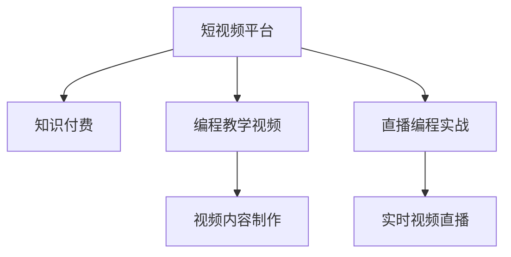

                 

# 程序员如何利用短视频平台进行知识付费

## 1. 背景介绍

### 1.1 问题由来

在当前信息爆炸的时代，知识付费正在成为一种新的学习方式。传统文本和图像的内容形式，由于形式单一、难以直观展现等原因，逐渐被短视频平台所替代。短视频平台如抖音、快手、B站等，凭借其快速、生动、直观的特点，吸引了大量用户。而程序员作为知识密集型行业的一员，如何快速利用短视频平台进行知识付费，成为广大程序员关注的焦点。

### 1.2 问题核心关键点

当前，程序员通过短视频平台进行知识付费，主要是通过以下两种方式：
- 发布编程教学视频：包括编程入门、框架教程、项目实战等，通过视频展示代码、讲解原理、演示调试等，帮助学习者快速掌握编程技能。
- 直播编程实战：通过实时视频展示代码编写、调试过程，让学习者了解编程的实际操作，增强学习体验。

本文将详细介绍以上两种知识付费方式的实现原理和操作步骤，并通过实际案例帮助程序员更好地利用短视频平台进行知识付费。

## 2. 核心概念与联系

### 2.1 核心概念概述

为更好地理解程序员如何利用短视频平台进行知识付费，本节将介绍几个密切相关的核心概念：

- 短视频平台：如抖音、快手、B站等，支持高帧率、高质量的视频录制和播放，广泛应用于视频娱乐、教育、电商等领域。
- 知识付费：通过付费方式获取专业化、系统化的知识内容，加速个人知识技能提升。
- 编程教学视频：包括编程入门、框架教程、项目实战等，通过视频形式展示代码和知识内容，帮助学习者掌握编程技能。
- 直播编程实战：通过实时视频展示编程过程，让学习者了解编程的实际操作，增强学习体验。

这些核心概念之间的逻辑关系可以通过以下Mermaid流程图来展示：



这个流程图展示了这个过程的关键步骤：

1. 短视频平台作为知识付费的载体，提供技术支持。
2. 程序员通过制作编程教学视频或进行直播编程实战，将知识付费。
3. 视频制作和直播是知识付费的核心内容，生成在平台上的视频内容。
4. 视频内容和平台结合，完成知识付费的过程。

## 3. 核心算法原理 & 具体操作步骤
### 3.1 算法原理概述

程序员利用短视频平台进行知识付费，主要是通过视频内容的制作和传播实现的。视频内容的制作需要根据不同的课程内容、学习者的需求，选择合适的视频表现形式，进行脚本编写、录制、剪辑等。视频内容的传播则依赖于短视频平台的推荐算法，将视频推送给需要的人。

### 3.2 算法步骤详解

#### 3.2.1 视频制作

**步骤1：确定课程目标**
- 根据学习者的需求，确定课程目标，如掌握Python编程基础、学习TensorFlow框架等。
- 编写课程大纲，列出需要讲解的主题和知识点。

**步骤2：准备教学素材**
- 收集和整理教学所需的代码、PPT、讲义等素材。
- 将代码整理成短视频格式，录制讲解视频。

**步骤3：视频剪辑**
- 使用视频剪辑软件（如Adobe Premiere、Final Cut Pro等）对录制的视频进行剪辑。
- 添加字幕、注释、动画等元素，提升视频观赏性。

#### 3.2.2 视频发布

**步骤4：选择平台**
- 选择适合自己内容的短视频平台，如B站、抖音、快手等。
- 了解平台的特性和用户群体，选择适合的发布方式。

**步骤5：上传视频**
- 登录平台，上传制作好的视频，填写标题、描述、关键词等元数据。
- 设置视频的分类、标签、时长、发布时间等属性。

**步骤6：发布视频**
- 点击“发布”按钮，上传视频。
- 等待审核通过，视频即可在平台上进行传播。

#### 3.2.3 视频传播

**步骤7：平台推荐**
- 短视频平台会根据用户兴趣、历史行为等因素，推荐相关视频。
- 通过平台算法，将视频推送给最有可能感兴趣的学习者。

**步骤8：互动交流**
- 学习者可以在视频评论区留言，进行互动和交流。
- 教师可以对评论进行回复，解决学习者的疑问。

### 3.3 算法优缺点

利用短视频平台进行知识付费，有以下优点：

- 灵活多样：视频形式直观、生动，能够更好地展示代码和知识内容。
- 易于传播：短视频平台的算法推荐机制，能够将视频精准推送给需要的人。
- 即时互动：学习者可以实时观看视频并进行互动，增强学习体验。

同时，这种知识付费方式也存在以下缺点：

- 技术门槛高：视频制作需要掌握一定的剪辑、拍摄等技术。
- 制作成本高：视频制作需要设备和软件的投入，制作成本较高。
- 互动效果有限：虽然视频可以互动，但无法像直播那样即时交流，效果有限。

### 3.4 算法应用领域

利用短视频平台进行知识付费，已经在多个领域得到应用，如编程教育、数据分析、人工智能等。程序员可以利用这些平台，将自己的编程知识和经验分享给其他学习者，提升自身影响力，同时也能获得丰厚的回报。

## 4. 数学模型和公式 & 详细讲解 & 举例说明

### 4.1 数学模型构建

假设程序员制作的视频内容为 $V$，学习者的需求为 $D$，短视频平台的推荐算法为 $A$。视频内容 $V$ 和需求 $D$ 的关系可以用以下公式表示：

$$
V = f(D)
$$

其中 $f$ 表示视频内容的制作函数，将学习者的需求 $D$ 映射为视频内容 $V$。

### 4.2 公式推导过程

根据以上公式，我们可以得到以下推导过程：

1. 确定 $D$：学习者的需求是编程教育，课程目标为掌握Python编程基础。
2. 设计 $f$：根据课程目标，设计视频内容的制作流程，如讲解变量、函数、类等知识点。
3. 生成 $V$：根据设计流程，生成视频内容 $V$。

### 4.3 案例分析与讲解

**案例分析：Python编程基础课程**

1. 需求：掌握Python编程基础。
2. 制作流程：
   - 确定课程目标：掌握Python基础语法、数据结构、函数、类等知识点。
   - 准备素材：收集Python的官方文档、第三方库的介绍等。
   - 制作视频：录制讲解变量、函数、类等知识点的视频，添加字幕、注释等元素。
   - 视频上传：选择B站作为发布平台，填写标题、描述、关键词等元数据，设置分类和标签。
3. 传播效果：
   - 通过平台算法，推荐给对Python编程感兴趣的用户。
   - 用户观看视频，并在评论区留言，进行互动交流。

## 5. 项目实践：代码实例和详细解释说明
### 5.1 开发环境搭建

在进行视频制作和发布之前，需要先搭建好开发环境。以下是使用Python进行视频制作的开发环境配置流程：

1. 安装Python：从官网下载并安装Python，适用于Windows、macOS、Linux等系统。
2. 安装视频制作工具：如Adobe Premiere、Final Cut Pro、Blender等。
3. 安装Python库：如PyInstaller、OpenCV、numpy等，用于视频处理和剪辑。

完成上述步骤后，即可在本地搭建好视频制作和发布的开发环境。

### 5.2 源代码详细实现

下面我们以Python编程基础课程为例，给出使用Adobe Premiere Pro进行视频制作的Python代码实现。

```python
from adobe Premiere import MediaBin, MediaItem
import os

# 创建视频剪辑项目
project = MediaBin.create("Python编程基础课程")

# 添加视频素材
video_path = os.path.join("src", "Python基础视频.mp4")
video_item = MediaItem.create_from_file(video_path)
project.add_item(video_item)

# 添加字幕
subtitles_path = os.path.join("src", "Python基础字幕.srt")
subtitles_item = MediaItem.create_from_file(subtitles_path)
project.add_item(subtitles_item)

# 设置视频时长
video_duration = video_item.duration
subtitles_duration = subtitles_item.duration
video_timecode = video_duration / 1000
subtitles_timecode = subtitles_duration / 1000
video_item.timecode = (video_timecode, video_timecode + subtitles_timecode)
subtitles_item.timecode = (subtitles_timecode, subtitles_timecode + subtitles_timecode)

# 导出视频
output_path = os.path.join("output", "Python编程基础课程.mp4")
project.export(output_path)
```

以上代码实现将Python基础视频和字幕素材导入到Adobe Premiere Pro中，设置视频时长和字幕时间码，导出最终的视频文件。

### 5.3 代码解读与分析

让我们再详细解读一下关键代码的实现细节：

**VideoBin类**：
- 用于创建和管理视频剪辑项目。

**MediaItem类**：
- 用于创建和管理视频、字幕等素材项。

**video_path和subtitles_path**：
- 分别为视频和字幕文件的路径，用于导入素材。

**video_duration和subtitles_duration**：
- 分别为视频和字幕的持续时间，单位为秒。

**video_timecode和subtitles_timecode**：
- 分别为视频和字幕的时间码，单位为秒。

**video_item.timecode和subtitles_item.timecode**：
- 分别为视频和字幕的时间码。

**project.export()**：
- 导出最终的视频文件，将各个素材项组合成完整的视频。

这个例子展示了如何使用Python和Adobe Premiere Pro进行视频制作的基本步骤，主要包括导入素材、设置时间码、导出文件等。

## 6. 实际应用场景
### 6.1 视频制作

**视频制作流程**

1. 确定课程目标：如掌握Python编程基础。
2. 准备素材：收集Python的官方文档、第三方库的介绍等。
3. 制作视频：录制讲解变量、函数、类等知识点的视频，添加字幕、注释等元素。
4. 视频上传：选择B站作为发布平台，填写标题、描述、关键词等元数据，设置分类和标签。
5. 发布视频：通过平台审核后，视频即可在平台上进行传播。

**视频制作案例**

- 课程目标：掌握Python编程基础。
- 准备素材：收集Python的官方文档、第三方库的介绍等。
- 制作视频：录制讲解变量、函数、类等知识点的视频，添加字幕、注释等元素。
- 视频上传：选择B站作为发布平台，填写标题、描述、关键词等元数据，设置分类和标签。
- 发布视频：通过平台审核后，视频即可在平台上进行传播。

### 6.2 视频传播

**平台推荐**

1. 选择平台：选择适合自己内容的短视频平台，如B站、抖音、快手等。
2. 了解平台：了解平台的特性和用户群体，选择适合的发布方式。

**互动交流**

1. 用户互动：用户可以在视频评论区留言，进行互动和交流。
2. 教师回复：教师可以对评论进行回复，解决学习者的疑问。

**视频传播案例**

- 平台选择：选择B站作为发布平台。
- 平台了解：了解B站的特性和用户群体，选择发布方式。
- 用户互动：用户观看视频，并在评论区留言，进行互动交流。
- 教师回复：教师可以对评论进行回复，解决学习者的疑问。

## 7. 工具和资源推荐
### 7.1 学习资源推荐

为了帮助程序员系统掌握短视频平台知识付费的理论基础和实践技巧，这里推荐一些优质的学习资源：

1. 《短视频营销实战》系列博文：由大V博主撰写，深入浅出地介绍了短视频内容制作、平台运营、用户互动等关键技巧。
2. 《短视频平台用户分析与算法》课程：由知名院校教授主讲，系统讲解了短视频平台的用户行为分析、推荐算法等内容。
3. 《短视频编程教程》书籍：收录了大量编程视频的制作技巧和案例，涵盖编程入门、框架教程、项目实战等主题。
4. YouTube：全球最大的视频平台，提供了丰富的编程视频资源，适合学习者观看和交流。
5. 短视频平台官方文档：如B站、抖音等平台的官方文档，提供了详细的API接口、开发指南等，方便开发者进行技术交流和合作。

通过对这些资源的学习实践，相信你一定能够快速掌握短视频平台知识付费的精髓，并用于解决实际的编程问题。

### 7.2 开发工具推荐

高效的开发离不开优秀的工具支持。以下是几款用于视频制作和发布的常用工具：

1. Adobe Premiere Pro：全球领先的非线性视频编辑软件，功能强大，支持多平台编辑和导出。
2. Final Cut Pro：苹果公司推出的专业视频编辑软件，功能丰富，易于使用。
3. Blender：开源免费的视频制作软件，功能全面，支持动画、特效等高级制作。
4. FFmpeg：命令行视频处理工具，支持各种视频格式和编解码器，易于使用。
5. HandBrake：开源免费的跨平台视频转换工具，支持多种视频格式和编解码器。

合理利用这些工具，可以显著提升视频制作和发布的效率，加快创新迭代的步伐。

### 7.3 相关论文推荐

短视频平台知识付费的研究源于学界的持续研究。以下是几篇奠基性的相关论文，推荐阅读：

1. "Deep Learning and Natural Language Processing for Video Recommendation Systems"：介绍深度学习和自然语言处理在视频推荐系统中的应用。
2. "Video Recommendation via Unsupervised Learning of Visual-Audio Semantic Features"：介绍基于未监督学习的视觉-音频语义特征提取方法。
3. "The Effect of Social Media Content on Video Views and Engagement"：研究社交媒体内容对视频观看和互动的影响。
4. "Exploring the Impact of Algorithmic Recommendations on Video Viewing Behavior"：研究算法推荐对视频观看行为的影响。
5. "A Comparative Study of Recommendation Algorithms for Video Streaming Services"：比较不同推荐算法在视频流媒体服务中的应用效果。

这些论文代表了大视频平台知识付费的研究进展，通过学习这些前沿成果，可以帮助研究者把握学科前进方向，激发更多的创新灵感。

## 8. 总结：未来发展趋势与挑战
### 8.1 总结

本文对程序员如何利用短视频平台进行知识付费进行了全面系统的介绍。首先阐述了知识付费和短视频平台的背景，明确了程序员利用短视频平台进行知识付费的可行性。其次，从原理到实践，详细讲解了视频制作和传播的数学模型和操作步骤，给出了短视频制作和发布的完整代码实例。同时，本文还广泛探讨了知识付费在编程教育、数据分析、人工智能等多个行业领域的应用前景，展示了短视频平台知识付费的巨大潜力。此外，本文精选了短视频平台的各类学习资源，力求为程序员提供全方位的技术指引。

通过本文的系统梳理，可以看到，短视频平台为程序员提供了一种新的知识付费方式，极大地拓展了知识传播的渠道和方式。视频形式直观、生动，能够更好地展示代码和知识内容，吸引更多的学习者。随着短视频平台的不断发展和成熟，未来相信会涌现出更多的优秀程序员通过平台进行知识付费，为全社会带来更多的知识和价值。

### 8.2 未来发展趋势

展望未来，短视频平台知识付费将呈现以下几个发展趋势：

1. 视频内容多样化：除了编程教学视频，还会出现更多教育、科研、医疗等领域的内容。
2. 互动形式多样化：除了直播互动，还会有更多互动直播、即时沟通等形式。
3. 平台技术创新：随着人工智能和大数据技术的发展，平台算法会更加精准，推荐效果更佳。
4. 内容审核机制：平台将加强对内容的质量和合规性审核，保证知识的准确性和健康性。
5. 版权保护机制：平台将建立更加完善的版权保护机制，保护内容创作者的权益。

这些趋势凸显了短视频平台知识付费的广阔前景。这些方向的探索发展，必将进一步提升知识付费的效果，促进知识传播和共享，为人类知识积累和技术进步贡献力量。

### 8.3 面临的挑战

尽管短视频平台知识付费已经取得了瞩目成就，但在迈向更加智能化、普适化应用的过程中，它仍面临着诸多挑战：

1. 内容制作成本高：视频制作需要投入设备和软件，成本较高。
2. 技术门槛高：视频制作需要掌握一定的剪辑、拍摄等技术。
3. 平台推荐算法复杂：平台算法需要不断优化，才能精准推荐。
4. 版权保护问题：内容版权问题依然存在，需要平台和创作者共同努力解决。
5. 内容质量参差不齐：部分视频内容质量不高，需要平台进行严格审核。

尽管存在这些挑战，但短视频平台知识付费的发展势头依然强劲，相信随着技术的发展和应用的推广，这些挑战终将一一被克服。

### 8.4 未来突破

面对短视频平台知识付费所面临的挑战，未来的研究需要在以下几个方面寻求新的突破：

1. 引入更多跨领域内容：将更多领域的内容引入平台，丰富内容生态。
2. 提升平台算法精准度：开发更精准的推荐算法，提升推荐效果。
3. 降低内容制作成本：引入自动化工具和模板，降低内容制作成本。
4. 增强互动体验：引入更多互动形式，增强学习体验。
5. 建立版权保护机制：制定和完善版权保护政策，保障创作者权益。

这些研究方向的探索，必将引领短视频平台知识付费技术迈向更高的台阶，为知识传播和共享提供新的平台和方式。面向未来，短视频平台知识付费需要开发者、平台和创作者共同努力，才能实现知识的广泛传播和深度融合，真正为全社会带来知识和技术进步。

## 9. 附录：常见问题与解答

**Q1：视频制作时需要注意哪些问题？**

A: 视频制作时需要注意以下几个问题：
1. 视频时长：视频时长不宜过长，一般为5-10分钟。
2. 视频画质：视频画质需要清晰，避免模糊和抖动。
3. 字幕和注释：添加字幕和注释，提升视频可读性。
4. 视频剪辑：视频剪辑需要流畅自然，避免断点和错位。
5. 视频导出：视频导出格式需要支持多种平台，如MP4、AVI等。

**Q2：视频上传后如何提高曝光率？**

A: 提高视频曝光率可以通过以下几种方式：
1. 优化标题和描述：填写有吸引力的标题和详细的描述，吸引用户点击。
2. 合理设置分类和标签：选择适合的分类和标签，方便平台推荐。
3. 发布高质量内容：提供高质量的视频内容，增加用户观看时间和互动率。
4. 使用热门话题和标签：加入热门话题和标签，吸引更多用户观看。
5. 利用平台推广工具：利用平台提供的推广工具，增加视频的曝光率。

**Q3：视频内容制作过程中如何进行互动交流？**

A: 视频内容制作过程中可以通过以下几种方式进行互动交流：
1. 视频评论区：在视频评论区发布评论，与观众互动。
2. 视频直播：通过直播与观众实时互动。
3. 社交媒体：在社交媒体平台发布相关内容，与观众互动。
4. 弹幕系统：开启弹幕系统，观众可以实时互动。
5. 在线讨论区：在视频发布平台开启在线讨论区，观众可以自由讨论。

这些互动方式可以增强观众的参与感和学习体验，提升视频的影响力和传播效果。

**Q4：如何选择适合自己的短视频平台？**

A: 选择适合自己的短视频平台可以通过以下几种方式：
1. 了解平台特性：了解各个平台的特点，选择适合自己的平台。
2. 了解用户群体：了解各个平台的用户群体，选择适合自己的受众。
3. 了解平台流量：了解各个平台的流量情况，选择流量大的平台。
4. 了解平台政策：了解各个平台的内容审核政策和版权保护政策。
5. 了解平台收益：了解各个平台的收益模式，选择适合自己的收益方式。

合理选择平台，可以最大限度地提升视频传播效果，实现知识付费的目标。

---

作者：禅与计算机程序设计艺术 / Zen and the Art of Computer Programming

