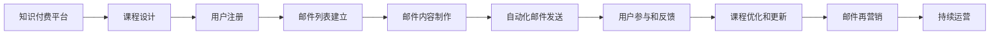

                 

# 程序员如何利用邮件营销推广知识付费

## 1. 背景介绍

随着信息技术的飞速发展，知识付费模式已经成为一种趋势。对于程序员而言，掌握新技术、新框架是保持竞争力的重要方式。邮件营销作为一种高效、低成本的推广手段，被越来越多的知识付费平台所采用。本文将详细介绍如何利用邮件营销，有效地推广知识付费课程，帮助程序员提升自身技能。

## 2. 核心概念与联系

### 2.1 核心概念概述

在阐述具体方法之前，我们先介绍几个核心概念：

- **知识付费**：指用户为获取特定知识和技能，支付一定费用的商业模式。知识付费平台包括但不限于Coursera、Udemy、知乎等。
- **邮件营销**：指通过电子邮件，向目标受众传递营销信息和知识，以实现销售转化和用户获取的手段。
- **精准推荐**：指通过数据分析和机器学习，向用户推荐最符合其兴趣和需求的课程。
- **自动化工具**：指用于邮件营销自动化管理和优化的软件，如Mailchimp、Sendinblue等。

这些概念相互联系，共同构成了利用邮件营销推广知识付费的基本框架。

### 2.2 核心概念原理和架构的 Mermaid 流程图



这个流程图展示了知识付费平台如何通过邮件营销，从课程设计到用户参与，再到课程优化和再营销的全过程。

## 3. 核心算法原理 & 具体操作步骤

### 3.1 算法原理概述

邮件营销推广知识付费的算法原理主要包括以下几个方面：

1. **用户画像构建**：通过分析用户的行为数据，建立用户画像，了解用户兴趣、需求和偏好。
2. **邮件内容定制**：根据用户画像，定制邮件内容，包含课程推荐、优惠券、课程更新等信息。
3. **推荐算法**：使用推荐算法，向用户推荐最适合的课程，提高用户转化率。
4. **A/B测试**：通过A/B测试，优化邮件内容和发送策略，提高邮件打开率和点击率。
5. **自动化工具集成**：利用自动化工具，管理邮件列表、自动化发送邮件、统计分析邮件效果。

### 3.2 算法步骤详解

#### 3.2.1 用户画像构建

用户画像的构建是通过收集和分析用户行为数据，如浏览历史、搜索记录、购买行为等，使用聚类算法、关联规则挖掘等方法，得到用户兴趣和行为特征的标签。这些标签可以作为邮件内容定制的基础。

#### 3.2.2 邮件内容定制

邮件内容需要精简明了，同时包含吸引用户点击和转化的信息。具体步骤包括：

1. **主题行设计**：设计有吸引力的主题行，确保邮件打开率。
2. **邮件正文优化**：精简邮件正文，包含课程推荐、优惠券、用户评价等信息。
3. **视觉设计**：使用简洁明了的视觉设计，提升用户体验。

#### 3.2.3 推荐算法

推荐算法可以使用协同过滤、基于内容的推荐、深度学习等方法。以协同过滤为例，算法步骤如下：

1. **用户-课程评分矩阵构建**：通过用户对课程的评分，构建用户-课程评分矩阵。
2. **相似度计算**：计算用户对每门课程的评分，找到与目标用户评分最相似的K个用户。
3. **推荐课程获取**：根据相似用户对课程的评分，推荐目标用户最可能感兴趣的课程。

#### 3.2.4 A/B测试

A/B测试可以帮助优化邮件内容和发送策略，步骤如下：

1. **邮件版本设计**：设计两个或多个版本的邮件，分别包含不同的主题行、正文内容和设计元素。
2. **测试结果分析**：统计不同版本邮件的打开率、点击率、转化率等指标，选择表现最佳的版本。
3. **持续优化**：根据测试结果，不断调整邮件内容和发送策略，提高邮件营销效果。

#### 3.2.5 自动化工具集成

自动化工具可以大幅提升邮件营销的效率和效果。具体步骤如下：

1. **邮件列表管理**：使用自动化工具管理邮件列表，确保邮件列表的准确性和实时性。
2. **自动化发送**：利用自动化工具，定时发送邮件，避免手动操作。
3. **效果跟踪**：使用自动化工具跟踪邮件打开率、点击率、转化率等指标，分析邮件效果。

### 3.3 算法优缺点

#### 3.3.1 优点

1. **高效低成本**：邮件营销相较于其他推广方式，成本较低，且可高效触达目标受众。
2. **个性化推荐**：通过用户画像和推荐算法，实现个性化课程推荐，提高用户转化率。
3. **持续优化**：通过A/B测试和自动化工具，持续优化邮件内容和发送策略，提高邮件营销效果。

#### 3.3.2 缺点

1. **打开率受限**：邮件打开率受用户收件箱规则、内容设计等因素影响，有时难以达到预期效果。
2. **用户数据隐私**：收集用户行为数据时，需要遵守数据隐私法律法规，保护用户隐私。
3. **自动化工具依赖**：邮件营销的自动化工具需要付费使用，可能增加运营成本。

### 3.4 算法应用领域

邮件营销不仅适用于知识付费平台的课程推广，还可以应用于以下领域：

1. **在线教育**：推广在线课程、培训讲座等。
2. **企业培训**：推广企业内训课程，提升员工技能。
3. **软件开发**：推广开源工具、框架和开发课程。
4. **SaaS产品**：推广软件即服务(SaaS)产品，提高用户订阅率。
5. **在线社区**：推广在线技术论坛、社区和用户群体。

## 4. 数学模型和公式 & 详细讲解 & 举例说明

### 4.1 数学模型构建

邮件营销的数学模型主要包括以下几个组成部分：

- **用户行为数据**：包括用户浏览历史、搜索记录、购买行为等。
- **用户画像标签**：通过聚类算法、关联规则挖掘等方法，得到用户兴趣和行为特征的标签。
- **邮件内容评分**：根据用户对邮件内容的评分，构建邮件内容评分向量。
- **课程评分矩阵**：通过用户对课程的评分，构建用户-课程评分矩阵。

### 4.2 公式推导过程

以协同过滤算法为例，公式推导过程如下：

1. **用户-课程评分矩阵构建**
$$
R = \begin{bmatrix}
    r_{11} & r_{12} & \dots & r_{1n} \\
    r_{21} & r_{22} & \dots & r_{2n} \\
    \dots & \dots & \dots & \dots \\
    r_{N1} & r_{N2} & \dots & r_{Nn}
\end{bmatrix}
$$
其中，$r_{ui}$表示用户$u$对课程$i$的评分。

2. **相似度计算**
$$
\text{similarity}(u, v) = \frac{\sum_{i=1}^{n}r_{ui}r_{vi}}{\sqrt{\sum_{i=1}^{n}r_{ui}^2}\sqrt{\sum_{i=1}^{n}r_{vi}^2}}
$$
计算用户$u$和$v$的相似度。

3. **推荐课程获取**
$$
\hat{R}_{ui} = \frac{\sum_{v\in V} \text{similarity}(u, v)r_{vi}}{\sum_{v\in V} \text{similarity}(u, v)}
$$
计算用户$u$对课程$i$的推荐评分。

### 4.3 案例分析与讲解

假设某知识付费平台有1000个用户，每人有30门课程评分数据。使用协同过滤算法推荐系统，选择用户$u$对课程$j$的推荐评分如下：

1. **用户-课程评分矩阵**：
$$
R = \begin{bmatrix}
    3 & 4 & 1 & 2 & 5 \\
    2 & 3 & 5 & 0 & 4 \\
    \dots & \dots & \dots & \dots & \dots \\
    5 & 0 & 3 & 2 & 1
\end{bmatrix}
$$
2. **用户$u$和$v$的相似度**：
$$
\text{similarity}(u, v) = \frac{3 \times 2 + 4 \times 3 + 1 \times 5 + 2 \times 0 + 5 \times 4}{\sqrt{3^2+4^2+1^2+2^2+5^2}\sqrt{2^2+3^2+5^2+0^2+4^2}}
$$
3. **推荐课程评分**：
$$
\hat{R}_{uj} = \frac{(3 \times 0 + 4 \times 5 + 1 \times 4 + 2 \times 4 + 5 \times 0)}{(3^2+4^2+1^2+2^2+5^2)+(2^2+3^2+5^2+0^2+4^2)}
$$

## 5. 项目实践：代码实例和详细解释说明

### 5.1 开发环境搭建

要实现邮件营销推广知识付费，需要搭建一套完整的开发环境，包括：

1. **服务器**：搭建Web服务器，用于存储邮件列表、处理邮件请求等。
2. **邮件服务器**：使用SMTP或ESMTP协议，发送邮件。
3. **数据库**：存储用户行为数据、邮件内容、课程评分等。
4. **自动化工具**：使用Mailchimp、Sendinblue等工具，管理邮件列表、自动化发送邮件等。

### 5.2 源代码详细实现

以下是一个简单的邮件营销推广知识付费的代码实现，包含邮件列表管理、邮件内容定制、邮件发送和效果跟踪等功能：

```python
import smtplib
from email.mime.multipart import MIMEMultipart
from email.mime.text import MIMEText
from email.mime.image import MIMEImage
from email.mime.base import MIMEBase
from email import encoders

class MailChimp:
    def __init__(self, username, api_key):
        self.username = username
        self.api_key = api_key

    def send_email(self, subject, message, from_address, to_addresses):
        # 构建邮件内容
        msg = MIMEMultipart()
        msg['From'] = from_address
        msg['To'] = ', '.join(to_addresses)
        msg['Subject'] = subject

        # 添加邮件正文
        msg.attach(MIMEText(message, 'plain'))

        # 添加附件（可选）
        # 添加图片附件
        with open('image.jpg', 'rb') as f:
            img = MIMEImage(f.read())
            img.add_header('Content-Disposition', 'attachment', filename='image.jpg')
            msg.attach(img)

        # 发送邮件
        server = smtplib.SMTP('smtp.gmail.com', 587)
        server.starttls()
        server.login(self.username, self.api_key)
        server.sendmail(from_address, to_addresses, msg.as_string())
        server.quit()

if __name__ == '__main__':
    # 使用Mailchimp发送邮件
    mailchimp = MailChimp('your_username', 'your_api_key')
    mailchimp.send_email('欢迎参加我们的课程', '欢迎参加我们的Python高级课程，扫描二维码报名：https://example.com', 'from_address', ['to_address1', 'to_address2'])
```

### 5.3 代码解读与分析

以上代码实现了使用Mailchimp发送邮件的功能，包含邮件内容构建、附件添加、SMTP连接、登录、发送邮件等步骤。通过调用Mailchimp API，可以方便地管理和自动化发送邮件，提高邮件营销的效率和效果。

### 5.4 运行结果展示

运行上述代码，可以在指定收件箱中收到欢迎邮件，包含课程信息和报名链接。邮件内容应根据具体需求进行设计，包含吸引用户的亮点和优惠信息，提高用户点击率和转化率。

## 6. 实际应用场景

### 6.1 在线教育平台

在线教育平台可以通过邮件营销推广课程，具体应用场景包括：

1. **课程推荐**：根据用户行为数据，向用户推荐感兴趣的课程。
2. **优惠券**：发送专属优惠券，吸引用户报名。
3. **课程更新通知**：定期发送课程更新通知，保持用户关注。

### 6.2 企业培训

企业培训可以通过邮件营销推广内部课程，具体应用场景包括：

1. **内部培训推广**：向员工推荐公司内部培训课程，提升员工技能。
2. **外部合作课程**：推广与外部机构合作的在线课程，丰富员工学习资源。
3. **培训反馈**：收集员工对培训课程的反馈，不断优化培训内容。

### 6.3 软件开发社区

软件开发社区可以通过邮件营销推广技术文章、开发教程等，具体应用场景包括：

1. **技术文章推广**：推广社区内的技术文章，提高文章阅读量和用户活跃度。
2. **教程分享**：分享编程技巧、框架教程等，提升用户技能。
3. **社区活动**：推广社区组织的编程比赛、技术沙龙等活动，增加用户参与度。

### 6.4 未来应用展望

未来邮件营销在知识付费推广中的应用将更加广泛和深入，具体趋势包括：

1. **个性化推荐算法优化**：使用深度学习等算法，提高课程推荐的精准度和用户满意度。
2. **多渠道整合**：整合短信、社交媒体等多渠道营销手段，提升用户覆盖面和效果。
3. **用户行为数据分析**：通过大数据分析，深入了解用户需求和行为，优化邮件内容和策略。
4. **A/B测试自动化**：自动化进行A/B测试，持续优化邮件内容和发送策略，提高邮件营销效果。
5. **用户反馈机制**：建立用户反馈机制，及时调整邮件内容和策略，提高用户满意度和忠诚度。

## 7. 工具和资源推荐

### 7.1 学习资源推荐

1. **《邮件营销实战》**：该书详细介绍了邮件营销的理论和实践，包括邮件内容设计、自动化工具使用、A/B测试等。
2. **Coursera《数字营销》课程**：由知名大学开设的在线课程，涵盖邮件营销、社交媒体营销等多个方面。
3. **Google Analytics**：使用Google Analytics分析邮件营销效果，了解用户行为和转化率。
4. **HubSpot Academy**：提供免费邮件营销课程，包括邮件列表管理、自动化工具使用等。

### 7.2 开发工具推荐

1. **Mailchimp**：功能强大的邮件营销自动化工具，支持邮件列表管理、邮件内容设计、自动化发送等功能。
2. **Sendinblue**：功能丰富的邮件营销自动化工具，支持邮件内容设计、A/B测试、自动化跟踪等。
3. **SMSBee**：专注于短信营销的自动化工具，支持短信内容设计、自动化发送等功能。
4. **Gmail API**：使用Gmail API进行邮件自动化发送，支持复杂的邮件内容设计和自动化操作。

### 7.3 相关论文推荐

1. **《Email Marketing Optimization》**：该论文讨论了邮件营销的优化方法，包括用户画像构建、邮件内容定制、A/B测试等。
2. **《Email Personalization Techniques》**：该论文介绍了邮件个性化推荐算法，使用协同过滤、深度学习等方法。
3. **《A/B Testing in Email Marketing》**：该论文讨论了A/B测试在邮件营销中的应用，如何优化邮件内容和发送策略。

## 8. 总结：未来发展趋势与挑战

### 8.1 研究成果总结

本文详细介绍了邮件营销推广知识付费的方法和实践，涵盖用户画像构建、邮件内容定制、推荐算法、A/B测试等关键环节。通过实际案例和代码实现，展示了邮件营销在知识付费推广中的应用效果。

### 8.2 未来发展趋势

未来邮件营销在知识付费推广中将继续发挥重要作用，具体趋势包括：

1. **个性化推荐算法优化**：使用深度学习等算法，提高课程推荐的精准度和用户满意度。
2. **多渠道整合**：整合短信、社交媒体等多渠道营销手段，提升用户覆盖面和效果。
3. **用户行为数据分析**：通过大数据分析，深入了解用户需求和行为，优化邮件内容和策略。
4. **A/B测试自动化**：自动化进行A/B测试，持续优化邮件内容和发送策略，提高邮件营销效果。
5. **用户反馈机制**：建立用户反馈机制，及时调整邮件内容和策略，提高用户满意度和忠诚度。

### 8.3 面临的挑战

邮件营销在知识付费推广中也面临一些挑战，具体包括：

1. **用户数据隐私**：收集用户行为数据时，需要遵守数据隐私法律法规，保护用户隐私。
2. **邮件打开率受限**：邮件打开率受用户收件箱规则、内容设计等因素影响，有时难以达到预期效果。
3. **自动化工具依赖**：邮件营销的自动化工具需要付费使用，可能增加运营成本。

### 8.4 研究展望

未来的研究需要在以下几个方面寻求新的突破：

1. **用户画像构建优化**：使用更多元化的数据源，提高用户画像的准确性和实时性。
2. **邮件内容自动化设计**：使用自然语言生成等技术，自动生成吸引用户的邮件内容。
3. **推荐算法多模态融合**：将文本、图像、视频等多模态数据进行融合，提高课程推荐的精准度。
4. **智能客服集成**：利用智能客服技术，实时回答用户疑问，提升用户满意度。
5. **用户行为实时分析**：实时分析用户行为数据，动态调整邮件内容和策略，提高转化率。

## 9. 附录：常见问题与解答

**Q1：邮件营销是否适用于所有知识付费平台？**

A: 邮件营销适用于大多数知识付费平台，但需要根据平台特性进行优化。例如，对于B2B知识付费平台，可以考虑发送PDF版课程资料；对于C2C平台，可以增加社交互动元素，提高用户参与度。

**Q2：如何保证邮件内容的个性化？**

A: 个性化邮件内容需要根据用户画像进行设计。通过分析用户行为数据，了解用户兴趣和需求，设计符合用户偏好的邮件内容。使用A/B测试，不断优化邮件内容，提高用户满意度。

**Q3：如何优化邮件打开率？**

A: 优化邮件打开率需要设计有吸引力的主题行，避免垃圾邮件过滤，合理设计邮件正文长度和格式，提高邮件的可读性。

**Q4：邮件营销是否需要持续优化？**

A: 邮件营销需要持续优化，通过A/B测试和数据分析，不断调整邮件内容和发送策略。定期评估邮件营销效果，及时调整优化方案。

**Q5：如何保护用户数据隐私？**

A: 保护用户数据隐私需要遵守相关法律法规，如GDPR、CCPA等。避免收集敏感信息，加密存储用户数据，透明告知用户数据使用情况。

---

作者：禅与计算机程序设计艺术 / Zen and the Art of Computer Programming

