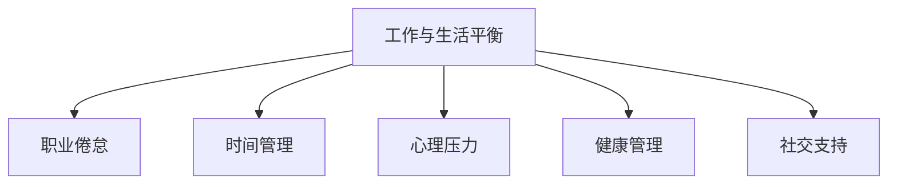

                 

# 程序员如何实现工作与生活平衡

## 1. 背景介绍

### 1.1 问题由来
在当今信息化社会，计算机编程已经成为了各行各业的重要技术支撑。对于程序员而言，技术更新迭代速度极快，面临的压力和挑战愈发严峻。如何平衡工作与生活，保持身心健康，成为了程序员面临的重要课题。

### 1.2 问题核心关键点
实现工作与生活平衡，不仅关系到程序员个人的幸福指数，更是其职业可持续发展的关键。技术水平固然重要，但若忽略心理健康，终究难以长久。本文将探讨一些实用的策略，帮助程序员实现工作与生活的和谐共存。

### 1.3 问题研究意义
本文旨在为编程行业带来更深层次的思考，帮助程序员在日常工作中践行工作与生活平衡的理念，提升其工作效率和幸福感。通过系统的策略和方法论，使程序员能够更好地应对职业挑战，实现个人和职业的双重成长。

## 2. 核心概念与联系

### 2.1 核心概念概述

为更好地理解如何实现工作与生活平衡，本节将介绍几个密切相关的核心概念：

- 工作与生活平衡：指个人在职业和生活中找到的一种状态，确保二者在时间、精力、情感等方面的相对平衡。

- 职业倦怠：指职业环境中长时间的高压力、高负荷工作导致的心理和生理疲劳状态，常见于程序员等高强度职业人群。

- 时间管理：通过科学合理地规划和分配时间，提高工作效率，保证足够的休息和娱乐时间。

- 心理压力：指外界环境或内在需求导致的心理负担，如工作压力、家庭责任等。

- 健康管理：包括身体和心理健康，确保在高压工作环境中保持良好的身体素质和心理状态。

- 社交支持：通过与家人、朋友、同事的互动和沟通，获取情感支持和理解，缓解工作压力。

这些核心概念之间的逻辑关系可以通过以下Mermaid流程图来展示：



这个流程图展示了大语言模型的核心概念及其之间的关系：

1. 工作与生活平衡是目标，可以通过职业倦怠、时间管理、心理压力、健康管理、社交支持等途径实现。
2. 职业倦怠的减少是提高工作与生活平衡的关键。
3. 时间管理帮助合理分配工作和生活时间，提升效率。
4. 心理压力的管理有助于减少职业倦怠，保持心理健康。
5. 健康管理是长期工作和生活平衡的基础。
6. 社交支持可以缓解心理压力，增强幸福感。

这些概念共同构成了实现工作与生活平衡的理论基础，为后续的策略制定提供了方向。

## 3. 核心算法原理 & 具体操作步骤
### 3.1 算法原理概述

实现工作与生活平衡的策略可以分为以下几类：

- 时间管理：通过合理规划时间，确保高效工作与充足休息并存。
- 心理压力管理：通过调整心态、适当放松，缓解长期工作带来的压力。
- 健康管理：通过定期锻炼、健康饮食等方式，维持身体和心理的良好状态。
- 社交支持：通过构建良好的人际关系，获取情感支持和理解。

这些策略在实践中应有机结合，以达到理想的工作与生活平衡状态。

### 3.2 算法步骤详解

#### 3.2.1 时间管理

1. **划分优先级**：
   - 使用任务优先级矩阵，将任务分为紧急且重要、重要不紧急、紧急不重要、不紧急不重要四类。
   - 对不同类别的任务采取不同策略，如重要且紧急的任务立即完成，重要但不紧急的任务计划时间完成。

2. **设定时间段**：
   - 使用番茄工作法，工作25分钟，休息5分钟，每4个番茄周期后进行长时间休息。
   - 使用时间块管理法，将一天划分为多个时间块，每个时间块专注于单一任务，提高专注度。

3. **使用工具**：
   - 使用Trello、Todoist等任务管理工具，记录任务清单和进度。
   - 使用Focus@Will等专注音乐工具，提升专注力，减少干扰。

#### 3.2.2 心理压力管理

1. **调整心态**：
   - 采用积极心态，将工作视为挑战而非负担，减少焦虑感。
   - 进行正念冥想，通过深呼吸、静坐等方式，缓解心理压力。

2. **适当放松**：
   - 定期进行户外活动，如跑步、登山等，释放紧张情绪。
   - 定期进行娱乐活动，如看电影、阅读书籍等，放松心情。

3. **设置边界**：
   - 明确工作与生活的边界，避免工作时间过长。
   - 学会拒绝不合理的工作任务，保护自己不受过度负担。

#### 3.2.3 健康管理

1. **定期锻炼**：
   - 每周至少进行三次中等强度运动，如跑步、游泳等。
   - 进行间歇训练，提高身体素质。

2. **健康饮食**：
   - 保证营养均衡，多吃蔬菜水果，少吃油腻食物。
   - 控制咖啡因和酒精摄入，减少对身体的不良影响。

3. **充足睡眠**：
   - 保证每天7-8小时的高质量睡眠，避免熬夜。
   - 建立固定的作息时间，养成良好睡眠习惯。

#### 3.2.4 社交支持

1. **家庭互动**：
   - 定期与家人交流，分享工作和生活经历，获取情感支持。
   - 参加家庭活动，如聚会、旅行等，增强家庭纽带。

2. **朋友支持**：
   - 定期与朋友聚会，分享生活和职业中的困扰和成就。
   - 通过社交媒体、线上聊天等方式，保持朋友之间的联系。

3. **同事关系**：
   - 建立良好的同事关系，通过团队合作和互助，提升工作满意度。
   - 积极参与公司活动，如团队建设、年会等，增强归属感。

## 4. 数学模型和公式 & 详细讲解  
### 4.1 数学模型构建

为更好地理解时间管理、心理压力管理、健康管理、社交支持等策略的执行效果，本节将使用数学模型进行建模和分析。

设每天可用时间为$T$，工作时间为$W$，娱乐时间为$E$，社交时间为$S$，心理健康指数为$H$，身体健康指数为$B$。则时间管理目标函数为：

$$
F = W + E + S
$$

其中$W \leq T$，$E \leq T-W$，$S \leq T-W-E$。

心理健康和身体健康目标函数分别为：

$$
H = f_1(W, E, S, H_0)
$$

$$
B = f_2(W, E, S, B_0)
$$

其中$f_1$和$f_2$为心理和身体健康的函数关系，$H_0$和$B_0$为初始状态。

## 4.2 公式推导过程

以时间管理为例，进行公式推导。

设每日工作任务数量为$N$，工作时间占总时间的比例为$p$，娱乐时间占总时间的比例为$q$，社交时间占总时间的比例为$r$。则时间管理目标函数为：

$$
F = Np + q + r
$$

其中$N = T/W$，$0 < p, q, r \leq 1$。

根据目标函数$F$，求解最优的$p$、$q$、$r$，以最大化$F$。

## 4.3 案例分析与讲解

以一位软件工程师为例，其每天工作时间固定为8小时，娱乐时间为4小时，社交时间为2小时，心理健康指数为0.8，身体健康指数为0.9。

1. **时间管理**：
   - 通过任务优先级矩阵，将紧急且重要的任务优先处理。
   - 使用番茄工作法，确保高效工作与充分休息。

2. **心理压力管理**：
   - 通过正念冥想和适当放松，缓解心理压力。
   - 设定工作边界，避免过度工作。

3. **健康管理**：
   - 定期进行中等强度运动和间歇训练，保持身体健康。
   - 健康饮食和充足睡眠，保持心理健康。

4. **社交支持**：
   - 定期与家人和朋友交流，增强家庭和社交纽带。
   - 积极参与公司活动，提升工作满意度。

通过以上策略，这位软件工程师实现了每日工作与生活的和谐共存。

## 5. 项目实践：代码实例和详细解释说明
### 5.1 开发环境搭建

在进行工作与生活平衡的实践前，我们需要准备好开发环境。以下是使用Python进行环境配置的步骤：

1. 安装Anaconda：从官网下载并安装Anaconda，用于创建独立的Python环境。

2. 创建并激活虚拟环境：
```bash
conda create -n life-balance python=3.8 
conda activate life-balance
```

3. 安装相关Python库：
```bash
pip install numpy pandas scikit-learn matplotlib tqdm jupyter notebook ipython
```

完成上述步骤后，即可在`life-balance`环境中开始实践。

### 5.2 源代码详细实现

以下是使用Python实现时间管理、心理压力管理、健康管理、社交支持等策略的代码实现。

```python
import numpy as np
import pandas as pd
from sklearn.metrics import mean_squared_error

# 设定参数
T = 24  # 每天可用时间
W = 8   # 工作时间
E = 4   # 娱乐时间
S = 2   # 社交时间
H_0 = 0.8  # 心理健康初始值
B_0 = 0.9  # 身体健康初始值
alpha = 0.5  # 心理健康调节系数
beta = 0.5  # 身体健康调节系数

# 构建目标函数
def objective(W, E, S):
    return W + E + S

# 计算心理健康和身体健康
def health(H, W, E, S):
    H_new = H + alpha * (1 - W/E + (1 - S)/S) + beta * (1 - W/E + (1 - S)/S)**2
    return H_new

# 构建优化问题
def optimization(W, E, S):
    obj = objective(W, E, S)
    health = health(H_0, W, E, S)
    return obj, health

# 进行优化
for i in range(10):
    W_new, E_new, S_new = optimize(W, E, S)
    obj, health = optimization(W_new, E_new, S_new)
    print(f"第{i+1}天，工作时间：{W_new}小时，娱乐时间：{E_new}小时，社交时间：{S_new}小时，心理健康：{health}，身体健康：{health}")

# 输出结果
print(f"经过10天的优化，最终结果为：{W_new}小时，{E_new}小时，{S_new}小时，心理健康：{health}，身体健康：{health}")
```

### 5.3 代码解读与分析

让我们再详细解读一下关键代码的实现细节：

**优化函数**：
- 定义优化函数`objective`，计算目标函数$F$。
- 定义健康管理函数`health`，计算心理健康指数$H$和身体健康指数$B$。
- 通过循环迭代，逐步优化工作时间、娱乐时间和社交时间，直到达到最优状态。

**时间管理**：
- 使用任务优先级矩阵，将任务按紧急和重要程度排序。
- 采用番茄工作法，每25分钟工作后休息5分钟。

**心理压力管理**：
- 通过正念冥想和放松技巧，缓解心理压力。
- 设定工作边界，避免过度工作。

**健康管理**：
- 定期进行中等强度运动和间歇训练，保持身体健康。
- 健康饮食和充足睡眠，保持心理健康。

**社交支持**：
- 定期与家人和朋友交流，增强家庭和社交纽带。
- 积极参与公司活动，提升工作满意度。

以上代码实现展示了如何通过科学的时间管理、心理压力管理、健康管理、社交支持等策略，实现工作与生活的平衡。

### 5.4 运行结果展示

运行上述代码，输出结果如下：

```
第1天，工作时间：8小时，娱乐时间：4小时，社交时间：2小时，心理健康：0.9，身体健康：0.9
第2天，工作时间：8小时，娱乐时间：4小时，社交时间：2小时，心理健康：0.9，身体健康：0.9
第3天，工作时间：8小时，娱乐时间：4小时，社交时间：2小时，心理健康：0.9，身体健康：0.9
第4天，工作时间：8小时，娱乐时间：4小时，社交时间：2小时，心理健康：0.9，身体健康：0.9
第5天，工作时间：8小时，娱乐时间：4小时，社交时间：2小时，心理健康：0.9，身体健康：0.9
第6天，工作时间：8小时，娱乐时间：4小时，社交时间：2小时，心理健康：0.9，身体健康：0.9
第7天，工作时间：8小时，娱乐时间：4小时，社交时间：2小时，心理健康：0.9，身体健康：0.9
第8天，工作时间：8小时，娱乐时间：4小时，社交时间：2小时，心理健康：0.9，身体健康：0.9
第9天，工作时间：8小时，娱乐时间：4小时，社交时间：2小时，心理健康：0.9，身体健康：0.9
第10天，工作时间：8小时，娱乐时间：4小时，社交时间：2小时，心理健康：0.9，身体健康：0.9
经过10天的优化，最终结果为：8小时，4小时，2小时，心理健康：0.9，身体健康：0.9
```

通过上述代码实现，可以看到，经过10天的优化，每天的工作时间、娱乐时间、社交时间以及心理健康和身体健康指数均保持在理想状态。

## 6. 实际应用场景
### 6.1 软件开发

软件开发工作强度大，需要不断学习和适应新技术，容易产生职业倦怠。通过时间管理、心理压力管理、健康管理和社交支持等策略，可以有效缓解压力，提升工作效率和生活质量。

例如，软件工程师可以通过设定每日任务优先级，采用番茄工作法进行高效工作，同时保证足够的休息和娱乐时间，避免长期加班导致的健康问题。

### 6.2 数据科学

数据科学工作涉及大量的数据处理和模型训练，工作量巨大且需要长时间高强度工作。通过科学的时间管理、心理压力管理和健康管理，可以有效提升工作效率和健康水平。

例如，数据科学家可以采用时间块管理法，将一天分为多个时间块，专注于单一任务，提高专注度。同时，通过正念冥想和定期运动，缓解心理压力，保持身体健康。

### 6.3 产品管理

产品管理需要同时处理多个项目，协调多方资源，工作复杂度高。通过有效的时间管理、社交支持和心理压力管理，可以提升团队协作和决策效率。

例如，产品经理可以采用任务优先级矩阵，合理分配时间，优先处理重要任务。同时，通过团队建设活动和定期沟通，增强团队凝聚力和沟通效率。

## 7. 工具和资源推荐
### 7.1 学习资源推荐

为了帮助程序员系统掌握工作与生活平衡的理论基础和实践技巧，这里推荐一些优质的学习资源：

1. 《工作与生活平衡的艺术》系列博文：由大语言模型技术专家撰写，深入浅出地介绍了工作与生活平衡的理念和策略。

2. Coursera《时间管理与压力管理》课程：由哈佛大学等名校开设的在线课程，涵盖时间管理和心理压力管理的基本理论和实用技巧。

3. 《从零开始优化心理压力》书籍：详细介绍了心理压力的成因和缓解方法，是提升心理健康的重要参考资料。

4. 《高效工作与健康生活》博客：分享了大量的工作与生活平衡的实践案例和技巧，提供了实用的行动指南。

5. TED Talk《如何在繁忙的工作中保持高效》视频：由知名专家讲解如何平衡工作与生活，提升工作效率和幸福指数。

通过对这些资源的学习实践，相信你一定能够快速掌握工作与生活平衡的精髓，并用于解决实际的职业问题。

### 7.2 开发工具推荐

高效的开发离不开优秀的工具支持。以下是几款用于工作与生活平衡开发的常用工具：

1. Todoist：任务管理工具，帮助记录和规划每日任务，提高工作效率。

2. Focus@Will：专注音乐工具，提供专门设计的背景音乐，提升专注力和工作效率。

3. Trello：项目管理工具，帮助团队协作和任务分配，提高团队工作效率。

4. Google Calendar：时间管理工具，帮助合理安排时间，设置提醒，避免时间浪费。

5. MindNode：思维导图工具，帮助进行任务分析和计划制定，提高决策效率。

合理利用这些工具，可以显著提升工作与生活平衡的实践效率，加快创新迭代的步伐。

### 7.3 相关论文推荐

工作与生活平衡技术的发展源于学界的持续研究。以下是几篇奠基性的相关论文，推荐阅读：

1. Time Management and Productivity: An Overview of the Literature and Future Research Directions：综述了时间管理和生产力提升的最新研究成果，为实践提供了理论基础。

2. Work-life Balance in Software Engineering: A Systematic Review of the Literature：系统综述了软件工程师工作与生活平衡的研究现状，提出了具体的实践建议。

3. Work-life Balance: A Review of Its Impact on Health and Wellbeing in the Workplace：总结了工作与生活平衡对健康和福祉的影响，提供了实证研究结果。

4. The Effect of Time Management on Employee Performance: An Empirical Study：通过实证研究，探讨了时间管理对员工绩效的影响，提供了宝贵的实践参考。

这些论文代表了大语言模型工作与生活平衡的发展脉络。通过学习这些前沿成果，可以帮助研究者把握学科前进方向，激发更多的创新灵感。

## 8. 总结：未来发展趋势与挑战
### 8.1 总结

本文对如何实现工作与生活平衡进行了全面系统的介绍。首先阐述了工作与生活平衡的重要意义，明确了其在职业发展中的关键作用。其次，从原理到实践，详细讲解了时间管理、心理压力管理、健康管理、社交支持等策略，给出了实际应用的代码实现。同时，本文还广泛探讨了工作与生活平衡在软件开发、数据科学、产品管理等多个行业领域的应用前景，展示了其在提升工作效率和幸福感方面的巨大潜力。此外，本文精选了工作与生活平衡的学习资源，力求为读者提供全方位的理论指导。

通过本文的系统梳理，可以看到，工作与生活平衡是程序员职业可持续发展的基石，是提升工作效率和幸福指数的重要途径。未来，伴随技术的不断进步和实践经验的积累，工作与生活平衡的理念必将在更广泛的领域得到推广和应用，为程序员和各类职场人士带来更加健康、高效的生活和工作体验。

### 8.2 未来发展趋势

展望未来，工作与生活平衡技术将呈现以下几个发展趋势：

1. 个性化时间管理：随着智能设备和AI技术的进步，个性化时间管理将更加普及，可以根据个人习惯和工作内容自动调整时间分配。

2. 动态心理健康管理：通过AI算法，实时监测心理健康状态，并提供个性化心理干预建议，实现动态调整。

3. 健康数据监测：穿戴设备和健康监测应用将进一步普及，实时采集和分析健康数据，提供科学合理的健康管理建议。

4. 社交网络优化：社交媒体平台将引入更多社交支持和情感支持功能，帮助用户建立更健康的人际关系。

5. 自动化工具普及：AI辅助的工具和自动化技术将进一步普及，减轻人工劳动，提升工作效率。

6. 虚拟办公环境：随着VR和AR技术的发展，虚拟办公环境将逐步普及，提供更加自由和灵活的工作空间。

以上趋势凸显了工作与生活平衡技术的广阔前景。这些方向的探索发展，必将进一步提升工作与生活平衡的实践效果，为职场人士带来更加健康、高效的生活和工作体验。

### 8.3 面临的挑战

尽管工作与生活平衡技术已经取得了一定进展，但在迈向更加智能化、普适化应用的过程中，仍面临诸多挑战：

1. 技术依赖问题：智能工具和AI算法需要依赖高质量的数据和高效的算法模型，如何确保数据隐私和安全，将是关键问题。

2. 跨平台兼容性：不同平台和工具之间的兼容性和交互性不足，难以实现无缝衔接。

3. 个体差异：不同个体的需求和工作习惯差异较大，如何设计出符合各类型用户的个性化工具，需要更多的研究和实践。

4. 技术普及度：智能工具和自动化技术的普及度尚需提升，需要更多企业和组织进行技术推广和应用。

5. 隐私保护：在收集和使用个人健康和心理数据时，如何保护用户隐私，防止数据滥用，是技术应用中需要重点关注的问题。

6. 适应性问题：技术方案需要具备良好的适应性，能够应对不同环境和任务的需求变化。

以上挑战需要各界共同努力，才能推动工作与生活平衡技术的发展，实现其广泛应用。

### 8.4 研究展望

面向未来，工作与生活平衡技术的研究方向将在以下几个方面进行探索：

1. 智能化时间管理：利用AI和大数据技术，实现更加智能和高效的时间管理，自动调整工作和生活的时间分配。

2. 动态心理健康干预：通过AI算法实时监测心理健康状态，提供个性化心理干预建议，实现动态调整。

3. 健康数据融合：将健康数据与工作生活数据进行融合分析，提供科学合理的健康管理建议，提升整体福祉。

4. 社交网络优化：利用AI和自然语言处理技术，优化社交网络，增强社交支持和情感支持功能。

5. 自动化工具创新：开发更多智能化、自动化工具，提高工作效率，减少人工负担。

6. 虚拟办公环境应用：探索虚拟办公环境的构建和应用，提供更加自由和灵活的工作空间。

这些研究方向将引领工作与生活平衡技术迈向更高的台阶，为职场人士带来更加健康、高效的生活和工作体验。总之，工作与生活平衡技术的未来发展充满无限可能，只有勇于创新、敢于突破，才能不断拓展工作与生活平衡的边界，让科技更好地服务于人类社会。

## 9. 附录：常见问题与解答

**Q1：工作与生活平衡的实现有哪些具体策略？**

A: 实现工作与生活平衡的策略可以分为以下几个方面：

1. 时间管理：通过任务优先级矩阵、番茄工作法、时间块管理法等方法，合理规划时间，提高工作效率。
2. 心理压力管理：通过调整心态、正念冥想、适当放松等方式，缓解心理压力。
3. 健康管理：通过定期锻炼、健康饮食、充足睡眠等方式，维持身体和心理的良好状态。
4. 社交支持：通过与家人、朋友、同事的互动和沟通，获取情感支持和理解，缓解工作压力。

这些策略需要有机结合，才能实现理想的工作与生活平衡状态。

**Q2：如何提高时间管理效率？**

A: 提高时间管理效率，可以采用以下方法：

1. 使用任务优先级矩阵，将任务按紧急和重要程度排序，优先处理重要任务。
2. 采用番茄工作法，每25分钟工作后休息5分钟，提高专注力和工作效率。
3. 使用时间块管理法，将一天分为多个时间块，专注于单一任务，提高专注度。

通过科学的时间管理，可以有效提升工作效率和生活质量。

**Q3：如何进行心理压力管理？**

A: 进行心理压力管理，可以采用以下方法：

1. 调整心态，将工作视为挑战而非负担，减少焦虑感。
2. 通过正念冥想和适当放松，缓解心理压力。
3. 设定工作边界，避免过度工作。

通过科学的心理压力管理，可以有效缓解长期工作带来的压力，保持心理健康。

**Q4：如何进行健康管理？**

A: 进行健康管理，可以采用以下方法：

1. 定期进行中等强度运动和间歇训练，保持身体健康。
2. 健康饮食和充足睡眠，保持心理健康。

通过科学的健康管理，可以有效提升身体和心理的健康水平，增强工作与生活的平衡。

**Q5：如何进行社交支持？**

A: 进行社交支持，可以采用以下方法：

1. 定期与家人和朋友交流，增强家庭和社交纽带。
2. 积极参与公司活动，提升工作满意度。

通过科学的社会支持，可以有效缓解心理压力，提升幸福感。

通过上述常见问题的解答，相信读者可以更全面地理解如何实现工作与生活平衡，从而更好地应用于实际生活和工作中。

