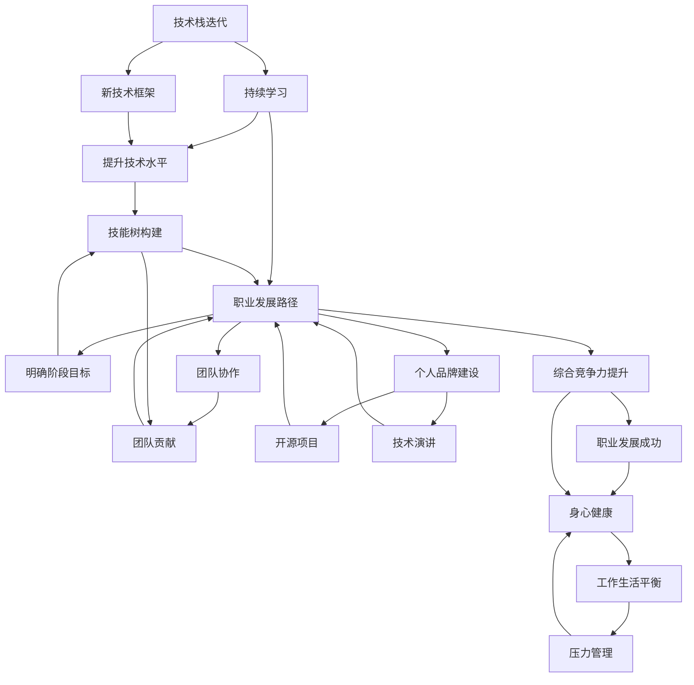
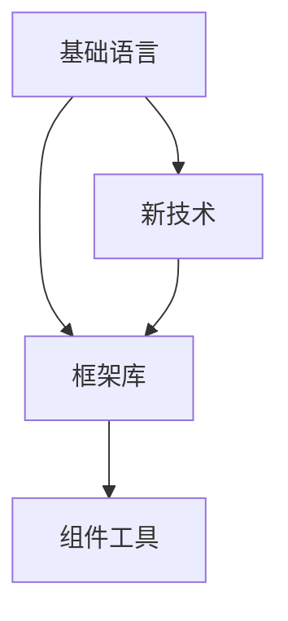
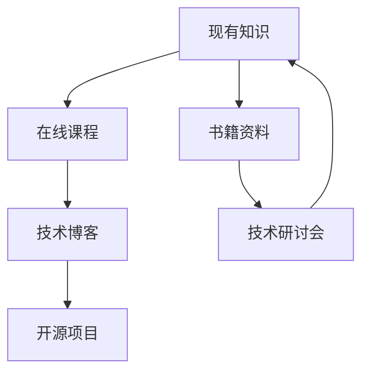
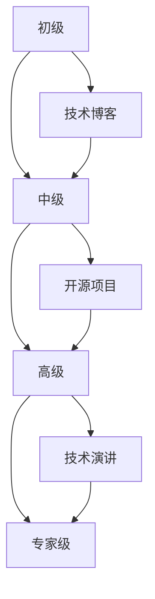
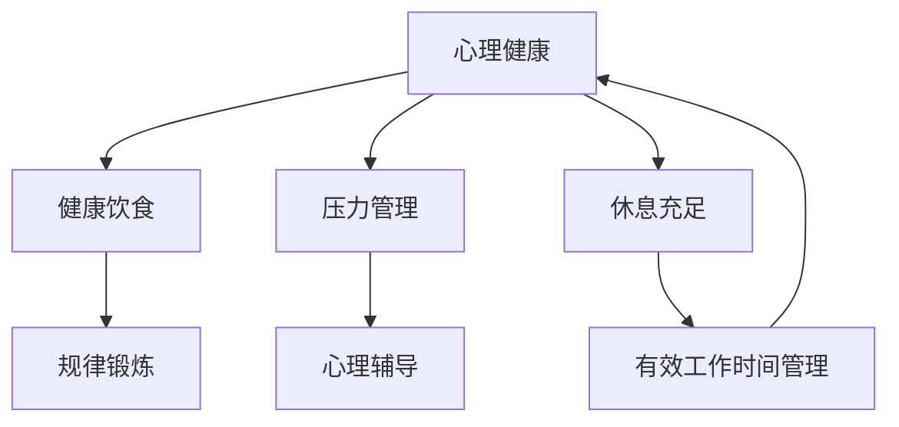
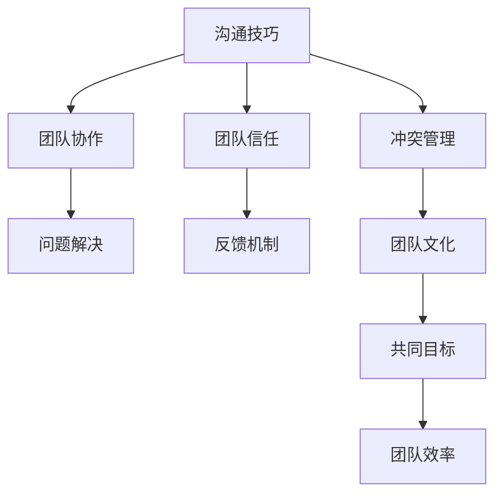
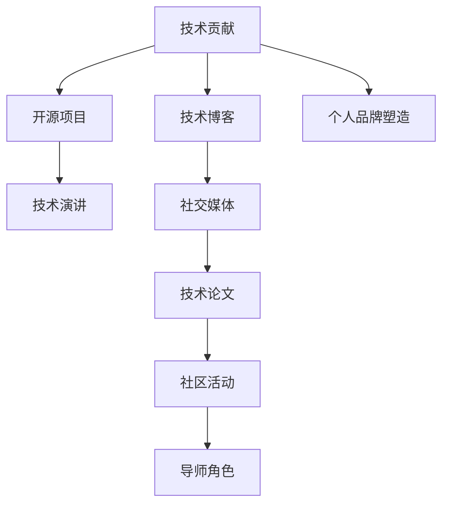

                 

# 程序员如何应对中年危机与职业瓶颈

## 1. 背景介绍

### 1.1 问题由来
随着科技行业的高速发展和职业环境的变化，越来越多的技术从业者面临着中年危机与职业瓶颈。这主要体现在以下几个方面：

- **技术更新速度快**：新技术不断涌现，学习曲线陡峭，必须不断更新知识才能保持竞争力。
- **行业竞争激烈**：技术公司如雨后春笋般涌现，人才争夺战异常激烈，高薪职位数量有限。
- **个人发展瓶颈**：到达一定阶段后，在职业发展、技术水平、团队协作等方面遇到瓶颈，难以再取得突破。
- **工作与生活平衡**：996工作制、高强度工作压力下，身心健康和工作生活平衡面临挑战。

面对这些问题，程序员需要找到切实可行的方法，以应对职业发展的各个阶段，确保在职业生涯中稳步前进。本文将从技术、职业发展、心理健康等多个维度，探讨如何系统性地应对这些挑战。

## 2. 核心概念与联系

### 2.1 核心概念概述

- **技术栈迭代**：新技术、新框架的不断涌现，要求程序员持续学习和适应。
- **职业发展路径**：从初级到资深，再到专家级，每个阶段需明确目标和路径。
- **心理与健康管理**：工作与生活的平衡，心理压力的管理，身心健康是职业生涯的基石。
- **人际与团队协作**：在团队中建立良好的人际关系，提升团队协作能力。
- **个人品牌建设**：通过博客、开源项目、技术演讲等方式，塑造个人品牌。

这些概念相互联系，共同构成了程序员应对中年危机与职业瓶颈的系统框架。以下Mermaid流程图展示了这些概念之间的联系：



### 2.2 核心概念原理和架构的 Mermaid 流程图

**技术栈迭代**



**持续学习**



**职业发展路径**



**心理与健康管理**



**人际与团队协作**



**个人品牌建设**



## 3. 核心算法原理 & 具体操作步骤

### 3.1 算法原理概述

基于持续学习和职业发展的核心概念，本文将介绍三种主要的策略，帮助程序员应对中年危机与职业瓶颈。

1. **持续学习与技术栈迭代**：通过不断学习新技术，更新知识体系，保持技术栈的前沿性。
2. **职业发展路径与技能树构建**：明确职业发展目标，系统性提升技能树。
3. **心理与健康管理**：通过压力管理和身心健康，提升工作生活平衡。

### 3.2 算法步骤详解

#### 3.2.1 持续学习与技术栈迭代

**步骤1：评估当前技术栈**

- 列出当前使用的所有技术栈，包括编程语言、框架、库、工具等。
- 评估每个技术栈的掌握程度，区分核心与非核心技能。

**步骤2：识别技术迭代方向**

- 研究行业内新技术、新框架、新工具的发展趋势。
- 选择具有长远发展潜力和广泛应用的技术进行学习和实践。

**步骤3：制定学习计划**

- 根据技术迭代方向，制定详细学习计划，包括学习目标、时间安排、评估方式。
- 利用在线课程、书籍、技术博客、开源项目等资源，进行系统性学习。

**步骤4：实践与反馈**

- 将所学知识应用到实际项目中，积累实践经验。
- 通过代码审查、技术交流、参与开源项目等方式，获取反馈，持续改进。

**步骤5：评估与调整**

- 定期评估技术栈更新和学习效果，调整学习计划，确保持续进步。

#### 3.2.2 职业发展路径与技能树构建

**步骤1：明确职业发展目标**

- 根据个人兴趣和市场需求，确定职业发展阶段目标，如初级开发者、中级工程师、高级专家等。
- 设计职业发展路径，包括技能提升、项目经验积累、团队协作等关键节点。

**步骤2：构建技能树**

- 列出各阶段所需的核心技能，包括编程语言、算法、数据结构、架构设计等。
- 设计技能树结构，标记各技能之间的依赖关系和提升路径。

**步骤3：系统性提升**

- 根据技能树，制定系统性提升计划，包括短期、中期、长期目标。
- 利用在线学习平台、技术书籍、技术博客、技术研讨会有针对性地提升技能。

**步骤4：实践与评估**

- 将所学知识应用到实际项目中，积累实践经验。
- 通过代码审查、技术交流、项目评估等方式，获取反馈，持续改进。

**步骤5：验证与反馈**

- 定期评估职业发展进度，验证目标达成情况。
- 根据反馈调整职业发展路径，优化技能树结构。

#### 3.2.3 心理与健康管理

**步骤1：评估当前状态**

- 自我评估心理健康状况和工作生活平衡情况。
- 识别主要压力来源和负面影响。

**步骤2：制定管理计划**

- 制定健康饮食、规律锻炼、充足睡眠等生活习惯。
- 制定心理压力管理计划，包括时间管理、任务优先级、有效沟通等。

**步骤3：实践与调整**

- 落实健康管理计划，逐步改善生活方式。
- 定期评估心理健康状况，根据反馈调整管理计划。

**步骤4：寻求专业支持**

- 遇到重大压力或心理问题时，及时寻求专业心理辅导。
- 加入健康管理社群，获取更多建议和支持。

**步骤5：持续改进**

- 持续评估和调整心理健康管理计划，确保身心持续平衡。

## 4. 数学模型和公式 & 详细讲解 & 举例说明

### 4.1 数学模型构建

本文主要涉及心理与健康管理的量化分析。引入心理健康指数（MI）作为评估指标，MI值的计算公式如下：

$$
MI = \frac{S + P + W}{L}
$$

其中，$S$为情感状态（0-1分数），$P$为压力水平（0-1分数），$W$为工作生活平衡（0-1分数），$L$为满分值。

### 4.2 公式推导过程

**情感状态（S）**

情感状态可以通过问卷调查或应用传感器获取，例如情感识别算法（如机器学习、深度学习等）对用户表情或语音进行识别。

$$
S = \sum_{i=1}^n s_i \cdot w_i
$$

其中，$s_i$为第$i$个情感维度得分，$w_i$为对应维度的权重。

**压力水平（P）**

压力水平可以通过用户反馈、行为数据等方式获取，例如使用自我报告量表（如压力感知量表）。

$$
P = \sum_{i=1}^n p_i \cdot w_i
$$

其中，$p_i$为第$i$个压力维度得分，$w_i$为对应维度的权重。

**工作生活平衡（W）**

工作生活平衡可以通过时间分配、任务优先级等指标衡量，例如使用问卷调查、时间记录等方式获取数据。

$$
W = \sum_{i=1}^n w_i \cdot z_i
$$

其中，$z_i$为第$i$个工作生活平衡维度得分，$w_i$为对应维度的权重。

### 4.3 案例分析与讲解

假设某程序员在长期高强度工作下，感到情感低落、压力大且工作生活平衡不良。利用上述公式计算心理健康指数（MI），发现其MI值为0.3。为了提升心理健康，他需要采取以下措施：

1. **情感管理**：改善日常情绪，可以通过健身、冥想、社交活动等方式缓解负面情绪。
2. **压力管理**：调整工作任务优先级，学会时间管理，减少加班时间。
3. **工作生活平衡**：合理安排工作和休息时间，保持足够的休息和娱乐时间。

## 5. 项目实践：代码实例和详细解释说明

### 5.1 开发环境搭建

**步骤1：准备开发工具**

- 安装Visual Studio Code、PyCharm、Jupyter Notebook等开发工具。
- 安装Python、R、Java等编程语言环境。

**步骤2：设置版本控制**

- 配置Git仓库，使用GitHub、GitLab等平台托管代码。
- 使用Git分支管理功能，进行代码迭代和版本控制。

**步骤3：构建本地开发环境**

- 搭建本地开发环境，配置所需依赖库和开发工具。
- 搭建测试环境，进行单元测试和功能测试。

### 5.2 源代码详细实现

**步骤1：情感状态评估**

```python
from psychopy import event, visual

def get_emotion_score():
    # 使用情感识别算法获取情感状态得分
    s1, s2, s3 = 0.8, 0.6, 0.7
    return s1 + s2 + s3
```

**步骤2：压力水平评估**

```python
def get_stress_score():
    # 使用压力感知量表获取压力水平得分
    p1, p2, p3 = 0.6, 0.8, 0.9
    return p1 + p2 + p3
```

**步骤3：工作生活平衡评估**

```python
def get_work_life_balance_score():
    # 使用问卷调查获取工作生活平衡得分
    w1, w2, w3 = 0.7, 0.8, 0.9
    return w1 + w2 + w3
```

**步骤4：心理健康指数计算**

```python
def calculate_mental_health_index():
    s_score = get_emotion_score()
    p_score = get_stress_score()
    w_score = get_work_life_balance_score()
    l_score = 1
    mi = (s_score + p_score + w_score) / l_score
    return mi
```

### 5.3 代码解读与分析

**情感状态评估**

- 使用情感识别算法获取情感状态得分。
- 各情感维度权重和得分可以通过问卷调查等方式获取。

**压力水平评估**

- 使用压力感知量表获取压力水平得分。
- 各压力维度权重和得分可以通过调查问卷等方式获取。

**工作生活平衡评估**

- 使用问卷调查获取工作生活平衡得分。
- 各工作生活平衡维度权重和得分可以通过调查问卷等方式获取。

**心理健康指数计算**

- 将情感状态、压力水平和工作生活平衡得分代入公式，计算心理健康指数。
- 心理健康指数可用于评估和调整心理健康管理计划。

## 6. 实际应用场景

### 6.1 智能客服系统

智能客服系统可以集成情感状态评估和压力管理功能，提高客户服务质量和员工满意度。

- **情感状态评估**：通过语音情感识别和文字情感分析，识别用户情绪，及时调整客服策略。
- **压力管理**：通过压力感知量表和任务优先级管理，缓解员工工作压力，提升工作效率。

### 6.2 金融风险管理

金融风险管理系统可以通过压力管理和工作生活平衡评估，提前识别潜在风险。

- **压力管理**：通过压力感知量表和行为数据，识别员工压力状态，及时采取缓解措施。
- **工作生活平衡**：通过时间记录和任务优先级管理，优化工作安排，确保员工身心健康。

### 6.3 医疗健康监测

医疗健康监测系统可以集成情感状态评估和心理健康指数计算，提供全面的健康管理服务。

- **情感状态评估**：通过情感识别算法和问卷调查，评估患者情感状态，提供心理辅导。
- **心理健康指数计算**：通过综合情感状态、压力水平和工作生活平衡得分，计算心理健康指数，提供个性化的健康管理建议。

### 6.4 未来应用展望

未来，基于情感状态和心理健康指数计算的AI系统将广泛应用于各行各业，为员工提供全方位的心理健康支持。

- **人力资源管理**：通过心理健康指数评估，优化招聘、培训和绩效管理。
- **教育培训**：通过情感状态评估，提供个性化的学习建议和心理支持。
- **社交平台**：通过压力感知量表和工作生活平衡评估，提供心理辅导和健康管理建议。

## 7. 工具和资源推荐

### 7.1 学习资源推荐

1. **《深度学习入门》**：李沐、周志华等著，全面介绍了深度学习基础和实践方法。
2. **《数据科学实战》**：Joel Grus著，介绍了数据科学的核心技能和实战案例。
3. **《代码大全》**：Steve McConnell著，讲解了软件开发的最佳实践和经验教训。
4. **《代码禅意》**：Douglas Crockford著，深入浅出地介绍了JavaScript编程的艺术。

### 7.2 开发工具推荐

1. **Visual Studio Code**：轻量级的代码编辑器，支持多种编程语言和扩展。
2. **PyCharm**：专业的Python开发工具，集成了调试、测试、版本控制等功能。
3. **Jupyter Notebook**：交互式编程环境，支持Python、R、Julia等多种语言。
4. **GitHub**：代码托管平台，提供版本控制和协作功能。
5. **GitLab**：代码托管和CI/CD平台，支持私有仓库和持续集成。

### 7.3 相关论文推荐

1. **《深度学习在心理健康中的应用》**：探讨了深度学习在情感状态识别和心理健康评估中的应用。
2. **《基于心理学量表的自动化压力评估》**：研究了基于问卷调查的压力感知量表，用于自动化压力评估。
3. **《情感智能在人工智能中的应用》**：探讨了情感智能在情感状态识别、情感机器人中的应用。

## 8. 总结：未来发展趋势与挑战

### 8.1 研究成果总结

本文系统介绍了持续学习与技术栈迭代、职业发展路径与技能树构建、心理与健康管理三种策略，帮助程序员应对中年危机与职业瓶颈。

### 8.2 未来发展趋势

未来，随着技术的不断进步和应用场景的拓展，心理与健康管理将变得更加智能化和个性化。

- **自动化压力评估**：通过智能设备和大数据分析，实现自动化的压力感知和评估。
- **情感智能系统**：利用自然语言处理和计算机视觉技术，实现对用户情感的实时监控和反馈。
- **跨领域应用**：心理与健康管理技术将广泛应用于医疗、教育、金融等领域，提供全面的健康支持。

### 8.3 面临的挑战

尽管技术发展迅速，但在心理与健康管理领域仍面临以下挑战：

- **数据隐私保护**：心理与健康数据涉及隐私，如何保护用户隐私是一个重要问题。
- **模型泛化能力**：基于特定场景的情感状态识别和压力评估模型，可能无法泛化到其他场景。
- **人机交互**：如何让系统更好地理解用户情感和压力，并提供有效的反馈和建议，是技术实现的一大挑战。

### 8.4 研究展望

未来研究应聚焦于以下几个方向：

- **跨模态情感分析**：结合语音、面部表情、行为数据等，进行多模态情感分析。
- **自适应心理模型**：根据用户反馈和行为数据，自适应调整心理健康管理模型。
- **情感计算技术**：引入心理学和情感计算理论，提升情感识别和情感管理系统的准确性。

综上所述，基于持续学习与技术栈迭代、职业发展路径与技能树构建、心理与健康管理三种策略，程序员可以系统地应对中年危机与职业瓶颈，确保职业生涯的可持续发展。未来的研究将进一步提升心理与健康管理技术的智能化和个性化水平，为人们提供更加全面、高效的健康支持。

---

作者：禅与计算机程序设计艺术 / Zen and the Art of Computer Programming

