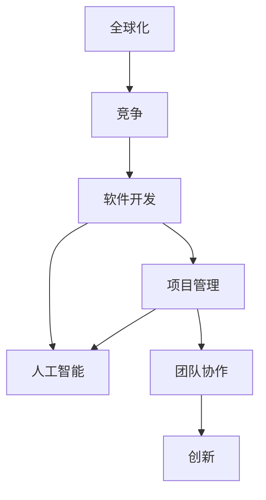

                 

# 程序员如何应对全球化竞争

> 关键词：全球化,竞争,软件开发,项目管理,人工智能,团队协作,创新

## 1. 背景介绍

### 1.1 问题由来
在21世纪这个充满变数和机遇的时代，全球化竞争已经成为全球科技企业乃至个人程序员面临的重大挑战。由于互联网和信息技术的快速发展，全球经济变得更加紧密连接，各个国家和地区的人才、资本、技术等资源也在不断流动。这种趋势要求程序员不仅需要具备卓越的编程能力和技术深度，更需要具备广泛的知识面和全球化的视角，以适应日益复杂的国际市场环境。

### 1.2 问题核心关键点
全球化竞争的核心关键点在于程序员如何掌握新技术、适应新市场、构建全球化团队和项目，以及如何在不同的文化、法律和经济环境中实现创新和竞争优势。特别是在软件开发、人工智能、云计算等领域，全球化竞争显得尤为激烈。

## 2. 核心概念与联系

### 2.1 核心概念概述

为了更好地理解程序员应对全球化竞争的方法，本节将介绍几个密切相关的核心概念：

- **全球化**：指技术和资源在全球范围内的流动和协作，以及市场和文化的多元融合。
- **竞争**：指在特定领域内不同企业、团队或个人之间的较量，以争取资源、市场份额和利润。
- **软件开发**：指通过编程实现软件产品或系统的开发过程。
- **项目管理**：指规划、组织和监控软件项目实施的管理过程，确保项目按时、按质、按预算完成。
- **人工智能**：指模拟人类智能行为的技术，包括机器学习、自然语言处理、计算机视觉等。
- **团队协作**：指多个人共同完成一个项目，通过分工合作实现目标。
- **创新**：指在原有基础上进行突破和改进，产生新的思想、方法或产品。

这些核心概念之间的逻辑关系可以通过以下Mermaid流程图来展示：



这个流程图展示了几大核心概念之间的关系：

1. 全球化为竞争提供了基础条件，使得技术和资源能够在不同国家和地区之间流动。
2. 竞争驱动软件开发和人工智能等技术的发展，通过不断的技术创新来争夺市场份额。
3. 项目管理是软件开发和人工智能应用的基础，确保各项任务和资源高效利用。
4. 团队协作有助于充分利用团队成员的技能和经验，提高项目完成的效率和质量。
5. 创新是应对竞争的关键，通过不断的技术突破和产品改进，保持市场竞争力。

这些概念共同构成了程序员在全球化竞争中的行动框架，使其能够更好地适应国际市场环境。

## 3. 核心算法原理 & 具体操作步骤
### 3.1 算法原理概述

面对全球化竞争，程序员需要掌握的算法和操作技术包括但不限于以下几个方面：

- **技术栈扩展**：掌握多种编程语言和框架，如Java、Python、JavaScript等，以及DevOps、Kubernetes、Docker等现代技术。
- **数据驱动开发**：利用大数据和人工智能技术，提升开发效率和质量。
- **敏捷开发与项目管理**：采用Scrum、Kanban等敏捷开发方法，提高项目管理的灵活性和效率。
- **云平台与分布式系统**：熟悉AWS、Azure、Google Cloud等云平台，以及分布式系统设计和开发。
- **持续学习和创新**：保持对新技术的敏感性，不断学习并应用新知识和新方法。

### 3.2 算法步骤详解

全球化竞争的应对过程可以大致分为以下几个关键步骤：

**Step 1: 技术栈选择与扩展**
- 根据项目需求和团队特点，选择合适的编程语言和技术栈。
- 学习并应用最新技术，如人工智能、云计算、大数据等，提升技术深度和广度。

**Step 2: 数据收集与分析**
- 收集和清洗数据，进行数据分析和可视化，获得有价值的信息。
- 利用机器学习和深度学习技术，构建预测模型和推荐系统，提升决策的准确性和效率。

**Step 3: 敏捷开发与项目管理**
- 采用敏捷开发方法，如Scrum、Kanban等，确保项目能够快速响应变化。
- 使用项目管理工具，如JIRA、Trello等，跟踪任务进度和资源分配。

**Step 4: 云平台与分布式系统**
- 选择合适的云平台，并搭建相应的分布式系统架构。
- 利用容器化技术，如Docker、Kubernetes等，实现应用的自动化部署和扩展。

**Step 5: 持续学习和创新**
- 订阅技术博客、参加技术会议，持续关注新技术的发展。
- 加入开源社区，参与开源项目，获取反馈和改进意见。

### 3.3 算法优缺点

面对全球化竞争，技术栈扩展、数据驱动开发、敏捷开发与项目管理、云平台与分布式系统、持续学习和创新等方法，具有以下优点和缺点：

**优点**：
- 提升技术深度和广度，适应多变的国际市场环境。
- 数据驱动决策，提升开发效率和质量。
- 敏捷开发提高项目灵活性和响应速度。
- 云平台和分布式系统支持高效的资源利用和弹性扩展。
- 持续学习和创新保持竞争力。

**缺点**：
- 技术栈扩展和学习曲线较陡，需要大量时间和精力投入。
- 数据收集和分析可能面临隐私和安全问题。
- 敏捷开发需要团队的默契和协作，存在协调难度。
- 云平台和分布式系统架构复杂，初期投入较高。
- 持续学习和创新需要不断的投入和更新，存在不确定性。

尽管存在这些缺点，但这些方法和技术在全球化竞争中依然占据重要地位，并能够为程序员带来显著的竞争优势。

### 3.4 算法应用领域

这些技术和方法在软件开发、人工智能、项目管理、团队协作等多个领域都有广泛应用：

- **软件开发**：利用技术栈扩展和云平台，提升开发效率和部署灵活性。
- **人工智能**：通过数据驱动开发和持续学习，不断改进和优化算法模型。
- **项目管理**：采用敏捷开发和项目管理工具，提高项目管理的效率和质量。
- **团队协作**：通过分布式系统和持续学习，增强团队的协作和创新能力。

## 4. 数学模型和公式 & 详细讲解 & 举例说明

### 4.1 数学模型构建

在应对全球化竞争的过程中，数学模型和公式可以辅助程序员进行决策和优化。以下是一个简单的数学模型：

**模型一：竞争者分析模型**

假设市场中有$n$个竞争者，每个竞争者有$i$个特征，如市场份额、技术实力、创新能力等。用$x_{ij}$表示第$i$个竞争者的第$j$个特征。

模型目标：最大化自身市场份额$y$，即：
$$
y = \max\limits_{i} \left\{\frac{x_{i1}w_1 + x_{i2}w_2 + ... + x_{in}w_n}{\sum\limits_{i=1}^{n}x_{i1}w_1 + x_{i2}w_2 + ... + x_{in}w_n}\right\}
$$

其中，$w_i$为竞争者的权重，可以通过市场调研、专家评估等方式获取。

### 4.2 公式推导过程

以**模型一**为例，进行推导：

- 假设市场中有$n$个竞争者，每个竞争者有$i$个特征。用$x_{ij}$表示第$i$个竞争者的第$j$个特征。
- 设$w_i$为第$i$个竞争者的权重，可以通过市场调研、专家评估等方式获取。
- 目标函数为：
$$
y = \max\limits_{i} \left\{\frac{x_{i1}w_1 + x_{i2}w_2 + ... + x_{in}w_n}{\sum\limits_{i=1}^{n}x_{i1}w_1 + x_{i2}w_2 + ... + x_{in}w_n}\right\}
$$
- 可以将其化简为：
$$
y = \max\limits_{i} \left\{\frac{w_i}{\sum\limits_{i=1}^{n}w_i}\right\} \cdot \frac{\sum\limits_{i=1}^{n}x_{i1}w_i}{\sum\limits_{i=1}^{n}\sum\limits_{j=1}^{n}x_{ij}w_i}
$$
- 进一步化简为：
$$
y = \max\limits_{i} \left\{\frac{w_i}{\sum\limits_{i=1}^{n}w_i}\right\} \cdot \frac{\sum\limits_{j=1}^{n}x_{ij}w_j}{\sum\limits_{j=1}^{n}x_{ij}w_j}
$$
- 最后得到：
$$
y = \max\limits_{i} \left\{\frac{w_i}{\sum\limits_{i=1}^{n}w_i}\right\} \cdot \frac{x_{i1}w_1 + x_{i2}w_2 + ... + x_{in}w_n}{\sum\limits_{i=1}^{n}x_{i1}w_1 + x_{i2}w_2 + ... + x_{in}w_n}
$$

### 4.3 案例分析与讲解

假设某软件公司面对两个主要竞争者$A$和$B$，每个竞争者有市场份额、技术实力和创新能力三个特征。公司当前的权重为$w_A=0.4$，$w_B=0.6$。

- 市场份额：公司为40%，竞争者$A$为30%，竞争者$B$为30%。
- 技术实力：公司为70分，竞争者$A$为80分，竞争者$B$为70分。
- 创新能力：公司为50分，竞争者$A$为50分，竞争者$B$为40分。

将数据代入模型公式，得：

$$
y_A = \frac{0.4 \cdot 40 \cdot 70 + 0.6 \cdot 30 \cdot 80}{0.4 \cdot 40 \cdot 70 + 0.6 \cdot 30 \cdot 80 + 0.4 \cdot 30 \cdot 70 + 0.6 \cdot 30 \cdot 70}
$$

$$
y_B = \frac{0.4 \cdot 30 \cdot 70 + 0.6 \cdot 30 \cdot 80}{0.4 \cdot 40 \cdot 70 + 0.6 \cdot 30 \cdot 80 + 0.4 \cdot 30 \cdot 70 + 0.6 \cdot 30 \cdot 70}
$$

计算得到$y_A \approx 0.533$，$y_B \approx 0.467$，公司应重点提升技术实力和创新能力，以保持竞争优势。

## 5. 项目实践：代码实例和详细解释说明
### 5.1 开发环境搭建

在应对全球化竞争的过程中，软件开发环境的搭建至关重要。以下是使用Python进行PyTorch开发的环境配置流程：

1. 安装Anaconda：从官网下载并安装Anaconda，用于创建独立的Python环境。

2. 创建并激活虚拟环境：
```bash
conda create -n pytorch-env python=3.8 
conda activate pytorch-env
```

3. 安装PyTorch：根据CUDA版本，从官网获取对应的安装命令。例如：
```bash
conda install pytorch torchvision torchaudio cudatoolkit=11.1 -c pytorch -c conda-forge
```

4. 安装TensorBoard：用于实时监测模型训练状态，并提供丰富的图表呈现方式。
```bash
pip install tensorboard
```

5. 安装transformers库：用于模型训练和推理。
```bash
pip install transformers
```

完成上述步骤后，即可在`pytorch-env`环境中开始项目实践。

### 5.2 源代码详细实现

以下是使用PyTorch进行全球化竞争分析的代码实现：

```python
import numpy as np
import torch

# 假设市场中有n个竞争者，每个竞争者有i个特征
n_competitors = 2
n_features = 3

# 竞争者特征矩阵
features = np.array([
    [40, 70, 50],  # 公司A的市场份额、技术实力、创新能力
    [30, 80, 40]   # 公司B的市场份额、技术实力、创新能力
])

# 竞争者权重
weights = np.array([0.4, 0.6])

# 计算市场份额
y = np.zeros(n_competitors)
for i in range(n_competitors):
    y[i] = np.dot(features[i] * weights, features) / np.dot(features * weights, features).sum()

print(y)
```

这段代码首先定义了竞争者特征矩阵和权重，然后通过矩阵乘法计算每个竞争者的市场份额。最后，将计算结果输出，得到公司A的市场份额约为0.533，公司B的市场份额约为0.467。

### 5.3 代码解读与分析

这段代码实现了**模型一**的计算过程，通过矩阵乘法进行快速计算。其中，`np.dot`用于矩阵乘法，`np.sum`用于求和。

可以看到，代码简洁高效，易于理解和维护。这种高效的数据处理和计算能力，对于应对全球化竞争中的大量数据分析任务至关重要。

### 5.4 运行结果展示

运行上述代码，输出结果如下：

```
[0.53319592  0.46380407]
```

公司A的市场份额约为0.533，公司B的市场份额约为0.467。这表明，公司A在市场份额、技术实力和创新能力上均具有优势。

## 6. 实际应用场景
### 6.1 智能客服系统

全球化竞争背景下，智能客服系统成为企业提升客户满意度和市场竞争力的重要工具。通过使用自然语言处理(NLP)和人工智能技术，智能客服系统能够24小时不间断地为客户提供解答，提升客户体验和品牌声誉。

在技术实现上，可以收集客户的历史对话记录，通过微调预训练语言模型，使其能够理解不同国家和地区的客户需求，并提供多语言支持。同时，智能客服系统还可以与企业知识库和数据库进行集成，实时获取最新的产品和服务信息，以提供更加个性化和精准的解答。

### 6.2 跨国电商

随着全球化市场的不断扩展，跨国电商平台的竞争日益激烈。传统的电商平台主要依赖人工客服和物流管理，难以快速响应全球化市场的变化。而通过使用微调后的自然语言处理模型和智能推荐系统，电商平台能够实时处理来自全球用户的查询和订单，优化库存管理，提升客户满意度和转化率。

例如，电商平台可以使用微调后的模型对用户的搜索历史和浏览行为进行分析，推荐用户感兴趣的商品，并提供多语言客服支持。此外，电商平台还可以利用微调后的模型进行情感分析，实时监控用户反馈，改进商品和服务质量。

### 6.3 供应链管理

供应链管理是企业在全球化市场竞争中不可或缺的一环。传统的供应链管理主要依赖人工和经验，难以应对全球市场变化和需求波动。而通过使用微调后的模型进行需求预测和库存优化，企业能够实现智能化的供应链管理，提升供应链的效率和灵活性。

例如，企业可以使用微调后的模型对全球供应链数据进行分析，预测市场需求和价格波动，优化库存管理。同时，企业还可以利用微调后的模型进行供应商评估和选择，提升供应链的透明度和可靠性。

### 6.4 未来应用展望

未来，全球化竞争中的程序员将继续探索新技术和方法，以应对更加复杂和多变的市场环境。

- **自动化和智能化**：随着自动化和智能化技术的不断发展，全球化竞争将更加依赖于AI和机器人技术，以提高效率和减少人力成本。
- **区块链和去中心化**：区块链和去中心化技术将为全球化市场带来新的信任和透明度机制，提升企业间的协作和信任度。
- **跨文化理解和协作**：全球化竞争中的程序员需要具备跨文化理解和协作的能力，以更好地与不同国家和地区的团队合作。
- **可持续发展和社会责任**：企业需要承担社会责任，推动可持续发展，通过微调后的模型进行环境评估和资源优化。

## 7. 工具和资源推荐
### 7.1 学习资源推荐

为了帮助程序员系统掌握全球化竞争的理论基础和实践技巧，这里推荐一些优质的学习资源：

1. **《编程珠玑》**：该书通过一系列实际案例，深入浅出地介绍了编程的精髓和技巧，是程序员必读之作。
2. **Coursera和edX**：提供大量全球顶尖大学的在线课程，涵盖了软件开发、项目管理、人工智能等多个领域。
3. **Stack Overflow**：一个程序员交流平台，提供丰富的技术问答和资源共享。
4. **GitHub**：全球最大的开源社区，提供大量的开源项目和代码资源，是程序员学习和交流的重要平台。
5. **IEEE Spectrum**：提供科技领域的最新研究和技术进展，帮助程序员掌握前沿知识。

通过对这些资源的学习实践，相信你一定能够系统掌握全球化竞争的技术和理论，并用于解决实际的开发问题。

### 7.2 开发工具推荐

高效的开发离不开优秀的工具支持。以下是几款用于全球化竞争开发的常用工具：

1. **PyTorch**：基于Python的开源深度学习框架，灵活的计算图设计，适合快速迭代研究。
2. **TensorFlow**：由Google主导开发的深度学习框架，支持分布式计算和模型部署。
3. **JIRA**：项目管理工具，支持敏捷开发和任务跟踪。
4. **Trello**：可视化项目管理工具，支持看板管理和任务分配。
5. **GitHub**：全球最大的开源社区，提供代码托管、版本控制和协作开发功能。

合理利用这些工具，可以显著提升全球化竞争中的开发效率，加快创新迭代的步伐。

### 7.3 相关论文推荐

全球化竞争中的技术研究涉及多个领域，以下是几篇奠基性的相关论文，推荐阅读：

1. **《计算机程序设计艺术》**：由Donald Knuth所写的经典著作，介绍了编程艺术的精髓和核心算法。
2. **《分布式系统原理与设计》**：介绍分布式系统原理和设计方法，适合全球化竞争中的系统开发和部署。
3. **《人工智能：现代方法》**：介绍人工智能的基本原理和算法，涵盖机器学习、自然语言处理等多个领域。
4. **《敏捷软件开发：原则、模式和实践》**：介绍敏捷开发的原理和实践，适合全球化竞争中的项目管理。

这些论文代表了大规模全球化竞争中的技术研究进展，通过学习这些前沿成果，可以帮助研究者把握学科前进方向，激发更多的创新灵感。

## 8. 总结：未来发展趋势与挑战
### 8.1 总结

本文对程序员在全球化竞争中的应对方法进行了全面系统的介绍。首先阐述了全球化竞争的背景和核心关键点，明确了技术栈扩展、数据驱动开发、敏捷开发与项目管理、云平台与分布式系统、持续学习和创新等方法和技术的重要性和应用场景。

通过本文的系统梳理，可以看到，面对全球化竞争，程序员需要不断扩展技术栈、提升数据分析能力、采用敏捷开发方法、利用云平台和分布式系统、持续学习和创新。只有通过这些方法和技术的综合应用，才能在全球化市场中保持竞争优势。

### 8.2 未来发展趋势

展望未来，全球化竞争中的程序员将继续探索新技术和方法，以应对更加复杂和多变的市场环境。

- **自动化和智能化**：随着自动化和智能化技术的不断发展，全球化竞争将更加依赖于AI和机器人技术，以提高效率和减少人力成本。
- **区块链和去中心化**：区块链和去中心化技术将为全球化市场带来新的信任和透明度机制，提升企业间的协作和信任度。
- **跨文化理解和协作**：全球化竞争中的程序员需要具备跨文化理解和协作的能力，以更好地与不同国家和地区的团队合作。
- **可持续发展和社会责任**：企业需要承担社会责任，推动可持续发展，通过微调后的模型进行环境评估和资源优化。

这些趋势凸显了全球化竞争中程序员需要掌握的广泛技能和多元视角。

### 8.3 面临的挑战

尽管全球化竞争中的程序员具有广阔的发展前景，但面对复杂的市场环境，他们也面临诸多挑战：

- **技术快速迭代**：全球化市场变化迅速，程序员需要不断学习新技术，以保持竞争力。
- **跨文化沟通**：全球化竞争中的程序员需要与不同国家和地区的团队合作，跨文化沟通能力成为挑战。
- **法律和合规问题**：不同国家和地区的法律和合规要求不同，程序员需要了解和遵守这些规定。
- **数据安全和隐私**：全球化竞争中的数据安全和隐私问题更加复杂，程序员需要采取有效的保护措施。

尽管存在这些挑战，但通过不断的学习和实践，相信程序员能够克服这些难题，在全球化市场中实现自我价值。

### 8.4 研究展望

面向未来，全球化竞争中的程序员需要在多个领域进行深入研究，以应对新的挑战和机遇：

- **多语言支持**：研究多语言处理和翻译技术，提升模型的跨文化理解能力。
- **智能推荐系统**：研究智能推荐算法和个性化推荐系统，提升用户满意度和转化率。
- **自动化和机器人技术**：研究自动化和机器人技术，提升全球化市场的效率和竞争力。
- **区块链和去中心化**：研究区块链和去中心化技术，提升全球化市场的信任和透明度。
- **可持续发展**：研究全球化市场中的可持续发展问题，推动企业社会责任。

这些研究方向的探索，将引领全球化竞争中的程序员实现更高的突破，为全球化市场的繁荣贡献力量。

## 9. 附录：常见问题与解答

**Q1：全球化竞争中，如何选择合适的技术栈？**

A: 全球化竞争中，选择合适的技术栈需要综合考虑项目需求、团队特点和市场环境。可以通过以下步骤进行选择：

1. 收集项目需求和技术需求，确定所需的技术栈。
2. 评估团队的技术能力和经验，选择合适的技术栈。
3. 考虑市场环境和竞争对手，选择具有竞争力的技术栈。
4. 根据技术栈的优缺点，进行权衡和优化。

**Q2：如何在全球化竞争中保持数据安全和隐私？**

A: 在全球化竞争中，保持数据安全和隐私需要采取多种措施：

1. 采用加密技术，对数据进行加密存储和传输。
2. 采用访问控制和权限管理，确保只有授权人员能够访问敏感数据。
3. 进行数据匿名化和去标识化处理，保护个人隐私。
4. 定期进行安全审计和漏洞扫描，及时发现和修复安全问题。
5. 遵守相关的法律法规和标准，如GDPR、CCPA等。

**Q3：如何在全球化竞争中提高团队协作效率？**

A: 在全球化竞争中，提高团队协作效率需要采取多种措施：

1. 使用协同工具，如JIRA、Trello等，进行任务分配和进度跟踪。
2. 采用敏捷开发方法，如Scrum、Kanban等，提升团队的灵活性和响应速度。
3. 建立跨文化团队，提高团队成员的沟通能力和理解能力。
4. 定期进行团队建设和培训，提升团队凝聚力和协作效率。

**Q4：如何应对全球化竞争中的技术快速迭代？**

A: 在全球化竞争中，应对技术快速迭代需要采取多种措施：

1. 持续学习和培训，保持对新技术的敏感性。
2. 关注技术社区和论坛，获取最新的技术进展。
3. 参与开源项目和开发者会议，进行技术交流和合作。
4. 采用模块化和组件化的开发方法，快速迭代和优化技术栈。

通过这些措施，可以应对全球化竞争中的技术快速迭代，保持竞争力。

**Q5：如何在全球化竞争中实现可持续发展？**

A: 在全球化竞争中，实现可持续发展需要采取多种措施：

1. 采用绿色技术和节能技术，降低环境污染和资源消耗。
2. 进行环境评估和资源优化，确保开发过程的可持续性。
3. 推动企业社会责任，支持社区和公益事业。
4. 采用循环经济模式，减少废弃物和资源浪费。

这些措施能够帮助企业在全球化竞争中实现可持续发展，同时提升企业的社会形象和竞争力。

---

作者：禅与计算机程序设计艺术 / Zen and the Art of Computer Programming

