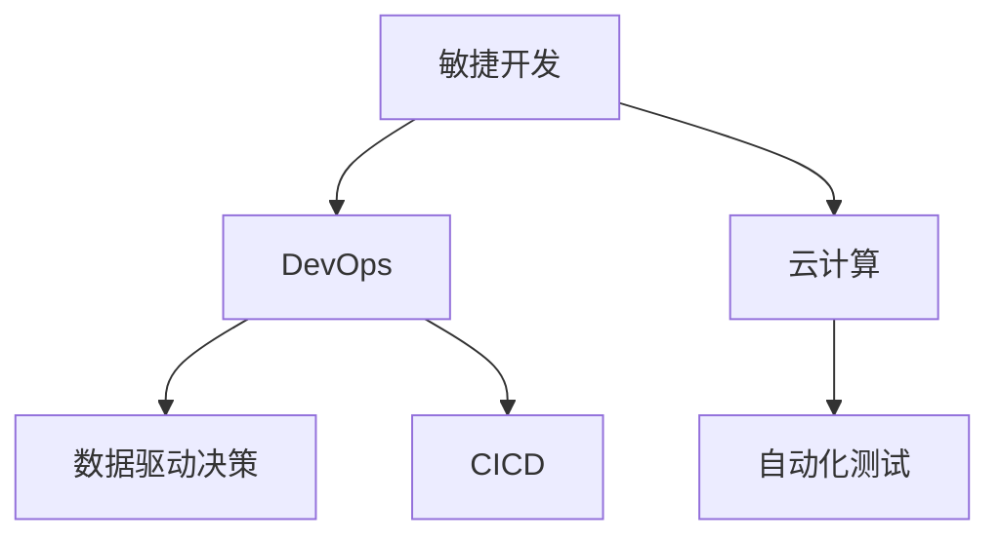

                 

# 程序员如何应对全球经济波动

在面对全球经济波动时，程序员和技术团队必须采取适应性强的策略，确保项目进展和业务稳定。本文将系统介绍如何运用技术手段，在经济动荡期间保持团队的灵活性和持续性。

## 1. 背景介绍

### 1.1 问题由来
近年来，全球经济波动不断加剧，包括供应链中断、通货膨胀、新冠疫情等事件都给企业带来了巨大的挑战。这些经济波动不仅影响了企业的日常运营，也对软件开发和IT项目产生了重大影响。传统基于预算和周期的项目管理方法在动态变化的市场环境中显得格格不入。程序员和IT团队亟需寻找更灵活、更具适应性的项目管理策略和技术手段。

### 1.2 问题核心关键点
本文将重点探讨以下几个关键点：
- 如何利用敏捷开发方法应对快速变化的市场需求。
- 如何在不确定的经济环境中，确保项目的灵活性和持续性。
- 如何通过技术手段优化供应链管理，减少经济波动的影响。
- 如何利用云计算和大数据技术，优化资源配置和成本控制。

## 2. 核心概念与联系

### 2.1 核心概念概述

为更好地理解如何应对全球经济波动，本节将介绍几个密切相关的核心概念：

- 敏捷开发(Agile Development)：一种强调快速响应变化、注重团队协作和客户反馈的开发方法，旨在通过快速迭代和持续交付，适应快速变化的市场需求。
- DevOps：一种结合了软件开发(Dev)和信息技术运维(Ops)的实践，旨在通过自动化和持续集成，提升软件交付效率和稳定性。
- 云计算(Cloud Computing)：通过将计算资源和服务部署在互联网上，按需提供计算和存储资源的模型，具有弹性伸缩和成本优化的优势。
- 数据驱动决策(Data-Driven Decision Making)：利用大数据和分析技术，基于实际数据进行决策，以提高决策的准确性和科学性。
- 自动化测试(Automated Testing)：通过编写自动化测试脚本，在代码变更前后对软件进行测试，确保软件质量和稳定性。
- 持续集成和持续部署(CI/CD)：通过自动化构建、测试和部署流程，确保代码变更能够快速、可靠地集成到生产环境。

这些核心概念之间的逻辑关系可以通过以下Mermaid流程图来展示：



这个流程图展示了几大核心概念及其之间的关系：

1. 敏捷开发强调快速响应变化，DevOps和CI/CD通过自动化和持续集成进一步提升效率。
2. 云计算提供弹性资源和成本优化的能力，数据驱动决策基于实时数据优化策略。
3. 自动化测试保证代码质量，DevOps进一步提升部署效率和稳定性。

这些概念共同构成了应对经济波动的技术框架，使程序员能够更好地应对市场变化，保障项目稳定运行。

## 3. 核心算法原理 & 具体操作步骤
### 3.1 算法原理概述

在应对全球经济波动时，核心算法和具体操作步骤主要包括以下几个方面：

- **敏捷开发**：采用迭代式开发方法，确保快速响应市场变化，灵活调整项目需求和资源配置。
- **DevOps实践**：通过持续集成和持续部署，确保代码变更能够快速、可靠地集成到生产环境。
- **云计算**：利用云计算弹性资源和自动扩展能力，适应不同业务场景的资源需求。
- **数据驱动决策**：基于实时数据进行决策，及时调整策略以应对经济波动。
- **自动化测试**：通过自动化测试保证代码质量和系统稳定性，提高交付效率。

### 3.2 算法步骤详解

#### 3.2.1 敏捷开发

1. **需求管理**：与客户和利益相关者紧密协作，实时收集和更新需求。
2. **迭代规划**：将需求分解为小周期，每个迭代周期持续交付可用的功能模块。
3. **团队协作**：利用Scrum或Kanban等敏捷框架，促进团队高效协作和沟通。
4. **持续反馈**：通过定期回顾和迭代，不断优化流程和产品特性。

#### 3.2.2 DevOps实践

1. **持续集成**：通过CI系统自动化构建和测试代码变更，确保代码质量。
2. **持续部署**：通过CD系统自动化将代码部署到生产环境，提高交付效率。
3. **自动化监控**：实时监控系统性能和稳定性，及时发现和解决问题。
4. **日志和追踪**：记录每个阶段的日志和数据，便于分析和改进。

#### 3.2.3 云计算

1. **资源管理**：通过云计算按需分配资源，确保在业务高峰时仍能保持高性能。
2. **弹性伸缩**：根据业务需求自动调整资源规模，优化成本。
3. **跨地域部署**：利用多地域的云资源，提高系统的容错能力和可用性。

#### 3.2.4 数据驱动决策

1. **数据采集**：利用日志、监控数据等采集实时数据。
2. **数据分析**：通过统计分析、机器学习等技术，提取数据中的关键信息和趋势。
3. **决策支持**：基于分析结果，制定和调整业务策略和操作流程。

#### 3.2.5 自动化测试

1. **测试自动化**：编写自动化测试脚本，覆盖关键功能和边缘案例。
2. **持续测试**：在每次代码变更后，立即进行自动化测试，确保代码质量和稳定性。
3. **测试报告**：生成详细的测试报告，及时发现和修复问题。

### 3.3 算法优缺点

#### 3.3.1 敏捷开发的优点

- 快速响应变化：通过迭代式开发，快速适应市场和需求的变化。
- 提高团队协作：敏捷开发强调团队协作和沟通，提升团队凝聚力和工作效率。
- 持续交付价值：每个迭代周期持续交付可用的功能模块，提升客户满意度。

#### 3.3.2 敏捷开发的缺点

- 管理复杂：敏捷开发对团队和管理层的要求较高，需要具备较强的组织和协调能力。
- 文档规范：敏捷开发强调迭代交付，文档规范相对松散，可能影响长期项目的管理。
- 资源投入：敏捷开发需要较多的管理投入和沟通成本，短期内可能难以见效。

#### 3.3.3 DevOps的优点

- 提升交付效率：通过自动化和持续集成，显著缩短软件交付周期。
- 提高系统稳定性：通过持续监控和自动化部署，减少人为错误，提升系统稳定性。
- 降低开发成本：自动化流程减少了大量重复性工作，降低开发成本。

#### 3.3.4 DevOps的缺点

- 技术门槛高：DevOps要求较高的技术水平，需要掌握多种工具和平台。
- 复杂性高：自动化流程的复杂性可能带来一定的维护和管理负担。
- 依赖协作：DevOps依赖团队协作和沟通，需要团队成员具备较强的协作能力。

#### 3.3.5 云计算的优点

- 弹性资源：按需分配资源，灵活应对业务需求。
- 成本优化：通过弹性伸缩和按需付费，降低成本。
- 高可用性：多地域部署提高系统的容错能力和可用性。

#### 3.3.6 云计算的缺点

- 安全性：云平台的安全性依赖于云提供商，需要加强管理和监督。
- 依赖网络：云资源依赖网络，网络波动可能影响业务。
- 复杂性：云平台的复杂性可能带来一定的管理负担。

#### 3.3.7 数据驱动决策的优点

- 决策科学：基于实时数据进行决策，提升决策的准确性和科学性。
- 响应变化：实时数据分析使团队能够迅速响应市场变化。
- 优化资源：数据驱动的决策优化资源配置，提高效率。

#### 3.3.8 数据驱动决策的缺点

- 数据质量：数据质量直接影响决策结果，需要严格的数据管理和清洗。
- 技术门槛：数据分析和机器学习技术复杂，需要较高的技术水平。
- 成本投入：数据采集和分析需要较高的投入，短期内可能难以见效。

#### 3.3.9 自动化测试的优点

- 提高质量：通过自动化测试保证代码质量和系统稳定性。
- 提升效率：自动化测试减少了大量重复性工作，提升交付效率。
- 持续监控：自动化测试和持续集成能够实时监控系统状态。

#### 3.3.10 自动化测试的缺点

- 技术门槛：自动化测试需要较高的技术水平，需要编写测试脚本和配置环境。
- 复杂性高：自动化测试流程的复杂性可能带来一定的维护和管理负担。
- 依赖协作：自动化测试需要团队协作和沟通，需要团队成员具备较强的协作能力。

### 3.4 算法应用领域

基于敏捷开发、DevOps、云计算、数据驱动决策和自动化测试的技术手段，已广泛应用于各种业务场景，例如：

- **互联网应用**：电商、社交、游戏等互联网企业，通过敏捷开发和DevOps提升交付效率和系统稳定性。
- **金融科技**：银行、保险、证券等金融机构，利用云计算优化资源配置和成本控制，利用数据驱动决策应对市场波动。
- **医疗健康**：医院、药店、健康管理等医疗企业，通过云计算和自动化测试提升医疗系统的可靠性和稳定性。
- **制造业**：制造业企业通过DevOps和云计算优化生产流程，提高生产效率和产品质量。
- **零售行业**：零售商通过敏捷开发和自动化测试，快速响应市场变化，提升用户体验。

除了这些典型应用外，云计算、DevOps和数据驱动决策等技术手段也被创新性地应用到更多领域中，如智能城市、智慧交通、智慧物流等，为各行各业带来创新和变革。

## 4. 数学模型和公式 & 详细讲解 & 举例说明

### 4.1 数学模型构建

为了更好地理解如何利用数据驱动决策进行资源优化，我们构建一个简单的数学模型：

设企业总资源量为 $R$，每个用户需要的资源量为 $C$，可用资源量为 $C$。通过实时数据分析，我们可以得到每个用户的资源需求分布 $P(C)$。

企业的目标是在满足用户需求的前提下，最大化资源利用率 $U$。根据经济学原理，可以构建如下优化模型：

$$
\max_{R} U = \int P(C) \log \left(\frac{R}{C}\right) dC
$$

在实际应用中，可以使用蒙特卡罗模拟等方法对模型进行求解，得到最优的资源配置策略。

### 4.2 公式推导过程

首先，我们将用户资源需求分布 $P(C)$ 表示为密度函数 $p(C)$：

$$
p(C) = \frac{f(C)}{\int f(c) dc}
$$

其中 $f(C)$ 为用户的资源需求概率密度函数。

根据定义，企业的资源利用率 $U$ 为：

$$
U = \int \frac{R}{C} p(C) dC = R \cdot \frac{\int p(C) dC}{\int C \cdot p(C) dC}
$$

其中 $\int p(C) dC = 1$ 为概率总和，$\int C \cdot p(C) dC$ 为期望资源需求。

根据上述公式，可以推导出资源利用率 $U$ 与资源量 $R$ 的关系：

$$
U = \log(R)
$$

因此，最大化资源利用率 $U$ 等价于最大化资源量 $R$。在实际应用中，可以通过实时数据分析，动态调整资源配置，以最大化利用率和成本效率。

### 4.3 案例分析与讲解

考虑一个电商平台，每天需要处理数万笔订单，需要不断扩展资源以满足用户需求。通过实时数据分析，电商平台可以获取每个用户的资源需求分布，并据此调整资源配置：

1. **需求分析**：使用日志分析工具，如Prometheus和Grafana，实时监测用户资源需求。
2. **预测建模**：基于历史数据，使用机器学习模型，如ARIMA和LSTM，预测用户资源需求变化。
3. **资源分配**：根据需求预测结果，动态调整资源配置，如增加服务器数量或启用云弹性扩展。
4. **效果评估**：实时评估资源分配效果，及时调整策略，确保资源利用率最大化。

通过上述步骤，电商平台可以最大化利用资源，提高订单处理效率，减少资源浪费。

## 5. 项目实践：代码实例和详细解释说明

### 5.1 开发环境搭建

在进行资源优化实践前，我们需要准备好开发环境。以下是使用Python进行开发的环境配置流程：

1. 安装Anaconda：从官网下载并安装Anaconda，用于创建独立的Python环境。

2. 创建并激活虚拟环境：
```bash
conda create -n pyenv python=3.8 
conda activate pyenv
```

3. 安装必要的Python包：
```bash
pip install numpy pandas matplotlib scikit-learn
```

4. 准备数据集：使用真实的数据集，如用户订单记录、日志数据等，进行数据分析和处理。

完成上述步骤后，即可在`pyenv`环境中开始资源优化实践。

### 5.2 源代码详细实现

这里我们以电商平台的订单处理为例，使用Python进行资源优化。

首先，定义资源优化函数：

```python
import numpy as np
import pandas as pd
import matplotlib.pyplot as plt
from sklearn.linear_model import LinearRegression
from sklearn.metrics import mean_squared_error

def optimize_resources(resource_counts, demand_counts):
    demand_model = LinearRegression()
    demand_model.fit(demand_counts.values.reshape(-1,1), resource_counts)
    predicted_counts = demand_model.predict(demand_counts.values.reshape(-1,1))
    return predicted_counts
```

然后，加载数据并进行优化：

```python
# 加载订单数据
data = pd.read_csv('orders.csv')

# 定义资源优化函数
def optimize_resources(resource_counts, demand_counts):
    demand_model = LinearRegression()
    demand_model.fit(demand_counts.values.reshape(-1,1), resource_counts)
    predicted_counts = demand_model.predict(demand_counts.values.reshape(-1,1))
    return predicted_counts

# 优化资源配置
resource_counts = np.array(data['resource_counts'])
demand_counts = np.array(data['demand_counts'])
predicted_counts = optimize_resources(resource_counts, demand_counts)

# 可视化优化结果
plt.plot(demand_counts, resource_counts, label='Actual')
plt.plot(demand_counts, predicted_counts, label='Predicted')
plt.legend()
plt.show()
```

以上就是使用Python进行电商订单处理的资源优化实践的完整代码实现。可以看到，通过构建简单的线性回归模型，可以实时预测订单资源需求，动态调整资源配置，从而优化资源利用率。

### 5.3 代码解读与分析

让我们再详细解读一下关键代码的实现细节：

**optimize_resources函数**：
- `demand_counts.values.reshape(-1,1)`：将需求数据转换为矩阵形式，方便模型训练。
- `demand_model.predict(demand_counts.values.reshape(-1,1))`：使用模型预测未来的资源需求，并进行可视化展示。

**代码执行步骤**：
1. 加载订单数据。
2. 定义资源优化函数，使用线性回归模型预测资源需求。
3. 调用优化函数，获取预测的资源需求。
4. 可视化优化结果，展示实际需求和预测需求的对比。

可以看到，通过Python和相关库，程序员可以方便地实现资源优化模型，快速应对市场波动。当然，在实际应用中，还需要考虑更多的技术细节，如数据清洗、特征工程、模型评估等，以确保优化策略的科学性和准确性。

## 6. 实际应用场景

### 6.1 智能客服系统

在面对全球经济波动时，智能客服系统需要快速响应市场变化，提升客户服务质量。通过敏捷开发和DevOps实践，智能客服系统可以迅速适应市场变化，快速迭代优化功能模块。例如，利用云弹性伸缩，智能客服系统可以根据客户需求实时调整资源配置，确保服务稳定性和高效性。

### 6.2 金融科技

金融科技公司需要实时监测市场波动，及时调整投资策略。通过云计算和数据驱动决策，金融科技公司可以实时分析市场数据，优化投资组合，减少风险损失。例如，利用机器学习模型，金融科技公司可以预测市场趋势，提前调整投资策略，优化资源配置。

### 6.3 制造业

制造业企业需要灵活应对供应链中断和需求波动，确保生产稳定。通过DevOps和云计算，制造业企业可以优化生产流程，快速调整资源配置，减少生产停滞。例如，利用云弹性扩展，制造业企业可以在需求高峰时快速增加生产资源，保障订单按时交付。

### 6.4 医疗健康

医疗健康企业需要实时监测患者需求，优化资源配置。通过云计算和数据驱动决策，医疗健康企业可以实时分析患者数据，调整资源配置，提高服务效率。例如，利用数据分析，医疗健康企业可以预测患者需求变化，提前调整医疗资源，确保患者及时得到治疗。

### 6.5 智能城市

智能城市需要实时监测交通、环境等数据，优化城市管理。通过云计算和数据驱动决策，智能城市可以实时分析数据，调整资源配置，提高城市管理效率。例如，利用机器学习模型，智能城市可以预测交通流量，优化交通管理，减少拥堵。

## 7. 工具和资源推荐

### 7.1 学习资源推荐

为了帮助程序员系统掌握资源优化的理论基础和实践技巧，这里推荐一些优质的学习资源：

1. **《敏捷软件开发实践》系列书籍**：经典著作，详细介绍了敏捷开发的方法和实践，适合初学者入门。
2. **《DevOps实践指南》系列书籍**：权威指南，全面讲解DevOps的理念和实践，涵盖持续集成、持续部署、自动化监控等关键技术。
3. **《云计算基础》系列课程**：在线课程，深入浅出地讲解云计算原理和实践，适合新手入门。
4. **《数据驱动决策》系列书籍**：讲解数据驱动决策的原理和实践，适合数据分析师和决策者学习。
5. **《自动化测试框架》系列教程**：讲解自动化测试的原理和实践，适合测试工程师学习。

通过对这些资源的学习实践，相信你一定能够快速掌握资源优化的精髓，并用于解决实际的业务问题。

### 7.2 开发工具推荐

高效的开发离不开优秀的工具支持。以下是几款用于资源优化开发的常用工具：

1. **JIRA**：项目管理工具，支持敏捷开发和DevOps实践，帮助团队高效协作和沟通。
2. **Docker**：容器化技术，方便快速部署和管理应用，支持云弹性扩展。
3. **Prometheus**：监控和报警工具，实时采集和分析系统数据，支持数据驱动决策。
4. **Grafana**：数据可视化工具，支持多种数据源，方便实时展示和分析数据。
5. **Kubernetes**：容器编排工具，支持云弹性扩展和自动化部署。

合理利用这些工具，可以显著提升资源优化的开发效率，加快创新迭代的步伐。

### 7.3 相关论文推荐

资源优化相关领域的经典论文，推荐阅读：

1. **《敏捷开发：原则、实践与模式》**：介绍敏捷开发的基本原则和实践，适合敏捷开发新手。
2. **《DevOps工程实践》**：介绍DevOps的核心实践和工具，适合DevOps工程师。
3. **《云计算：原理、技术与应用》**：讲解云计算的原理和应用，适合云计算工程师。
4. **《数据驱动决策：原理与实践》**：讲解数据驱动决策的基本原理和方法，适合数据分析师和决策者。
5. **《自动化测试：原理、实践与工具》**：讲解自动化测试的原理和工具，适合测试工程师。

这些论文代表了大语言模型微调技术的发展脉络。通过学习这些前沿成果，可以帮助研究者把握学科前进方向，激发更多的创新灵感。

## 8. 总结：未来发展趋势与挑战

### 8.1 研究成果总结

本文对如何应对全球经济波动进行了系统介绍，涵盖敏捷开发、DevOps实践、云计算、数据驱动决策和自动化测试等多个方面。通过对这些技术的深入探讨，程序员可以更好地应对市场变化，保障项目稳定运行。

### 8.2 未来发展趋势

展望未来，资源优化技术将呈现以下几个发展趋势：

1. **智能化程度提升**：通过引入AI技术，资源优化将具备更高的智能化和自适应能力。
2. **跨领域应用拓展**：资源优化将逐步应用于更多领域，如智能城市、智慧交通等，带来更多创新和变革。
3. **技术集成优化**：资源优化将与大数据、区块链等技术进一步融合，提升资源优化效果和安全性。
4. **开源社区活跃**：开源社区的积极参与，将推动资源优化技术的普及和创新。
5. **多层次优化**：资源优化将从单个业务场景扩展到企业级和跨企业级，实现多层次的资源优化。

以上趋势凸显了资源优化技术的广阔前景，这些方向的探索发展，必将进一步提升企业的资源管理水平，提高生产效率和竞争力。

### 8.3 面临的挑战

尽管资源优化技术已经取得了一定的成果，但在迈向更加智能化、普适化应用的过程中，它仍面临诸多挑战：

1. **技术复杂性**：资源优化涉及多个技术领域，需要较高的技术水平和专业知识。
2. **数据质量**：资源优化依赖于高质量的数据，数据清洗和处理需要较高的成本和时间投入。
3. **系统复杂性**：资源优化涉及多个系统和环节，系统复杂性可能带来一定的维护和管理负担。
4. **成本投入**：资源优化需要较高的投入，短期内可能难以见效。
5. **安全风险**：资源优化涉及敏感数据和关键业务，需要严格的安全管理和监控。

### 8.4 研究展望

面对资源优化面临的挑战，未来的研究需要在以下几个方面寻求新的突破：

1. **智能化资源优化**：引入AI技术，提升资源优化的智能化和自适应能力。
2. **多领域资源优化**：将资源优化技术应用于更多领域，提升资源管理水平。
3. **开源社区合作**：推动开源社区的积极参与，推动资源优化技术的普及和创新。
4. **多层次资源优化**：从单个业务场景扩展到企业级和跨企业级，实现多层次的资源优化。
5. **安全保障**：加强资源优化的安全性管理，确保数据和系统的安全。

这些研究方向的探索，必将引领资源优化技术迈向更高的台阶，为企业的资源管理带来革命性的变革。面向未来，资源优化技术还需要与其他技术进行更深入的融合，如大数据、AI、区块链等，多路径协同发力，共同推动资源优化技术的进步。

## 9. 附录：常见问题与解答

**Q1：资源优化是否适用于所有业务场景？**

A: 资源优化技术适用于多种业务场景，特别是对资源管理要求较高的行业。例如，电商、金融科技、制造业、医疗健康等。然而，对于一些特定的业务场景，如交通管理、天气预测等，资源优化可能面临数据稀缺和计算复杂性等问题，需要结合具体场景进行优化。

**Q2：如何选择合适的资源优化算法？**

A: 选择合适的资源优化算法需要考虑业务需求和数据特点。一般来说，线性回归、时间序列预测、机器学习等算法都可以用于资源优化。例如，对于电商订单处理，线性回归可以用于预测订单量；对于金融投资，时间序列预测可以用于预测市场趋势；对于制造业生产，机器学习可以用于预测生产需求。

**Q3：资源优化过程中如何处理数据质量问题？**

A: 数据质量是资源优化的重要前提，需要严格的数据清洗和处理。一般来说，可以通过以下步骤处理数据质量问题：
1. 数据清洗：去除缺失值、异常值和重复值。
2. 数据归一化：将数据归一化到相同范围，方便后续计算。
3. 数据特征工程：提取和构建有效的特征，提升模型性能。

**Q4：资源优化过程中如何处理系统复杂性问题？**

A: 系统复杂性是资源优化的常见挑战，需要采取以下措施：
1. 模块化设计：将系统拆分成多个模块，独立开发和测试。
2. 自动化测试：通过自动化测试保证代码质量和系统稳定性。
3. 持续集成：通过持续集成自动化构建和部署代码变更，减少人为错误。
4. 配置管理：使用配置管理工具，如Ansible和Puppet，管理资源配置。

**Q5：资源优化过程中如何处理成本投入问题？**

A: 资源优化需要较高的投入，短期内可能难以见效。需要采取以下措施：
1. 分阶段实施：分阶段实施资源优化，逐步优化资源配置。
2. 效果评估：实时评估资源优化效果，及时调整策略。
3. 资源复用：充分利用现有资源，避免重复建设。
4. 开源工具：使用开源工具和社区资源，降低成本。

**Q6：资源优化过程中如何处理安全风险问题？**

A: 资源优化涉及敏感数据和关键业务，需要采取以下措施：
1. 数据加密：对敏感数据进行加密处理，防止泄露。
2. 访问控制：对关键业务进行访问控制，限制权限。
3. 审计日志：记录系统操作日志，便于事后分析和追踪。
4. 应急预案：制定应急预案，及时应对安全事件。

通过这些措施，可以有效降低资源优化的安全风险，确保数据和系统的安全。

---

作者：禅与计算机程序设计艺术 / Zen and the Art of Computer Programming

