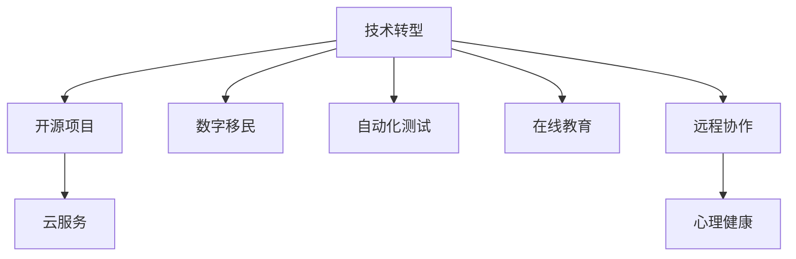

                 

# 程序员如何应对经济衰退挑战

> 关键词：技术转型, 开源项目, 云服务, 数字移民, 自动化测试, 在线教育, 远程协作, 心理健康

## 1. 背景介绍

### 1.1 问题由来
经济衰退是一个全球性的现象，对各行各业都产生了深远的影响。对于程序员而言，这也意味着职业生涯的巨大挑战。面对经济衰退，如何在失业风险、工资缩水、项目取消等压力下保持职业发展，是一个需要深刻思考的问题。本文将从技术转型、开源项目、云服务、数字移民、自动化测试、在线教育、远程协作和心理健康等多个维度，探讨程序员应对经济衰退的策略。

### 1.2 问题核心关键点
技术转型：在经济衰退期间，学习新技术、提升技能是保持竞争力的关键。
开源项目：参与开源项目可以提高技术能力和知名度，增强就业市场的吸引力。
云服务：掌握云服务技能，可以扩大技术栈，增强远程工作能力。
数字移民：向远程工作转型，利用数字化工具提升工作效率。
自动化测试：提升测试自动化水平，提高项目交付速度和质量。
在线教育：通过在线教育平台，随时随地学习新技能。
远程协作：建立高效远程协作流程，确保团队生产力不受疫情影响。
心理健康：关注自身心理健康，保持积极心态，应对经济压力。

这些关键点将指导我们制定有效的应对策略，帮助程序员在经济衰退期间维持职业发展。

## 2. 核心概念与联系

### 2.1 核心概念概述

为更好地理解如何应对经济衰退挑战，本节将介绍几个密切相关的核心概念：

- 技术转型：指通过学习新的技术、框架、语言等，提升个人技术栈，增强就业市场竞争力。
- 开源项目：指贡献代码、文档、设计等，对公共项目进行合作和维护的活动。
- 云服务：指基于云平台提供的计算、存储、网络等基础设施服务。
- 数字移民：指从传统办公室工作向远程工作转型的过程。
- 自动化测试：指使用工具和框架，自动化执行软件测试过程，提高测试效率和覆盖率。
- 在线教育：指通过网络平台进行在线学习，不受时间和地点的限制。
- 远程协作：指使用数字化工具，实现团队成员之间的有效沟通和协作。
- 心理健康：指通过各种手段，如心理咨询、运动、社交等，保持良好的心理状态。

这些核心概念之间的逻辑关系可以通过以下Mermaid流程图来展示：



这个流程图展示了一系列概念之间的关联关系：

1. 技术转型：是提升技术能力的起点，为开源项目、云服务、数字移民、自动化测试、在线教育、远程协作和心理健康提供基础。
2. 开源项目：通过参与开源项目，可以提升技术能力、知名度和网络资源，进一步促进技术转型和职业发展。
3. 云服务：掌握云服务技能，可以扩展技术栈，支持数字移民和远程协作，提高工作效率。
4. 数字移民：向远程工作转型，提升工作效率和灵活性，支持技术转型和远程协作。
5. 自动化测试：提升测试效率和质量，支持项目交付和质量保障，增强技术转型和职业竞争力。
6. 在线教育：利用在线教育平台，随时随地学习新技能，支持技术转型和职业发展。
7. 远程协作：通过数字化工具实现高效沟通和协作，支持技术转型和职业发展。
8. 心理健康：保持良好心理状态，应对经济压力和职业挑战，支持整体职业发展。

这些概念共同构成了程序员在经济衰退期间的应对框架，旨在通过多方面的努力，提升技能、扩展视野、增强灵活性，以应对经济衰退带来的挑战。

## 3. 核心算法原理 & 具体操作步骤
### 3.1 算法原理概述

经济衰退对程序员的挑战，本质上是技术和职业发展路径的选择问题。本文将从技术转型、开源项目、云服务、数字移民、自动化测试、在线教育、远程协作和心理健康等多个维度，探讨具体的应对策略。

### 3.2 算法步骤详解

#### 技术转型
1. **选择合适的学习方向**：根据行业趋势和市场需求，选择有前景的技术方向，如云计算、人工智能、区块链等。
2. **制定学习计划**：设定具体学习目标和时间表，分解为小步，确保可持续学习。
3. **选择合适的学习资源**：利用在线课程、书籍、社区、项目等资源，系统学习新技能。
4. **实践与项目经验**：通过实践项目，巩固所学知识，积累实战经验。
5. **持续学习和反馈**：定期评估学习成果，根据反馈调整学习策略，保持持续进步。

#### 开源项目
1. **选择适合的开源项目**：寻找与自身技术栈和兴趣相符的开源项目，优先参与活跃的项目。
2. **贡献代码和文档**：通过提交代码、修复Bug、撰写文档等方式，为项目贡献力量。
3. **社区参与和交流**：积极参与社区讨论，提出问题、分享经验，扩大人脉资源。
4. **展示技术能力**：在GitHub等平台上展示个人贡献和项目，吸引雇主关注。

#### 云服务
1. **学习云平台基础知识**：熟悉云服务的基本概念、架构和服务，如AWS、Google Cloud、Azure等。
2. **掌握云平台工具和API**：学会使用云平台提供的各种工具和API，如虚拟机、存储、数据库等。
3. **实践云服务项目**：通过实践项目，如搭建云环境、部署应用、优化性能等，积累云服务经验。
4. **获取云服务认证**：参加云服务认证考试，如AWS Certified Solutions Architect、Google Cloud Professional Data Engineer等，增强就业竞争力。

#### 数字移民
1. **适应远程工作环境**：熟悉远程协作工具，如Slack、Zoom、Microsoft Teams等，建立高效沟通渠道。
2. **优化远程工作流程**：制定远程工作规范，如工作时间、任务分配、进度跟踪等，确保工作效率。
3. **提升自我管理能力**：学会时间管理、自我激励和自我监控，保持良好的工作状态。
4. **建立在线社交网络**：利用社交媒体、线上会议、技术论坛等，扩展社交网络，结识同行专家。

#### 自动化测试
1. **学习自动化测试工具**：掌握自动化测试工具和框架，如Selenium、JUnit、TestNG等，提高测试效率。
2. **实践自动化测试项目**：通过实践项目，如自动化测试脚本编写、测试用例设计等，提升测试能力。
3. **持续优化测试流程**：优化测试流程，提高测试覆盖率和稳定性，提升项目质量。
4. **参加测试自动化社区**：加入测试自动化社区，交流经验，分享心得，保持技术前沿。

#### 在线教育
1. **选择合适的在线教育平台**：如Coursera、Udacity、edX等，选择与职业发展相关的课程。
2. **制定在线学习计划**：设定具体学习目标和时间表，确保系统学习。
3. **参与互动和讨论**：积极参与在线课程的互动和讨论，解决学习中的问题。
4. **获取认证和证书**：通过在线教育平台获取认证和证书，增强就业竞争力。

#### 远程协作
1. **选择合适的协作工具**：如Trello、Jira、Asana等，制定任务管理和进度跟踪流程。
2. **建立高效的沟通机制**：使用即时通讯工具，如Slack、Microsoft Teams等，保持团队沟通顺畅。
3. **制定远程工作规范**：制定远程工作规范，如任务分配、进度跟踪、会议安排等，确保团队协作有序。
4. **持续优化协作流程**：定期评估协作流程，优化改进，提升团队工作效率。

#### 心理健康
1. **关注心理健康**：保持健康的生活习惯，如适量运动、健康饮食、充足睡眠等。
2. **学习心理健康技巧**：如冥想、正念练习、心理咨询等，保持心理健康。
3. **建立支持系统**：与家人、朋友、同事保持良好关系，建立心理支持网络。
4. **寻求专业帮助**：必要时，寻求专业心理咨询师的帮助，缓解心理压力。

### 3.3 算法优缺点

技术转型、开源项目、云服务、数字移民、自动化测试、在线教育、远程协作和心理健康等策略，各有其优缺点：

**优点**：
- 技术转型：提升技能，增强就业竞争力。
- 开源项目：扩大人脉，提升知名度，增强项目经验。
- 云服务：扩展技术栈，提升远程工作能力。
- 数字移民：提高工作效率，增强灵活性。
- 自动化测试：提升测试效率，提高项目质量。
- 在线教育：随时随地学习，保持技术前沿。
- 远程协作：增强团队协作，提高工作效率。
- 心理健康：保持良好心理状态，应对职业压力。

**缺点**：
- 技术转型：需要大量时间和精力投入，初期可能难以见效。
- 开源项目：可能需要花费较多时间在社区交流和贡献上。
- 云服务：初期学习成本较高，需要购置和维护云资源。
- 数字移民：初期适应远程工作环境可能需要一段时间。
- 自动化测试：需要学习新工具和框架，可能面临技术迁移的挑战。
- 在线教育：需要自我管理能力，可能难以坚持学习。
- 远程协作：需要建立高效的沟通机制，可能初期较为困难。
- 心理健康：需要自我关注和调整，可能需要专业帮助。

尽管存在这些缺点，但整体而言，这些策略可以显著提升程序员在经济衰退期间的竞争力和就业机会，帮助其渡过难关，维持职业发展。

### 3.4 算法应用领域

技术转型、开源项目、云服务、数字移民、自动化测试、在线教育、远程协作和心理健康等策略，适用于广泛的职业场景，涵盖软件开发、运维、测试、数据分析等多个领域。这些策略不仅在经济衰退期间具有实用性，在平时的职业发展中也具有重要的价值。

## 4. 数学模型和公式 & 详细讲解 & 举例说明

### 4.1 数学模型构建

在经济衰退期间，程序员的职业发展可以视作一个多目标优化问题，目标包括提升技术能力、增强就业市场竞争力、应对经济压力等。我们可以构建一个多目标优化模型，通过设定不同的目标函数和约束条件，来指导具体的策略选择。

假设目标函数为 $f(x)$，约束条件为 $g(x) \leq 0$，其中 $x$ 表示策略集合，如技术转型、开源项目、云服务、数字移民、自动化测试、在线教育、远程协作和心理健康等。目标函数和约束条件的具体形式和权重，需要根据实际情况进行调整。

### 4.2 公式推导过程

以技术转型为例，假设目标函数为 $f(x)$，其中 $x$ 表示学习方向、学习资源、学习计划等。设 $f(x)$ 包含学习效果、项目经验、认证证书等各项指标，其权重分别为 $w_1, w_2, w_3$。则目标函数可以表示为：

$$
f(x) = w_1 \times \text{学习效果} + w_2 \times \text{项目经验} + w_3 \times \text{认证证书}
$$

约束条件为 $g(x) \leq 0$，其中 $g(x)$ 表示时间、成本、资源等限制条件。例如，设 $g(x)$ 包含学习时间、认证费用、云服务成本等，其权重分别为 $w_4, w_5, w_6$。则约束条件可以表示为：

$$
g(x) = w_4 \times \text{学习时间} + w_5 \times \text{认证费用} + w_6 \times \text{云服务成本}
$$

通过求解上述多目标优化问题，可以找到最优的学习策略，平衡各项指标，提升整体职业发展水平。

### 4.3 案例分析与讲解

假设一个程序员希望在经济衰退期间提升自身的就业竞争力。他面临的约束条件包括时间、成本、资源等。目标函数可以设定为提升技术能力、增强就业竞争力、提升项目经验等。通过选择学习方向、制定学习计划、获取认证证书等方式，他可以在有限的时间和资源内，最大化职业发展的收益。

以云计算技术为例，假设该程序员选择学习AWS云服务。他可以设定目标函数为：

$$
f(x) = w_1 \times \text{AWS认证证书} + w_2 \times \text{云计算项目经验} + w_3 \times \text{就业竞争力}
$$

其中，$w_1$、$w_2$、$w_3$ 分别表示权重，可以根据实际情况进行调整。通过选择相关课程、参与开源项目、获取认证证书等方式，他可以在有限的时间内，实现技术能力的提升和就业竞争力的增强。

## 5. 项目实践：代码实例和详细解释说明

### 5.1 开发环境搭建

在进行技术转型、开源项目、云服务、数字移民、自动化测试、在线教育、远程协作和心理健康等实践时，需要准备好相应的开发环境。以下是使用Python进行代码实践的环境配置流程：

1. 安装Python：从官网下载并安装Python，确保版本为3.8以上。
2. 安装相关库：使用pip安装必要的Python库，如requests、pandas、numpy、matplotlib等。
3. 安装云服务客户端：根据使用云服务（如AWS、Google Cloud、Azure），安装相应的客户端工具和SDK。
4. 配置开发环境：设置开发环境变量，如PATH、PYTHONPATH、HOME等，确保能够顺利运行代码。
5. 配置远程协作工具：安装远程协作工具，如Slack、Zoom、Microsoft Teams等，确保能够高效协作。
6. 配置在线教育平台：选择适合的在线教育平台，如Coursera、Udacity、edX等，注册账号并设置学习计划。

完成上述步骤后，即可在开发环境中进行相关实践。

### 5.2 源代码详细实现

下面以自动化测试为例，给出使用Selenium和JUnit进行自动化测试的Python代码实现。

首先，定义测试用例：

```python
from selenium import webdriver
from selenium.webdriver.common.by import By
from selenium.webdriver.support.ui import WebDriverWait
from selenium.webdriver.support import expected_conditions as EC

class MyTest(unittest.TestCase):
    def setUp(self):
        self.driver = webdriver.Chrome()
        self.driver.get("https://www.example.com")

    def test_title(self):
        self.assertEqual(self.driver.title, "Example Domain")

    def test_link(self):
        link_element = WebDriverWait(self.driver, 10).until(EC.presence_of_element_located((By.LINK_TEXT, "Link Text")))
        self.assertIn(link_element.text, "Link Text")

    def tearDown(self):
        self.driver.quit()
```

然后，运行测试用例：

```python
if __name__ == '__main__':
    unittest.main()
```

以上代码实现了使用Selenium和JUnit进行自动化测试的过程。在实际应用中，可以通过扩展测试用例、编写自动化脚本等方式，进一步提升测试效率和覆盖率。

### 5.3 代码解读与分析

上述代码中，`MyTest` 类继承了 `unittest.TestCase`，定义了三个测试用例。

- `setUp` 方法：初始化测试环境，如打开浏览器、访问URL等。
- `test_title` 方法：测试页面标题是否符合预期。
- `test_link` 方法：测试页面链接是否存在且文本是否符合预期。
- `tearDown` 方法：清理测试环境，如关闭浏览器等。

通过使用 `unittest` 框架，可以方便地编写、运行和维护测试用例。同时，使用 `WebDriverWait` 等待元素出现，可以避免因元素未加载而导致的测试失败。

在实际应用中，可以根据具体项目需求，扩展测试用例，编写更复杂的自动化测试脚本，提升测试效率和覆盖率。

### 5.4 运行结果展示

运行上述代码，可以观察到测试结果的输出。例如，测试页面标题是否符合预期，测试链接是否存在且文本是否符合预期等。

## 6. 实际应用场景

### 6.1 智能客服系统

在经济衰退期间，智能客服系统可以显著提升企业服务效率，降低人力成本。通过学习云计算、人工智能等技术，程序员可以构建智能客服系统，实现自动化问答、对话生成等功能。

在技术实现上，可以使用云服务搭建智能客服平台，集成自然语言处理、机器学习等技术，实现智能客服的自动响应和问题解决。同时，通过开源项目和在线教育平台，不断提升技术水平，保持系统的前沿性。

### 6.2 金融舆情监测

在经济衰退期间，金融舆情监测可以帮助企业及时掌握市场动态，规避风险。通过学习云计算、自然语言处理等技术，程序员可以构建金融舆情监测系统，实时分析市场舆情，预警风险。

在技术实现上，可以使用云服务搭建金融舆情监测平台，集成自然语言处理、情感分析等技术，实现舆情分析、情感监测等功能。同时，通过开源项目和在线教育平台，不断提升技术水平，保持系统的精准性和可靠性。

### 6.3 个性化推荐系统

在经济衰退期间，个性化推荐系统可以帮助企业提升用户粘性，增加收入。通过学习云计算、自然语言处理等技术，程序员可以构建个性化推荐系统，实现精准推荐。

在技术实现上，可以使用云服务搭建个性化推荐平台，集成自然语言处理、机器学习等技术，实现用户行为分析、个性化推荐等功能。同时，通过开源项目和在线教育平台，不断提升技术水平，保持系统的推荐效果和用户体验。

### 6.4 未来应用展望

随着技术的发展，未来大语言模型微调、自然语言处理、云计算等技术将进一步融合，带来更多创新应用场景。在智慧城市、智能制造、智能交通等领域，程序员可以发挥重要作用，推动技术进步和产业升级。

此外，随着开源社区和云服务平台的不断发展，程序员可以更方便地获取资源、分享经验、提升技能，保持技术领先地位。同时，通过远程协作和在线教育，打破时间和空间的限制，实现更广泛的学习和交流。

## 7. 工具和资源推荐

### 7.1 学习资源推荐

为了帮助程序员系统掌握技术转型、开源项目、云服务、数字移民、自动化测试、在线教育、远程协作和心理健康等策略，这里推荐一些优质的学习资源：

1. Udacity《云计算开发工程师》课程：系统介绍云计算基础知识和技能，适合初学者和进阶者。
2. Coursera《人工智能与机器学习》课程：涵盖人工智能和机器学习的基础知识和实践技能，适合技术转型。
3. edX《Web开发》课程：介绍Web开发技术和工具，适合提升技术栈。
4. Codecademy《Python编程》课程：适合初学者，快速掌握Python编程基础。
5. Pluralsight《DevOps工程师》课程：涵盖DevOps基础和实践技能，适合提升远程协作能力。

通过对这些资源的学习实践，相信程序员可以系统掌握技术转型、开源项目、云服务、数字移民、自动化测试、在线教育、远程协作和心理健康等策略，提升职业竞争力。

### 7.2 开发工具推荐

高效的开发离不开优秀的工具支持。以下是几款用于技术转型、开源项目、云服务、数字移民、自动化测试、在线教育、远程协作和心理健康等实践的常用工具：

1. VSCode：开源的代码编辑器，支持多种编程语言和框架，适合各种开发任务。
2. Git：版本控制系统，支持分布式协作，适合开源项目和版本管理。
3. Docker：容器化工具，支持跨平台部署，适合云服务和数字移民。
4. Jenkins：持续集成工具，支持自动化测试和部署，适合CI/CD流程。
5. Slack：即时通讯工具，支持团队协作，适合远程协作。
6. Zoom：视频会议工具，支持高清视频通话，适合远程协作。
7. Microsoft Teams：协作平台，支持消息、会议、文件共享等，适合远程协作。

合理利用这些工具，可以显著提升程序员的开发效率和协作能力，保持技术领先地位。

### 7.3 相关论文推荐

技术转型、开源项目、云服务、数字移民、自动化测试、在线教育、远程协作和心理健康等策略，需要建立在理论研究的基础上。以下是几篇奠基性的相关论文，推荐阅读：

1. Google Cloud Platform文档：介绍了云计算基础知识和实践技能，适合了解云服务技术。
2. TensorFlow官方文档：介绍了TensorFlow深度学习框架的基础知识和实践技能，适合学习深度学习。
3. DevOps anti-patterns：介绍了DevOps中常见的问题和解决方案，适合了解DevOps最佳实践。
4. Kubernetes官方文档：介绍了Kubernetes容器编排系统的基础知识和实践技能，适合学习云服务部署。
5. JUnit官方文档：介绍了JUnit单元测试框架的基础知识和实践技能，适合自动化测试。

这些论文代表了大语言模型微调技术的发展脉络，通过学习这些前沿成果，可以帮助程序员把握学科前进方向，激发更多的创新灵感。

## 8. 总结：未来发展趋势与挑战

### 8.1 总结

本文对如何应对经济衰退挑战进行了全面系统的探讨。通过技术转型、开源项目、云服务、数字移民、自动化测试、在线教育、远程协作和心理健康等多维度，帮助程序员在经济衰退期间保持职业发展。这些策略不仅适用于当前的经济环境，在平时的职业发展中也具有重要的指导意义。

通过本文的系统梳理，可以看到，程序员可以通过技术转型、参与开源项目、掌握云服务技能、适应远程工作、提升测试自动化水平、利用在线教育、建立高效协作流程和关注自身心理健康，在经济衰退期间保持职业竞争力。这些策略的实施，将有助于程序员应对职业生涯中的各种挑战，实现持续发展和个人成长。

### 8.2 未来发展趋势

展望未来，技术转型、开源项目、云服务、数字移民、自动化测试、在线教育、远程协作和心理健康等策略，将进一步发展，带来更多创新应用场景和就业机会。

1. 技术转型：随着新兴技术的不断涌现，技术转型将更加灵活和多样化，程序员可以通过不断学习新技术，保持技术领先地位。
2. 开源项目：开源社区和云服务平台的发展将更加成熟，程序员可以更方便地参与开源项目，提升技术能力和知名度。
3. 云服务：云服务将更加普及和易用，程序员可以更灵活地搭建和部署系统，提升远程工作能力。
4. 数字移民：远程工作将成为常态，数字化工具将更加丰富和高效，程序员可以更自由地选择工作地点和方式。
5. 自动化测试：自动化测试将更加自动化和智能化，程序员可以更高效地进行测试和质量保障。
6. 在线教育：在线教育平台将更加丰富和完善，程序员可以随时随地进行学习，提升技术能力和知识水平。
7. 远程协作：远程协作工具将更加智能化和协同化，程序员可以更高效地进行团队协作和项目管理。
8. 心理健康：心理健康将受到更多关注和重视，程序员可以通过多种手段保持良好心理状态，应对职业压力。

这些发展趋势将进一步推动程序员的职业发展和产业升级，带来更多创新应用场景和就业机会。

### 8.3 面临的挑战

尽管技术转型、开源项目、云服务、数字移民、自动化测试、在线教育、远程协作和心理健康等策略具有广泛的应用前景，但在实施过程中，仍面临诸多挑战：

1. 学习成本高昂：学习新技术和工具需要投入大量时间和精力，初期可能难以见效。
2. 技术迁移难度大：现有技能和经验可能与新技术和工具存在差异，需要时间和努力进行迁移。
3. 远程协作效率低：远程协作工具和流程需要不断优化，初期可能面临沟通不畅、协作困难等问题。
4. 心理健康压力大：经济衰退带来的压力和不确定性，可能导致心理压力增大，需要有效应对。

尽管存在这些挑战，但通过合理规划和持续努力，程序员可以克服这些困难，实现职业发展和个人成长。

### 8.4 研究展望

未来的研究需要在以下几个方面进行深入探讨：

1. 学习路径和资源优化：如何设计科学的学习路径和资源，帮助程序员高效学习和掌握新技术。
2. 远程协作工具和流程优化：如何优化远程协作工具和流程，提升团队协作效率和效果。
3. 心理健康支持系统：如何建立有效的心理健康支持系统，帮助程序员应对心理压力和挑战。
4. 技术迁移和转换方法：如何高效地进行技术迁移和转换，帮助程序员快速适应新技术和工具。
5. 学习社区和平台建设：如何构建高效的学习社区和平台，帮助程序员分享经验、交流心得。

这些研究方向的探索，将有助于解决程序员在技术转型、开源项目、云服务、数字移民、自动化测试、在线教育、远程协作和心理健康等策略实施过程中遇到的问题，推动技术的进步和职业发展。

## 9. 附录：常见问题与解答

**Q1：如何选择合适的学习方向？**

A: 选择合适的学习方向需要考虑以下几个因素：
1. 行业趋势：关注行业发展趋势，选择有前景的技术方向。
2. 个人兴趣：选择与自身兴趣和特长相符的学习方向。
3. 市场需求：了解市场需求和就业形势，选择有就业前景的技术方向。

**Q2：参与开源项目有哪些好处？**

A: 参与开源项目可以带来以下好处：
1. 提升技术能力：通过贡献代码和文档，积累实战经验，提升技术能力。
2. 扩大人脉资源：通过社区交流和合作，结识同行专家，扩大人脉资源。
3. 展示技术能力：通过开源贡献，展示个人技术水平，吸引雇主关注。

**Q3：掌握云服务技能需要哪些步骤？**

A: 掌握云服务技能需要以下步骤：
1. 学习云平台基础知识：了解云平台的基本概念、架构和服务。
2. 掌握云平台工具和API：学会使用云平台提供的各种工具和API。
3. 实践云服务项目：通过实践项目，如搭建云环境、部署应用、优化性能等，积累云服务经验。
4. 获取云服务认证：参加云服务认证考试，如AWS Certified Solutions Architect、Google Cloud Professional Data Engineer等，增强就业竞争力。

**Q4：如何提升测试自动化水平？**

A: 提升测试自动化水平需要以下步骤：
1. 学习自动化测试工具：掌握自动化测试工具和框架，如Selenium、JUnit、TestNG等。
2. 实践自动化测试项目：通过实践项目，如自动化测试脚本编写、测试用例设计等，提升测试能力。
3. 持续优化测试流程：优化测试流程，提高测试覆盖率和稳定性，提升项目质量。
4. 参加测试自动化社区：加入测试自动化社区，交流经验，分享心得，保持技术前沿。

**Q5：如何建立高效的远程协作流程？**

A: 建立高效的远程协作流程需要以下步骤：
1. 选择合适的协作工具：如Slack、Zoom、Microsoft Teams等，制定任务管理和进度跟踪流程。
2. 建立高效的沟通机制：使用即时通讯工具，如Slack、Zoom、Microsoft Teams等，保持团队沟通顺畅。
3. 制定远程工作规范：制定远程工作规范，如任务分配、进度跟踪、会议安排等，确保团队协作有序。
4. 持续优化协作流程：定期评估协作流程，优化改进，提升团队工作效率。

**Q6：如何保持良好心理状态？**

A: 保持良好心理状态需要以下方法：
1. 关注心理健康：保持健康的生活习惯，如适量运动、健康饮食、充足睡眠等。
2. 学习心理健康技巧：如冥想、正念练习、心理咨询等，保持心理健康。
3. 建立支持系统：与家人、朋友、同事保持良好关系，建立心理支持网络。
4. 寻求专业帮助：必要时，寻求专业心理咨询师的帮助，缓解心理压力。

这些常见问题的解答，希望能帮助程序员在经济衰退期间保持职业发展，应对职业生涯中的各种挑战，实现持续发展和个人成长。

---

作者：禅与计算机程序设计艺术 / Zen and the Art of Computer Programming

