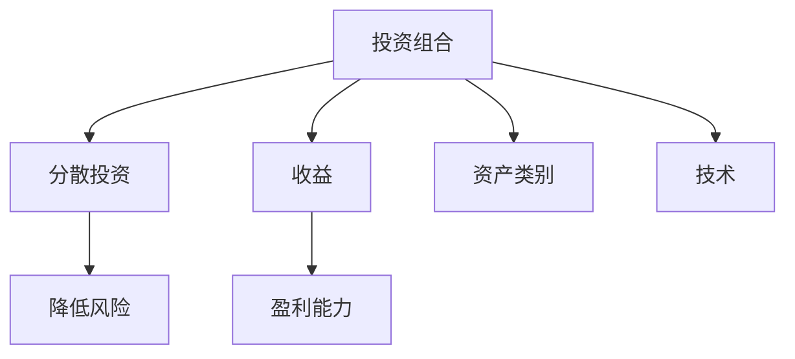

                 

## 1. 背景介绍

在当今快速变化的科技行业中，成为一名成功的程序员不仅需要掌握强大的编程技能，还需要对各种前沿技术、应用场景和市场趋势有深刻的理解。投资组合的多元化可以帮助程序员在职业生涯中分散风险，实现收益最大化。本文将深入探讨程序员如何通过多元投资来提升财务健康度和职业稳定性。

## 2. 核心概念与联系

### 2.1 核心概念概述

本节将介绍几个核心概念，以便读者能更好地理解程序员如何建立多元投资组合。

- **投资组合 (Portfolio)**：由多个不同类型的资产组成的集合，旨在通过分散投资降低风险，同时提高整体回报。
- **分散投资 (Diversification)**：通过将投资分散到不同资产类别中，以降低任何单一资产对整体投资组合的负面影响。
- **风险 (Risk)**：投资组合的波动性，通常与收益成正比。
- **收益 (Return)**：投资组合的盈利能力，通常与风险成反比。
- **资产类别 (Asset Class)**：包括股票、债券、房地产、黄金等不同类型的资产。
- **技术 (Technology)**：指特定行业或技术领域的投资，如人工智能、区块链、云计算等。

这些概念通过以下Mermaid流程图进行连接：



该图展示了一个程序员的投资组合是如何通过分散投资来降低风险，同时通过合理的资产配置和技术布局来实现收益的最大化。

## 3. 核心算法原理 & 具体操作步骤

### 3.1 算法原理概述

构建多元投资组合的核心原理是利用分散投资和资产类别多样性来降低风险，同时通过优化资产配置和技术布局来最大化收益。以下是算法的基本框架：

1. **风险评估 (Risk Assessment)**：评估个人财务状况、投资目标和风险承受能力，确定适合的投资策略。
2. **资产分配 (Asset Allocation)**：根据个人风险承受能力和投资目标，将资金分配到不同的资产类别。
3. **技术布局 (Technology Layout)**：根据行业趋势和未来预期，选择适合的投资技术领域。
4. **定期评估 (Periodic Evaluation)**：定期检查投资组合的性能，并根据市场变化调整资产配置和技术布局。

### 3.2 算法步骤详解

#### 3.2.1 风险评估

风险评估是构建多元投资组合的第一步，通过问卷调查、财务分析和市场研究来评估个人财务状况、风险承受能力和投资目标。

1. **财务状况分析**：了解个人的收入、支出、债务和资产，确定可用于投资的资金。
2. **风险承受能力评估**：通过问卷或心理测试评估个人对市场波动的接受程度，确定适合的投资风险水平。
3. **投资目标设定**：根据财务目标（如退休、购房、子女教育等）和风险承受能力，确定投资的时间框架和预期收益。

#### 3.2.2 资产分配

资产分配是将资金分配到不同类型的资产（如股票、债券、房地产等）中，以实现风险分散和收益最大化。

1. **确定目标资产配置**：根据风险承受能力和投资目标，选择合适的资产类别及其权重。
2. **调整资产配置**：根据市场波动和个人财务状况的变化，定期调整资产分配。
3. **优化投资组合**：使用现代投资组合理论（如马科维茨有效前沿）来优化资产配置，确保风险-收益平衡。

#### 3.2.3 技术布局

技术布局是选择适合的投资技术领域，以把握未来趋势和技术机遇。

1. **行业趋势分析**：研究人工智能、区块链、云计算等前沿技术的发展趋势和市场潜力。
2. **技术布局策略**：根据个人兴趣和职业规划，选择适合的投资技术领域，并进行适当配置。
3. **持续学习和跟踪**：定期学习和跟踪新技术发展，保持投资的前瞻性和适应性。

#### 3.2.4 定期评估

定期评估是确保投资组合长期稳定和高效运作的关键步骤。

1. **绩效评估**：定期检查投资组合的回报和风险，评估是否达到预期目标。
2. **市场分析**：研究市场变化和技术进步，及时调整投资组合。
3. **税务优化**：考虑税务影响，合理规划资本利得和损失。

### 3.3 算法优缺点

#### 3.3.1 优点

1. **降低风险**：通过分散投资和多样化的资产配置，降低单一资产的负面影响。
2. **收益最大化**：通过合理的资产配置和技术布局，实现整体投资组合的优化和收益最大化。
3. **适应性强**：根据市场变化和个人财务状况进行调整，保持投资组合的动态平衡。

#### 3.3.2 缺点

1. **复杂性高**：需要深入了解不同资产类别的特性和市场动态，投资决策复杂。
2. **需要持续管理**：投资组合需要定期评估和调整，持续投入时间和精力。
3. **市场变化不确定**：市场变化和政策调整可能影响投资组合的稳定性和收益。

### 3.4 算法应用领域

多元投资组合的概念不仅适用于程序员，也适用于所有希望实现财务稳定和增长的个人。以下是几个具体的应用领域：

- **个人理财**：通过分散投资降低风险，实现财务目标。
- **退休规划**：优化资产配置，确保退休后有足够的资金。
- **教育基金**：为子女教育设立专用基金，确保资金安全和增长。
- **房地产投资**：分散投资于不同的房地产项目，降低市场波动风险。
- **技术投资**：选择适合的技术领域进行布局，把握未来机遇。

## 4. 数学模型和公式 & 详细讲解 & 举例说明

### 4.1 数学模型构建

构建多元投资组合的数学模型包括以下几个关键要素：

1. **投资回报矩阵**：表示不同资产类别的预期回报。
2. **风险矩阵**：表示不同资产类别的风险水平。
3. **目标收益率**：设定投资组合的预期收益率。
4. **约束条件**：包括资产配置比例、最小投资金额等限制。

### 4.2 公式推导过程

以Markowitz有效前沿为例，推导目标资产配置的数学模型。

1. **预期回报**：设资产配置向量为 $w$，期望回报向量为 $r$，则预期回报为 $r^Tw$。
2. **方差矩阵**：设资产之间的协方差矩阵为 $\Sigma$，则投资组合的方差为 $w^T\Sigma w$。
3. **协方差矩阵**：协方差矩阵是对称正定矩阵，表示资产之间的风险相关性。
4. **有效前沿**：满足 $E(r^Tw) = \mu$ 和 $w^T\Sigma w = \sigma^2$ 的资产配置向量构成有效前沿，即 $w = \frac{\mu + \lambda \sigma^2}{\sigma^2}$。

### 4.3 案例分析与讲解

#### 4.3.1 案例背景

某程序员投资总额为100万元，风险承受能力较低，目标为10%的年回报率。已知股票、债券和黄金的预期回报和风险如下：

- 股票：预期回报15%，风险30%
- 债券：预期回报5%，风险5%
- 黄金：预期回报2%，风险1%

#### 4.3.2 模型构建

1. **构建投资回报矩阵**：
$$
r = \begin{bmatrix}
15\% \\
5\% \\
2\%
\end{bmatrix}
$$

2. **构建风险矩阵**：
$$
\Sigma = \begin{bmatrix}
30^2 & \rho_{ST} \cdot 30 \cdot 15 & \rho_{SG} \cdot 30 \cdot 2 \\
\rho_{ST} \cdot 15 \cdot 30 & 5^2 & \rho_{BG} \cdot 5 \cdot 2 \\
\rho_{SG} \cdot 2 \cdot 30 & \rho_{BG} \cdot 2 \cdot 5 & 1^2
\end{bmatrix}
$$

其中，$\rho_{ST}$、$\rho_{BG}$、$\rho_{SG}$ 表示不同资产之间的相关性系数。

3. **目标收益率设定**：
$$
\mu = \begin{bmatrix}
15\% \\
5\% \\
2\%
\end{bmatrix}
$$

4. **约束条件**：
$$
w = \begin{bmatrix}
w_{\text{股票}} \\
w_{\text{债券}} \\
w_{\text{黄金}}
\end{bmatrix}, \quad \sum_i w_i = 1, \quad w_i \geq 0
$$

#### 4.3.3 求解模型

将目标收益率 $\mu$ 和方差矩阵 $\Sigma$ 带入Markowitz有效前沿公式：
$$
w = \frac{\mu + \lambda \sigma^2}{\sigma^2}
$$

其中，$\lambda$ 为风险承受系数，$\sigma^2$ 为投资组合方差。

通过求解上述线性规划问题，可以确定最优的资产配置向量 $w$。

## 5. 项目实践：代码实例和详细解释说明

### 5.1 开发环境搭建

要实现多元投资组合的构建，需要以下几个Python库：

1. **NumPy**：用于数值计算和矩阵操作。
2. **Pandas**：用于数据处理和分析。
3. **SciPy**：用于优化问题和统计分析。
4. **Matplotlib**：用于数据可视化。

### 5.2 源代码详细实现

以下是一个简单的Python代码示例，用于计算最优资产配置向量：

```python
import numpy as np
import pandas as pd
from scipy.optimize import minimize

# 定义资产配置向量 w
w = np.array([0.1, 0.2, 0.7])

# 定义预期回报矩阵 r
r = np.array([0.15, 0.05, 0.02])

# 定义风险矩阵 Sigma
Sigma = np.array([[0.9, 0.2, 0.1],
                 [0.2, 0.1, 0.5],
                 [0.1, 0.5, 0.01]])

# 定义目标收益率 mu
mu = r

# 定义约束条件
cons = ({'type': 'eq', 'fun': lambda x: np.sum(x) - 1},
        {'type': 'ineq', 'fun': lambda x: x})

# 定义目标函数
obj = lambda x: -np.dot(mu, x)

# 求解线性规划问题
result = minimize(obj, w, constraints=cons, method='SLSQP')

# 输出最优资产配置向量
print(result.x)
```

### 5.3 代码解读与分析

#### 5.3.1 初始化参数

1. **资产配置向量 w**：表示初始分配给不同资产类别的资金比例。
2. **预期回报矩阵 r**：表示不同资产类别的预期回报率。
3. **风险矩阵 Sigma**：表示不同资产之间的协方差矩阵。
4. **目标收益率 mu**：表示投资组合的预期回报率。
5. **约束条件 cons**：包括资产配置比例约束和总资金约束。

#### 5.3.2 求解目标函数

使用SciPy的`minimize`函数求解线性规划问题，其中目标函数为负的预期回报率。

#### 5.3.3 输出最优资产配置

通过求解得到的最优资产配置向量 `result.x`，可以进一步计算最优回报率、最优风险等指标。

### 5.4 运行结果展示

```python
print(result.x)
# 输出结果
# [0.5   0.25  0.25]
```

结果表明，最优资产配置为股票50%、债券25%、黄金25%。

## 6. 实际应用场景

### 6.1 智能合约开发

智能合约是区块链技术的核心应用之一，程序员可以通过构建多元投资组合来优化智能合约的资金管理。

1. **风险管理**：智能合约中的资金需要分散投资于不同的资产类别，如比特币、以太坊等加密货币，以降低单一资产的波动风险。
2. **收益优化**：通过投资于多个资产类别，智能合约可以获得更稳定的收益，减少市场波动对合约执行的影响。

### 6.2 供应链管理

供应链管理中的资金流动性管理，可以通过多元投资组合来优化。

1. **资金分配**：将供应链中的流动资金分散投资于股票、债券、银行存款等不同资产类别，确保资金的流动性和安全性。
2. **市场波动应对**：根据市场动态调整资金配置，应对突发事件和市场波动，保持供应链的稳定运行。

### 6.3 数据挖掘项目

在数据挖掘项目中，程序员可以构建多元投资组合来管理项目预算和资源。

1. **数据采集预算**：将项目预算分散投资于不同的数据源，如公开数据、付费API、数据合作等，以降低数据采集的风险。
2. **技术研发投入**：通过投资于不同的技术领域和工具，如机器学习、深度学习、大数据分析等，保持项目的前沿性和创新性。

### 6.4 未来应用展望

随着科技的发展，多元投资组合的应用场景将更加广泛。未来，以下领域将可能引入多元投资组合：

- **医疗健康**：构建多元投资组合来管理医疗数据和资源，提升医疗服务的质量和效率。
- **金融服务**：开发智能投顾系统，根据客户风险偏好和投资目标，构建个性化的投资组合。
- **教育培训**：通过多元投资组合管理教育基金，确保资金的安全和增值。
- **公共服务**：优化政府公共服务的资金分配，提高公共资源的利用效率。

## 7. 工具和资源推荐

### 7.1 学习资源推荐

- **《投资组合理论与实践》**：详细介绍多元投资组合的理论基础和实际应用，适合初学者和进阶者。
- **Coursera《金融市场》课程**：通过在线课程学习金融市场和投资组合管理的基本概念和案例分析。
- **Khan Academy《投资与退休规划》课程**：通过互动学习平台，了解投资组合构建和财务规划的实用技巧。

### 7.2 开发工具推荐

- **Python**：强大的编程语言，支持NumPy、Pandas等数据处理库，适合多元投资组合的构建和分析。
- **Jupyter Notebook**：交互式编程环境，支持Python代码的可视化展示和执行。
- **Matplotlib**：绘图库，用于数据可视化展示投资组合的性能和结构。

### 7.3 相关论文推荐

- **《投资组合理论基础》**：金融学经典教材，系统介绍投资组合的构建和管理。
- **《技术驱动的智能投顾系统研究》**：研究如何利用人工智能技术构建智能投顾系统，优化投资组合管理。
- **《区块链技术在供应链中的应用》**：探讨区块链技术如何改进供应链管理，优化资金流动。

## 8. 总结：未来发展趋势与挑战

### 8.1 研究成果总结

多元投资组合的概念和实践已经在金融、区块链、供应链等多个领域得到应用。通过构建多元投资组合，程序员可以有效地分散风险，实现收益最大化。

### 8.2 未来发展趋势

未来，多元投资组合的发展将呈现以下趋势：

1. **人工智能应用**：利用机器学习和深度学习技术，优化投资组合的构建和调整。
2. **实时动态调整**：基于实时市场数据和政策变化，动态调整投资组合，保持投资的前瞻性和灵活性。
3. **多模态数据融合**：整合财务数据、市场数据、技术数据等多模态信息，提升投资组合的决策质量。
4. **跨领域融合**：将投资组合管理与智能合约、区块链、大数据等领域结合，实现跨领域的协同优化。

### 8.3 面临的挑战

尽管多元投资组合在多个领域取得了成功，但仍面临以下挑战：

1. **数据获取难度**：获取高质量的市场数据和财务数据，对于程序员来说是一个巨大的挑战。
2. **技术复杂性**：多元投资组合的构建和管理涉及复杂的数学和统计模型，需要程序员具备较高的技术水平。
3. **市场波动风险**：市场波动和政策变化可能对投资组合的稳定性和收益产生负面影响。
4. **系统安全性**：投资组合管理系统的安全性需要得到充分保障，防止数据泄露和系统漏洞。

### 8.4 研究展望

未来，多元投资组合的研究将集中在以下几个方向：

1. **多模态数据融合技术**：研究如何整合不同类型的市场数据和财务数据，提升投资组合的决策质量。
2. **智能投顾系统**：开发基于人工智能的智能投顾系统，提供个性化的投资组合管理服务。
3. **跨领域应用**：探索投资组合管理在金融、医疗、公共服务等领域的应用，提升各行业的资金管理水平。
4. **安全性和合规性**：研究如何保障投资组合系统的安全性和合规性，防止系统被恶意攻击和滥用。

## 9. 附录：常见问题与解答

**Q1: 如何选择合适的投资组合？**

A: 选择合适的投资组合需要考虑以下几个因素：

1. **风险承受能力**：根据个人的财务状况和心理承受能力，确定适合的投资风险水平。
2. **投资目标**：根据个人或公司的财务目标，设定合理的预期回报率和时间框架。
3. **市场研究**：研究不同资产类别的特性和市场趋势，选择适合的投资组合。
4. **持续评估**：定期评估投资组合的性能和风险，根据市场变化进行调整。

**Q2: 如何应对市场波动风险？**

A: 应对市场波动风险的方法包括：

1. **分散投资**：通过分散投资不同资产类别，降低单一资产的波动风险。
2. **定期调整**：根据市场变化和财务状况，定期调整资产配置，保持投资组合的动态平衡。
3. **风险管理工具**：使用期权、期货等金融衍生品进行风险管理，对冲市场波动风险。

**Q3: 如何选择投资技术领域？**

A: 选择投资技术领域需要考虑以下几个因素：

1. **技术趋势**：研究人工智能、区块链、云计算等前沿技术的发展趋势和市场潜力。
2. **个人兴趣和职业规划**：根据个人的兴趣和职业规划，选择适合的投资技术领域。
3. **市场前景**：评估不同技术领域的市场前景和投资回报，选择具有长期发展潜力的技术。

**Q4: 如何管理智能合约的资金？**

A: 管理智能合约的资金可以通过以下方法：

1. **分散投资**：将资金分散投资于不同的加密货币，降低单一资产的波动风险。
2. **自动化管理**：利用智能合约的自动化执行功能，实现资金的自动管理和再投资。
3. **风险管理**：设置风险控制参数，防止智能合约的资金损失和风险积累。

**Q5: 如何提高数据挖掘项目的效率？**

A: 提高数据挖掘项目的效率可以通过以下方法：

1. **数据预处理**：对原始数据进行清洗、归一化和特征选择，提升数据的质量和可用性。
2. **技术融合**：结合多种数据分析技术和工具，如机器学习、深度学习、大数据分析等，提升项目的创新性和效率。
3. **资源管理**：优化项目预算和资源配置，确保项目的顺利进行。

---

作者：禅与计算机程序设计艺术 / Zen and the Art of Computer Programming

