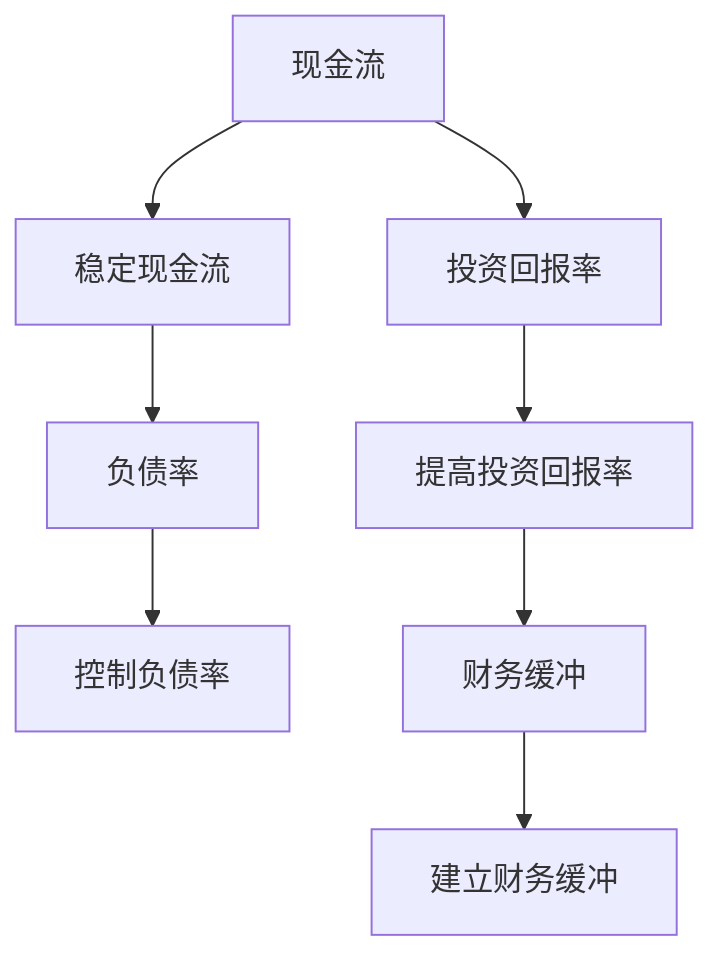

                 

## 1. 背景介绍

在当今快速变化的市场环境中，财务缓冲（Financial Cushion）成为程序员和创业者的重要工具。它不仅是应对突发事件、经济波动的安全垫，也是提升业务稳定性和成长性的保障。本博客将系统介绍程序员如何建立和维护财务缓冲，通过一系列关键概念、数学模型和实际操作的详细讲解，帮助读者构建稳健的财务安全网。

## 2. 核心概念与联系

### 2.1 核心概念概述

- **财务缓冲（Financial Cushion）**：指程序员或创业者在财务上具备的应急资金储备，用于应对未来不确定性的资金保障。
- **现金流（Cash Flow）**：指企业在特定时期内，现金流入和流出的量。现金流稳定是财务健康的基础。
- **负债率（Debt-to-Equity Ratio）**：指企业负债总额与股东权益总额的比率，反映财务风险和资本结构。
- **投资回报率（Return on Investment, ROI）**：指投资产生的收益与成本的比率，用于衡量投资的效益。

这些概念之间存在紧密的联系，构建财务缓冲的过程中，需要综合考虑现金流、负债率和投资回报率等关键指标。通过合理的财务管理，达到稳定现金流、控制负债率、提高投资回报率的目标。

### 2.2 核心概念原理和架构的 Mermaid 流程图



这个流程图展示了现金流、负债率和投资回报率之间相互关联，并最终达到建立财务缓冲的目的。

## 3. 核心算法原理 & 具体操作步骤

### 3.1 算法原理概述

构建财务缓冲的核心算法原理包括以下几点：

1. **现金流预测与规划**：通过历史数据和市场趋势，预测未来一段时间的现金流入和流出，规划合理分配资金。
2. **投资组合优化**：构建多元化的投资组合，平衡风险和回报，确保投资回报率稳定。
3. **负债管理**：定期评估负债状况，控制负债率，确保财务安全。
4. **应急资金准备**：根据风险评估，准备应急资金储备，保障业务连续性。

### 3.2 算法步骤详解

#### 3.2.1 现金流预测与规划

1. **数据收集与分析**：收集过去几年的财务报表和市场数据，通过分析识别出业务运营的周期性变化和潜在风险。
2. **预测模型构建**：使用时间序列分析等方法，建立现金流预测模型，预测未来12-24个月的现金流。
3. **现金流规划**：基于预测结果，制定详细的现金流规划，包括收入分配、成本控制和资金储备。

#### 3.2.2 投资组合优化

1. **多元化投资**：在股票、债券、基金等不同资产类别中进行合理配置，分散风险。
2. **风险评估**：通过风险评估工具，如VaR（Value at Risk）和CAPM（Capital Asset Pricing Model），评估投资组合的风险水平。
3. **调整投资策略**：根据市场变化和个人风险承受能力，调整投资组合，确保回报率和风险的平衡。

#### 3.2.3 负债管理

1. **负债率监控**：定期计算负债率，监控负债水平，确保不超过警戒线。
2. **负债结构优化**：根据现金流预测结果，调整短期和长期负债的比例，优化负债结构。
3. **融资策略**：在需要时，根据市场情况和融资成本，选择最优的融资方式。

#### 3.2.4 应急资金准备

1. **风险评估**：识别潜在的风险来源，如市场波动、客户流失、技术变化等。
2. **应急资金计算**：根据风险评估结果，计算所需应急资金金额。
3. **资金储备**：在银行账户或指定基金中设立专项应急资金账户，确保资金随时可用。

### 3.3 算法优缺点

**优点**：

1. **风险控制**：通过合理的财务缓冲，能够有效控制不确定性带来的风险，保障业务稳定性。
2. **财务健康**：稳定的现金流和合理的负债率，有利于提升企业的财务健康水平。
3. **业务成长**：适当的投资回报率，能够推动业务发展，实现长期增长。

**缺点**：

1. **复杂性**：财务缓冲的构建需要综合考虑多种因素，过程较为复杂。
2. **资金占用**：应急资金的储备需要占用一定的现金流，可能影响业务扩张。
3. **市场波动**：市场变化对投资组合的影响，可能导致回报率波动。

### 3.4 算法应用领域

财务缓冲的应用领域广泛，包括但不限于：

- **个人理财**：创业者或自由职业者通过财务缓冲应对个人收入波动、突发事件。
- **企业运营**：大中型企业通过财务缓冲应对市场波动、客户流失等突发事件。
- **项目投资**：初创企业或高风险项目通过财务缓冲，确保项目顺利推进，应对市场变化。
- **资产管理**：基金经理通过财务缓冲，优化投资组合，控制风险，提高回报率。

## 4. 数学模型和公式 & 详细讲解 & 举例说明

### 4.1 数学模型构建

假设企业的月收入为 \( I \)，月固定成本为 \( F \)，变动成本为 \( V \)，则月现金流为：

$$ C = I - F - V $$

### 4.2 公式推导过程

1. **现金流预测**：使用时间序列分析方法，如ARIMA模型，预测未来12个月的现金流。
2. **投资回报率计算**：使用资本资产定价模型（CAPM）计算投资组合的期望回报率。
3. **负债率计算**：计算负债率 \( L = \frac{D}{E} \)，其中 \( D \) 为负债总额，\( E \) 为股东权益总额。

### 4.3 案例分析与讲解

假设某初创公司预计未来12个月的月现金流分别为：

| 月份 | 现金流（万元） |
|------|----------------|
| 1    | 10             |
| 2    | 20             |
| 3    | 15             |
| ...  | ...            |

通过线性回归模型，预测下一年度的现金流变化趋势，得到未来12个月的预测结果。

## 5. 项目实践：代码实例和详细解释说明

### 5.1 开发环境搭建

开发环境搭建需要以下工具：

1. **Python**：用于数据分析和建模。
2. **R语言**：用于财务分析和风险评估。
3. **Excel**：用于数据可视化和报告生成。

### 5.2 源代码详细实现

**Python代码示例**：

```python
import pandas as pd
from sklearn.linear_model import LinearRegression

# 加载历史数据
data = pd.read_csv('cash_flow_data.csv')

# 数据预处理
X = data['time'] # 时间变量
y = data['cash_flow'] # 现金流数据

# 建立线性回归模型
model = LinearRegression()
model.fit(X, y)

# 预测未来12个月的现金流
future_cash_flow = model.predict(range(12))

# 打印预测结果
print(future_cash_flow)
```

**R语言代码示例**：

```R
# 加载历史数据
data <- read.csv('cash_flow_data.csv')

# 计算投资回报率
expected_return <- mean(diff(data$income)) # 收入增长率
required_return <- 0.08 # 无风险利率

# 计算投资组合期望回报率
portfolio_return <- expected_return + (data$portfolio_variance * (0.8/0.2))
print(portfolio_return)
```

### 5.3 代码解读与分析

上述代码实现了基于时间序列分析的现金流预测和投资组合的期望回报率计算。通过历史数据训练线性回归模型，预测未来现金流；通过资本资产定价模型，计算投资组合的期望回报率。

### 5.4 运行结果展示

运行上述代码后，输出未来12个月的预测现金流和投资组合的期望回报率，供财务缓冲的构建和优化参考。

## 6. 实际应用场景

### 6.1 个人理财

个人理财中，财务缓冲的建立尤为重要。例如，某程序员每月收入5万元，每月固定开支3万元，每月变动成本1万元。假设其预见未来12个月内收入波动，可以建立应急资金储备，确保资金流动的稳定。

**具体步骤**：

1. **收入预测**：使用时间序列分析方法，预测未来12个月的收入变化。
2. **成本控制**：制定严格的成本控制策略，避免不必要的开支。
3. **应急资金储备**：根据预测结果，计算所需应急资金储备金额，存入银行账户或基金中。

### 6.2 企业运营

对于企业而言，财务缓冲是保障业务连续性的重要手段。例如，某科技公司每月收入1000万元，固定成本800万元，变动成本200万元。

**具体步骤**：

1. **现金流预测**：通过历史数据和市场分析，预测未来12个月的现金流。
2. **投资组合优化**：根据公司风险承受能力，构建多元化的投资组合，分散风险。
3. **负债管理**：定期评估负债状况，确保负债率不超过警戒线。

### 6.3 项目投资

在初创企业中，财务缓冲有助于保障项目的顺利推进。例如，某初创公司每月固定投入100万元，预计12个月内项目能实现盈利。

**具体步骤**：

1. **现金流预测**：通过市场调研和预测模型，计算未来12个月的现金流。
2. **投资组合优化**：根据项目特点，选择合适的投资组合，确保资金高效利用。
3. **应急资金准备**：根据项目风险评估，设立专项应急资金账户，确保资金随时可用。

## 7. 工具和资源推荐

### 7.1 学习资源推荐

1. **《财务报表分析》**：深入浅出地介绍财务报表的解读方法和关键指标。
2. **《资本市场与投资理论》**：详细讲解资本市场的基础理论和投资策略。
3. **《风险管理与量化分析》**：介绍风险评估和管理的基本方法，以及量化分析工具。
4. **Coursera的《金融工程》课程**：由斯坦福大学教授主讲，涵盖金融工程和风险管理的相关知识。
5. **edX的《金融科技与创新》课程**：通过金融科技的视角，介绍创新金融产品和解决方案。

### 7.2 开发工具推荐

1. **Python**：数据分析、建模和可视化。
2. **R语言**：财务分析、风险评估和报告生成。
3. **Excel**：数据可视化和报告生成。
4. **Tableau**：商业智能和数据可视化。
5. **Power BI**：企业级数据可视化和报表工具。

### 7.3 相关论文推荐

1. **《企业财务缓冲与经营风险》**：详细分析财务缓冲在企业经营中的作用。
2. **《投资组合优化与风险管理》**：介绍多种投资组合优化方法，降低风险。
3. **《现金流预测与业务连续性》**：探讨现金流预测在保障业务连续性中的重要性。

## 8. 总结：未来发展趋势与挑战

### 8.1 研究成果总结

财务缓冲是保障个人和企业财务稳定性的重要手段。通过合理的现金流预测、投资组合优化和负债管理，可以有效应对未来不确定性，提升财务健康和业务成长。

### 8.2 未来发展趋势

1. **技术进步**：随着人工智能和大数据技术的发展，财务预测和风险评估将更加精确。
2. **全球化**：全球市场波动对企业的影响将更加显著，财务缓冲的重要性日益凸显。
3. **可持续发展**：企业需要更加重视环境保护和可持续性，投资组合中的绿色资产将增加。

### 8.3 面临的挑战

1. **市场变化**：快速变化的全球市场环境，对财务预测和风险管理提出了更高要求。
2. **法律法规**：不同国家和地区对金融市场和风险管理的法律法规差异较大，需注意合规性。
3. **数据安全**：金融数据涉及个人隐私和商业机密，需建立严格的数据保护措施。

### 8.4 研究展望

未来，财务缓冲的构建将更加依赖于技术进步和数据驱动的方法，结合人工智能、大数据和区块链等新兴技术，实现更加高效、智能的财务管理。同时，注重可持续发展和合规性，将为企业带来更强的竞争力和长期发展潜力。

## 9. 附录：常见问题与解答

**Q1: 如何选择合适的投资组合？**

A: 选择合适的投资组合需要考虑多种因素，如投资回报率、风险水平、市场环境等。一般推荐多元化投资，分散风险，同时定期评估和调整投资组合。

**Q2: 如何控制负债率？**

A: 控制负债率需定期评估企业的负债状况，合理规划融资需求，确保负债水平不超过警戒线。一般建议企业负债率不超过50%，确保财务健康。

**Q3: 财务缓冲需要多少资金？**

A: 财务缓冲的资金需求应根据企业的具体情况和风险评估结果确定。一般建议根据应急资金需求，设立专项资金账户，确保资金随时可用。

**Q4: 财务缓冲与应急资金有何区别？**

A: 财务缓冲是指企业整体财务稳定性的储备，而应急资金是指在突发事件中保障业务连续性的资金储备。两者虽有交集，但主要区别在于应用场景和目的。

---

作者：禅与计算机程序设计艺术 / Zen and the Art of Computer Programming

