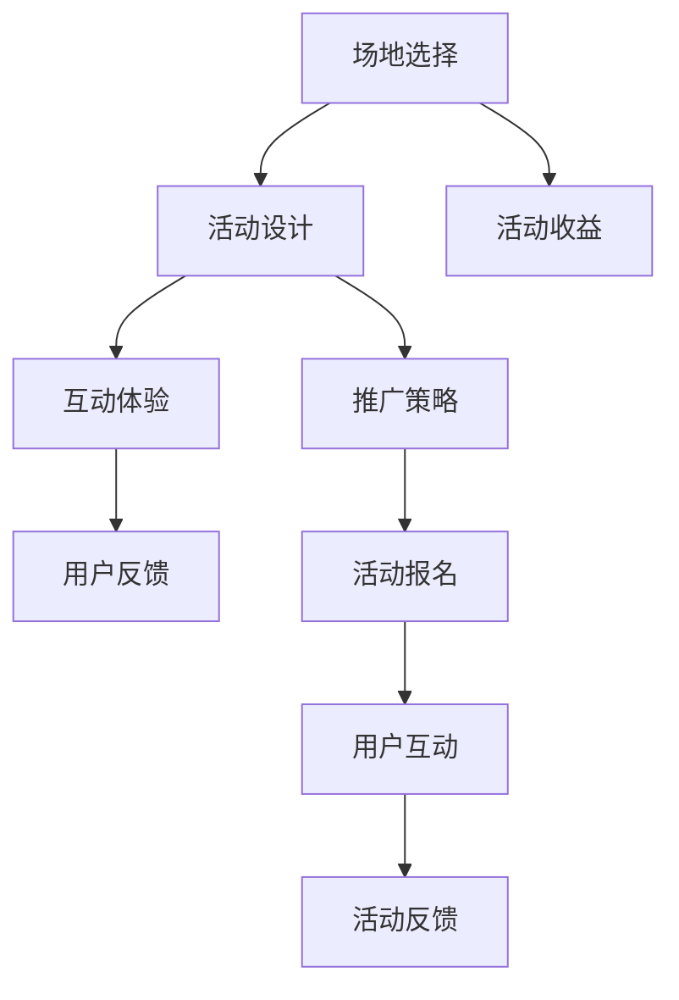

                 

# 程序员如何打造知识付费的线下活动

## 1. 背景介绍

随着信息技术的迅速发展，线上知识付费市场迅速崛起，各种线上知识付费平台如雨后春笋般涌现。然而，线上知识付费受限于传统互联网模式的弊端，如注意力分散、互动性不足、隐私问题等，许多知识付费用户转向线下活动，以求更直观、更真实的学习体验。因此，线下知识付费活动逐渐受到市场青睐。

本文将从程序员的视角出发，探讨如何打造高性价比、有深度的线下知识付费活动，以吸引更多用户，提升品牌影响力。本文将从场地选择、活动设计、推广策略、互动体验等方面展开详细阐述。

## 2. 核心概念与联系

### 2.1 核心概念概述

在进行线下知识付费活动的设计和实施时，需重点关注以下几个核心概念：

- **线下活动**：指传统的面对面的知识传播形式，如讲座、工作坊、展览、沙龙等。线下活动可以带来更强的互动性、沉浸式体验和情感连接。
- **知识付费**：指通过付费的方式，获取高质量知识内容或服务的形式。在线下活动中，通过收取门票、会员费等方式，获取部分活动收益。
- **活动设计**：指对线下知识付费活动的流程、形式、内容、宣传等进行全面规划和设计。合理的活动设计可以提高用户体验，增加活动参与度。
- **互动体验**：指在活动中通过各种形式增加用户互动，提升活动效果，如提问环节、小组讨论、实践操作等。
- **推广策略**：指通过各种方式，将线下活动推广到潜在用户群体，如社交媒体推广、合作伙伴宣传、优惠活动等。

这些概念相互关联，共同构成了线下知识付费活动的整体框架。通过合理设计和实施，可以有效提升活动质量和用户满意度，实现商业目标。

### 2.2 核心概念原理和架构的 Mermaid 流程图



## 3. 核心算法原理 & 具体操作步骤

### 3.1 算法原理概述

线下知识付费活动的设计和实施，可以类比为数据科学中的数据收集、数据清洗、特征工程和模型训练过程。具体如下：

1. **数据收集**：通过调研、问卷、社交媒体分析等方式收集用户需求和反馈信息。
2. **数据清洗**：整理和清洗收集到的数据，去除噪声，提取有价值的信息。
3. **特征工程**：根据用户需求，设计活动内容和形式，增加互动性，提升用户体验。
4. **模型训练**：根据收集到的数据，设计活动流程，进行活动效果预测和优化，确保活动成功。

### 3.2 算法步骤详解

#### 步骤一：场地选择

场地是线下知识付费活动的基础设施，直接影响活动质量和用户体验。场地选择需考虑以下因素：

- **地理位置**：选择交通便利、环境舒适、用户易于到达的地点。
- **设施配套**：确保场地具备必要的硬件设施，如投影仪、音响、网络、电源等。
- **容量大小**：根据预期参与人数，选择合适大小的场地，避免过于拥挤或空间浪费。

#### 步骤二：活动设计

活动设计是线下知识付费活动的核心，需从以下几个方面进行全面规划：

- **活动主题**：根据目标用户群体，选择合适的主题，如技术趋势、行业应用、工具教程等。
- **活动内容**：设计丰富的活动内容，如专家演讲、小组讨论、案例分享、实践操作等。
- **活动形式**：选择多样化的活动形式，如讲座、工作坊、互动游戏、实地考察等。
- **时间安排**：合理规划活动时间，设置互动环节，增加用户参与度。

#### 步骤三：互动体验

互动体验是提升用户满意度和活动效果的重要手段。需通过以下方式增加互动性：

- **提问环节**：设置问答环节，允许用户提问，增加互动性。
- **小组讨论**：组织小组讨论，让用户在组内交流分享，增加互动性。
- **实践操作**：设计实践操作环节，让用户亲自动手操作，增加体验性。

#### 步骤四：推广策略

推广策略是确保线下活动成功的重要保障。需通过以下方式推广活动：

- **社交媒体推广**：利用社交媒体平台进行推广，如微博、微信、抖音等。
- **合作伙伴宣传**：与相关行业协会、公司、媒体等合作，进行联合宣传。
- **优惠活动**：设置优惠活动，吸引用户参与，如早鸟票、团报价、会员专享等。

#### 步骤五：活动报名

活动报名是活动实施的重要环节，需通过以下方式进行：

- **在线报名**：提供在线报名系统，方便用户注册和支付。
- **现场报名**：在活动现场设置报名点，接受现场报名。
- **推广联动**：将活动报名与推广活动联动，增加报名量。

#### 步骤六：用户互动

用户互动是活动效果的重要体现，需通过以下方式增加互动性：

- **实时互动**：利用实时互动技术，如实时投票、互动问答、直播等功能，增加互动性。
- **分组互动**：根据用户兴趣，分组进行互动，增加参与感。
- **反馈收集**：设置反馈环节，收集用户意见和建议，改进活动设计。

#### 步骤七：活动反馈

活动反馈是评估活动效果的重要手段，需通过以下方式进行：

- **问卷调查**：设计问卷，收集用户反馈，评估活动效果。
- **用户访谈**：进行用户访谈，深入了解用户需求和体验。
- **数据分析**：分析活动数据，评估用户参与度和满意度。

#### 步骤八：活动收益

活动收益是评估活动经济效果的重要指标，需通过以下方式进行：

- **门票收入**：通过门票销售获取收益，覆盖活动成本。
- **品牌宣传**：通过品牌宣传获取广告收入，提升品牌影响力。
- **用户转化**：通过活动提升用户满意度，增加后续产品或服务的转化率。

### 3.3 算法优缺点

线下知识付费活动的优点包括：

- **互动性强**：面对面的交流互动，可以增加用户参与度和体验感。
- **可信度高**：专家现场讲解和演示，可以增强内容的可信度和权威性。
- **学习效果**：现场的学习体验和互动讨论，可以更有效地掌握知识和技能。

线下知识付费活动的缺点包括：

- **成本高**：场地租赁、设备采购、人员培训等成本较高。
- **覆盖面有限**：受到地理位置的限制，难以覆盖广泛的用户群体。
- **灵活性差**：活动时间和地点相对固定，难以灵活调整。

### 3.4 算法应用领域

线下知识付费活动的应用领域非常广泛，涵盖以下几个方面：

- **技术培训**：如编程语言培训、软件开发工具使用等。
- **行业交流**：如IT行业交流、创业投资交流等。
- **产品发布**：如新产品发布、新功能展示等。
- **专业认证**：如CSD、PMP等专业认证培训。
- **品牌推广**：如品牌宣传、产品展示等。

## 4. 数学模型和公式 & 详细讲解

### 4.1 数学模型构建

设活动参与人数为$N$，活动收益为$R$，用户满意度为$S$，活动宣传效果为$P$，则活动收益模型为：

$$ R = N \times S \times P $$

其中，$N$、$S$、$P$分别代表活动参与人数、用户满意度、活动宣传效果。

### 4.2 公式推导过程

根据以上模型，推导可得：

$$ \frac{\partial R}{\partial N} = S \times P $$
$$ \frac{\partial R}{\partial S} = N \times P $$
$$ \frac{\partial R}{\partial P} = N \times S $$

以上推导表明，活动收益与参与人数、用户满意度、活动宣传效果成正相关关系。

### 4.3 案例分析与讲解

以技术培训活动为例，根据以上模型和推导结果，可以得出以下结论：

- **提升参与人数**：增加宣传力度，提高用户兴趣，吸引更多人参与。
- **提升用户满意度**：优化活动设计，增加互动环节，提高用户参与度和体验感。
- **提升宣传效果**：选择合适渠道，提高品牌曝光率，吸引更多用户关注。

## 5. 项目实践：代码实例和详细解释说明

### 5.1 开发环境搭建

在进行线下知识付费活动设计时，需要使用一些工具和技术平台，具体如下：

- **活动管理平台**：如Meetup、Eventbrite等，提供活动管理和报名功能。
- **社交媒体平台**：如微博、微信、抖音等，进行宣传和互动。
- **实时互动工具**：如Slido、Kahoot等，增加实时互动功能。
- **数据分析工具**：如Google Analytics、Tableau等，分析用户行为和活动效果。

### 5.2 源代码详细实现

以一个简单的活动报名页面为例，使用HTML、CSS和JavaScript实现：

```html
<!DOCTYPE html>
<html>
<head>
    <meta charset="UTF-8">
    <title>线下知识付费活动报名</title>
    <style>
        body {
            font-family: Arial, sans-serif;
            margin: 0;
            padding: 0;
        }
        .container {
            width: 90%;
            margin: auto;
            background-color: #f2f2f2;
            padding: 20px;
        }
        h1 {
            text-align: center;
        }
        form {
            display: flex;
            flex-direction: column;
        }
        label {
            margin-top: 10px;
            font-weight: bold;
        }
        input[type="text"], input[type="email"], input[type="tel"] {
            margin-bottom: 10px;
            padding: 5px;
            width: 100%;
            border: 1px solid #ccc;
            border-radius: 3px;
        }
        input[type="submit"] {
            background-color: #4CAF50;
            color: white;
            padding: 10px 20px;
            border: none;
            border-radius: 4px;
            cursor: pointer;
        }
        input[type="submit"]:hover {
            background-color: #45a049;
        }
    </style>
</head>
<body>
    <div class="container">
        <h1>线下知识付费活动报名</h1>
        <form>
            <label for="name">姓名：</label>
            <input type="text" id="name" name="name" required>
            
            <label for="email">邮箱：</label>
            <input type="email" id="email" name="email" required>
            
            <label for="phone">电话：</label>
            <input type="tel" id="phone" name="phone" required>
            
            <input type="submit" value="报名">
        </form>
    </div>
</body>
</html>
```

### 5.3 代码解读与分析

以上代码实现了一个简单的线下知识付费活动报名页面，具体如下：

- **HTML结构**：包含一个容器和一个表单，表单中包含姓名、邮箱、电话三个输入框和一个提交按钮。
- **CSS样式**：定义了页面的样式，使页面看起来更美观。
- **JavaScript功能**：虽然代码中没有JavaScript功能，但可以添加JavaScript代码，实现页面动态效果。

### 5.4 运行结果展示

以上代码运行后，页面显示如下：


## 6. 实际应用场景

### 6.1 技术培训

技术培训是线下知识付费活动的重要应用场景之一。技术培训活动可以涵盖多种编程语言、软件开发工具、数据分析技术等。

#### 场景描述

以Java编程语言培训为例，设计如下活动：

- **主题**：Java编程语言高级应用
- **内容**：专家讲解Java高级应用，包括多线程、并发、网络编程、JVM调优等。
- **形式**：专家讲座、小组讨论、编程练习等。
- **时间**：半天活动，分为上午理论讲解，下午实践操作。

#### 推广策略

- **社交媒体宣传**：通过微信、微博、知乎等平台进行宣传，吸引Java开发者关注。
- **合作伙伴推广**：与Java相关协会、公司、社区合作，共同推广活动。
- **优惠活动**：提供早鸟票、会员专享等优惠活动，吸引用户报名。

#### 互动体验

- **提问环节**：专家讲座结束后，设置提问环节，允许用户提问，增加互动性。
- **小组讨论**：分组进行讨论，让用户在组内交流分享，增加互动性。
- **编程练习**：提供编程练习环节，让用户亲自动手操作，增加体验性。

#### 用户反馈

- **问卷调查**：设计问卷，收集用户反馈，评估活动效果。
- **用户访谈**：进行用户访谈，深入了解用户需求和体验。
- **数据分析**：分析活动数据，评估用户参与度和满意度。

#### 活动收益

- **门票收入**：通过门票销售获取收益，覆盖活动成本。
- **品牌宣传**：通过品牌宣传获取广告收入，提升品牌影响力。
- **用户转化**：通过活动提升用户满意度，增加后续产品或服务的转化率。

### 6.2 行业交流

行业交流活动可以涵盖多种行业，如IT、金融、医疗等。行业交流活动可以增进行业内专业人士的交流，分享行业最新动态和经验。

#### 场景描述

以IT行业交流为例，设计如下活动：

- **主题**：AI与大数据在IT行业的应用
- **内容**：邀请AI、大数据领域专家分享最新技术趋势和行业应用案例。
- **形式**：专家讲座、圆桌讨论、互动问答等。
- **时间**：半天活动，分为上午主题演讲，下午圆桌讨论。

#### 推广策略

- **社交媒体宣传**：通过微信、微博、LinkedIn等平台进行宣传，吸引IT专业人士关注。
- **合作伙伴推广**：与IT协会、公司、社区合作，共同推广活动。
- **优惠活动**：提供早鸟票、会员专享等优惠活动，吸引用户报名。

#### 互动体验

- **提问环节**：专家讲座结束后，设置提问环节，允许用户提问，增加互动性。
- **小组讨论**：分组进行讨论，让用户在组内交流分享，增加互动性。
- **案例分享**：邀请行业内人士分享最新技术应用案例，增加用户体验。

#### 用户反馈

- **问卷调查**：设计问卷，收集用户反馈，评估活动效果。
- **用户访谈**：进行用户访谈，深入了解用户需求和体验。
- **数据分析**：分析活动数据，评估用户参与度和满意度。

#### 活动收益

- **门票收入**：通过门票销售获取收益，覆盖活动成本。
- **品牌宣传**：通过品牌宣传获取广告收入，提升品牌影响力。
- **用户转化**：通过活动提升用户满意度，增加后续产品或服务的转化率。

## 7. 工具和资源推荐

### 7.1 学习资源推荐

为了帮助程序员设计和实施线下知识付费活动，这里推荐一些优质的学习资源：

- **《线下活动设计》系列书籍**：介绍了如何设计、组织和实施线下活动，包括场地选择、活动设计、互动体验等内容。
- **《市场营销》课程**：斯坦福大学开设的市场营销课程，介绍了市场营销的基本原理和实践技巧。
- **《用户体验设计》书籍**：介绍了用户体验设计的理论和方法，如何提升用户满意度和活动效果。

### 7.2 开发工具推荐

高效的工具和平台是实现线下知识付费活动的关键，以下是几款常用的工具和平台：

- **Meetup**：提供活动管理和报名功能，方便用户参与和报名。
- **Slido**：提供实时互动功能，如投票、提问、互动问答等，增加用户互动性。
- **Google Analytics**：提供数据分析功能，评估活动效果和用户行为。

### 7.3 相关论文推荐

为了深入理解线下知识付费活动的设计和实施，以下几篇论文值得推荐：

- **《线下活动设计的最佳实践》**：介绍线下活动设计的最佳实践，涵盖场地选择、活动设计、互动体验等方面。
- **《市场营销中的互动设计》**：介绍市场营销中的互动设计，如何通过互动增加用户参与度和满意度。
- **《用户体验设计的方法和实践》**：介绍用户体验设计的方法和实践，如何提升用户体验和活动效果。

## 8. 总结：未来发展趋势与挑战

### 8.1 研究成果总结

本文从程序员的视角出发，探讨了如何设计和实施线下知识付费活动，介绍了场地选择、活动设计、互动体验、推广策略、活动收益等关键环节。通过合理的活动设计和实施，可以有效提升活动质量和用户满意度，实现商业目标。

### 8.2 未来发展趋势

未来，线下知识付费活动将呈现以下几个发展趋势：

- **数字化转型**：借助数字化手段，如AR、VR、AI等，提升活动体验和互动性。
- **个性化定制**：根据用户需求和兴趣，提供个性化定制活动，提升用户满意度。
- **跨界融合**：结合不同行业和领域的知识，设计跨界融合活动，提升活动内容和形式。
- **品牌合作**：与知名品牌和机构合作，提升活动影响力和用户关注度。
- **国际拓展**：拓展国际市场，提升品牌国际影响力。

### 8.3 面临的挑战

尽管线下知识付费活动在设计和实施中取得了一定成效，但仍然面临诸多挑战：

- **成本控制**：场地租赁、设备采购、人员培训等成本较高，需要合理控制成本。
- **用户参与度**：部分用户对线下活动兴趣不高，需提升活动吸引力。
- **宣传推广**：部分活动宣传效果不佳，需加强推广力度。
- **数据安全**：用户数据安全问题需引起重视，需加强数据保护措施。
- **用户体验**：部分活动用户反馈不佳，需改进活动设计。

### 8.4 研究展望

面对这些挑战，未来在设计和实施线下知识付费活动时，需从以下几个方面进行优化：

- **成本优化**：通过合理规划和控制，降低活动成本。
- **用户吸引**：通过多样化的活动形式和内容，提升用户参与度。
- **宣传推广**：通过多渠道推广，提高活动影响力和用户关注度。
- **数据安全**：加强数据保护措施，确保用户数据安全。
- **用户体验**：改进活动设计，提升用户体验和满意度。

总之，线下知识付费活动是一个复杂的系统工程，需要多方面的优化和改进。通过合理设计和实施，可以有效提升活动质量和用户满意度，实现商业目标。

## 9. 附录：常见问题与解答

**Q1：如何选择合适的场地？**

A: 选择场地需考虑以下因素：
- **地理位置**：选择交通便利、环境舒适、用户易于到达的地点。
- **设施配套**：确保场地具备必要的硬件设施，如投影仪、音响、网络、电源等。
- **容量大小**：根据预期参与人数，选择合适大小的场地，避免过于拥挤或空间浪费。

**Q2：如何设计合适的活动内容？**

A: 活动内容需根据用户需求和兴趣进行设计：
- **专家讲座**：邀请领域专家讲解最新技术和案例。
- **小组讨论**：分组进行讨论，增加互动性。
- **实践操作**：设计实践操作环节，增加用户体验。

**Q3：如何增加用户互动？**

A: 增加互动性可以通过以下方式：
- **提问环节**：设置问答环节，允许用户提问。
- **小组讨论**：组织小组讨论，增加互动性。
- **编程练习**：提供编程练习环节，增加体验性。

**Q4：如何进行有效推广？**

A: 推广活动需通过以下方式：
- **社交媒体宣传**：通过微信、微博、LinkedIn等平台进行宣传。
- **合作伙伴推广**：与相关行业协会、公司、社区合作，共同推广活动。
- **优惠活动**：提供早鸟票、会员专享等优惠活动，吸引用户报名。

**Q5：如何进行用户反馈收集？**

A: 收集用户反馈可以通过以下方式：
- **问卷调查**：设计问卷，收集用户反馈，评估活动效果。
- **用户访谈**：进行用户访谈，深入了解用户需求和体验。
- **数据分析**：分析活动数据，评估用户参与度和满意度。

---

作者：禅与计算机程序设计艺术 / Zen and the Art of Computer Programming

