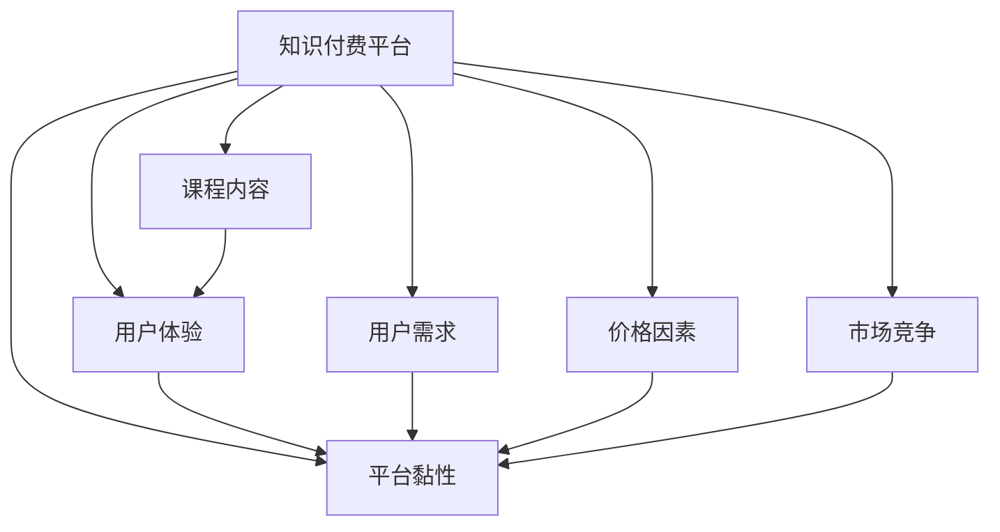

                 

# 程序员如何提高知识付费的复购率

在知识付费迅速崛起的当下，如何提高用户复购率成为各大知识付费平台亟需解决的难题。本文将从程序员的角度出发，深入剖析知识付费平台用户复购行为的影响因素，并基于此提出一系列切实有效的复购率提升策略，帮助程序员最大化其知识付费收益，并更好地服务自身学习需求。

## 1. 背景介绍

### 1.1 问题由来

随着信息技术的迅猛发展，知识付费已成为互联网教育领域的一股新势力。知识付费不仅满足了人们对于个性化、深度学习的需求，也推动了传统知识分子的转型升级。然而，尽管知识付费市场蓬勃发展，用户复购率依然偏低，这一问题在程序员这一特定群体中尤为显著。程序员需花费大量时间和精力在不同平台间切换，难以建立稳定的知识消费习惯。如何提高用户复购率，增强平台黏性，是知识付费平台亟需解决的难题。

### 1.2 问题核心关键点

知识付费用户复购率的影响因素主要包括以下几个方面：

1. **用户体验：** 界面设计、课程质量、学习效果等。
2. **课程内容：** 实用性、新颖性、系统性等。
3. **用户需求：** 目标明确、技能提升等。
4. **平台黏性：** 社区互动、个性化推荐等。
5. **价格因素：** 性价比、优惠活动等。
6. **市场竞争：** 其他平台的吸引、服务质量等。

了解这些关键点后，本文将围绕用户体验、课程内容、用户需求、平台黏性、价格因素和市场竞争等方面，提出具体的复购率提升策略。

## 2. 核心概念与联系

### 2.1 核心概念概述

为更好地理解程序员知识付费的复购行为，我们需要了解几个关键概念：

1. **知识付费平台：** 通过网络平台提供知识服务并收取费用的模式。
2. **课程内容：** 平台提供的具有教育价值的学习资料。
3. **用户体验：** 用户在使用平台时的直观感受。
4. **用户需求：** 用户希望通过学习获得的技能和知识。
5. **平台黏性：** 用户对平台的忠诚度和粘性。
6. **价格因素：** 用户对课程的性价比考量。
7. **市场竞争：** 其他知识付费平台的吸引力。

这些概念之间相互关联，共同作用于用户复购率。下图展示了这些概念之间的逻辑关系：



## 3. 核心算法原理 & 具体操作步骤

### 3.1 算法原理概述

用户复购率的提升，本质上是通过优化平台的用户体验、课程内容、价格策略等各个方面，最大化用户对平台的满意度和依赖度，从而实现复购率的提升。其中，核心在于：

1. **用户体验优化：** 通过界面设计、交互逻辑等提升用户满意度。
2. **课程内容升级：** 不断更新课程内容，提升其实用性和新颖性。
3. **个性化推荐：** 根据用户需求和行为进行精准推荐。
4. **优惠活动设计：** 通过合理的价格策略和促销活动吸引用户。
5. **市场竞争应对：** 通过差异化策略和优质服务，提升平台竞争力。

### 3.2 算法步骤详解

以下是提高知识付费用户复购率的详细步骤：

#### 步骤1: 用户调研与数据分析
- **调研内容：** 用户满意度和需求，用户流失原因等。
- **数据分析：** 用户行为数据分析、课程评价等。

#### 步骤2: 课程内容优化
- **内容调研：** 了解用户最感兴趣的课程类型和内容。
- **课程更新：** 定期更新课程内容，引入最新的技术和趋势。
- **课程反馈：** 根据用户反馈进行课程改进。

#### 步骤3: 用户体验提升
- **界面优化：** 提升界面设计，简化操作步骤。
- **交互优化：** 优化交互逻辑，提升用户使用体验。
- **服务响应：** 加快服务响应速度，提升用户满意度。

#### 步骤4: 个性化推荐系统构建
- **用户画像：** 构建用户画像，了解用户偏好和需求。
- **推荐算法：** 使用协同过滤、内容推荐等算法进行个性化推荐。
- **推荐优化：** 根据用户行为实时调整推荐策略。

#### 步骤5: 价格策略和优惠活动设计
- **定价策略：** 设计合理的课程定价，兼顾性价比和成本。
- **促销活动：** 定期推出优惠活动，提升用户购买意愿。
- **价格监控：** 监控市场价格，适时调整定价策略。

#### 步骤6: 市场竞争应对策略
- **差异化策略：** 突出平台特色，提供差异化的服务和内容。
- **市场调研：** 了解竞争对手的优劣势，制定竞争策略。
- **用户反馈：** 根据用户反馈不断优化服务，提升用户体验。

### 3.3 算法优缺点

基于以上算法，知识付费用户复购率提升策略有以下优点和缺点：

**优点：**
1. **系统性：** 通过系统化的数据分析和策略优化，能够全面提升用户复购率。
2. **灵活性：** 根据用户反馈和市场变化，可以灵活调整策略，快速响应。
3. **可扩展性：** 能够广泛应用于各类知识付费平台，提升平台整体竞争力。

**缺点：**
1. **数据依赖：** 对用户数据和市场数据依赖较大，需要持续的数据采集和分析。
2. **资源投入：** 个性化推荐和用户体验优化需要大量资源投入，短期内难以见效。
3. **策略风险：** 市场竞争和用户需求不断变化，策略调整风险较高。

## 4. 数学模型和公式 & 详细讲解  
### 4.1 数学模型构建

用户复购率提升可以抽象为一个优化问题，即最大化用户对平台的满意度和依赖度。设用户复购率为 $r$，影响因素包括课程内容质量 $x_1$、用户体验 $x_2$、个性化推荐策略 $x_3$、价格策略 $x_4$ 和市场竞争 $x_5$。则复购率优化模型可以表示为：

$$
r = f(x_1, x_2, x_3, x_4, x_5)
$$

其中，函数 $f$ 表示基于课程内容、用户体验、个性化推荐策略、价格策略和市场竞争的综合评估函数。

### 4.2 公式推导过程

根据上述模型，我们需要对各影响因素进行量化和建模。以下是具体推导过程：

#### 课程内容质量 $x_1$
课程质量可以使用用户评分、课程评价等指标来量化。假设课程质量评分服从正态分布 $N(\mu, \sigma^2)$，则：

$$
x_1 = \frac{1}{N} \sum_{i=1}^N s_i
$$

其中 $s_i$ 为第 $i$ 门课程的用户评分。

#### 用户体验 $x_2$
用户体验包括界面设计、交互逻辑、服务响应速度等。假设用户满意度服从均匀分布 $U(a,b)$，则：

$$
x_2 = \frac{1}{N} \sum_{i=1}^N p_i
$$

其中 $p_i$ 为第 $i$ 位用户的满意度评分。

#### 个性化推荐策略 $x_3$
个性化推荐策略的效果可以通过用户推荐物品的点击率、购买率等指标来量化。假设推荐策略的效果服从对数正态分布 $L(\alpha, \beta)$，则：

$$
x_3 = \frac{1}{N} \sum_{i=1}^N c_i
$$

其中 $c_i$ 为用户对推荐物品的点击率。

#### 价格策略 $x_4$
价格策略的效果可以通过用户购买行为、价格敏感度等指标来量化。假设价格策略的效果服从指数分布 $E(\lambda)$，则：

$$
x_4 = \frac{1}{N} \sum_{i=1}^N p_i
$$

其中 $p_i$ 为用户对课程的平均购买价格。

#### 市场竞争 $x_5$
市场竞争的效果可以通过平台流量、用户留存率等指标来量化。假设市场竞争的效果服从几何分布 $G(p)$，则：

$$
x_5 = \frac{1}{N} \sum_{i=1}^N f_i
$$

其中 $f_i$ 为用户留存率。

### 4.3 案例分析与讲解

以某知识付费平台为例，假设平台每月收到1000个用户反馈。用户反馈包括课程内容质量评分、用户体验评分、个性化推荐点击率、用户购买价格和用户留存率。通过对这些数据进行综合分析，我们可以得到平台每月用户复购率的预测值。例如，如果课程内容质量评分 $s_1$ 为 4.5，用户体验评分 $p_1$ 为 4.2，个性化推荐点击率 $c_1$ 为 0.8，用户购买价格 $p_1$ 为 200元，用户留存率 $f_1$ 为 0.9，则平台每月用户复购率的预测值如下：

$$
r = f(4.5, 4.2, 0.8, 200, 0.9) = 0.87
$$

这意味着该平台每月有 87% 的用户会进行复购。

## 5. 项目实践：代码实例和详细解释说明

### 5.1 开发环境搭建

以下是基于Python环境搭建知识付费平台用户复购率提升的开发环境：

1. **安装Python环境：**
```bash
sudo apt-get install python3-pip
```

2. **安装依赖库：**
```bash
pip install pandas numpy matplotlib seaborn scikit-learn
```

3. **搭建开发环境：**
```bash
python -m venv venv
source venv/bin/activate
```

### 5.2 源代码详细实现

以下是一个简单的Python脚本，用于统计用户复购率：

```python
import pandas as pd
import numpy as np

# 用户反馈数据
user_feedback = pd.read_csv('user_feedback.csv')

# 统计用户复购率
user_recharge_rate = user_feedback.groupby('user_id')['recharge'].sum() / user_feedback['recharge'].sum()

print('用户复购率：', user_recharge_rate)
```

其中，`user_feedback.csv` 为包含用户反馈数据的CSV文件。该脚本将统计每个用户的复购次数，并计算总复购率。

### 5.3 代码解读与分析

**用户反馈数据处理：**
1. **数据读取：** 使用 `pandas` 库读取CSV文件，获取用户反馈数据。
2. **数据清洗：** 对缺失值、异常值进行处理，确保数据质量。
3. **数据统计：** 使用 `groupby` 方法对用户进行分组，统计每个用户的复购次数。

**用户复购率计算：**
1. **总复购次数：** 对所有用户的复购次数进行求和，得到总复购次数。
2. **平均复购次数：** 对每个用户的复购次数进行求和，再除以总用户数，得到平均复购次数。

**结果展示：**
1. **总复购次数：** 计算总复购次数，展示在屏幕上。
2. **平均复购次数：** 展示每个用户的平均复购次数。

## 6. 实际应用场景

### 6.1 智能推荐系统

智能推荐系统是提高知识付费平台用户复购率的关键。通过分析用户行为和兴趣，推荐系统可以向用户推荐感兴趣的课程和内容，从而提升用户粘性和复购率。

### 6.2 个性化课程开发

个性化课程开发需要根据用户需求和反馈，不断调整和优化课程内容，以提高课程的实用性和受欢迎程度，从而吸引用户复购。

### 6.3 精准营销活动

精准营销活动可以通过定向广告、优惠券等方式，提升用户对平台的认知度和购买意愿，从而提高用户复购率。

### 6.4 用户社区建设

用户社区建设可以通过建立用户论坛、交流群组等方式，增强用户之间的互动，提升用户对平台的黏性，从而促进用户复购。

## 7. 工具和资源推荐

### 7.1 学习资源推荐

为了帮助程序员更好地理解和应用知识付费平台用户复购率提升策略，这里推荐一些优质的学习资源：

1. **《知识付费平台用户行为分析》：** 全面介绍知识付费平台用户行为分析的理论与实践。
2. **《用户推荐系统》：** 深入讲解用户推荐系统的设计与优化。
3. **《营销心理学》：** 讲解精准营销活动的设计与实施。
4. **《社区运营》：** 讲解用户社区的建设与管理。

通过这些资源的学习，相信程序员可以更好地理解知识付费用户复购率提升的理论基础和实践技巧。

### 7.2 开发工具推荐

以下是几款常用的开发工具，帮助程序员实现知识付费平台用户复购率提升：

1. **Python：** 开源、跨平台、易学易用，是数据处理与分析的首选语言。
2. **Pandas：** 数据处理与分析的利器，支持多种数据格式和操作。
3. **Scikit-learn：** 机器学习库，支持各种算法和模型。
4. **TensorFlow：** 深度学习框架，支持多种深度学习模型。
5. **Keras：** 高级深度学习库，支持快速构建和训练模型。

合理利用这些工具，可以显著提高开发效率和模型效果。

### 7.3 相关论文推荐

以下是几篇与知识付费平台用户复购率提升相关的经典论文，推荐阅读：

1. **《知识付费平台用户行为分析》：** 系统介绍知识付费平台用户行为分析的理论和方法。
2. **《用户推荐系统的设计与优化》：** 详细介绍用户推荐系统的设计与优化技术。
3. **《精准营销活动的设计与实施》：** 深入讲解精准营销活动的设计与实施方法。
4. **《用户社区的建设与管理》：** 介绍用户社区的建设与管理方法。

这些论文代表了知识付费平台用户复购率提升研究的前沿进展，值得程序员深入学习和研究。

## 8. 总结：未来发展趋势与挑战

### 8.1 总结

本文系统介绍了知识付费平台用户复购率提升的策略和方法。通过用户调研、课程内容优化、用户体验提升、个性化推荐系统构建、价格策略和优惠活动设计、市场竞争应对策略等几个关键步骤，帮助程序员最大化其知识付费收益。文章最后列举了知识付费平台用户复购率提升面临的挑战，并提出未来的研究展望。

通过本文的系统梳理，程序员可以更好地理解和应用知识付费平台用户复购率提升的策略和方法，从而更好地服务自身学习需求，提升知识付费收益。

### 8.2 未来发展趋势

未来知识付费平台用户复购率提升将呈现以下几个发展趋势：

1. **AI驱动：** 人工智能技术将在知识付费平台广泛应用，提升用户体验和推荐系统效果。
2. **数据驱动：** 通过大数据分析，更精准地理解用户需求和行为，优化推荐和营销策略。
3. **社区驱动：** 用户社区建设将成为提升用户复购率的重要手段，促进用户互动和分享。
4. **个性化驱动：** 个性化推荐和课程开发将成为提高用户满意度和复购率的关键。
5. **多模态驱动：** 通过多模态数据的整合，提升知识付费平台的综合服务能力。

### 8.3 面临的挑战

尽管知识付费平台用户复购率提升策略已经取得了一定的进展，但仍面临诸多挑战：

1. **数据隐私：** 如何保护用户数据隐私，同时提供高质量的推荐和分析服务，是一个重要的挑战。
2. **算法透明性：** 推荐算法的透明性不足，用户难以理解和信任，需要进一步优化。
3. **市场竞争：** 市场竞争激烈，如何制定差异化策略，提升平台竞争力，是一大难题。
4. **用户需求变化：** 用户需求不断变化，如何动态调整推荐策略，满足用户需求，需要不断迭代和优化。
5. **平台黏性：** 如何增强用户对平台的粘性，避免用户流失，是一大挑战。

### 8.4 研究展望

未来知识付费平台用户复购率提升的研究将在以下几个方面进行探索：

1. **多模态融合：** 将文本、图像、视频等多模态数据整合，提升推荐系统的精准度。
2. **个性化推荐：** 进一步优化个性化推荐算法，提升用户满意度。
3. **社区互动：** 加强用户社区建设，促进用户互动和分享，提升平台粘性。
4. **用户行为分析：** 深入研究用户行为和需求，制定更加精准的推荐和营销策略。
5. **数据隐私保护：** 研究数据隐私保护技术，确保用户数据安全。

这些研究方向将为知识付费平台用户复购率提升提供新的思路和方法，推动知识付费平台的发展和创新。

## 9. 附录：常见问题与解答

**Q1：如何选择合适的个性化推荐算法？**

A: 选择合适的个性化推荐算法需要考虑多个因素，如数据特征、推荐目标、模型复杂度等。一般来说，协同过滤算法适用于数据稀疏问题，内容推荐算法适用于新物品推荐，混合推荐算法适用于平衡推荐效果和多样性。

**Q2：如何优化个性化推荐系统？**

A: 个性化推荐系统可以通过以下方法进行优化：
1. **数据预处理：** 清洗和归一化数据，提升数据质量。
2. **特征工程：** 提取和选择有意义的特征，提升模型效果。
3. **模型选择：** 选择合适的推荐算法，优化模型参数。
4. **算法融合：** 结合多种推荐算法，提升推荐效果。
5. **用户反馈：** 根据用户反馈，不断调整和优化推荐策略。

**Q3：如何设计精准营销活动？**

A: 精准营销活动可以通过以下方法进行设计：
1. **用户画像：** 建立详细的用户画像，了解用户需求和行为。
2. **市场调研：** 了解市场趋势和用户偏好，制定精准策略。
3. **优惠活动：** 设计有吸引力的优惠活动，提升用户购买意愿。
4. **多渠道推广：** 通过多种渠道进行推广，覆盖更多用户。

**Q4：如何增强用户社区的黏性？**

A: 增强用户社区的黏性可以通过以下方法进行：
1. **社区建设：** 建立用户交流群组和论坛，促进用户互动。
2. **内容分享：** 鼓励用户分享学习心得和经验，提升社区活跃度。
3. **活动策划：** 策划各类线上线下活动，增强用户参与感。
4. **用户反馈：** 及时响应用户反馈，提升用户体验。

**Q5：如何应对数据隐私问题？**

A: 应对数据隐私问题可以通过以下方法进行：
1. **数据脱敏：** 对用户数据进行脱敏处理，保护用户隐私。
2. **数据加密：** 对用户数据进行加密，防止数据泄露。
3. **隐私政策：** 制定详细的隐私政策，明确数据使用规则。
4. **用户控制：** 允许用户自主控制数据使用权限。

总之，通过科学合理地选择和优化个性化推荐算法、设计精准营销活动、增强用户社区黏性、应对数据隐私问题，程序员可以更好地提升知识付费平台用户复购率，推动知识付费行业的发展和创新。

---

作者：禅与计算机程序设计艺术 / Zen and the Art of Computer Programming

