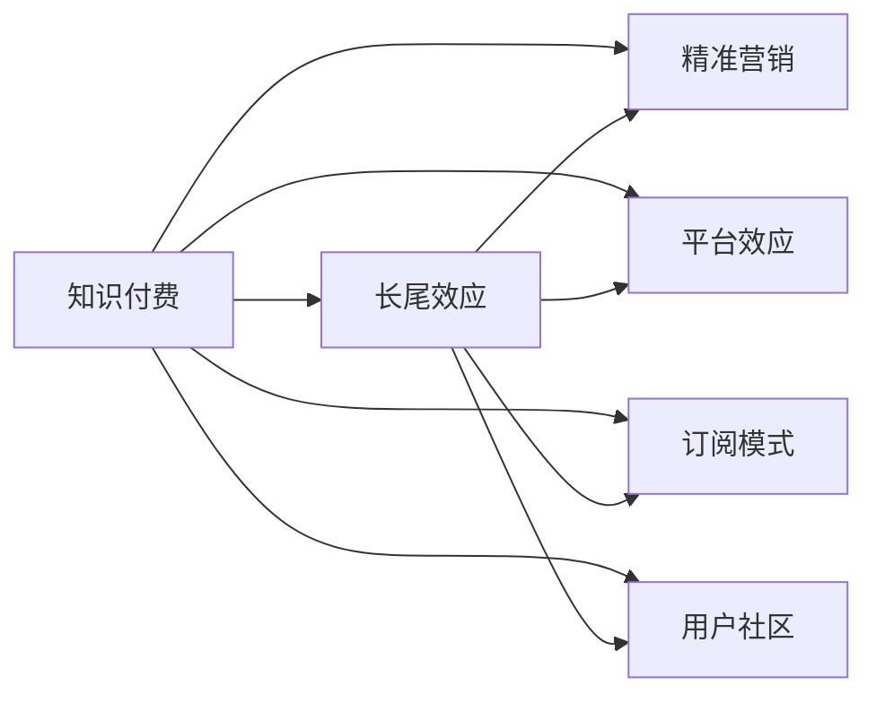

                 

# 程序员如何构建知识付费的长尾效应

## 1. 背景介绍

在数字经济的浪潮中，知识付费作为一种新兴的商业模式，以其独特的市场定位和价值创造方式，成为了各大互联网平台争相探索的新领域。然而，面对高度同质化的内容和服务，如何在激烈的市场竞争中突围，构建具有持续竞争力的长尾效应，成为每一个知识付费平台面临的重要课题。程序员作为这一商业模式的核心参与者，如何利用技术和资源，打造具有个性和价值的知识付费产品，成为了本文探讨的核心议题。

### 1.1 问题由来

知识付费领域的高速发展，使得内容生产与消费的连接更加紧密，但也带来了内容质量参差不齐、需求与供给错配等问题。以程序员为例，这一群体不仅需要掌握前沿技术，更需要具备解决实际问题的能力。现有的知识付费平台往往以通用性内容为主，难以满足程序员对深度、实用、具体知识的渴求。此外，随着开发者社区的日益活跃，越来越多的开发者开始尝试通过知识付费获得额外收入，但缺乏有效的平台和机制，使得知识付费的长尾效应难以实现。

### 1.2 问题核心关键点

在知识付费领域，长尾效应指的是虽然大部分内容的消费量较低，但总体销量却不低。只有通过构建具有独特性和专业性的知识产品，才能吸引并留住那些具有特殊需求的用户。因此，如何打造高质量、定制化的知识产品，成为了知识付费平台的重要挑战。特别是对于程序员这一群体，需要构建针对技术栈、工作场景和职业发展等深度内容，才能实现知识的长期价值。

## 2. 核心概念与联系

### 2.1 核心概念概述

要构建知识付费的长尾效应，需要从多个层面进行系统性的规划和执行。本文将介绍几个核心概念及其关联，帮助理解长尾效应的构建过程：

- **知识付费**：指通过付费获得特定知识产品的模式，强调知识的深度和专业性。
- **长尾效应**：指虽然大部分产品销量较低，但总体销量却不低，强调小众市场的聚合效应。
- **精准营销**：利用数据分析和算法，实现对用户需求的精准把握，提高转化率和粘性。
- **平台效应**：构建一个具有高互动性、高丰富性、高可信度的知识交流平台，提升内容价值和用户满意度。
- **订阅模式**：通过定期推送深度内容，建立用户粘性，增加长期收益。
- **用户社区**：构建用户社区，鼓励用户生成内容，形成良性互动，提升平台活跃度。

这些概念之间相互关联，共同构成了知识付费长尾效应的构建框架。本文将从这些核心概念出发，深入分析长尾效应的实现机制，并提出具体的构建策略。

### 2.2 核心概念原理和架构的 Mermaid 流程图



这个流程图展示了知识付费长尾效应的构建过程。从知识付费出发，通过精准营销、平台效应、订阅模式和用户社区等多维度的协同作用，构建具有长尾效应的知识产品。

## 3. 核心算法原理 & 具体操作步骤

### 3.1 算法原理概述

长尾效应实现的核心在于通过精准营销和大数据分析，挖掘用户未被满足的个性化需求，通过订阅模式和高互动性平台，提升用户粘性和长期价值。本文将介绍如何利用机器学习和大数据技术，实现这一目标。

- **精准营销算法**：通过分析用户行为数据，构建用户画像，预测用户兴趣和需求，实现个性化推荐和精准营销。
- **平台效应算法**：构建高互动性平台，利用用户生成内容、社区讨论等方式，提升内容质量和平台粘性。
- **订阅模式算法**：通过定期推送深度内容，建立用户长期粘性，提升平台长期收益。

### 3.2 算法步骤详解

实现长尾效应的主要步骤包括：

**Step 1: 数据收集与预处理**
- 收集用户行为数据，如访问记录、搜索关键词、订阅内容等。
- 对数据进行清洗和标准化，去除噪声和异常值，确保数据质量。

**Step 2: 用户画像构建**
- 利用机器学习算法，如聚类、分类等，对用户行为数据进行建模，构建用户画像。
- 通过用户画像，了解用户兴趣、需求和行为习惯。

**Step 3: 内容推荐与精准营销**
- 基于用户画像，利用推荐算法生成个性化内容推荐列表。
- 通过广告投放、邮件推送等方式，进行精准营销，提高转化率。

**Step 4: 平台社区建设**
- 构建高互动性的知识交流平台，鼓励用户生成内容、参与讨论。
- 利用社区算法，发现优质内容，提升平台活跃度。

**Step 5: 深度内容推送与订阅模式**
- 定期推送深度技术文章、项目案例等，提升用户粘性。
- 引入订阅模式，通过定期推送内容和专属活动，建立长期合作关系。

### 3.3 算法优缺点

精准营销和大数据分析是实现长尾效应的关键技术手段，具有以下优点：
1. 通过数据分析，深入挖掘用户需求，实现个性化推荐。
2. 提高营销效率，精准触达目标用户，提升转化率。
3. 提升用户粘性，增加平台长期收益。

然而，这些算法也存在一些缺点：
1. 对数据质量要求高，数据收集和预处理过程较为复杂。
2. 算法模型构建复杂，需要大量的数据和计算资源。
3. 对用户隐私保护提出挑战，需要采取相应的隐私保护措施。

### 3.4 算法应用领域

精准营销和大数据分析不仅适用于知识付费领域，还可以广泛应用到电商、金融、医疗等多个行业。例如：

- 电商领域：通过分析用户购买历史和行为数据，实现个性化推荐和精准营销，提升用户购物体验和转化率。
- 金融领域：利用大数据分析，进行用户风险评估和产品推荐，提升用户体验和忠诚度。
- 医疗领域：通过对患者病历和行为数据的分析，提供个性化的诊疗建议，提升医疗服务质量。

## 4. 数学模型和公式 & 详细讲解 & 举例说明

### 4.1 数学模型构建

长尾效应的实现主要依赖于机器学习算法和大数据分析。本文将介绍几个关键的数学模型，帮助理解长尾效应的实现机制。

**精准营销模型**
假设用户对某一内容的兴趣为 $I_u$，内容质量为 $Q_c$，推荐概率为 $P_r$，则精准营销模型的目标函数可以表示为：
$$
\max_{I_u, Q_c, P_r} \sum_{u,c} I_u Q_c P_r
$$
其中，$\sum_{u,c}$ 表示所有用户和内容对。

**平台效应模型**
假设平台上有 $N$ 个用户，每个用户每天平均访问次数为 $T_u$，生成内容数量 $C_u$，则平台效应的目标函数可以表示为：
$$
\max_{T_u, C_u} \sum_{u} T_u C_u
$$
其中，$\sum_{u}$ 表示所有用户。

**订阅模式模型**
假设用户每月订阅次数为 $S_u$，订阅内容价值为 $V_c$，则订阅模式的目标函数可以表示为：
$$
\max_{S_u, V_c} \sum_{u,c} S_u V_c
$$
其中，$\sum_{u,c}$ 表示所有用户和内容对。

### 4.2 公式推导过程

精准营销模型的目标函数需要对用户兴趣 $I_u$ 和内容质量 $Q_c$ 进行最大化，同时约束推荐概率 $P_r$ 在合理范围内。通过对用户行为数据进行分析，可以构建出精准营销模型，实现个性化推荐和精准营销。

平台效应模型通过最大化用户平均访问次数和生成内容数量，提升平台活跃度和内容质量。利用大数据分析，可以挖掘用户的活跃行为和兴趣，从而提升平台的用户互动性。

订阅模式模型通过最大化用户订阅次数和内容价值，增加平台的长期收益。通过定期推送深度内容，建立用户粘性，从而实现订阅模式的持续性和稳定性。

### 4.3 案例分析与讲解

以程序员知识付费平台为例，分析如何构建长尾效应。

**数据收集与预处理**
通过爬虫技术，从开发者社区、技术博客、编程问答平台等渠道收集程序员行为数据，包括访问记录、搜索关键词、阅读时长等。对数据进行清洗和标准化，去除噪声和异常值。

**用户画像构建**
利用机器学习算法，如K-means聚类、支持向量机(SVM)等，对用户行为数据进行建模，构建用户画像。通过用户画像，了解程序员的技术栈、工作场景和职业发展需求。

**内容推荐与精准营销**
基于用户画像，利用推荐算法生成个性化内容推荐列表。通过广告投放、邮件推送等方式，进行精准营销，提高转化率。例如，根据用户的历史搜索记录和浏览行为，推荐相关的编程文章和课程。

**平台社区建设**
构建高互动性的知识交流平台，鼓励程序员生成内容、参与讨论。利用社区算法，发现优质内容，提升平台活跃度。例如，设置社区排行榜和奖励机制，激励程序员分享技术经验。

**深度内容推送与订阅模式**
定期推送深度技术文章、项目案例等，提升程序员粘性。引入订阅模式，通过定期推送内容和专属活动，建立长期合作关系。例如，推出专属会员服务，定期推送深度文章、技术视频和在线课程。

## 5. 项目实践：代码实例和详细解释说明

### 5.1 开发环境搭建

要进行知识付费平台长尾效应的构建，需要搭建相应的开发环境。以下是Python环境搭建的步骤：

1. 安装Python：从官网下载并安装Python 3.6以上版本。
2. 安装Pandas、NumPy、Scikit-learn、TensorFlow等数据分析和机器学习库。
3. 安装Flask、Django等Web框架，搭建Web应用。
4. 安装MySQL、MongoDB等数据库，存储用户行为数据和内容信息。
5. 安装Nginx、Apache等Web服务器，部署Web应用。

### 5.2 源代码详细实现

下面以一个简单的知识推荐系统为例，介绍如何实现精准营销和内容推荐。

**数据收集与预处理**
```python
import pandas as pd
import numpy as np
from sklearn.preprocessing import StandardScaler

# 读取用户行为数据
data = pd.read_csv('user_behavior.csv')

# 数据清洗与预处理
data = data.dropna()
data = data.drop_duplicates()
data = StandardScaler().fit_transform(data[['visit_count', 'search_terms', 'read_duration']])
```

**用户画像构建**
```python
from sklearn.cluster import KMeans
from sklearn.decomposition import PCA

# 利用K-means聚类构建用户画像
kmeans = KMeans(n_clusters=5, random_state=0)
data = pd.DataFrame(data, columns=['visit_count', 'search_terms', 'read_duration'])
user_clusters = kmeans.fit_predict(data)
data['user_cluster'] = user_clusters
```

**内容推荐**
```python
from sklearn.metrics.pairwise import cosine_similarity
from sklearn.feature_extraction.text import TfidfVectorizer

# 内容向量化
tfidf = TfidfVectorizer(stop_words='english')
content = ['title', 'abstract', 'body']
tfidf_matrix = tfidf.fit_transform(content)

# 计算内容相似度
similarity_matrix = cosine_similarity(tfidf_matrix, tfidf_matrix)

# 基于相似度推荐内容
def recommend_content(user, n=5):
    user_content = tfidf_matrix[user]
    similarities = np.dot(user_content, similarity_matrix[user])
    recommended_indices = np.argsort(similarities)[-n:]
    return list(np.array(content)[recommended_indices])
```

### 5.3 代码解读与分析

在这个简单的推荐系统中，我们首先收集了用户行为数据，包括访问次数、搜索关键词、阅读时长等。通过对数据进行清洗和标准化，去除噪声和异常值，确保数据质量。接着，利用K-means聚类算法，对用户行为数据进行建模，构建用户画像，了解程序员的技术栈、工作场景和职业发展需求。最后，基于用户画像，利用相似度计算方法，生成个性化内容推荐列表，实现精准营销。

## 6. 实际应用场景

### 6.1 程序员社区

程序员社区是知识付费领域的重要应用场景。通过精准营销和大数据分析，可以构建高质量、个性化的知识内容，吸引程序员群体，提升平台活跃度。例如，CSDN、Stack Overflow等平台，通过精准推荐编程技术和项目案例，满足了程序员对深度知识和实战经验的需求，提升了用户粘性。

### 6.2 技术博客和文章平台

技术博客和文章平台也是知识付费的重要组成部分。通过社区建设和技术分享，可以构建高互动性平台，提升用户生成内容的能力和质量。例如，Medium平台，通过社区推荐和内容奖励机制，鼓励开发者分享技术文章，形成了良性的互动氛围。

### 6.3 在线教育平台

在线教育平台是知识付费的主要形式之一。通过精准营销和订阅模式，可以提升用户粘性，增加长期收益。例如，Udacity平台，通过定期推送深度技术文章和在线课程，提升了用户的长期粘性和满意度。

### 6.4 未来应用展望

随着技术的发展，知识付费平台的长尾效应将更加显著。未来，长尾效应将在以下几个方面取得突破：

1. **个性化推荐**：通过更加精准的用户画像和推荐算法，实现更个性化的内容推荐，提升用户满意度。
2. **社区互动**：利用社区算法和大数据分析，发现优质内容，提升平台活跃度。
3. **订阅模式**：通过定期推送深度内容，建立用户粘性，增加平台长期收益。
4. **人工智能应用**：引入自然语言处理和深度学习技术，实现更加智能化的推荐和营销。

## 7. 工具和资源推荐

### 7.1 学习资源推荐

为了帮助开发者深入理解长尾效应，以下是一些优质的学习资源：

1. 《Python数据分析》系列书籍：深入介绍数据分析和机器学习算法，适合初学者和进阶者。
2. 《深度学习入门》视频教程：讲解深度学习算法和应用，适合机器学习和数据科学初学者。
3. 《机器学习实战》博客：讲解机器学习算法和案例，适合实践者和开发者。
4. Coursera《机器学习》课程：由斯坦福大学开设的机器学习经典课程，适合深度学习初学者。
5. Kaggle竞赛平台：通过参加数据科学竞赛，提升数据处理和算法建模能力。

### 7.2 开发工具推荐

为了高效构建知识付费平台，以下是一些常用的开发工具：

1. PyTorch：基于Python的深度学习框架，适合实现推荐算法和社区算法。
2. TensorFlow：由Google主导的深度学习框架，适合构建复杂的推荐系统。
3. Flask和Django：Web框架，适合搭建知识付费平台的Web应用。
4. MySQL和MongoDB：数据库，适合存储用户行为数据和内容信息。
5. Nginx和Apache：Web服务器，适合部署Web应用。

### 7.3 相关论文推荐

为了进一步理解长尾效应的实现机制，以下是一些推荐的学术论文：

1. 《K-means: Algorithms and applications》：介绍K-means聚类算法的原理和应用。
2. 《Recommender Systems Handbook》：详细介绍推荐算法的理论和实践，涵盖协同过滤、内容过滤、混合推荐等多个方面。
3. 《Crowdsourcing and Social Media Mining》：介绍社区推荐和社交媒体分析的算法和技术。
4. 《Information Retrieval》：介绍信息检索和推荐算法的经典书籍，适合深入理解长尾效应。
5. 《Deep Learning for AI》：讲解深度学习算法和应用，适合了解人工智能在长尾效应中的应用。

## 8. 总结：未来发展趋势与挑战

### 8.1 研究成果总结

本文从精准营销、平台效应、订阅模式等多个角度，探讨了知识付费平台如何构建长尾效应。通过数据分析和机器学习算法，实现了个性化推荐和精准营销，构建了高互动性的平台，提升了用户粘性，实现了长期收益。

### 8.2 未来发展趋势

未来，知识付费领域的长尾效应将更加显著。主要发展趋势包括：

1. **数据质量提升**：随着数据收集和处理技术的进步，数据质量将得到显著提升，有助于更加精准地分析和挖掘用户需求。
2. **算法优化**：通过优化推荐算法和社区算法，实现更智能化的推荐和营销，提升用户满意度。
3. **技术融合**：将自然语言处理、深度学习等技术融入长尾效应的构建中，提升平台的智能化水平。
4. **用户参与度提升**：通过社区建设和技术分享，提升用户生成内容和互动的积极性，增强平台的活跃度。
5. **长尾效应泛化**：将长尾效应推广到更多行业，如电商、金融、医疗等，实现广泛的商业价值。

### 8.3 面临的挑战

尽管长尾效应的构建具有巨大潜力，但在实现过程中仍面临以下挑战：

1. **数据隐私保护**：用户行为数据的收集和使用涉及隐私问题，需要采取相应的隐私保护措施。
2. **算法模型复杂性**：精准营销和社区推荐的算法模型较为复杂，需要大量的数据和计算资源。
3. **用户信任度提升**：平台需要通过高质量内容和用户互动，提升用户的信任度和满意度。
4. **技术迭代更新**：随着技术的发展，需要不断更新和优化推荐算法和社区算法，保持平台竞争力。

### 8.4 研究展望

未来的研究将集中在以下几个方面：

1. **隐私保护技术**：研究如何在数据收集和使用过程中保护用户隐私，提升用户信任度。
2. **算法模型优化**：通过优化推荐算法和社区算法，提升算法的效率和准确性，实现更智能化的推荐和营销。
3. **跨领域应用**：将长尾效应推广到更多行业，实现广泛的商业价值。
4. **用户参与度提升**：通过社区建设和技术分享，提升用户生成内容和互动的积极性，增强平台的活跃度。
5. **技术融合**：将自然语言处理、深度学习等技术融入长尾效应的构建中，提升平台的智能化水平。

## 9. 附录：常见问题与解答

**Q1：如何保证数据质量？**

A: 数据质量是长尾效应构建的基础。为了保证数据质量，需要从数据收集、处理和分析多个环节进行把控：
1. 数据收集环节，通过规范数据采集流程，减少噪声和异常值。
2. 数据处理环节，通过数据清洗、标准化和预处理，提升数据质量。
3. 数据分析环节，通过算法模型和参数调优，提升数据分析的准确性和可靠性。

**Q2：如何提升用户粘性？**

A: 用户粘性是长尾效应实现的关键。为了提升用户粘性，可以从以下几个方面入手：
1. 提供高质量、个性化的内容推荐，满足用户需求。
2. 构建高互动性的平台，鼓励用户生成内容和参与讨论。
3. 通过定期推送深度内容和技术分享，提升用户满意度和忠诚度。

**Q3：如何保护用户隐私？**

A: 用户隐私保护是构建长尾效应必须考虑的重要问题。为了保护用户隐私，可以采取以下措施：
1. 在数据收集环节，遵循相关法律法规，获得用户同意。
2. 在数据处理环节，采用数据脱敏和加密技术，保护用户隐私。
3. 在数据分析环节，限制数据访问权限，防止数据泄露。

**Q4：如何提升算法效率？**

A: 算法效率是长尾效应实现的重要指标。为了提升算法效率，可以从以下几个方面入手：
1. 数据预处理，减少数据量，提升数据处理效率。
2. 算法优化，通过参数调优和模型压缩，提升算法效率。
3. 并行计算，利用分布式计算技术，提升计算效率。

**Q5：如何保持平台竞争力？**

A: 保持平台竞争力是长尾效应实现的关键。为了保持平台竞争力，可以从以下几个方面入手：
1. 持续更新和优化推荐算法和社区算法，提升平台智能化水平。
2. 引入新技术和新方法，提升平台的用户体验和功能。
3. 关注用户反馈，及时调整和优化平台策略。

---

作者：禅与计算机程序设计艺术 / Zen and the Art of Computer Programming

