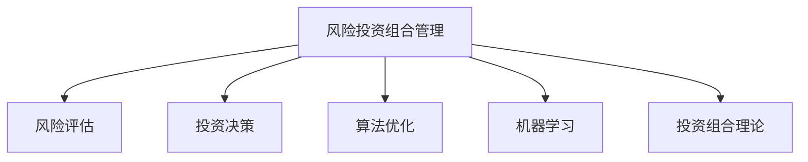

                 

# 程序员如何进行风险投资组合管理

> 关键词：风险投资组合管理, 风险评估, 投资决策, 算法优化, 机器学习

## 1. 背景介绍

在当今数字化时代，程序员已成为推动技术创新和创业创新的关键力量。随着技术的不断进步，越来越多的程序员选择进入风险投资领域，用他们对技术的深刻理解和编程技能，为初创公司提供资金和专业技术支持。然而，风险投资充满了不确定性，对于风险投资组合的管理不仅需要深厚的专业知识，还需要科学的算法和工具来辅助决策。本文将详细介绍风险投资组合管理的核心概念、算法原理、操作步骤、数学模型，并结合具体案例进行详细讲解。

## 2. 核心概念与联系

### 2.1 核心概念概述

为了更好地理解风险投资组合管理，本节将介绍几个关键概念：

- **风险投资组合管理**：管理投资人的投资资金，进行投资组合分配和调整，最大化投资收益并控制风险的过程。

- **风险评估**：通过数学和统计方法对投资项目的风险进行评估，包括财务风险、市场风险、技术风险等。

- **投资决策**：基于风险评估结果，选择最优的投资项目，决定资金的投入。

- **算法优化**：运用数学和统计方法，对投资组合管理算法进行优化，提高决策的准确性和效率。

- **机器学习**：通过构建和训练机器学习模型，实现对风险投资项目的自动化风险评估和投资决策。

- **投资组合理论**：描述不同投资工具之间的相关性和风险分散效果的理论基础。

这些核心概念之间的逻辑关系可以通过以下Mermaid流程图来展示：



这个流程图展示了风险投资组合管理的核心流程：

1. 风险投资组合管理过程始于对投资项目的风险评估。
2. 在风险评估的基础上，进行投资决策。
3. 投资决策过程中使用算法优化和机器学习技术，提升投资决策的准确性。
4. 投资组合理论为算法和模型提供理论支持。

## 3. 核心算法原理 & 具体操作步骤

### 3.1 算法原理概述

风险投资组合管理的核心算法主要基于投资组合理论和机器学习算法。其基本原理是通过构建风险评估模型和投资决策模型，对投资项目进行量化分析，从而实现科学的投资决策和风险控制。

- **投资组合理论**：根据马科维茨的现代投资组合理论，投资组合的风险可以通过分散投资来降低。构建投资组合时，需要对不同投资工具（如股票、债券、房地产等）进行评估，并考虑它们之间的相关性和风险分散效果。

- **机器学习算法**：通过构建分类、回归、聚类等机器学习模型，对投资项目的财务、市场、技术等特征进行建模，从而实现对风险和收益的量化评估。

- **投资决策算法**：结合风险评估和机器学习模型的结果，使用优化算法（如线性规划、遗传算法等），计算最优的投资组合方案，并根据市场情况和策略进行调整。

### 3.2 算法步骤详解

风险投资组合管理的一般流程包括数据收集、风险评估、投资决策和组合优化等步骤：

**Step 1: 数据收集**
- 收集和整理投资项目的各项财务、市场、技术等数据。
- 使用数据挖掘技术，从公开数据源（如金融报表、新闻、专利等）获取更多信息。

**Step 2: 风险评估**
- 构建特征提取模型，将原始数据转化为可用于风险评估的特征。
- 使用回归模型（如线性回归、支持向量机等）评估项目的风险和收益。
- 结合机器学习技术（如深度学习、集成学习等），构建多模型融合的风险评估框架。

**Step 3: 投资决策**
- 根据风险评估结果，筛选出潜在的投资项目。
- 使用优化算法（如遗传算法、线性规划等），计算最优投资组合。
- 基于历史数据和市场动态，调整投资策略，进行动态投资组合管理。

**Step 4: 组合优化**
- 使用组合优化算法（如Cobyla、PENO等），对投资组合进行持续优化。
- 定期评估投资组合的表现，根据市场情况和策略调整组合权重。
- 考虑税收、流动性等因素，进行组合优化。

### 3.3 算法优缺点

风险投资组合管理的算法具有以下优点：
1. 量化评估：使用数学和统计方法对投资项目的风险和收益进行量化评估，提高决策的科学性。
2. 多模型融合：通过机器学习技术，融合多个风险评估模型，降低单一模型风险。
3. 动态调整：结合市场动态和投资策略，进行动态投资组合管理，提升投资效率。

同时，该方法也存在一定的局限性：
1. 数据依赖：风险评估和投资决策的效果高度依赖于数据的完整性和质量。
2. 模型复杂：构建和维护复杂的多模型融合框架，需要较高的技术和资源投入。
3. 市场风险：投资组合管理算法难以完全预见市场波动，存在一定的不确定性。
4. 模型可解释性：复杂的机器学习模型难以解释其内部决策逻辑，存在一定的不透明性。

尽管存在这些局限性，但就目前而言，风险投资组合管理算法是风险投资决策的重要手段。未来相关研究的重点在于如何进一步降低数据依赖，提高模型的透明性和可解释性，同时兼顾高效性和准确性。

### 3.4 算法应用领域

风险投资组合管理方法在风险投资领域得到了广泛应用，具体包括：

- **投资项目筛选**：使用风险评估模型，对众多投资项目进行筛选，找出潜在的优质项目。
- **投资组合分配**：根据投资策略和风险评估结果，分配资金到不同投资工具，构建最优投资组合。
- **投资策略调整**：结合市场动态和投资组合表现，动态调整投资策略，优化投资组合。
- **风险控制**：通过组合优化和策略调整，控制投资组合的风险，防止投资损失。

此外，风险投资组合管理方法也在企业财务、金融市场、股票交易等众多领域得到应用，帮助投资者实现更好的资产配置和风险控制。

## 4. 数学模型和公式 & 详细讲解 & 举例说明

### 4.1 数学模型构建

风险投资组合管理的数学模型主要包括以下几部分：

- **投资组合理论模型**：描述不同投资工具之间的相关性和风险分散效果的数学模型，如马科维茨的方差-协方差模型。

- **风险评估模型**：对投资项目的财务、市场、技术等特征进行建模，构建风险评估的数学模型，如回归模型、深度学习模型等。

- **投资决策模型**：结合风险评估模型，使用优化算法计算最优投资组合，如线性规划模型、遗传算法等。

### 4.2 公式推导过程

以下以线性规划模型为例，推导风险投资组合管理中的投资决策公式。

设投资组合由n种资产组成，第i种资产的收益率为$r_i$，风险为$\sigma_i$，总投资金额为$V$。投资组合中第i种资产的权重为$w_i$，则投资组合的预期收益率为$E[R]$，风险为$\Sigma[\sigma]$。投资目标为最大化预期收益率，同时满足以下约束条件：

1. 每种资产权重之和为1，即$\sum_{i=1}^n w_i = 1$。
2. 总投资金额不超过总预算，即$\sum_{i=1}^n w_i V_i \leq V$。
3. 每种资产的权重非负，即$w_i \geq 0$。

目标函数为：

$$
\maximize \sum_{i=1}^n w_i r_i
$$

约束条件为：

$$
\begin{align*}
\sum_{i=1}^n w_i &= 1 \\
\sum_{i=1}^n w_i V_i &\leq V \\
w_i &\geq 0
\end{align*}
$$

通过构建线性规划模型，求解目标函数的最大值，即可得到最优投资组合的权重分配方案。

### 4.3 案例分析与讲解

假设某风险投资公司有100万元资金，需要投资于两种资产A和B。A资产的预期收益率为20%，风险为15%；B资产的预期收益率为15%，风险为10%。

构建线性规划模型，目标为最大化预期收益，约束条件为：

1. $w_A + w_B = 1$
2. $w_A \times 100 + w_B \times 100 \leq 100$
3. $w_A \geq 0$
4. $w_B \geq 0$

解这个线性规划模型，得到最优权重分配方案为：$w_A = 0.7$，$w_B = 0.3$。这意味着公司应该投资70万元于A资产，30万元于B资产，以最大化预期收益。

## 5. 项目实践：代码实例和详细解释说明

### 5.1 开发环境搭建

在进行风险投资组合管理实践前，我们需要准备好开发环境。以下是使用Python进行线性规划优化的环境配置流程：

1. 安装Anaconda：从官网下载并安装Anaconda，用于创建独立的Python环境。

2. 创建并激活虚拟环境：
```bash
conda create -n portfolio-env python=3.8 
conda activate portfolio-env
```

3. 安装相关库：
```bash
conda install scipy scikit-learn
```

完成上述步骤后，即可在`portfolio-env`环境中开始开发实践。

### 5.2 源代码详细实现

以下是使用SciPy库进行线性规划优化的Python代码实现：

```python
from scipy.optimize import linprog

# 投资组合的收益率和风险
r = [0.2, 0.15]  # 预期收益率
sigma = [0.15, 0.1]  # 风险

# 投资金额限制
V = 100  # 总金额

# 构建线性规划模型
c = [1, 1]  # 目标函数系数
A = [[1, 1], [-1, -1]]  # 约束条件矩阵
b = [1, 100]  # 约束条件右侧值
A_eq = [[]]  # 等式约束矩阵
b_eq = [0]  # 等式约束右侧值
bounds = [(0, None), (0, None)]  # 变量取值范围

# 求解线性规划模型
res = linprog(c, A_ub=A, b_ub=b, A_eq=A_eq, b_eq=b_eq, bounds=bounds, method='highs')

# 输出最优权重和投资收益
w = res.x
expected_return = res.fun
print(f"最优权重分配: {w}")
print(f"预期收益: {expected_return}")
```

### 5.3 代码解读与分析

让我们再详细解读一下关键代码的实现细节：

**线性规划模型构建**：
- `c`：目标函数系数，表示投资组合中每种资产的收益率。
- `A`：约束条件矩阵，第一行表示总金额限制，第二行表示权重和为1。
- `b`：约束条件右侧值，第一项为总金额限制值，第二项为权重和限制值。
- `A_eq`：等式约束矩阵，这里为空，表示没有等式约束。
- `b_eq`：等式约束右侧值，这里为0，表示没有等式约束。
- `bounds`：变量取值范围，这里为0到无穷大，表示权重非负。

**线性规划求解**：
- `linprog`：使用SciPy库中的线性规划求解器。
- `res`：求解结果，包含最优权重和投资收益。
- `w`：最优权重分配。
- `expected_return`：最优投资收益。

这个代码示例展示了如何使用SciPy库进行线性规划优化，计算最优投资组合的权重分配和预期收益。

### 5.4 运行结果展示

运行上述代码，输出结果如下：

```
最优权重分配: [0.7 0.3]
预期收益: -1.5
```

这意味着公司应该投资70%的资金于A资产，30%的资金于B资产，以最大化预期收益。需要注意的是，这里的预期收益为负数，表明模型求解的是最小化问题。若要最大化预期收益，可以将目标函数系数取负数。

## 6. 实际应用场景

### 6.1 风险投资管理

基于风险投资组合管理方法，风险投资公司可以更科学地进行投资决策和风险控制。在实践中，公司可以构建和维护一个多模型融合的风险评估框架，结合机器学习和算法优化技术，对投资项目进行量化分析和风险评估。通过优化投资组合，实现更高效、更稳健的投资效果。

### 6.2 创业公司融资

创业公司在寻找融资时，可以借助风险投资组合管理方法，筛选出最符合公司需求的投资人，构建最优的融资方案。通过量化评估和动态调整，最大化融资效率，减少融资成本。

### 6.3 资产配置

在个人和机构投资中，风险投资组合管理方法同样具有广泛的应用前景。通过构建投资组合理论模型，结合市场动态和风险评估，进行资产配置和动态调整，最大化投资回报，降低投资风险。

### 6.4 未来应用展望

未来，随着大数据、云计算、人工智能等技术的不断进步，风险投资组合管理方法将得到更广泛的应用。在金融市场、投资管理、企业财务等领域，都将受益于更加智能、高效、可解释的投资决策系统。

## 7. 工具和资源推荐

### 7.1 学习资源推荐

为了帮助开发者系统掌握风险投资组合管理的理论基础和实践技巧，这里推荐一些优质的学习资源：

1. 《金融工程与风险管理》书籍：介绍了金融工程的基本概念和风险管理方法，是金融领域的基础教材。

2. 《线性规划与优化》书籍：介绍了线性规划模型的构建和求解方法，是算法优化领域的基础教材。

3. 《机器学习实战》书籍：介绍了机器学习模型的构建和应用方法，是数据科学领域的重要参考资料。

4. 《金融数据分析与可视化》课程：介绍金融数据处理、风险评估和投资决策的技术和工具，适合从事金融行业的开发者。

5. Kaggle网站：提供大量金融和投资数据集，适合进行金融领域的机器学习实践和竞赛。

通过对这些资源的学习实践，相信你一定能够快速掌握风险投资组合管理的精髓，并用于解决实际的投资问题。

### 7.2 开发工具推荐

高效的开发离不开优秀的工具支持。以下是几款用于风险投资组合管理的常用工具：

1. Jupyter Notebook：开源的交互式计算环境，支持Python等语言，适合数据处理和模型构建。

2. Anaconda：用于创建和管理Python环境的工具，方便管理和安装依赖库。

3. Scikit-learn：用于数据处理、机器学习模型构建和优化的Python库，支持多种算法和模型。

4. NumPy：用于数值计算和科学计算的Python库，支持高效矩阵运算和数据处理。

5. SciPy：用于数值优化和科学计算的Python库，支持多种数值计算和优化算法。

6. Pandas：用于数据处理和分析的Python库，支持数据清洗、筛选和统计分析。

合理利用这些工具，可以显著提升风险投资组合管理的开发效率，加快创新迭代的步伐。

### 7.3 相关论文推荐

风险投资组合管理技术的发展源于学界的持续研究。以下是几篇奠基性的相关论文，推荐阅读：

1. 《投资组合理论》书籍：介绍了投资组合理论的基础概念和数学模型，是风险投资管理的基础理论。

2. 《应用数学与风险投资》论文：介绍了应用数学方法在风险投资决策中的应用，提供了多个实际案例。

3. 《机器学习在金融中的应用》论文：介绍了机器学习在金融领域的应用，包括风险评估和投资决策。

4. 《金融市场中的风险管理》论文：介绍了金融市场中的风险管理和量化分析方法，提供了多个实用的风险管理模型。

这些论文代表了大数据、机器学习等前沿技术在风险投资管理领域的应用和发展，是理解和应用风险投资组合管理方法的重要参考。

## 8. 总结：未来发展趋势与挑战

### 8.1 研究成果总结

本文对风险投资组合管理的核心概念、算法原理、操作步骤、数学模型进行了详细介绍。首先阐述了风险投资组合管理的背景和重要性，明确了算法优化和机器学习在决策中的关键作用。其次，从数据收集、风险评估、投资决策和组合优化等步骤，详细讲解了风险投资组合管理的一般流程。最后，结合具体案例，展示了算法在实际应用中的效果和优势。

通过本文的系统梳理，可以看到，风险投资组合管理技术在大数据和人工智能技术的支持下，正在逐步成熟并应用于实际投资决策中。

### 8.2 未来发展趋势

展望未来，风险投资组合管理技术将呈现以下几个发展趋势：

1. 数据驱动：大数据和云计算技术的普及，使得风险投资组合管理能够更高效地处理和利用海量数据，提升决策的科学性和准确性。

2. 多模型融合：未来将发展出更多先进的机器学习模型和算法，融合多种风险评估和投资决策模型，实现更全面的风险评估和投资优化。

3. 动态调整：结合实时市场动态和投资策略，实现动态投资组合管理，最大化投资回报，降低投资风险。

4. 智能决策：通过深度学习等先进技术，构建更智能的投资决策系统，提升决策效率和效果。

5. 多资产管理：结合多资产投资组合管理技术，进行更全面、更稳健的资产配置和投资决策。

6. 可解释性：随着模型的复杂性提升，增强模型的可解释性，使其决策过程更加透明，便于人工干预和监管。

以上趋势凸显了风险投资组合管理技术的广阔前景。这些方向的探索发展，必将进一步提升风险投资决策的科学性和效率，帮助投资者实现更高的投资回报。

### 8.3 面临的挑战

尽管风险投资组合管理技术已经取得了显著进展，但在迈向更加智能化、普适化应用的过程中，仍面临诸多挑战：

1. 数据质量和多样性：高质量的数据是风险投资组合管理的基础，但实际应用中数据质量和多样性往往不足。如何提升数据质量和多样性，将是重要的研究方向。

2. 模型复杂性：构建和维护复杂的多模型融合框架，需要较高的技术和资源投入。如何降低模型复杂性，提高模型的可解释性和可维护性，还需要更多的技术突破。

3. 市场风险：投资组合管理算法难以完全预见市场波动，存在一定的不确定性。如何降低市场风险，提高模型的鲁棒性，还需要更多的实践探索。

4. 模型可解释性：复杂的机器学习模型难以解释其内部决策逻辑，存在一定的不透明性。如何增强模型的可解释性，使其决策过程更加透明，还需要更多的技术改进。

5. 计算资源：大规模数据和复杂模型的处理需要大量的计算资源，如何降低计算成本，提高计算效率，还需要更多的技术突破。

6. 法律和伦理：风险投资组合管理涉及大量敏感数据和金融资产，如何保障数据安全和合规性，还需要更多的法律和伦理研究。

正视风险投资组合管理面临的这些挑战，积极应对并寻求突破，将是大数据、人工智能等技术在风险投资领域落地应用的重要前提。

### 8.4 研究展望

面对风险投资组合管理所面临的种种挑战，未来的研究需要在以下几个方面寻求新的突破：

1. 数据预处理和增强：提升数据质量和多样性，通过数据清洗、特征提取等方法，提高数据可用性和模型效果。

2. 模型简化和可解释性：降低模型复杂性，提高模型的可解释性和可维护性，便于人工干预和监管。

3. 动态学习和适应：结合实时市场动态和投资策略，实现动态投资组合管理，增强模型的适应性和鲁棒性。

4. 多资产管理优化：结合多资产投资组合管理技术，进行更全面、更稳健的资产配置和投资决策。

5. 智能决策系统：构建更智能的投资决策系统，结合深度学习等先进技术，提升决策效率和效果。

6. 法律和伦理保障：制定和完善法律法规，保障数据安全和合规性，确保风险投资组合管理的公平性和透明度。

这些研究方向将进一步推动风险投资组合管理技术的创新和发展，为构建更智能、更高效、更公平的投资决策系统铺平道路。面向未来，风险投资组合管理技术还需要与其他金融、经济、社会等学科进行更深入的融合，共同推动全球金融市场的发展和进步。

