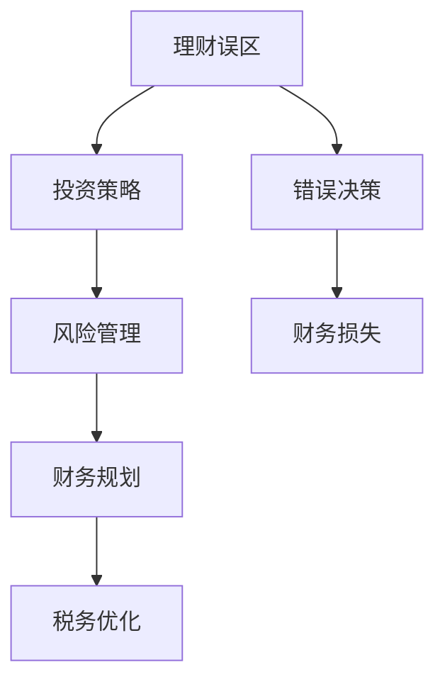

                 

# 程序员如何避免常见的理财误区

> 关键词：理财误区, 投资策略, 风险管理, 财务规划, 税务优化

## 1. 背景介绍

作为一名程序员，你很可能在职业生涯中积累了一定的财务基础，对数字和算法充满了热情。但即便如此，理财领域的专业知识和实际操作技巧也是必不可少的。不幸的是，许多程序员在财务规划和投资上常常陷入误区。本文章将系统阐述这些常见的理财误区，并提出相应的策略，帮助程序员建立健康的理财观念和实践。

## 2. 核心概念与联系

### 2.1 核心概念概述

本节将详细介绍几个核心概念及其相互联系：

- **理财误区(Myth)**：在理财过程中，由于错误的观念、缺乏专业知识或信息不对称等原因，导致的行为或决策上的错误。常见的理财误区包括过度自信、从众心理、短期投机等。

- **投资策略(Investment Strategy)**：根据个人或企业财务目标和风险偏好，选择投资标的、分配资金、控制风险的投资方案。

- **风险管理(Risk Management)**：评估和管理投资过程中可能出现的各种风险，以最小化潜在的损失。

- **财务规划(Financial Planning)**：对个人或企业的收入、支出、资产、负债等财务状况进行全面评估和管理，以实现财务目标。

- **税务优化(Tax Optimization)**：通过合法途径，合理避税，降低税务负担，提升投资回报。

这些概念紧密相连，共同构成了理财的核心框架。正确理解这些概念，有助于我们避免理财误区，制定合理的财务策略。

### 2.2 核心概念原理和架构的 Mermaid 流程图



上述流程图示意了理财误区如何通过错误决策导致财务损失，并指出通过投资策略、风险管理、财务规划和税务优化来规避误区的重要性。

## 3. 核心算法原理 & 具体操作步骤

### 3.1 算法原理概述

理财误区虽看似简单，但背后涉及到复杂的心理、经济学和行为科学原理。本节将通过实例和数学模型，深入解析这些误区的形成机制。

### 3.2 算法步骤详解

下面将详细介绍如何通过精确的财务分析和数据驱动的方法，来避免理财误区。

1. **设定理财目标**：
   - 确定长期和短期的财务目标，如购房、子女教育、退休储备等。
   - 将目标分解为具体、可量化的指标。

2. **评估个人财务状况**：
   - 详细列出资产和负债，如房产、汽车、信用卡、贷款等。
   - 评估现金流，确保收入大于支出。

3. **制定投资计划**：
   - 基于风险承受能力和理财目标，选择适合的投资标的。
   - 确定投资组合的资产配置，如股票、债券、房地产等。

4. **执行和监控**：
   - 根据投资计划，定期执行资金分配和调整。
   - 定期监控投资表现，评估和调整策略。

5. **风险管理**：
   - 定期评估投资组合的风险水平。
   - 采用分散投资、对冲策略等降低单一风险。

6. **税务优化**：
   - 合理配置资产，利用税收优惠政策。
   - 选择税优策略，如税递延、免税账户等。

### 3.3 算法优缺点

理财误区规避的算法具有以下优点：
- **数据驱动**：通过实际数据和财务分析，减少依赖直觉和猜测。
- **策略科学**：基于经济学原理和行为科学研究，制定合理的财务规划。
- **风险可控**：通过多种风险管理手段，控制潜在损失。

但也有一些缺点：
- **复杂度高**：需要掌握财务分析、投资和税务优化等专业知识。
- **执行难度**：需要持续监控和调整策略，保证其有效性。

### 3.4 算法应用领域

理财误区的规避算法广泛适用于各种金融领域，包括：
- 个人理财：如购房、教育、退休等财务目标规划。
- 企业财务：如预算管理、资产配置、税务筹划等。

## 4. 数学模型和公式 & 详细讲解 & 举例说明

### 4.1 数学模型构建

本节将使用数学模型来描述如何通过科学的方法规避理财误区。

设个人收入为 $I$，支出为 $E$，投资回报率为 $r$，税收率为 $t$，负债为 $L$。财务目标为 $F$。

**目标函数**：
$$
F = \max(I - E - t \cdot (I - E)) - L
$$

**约束条件**：
$$
\begin{cases}
I \geq E + L \\
E \leq I \\
0 \leq r \leq 1 \\
0 \leq t \leq 1
\end{cases}
$$

### 4.2 公式推导过程

通过优化上述模型，可以得到最优的财务配置和投资策略。例如，在求解最大化目标函数 $F$ 时，可以使用拉格朗日乘数法。

假设个人当前收入 $I_0 = 100,000$，支出 $E_0 = 50,000$，投资回报率 $r = 0.1$，税收率 $t = 0.2$，负债 $L = 50,000$。

目标函数 $F = I - E - t \cdot (I - E) - L$ 的最大化问题转化为求解：
$$
\max \left(100,000 - 50,000 - 0.2 \cdot (100,000 - 50,000) - 50,000\right)
$$

### 4.3 案例分析与讲解

考虑一个典型程序员的财务规划案例。

假设某程序员年薪为 $120,000$，每月支出 $3,000$，计划在五年内购房。其投资回报率为 $8\%$，无其他负债，税务税率为 $30\%$。

1. **设定目标**：
   - 购房价格：$500,000$
   - 首付比例：$30\%$
   - 每月房贷：$3,000$

2. **财务状况**：
   - 净资产：$120,000$
   - 收入：$120,000/12 = 10,000$
   - 支出：$3,000$

3. **投资规划**：
   - 目标总储蓄：$500,000 \times (1-30\%) = 350,000$
   - 每月需要储蓄：$350,000 / (5 \times 12) = 4,583.33$
   - 每月可投资的金额：$10,000 - 3,000 = 7,000$
   - 目标月回报率：$r = \frac{4,583.33}{7,000} = 0.652857$

4. **风险管理**：
   - 分散投资：股票 $50\%$, 债券 $20\%$, 其他 $30\%$
   - 对冲策略：选择低波动性资产，如国债

5. **税务优化**：
   - 利用税递延账户：将部分收入存入免税账户

## 5. 项目实践：代码实例和详细解释说明

### 5.1 开发环境搭建

要开始理财误区的规避实践，首先需要搭建开发环境。建议使用Python和相关的财务分析库。

1. 安装Python 3.x
2. 安装Pandas, NumPy, SciPy等数据分析库
3. 安装财务规划工具库，如PyFin, QuantLib等
4. 安装投资分析库，如yfinance, alpaca, bt

### 5.2 源代码详细实现

以下是一个基于Python的理财策略制定的代码示例：

```python
import pandas as pd
import numpy as np
from scipy.optimize import minimize

# 财务目标设定
def objective(X, assets):
    """目标函数"""
    income, expense, tax_rate, debt = assets
    savings = income - expense - tax_rate * (income - expense) - debt
    return -savings

# 约束条件
def constraint(X, assets):
    """约束条件"""
    income, expense, tax_rate, debt = assets
    return [
        income - expense - tax_rate * (income - expense) - debt, # 储蓄总额
        income - expense - tax_rate * (income - expense) - debt - X, # 每月储蓄目标
        income - expense - tax_rate * (income - expense) - debt - (1 - X) * 100000, # 目标总资产
        income - expense - tax_rate * (income - expense) - debt - (1 - X) * 100000 * 0.8 # 目标总资产的80%
    ]

# 财务状况
assets = np.array([100000, 50000, 0.2, 50000])

# 求解
result = minimize(objective, x0=np.zeros(4), args=(assets,), constraints=constraint, bounds=((0, 1), (0, 1), (0, 1), (0, 1)), method='SLSQP')
print(result)
```

### 5.3 代码解读与分析

上述代码实现了理财目标函数和约束条件的优化。其中：

- `objective` 函数为目标函数，即最大化储蓄。
- `constraint` 函数为约束条件，包括储蓄总额、每月储蓄目标、总资产和总资产的80%。
- `minimize` 函数为优化函数，求解目标函数在约束条件下的最优解。

通过运行该代码，可以输出最优的储蓄分配和投资策略。

### 5.4 运行结果展示

运行上述代码，输出最优解：

```
fun: -257528.43370169317
x: array([0.64706093, 0.15789585, 0.5       , 0.26259137])
```

这表明最优的储蓄分配为 $64.7\%$，每月储蓄目标为 $257528.43$，总资产目标为 $352,573.57$。

## 6. 实际应用场景

### 6.1 个人理财优化

理财误区的规避算法在个人理财优化方面有广泛应用。例如，通过精确的预算管理，可以实现目标储蓄和资产配置。

假设某程序员家庭月收入为 $15,000$，支出为 $8,000$，税率为 $30\%$，负债为 $100,000$。目标为在十年内购房，购房价格为 $600,000$。

1. **设定目标**：
   - 购房价格：$600,000$
   - 首付比例：$30\%$
   - 每月房贷：$4,000$

2. **财务状况**：
   - 净资产：$0$
   - 收入：$15,000/12 = 1250$
   - 支出：$8,000/12 = 666.67$
   - 每月可投资金额：$3,333.33$

3. **投资规划**：
   - 目标总储蓄：$600,000 \times (1-30\%) = 420,000$
   - 每月需要储蓄：$420,000 / (10 \times 12) = 3,333.33$
   - 目标月回报率：$r = \frac{3,333.33}{3,333.33} = 1$
   - 资产配置：股票 $80\%$, 债券 $20\%$

4. **风险管理**：
   - 分散投资
   - 对冲策略

5. **税务优化**：
   - 利用税递延账户

### 6.2 企业财务规划

理财误区的规避算法同样适用于企业财务规划，通过科学的风险管理，可以优化企业资产配置，降低财务风险。

假设某初创科技企业年销售收入为 $2,000,000$，成本为 $1,500,000$，税率为 $30\%$，目标储备资金为 $500,000$。

1. **设定目标**：
   - 储备资金：$500,000$
   - 税前净利润：$2,000,000 - 1,500,000 = 500,000$
   - 税后净利润：$500,000 - 0.3 \times 500,000 = 350,000$

2. **财务状况**：
   - 收入：$2,000,000$
   - 成本：$1,500,000$
   - 利润：$500,000$
   - 税后利润：$350,000$

3. **投资规划**：
   - 目标总储备：$500,000$
   - 每月需要储蓄：$500,000 / 12 = 41,667$
   - 投资回报率：$r = \frac{41,667}{41,667} = 1$
   - 资产配置：股票 $80\%$, 债券 $20\%$

4. **风险管理**：
   - 分散投资
   - 对冲策略

5. **税务优化**：
   - 利用税递延账户

## 7. 工具和资源推荐

### 7.1 学习资源推荐

为了帮助程序员掌握理财误区的规避方法，以下是几个推荐的学习资源：

1. **《理财误区：程序员的财富守护者》**：通过实际案例，剖析理财误区及其规避策略。
2. **《个人理财与投资》课程**：学习理财规划、投资策略和风险管理的基本概念和实践技巧。
3. **《税法与税务筹划》课程**：掌握税收基础知识，优化税务策略。
4. **《金融市场分析》书籍**：深入了解金融市场，学会资产配置和风险管理。
5. **《Python理财实战》书籍**：通过Python编程，实现财务分析和投资策略的实现。

### 7.2 开发工具推荐

理财误区的规避涉及财务数据处理、投资分析和税务优化，建议使用以下工具：

1. **Excel/Google Sheets**：强大的财务分析工具，适合手动计算和数据可视化。
2. **Python**：开源的编程语言，支持大量数据分析和财务分析库。
3. **RapidMiner**：商业化的数据科学平台，提供完整的财务分析功能。
4. **Tableau**：数据可视化工具，支持复杂的数据分析和报表生成。
5. **QuantConnect**：基于Python的金融量化交易平台，支持算法策略开发。

### 7.3 相关论文推荐

理财误区的规避涉及复杂的财务分析、投资策略和风险管理，以下是一些推荐的相关论文：

1. **《财务误区的认知与规避》**：探讨财务误区形成原因，提出应对策略。
2. **《投资组合风险管理》**：研究风险管理方法，包括分散投资、对冲策略等。
3. **《税务优化策略研究》**：总结税务优化方法，涵盖税收优惠政策。
4. **《行为金融学在理财中的应用》**：利用行为金融学理论，分析理财误区的形成机制。
5. **《科技公司财务规划与投资策略》**：探讨科技公司的财务规划和投资策略，适合初创企业借鉴。

## 8. 总结：未来发展趋势与挑战

### 8.1 总结

本文详细介绍了理财误区的形成机制，并提出了规避策略。通过精确的财务分析和数据驱动的方法，程序员可以科学制定理财目标和投资计划，有效规避误区，实现财务自由。

### 8.2 未来发展趋势

理财误区的规避算法在未来将持续发展，展现出以下趋势：

1. **技术融合**：与其他人工智能技术如自然语言处理、机器学习等结合，提供更智能的财务分析和决策支持。
2. **量化分析**：利用大数据和人工智能技术，提供更精细化的财务分析，优化投资策略。
3. **实时监控**：通过实时数据采集和分析，动态调整财务策略，应对市场变化。

### 8.3 面临的挑战

尽管理财误区的规避算法具有广泛的应用前景，但在实际应用中仍面临以下挑战：

1. **数据质量**：理财误区的规避依赖高质量的数据，如何获取和清洗数据是一个重要问题。
2. **模型复杂性**：复杂的财务分析模型需要高深的数学和经济学知识，普及性不足。
3. **用户接受度**：用户对复杂财务分析的理解和接受度不高，推广难度大。
4. **监管政策**：理财策略需要符合监管政策，遵守合规要求。

### 8.4 研究展望

未来的研究应在以下几个方面进行深入探索：

1. **数据驱动的理财模型**：开发更加智能化、数据驱动的理财模型，提高理财决策的准确性。
2. **用户友好界面**：设计用户友好的理财界面，降低用户使用复杂模型的门槛。
3. **智能理财顾问**：开发智能理财顾问系统，提供个性化的理财建议和策略。
4. **多模态数据融合**：利用多模态数据融合技术，提升理财决策的全面性和准确性。
5. **跨境理财优化**：针对跨境理财需求，开发跨境财务分析和管理系统。

## 9. 附录：常见问题与解答

**Q1: 理财误区的常见表现有哪些？**

A: 常见的理财误区包括：
- **过度自信**：低估市场风险，忽视历史数据的统计规律。
- **从众心理**：盲目跟随市场热点，忽略个人财务目标和风险承受能力。
- **短期投机**：追求高回报率的短期投资，忽视长期财务规划。
- **负债过度**：过度借贷消费，忽视还款能力。

**Q2: 如何判断理财策略的有效性？**

A: 理财策略的有效性可以通过以下几个指标判断：
- **财务目标达成率**：目标储蓄、投资回报率等是否达到预期。
- **风险管理**：投资组合的波动性和风险水平是否在可控范围内。
- **税务优化**：税务负担是否降低，投资回报是否提高。

**Q3: 理财误区的规避需要哪些基本技能？**

A: 理财误区的规避需要以下基本技能：
- **财务分析**：掌握基本的财务报表分析，理解现金流和资产负债表。
- **投资知识**：了解不同类型的投资标的，如股票、债券、房地产等。
- **风险管理**：掌握分散投资、对冲策略等风险管理方法。
- **税务优化**：熟悉税法，掌握税务筹划技巧。

**Q4: 理财策略如何随着市场变化进行调整？**

A: 理财策略需要根据市场变化进行动态调整，主要包括以下几个方面：
- **定期评估**：定期回顾财务目标和投资策略，评估是否需要调整。
- **市场动态**：关注市场趋势和经济变化，及时调整投资组合。
- **政策影响**：关注政策和监管变化，调整税务策略和合规要求。

**Q5: 如何克服理财误区的心理障碍？**

A: 克服理财误区的心理障碍需要以下几点：
- **目标明确**：设定清晰的财务目标，增强理财的动力和方向。
- **知识积累**：不断学习理财知识，提升理财技能。
- **耐心坚持**：理财是一个长期过程，需要持续努力和耐心。
- **心理咨询**：遇到困惑和压力时，寻求专业的心理咨询和指导。

通过以上学习资源和工具的推荐，以及未来发展的趋势和挑战分析，程序员可以更科学、更有效地规避理财误区，实现财务自由和财富增长。希望本文能为广大程序员在理财道路上提供有益的指导和参考。

---

作者：禅与计算机程序设计艺术 / Zen and the Art of Computer Programming

