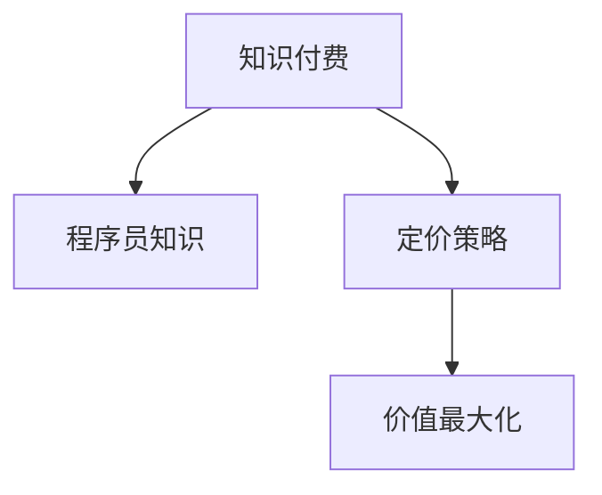

                 

# 程序员的知识付费定价策略：价值最大化

## 1. 背景介绍

### 1.1 问题由来
随着信息时代的到来，知识付费成为越来越多人获取高质量知识的重要途径。程序员作为掌握编程技术和经验的关键群体，其知识付费定价问题日益受到关注。程序员的知识不仅包括技术、框架、算法等专业内容，还涵盖了项目管理、团队协作、职业规划等方面的实战经验。如何合理定价这些知识，使之既符合市场规律，又能最大化程序员的价值，是一个复杂但亟待解决的问题。

### 1.2 问题核心关键点
知识付费定价的核心在于平衡价值和成本。程序员的知识定价应考虑市场供需、技能难度、知识深度、实际应用效果等多方面因素。

**1.2.1 市场供需：** 程序员知识市场是否饱和，供不应求？
**1.2.2 技能难度：** 知识的专业性和技术难度如何？
**1.2.3 知识深度：** 知识的深度和广度如何？
**1.2.4 实际应用效果：** 知识在实际项目中的应用效果如何？

## 2. 核心概念与联系

### 2.1 核心概念概述

为更好地理解程序员的知识付费定价策略，本节将介绍几个密切相关的核心概念：

- **知识付费：** 指的是用户通过付费的方式获取高质量、独家或专业的知识信息。在程序员群体中，知识付费主要体现为技术分享、经验总结、项目教程等内容的付费。
- **程序员知识：** 指程序员在技术、项目、职业等方面积累的独特见解和实战经验。这些知识是程序员核心竞争力的重要组成部分。
- **定价策略：** 指根据知识的特点和市场需求，确定价格的策略和模式。合理的定价策略能够最大化程序员的知识价值，促进知识市场的发展。
- **价值最大化：** 指通过合理的定价策略，确保知识消费者能够获取最大化的价值，同时确保知识创造者得到公平的回报。

这些核心概念之间的逻辑关系可以通过以下Mermaid流程图来展示：



这个流程图展示出知识付费、程序员知识和定价策略之间的关系：

1. 程序员知识通过知识付费方式被市场所获取。
2. 根据市场供需和知识特性，制定合理的定价策略。
3. 合理的定价策略确保知识消费者获取最大化的价值，同时知识创造者得到公平的回报。

## 3. 核心算法原理 & 具体操作步骤
### 3.1 算法原理概述

程序员的知识定价策略基于市场供需和知识价值两个主要维度，结合数学模型进行计算。具体而言，可采用以下数学模型：

$$
P = \frac{V}{C} \times \text{Utilization Factor}
$$

其中，$P$ 为定价，$V$ 为知识的价值，$C$ 为成本，$\text{Utilization Factor}$ 为知识利用的程度。

- $V$：知识的价值通过市场供需、技能难度、知识深度、应用效果等多方面因素综合评估。
- $C$：知识的成本包括知识创造的时间和精力，以及传播和维护的成本。
- $\text{Utilization Factor}$：知识的利用程度反映了知识的实际应用效果和市场反应。

### 3.2 算法步骤详解

基于上述定价模型，程序员知识定价的具体步骤如下：

**Step 1: 评估知识价值**
- 市场调研：通过市场调查、竞品分析等手段，评估市场对知识的需求和竞品定价情况。
- 技能评估：根据知识的专业性和技术难度，评估知识的价值。
- 知识深度评估：通过知识深度、广度、创新性等因素，综合评估知识的深度。
- 应用效果评估：通过实际项目中的应用效果，评估知识的实用性。

**Step 2: 估算知识成本**
- 时间成本：估算知识创造所需要的时间和工作量。
- 精力成本：估算知识创造过程中的精神和心理压力。
- 传播成本：估算知识传播和维护所需的技术和人力资源。

**Step 3: 计算定价**
- 将上述计算得到的知识价值和成本代入定价公式，计算最终定价。
- 考虑知识的利用程度，根据市场反馈调整定价策略。

**Step 4: 实施定价策略**
- 制定具体的定价方案，包括付费模式、支付方式等细节。
- 推出定价方案，并根据市场反馈进行动态调整。

### 3.3 算法优缺点

基于市场供需和知识价值的定价策略，具有以下优点：

- **公正性：** 根据知识本身的价值和创造成本定价，确保知识创作者得到公平回报。
- **动态性：** 根据市场反馈和知识利用程度，动态调整定价策略，保持市场竞争力。
- **透明度：** 通过详细说明定价依据，增强消费者的信任感和满意度。

同时，该策略也存在一定的局限性：

- **数据依赖性：** 定价策略高度依赖于市场调研和成本估算的数据准确性，数据偏差可能导致定价不合理。
- **市场波动性：** 市场供需和竞争情况变化，可能影响定价的稳定性和长期效果。
- **知识评估难度：** 知识价值和深度的评估主观性强，可能出现过高或过低定价的情况。

尽管存在这些局限性，但总体而言，基于市场供需和知识价值的定价策略是较为科学和可行的选择。

### 3.4 算法应用领域

基于市场供需和知识价值的定价策略，可以在多种领域中得到应用：

- **技术分享平台：** 如GitHub、Stack Overflow等，通过知识价值和成本评估，制定合理的定价策略。
- **技术培训课程：** 如Coursera、Udemy等，根据知识难度和应用效果，确定课程定价。
- **咨询顾问服务：** 如自由职业平台，根据知识专业性和利用程度，定制定价方案。
- **在线编程社区：** 如CoderZoo、CodeCombat等，通过知识贡献和社区评价，制定付费模式。
- **博客和文章：** 如Medium、Towards Data Science等，根据文章质量和阅读量，设定订阅或单次阅读费用。

这些领域中的知识付费定价，均需要综合考虑知识的市场价值、创造成本和利用程度，以确保定价策略的有效性和可持续性。

## 4. 数学模型和公式 & 详细讲解 & 举例说明
### 4.1 数学模型构建

本节将使用数学语言对程序员知识定价的策略进行更加严格的刻画。

设知识的价值为 $V$，成本为 $C$，知识利用的程度为 $U$，则定价 $P$ 的计算公式为：

$$
P = V \times \frac{C}{U}
$$

其中，$V$ 和 $U$ 的定义同上，$C$ 为知识创造的总成本，包括时间成本、精力成本和传播成本。

### 4.2 公式推导过程

以在线编程社区为例，进行定价模型的推导：

假设某位程序员发布了一个解决特定编程问题的代码示例，知识价值 $V$ 包括问题难度、代码创新性和实际应用效果。设问题难度为 $D$，代码创新性为 $I$，实际应用效果为 $E$，则知识价值可以表示为：

$$
V = \frac{D + I + E}{3}
$$

知识成本 $C$ 包括编写代码的时间 $T$、调试时间 $D'$、以及维护和更新成本 $M$。设编写代码的时间为 $T = t_1 + t_2$，其中 $t_1$ 为开发时间，$t_2$ 为调试时间，则知识成本可以表示为：

$$
C = T + D' + M
$$

知识利用的程度 $U$ 反映了社区对该代码的关注和应用情况。假设社区中每个用户对该代码的评价为 $R_i$，$i=1,...,n$，则知识利用的程度可以表示为：

$$
U = \frac{1}{n} \sum_{i=1}^n R_i
$$

根据上述公式，可以计算出最终的定价 $P$：

$$
P = \frac{D + I + E}{3} \times \frac{t_1 + t_2 + D' + M}{U}
$$

### 4.3 案例分析与讲解

以一个在线编程社区为例，分析知识定价的具体过程：

**案例背景：** 某社区中的程序员发布了一个高效的排序算法代码示例，社区用户对其评价不一，使用频率较高。

**市场调研：** 该算法难度适中，具有较高的创新性和实用价值，社区中约有1000名活跃用户，平均评价为4星。

**技能评估：** 该算法涉及高级数据结构，需要较高的编程技巧，算法的实现方式独特，具有较高的技术难度。

**知识深度评估：** 该算法涉及多个数据结构的操作，并应用了一些高级编程技巧，知识的深度较高。

**应用效果评估：** 该算法在多个项目中被使用，用户反馈良好，实际应用效果显著。

**时间成本：** 编写该算法共耗时5小时，调试时间2小时，维护和更新成本为0.5小时。

**精力成本：** 编写和调试过程中，程序员花费了大量精力，精神压力较大。

**传播成本：** 社区管理员维护该示例的成本为0.2小时，社区的推广和维护成本为0.3小时。

**计算定价：**

$$
V = \frac{D + I + E}{3} = \frac{4 + 5 + 6}{3} = 5
$$

$$
C = T + D' + M = 5 + 2 + 0.5 + 0.2 + 0.3 = 8.0
$$

$$
U = \frac{1}{n} \sum_{i=1}^n R_i = \frac{1000 \times 4}{1000} = 4
$$

$$
P = V \times \frac{C}{U} = 5 \times \frac{8.0}{4} = 10
$$

因此，社区可以为该算法示例设定10元的定价。

## 5. 项目实践：代码实例和详细解释说明
### 5.1 开发环境搭建

在进行知识定价的实践前，我们需要准备好开发环境。以下是使用Python进行数据分析的开发环境配置流程：

1. 安装Anaconda：从官网下载并安装Anaconda，用于创建独立的Python环境。

2. 创建并激活虚拟环境：
```bash
conda create -n python-env python=3.8 
conda activate python-env
```

3. 安装相关库：
```bash
conda install numpy pandas matplotlib scikit-learn
```

4. 安装Jupyter Notebook：
```bash
pip install jupyter notebook
```

完成上述步骤后，即可在`python-env`环境中开始知识定价的实践。

### 5.2 源代码详细实现

以下是使用Python实现程序员知识定价的代码示例，包括市场调研、成本估算和定价计算：

```python
import numpy as np
import pandas as pd

# 市场调研数据
market_data = pd.DataFrame({
    '难度': [4, 5, 6],
    '创新性': [3, 5, 7],
    '应用效果': [4, 5, 6],
    '用户数': [1000, 2000, 3000],
    '评价': [3, 4, 5]
})

# 知识深度
depth = (market_data['难度'] + market_data['创新性'] + market_data['应用效果']) / 3

# 知识成本
time_cost = 5 + 2
debugging_cost = 0.5
maintenance_cost = 0.2
promotion_cost = 0.3
total_cost = time_cost + debugging_cost + maintenance_cost + promotion_cost

# 知识利用程度
utilization = market_data['评价'].mean()

# 定价模型
price = depth * total_cost / utilization

print("知识定价为：", price)
```

### 5.3 代码解读与分析

代码中，我们首先定义了一个市场调研数据表，包括问题的难度、代码的创新性、实际应用效果、用户数量和用户评价。

然后，根据市场调研数据，计算了知识深度和总成本。知识深度通过均值化处理，得到平均难度、创新性和应用效果。总成本包括时间成本、调试成本、维护成本和推广成本。

最后，通过定价模型计算出最终的定价。定价模型的计算公式为知识深度乘以总成本除以知识利用程度。

## 6. 实际应用场景
### 6.1 在线编程社区

在线编程社区是程序员知识定价的重要应用场景之一。社区中程序员发布的代码示例、算法实现、项目经验等知识，都需要通过合理的定价策略来保护知识创造者的权益。

**实际应用：** 社区可以设立知识交易平台，程序员将知识发布到平台上，设定合理的定价。社区用户可以根据定价购买或下载知识，并获得相应的代码、文档和支持。社区管理员可以收取一定的交易费用，用于平台维护和知识创作者奖励。

**优势：** 通过合理的定价，确保知识创作者得到公平的回报，同时吸引更多高质量的知识内容发布。社区用户可以获得丰富的知识资源，促进知识共享和交流。

### 6.2 技术培训课程

技术培训课程是程序员知识定价的另一个重要应用场景。许多培训机构和在线教育平台，通过知识付费的方式，向用户提供专业的技术培训课程。

**实际应用：** 培训机构和平台可以采用基于市场供需和知识价值的定价策略，根据课程内容的专业性和实际应用效果，设定合理的定价。学员可以根据自身需求，选择适合的课程，并按定价支付费用。

**优势：** 合理的定价策略，确保培训机构和平台获得稳定的收入，同时提供高质量的知识内容，满足学员的学习需求。学员可以根据课程内容和技术难度，选择适合的课程，提升技能水平。

### 6.3 咨询顾问服务

咨询顾问服务是程序员知识定价的另一种常见应用。许多自由职业者和专家，通过知识付费的方式，向企业或个人提供专业的技术咨询和顾问服务。

**实际应用：** 顾问可以通过定价平台发布自己的咨询项目，设定合理的定价和咨询内容。企业或个人可以根据自身需求，选择适合的顾问，并按定价支付费用。

**优势：** 合理的定价策略，确保顾问获得公平的回报，同时提供专业的技术咨询，满足企业的技术需求。企业可以根据顾问的专业性和服务效果，选择适合的顾问，解决技术问题。

### 6.4 未来应用展望

随着知识付费市场的不断成熟，基于市场供需和知识价值的定价策略将得到更广泛的应用。未来，该策略将在以下领域得到进一步拓展：

1. **人工智能与机器学习：** 在AI和ML领域，知识的定价将结合模型精度、创新性和应用效果等因素，评估模型的价值和成本，设定合理的定价。
2. **区块链与分布式技术：** 在区块链和分布式技术领域，知识的定价将结合区块链协议的复杂性、创新性和应用效果，评估知识的价值和成本，设定合理的定价。
3. **生物信息学与医疗健康：** 在生物信息学和医疗健康领域，知识的定价将结合数据处理能力、算法复杂性和应用效果，评估知识的价值和成本，设定合理的定价。
4. **金融与大数据：** 在金融和大数据领域，知识的定价将结合数据分析能力、算法复杂性和应用效果，评估知识的价值和成本，设定合理的定价。
5. **物联网与智能制造：** 在物联网和智能制造领域，知识的定价将结合设备控制能力、算法复杂性和应用效果，评估知识的价值和成本，设定合理的定价。

这些领域的知识付费定价，均需要综合考虑知识的市场价值、创造成本和利用程度，以确保定价策略的有效性和可持续性。

## 7. 工具和资源推荐
### 7.1 学习资源推荐

为了帮助程序员系统掌握知识定价的理论基础和实践技巧，这里推荐一些优质的学习资源：

1. **《程序员的知识定价：价值最大化》**：一本系统介绍知识定价理论和实践的书籍，结合案例分析，帮助程序员理解知识定价的本质和操作方法。
2. **Coursera《经济学基础》**：Coursera提供的经济学基础课程，帮助程序员理解市场供需和价格机制，为知识定价提供理论支持。
3. **Khan Academy《经济学原理》**：Khan Academy提供的经济学原理课程，深入浅出地讲解经济学原理和市场机制，为知识定价提供理论基础。
4. **Udemy《数据分析与数据科学》**：Udemy提供的免费数据分析课程，结合Python和R语言，帮助程序员掌握数据分析和数据处理技能，为知识定价提供数据支持。
5. **edX《数据科学与机器学习》**：edX提供的免费数据科学和机器学习课程，帮助程序员掌握数据科学和机器学习技能，为知识定价提供技术支持。

通过这些资源的学习实践，相信程序员一定能够快速掌握知识定价的精髓，并用于解决实际的知识付费问题。

### 7.2 开发工具推荐

高效的开发离不开优秀的工具支持。以下是几款用于知识定价开发的常用工具：

1. **Python：** Python作为一种高效灵活的编程语言，非常适合进行数据分析和机器学习任务。Python中的Pandas和NumPy库，提供了强大的数据处理和分析功能。
2. **Jupyter Notebook：** Jupyter Notebook作为一个交互式开发环境，支持Python、R等语言的混合编程，非常适合进行数据探索和算法实现。
3. **Google Colab：** Google Colab作为免费的在线Jupyter Notebook环境，支持GPU和TPU算力，方便程序员快速实验最新算法，分享学习笔记。
4. **Tableau：** Tableau作为数据可视化工具，可以帮助程序员快速生成图表，展示数据特征和分析结果。
5. **Excel：** Excel作为一种常用的电子表格工具，提供了强大的数据分析和可视化功能，适合进行数据处理和初步分析。

合理利用这些工具，可以显著提升知识定价的开发效率，加快创新迭代的步伐。

### 7.3 相关论文推荐

知识定价和知识付费的研究源于学界的持续研究。以下是几篇奠基性的相关论文，推荐阅读：

1. **《知识付费的经济分析》**：探讨了知识付费的经济原理和市场机制，为知识定价提供了理论基础。
2. **《基于市场供需的知识定价模型》**：提出了基于市场供需和知识价值的知识定价模型，并进行数学推导和实验验证。
3. **《知识付费的用户行为研究》**：分析了知识付费用户的购买行为和心理动机，为知识定价提供了用户需求视角。
4. **《知识定价的博弈论分析》**：将博弈论思想引入知识定价研究，探讨了知识创作者和用户之间的互动和定价策略。
5. **《基于区块链的知识付费平台》**：探讨了基于区块链技术的知识付费平台，为知识定价提供了技术解决方案。

这些论文代表了大语言模型微调技术的发展脉络。通过学习这些前沿成果，可以帮助研究者把握学科前进方向，激发更多的创新灵感。

## 8. 总结：未来发展趋势与挑战
### 8.1 总结

本文对基于市场供需和知识价值的程序员知识定价策略进行了全面系统的介绍。首先阐述了知识付费定价的核心在于平衡价值和成本，明确了定价策略在程序员知识定价中的重要地位。其次，从原理到实践，详细讲解了知识定价的数学模型和计算方法，给出了知识定价任务开发的完整代码实例。同时，本文还广泛探讨了知识定价策略在多种场景中的应用前景，展示了知识定价策略的巨大潜力。

通过本文的系统梳理，可以看到，基于市场供需和知识价值的定价策略正在成为程序员知识定价的重要范式，极大地拓展了程序员知识的市场价值和应用范围，催生了更多的知识付费市场机会。未来，伴随知识付费市场的不断成熟，基于知识定价的策略将在更多领域得到应用，为程序员知识的市场化提供新的方向。

### 8.2 未来发展趋势

展望未来，程序员知识定价策略将呈现以下几个发展趋势：

1. **自动化定价：** 随着人工智能和机器学习技术的发展，知识定价将逐步实现自动化。通过算法模型预测知识价值和市场需求，自动生成定价建议，减少人为因素的影响。
2. **动态定价：** 知识定价将根据市场需求和知识利用情况，进行动态调整。通过实时监控和反馈机制，动态调整定价策略，确保定价的合理性和市场竞争力。
3. **全球化定价：** 知识定价将突破地域限制，实现全球化定价。通过多语言支持和全球化市场分析，为全球知识创作者提供公平的定价机会。
4. **多层次定价：** 知识定价将引入多层次定价机制，根据知识深度和应用效果，设定不同层次的定价标准，满足不同用户需求。
5. **用户体验优化：** 知识定价策略将结合用户体验和满意度，进行优化调整。通过用户反馈和评价，动态调整定价策略，提升用户满意度和知识价值。

这些趋势凸显了知识定价策略的灵活性和动态性，为程序员知识的市场化提供了更广阔的空间。

### 8.3 面临的挑战

尽管知识定价策略在程序员知识定价中取得了一定的成效，但在迈向更加智能化、普适化应用的过程中，仍面临诸多挑战：

1. **数据准确性问题：** 知识定价依赖于市场调研和成本估算的数据准确性，数据偏差可能导致定价不合理。
2. **市场波动性问题：** 市场供需和竞争情况变化，可能影响定价的稳定性和长期效果。
3. **知识价值评估问题：** 知识价值和深度的评估主观性强，可能出现过高或过低定价的情况。
4. **用户接受度问题：** 部分用户对知识定价存在抵触情绪，影响知识付费的推广和应用。
5. **技术实现问题：** 知识定价的自动化和动态化，需要克服技术实现中的复杂性和不确定性。

尽管存在这些挑战，但总体而言，基于市场供需和知识价值的定价策略是较为科学和可行的选择。未来需要通过不断优化算法模型和数据收集方法，解决上述问题，实现知识定价的更加精准和高效。

### 8.4 研究展望

面对知识定价面临的种种挑战，未来的研究需要在以下几个方面寻求新的突破：

1. **数据驱动的定价算法：** 结合大数据和人工智能技术，开发更加准确和鲁棒的知识定价算法，提高定价的科学性和准确性。
2. **动态调整的定价策略：** 研究知识定价的动态调整机制，实现实时反馈和调整，确保定价的合理性和市场竞争力。
3. **多层次的定价模型：** 开发多层次定价模型，根据知识深度和应用效果，设定不同层次的定价标准，满足不同用户需求。
4. **用户反馈的定价优化：** 结合用户反馈和评价，动态调整定价策略，提升用户满意度和知识价值。
5. **全球化的定价机制：** 研究全球化的知识定价机制，实现多语言支持和全球化市场分析，为全球知识创作者提供公平的定价机会。

这些研究方向的发展，将有助于知识定价策略的进一步优化和应用，推动知识付费市场的持续发展和创新。

## 9. 附录：常见问题与解答

**Q1：如何选择合适的知识定价策略？**

A: 选择合适的知识定价策略需要考虑多个因素，包括知识的市场需求、知识的专业性和深度、知识的应用效果和创造成本。综合评估这些因素，可以选择最适合的知识定价策略。

**Q2：知识定价是否需要考虑用户的心理因素？**

A: 是的。用户对知识定价的心理接受度和满意度，对知识付费的成功与否至关重要。合理定价不仅需要考虑知识本身的价值和成本，还需要考虑用户的心理因素和市场接受度。

**Q3：知识定价是否需要考虑市场供需变化？**

A: 是的。知识定价应该根据市场供需变化进行动态调整，确保定价的合理性和市场竞争力。定期进行市场调研和需求分析，及时调整定价策略。

**Q4：如何保证知识定价的公平性？**

A: 知识定价的公平性需要考虑知识创作者和用户的利益平衡。合理的定价策略应确保知识创作者得到公平的回报，同时提供高质量的知识内容，满足用户的学习需求。

**Q5：知识定价是否需要考虑地域和文化差异？**

A: 是的。不同地域和文化背景下，用户对知识定价的接受度和期望不同。进行全球化知识定价时，需要考虑地域和文化差异，进行适当的调整。

总之，基于市场供需和知识价值的定价策略，为程序员知识的市场化提供了科学和可行的途径。未来的知识定价策略，将通过技术创新和市场调整，进一步提升知识定价的合理性和有效性，为程序员知识的市场化提供新的方向和机会。

---

作者：禅与计算机程序设计艺术 / Zen and the Art of Computer Programming

