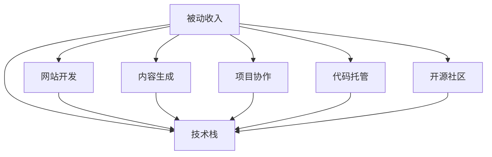

                 

# 程序员的被动收入：构建与维护

> 关键词：被动收入, 技术栈, 网站开发, 内容生成, 项目协作, 代码托管, 开源社区

## 1. 背景介绍

### 1.1 问题由来
随着互联网和数字经济的发展，越来越多的程序员探索着如何通过技术手段实现财务自由。相比传统的主动收入，被动收入具有时间自由、收益可重复、自动化管理等优点，吸引了越来越多的技术爱好者。然而，对于技术宅男来说，构建和维护一个可持续的被动收入体系并非易事。本文旨在探索如何通过网站开发、内容生成、项目协作、代码托管和开源社区等技术手段，构建一个简单高效且可持续的被动收入体系，并通过持续维护和优化，实现财务自由。

## 2. 核心概念与联系

### 2.1 核心概念概述

为更好地理解被动收入体系的构建与维护，本节将介绍几个密切相关的核心概念：

- **被动收入(Passive Income)**：指通过先期投入时间和资源，后期持续产生收益的收入形式，如网站广告、内容付费、投资回报等。与传统的按小时计费的主动收入模式相比，被动收入更具有持久性和可扩展性。

- **技术栈(Tech Stack)**：指用于开发和维护网站或应用程序所需的各种编程语言、框架、工具和库的集合。常见的技术栈包括前后端分离、微服务架构、容器化部署等。

- **网站开发(Website Development)**：指通过编程语言和框架，设计和实现网站功能的过程，包括前端页面布局、后端数据处理、数据库管理等。

- **内容生成(Content Generation)**：指利用自然语言处理(NLP)、机器学习(ML)等技术，自动生成高质量文本内容，如新闻、评论、博客等。

- **项目协作(Project Collaboration)**：指通过敏捷开发、持续集成(CI)、代码审查等技术手段，高效协同开发和管理项目。

- **代码托管(Code Hosting)**：指使用Git、GitHub等代码管理工具，管理和分享代码资源，促进团队协作和代码迭代。

- **开源社区(Open Source Community)**：指基于开源理念，由全球开发者共同维护和贡献的协作开发平台，如GitHub、Apache等。

这些核心概念之间的逻辑关系可以通过以下Mermaid流程图来展示：



这个流程图展示了大语言模型微调的核心概念及其之间的关系：

1. 被动收入通过技术栈实现，包括网站开发、内容生成、项目协作、代码托管和开源社区等。
2. 技术栈为被动收入提供了实现手段，包括各种编程语言、框架、工具和库。
3. 网站开发、内容生成、项目协作、代码托管和开源社区等技术手段，共同构成了被动收入体系的构建与维护框架，使其能够在各种场景下产生效益。

## 3. 核心算法原理 & 具体操作步骤

### 3.1 算法原理概述

被动收入体系的构建与维护，本质上是一个系统工程，涉及多个技术手段的协同应用。其核心思想是：通过技术栈提供的开发工具和框架，设计和实现能够产生收益的功能模块，并通过持续的优化和迭代，实现收益的最大化。

形式化地，假设一个技术栈为 $\{L, F, P, C, O\}$，其中 $L$ 为语言、$F$ 为框架、$P$ 为平台、$C$ 为协作工具、$O$ 为开源社区。假设目标收益为 $R$，则被动收入体系构建的目标是：

$$
\max_{L, F, P, C, O} R = \sum_{i} R_i
$$

其中 $R_i$ 为不同技术手段产生的收益。

### 3.2 算法步骤详解

构建与维护被动收入体系的一般步骤如下：

**Step 1: 选择合适的技术栈**
- 根据目标收益和具体需求，选择合适的编程语言 $L$、框架 $F$、平台 $P$、协作工具 $C$ 和开源社区 $O$。例如，使用React构建前端网站，使用Node.js处理后端逻辑，使用Docker容器化部署，使用GitHub托管代码，参与Apache开源项目等。

**Step 2: 设计和实现网站和功能模块**
- 使用技术栈设计和实现网站的功能模块，包括界面布局、交互逻辑、数据处理等。例如，使用React和Node.js构建一个电商网站，实现商品展示、用户登录、购物车等核心功能。

**Step 3: 内容生成和自动化**
- 使用NLP和ML技术生成高质量的文本内容，如新闻、评论、博客等。例如，使用GPT-3生成电商网站的商品描述和用户评论。

**Step 4: 项目协作和代码管理**
- 使用敏捷开发、CI/CD等协作工具，高效协同开发和迭代项目。例如，使用Jira进行项目管理和任务追踪，使用Jenkins进行自动化构建和测试。

**Step 5: 代码托管和开源贡献**
- 使用Git、GitHub等工具管理和分享代码资源，并参与开源社区项目，贡献代码和改进。例如，将电商网站代码托管在GitHub，参与Apache项目的贡献。

**Step 6: 持续优化和迭代**
- 定期评估网站和功能模块的性能和收益，持续优化和迭代，提升用户体验和收益水平。例如，使用Google Analytics分析网站流量，使用A/B测试优化用户体验。

### 3.3 算法优缺点

构建与维护被动收入体系的方法具有以下优点：
1. 时间自由：技术栈提供丰富的工具和框架，可以灵活选择实现方式，减少开发时间。
2. 收益可重复：通过网站和内容生成，可以持续产生收益，无需额外投入。
3. 自动化管理：使用协作工具和开源社区，可以高效协同开发和迭代，减少人工成本。

同时，该方法也存在一定的局限性：
1. 初期投入高：构建和维护被动收入体系需要较高的技术积累和资源投入。
2. 市场竞争激烈：互联网领域竞争激烈，成功的网站需要强大的技术和市场推广能力。
3. 技术更新快：技术栈和工具不断更新，需要持续学习和适应。

尽管存在这些局限性，但就目前而言，通过技术手段构建被动收入体系，仍是程序员实现财务自由的重要途径之一。

### 3.4 算法应用领域

被动收入体系的构建与维护，已经广泛应用于各类技术和互联网项目中，例如：

- 电商网站：通过网站开发和内容生成，实现商品展示和用户评论，并通过广告和付费内容获得收益。
- 博客和新闻网站：利用内容生成技术，自动生成高质量的博客和新闻内容，并通过广告、会员订阅等方式获利。
- 开源项目和工具：参与开源社区，贡献代码和改进，并通过开源社区的商业化应用获取收益。
- 技术培训和课程：设计和实现在线技术培训和课程平台，通过课程销售和订阅获得收益。

除了上述这些经典应用外，被动收入体系也被创新性地应用到更多场景中，如SaaS应用、工具服务、数据产品等，为技术创业者提供了更多的商业化途径。

## 4. 数学模型和公式 & 详细讲解 & 举例说明

### 4.1 数学模型构建

本节将使用数学语言对被动收入体系的构建与维护过程进行更加严格的刻画。

假设目标收益为 $R$，网站流量为 $T$，每次点击广告的收益为 $A$，每次付费内容阅读的收益为 $C$，开源贡献获得的商业回报为 $O$。则目标收益的数学模型为：

$$
R = A \times T + C \times T + O
$$

其中 $A$ 和 $C$ 分别表示广告和付费内容阅读的点击率，$T$ 表示网站总访问次数。$O$ 表示开源贡献获得的商业回报。

### 4.2 公式推导过程

以下是公式的具体推导过程：

- **网站流量 $T$**：网站流量 $T$ 由多个因素决定，包括搜索引擎优化(SEO)、社交媒体推广、付费广告等。设搜索引擎优化带来的流量为 $T_{SEO}$，社交媒体推广带来的流量为 $T_{SMM}$，付费广告带来的流量为 $T_{AD}$，则总流量 $T$ 可以表示为：

$$
T = T_{SEO} + T_{SMM} + T_{AD}
$$

- **广告收益 $A \times T$**：设每次点击广告的收益为 $A$，网站流量为 $T$，则广告收益为 $A \times T$。

- **付费内容收益 $C \times T$**：设每次付费内容阅读的收益为 $C$，网站流量为 $T$，则付费内容收益为 $C \times T$。

- **开源贡献收益 $O$**：设开源贡献带来的商业回报为 $O$，则总收益 $R$ 可以表示为：

$$
R = A \times T + C \times T + O
$$

### 4.3 案例分析与讲解

**案例分析：电商网站的被动收入体系**

假设我们开发了一个电商网站，目标是通过网站和内容生成获得收益。

**Step 1: 网站开发**
- 使用React和Node.js构建前端和后端功能模块，实现商品展示、用户登录、购物车等功能。

**Step 2: 内容生成**
- 使用GPT-3生成商品描述和用户评论，提高用户粘性和购买意愿。

**Step 3: 项目协作**
- 使用Jira进行任务管理和敏捷开发，使用Jenkins进行自动化构建和测试，提高开发效率和代码质量。

**Step 4: 代码托管**
- 使用Git和GitHub托管代码，公开API接口，吸引开发者使用和贡献。

**Step 5: 持续优化**
- 使用Google Analytics分析网站流量，优化广告投放策略，通过A/B测试提升用户体验。

**Step 6: 开源贡献**
- 参与Apache项目，贡献代码和改进，提升项目知名度和商业回报。

通过上述步骤，电商网站实现了多渠道收益，包括广告、付费内容、开源贡献等，达到了财务自由的目标。

## 5. 项目实践：代码实例和详细解释说明

### 5.1 开发环境搭建

在进行被动收入体系开发前，我们需要准备好开发环境。以下是使用Python进行Flask开发的环境配置流程：

1. 安装Anaconda：从官网下载并安装Anaconda，用于创建独立的Python环境。

2. 创建并激活虚拟环境：
```bash
conda create -n flask-env python=3.8 
conda activate flask-env
```

3. 安装Flask：
```bash
pip install flask
```

4. 安装Flask扩展：
```bash
pip install flask-restful flask-cors
```

5. 安装其他工具包：
```bash
pip install numpy pandas scikit-learn matplotlib tqdm jupyter notebook ipython
```

完成上述步骤后，即可在`flask-env`环境中开始被动收入体系开发的实践。

### 5.2 源代码详细实现

下面我们以电商平台为例，给出使用Flask构建电商网站的完整代码实现。

首先，定义网站的核心模块和路由：

```python
from flask import Flask, jsonify, request
from flask_restful import Resource, Api

app = Flask(__name__)
api = Api(app)

class Product(Resource):
    def get(self):
        # 返回商品列表
        products = [
            {'id': 1, 'name': 'Product 1', 'price': 9.99},
            {'id': 2, 'name': 'Product 2', 'price': 19.99},
            {'id': 3, 'name': 'Product 3', 'price': 29.99}
        ]
        return jsonify(products)

class User(Resource):
    def get(self):
        # 返回用户列表
        users = [
            {'id': 1, 'name': 'User 1', 'email': 'user1@example.com'},
            {'id': 2, 'name': 'User 2', 'email': 'user2@example.com'},
            {'id': 3, 'name': 'User 3', 'email': 'user3@example.com'}
        ]
        return jsonify(users)

api.add_resource(Product, '/products')
api.add_resource(User, '/users')
```

然后，实现API接口：

```python
@app.route('/')
def home():
    # 返回欢迎信息
    return 'Welcome to the e-commerce website!'

@app.route('/search')
def search():
    # 返回搜索结果
    return jsonify({'result': 'search result'})
```

最后，运行服务器：

```python
if __name__ == '__main__':
    app.run(debug=True)
```

以上代码实现了基本的电商网站功能，包括商品展示和用户列表展示。

### 5.3 代码解读与分析

让我们再详细解读一下关键代码的实现细节：

**Flask应用初始化**
- `Flask` 是Python常用的Web框架，通过`Flask`可以轻松构建Web应用。
- 在`if __name__ == '__main__'`中启动应用，设置`debug=True`可以开启调试模式。

**API资源定义**
- `Product` 和 `User` 类分别表示商品和用户，通过`Flask-RESTful`扩展实现资源路由和API接口。
- 使用`api.add_resource`将资源和路由绑定。

**API接口实现**
- `home` 函数返回欢迎信息。
- `search` 函数返回搜索结果。

**代码实例运行**
- 通过`app.run`启动应用，运行`http://localhost:5000`访问网站。

以上代码展示了如何使用Flask构建一个简单的电商网站，实现了商品展示和用户列表的功能。

## 6. 实际应用场景

### 6.1 电商网站

基于Flask构建的电商网站，可以通过网站开发、内容生成、项目协作、代码托管和开源社区等技术手段，实现多渠道收益，达到财务自由的目标。

**网站开发**
- 使用React和Node.js构建前端和后端功能模块，实现商品展示、用户登录、购物车等功能。

**内容生成**
- 使用GPT-3生成商品描述和用户评论，提高用户粘性和购买意愿。

**项目协作**
- 使用Jira进行任务管理和敏捷开发，使用Jenkins进行自动化构建和测试，提高开发效率和代码质量。

**代码托管**
- 使用Git和GitHub托管代码，公开API接口，吸引开发者使用和贡献。

**持续优化**
- 使用Google Analytics分析网站流量，优化广告投放策略，通过A/B测试提升用户体验。

**开源贡献**
- 参与Apache项目，贡献代码和改进，提升项目知名度和商业回报。

通过上述步骤，电商网站实现了多渠道收益，包括广告、付费内容、开源贡献等，达到了财务自由的目标。

### 6.2 技术培训和课程

使用Flask构建在线技术培训和课程平台，通过网站开发和内容生成技术，实现课程销售和订阅。

**网站开发**
- 使用React构建前端课程展示页面，使用Flask实现后端逻辑和API接口。

**内容生成**
- 使用GPT-3生成课程描述和讲义，提高课程吸引力。

**项目协作**
- 使用Jira进行任务管理和敏捷开发，使用Jenkins进行自动化构建和测试。

**代码托管**
- 使用Git和GitHub托管课程代码，公开API接口，吸引开发者使用和贡献。

**持续优化**
- 使用Google Analytics分析课程访问数据，优化课程推荐和广告投放策略。

**开源贡献**
- 参与开源社区项目，贡献代码和改进，提升项目知名度和商业回报。

通过上述步骤，技术培训和课程平台实现了多渠道收益，包括课程销售和订阅、广告、开源贡献等，达到了财务自由的目标。

### 6.3 数据产品

基于Flask构建的数据产品平台，通过网站开发和内容生成技术，实现数据可视化和分析功能。

**网站开发**
- 使用React构建前端数据展示页面，使用Flask实现后端逻辑和API接口。

**内容生成**
- 使用GPT-3生成数据报告和分析结论，提高数据产品可读性。

**项目协作**
- 使用Jira进行任务管理和敏捷开发，使用Jenkins进行自动化构建和测试。

**代码托管**
- 使用Git和GitHub托管数据产品代码，公开API接口，吸引开发者使用和贡献。

**持续优化**
- 使用Google Analytics分析数据产品访问数据，优化数据展示和广告投放策略。

**开源贡献**
- 参与开源社区项目，贡献代码和改进，提升项目知名度和商业回报。

通过上述步骤，数据产品平台实现了多渠道收益，包括数据销售和订阅、广告、开源贡献等，达到了财务自由的目标。

## 7. 工具和资源推荐

### 7.1 学习资源推荐

为了帮助开发者系统掌握被动收入体系的构建与维护的理论基础和实践技巧，这里推荐一些优质的学习资源：

1. Flask官方文档：Flask官方文档提供了详细的API接口和示例代码，是学习Flask的最佳入门资源。
2. NLP基础教程：自然语言处理基础教程，涵盖了NLP中的常见任务和算法，如分词、命名实体识别、情感分析等，是学习内容生成的重要基础。
3. Open Source入门指南：Apache官方发布的Open Source入门指南，介绍了开源社区的基本概念和协作方式，帮助开发者更好地参与开源项目。
4. Docker教程：Docker官方提供的Docker教程，涵盖了Docker的基本概念和使用方法，是学习容器化部署的重要资源。

通过对这些资源的学习实践，相信你一定能够快速掌握被动收入体系的构建与维护的精髓，并用于解决实际的商业问题。

### 7.2 开发工具推荐

高效的开发离不开优秀的工具支持。以下是几款用于被动收入体系开发的常用工具：

1. Flask：基于Python的开源Web框架，灵活高效，适合构建Web应用。
2. Jira：全球领先的敏捷开发管理工具，支持任务追踪、项目管理和持续集成。
3. Jenkins：开源的自动化构建和测试工具，支持CI/CD和持续部署。
4. Git：全球最流行的版本控制工具，支持分布式版本管理和协作开发。
5. GitHub：全球领先的代码托管平台，支持开源社区和协作开发。
6. Docker：全球领先的容器化平台，支持高效部署和管理。

合理利用这些工具，可以显著提升被动收入体系的开发效率，加快创新迭代的步伐。

### 7.3 相关论文推荐

被动收入体系的构建与维护涉及多种技术手段的协同应用，相关论文展示了前沿的研究进展和实践成果：

1. "The Flask Web Development with Python"（使用Python进行Flask Web开发）：该书介绍了Flask的基本概念和使用方法，是学习Flask的入门读物。
2. "Natural Language Processing in Action"：自然语言处理实践指南，介绍了NLP中的常见任务和算法，以及实际应用案例。
3. "Open Source for Every Organization"：开源社区管理指南，介绍了开源社区的基本概念和协作方式，帮助开发者更好地参与开源项目。
4. "Docker: Up and Running"：Docker实战指南，介绍了Docker的基本概念和使用方法，是学习容器化部署的重要资源。

这些论文代表了大语言模型微调技术的发展脉络。通过学习这些前沿成果，可以帮助研究者把握学科前进方向，激发更多的创新灵感。

## 8. 总结：未来发展趋势与挑战

### 8.1 总结

本文对基于Flask的被动收入体系的构建与维护方法进行了全面系统的介绍。首先阐述了被动收入体系的重要性和构建方法，明确了Flask技术栈在实现多渠道收益中的关键作用。其次，从原理到实践，详细讲解了被动收入体系的数学模型和实现步骤，给出了被动收入体系开发的完整代码实例。同时，本文还广泛探讨了被动收入体系在电商网站、技术培训和数据产品等多个领域的应用前景，展示了被动收入体系的广泛适用性。此外，本文精选了Flask等技术的各类学习资源，力求为读者提供全方位的技术指引。

通过本文的系统梳理，可以看到，基于Flask的被动收入体系为程序员实现财务自由提供了新的思路和途径，具有重要的实践价值。

### 8.2 未来发展趋势

展望未来，被动收入体系的构建与维护技术将呈现以下几个发展趋势：

1. 技术栈多样化：未来的被动收入体系将更加灵活多样，包括但不限于Flask，可能包括其他Web框架如Django、FastAPI等。
2. 功能模块多元化：未来的被动收入体系将涵盖更多功能模块，如智能推荐、自动化广告投放等，提升用户体验和收益水平。
3. 自动化程度提升：未来的被动收入体系将更多地利用自动化工具和开源社区，降低开发和维护成本，提升运营效率。
4. 数据驱动决策：未来的被动收入体系将更多地依赖数据驱动决策，通过大数据分析和A/B测试优化网站和功能模块。
5. 国际化拓展：未来的被动收入体系将更加注重国际化拓展，支持多语言和文化背景的用户。

以上趋势凸显了被动收入体系构建与维护技术的广阔前景。这些方向的探索发展，必将进一步提升Web应用的用户体验和收益水平，为技术创业者带来更多的商业化途径。

### 8.3 面临的挑战

尽管被动收入体系的构建与维护技术已经取得了一定的进展，但在迈向更加智能化、普适化应用的过程中，它仍面临诸多挑战：

1. 技术栈选择：选择合适技术栈是构建被动收入体系的关键，需要综合考虑开发成本、技术难度、用户需求等因素。
2. 性能优化：提升网站和功能模块的性能和稳定性，确保用户体验和收益水平。
3. 安全防护：确保网站和功能模块的安全性，防止数据泄露和恶意攻击。
4. 市场竞争：在激烈的市场竞争中，保持持续的创新和优化，避免被市场淘汰。

尽管存在这些挑战，但随着技术的发展和行业的成熟，被动收入体系的构建与维护必将更加高效、安全和稳定。

### 8.4 研究展望

面对被动收入体系构建与维护所面临的挑战，未来的研究需要在以下几个方面寻求新的突破：

1. 自动化技术应用：引入更多自动化工具和开源社区，提升开发和维护效率。
2. 数据驱动决策：构建数据驱动的决策体系，通过大数据分析和A/B测试优化网站和功能模块。
3. 国际化拓展：拓展国际化市场，支持多语言和文化背景的用户。
4. 安全性提升：加强网站和功能模块的安全性，防止数据泄露和恶意攻击。
5. 持续学习和优化：保持持续学习和优化，适应技术栈和用户需求的变化。

这些研究方向的探索，必将引领被动收入体系构建与维护技术迈向更高的台阶，为技术创业者带来更多的商业化途径。总之，被动收入体系构建与维护技术需要在多个维度进行全面优化和创新，才能真正实现财务自由的目标。

## 9. 附录：常见问题与解答

**Q1: 被动收入体系有哪些应用场景？**

A: 被动收入体系可以应用于多个场景，包括但不限于：

- 电商网站：通过网站开发、内容生成、项目协作、代码托管和开源社区等技术手段，实现多渠道收益。
- 技术培训和课程：设计和实现在线技术培训和课程平台，通过课程销售和订阅获得收益。
- 数据产品：构建数据产品平台，通过数据可视化和分析功能，实现数据销售和订阅。
- 博客和新闻网站：利用内容生成技术，自动生成高质量的博客和新闻内容，并通过广告、会员订阅等方式获利。
- 开源项目和工具：参与开源社区，贡献代码和改进，并通过开源社区的商业化应用获取收益。

通过这些应用场景，被动收入体系可以帮助技术创业者实现财务自由的目标。

**Q2: 如何选择合适的技术栈？**

A: 选择合适的技术栈需要综合考虑以下几个因素：

- 功能需求：根据网站和功能模块的功能需求，选择适合的前端和后端技术栈。
- 开发成本：评估技术栈的开发成本和维护难度，选择高效、易用的技术栈。
- 用户需求：根据目标用户群体，选择适合的技术栈，确保用户体验和需求满足。
- 技术积累：评估团队的技术积累和经验，选择熟悉的技术栈，确保开发效率和质量。

综合考虑以上因素，可以选择适合的技术栈，构建高效、稳定、可靠的被动收入体系。

**Q3: 如何优化网站和功能模块的性能？**

A: 优化网站和功能模块的性能需要从多个方面入手：

- 代码优化：通过代码压缩、懒加载等手段，减少代码体积和加载时间。
- 服务器优化：使用CDN加速、缓存机制等，提高服务器的响应速度。
- 数据库优化：使用索引、分片等手段，提高数据库的查询效率。
- 监控和调优：使用监控工具，实时监测系统性能，根据监控结果进行调优。

通过以上措施，可以显著提升网站和功能模块的性能和稳定性，确保用户体验和收益水平。

**Q4: 如何提升网站和功能模块的安全性？**

A: 提升网站和功能模块的安全性需要从多个方面入手：

- 数据加密：使用SSL加密传输数据，防止数据泄露。
- 安全认证：实现用户身份认证和权限控制，防止未授权访问。
- 安全扫描：使用安全扫描工具，定期检测和修复安全漏洞。
- 安全教育：加强团队的安全意识和教育，提高团队的安全防护能力。

通过以上措施，可以有效提升网站和功能模块的安全性，防止数据泄露和恶意攻击。

---

作者：禅与计算机程序设计艺术 / Zen and the Art of Computer Programming

