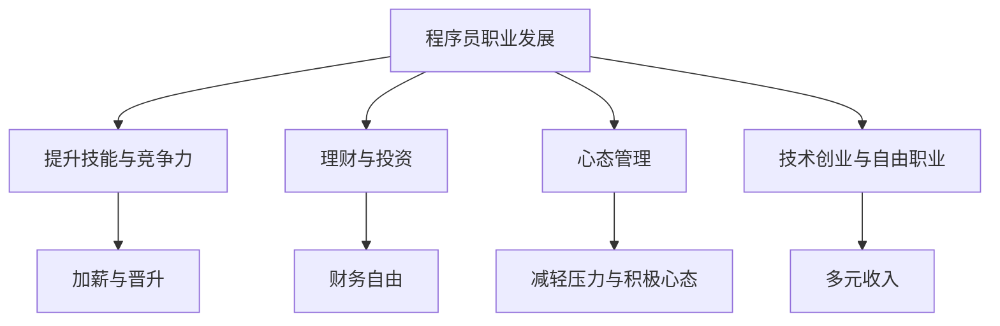

                 

# 程序员的财务自由：极简主义实践

> 关键词：程序员,财务自由,极简主义,编程,投资理财,心态调整,技能提升,技术创新,自由职业,创业

## 1. 背景介绍

### 1.1 问题由来
在当今高度竞争的科技行业中，程序员（尤其是有技术含量的程序员）收入相对较高，但在激烈的职场竞争和快速发展的技术要求下，依然面临着巨大压力。财务自由（Financial Independence）不仅仅意味着拥有足够的资金供日常消费和应急，更重要的是能够在不受财务束缚的前提下，实现个人价值和理想的最大化。

程序员实现财务自由的道路，既充满挑战，也充满机遇。在财富积累的初期阶段，资金主要来自工资收入，此时理财的重要性在于合理利用手头资源，避免不必要的浪费，为未来的投资和创业积累资本。而在财务自由实现后，如何保持和扩大财务自由，成为了一个持续的课题。

### 1.2 问题核心关键点
程序员实现财务自由的关键在于：
- 提升编程技能和专业竞争力，提高薪资收入。
- 优化理财观念，合理配置资产，实现财富增值。
- 心态调整与压力管理，保持积极心态，持续学习与创新。
- 技术创业与自由职业，通过技术创新实现财务自由。
- 财务自由之后的管理与再投资，确保财富持续增长。

本文将围绕程序员实现财务自由的几个关键点，详细探讨极简主义在财富积累和理财投资中的应用，并提供一些实际可行的建议。

## 2. 核心概念与联系

### 2.1 核心概念概述

实现程序员财务自由，涉及多个核心概念，这些概念通过以下逻辑关系紧密联系：

- **程序员职业发展**：程序员需要通过提升技能、掌握新技术、参与项目等方式，提高自身在职场中的竞争力，从而获得更高的薪资收入。
- **极简主义**：极简主义是一种倡导简化生活、减少物质消费，以达到心灵自由和财务自由的生活哲学。
- **理财与投资**：理财和投资是实现财务自由的关键手段，通过合理配置资产，分散风险，实现财富增值。
- **心态管理**：财务自由并非一蹴而就，心态管理在实现过程中至关重要，如调整心态，减轻压力，保持积极的生活态度。
- **技术创业与自由职业**：利用技术创新，创建个人品牌或自由职业，实现收入多元化，提升财务自由的可能性。

这些概念共同构成了程序员实现财务自由的主要框架，通过这些概念的协同作用，程序员可以逐步实现财务自由的目标。

### 2.2 核心概念原理和架构的 Mermaid 流程图



这个流程图展示了程序员实现财务自由的逻辑路径：通过提升技能获得加薪，同时合理理财和投资实现财务自由；通过心态管理减轻压力，通过技术创业或自由职业增加多元收入。

## 3. 核心算法原理 & 具体操作步骤

### 3.1 算法原理概述

极简主义在理财和投资中的原理，是通过减少不必要的开支，增加收入，合理配置资产，来实现财富的最大化。算法原理可以简单概括为以下几个步骤：

1. **收入提升**：通过持续学习、提升技能和专业竞争力，增加个人收入。
2. **支出削减**：减少不必要的消费，通过生活简化，降低生活成本。
3. **资产配置**：根据风险偏好和投资目标，合理配置资产，分散风险。
4. **投资增值**：通过长期的投资，实现资产的复利增值。
5. **财务监控**：持续监控财务状况，适时调整策略，确保目标实现。

### 3.2 算法步骤详解

以下是程序员实现财务自由的详细步骤：

**Step 1: 制定财务计划**
- 计算月收入和月支出，明确储蓄目标。
- 设定短期（1-3年）和长期（5-10年）财务目标。

**Step 2: 优化收入**
- 持续学习新技能，提高职场竞争力，争取加薪和晋升机会。
- 利用业余时间参与自由职业项目或技术创业，增加多元收入。

**Step 3: 简化生活**
- 减少不必要的开支，如奢侈品的购买、高昂的娱乐活动等。
- 优化家庭生活，如共享出行、共享居住，降低生活成本。

**Step 4: 资产配置**
- 配置高风险、高收益的资产，如股票和基金，以获得较高的回报。
- 配置低风险、稳定收益的资产，如债券和定期存款，以保障基本生活需求。

**Step 5: 投资增值**
- 长期持有优质资产，利用复利效应实现财富增长。
- 定期重新平衡资产配置，确保投资组合始终符合风险偏好和投资目标。

**Step 6: 财务监控**
- 定期检查财务状况，评估投资表现，及时调整投资策略。
- 设立应急基金，防止突发事件影响财务自由。

### 3.3 算法优缺点

**优点**：
- 简化了生活，降低了生活成本。
- 通过优化收入和资产配置，实现了财富的有效积累。
- 长期投资增值，为财务自由提供了稳定的资金来源。

**缺点**：
- 需要较强的自律和规划能力，才能坚持极简生活方式。
- 投资具有不确定性，存在一定的风险。
- 需要持续学习和提升技能，以应对职场变化和投资市场的波动。

### 3.4 算法应用领域

极简主义在程序员实现财务自由中的应用领域，主要涵盖以下几个方面：

- **职场发展**：通过提升技能，优化工作流程，提升薪资收入。
- **个人理财**：通过减少开支，合理配置资产，实现财富增值。
- **生活管理**：简化生活，减轻压力，提升生活质量。
- **投资决策**：制定长期投资计划，分散风险，实现资本增值。

## 4. 数学模型和公式 & 详细讲解 & 举例说明

### 4.1 数学模型构建

为更好地理解和实现程序员的财务自由，本文将构建一个简化的财务模型。假设程序员的年收入为 $I$，年支出为 $C$，储蓄率为 $S$，投资年回报率为 $R$。设初始财富为 $W_0$，目标财富为 $W_t$，财务自由的定义是资产能够覆盖未来 $t$ 年的生活费用。

**财务自由模型**：
$$
W_t = W_0 + (1+S)(I - C) \left( \frac{1-(1+R)^{-t}}{R} \right)
$$

**投资回报公式**：
$$
FV = PV \times (1+R)^t
$$

其中，$PV$ 表示现值，$FV$ 表示未来价值。

### 4.2 公式推导过程

**现值与未来值的转换**：
$$
PV = \frac{FV}{(1+R)^t}
$$

**投资增值计算**：
$$
PV = \frac{W_0}{(1+R)^0} = W_0
$$
$$
FV = PV \times (1+R)^t = W_0 \times (1+R)^t
$$

**财务自由计算**：
$$
W_t = W_0 + (1+S)(I - C) \left( \frac{1-(1+R)^{-t}}{R} \right)
$$

通过上述模型，我们可以计算出在一定储蓄率和投资回报率下，达到财务自由所需的年数 $t$。

### 4.3 案例分析与讲解

**案例分析**：
假设程序员年税后收入 $I = 100,000$ 元，年支出 $C = 50,000$ 元，储蓄率 $S = 0.3$，投资年回报率 $R = 5\%$。设目标财富为 $W_t = 1,000,000$ 元，即未来 10 年的生活费用。

将数据代入模型，解得：
$$
t = \frac{\log \left( \frac{W_t - W_0}{(1+S)(I - C) \left( \frac{1}{R} \right)} \right)}{\log(1+R)}
$$

通过计算，我们发现达到财务自由所需的年数 $t$ 约为 14 年。

## 5. 项目实践：代码实例和详细解释说明

### 5.1 开发环境搭建

实现财务自由的应用程序开发，需要以下开发环境：

- **编程语言**：Python
- **开发框架**：Flask
- **数据库**：SQLite
- **财务分析库**：pandas、numpy
- **数据可视化库**：matplotlib、seaborn

**开发流程**：
1. 安装Python和相关库。
2. 搭建Flask开发环境。
3. 创建SQLite数据库，存储财务数据。
4. 编写API接口，进行数据读写和财务分析。
5. 实现网页界面，显示财务数据和分析结果。

### 5.2 源代码详细实现

以下是一个简单的财务自由计算应用实现，用于演示如何使用Python进行财务分析。

```python
import pandas as pd
import numpy as np
from flask import Flask, jsonify, request
from sqlalchemy import create_engine

app = Flask(__name__)

# 配置SQLite数据库连接
engine = create_engine('sqlite:///freedom.db')

# 定义财务自由模型
def calculate_financial_freedom(I, C, S, R, W_t):
    t = np.log((W_t - W_0) / ((1+S)*(I - C)*(1/R))) / np.log(1+R)
    return t

# 添加数据接口
@app.route('/data', methods=['POST'])
def add_data():
    data = request.get_json()
    W_0 = data['initial_wealth']
    I = data['income']
    C = data['expenses']
    S = data['savings_rate']
    R = data['interest_rate']
    W_t = data['target_wealth']
    t = calculate_financial_freedom(I, C, S, R, W_t)
    return jsonify({'time_to_freedom': t})

# 显示财务数据
@app.route('/data', methods=['GET'])
def show_data():
    df = pd.read_sql_query('SELECT * FROM financial_data', engine)
    return jsonify(df.to_dict(orient='records'))

if __name__ == '__main__':
    app.run(debug=True)
```

### 5.3 代码解读与分析

**财务自由计算函数**：
```python
def calculate_financial_freedom(I, C, S, R, W_t):
    t = np.log((W_t - W_0) / ((1+S)*(I - C)*(1/R))) / np.log(1+R)
    return t
```
该函数接收输入的年税后收入、年支出、储蓄率、投资年回报率和目标财富，使用公式计算达到财务自由所需的年数 $t$。

**API接口**：
```python
@app.route('/data', methods=['POST'])
def add_data():
    data = request.get_json()
    W_0 = data['initial_wealth']
    I = data['income']
    C = data['expenses']
    S = data['savings_rate']
    R = data['interest_rate']
    W_t = data['target_wealth']
    t = calculate_financial_freedom(I, C, S, R, W_t)
    return jsonify({'time_to_freedom': t})
```
通过POST请求方式，添加新的财务数据，调用财务自由计算函数，返回计算结果。

**显示财务数据**：
```python
@app.route('/data', methods=['GET'])
def show_data():
    df = pd.read_sql_query('SELECT * FROM financial_data', engine)
    return jsonify(df.to_dict(orient='records'))
```
通过GET请求方式，显示已有的财务数据，返回存储在SQLite数据库中的所有数据。

### 5.4 运行结果展示

**运行界面**：
```python
from flask import Flask, jsonify, request
from sqlalchemy import create_engine

app = Flask(__name__)

# 配置SQLite数据库连接
engine = create_engine('sqlite:///freedom.db')

# 定义财务自由模型
def calculate_financial_freedom(I, C, S, R, W_t):
    t = np.log((W_t - W_0) / ((1+S)*(I - C)*(1/R))) / np.log(1+R)
    return t

# 添加数据接口
@app.route('/data', methods=['POST'])
def add_data():
    data = request.get_json()
    W_0 = data['initial_wealth']
    I = data['income']
    C = data['expenses']
    S = data['savings_rate']
    R = data['interest_rate']
    W_t = data['target_wealth']
    t = calculate_financial_freedom(I, C, S, R, W_t)
    return jsonify({'time_to_freedom': t})

# 显示财务数据
@app.route('/data', methods=['GET'])
def show_data():
    df = pd.read_sql_query('SELECT * FROM financial_data', engine)
    return jsonify(df.to_dict(orient='records'))

if __name__ == '__main__':
    app.run(debug=True)
```

**运行结果**：
```bash
$ python freedom.py
* Running on http://127.0.0.1:5000/ (Press CTRL+C to quit)
```

访问 `http://127.0.0.1:5000/data`，可以添加和查看财务数据，使用后端API计算财务自由时间。

## 6. 实际应用场景

### 6.1 智能投资理财

智能投资理财是程序员实现财务自由的重要工具。利用Python、机器学习和数据分析技术，程序员可以构建个性化的投资组合，实现最优收益和风险平衡。例如，基于历史数据的股票筛选和买卖策略优化，或者利用强化学习进行动态资产配置，都是可行的方案。

### 6.2 技术创业与自由职业

技术创业和自由职业为程序员提供了实现财务自由的另外一条道路。通过将自己的技术优势转化为商业价值，程序员可以摆脱薪资收入的限制，获取更高的回报。同时，自由职业提供了更加灵活的工作方式，可以在保证工作量的同时，增加收入渠道。

### 6.3 投资组合管理

投资组合管理是程序员实现财务自由的另一重要工具。通过合理配置不同种类的资产，如股票、债券、基金等，可以降低投资风险，实现资本增值。例如，利用Python的pandas和numpy库进行数据分析和计算，可以构建高效的投资组合模型。

## 7. 工具和资源推荐

### 7.1 学习资源推荐

- **Python编程**：《Python编程：从入门到实践》
- **Flask框架**：《Flask Web开发》
- **SQLite数据库**：《SQLite 3 入门》
- **财务分析**：《Python金融分析实战》
- **数据分析与可视化**：《Python数据科学手册》

### 7.2 开发工具推荐

- **编程语言**：Python
- **开发框架**：Flask
- **数据库**：SQLite
- **财务分析库**：pandas、numpy
- **数据可视化库**：matplotlib、seaborn

### 7.3 相关论文推荐

- **智能投资**：《基于机器学习的智能投资策略研究》
- **技术创业**：《程序员的创新之路：技术创业指南》
- **投资组合管理**：《资产配置理论与实践》

## 8. 总结：未来发展趋势与挑战

### 8.1 研究成果总结

本文详细探讨了程序员实现财务自由的极简主义实践，从收入提升、支出削减、资产配置、投资增值和心态管理等方面，提供了系统化的解决方案。通过构建财务自由模型，分析了不同参数对财务自由时间的影响。

### 8.2 未来发展趋势

未来的财务自由实践，将朝着更加智能化、自动化和个性化方向发展。

- **AI辅助投资**：利用AI技术，实现智能投资策略和动态资产配置，提升投资效率和回报。
- **区块链与去中心化理财**：区块链技术为财务自由提供了新的解决方案，去中心化理财将带来更高的透明度和安全性。
- **数据驱动决策**：大数据和人工智能技术，将推动财务自由实践的数据驱动化，实现更加精准的决策支持。

### 8.3 面临的挑战

实现财务自由，程序员需要面对以下挑战：

- **技能提升与知识更新**：技术快速迭代，需要不断学习新技能，更新知识体系。
- **市场风险与不确定性**：投资市场存在不确定性，需要具备较强的风险管理能力。
- **心态调整与压力管理**：财务自由并非一蹴而就，需要保持良好的心态和压力管理能力。
- **时间与精力投入**：财务自由需要大量的时间和精力投入，需要合理安排工作和生活的平衡。

### 8.4 研究展望

未来的研究将围绕以下方向展开：

- **个性化财务规划**：利用AI技术，实现个性化的财务规划和投资策略，提供更加精准的建议。
- **跨领域融合**：将财务自由实践与区块链、大数据、人工智能等新兴技术结合，推动技术创新。
- **心理与行为研究**：研究财务自由对个人心态、行为和生活方式的影响，推动心理健康和幸福感的提升。

## 9. 附录：常见问题与解答

**Q1：如何平衡工作与生活？**

A: 程序员实现财务自由需要合理分配时间和精力。可以通过时间管理技巧，如番茄工作法、时间块等，提高工作效率。同时，保持健康的生活方式，如适量运动、合理饮食，有助于缓解工作压力，提升生活质量。

**Q2：如何应对投资市场的不确定性？**

A: 投资市场存在不确定性，需要具备较强的风险管理能力。可以通过多元化投资、分散风险、定期评估投资组合等方式，降低投资风险。同时，不断学习金融知识，提升投资决策的科学性。

**Q3：如何提升编程技能？**

A: 提升编程技能需要持续学习和实践。可以通过参加在线课程、阅读技术书籍、参与开源项目等方式，不断学习和提升。同时，参加技术交流和会议，与同行交流经验，也能促进技能提升。

**Q4：如何应对心态管理中的挑战？**

A: 心态管理需要积极的心态和应对压力的方法。可以通过运动、冥想、社交等方式，缓解压力，保持积极的心态。同时，保持生活目标和兴趣，有助于提升心理健康和生活幸福感。

**Q5：如何利用技术创业实现财务自由？**

A: 技术创业需要具备创新思维和商业模式。可以通过技术优势，解决实际问题，形成产品或服务，吸引用户。同时，注重市场调研和用户体验，提升产品和服务的竞争力。

**Q6：如何利用数据驱动财务决策？**

A: 数据驱动决策需要掌握数据分析和机器学习技术。可以通过Python等工具，对财务数据进行分析和预测，制定更加科学的财务决策。同时，不断学习新技术，提升数据分析能力。

以上是程序员实现财务自由的关键步骤和建议，通过系统化的规划和执行，程序员可以逐步实现财务自由的目标。希望本文能够为读者提供有价值的参考，助力程序员实现梦想中的财务自由。

---

作者：禅与计算机程序设计艺术 / Zen and the Art of Computer Programming

